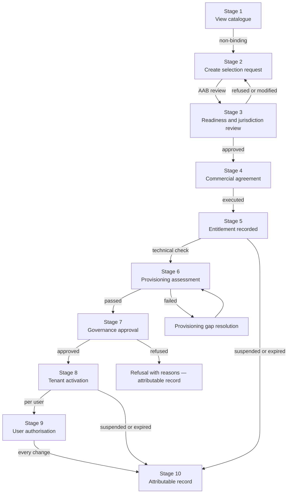

# AAB Buyer Journey Design Record — 2026-09-23

**Status:** GOVERNANCE DESIGN RECORD — NOT IMPLEMENTATION
**Authority:** DEFINES THE GOVERNED BUYER JOURNEY ARCHITECTURE. Does not admit
any capability. Does not grant commercial, production, commissioning or
regulatory authority. CAP-20 and CAP-21 canonical contracts will be designed
from this record.

## The governing rule

> Everything may be truthfully visible; anything may be requested; only
> contracted, implemented, admitted, provisioned and authorised capabilities
> may be activated.

## The critical separations

Every transition in the buyer journey is distinct. These must never be collapsed:

- Selection is not purchase
- Purchase is not entitlement
- Entitlement is not provisioning
- Provisioning is not governance admission
- Activation is not user authority

A commercial agreement must not automatically activate anything. Selecting an
entire domain must not silently enable every present and future capability
within it.

## Who the buyer is — six roles, not one

AAB transactions involve several distinct parties who must not be collapsed into
a single buyer record:

| Role | Meaning |
|---|---|
| `requestingOrganisation` | The organisation expressing interest in AAB |
| `contractingParty` | The legal entity signing the commercial agreement |
| `payingParty` | The organisation making payment |
| `beneficiaryOrganisation` | The organisation receiving the capability entitlement |
| `countryAuthority` | The government or national body with oversight responsibility |
| `tenantOwner` | The party responsible for the sovereign country environment |
| `authorisedSignatory` | The named individual with authority to commit |

These will sometimes be the same organisation. In a typical Thai deployment, a
government ministry might be the `countryAuthority` and `tenantOwner`, a
commercial exporter the `contractingParty` and `payingParty`, and a rubber
cooperative the `beneficiaryOrganisation`. A development funder might be the
`payingParty` while the cooperative is the `beneficiaryOrganisation`.

Every role must be explicitly recorded. No role may be assumed.

## Country deployment — two layers

**Layer 1 — Country deployment agreement**

Who is responsible for the sovereign country environment itself. This is a
sovereignty and governance instrument involving government parties, data
residency commitments, and ongoing operational responsibilities. The
`tenantOwner` is typically a government agency, national institution, or
formally constituted consortium.

**Layer 2 — Participant entitlements within the country environment**

Within the deployed environment, individual organisations have separate
entitlements for specific domains and capabilities. A commercial exporter
holds an SCS domain entitlement. A research institution holds an AGR domain
entitlement. A cooperative may hold a subsidised subset of SCS capabilities
through a mandate from the exporter they supply or through development funding.

The country deployment agreement does not automatically entitle any participant.
Every participant requires their own explicitly governed entitlement record.

## The ten-stage buyer journey

### Stage 1 — Catalogue visibility

The buyer views the complete platform catalogue across all domains and
capabilities. Every item displays its truthful maturity status. A roadmap
capability is never shown as purchasable merely because it is visible.

Each catalogue entry carries separate fields:

| Field | Meaning |
|---|---|
| `maturityStatus` | What the capability actually is today |
| `catalogueVisibility` | Whether it appears in the catalogue |
| `requestabilityStatus` | Whether it can be selected |
| `commercialAvailability` | Whether it has a commercial offer |
| `jurisdictionAvailability` | Whether it is available in this country |
| `implementationStatus` | Whether an implementation exists |
| `admissionStatus` | Whether it has passed governance review |
| `provisioningStatus` | Whether it can be deployed in a country environment |
| `activationStatus` | Whether it is active for this tenant |

### Stage 2 — Selection request

The buyer filters by country, domain, organisation type, and maturity. They
select domains and optionally individual capabilities. This creates a
non-binding selection request — not a commercial commitment.

A selection request records:
- Which organisation is requesting
- Which domains and capabilities are selected
- Which country and jurisdiction
- The buyer's stated purpose
- The date of the request

Selection is not purchase. A selection request does not create an obligation
on either party.

### Stage 3 — Readiness and jurisdiction review

AAB reviews the selection request against:
- Jurisdiction readiness — is the capability available in this country?
- Implementation readiness — is the capability implemented and admitted?
- Hosting and sovereignty requirements — can a compliant country environment be
  deployed?
- Governance requirements — are there regulatory or governance prerequisites?
- Dependency completeness — do all required capabilities exist and are available?

The review may result in approval to proceed, a requirement for additional
information, a modified scope, or a refusal with reasons.

### Stage 4 — Commercial agreement

Commercial terms are negotiated following the pricing principles in
`governance/AAB-COMMERCIAL-PRICING-PRINCIPLES-2026-09-23.md`. The agreement
records:
- The parties and their roles
- The scope of the agreement — domains, capabilities, jurisdictions
- The term — start date, end date, renewal conditions
- The commercial terms — in the external agreement document, not in the platform
- Subsidy and sponsor arrangements — explicit, never unexplained
- Termination conditions

For the initial engagement, the commercial agreement covers a paid institutional
discovery or controlled pilot — not a production licence.

### Stage 5 — Entitlement recorded

On execution of the commercial agreement, an entitlement record is created in
the platform. The entitlement record stores:
- What the organisation is entitled to use — domains, capabilities, version
- Who the entitlement is for — the beneficiary organisation
- Who authorised it — the contracting party and authorised signatory
- The term — effective dates
- The commercial agreement reference — a pointer, not the financial terms
- The sponsor — explicit if subsidised
- The current status — active, suspended, expired, superseded

The entitlement record does not store prices. It enforces access.

### Stage 6 — Provisioning assessment

A technical assessment confirms:
- Can a sovereign country environment be deployed for this jurisdiction?
- Are the entitled capabilities technically available for deployment?
- Have all governance admission requirements been met?
- Are all dependencies met?
- What is the implementation timeline?

Provisioning assessment is separate from commercial agreement. An entitlement
may exist while provisioning is pending.

### Stage 7 — Governance approval

Platform Owner and authorised country governance approve activation. This
includes:
- Confirming the country environment meets sovereignty requirements
- Confirming the capabilities are admitted and production-ready
- Confirming the entitlement is valid and current
- Issuing a formal activation authorisation

No capability may be activated without governance approval, regardless of
commercial entitlement. Governance approval is not automatic.

### Stage 8 — Tenant activation

The country environment is provisioned and entitled capabilities are activated
for the tenant. Activation is per-capability — not per-domain. A domain
entitlement does not activate all capabilities within the domain simultaneously.

Capabilities on the roadmap remain visible but not executable, even within an
activated tenant environment. The activation status of each capability is
independently tracked.

### Stage 9 — User authorisation

Individual users are assigned roles and permissions within the activated
environment. User authorisation is separate from tenant activation. An
activated environment does not automatically authorise all users within the
organisation.

User authorisation records:
- Which user
- Which organisation
- Which capabilities they may operate
- Under what conditions
- Who granted the authorisation and when

### Stage 10 — Attributable record

Every activation, refusal, suspension, expiry, and supersession receives a
permanent, attributable record. The record includes:
- What happened
- When it happened
- Who authorised it
- What evidence supported it
- What the previous state was
- What triggered the change

No state change is unrecorded.

## The full lifecycle diagram

## What a roadmap capability shows in the catalogue

A capability that is not yet implemented and not yet admitted must display:

- Its intended purpose — what it will do when admitted
- Its current maturity — `CONCEPT_PREVIEW_NOT_IMPLEMENTED` or
  `DESIGN_CONTRACT_COMPLETE_NOT_IMPLEMENTED`
- Its requestability — `NOT_YET_REQUESTABLE` if not ready
- Its commercial availability — `NOT_YET_AVAILABLE`
- Its estimated availability — honest, not a sales commitment
- Its dependencies — what must exist before it can be activated

It must not display:
- A purchase button
- A price
- An activation path
- Any implication that it is currently operational

## CAP-20 and CAP-21 scope

**CAP-20 — Country Capability Catalogue and Selection**

CAP-20 is a platform-wide control-plane capability governing catalogue
visibility, filtering, selection requests, and truthful availability disclosure
across all domains — AGR, SCS, and future domains. It is not a country-level
or domain-specific capability. Its existing `ACTIVE` and `LAUNCH_RELEASE`
roster fields record capability identity status and build-plan scope — they do
not imply implementation, admission, or commercial availability. Any buyer-facing
catalogue must take maturity from the manifest's `fidelity` field, not from
`ACTIVE` or `LAUNCH_RELEASE` alone.

**CAP-21 — Commercial Agreement and Entitlement Management**

CAP-21 is a platform-wide control-plane capability governing commercial
agreements, entitlement records, suspension, expiry, and supersession across
all domains. It stores entitlement scope, term, sponsor, and status with a
reference to an external commercial agreement. It does not store prices. It
enforces entitlement status — active or not — and maintains the attributable
record of every commercial state change.

Both capabilities govern the platform as a whole. They must not be scoped to
a single domain.

## What this document does not establish

- It does not admit CAP-20 or CAP-21 as canonical capabilities
- It does not implement any buyer journey functionality
- It does not create any commercial entitlement
- It does not commit AAB to any specific price, timeline, or availability date
- It does not grant production, commissioning, regulatory or compliance authority
- It does not supersede the governance admission requirements for any capability
