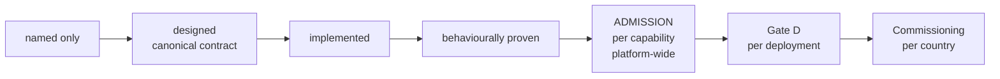

# AAB Capability Admission Authority — Definition — 2026-09-27

**Status:** GOVERNANCE DEFINITION — DRAFT FOR FINAL REVIEW — NOT COMMITTED
**Authority:** DEFINES WHAT CAPABILITY ADMISSION DECIDES, THE EVIDENCE IT REQUIRES, WHO MAY DECIDE IT, AND ITS FAIL-CLOSED RULE. This document admits no capability, grants Gate D to nothing, commissions nothing, and changes no control's status.
**Sources:**
- `governance/AAB-PLATFORM-PURPOSE-AND-VALUES-REVISION-2026-09-25.md` (the five maturity states)
- `governance/workstream-b/GOVERNED-EVIDENCE-WATCH-CANDIDATE-DESIGN-2026-09-20.md` (the ten-point admission checklist)
- `governance/workstream-b/AGR-CROSS-INSTITUTIONAL-LANDSCAPE-CANDIDATE-01-2026-09-22.md` (the decisive admission test)
- `governance/AAB-CAP-20-COUNTRY-CAPABILITY-CATALOGUE-AND-SELECTION-CANONICAL-CONTRACT-2026-09-23.md` (admission status and its authoritative source)
- `governance/AAB-BUYER-JOURNEY-DESIGN-RECORD-2026-09-23.md`
- `governance/AAB-PLATFORM-DOMAIN-SEPARATION-DECISION-2026-09-25.md`
- `governance/workstream-b/AAB-WORKSTREAM-B-CAPABILITY-LANDSCAPE-LAUNCH-GAP-FREEZE-2026-09-19.md`
- `governance/workstream-b/CAP-34-GOVERNED-AAB-SIMULATION-DESIGN.md` and `CAP-34-CAPABILITY-FIDELITY-MANIFEST-CONTRACT.md`
- `governance/workstream-b/SCS-CAPABILITY-IDENTITY-ROSTER-2026-09-22.md` and `SCS-SUPPLY-CHAIN-SOVEREIGNTY-DOMAIN-DEFINITION-2026-09-22.md`
- the "What this document does not establish" section of every canonical contract
- `scs-pilot/README.md` (`TODO(actor-reference)`)
- `governance/AAB-GATE-D-DEPLOYMENT-QUALIFICATION-DEFINITION-2026-09-27.md`
- `governance/AAB-PLATFORM-ROADMAP-2026-09-27.md`

## Why this definition is needed

**Admission is required everywhere, and no one is named to decide it.**
- **The maturity state is defined.** The purpose revision defines **Admitted**: "The capability has passed the ten-point admission checklist and is a canonical capability of the platform."
- **Every canonical contract defers to it.** Each says it "does not admit" its capability: "that requires the ten-point admission checklist".
- **CAP-20 names its authoritative source,** a "capability identity and admission authority" (`CAPABILITY_ADMISSION_REGISTRY`), and requires that the registry wins over any other claim: "Catalogue says ADMITTED, admission registry says NOT_ADMITTED → Display NOT_ADMITTED".
- **Gate D depends on it.** Gate D requires every capability in a deployment to be admitted, and lists the admission authority as blocking the first Gate D assessment.

**What is missing:**
- **No document names who decides admission,** what they must see, or what happens when it is refused.
- **No document defines the registries.** Neither the "capability admission registry" CAP-20 names, nor the "Capability Architecture and Implementation Registry" of checklist item 8, is defined anywhere in the repository.

**What the sources establish, and this definition takes as given:**
- **The ten-point checklist exists, but it tests identity.** It was written for one candidate, Governed Evidence Watch. It asks whether a proposed capability is distinct, correctly numbered and consistently registered. It asks nothing about implementation, proof or review.
- **The purpose revision orders the states.** "Each state requires the one before it": admission requires a capability that is already designed, implemented and behaviourally proven.
- **No state is promoted automatically** (landscape freeze): "a preceding state never automatically establishes the next governed state".
- **Two conditions attach to admission already:**
  - `TODO(actor-reference)`: `ActorReference` "must be confirmed in a shared contract before any capability is admitted".
  - The platform roadmap, as corrected on 2026-09-27, lists independent review among admission's prerequisites.

**This definition therefore treats the checklist as necessary, not sufficient.** Admission is the checklist plus the maturity it presupposes, plus the conditions the sources attach to it, decided under the authority set out in question 3.

### Two meanings of "admission"

"Admission" names two different things in AAB, and they must not be confused:

| | Capability admission | Record admission |
|---|---|---|
| What is admitted | A capability, into the platform's canonical capability set | A record (evidence, custody event, scientific memory) into a capability's governed store |
| Decided by | The admission authority defined here | The capability itself, under its contract (platform primitive 5) |
| Examples | "SCS-CAP-04 is an admitted capability" | SCS-CAP-04 `ADMITTED_WITH_LIMITATIONS`; CAP-04 `MemoryAdmissionDecision` |

This document defines **capability admission** only. A record's `admissionStatus`, such as the one in an SCS-CAP-08 package, is record admission, and has nothing to do with it.

## Where admission sits

- **Admission is per capability, and platform-wide.** An admitted capability is a canonical capability of AAB in every country. It does not depend on any one environment.
- **Admission comes before Gate D, and never substitutes for it.** Gate D asks whether a deployment of admitted capabilities qualifies in one environment. Admission asks whether the capability belongs in the platform at all.

## 1. What the admission authority decides

**It decides one thing:** whether one capability, at a stated scope, is accepted as a canonical capability of the AAB platform.

**What an admission names:**
- **The capability:** its identifier, name and domain (for example `SCS-CAP-04`, or `CAP-05` in the AAB landscape).
- **The contract version:** the canonical contract at the commit assessed.
- **The implementation:** the commit of the code assessed.
- **The admitted operations:** the contract operations covered by the admission. A capability is admitted for what it does, at the scope proven, with every limitation and deferred operation disclosed. An operation the contract defines but that is not built or not proven is outside the admission. It stays unavailable, and must be refused at runtime, as the pilot refuses it today. Admitting only complete capabilities would be a false binary: it would exclude every SCS capability today.

**The result is one of two outcomes:**
- **`ADMISSION_GRANTED`:** every requirement in section 2 is satisfied for the named scope.
- **`ADMISSION_REFUSED`:** at least one requirement is not satisfied or has no evidence. The decision names every such requirement.

**There is no conditional or provisional admission.** A narrower admission, one with fewer operations, is a new assessment of that narrower scope. It is not a partial grant.

**What the admission authority does not decide:**

| Not decided by admission | Decided instead by |
|---|---|
| Whether a deployment qualifies in a country environment | Gate D |
| Whether a deployment may operate live | Commissioning (register CR-30) |
| Whether a capability is active for a tenant, or a user may operate it | Activation and user authorisation (buyer journey stages 8 and 9) |
| Whether a record is admitted into a capability's store | The capability itself (record admission) |
| Whether any scientific claim or output is valid | Scientific review under each capability's governance; admission never promotes knowledge |
| Whether anything complies with a regulation | The regulated party and its regulator |
| Whether a capability is offered, priced or visible in the catalogue | CAP-20 policy and CAP-21 |
| Which number a capability receives merely because it is free | Nothing: "CAP-35 must not become canonical merely because it is numerically available" |
| Whether a capability may be built | Build authority is separate. Admission follows implementation. |

## 2. What evidence must exist before admission can be assessed

**Admission cannot be assessed until every item below has evidence.** A missing item makes the assessment `EVIDENCE REQUIRED`, and the outcome refused.

### 2.1 Maturity: the states admission presupposes

- **Designed.** A canonical contract defines the capability. It includes its failure contract, its dependencies, and a "What this document does not establish" section.
- **Implemented.** Code on `main` performs every admitted operation as the contract defines it.
- **Behaviourally proven.** A committed proof record shows each admitted operation end to end, over real inputs: for the SCS pilot, `MINIMUM_VERTICAL_SLICE_PROVEN` in the capability README, or a proof record. Every test and proof for the capability passes in CI on the implementation commit.
- **The documents agree with the code.** The contract, README and roster describe the implementation as it is. The roadmap found several that understated it; they were corrected in PR #26. A capability whose documents contradict its code cannot be assessed.
- **Inadmissible:**
  - simulation (CAP-34 carries zero credit, and "simulation state can never be promoted into production state");
  - rehearsal code without a canonical contract, which stays `named only`;
  - demonstrations.

### 2.2 Identity: the ten-point checklist

**The checklist applies to any capability, in any domain, including SCS.** As recorded, it names Evidence Watch and CAP-01 to CAP-34. Those were examples from when it was written, not a closed list. Applied to any capability, it reads:

1. No existing capability in any of the platform's canonical capability sets (the AAB landscape, the SCS domain, and any future domain) already owns the responsibility.
2. No retired identifier is reused (CAP-29 remains retired).
3. The capability is not required to correct an incomplete existing capability.
4. Its responsibility is scientifically and operationally distinct.
5. Its dependencies are explicit.
6. Its authority boundary is enforceable.
7. Its release classification is accepted.
8. The capability architecture and implementation registry are updated together.
9. The CAP-34 fidelity manifest records its truthful representation status.
10. All validators recognise the new canonical capability set.

**Evidence the definition requires for each point:**
- **Points 1, 3 and 4 (distinctness):** where the capability could be a composition of existing ones, the AGR candidate's decisive admission test applies. It must need its own authority boundary, lifecycle, gateway action, disclosure receipt, failure contract, or material logic that composition cannot honestly provide.
- **Point 5 (dependencies):** every capability it depends on is either already admitted, or admitted in the same decision. A capability cannot be admitted while its foundation is still provisional.
- **Point 6 (authority boundary):** tests show the boundary is enforced, for example a refused actor receiving the contract's refusal code. A boundary that is only stated does not count.
- **Points 8, 9 and 10:** these are completed as part of the admission, in the same change as the decision record. An admission whose registry, manifest and validators are not updated together is not in effect.
- **Point 9 for SCS capabilities:** the CAP-34 fidelity manifest is the governed record of representation status, and it must be extended to include the SCS capabilities. A machine-readable SCS roster is not a substitute. Extending the manifest is a prerequisite for admitting any SCS capability ("Open items").

### 2.3 Conditions the sources attach to admission

- **A shared `ActorReference` contract** (`TODO(actor-reference)`): "before any capability is admitted".
- **Independent review:** a written assessment by an independent admission reviewer (section 3), covering every item in section 2.
- **Disclosed limitations:** every open gap, deferred operation and `TODO(` in the capability's contract, README and code is listed in the admission evidence. A limitation does not refuse admission by itself. It is recorded in the admission, and follows the capability into every Gate D assessment that includes it.
- **Preconditions that name admission are met.** A TODO or gap whose own stated precondition is "before admission" must be resolved. `TODO(actor-reference)` is the one such item today.
- **The platform–domain separation holds.** The admission introduces no new dependency of a platform primitive on a domain module, identifier or vocabulary (platform–domain separation decision).

## 3. Who has the authority to admit or refuse

**What the sources establish:**
- The Platform Owner holds AAB's governance decisions (control plane; buyer journey stage 7).
- The release workflow requires "technical validation" and "scientific/governance review where applicable" before an approved canonical release.
- Approval is never automated ("Automate verification, not approval").

**The sources do not name who decides admission. This definition establishes the same model as Gate D:**

- **The admission authority is the Platform Owner,** who decides admission for the platform, in every domain.
- **The decision requires a written admission assessment by an independent admission reviewer.**
  - The reviewer establishes the evidence; the Platform Owner makes the governance decision.
  - The reviewer records every item in section 2 as `SATISFIED`, `NOT SATISFIED` or `EVIDENCE REQUIRED`.
- **The Platform Owner must refuse when any item is `NOT SATISFIED` or `EVIDENCE REQUIRED`,** and may not overrule the assessment. A satisfied assessment permits admission, but does not compel it: the Platform Owner may still refuse, recording the reason.
- **An independent scientific reviewer is added where the capability supports scientific determinations.**
  - This applies to AGR domain capabilities.
  - It does not apply to SCS capabilities in the pilot, unless a capability directly supports a scientific determination.
  - It follows the release workflow's "scientific/governance review where applicable". The scientific reviewer is competent in the domain, and meets the same independence criteria as the admission reviewer.
- **No automated system, no validator and no Workstream-B role may admit a capability.** Validators verify items 8–10; they never decide.

**The independent admission reviewer:**
- **Who may act.** A named person or organisation that:
  - has no commercial interest in the capability's admission;
  - was not involved in designing or building the capability, and did not produce the evidence under review;
  - has the technical competence to assess every item in section 2;
  - is named and accountable.
- **How the reviewer is appointed:**
  - per admission assessment;
  - by the Platform Owner, recorded before the assessment begins;
  - with a signed declaration against each criterion, kept in the admission evidence.
- **A breach voids the assessment.** An assessment by a reviewer who did not meet the criteria is void, and so is any admission that rests on it.

**The admission record,** kept in the capability admission registry:
- **Immutable and append-only.**
- **Bound by digest** to the contract version, the implementation commit and the reviewer's assessment.
- **Naming** the capability, the admitted operations, the reviewer and their appointment, the Platform Owner, the outcome, every unsatisfied item and every disclosed limitation.
- **Authoritative for admission status everywhere.** CAP-20, rosters, manifests and documents report admission status from the registry. A conflicting claim anywhere else is wrong, and displays as not admitted.

## 4. The fail-closed rule

**While the admission authority is undefined**, until this definition is approved and its open items resolved:
- No capability is admitted, and none may be described as admitted, or close to admission.
- Every capability's admission status is `NOT_ADMITTED`. The rosters' `PROPOSED_NOT_ADMITTED` means the same.
- No Gate D assessment can be attempted, because Gate D requires admitted capabilities.

**When admission is refused:**
- The refusal names every unsatisfied item. It is permanent, and is never edited; a later decision supersedes it.
- A new assessment requires new evidence for the unsatisfied items.
- The capability keeps its maturity state (for example `behaviourally proven`). Refusal does not demote it, and does not promote it.

**When a missing item cannot be assessed:** it is `EVIDENCE REQUIRED`, and admission is refused.

**When an admitted capability changes:**
- A change to its contract, or to the implementation of an admitted operation, makes the admission `STALE — REASSESSMENT REQUIRED` (landscape freeze, invariant 2).
- A stale admission cannot be included in a new Gate D assessment until it is reassessed.
- A deployment already granted Gate D that includes the changed capability becomes stale under the Gate D definition.

**When an admitted capability is found defective:**
- The Platform Owner may withdraw the admission by a superseding decision, `ADMISSION_WITHDRAWN`, recording the reason.
- Every Gate D grant that includes the capability becomes stale.
- What happens to live operation is decided by each country's commissioning authority, as for any stale Gate D.

**Admission is never inferred.** It is never inferred from:
- maturity;
- a proof record;
- inclusion in a roster, manifest or catalogue;
- a CAP number;
- a commercial agreement;
- a demonstration;
- use in a rehearsal.

## Current position

**No capability is admitted, and none could be admitted today.**
- **The strongest candidates** are SCS-CAP-01 to SCS-CAP-06, SCS-CAP-08 and SCS-CAP-09, which are `behaviourally proven` for their minimum vertical slices.
- **Every one of them is blocked by the same missing items:**
  - no capability admission registry;
  - no shared `ActorReference` contract;
  - no admission reviewer appointed;
  - the CAP-34 fidelity manifest does not include the SCS capabilities.

## Decisions recorded on 2026-09-27

1. **The checklist is generalised.** It applies to any capability, including SCS. The names it records are examples, not a closed list (section 2.2).
2. **The checklist is necessary, not sufficient.** The purpose revision's definition of Admitted will point to this definition instead of summarising it incompletely. That is a documentation correction, made in a separate commit after this definition is committed.
3. **Dependencies:** a capability can be admitted only if everything it depends on is admitted, or admitted in the same decision (section 2.2, point 5).
4. **Checklist items 9 and 10 for SCS:** the CAP-34 fidelity manifest is extended to include the SCS capabilities. A machine-readable SCS roster is not a substitute. Extending it is required before the first SCS admission (section 2.2; "Open items").
5. **Authority:** the Platform Owner decides, on an independent admission reviewer's written assessment, and cannot admit against a negative assessment. An independent scientific reviewer is added for AGR domain capabilities, and for an SCS capability only where it directly supports a scientific determination (section 3).
6. **Scoped admission:** a capability is admitted for a named set of operations, at the scope proven, with every limitation and deferred operation disclosed (section 1).
7. **CAP-20's status vocabulary** gains stale and withdrawn admission states, in its own commit (see "Follow-up commits").

## Follow-up commits

These follow this definition, each in its own commit:
- **The purpose revision:** its row for **Admitted** points to this definition.
- **CAP-20:** `admissionStatus` gains a stale admission state and a withdrawn admission state, with the contract re-rendered.

## Open items

### Blocking the first admission, in this order

1. **The capability admission registry.** It is the most foundational item: it gives admission status its authoritative record, and without it an admission decision has nowhere to land. CAP-20 names it, and no document defines what it holds, where it lives, or how it is kept append-only. It is defined first, before the other two.
2. **The shared `ActorReference` contract** (`TODO(actor-reference)`).
3. **The first independent admission reviewer,** appointed under section 3.

### Required before the first SCS admission

- **The CAP-34 fidelity manifest extended to include the SCS capabilities** (checklist point 9).
  - Every validator must recognise the extended set (point 10).
  - The manifest, its snapshot registry and its validators are governed simulation records with frozen behavioural proofs. Extending them is a governed change to CAP-34, with a new manifest snapshot and re-run proofs.
  - It relates to the deferred decision on `simulation/cap34/scs-roadmap-preview.js`, which shows the SCS capabilities today.

### Also required

- **The "Capability Architecture and Implementation Registry"** of checklist item 8 is not defined anywhere. It must be defined, or identified with the capability admission registry and the capability implementation registry CAP-20 names.

## What this document does not establish

- It does not admit, refuse or assess any capability.
- It does not grant Gate D, commission anything, or change any control's status.
- It does not define record admission, which each capability's contract governs.
- It does not authorise building anything; admission follows implementation.
