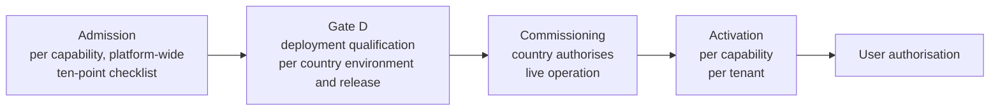

# AAB Gate D — Deployment Qualification — Definition — 2026-09-27

**Status:** GOVERNANCE DEFINITION
**Authority:** DEFINES WHAT GATE D DECIDES, THE EVIDENCE IT REQUIRES, WHO MAY DECIDE IT, AND ITS FAIL-CLOSED RULE. This document grants Gate D to nothing. It admits no capability, commissions no environment, changes no control's status, and does not authorise WP05 or any remediation.
**Sources:**
- `governance/phase-2/wp04/PH2_WP04_GATE_D_TRACEABILITY_AMENDMENT.md`
- `governance/phase-2/wp04/README.md` and `WP04_COMPLETION_RECORD.md`
- `governance/audits/phase-1-sovereignty/2026-09-15/AAB_PHASE_1_SOVEREIGNTY_TECHNICAL_VERIFICATION_REPORT_AND_REGISTER.md`
- `governance/AAB-COUNTRY-DATA-EGRESS-TECHNICAL-CONTROL-SPEC-2026-09-13.md`
- `governance/AAB-COUNTRY-ISOLATION-ARCHITECTURE-2026-09-22.md`
- `governance/AAB-PLATFORM-AND-COUNTRY-ISOLATION-ARCHITECTURE-2026-09-12.md`
- `governance/AAB-CANONICAL-TEMPLATE-PROTECTION-AND-COUNTRY-PROVISIONING-RULE.md`
- `handovers/AAB-COUNTRY-ONBOARDING-CANONICAL-PATH.md`
- `governance/AAB-BUYER-JOURNEY-DESIGN-RECORD-2026-09-23.md`
- `governance/AAB-PLATFORM-PURPOSE-AND-VALUES-REVISION-2026-09-25.md`
- `governance/workstream-b/AAB-WORKSTREAM-B-CAPABILITY-LANDSCAPE-LAUNCH-GAP-FREEZE-2026-09-19.md`
- `governance/workstream-b/CAP-34-GOVERNED-AAB-SIMULATION-DESIGN.md`
- `governance/workstream-b/GOVERNED-EVIDENCE-WATCH-CANDIDATE-DESIGN-2026-09-20.md` (the ten-point admission checklist)
- `governance/AAB-PLATFORM-ROADMAP-2026-09-27.md`

## Why this definition is needed

**Gate D is required, but was never specified.**
- About twenty governance documents say they do not satisfy Gate D.
- The WP04 traceability amendment records `PH2-SEC-RESTORE-FUNCTION-GRANT-01` as "an open mandatory Gate-D qualification item".
- The country isolation architecture records that "no country deployment has received Gate D authority".

**No document says what Gate D decides, what evidence satisfies it, or who grants it.** No document defines a Gate A, B or C either, so there are no sibling gates to read it against.

**This definition is built from what the sources do establish.**
- **Where Gate D is used:** every source that gives it content places it at the level of a **country deployment**, and calls it **qualification**.
- **The principles the sources hold constant:**
  - "Automate verification, not approval."
  - "AAB defines the requirements; infrastructure must qualify against AAB."
  - Mandatory controls are non-compensating.
  - "Technical qualification does not become commissioning."

## Relationship to Workstream A

This definition treats the Workstream A sovereignty and commissioning programme as authoritative for items within its scope. Where this definition and Workstream A conflict, Workstream A governs. If Workstream A has not addressed an item, this definition applies until it does.

The landscape freeze records that Workstream A "remains authoritative for sovereignty and commissioning evidence". The Phase-1 sovereignty register and the WP04 records are the Workstream A records in this repository. No document here sets out the Workstream A commissioning programme as a whole (see "Open items").

## Where Gate D sits

| Stage | Question it answers | Unit | Decided by |
|---|---|---|---|
| Admission | Is this capability a canonical capability of the platform? | One capability | The admission authority, through the ten-point checklist |
| **Gate D** | **Has this country environment, running this release with these admitted capabilities, qualified against every mandatory AAB requirement?** | **One deployment** (see question 1) | **See question 3** |
| Commissioning | May this qualified deployment operate live in this country? | One deployment | Country and governance approval (register CR-30) |
| Activation | Is this capability active for this tenant? | One capability in one tenant | Buyer journey stage 8 |
| User authorisation | May this user operate this capability? | One user | Buyer journey stage 9 |

**Each stage requires the one before it, and none implies the next.** This is the landscape freeze's first invariant: "a preceding state never automatically establishes the next governed state".

**Mapping to the buyer journey.** Stage 7, "Governance approval", combines two decisions:
- **the Platform Owner's decision** that the environment and capabilities qualify, which this definition makes Gate D;
- **the country's authorisation,** which is commissioning.

This definition separates them, so that one party's approval is never read as the other's.

## 1. What Gate D decides

**Gate D decides one thing:** whether one **deployment** has qualified against every mandatory AAB requirement, and may therefore be presented to the country for commissioning.

**A deployment is exactly three things, each named in the decision:**
- **The country environment:** one isolated country environment, identified by its infrastructure, its owner (`tenantOwner`) and its jurisdiction.
- **The release:** one approved canonical AAB release, identified by its commit and its migration set.
- **The capability set:** the admitted capabilities to be deployed, each named with its admitted version.

**The result is one of two outcomes:**
- **`GATE_D_GRANTED`:** every mandatory requirement is `TECHNICAL VERIFICATION SATISFIED` for this deployment.
- **`GATE_D_REFUSED`:** at least one mandatory requirement is `TECHNICAL VERIFICATION NOT SATISFIED` or `EVIDENCE REQUIRED`. The decision names every such requirement.

**There is no third outcome.** There is no conditional grant, grant with exceptions, or partial grant. A deployment with an outstanding item is refused, whatever the item is. To deploy a smaller capability set, the smaller set is assessed as a new deployment.

**What Gate D explicitly does not decide:**

| Not decided by Gate D | Decided instead by |
|---|---|
| Whether a capability is admitted to the platform | Admission (the ten-point checklist). Gate D requires admission; it never substitutes for it. |
| Whether the deployment may operate live | Commissioning: the country and governance approval (register CR-30). Gate D is necessary for commissioning, never sufficient. |
| Whether any capability is active for a tenant | Activation (buyer journey stage 8) |
| Whether any user may act | User authorisation (buyer journey stage 9) |
| Whether any scientific claim is valid | Scientific review under each capability's own governance |
| Whether anything complies with a regulation (EUDR or any other) | The regulated party and its regulator. No AAB decision is a compliance determination. |
| Whether a commercial agreement or entitlement exists | CAP-21 and the external agreement |
| Whether a legal acceptance is operative | The country's legal process. A rehearsal acknowledgement never satisfies it. |
| Whether remediation or WP05 may begin | Separate authority, as the WP04 records require |

**Gate D is never granted to a capability in the abstract.** "Is this capability ready?" is the admission question. Gate D asks whether a specific environment runs a specific release of admitted capabilities in a way that meets every mandatory AAB requirement.

## 2. What evidence must exist before Gate D can be assessed

**Gate D cannot be assessed until every item below has evidence.** Evidence that is missing makes the assessment `EVIDENCE REQUIRED`, and the outcome refused. It is never "likely satisfied".

### 2.1 The capability set

- **Every capability in the set is admitted,** through the ten-point admission checklist.
- **Admission carries its own prerequisites,** which Gate D does not relax:
  - a canonical contract;
  - an implementation;
  - behavioural proof;
  - independent review;
  - a shared `ActorReference` contract, which `TODO(actor-reference)` requires "before any capability is admitted".
- **Every capability's declared dependencies are in the set, or already deployed and qualified.** For example, SCS-CAP-08 requires SCS-CAP-09 and SCS-PLATFORM-02.
- **Every limitation each capability discloses is recorded in the Gate D evidence.** Examples: no pilot evaluation can be `SUFFICIENT` without a spatial database; every pilot plot is `REGISTERED_WITH_GAPS`. A limitation does not refuse Gate D by itself. It must be disclosed to the country before commissioning, and the capability's README requires that pilot partners be told.

### 2.2 The release

- **The release is an approved canonical release,** identified by commit and migration set. It is built from the canonical clean baseline, never from another country's environment (provisioning rule).
- **Evidence is bound to the release it was established against** (landscape freeze, invariant 2). Evidence from another release counts only if a Qualification-Impact Declaration shows the change does not affect it.
- **Every behavioural test and proof for the capability set passes on this release,** in CI, on the release commit.

### 2.3 The environment: the mandatory sovereignty and security controls

**The Phase-1 sovereignty register's controls CR-01 to CR-29 must each be `TECHNICAL VERIFICATION SATISFIED` for this environment.**
- The controls are non-compensating: one unsatisfied control refuses Gate D.
- CR-30, country and governance production approval, is commissioning itself, so it is not a Gate D item.
- The register's statuses are findings for the WA rehearsal. **A new environment establishes every control afresh.** No rehearsal finding, pass or fail, carries over.

| Group | Controls |
|---|---|
| Ownership and isolation | CR-01 country ownership; CR-02 country isolation; CR-04 administrative independence |
| Residency | CR-03 database copies; CR-05 origins; CR-06 hosting backups; CR-10 logs; CR-11 caches; CR-12 execution; CR-13 derivatives |
| Flows | CR-14 no return to canonical; CR-15 no country-to-country propagation; CR-16 no external AI training export |
| Authority and security | CR-17 persisted authority; CR-18 scientific action authorisation; CR-19 no definer escalation; CR-20 privileged MFA; CR-21 privileged token lifecycle; CR-22 no public diagnostics; CR-23 provider personnel access |
| Keys, backup, recovery and deletion | CR-07 object backup coverage; CR-08 object recovery; CR-09 database recovery; CR-24 country-controlled keys; CR-25 deletion across every copy |
| Deployment package | CR-26 clean country template; CR-27 vendor-neutral package; CR-28 rebuild without the rehearsal provider |
| Evidence integrity | CR-29 commissioning evidence is immutable and attributable |

### 2.4 The environment: the open qualification items

- **`PH2-SEC-RESTORE-FUNCTION-GRANT-01` is closed** under the amendment's three conditions:
  1. an identified and evidenced root cause for the original grant drift;
  2. a clean reconstruction that reproduces the correct grants without manual intervention;
  3. automatic regression verification that the invariant holds.

  "A reconstruction that happens to succeed without an established cause remains `EVIDENCE REQUIRED`, not closed."
- **`PH2-SEC-CC-RLS-ADVISORY-01` is closed with evidence.** Its current state is OPEN, with the design baseline preserved (WP04).
- **`PH2-SEC-RPC-AUTHORITY-REGRESSION-01` is closed with evidence.** Its current state is OPEN: the verification framework is initiated, and the full isolated authority-path suite is future work (WP04).
- **An advisory is not a waiver.** Every open Phase-2 security finding is a mandatory Gate D item, whatever its classification, until it is closed with evidence. A finding raised after this definition joins the list when it is raised.

### 2.5 The environment: provisioning and egress

- **The provisioning contract's steps 1–6 are verified** (template protection rule):
  1. isolated country infrastructure;
  2. approved canonical migrations;
  3. approved functions and security controls;
  4. permitted baseline reference data only;
  5. integrity and security attestation;
  6. zero inherited country-specific scientific data.

  Step 7, activation, follows commissioning.
- **All twelve of the egress specification's verification items are satisfied for this environment.** Each is mandatory; one unsatisfied item refuses Gate D.
  - The items: architecture and boundaries; outbound endpoints; telemetry and logging destinations; outbound code review; export tests; canonical separation; cross-country tests; embeddings and model artefacts; backup location and recovery; feedback audit; independent penetration or security review; regression tests on every release.
  - The specification requires them "before an external institutional partner is asked to rely on the non-return claim". Gate D is the last check before a country puts live data into the environment, which is the boundary the specification exists to govern.
- **The backup has been restored and verified.** The template rule says a backup is "not considered proven until a restore test has successfully recreated a clean environment". For a country environment, that means a restore of this environment's own backup, verified against its own integrity report.

### 2.6 What the evidence must be

- **Immutable and attributable** (CR-29): each item is recorded, digested and signed.
- **Signed with a country-controlled verification key.** WP04's published test key "a country-qualified deployment must replace".
- **Produced by verification, which may be automated.** The commissioning harness (`PH2-COM-AUTO-01`) may generate evidence. It never confers approval.
- **Inadmissible:**
  - rehearsal evidence ("a rehearsal acknowledgement must never satisfy a future operational-country legal gate");
  - simulation evidence (CAP-34 carries "zero commissioning credit");
  - Workstream-B demonstrations, commercial milestones or scientific features ("may not be cited as evidence that a country environment is commissioned");
  - protected country scientific data, secrets or credentials, which may never be placed in evidence.

## 3. Who has the authority to grant or refuse Gate D

**What the sources establish:**
- **Approval is never automated.** "Automate verification, not approval." "Automated commissioning may generate evidence but cannot confer production authority."
- **Workstream A is the evidence authority.** It "remains authoritative for sovereignty and commissioning evidence". No Workstream-B capability, demonstration or simulation may stand in for its evidence.
- **The Platform Owner holds AAB's governance decisions.** The main control plane holds "Platform Owner decisions and governed provisioning decisions". Buyer journey stage 7 gives the Platform Owner the approval that the environment and capabilities qualify.
- **The country holds commissioning.** Register CR-30: production begins only "after technical verification and explicit country/governance approval".

**The sources do not name who decides Gate D. This definition establishes it:**

- **Gate D is decided by the Platform Owner,** as AAB's governance authority. Gate D is AAB's statement that its own requirements are met: "AAB defines the requirements; infrastructure must qualify against AAB".
- **The decision requires a written qualification assessment by an independent qualification reviewer.** The reviewer establishes the evidence; the Platform Owner makes the governance decision. The reviewer assesses every item in section 2, and records each as `TECHNICAL VERIFICATION SATISFIED`, `TECHNICAL VERIFICATION NOT SATISFIED` or `EVIDENCE REQUIRED`.
- **The Platform Owner must refuse when the reviewer records any item as `TECHNICAL VERIFICATION NOT SATISFIED` or `EVIDENCE REQUIRED`,** and may not overrule the assessment. A satisfied assessment permits a grant but does not compel one: the Platform Owner may still refuse, recording the reason.
- **The country does not decide Gate D,** and Gate D does not decide for the country. The country's authority is exercised at commissioning, over a deployment that has already qualified.
- **No automated system, no rehearsal identity and no Workstream-B role may grant Gate D.**

### The independent qualification reviewer

**Who may be the reviewer.** A named person or organisation that:
1. has no commercial interest in the deployment being granted;
2. has not been involved in building the capabilities being qualified, the release or the environment, and did not produce the evidence under review;
3. has the technical competence to assess every evidence item in section 2;
4. is named and accountable: never anonymous.

**How the reviewer is appointed:**
- **Per assessment.** A reviewer is appointed for one Gate D assessment of one deployment. An appointment does not carry over to another deployment.
- **Appointed by the Platform Owner, and recorded before the assessment begins.** The appointment record names the reviewer, the deployment and the date.
- **With a signed declaration against each of the four criteria.** The declaration names any past involvement with the capabilities, release or environment, and any commercial relationship with the parties to the deployment. It is part of the Gate D evidence package.
- **The appointee for each country is a country-specific decision,** made for that country before its first Gate D assessment.
- **A breach voids the assessment.** An assessment by a reviewer who did not meet all four criteria at the time is void. The deployment is refused until a properly appointed reviewer assesses it again, and a grant based on a void assessment is withdrawn by a superseding refusal.
- **The reviewer is never the Platform Owner,** and has direct access to the evidence package and its signatures, not only to what the Platform Owner provides.

### The decision record

**Every Gate D decision is recorded:**
- **Immutable and append-only,** in the same way as a capability decision receipt.
- **Bound by digest** to the evidence package assessed and to the reviewer's assessment.
- **Naming** the deployment (environment, release, capability set), the reviewer and their appointment record, the Platform Owner, the outcome, and every unsatisfied item.

## 4. The fail-closed rule

**While Gate D is undefined**, and until this definition is approved:
- No deployment has qualified, and none may be presented, recorded or described as qualified.
- No environment may be commissioned, because Gate D is necessary for commissioning.
- Nothing may be described as having passed, or being close to passing, Gate D.

**When Gate D is refused:**
- The deployment may not be presented for commissioning.
- The refusal names every unsatisfied item. It is permanent, and is never edited or withdrawn; a later decision supersedes it.
- A new assessment requires new evidence for the unsatisfied items. Re-submitting the same evidence cannot produce a different outcome.

**When a mandatory item cannot be assessed:** it is `EVIDENCE REQUIRED`, and the outcome is refused. Missing evidence is never read as satisfied.

**When anything in the deployment changes after a grant:**
- A change to the environment, the release or the capability set makes the grant `STALE — REASSESSMENT REQUIRED` (landscape freeze, invariant 2).
- A stale grant does not qualify any deployment for commissioning or for new activation until it is reassessed.
- A Qualification-Impact Declaration may limit the reassessment to the affected items. It cannot declare the whole grant unaffected without evidence.

**When Gate D becomes stale for a commissioned environment** (for example, after a release, or when a control regresses):
- **A stale Gate D does not automatically suspend live operation.**
- **A reassessment must be initiated within a defined period** after the grant becomes stale. The period, and the process for initiating and completing the reassessment, are set by the commissioning governance document.
- **The country's commissioning authority decides on suspension.** Neither the Platform Owner nor the reviewer suspends a country's live operation through Gate D.
- **Until the reassessment is granted,** the stale grant does not qualify the deployment for any new commissioning or new activation.

**Gate D is never inferred.** It is never inferred from:
- admission;
- commercial entitlement;
- a successful demonstration;
- technical qualification of part of the system;
- the absence of findings;
- a prior grant for a different deployment.

## Current position

**No deployment has been assessed, and none could be granted today.** At minimum:
- **No capability is admitted.** The SCS pilot capabilities are behaviourally proven, and none has been through the admission checklist.
- **No admission authority is defined,** so no capability can be admitted yet.
- **`PH2-SEC-RESTORE-FUNCTION-GRANT-01` is open.**
- **The rehearsal has open findings:** register findings on CR-02, CR-04 to CR-07 and CR-20 to CR-22 are production-standard failures, and the other mandatory controls are `EVIDENCE REQUIRED` for the rehearsal.
- **No country-controlled evidence key exists.**
- **`PH2-SEC-CC-RLS-ADVISORY-01` and `PH2-SEC-RPC-AUTHORITY-REGRESSION-01` are open.**
- **No independent qualification reviewer has been appointed.**

## Decisions recorded on 2026-09-27

1. **Authority:** the Platform Owner decides, on an independent reviewer's assessment, and cannot grant against a negative assessment. No automated system may grant Gate D (section 3).
2. **The independent reviewer:** four criteria and an appointment process (section 3). The first appointee is a country-specific decision.
3. **Open Phase-2 findings:** `PH2-SEC-CC-RLS-ADVISORY-01` and `PH2-SEC-RPC-AUTHORITY-REGRESSION-01` are mandatory Gate D items alongside `PH2-SEC-RESTORE-FUNCTION-GRANT-01`. An advisory is not a waiver (section 2.4).
4. **Egress evidence:** all twelve items are mandatory (section 2.5).
5. **A stale Gate D in a commissioned environment:** no automatic suspension; a reassessment must be initiated within a defined period; the country's commissioning authority decides on suspension (section 4).
6. **The roadmap:** corrected in a separate commit after this definition is committed. Gate D blocks commissioning. Admission is blocked by its own prerequisites: the checklist, the shared `ActorReference` contract and independent review.
7. **Workstream A:** authoritative for items within its scope, and governs where it conflicts with this definition ("Relationship to Workstream A").

## Open items

### Blocking the first Gate D assessment

No Gate D assessment can be attempted until all three exist.

- **The admission authority.**
  - CAP-20 names a "capability identity and admission authority" as the source of admission status. No document in the repository defines it.
  - Gate D requires every capability in the set to be admitted, and admission requires an authority to decide it. Without that authority no capability can be admitted, so no capability set can be assessed.
  - It must be defined before the first admission, and so before the first Gate D assessment.
- **The first independent qualification reviewer** for the pilot country, appointed under section 3. This is a country-specific decision.
- **The commissioning governance document.**
  - It must set the period within which a reassessment is initiated after Gate D becomes stale.
  - It must set the reassessment process.
  - It must set how the country's commissioning authority decides on suspension.
  - No such document exists.

### Also required before the first assessment

- **A country-controlled evidence verification key** for the pilot country, replacing WP04's published test key. Section 2.6 requires evidence signed with it.
- **The Workstream A commissioning programme.** No document in this repository sets it out as a whole. Wherever it exists, it must be checked against this definition, which it governs where they conflict.

## What this document does not establish

- It does not grant Gate D to any deployment, or assess any deployment.
- It does not admit or commission any capability or environment.
- It does not change any control's status in the Phase-1 register, or close any Phase-2 finding.
- It does not authorise WP05, remediation, infrastructure change or any production activity.
- It does not define commissioning, which remains the country and governance approval recorded as CR-30.
