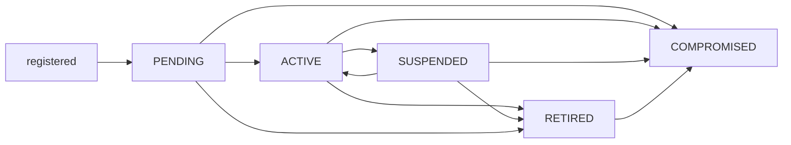

# AAB-PLATFORM-09 — Governed Public-Key Registry — Canonical Contract — 2026-09-28

**Status:** CANONICAL CONTRACT — NOT IMPLEMENTATION
**Domain:** AAB platform (shared by every domain)
**Authority:** DEFINES THE GOVERNED PUBLIC-KEY REGISTRY: WHERE AN ACTOR'S SIGNING KEYS ARE REGISTERED, WHAT A KEY REGISTRATION RECORDS, HOW A KEY IS RETIRED, SUSPENDED OR DECLARED COMPROMISED WITHOUT ITS HISTORY BEING LOST, HOW A SIGNATURE IS ACCEPTED AND LATER VERIFIED AGAINST THE KEY THAT WAS ACTIVE WHEN THE SERVER ACCEPTED IT, AND WHAT EVIDENCE A RECORD KEEPS WHEN ITS SIGNER'S KEY BELONGS TO ANOTHER ISSUER. It registers no key, grants no authority to anyone, amends no contract and changes no stored record. This contract is PROPOSED_NOT_ADMITTED. No implementation exists.

## Why this contract is needed

- **Today a signature is verified against the signer's current key** (`foundation/signatures.ts`, `TODO(signing-key-history)`). Rotating a key makes every record signed with the earlier key fail verification: every link and status record the signer made becomes unusable at once. AAB-PLATFORM-04 records this as blocking before any real data is admitted, and AAB-PLATFORM-08 makes it a precondition of any human decision going live with real data.
- **A governed record must not stop being valid because its signer's key changed.** Nor may a record stay trusted, unexamined, when its signer's key may have been stolen.
- **Keys are held in the wrong place.** The pilot keeps one public key per actor in its static actors file: operator configuration, with no history, no registration evidence and no way to record a compromise.
- **This is a new platform primitive.** Every signature on the platform depends on it, in every domain, so it is contracted before any code or schema changes, as every other primitive has been.

## Sources

- `governance/AAB-PLATFORM-03-ACTOR-REFERENCE-CANONICAL-CONTRACT-2026-09-27.md`: an actor is identified by (`issuer`, `actorId`); the issuer is `PLATFORM_CONTROL_PLANE` or `COUNTRY_TENANCY`; governance decisions are signed, and "the signature proves the decision" (section 4)
- `governance/AAB-PLATFORM-04-ACTOR-SUBJECT-LINK-CANONICAL-CONTRACT-2026-09-27.md`: what is signed; the server sets `createdAt` after the signature verifies; signing-key history, blocking before any real data
- `governance/AAB-PLATFORM-08-ATTRIBUTABLE-HUMAN-REVIEW-WITH-CURRENCY-CANONICAL-CONTRACT-2026-09-28.md`: every human decision signed outside the server; no adoption live with real data before signing-key history
- `governance/AAB-PLATFORM-AND-COUNTRY-ISOLATION-ARCHITECTURE-2026-09-12.md` and `governance/AAB-COUNTRY-SCIENTIFIC-DATA-NON-RETURN-BOUNDARY-2026-09-13.md`: a country's records live in its isolated tenancy; nothing crosses its boundary unless explicit and authorised
- `scs-pilot/packages/api/src/foundation/signatures.ts` and `foundation/auth.ts`: Ed25519 over canonical JSON; public keys only on the server; one key per actor, in the actors file
- The Platform Owner's design decision of 2026-09-28, on which this contract is drafted: the registry, its required fields, the acceptance-time rule, compromise handling and cross-issuer verification evidence
- NIST key-management guidance (SP 800-57): a public verification key is kept for as long as signatures made with it need to be checked

## 1. What the registry is

**The public-key registry is the governed, append-only record of every signing key an issuer has registered for its actors, and of everything that has happened to each key since.**

- **It holds public keys only.** Private keys stay with their human signers, who sign outside the server. No registry, server or operator ever holds, generates, escrows or recovers a private key.
- **It is owned by the key's identity issuer:**
  - **a country-issued actor's keys** (`COUNTRY_TENANCY`) are registered in that country's registry, in its isolated tenancy;
  - **a Platform Owner actor's keys** (`PLATFORM_CONTROL_PLANE`) are registered in the platform control plane's registry.
  
  An issuer registers keys only for its own actors. No registry is authoritative for another issuer's keys.
- **It is not the actor directory.** The directory says who an actor is and what they may do. The registry says which keys an actor has signed with, and when each could be used. Neither holds the other's records.
- **It is not configuration.** A key enters the registry only by a governed registration (section 3), never by editing a file. The static actors file stops holding signing keys when a deployment adopts this contract (section 12). It keeps actors, roles and grants; keys move to the registry.

**Nothing is ever removed.** A key is never deleted, overwritten or re-used, whatever happens to it. A retired or compromised key stays in the registry for as long as any record signed with it exists.

## 2. What the registry asserts, and what it does not

**A registry asserts:**
- this public key was registered for this actor, by this registration authority, with proof that the registrant held the matching private key, at this time;
- these events have happened to the key since, in this order, recorded by these actors.

**It does not assert:**
- that the actor is who they claim to be: that is the issuer's identity process;
- that a signature made with the key was made by the actor personally: it proves only that the private key was used;
- when a signer made a signature (section 10).

## 3. Registering a key

```typescript
interface KeyRegistration {
  // Whose key
  issuer: ActorIssuer;                  // AAB-PLATFORM-03
  actorId: string;
  keyId: string;                        // assigned by the registry; unique within the issuer; never re-used

  // The key
  algorithm: "Ed25519";                 // the only algorithm the platform accepts today
  publicKey: string;                    // SPKI DER, standard base64
  publicKeyDigest: string;              // "sha256:" over the SPKI DER bytes

  // When it may be used
  activeFrom: string;                   // the registry's clock; never earlier than registeredAt

  // How it became trusted
  registrationAuthority: ActorReference; // HUMAN, holding the issuer's key-registration role
  proofOfPossession: {
    challenge: string;                  // issued by the registry, used once
    signature: string;                  // the registrant's signature over the challenge statement, with this key
  };
  replacesKeyId?: string;               // the actor's key this one replaces, if any
  bootstrapCeremonyId?: string;         // the first key of a registry only: its ceremony record (section 3a)
  registeredAt: string;                 // the registry's clock
  registrationReceiptId: string;        // the immutable receipt, written in the same transaction
  registrationDigest: string;           // "sha256:" over every field above, in canonical JSON
}
```

**Registration rules:**
- **Proof of possession.** The registry issues a single-use challenge. The registrant signs a statement naming the challenge, their `issuer` and `actorId`, and the public key's digest, with the private key being registered. The registry verifies it with the public key submitted. Without it, nothing is registered.
- **A registration authority registers a key, never the key holder alone.** The authority is a human holding the issuer's key-registration role, who is not the key holder (compared as actors, AAB-PLATFORM-03), and who signs the registration with their own registered, active key. Registration is an attributable human decision (AAB-PLATFORM-08). The one exception is a registry's first key, which no one else can yet register (section 3a).
- **One public key, one registration.** A public key already registered in the issuer's registry, for any actor, is refused.
- **One active key per actor.** An actor has at most one active key at any time. A registration that names `replacesKeyId` retires the replaced key at the new key's `activeFrom` (section 4); a registration for an actor with an active key that names no key to replace is refused.
- **`activeFrom` is set by the registry,** at or after registration. A key is never active before it is registered.
- **Written once.** A registration is never changed. Everything that happens to the key afterwards is an event (section 4).

## 3a. The first key: the bootstrap problem

**This is the most important unresolved question in this contract. Without an answer, no registry can start.**

Every registration is made by a registration authority, signing with their own registered, active key (section 3). The first registration authority of a registry has no registered key, and no one who could register it. Something must be trusted first.

**The pilot position, disclosed:**
- **The Platform Owner's first key is self-attested,** in a documented ceremony: the Platform Owner registers their own key, with proof of possession, and the ceremony is recorded (who was present, what was done, the key's digest, the time) and referenced by the registration's `bootstrapCeremonyId`.
- **It is the only registration made without separation** of registration authority and key holder, and it says so. Every record that relies on it, directly or through keys it registered, can be traced to it.
- **This is not a production solution.** It is an honest pilot position: the trust in the first key is the trust in the ceremony record and in the Platform Owner, and nothing more.
- **The first key of a country registry** is not settled by the pilot position. How it is registered must be decided before any country registry starts.

**For production,** the bootstrap must be settled by its own decision (for example, a witnessed ceremony with independent parties, or a first key attested by an authority outside AAB), before any registry holds keys for real data ("Open items").

## 4. The key lifecycle

**What happens to a key is recorded as append-only events.** The key's state at any time is derived when read, from its registration and its events. It is never stored.

```typescript
interface KeyEvent {
  eventId: string;
  issuer: ActorIssuer;
  actorId: string;
  keyId: string;
  eventType: "SUSPENDED" | "REINSTATED" | "RETIRED";
  effectiveAt: string;                  // the registry's clock; never earlier than recordedAt
  reason: string;
  recordedBy: ActorReference;
  recordedAt: string;
  receiptId: string;
  eventDigest: string;
  signature: string;                    // by recordedBy, with their own registered, active key
}
```

**Compromise is not one of these events.** It is a different kind of record, with different consequences (section 8).

| Derived state | Meaning | New signatures |
|---|---|---|
| `PENDING` | Registered; `activeFrom` not yet reached | Refused |
| `ACTIVE` | From `activeFrom`, with no retirement, suspension or compromise in effect | Accepted |
| `SUSPENDED` | A suspension is in effect, and no reinstatement since | Refused |
| `RETIRED` | Retired, by rotation or by decision. Final | Refused |
| `COMPROMISED` | A compromise record exists. Final, whatever else has happened | Refused |



- **`retiredAt`** is the `effectiveAt` of the key's retirement, whether by a `RETIRED` event or by a replacing key's `activeFrom`. It is derived, never written onto the registration.
- **Retiring a key stops new signatures.** It does not delete the key, and does not affect any record already accepted with it. Ordinary rotation is retirement.
- **Suspension stops new signatures for a time,** while something is examined. It is not a finding of compromise, and does not affect records already accepted. Only a registration authority suspends or reinstates, and a reinstatement is never recorded by the key holder.
- **A lost private key is retired,** not compromised, unless it may have been obtained by someone else.
- **Who may record each event:** the key holder or a registration authority may retire a key; only a registration authority may suspend or reinstate one. Section 8 says who may declare a compromise.

## 5. Signing

- **Every signed statement names the key it was signed with:** its `keyId`, with the signer's `issuer` and `actorId`, inside the signed bytes. A signature whose statement names no key is refused.
- **Signatures are made outside the server,** by the signer, with their own private key (AAB-PLATFORM-03 and 04). The signed bytes are the UTF-8 canonical JSON of the statement.
- **A statement does not carry the signing time as evidence.** A date in a signed statement is what the signer says, and proves nothing about when they signed (section 10).

## 6. Accepting a signature

**At acceptance, the server:**
1. **checks the signer's current authority** for the act, as the governing contract requires;
2. **resolves the key:** `keyId` in the signer's issuer's registry, or, for another issuer's key, in the verification evidence (section 9). The key must be registered for exactly the (`issuer`, `actorId`) the statement names;
3. **verifies the signature** with that key;
4. **confirms the key is `ACTIVE` at `acceptedAt`,** where **`acceptedAt` is the server's own trusted time of acceptance,** never a time the signer supplies;
5. **records, in the immutable receipt written in the same transaction:** `acceptedAt`, `keyId`, the key's `publicKeyDigest` and `registrationDigest`, and the digest of the verification evidence if the key belongs to another issuer.

**If any step fails, the submission is refused and nothing is written.**
- **A submission received after its key was retired, suspended or declared compromised is refused, even if its statement claims an earlier date.**
- A key that is `PENDING` at `acceptedAt` is refused in the same way.

## 7. Verifying a record later

- **A record is verified against the key its receipt names,** as registered, and against the `acceptedAt` its receipt records: the signature must verify with that historical public key, and the key must have been `ACTIVE` at that time.
- **Later events do not change the result,** except a compromise (section 8). A key retired or suspended after a record was accepted leaves the record verified.
- **Verification is derived when read,** never stored on the record:

| Verification | Meaning |
|---|---|
| `VERIFIED` | The signature verifies with the historical key, which was `ACTIVE` at `acceptedAt`, and no compromise covers `acceptedAt` |
| `UNDER_COMPROMISE_REVIEW` | As `VERIFIED`, but `acceptedAt` falls inside a compromise's exposure window, and no assessment of the record has been made |
| `AFFIRMED_AFTER_COMPROMISE` | In an exposure window, and a human assessment has affirmed the record |
| `REPUDIATED` | In an exposure window, and a human assessment has found the record not to be the signer's act |
| `NOT_VERIFIABLE` | The signature does not verify, the key cannot be resolved, or the key was not `ACTIVE` at `acceptedAt` |

- **Only `VERIFIED` and `AFFIRMED_AFTER_COMPROMISE` may be relied on** where the record's authority is required. Every other result fails closed.
- **`REPUDIATED` and `NOT_VERIFIABLE` are never collapsed.** `REPUDIATED` is a finding: a person has assessed the record and found it not to be the signer's act. `NOT_VERIFIABLE` is an absence of a finding: the record cannot be checked. Both fail closed, for different reasons, and each is reported as itself.
- **Restoring from a backup restores the registry with the records.** A restored record is verified against its historical key exactly as before.

## 8. Compromise

**Compromise is categorically different from rotation.** A retired key's records remain valid. A compromised key's records may not be the signer's acts at all, even though their signatures still verify mathematically. So compromise is recorded as its own kind of record, with its own consequences, not as a status.

```typescript
interface KeyCompromiseRecord {
  compromiseId: string;
  issuer: ActorIssuer;
  actorId: string;
  keyId: string;
  suspectedExposureFrom: string;        // the earliest time the private key may have been in other hands
  exposureBasis: string;                // how that time was estimated; "UNKNOWN" means from activeFrom
  evidence: Array<{ description: string; digest: string }>;  // preserved, never altered
  declaredBy: ActorReference;
  recordedAt: string;                   // the registry's clock
  receiptId: string;
  compromiseDigest: string;
}
```

- **The exposure window** runs from `suspectedExposureFrom` to `recordedAt`. If the start is unknown, it is the key's `activeFrom`: the whole life of the key.
- **A compromise is final.** The key never signs again, and no event reinstates it.
- **The window can be widened, never narrowed.** A later compromise record for the same key may set an earlier `suspectedExposureFrom`; the window then runs from the earliest. No record narrows it.
- **Records accepted inside the window are flagged for human assessment.** They are neither automatically invalidated nor automatically validated. Until assessed, each is `UNDER_COMPROMISE_REVIEW`, and fails closed wherever its authority is required: for example, a link signed inside the window cannot be used for a new act.
- **The assessment is an attributable human decision** (AAB-PLATFORM-08), one per record, affirming or repudiating it, with reasons and the evidence considered. The assessor is never the key holder. A repudiated record stays on the record; it is never deleted.
- **Records accepted before the window are unaffected.**
- **Declaring a compromise must never be harder than it needs to be.** The key holder, a registration authority, or the issuer's security role may declare one, and a declaration never requires a signature with the compromised key. A suspicion is enough: a declaration can be made before an investigation, and the evidence added later by a further record that widens nothing and removes nothing.
- **The evidence is preserved,** by digest, with the record.

## 9. Keys from another issuer: verification evidence

**A record in one issuer's domain may be signed with another issuer's key.** For example, a country's admission record signed by the Platform Owner carries a key from the platform control plane's registry.

**The record's domain keeps, with the record, verification evidence sufficient to verify the signature without any call outside its own boundary:**

```typescript
interface KeyVerificationEvidence {
  issuer: ActorIssuer;                  // the key's issuer
  keyId: string;
  registration: KeyRegistration;        // a complete copy
  eventsAtAcceptance: KeyEvent[];       // every event recorded for the key up to acceptedAt
  compromisedAtAcceptance: false;       // a key with a compromise record is refused (section 6)
  attestedAt: string;                   // the issuing registry's clock, at or after acceptedAt
  attestation: string;                  // the issuing registry's signature over the fields above
  attestationKeyId: string;             // the issuing registry's attestation key
  evidenceDigest: string;
}
```

- **The copy must be enough.** Verifying the record needs the copy, the record and the attestation key the domain already holds. It never needs a live lookup across the boundary. A country that could verify its own records only by asking another issuer would not control those records.
- **The issuing registry's attestation key is pinned in the receiving domain,** as a governed record of that domain, when the domain is provisioned. Evidence whose attestation does not verify against a pinned key is refused.
- **The evidence is obtained at acceptance,** and stored with the record in the same transaction. A record that needs it and lacks it is not accepted.
- **A later compromise crosses the boundary as a notice.** When a key is declared compromised, its issuer notifies every domain that holds verification evidence for it. The receiving domain records the notice, attested by the issuing registry, beside its copy. From then on its own records inside the window are `UNDER_COMPROMISE_REVIEW` (section 8). Until a notice arrives, a domain cannot know of a compromise elsewhere; that limit is disclosed with every record verified by evidence.
- **Only public-key data crosses.** The evidence carries keys, events and actor identifiers (`issuer`, `actorId`), never an accountable name or any record of the receiving domain. It moves only as the isolation architecture and the non-return boundary permit.

## 10. What a receipt proves about time

**AAB's receipts establish that the server accepted a submission at a known time, verified with a known key. They do not independently prove when the signer produced the signature.**
- A date the signer supplies proves nothing about when they signed. The link statement, for example, carries no signed creation time: its `createdAt` is set by the server after the signature verifies.
- So `acceptedAt`, the server's own time, recorded in an immutable receipt, is the operative time for deciding whether a key was active. It is the only tamper-resistant time available without a separately trusted timestamp mechanism.
- **The limitation is disclosed:** a signature made with a key before it was retired, but submitted after, is refused (section 6); and a signature made by someone who obtained the key before a compromise was declared is indistinguishable, by time, from the signer's own, which is why compromise is assessed by a person (section 8).
- **Independent proof of signing time,** if AAB ever needs it, requires a separately trusted timestamp mechanism. It is not defined here.

## 11. Before any real data

**No real-data admission relies on the registry until its behaviour is proven,** by tests that pass in CI and a proof record naming them:
- **Rotation:** a record signed with a key later retired still verifies against that key; a new signature with the retired key is refused, whatever date its statement claims.
- **Restoration:** after a backup is restored, every record verifies against its historical key, retired keys included, exactly as before.
- **Compromise:** records accepted inside an exposure window are `UNDER_COMPROMISE_REVIEW` and fail closed where their authority is required; records accepted before it are unaffected; an assessment affirms or repudiates a record without removing it.
- **Cross-issuer evidence:** a record signed with another issuer's key verifies with no call outside the domain; a compromise notice places the domain's records inside the window under review.

These replace `TODO(signing-key-history)` as the condition for real data. Until they pass, the pilot's rule stands: a key is never rotated while records it signed are in use.

## 12. Adopting this contract

The platform adopts this contract before any domain relies on it. The adoption must document:
- **The move out of the actors file.** Each deployment's existing keys are registered in its issuer's registry, with proof of possession from each key holder, by a registration authority. Each such registration discloses that the key was in use before it was registered: `activeFrom` is the time of that use's first record, and the registration says so. The actors file then holds no signing keys. It remains for actors, roles and grants.
- **Existing signatures.** Statements signed before adoption name no `keyId`. Each is verified against the one key its signer held, as registered on import, and discloses that the key was resolved by the signer's identity, not named in the statement. Stored records are never rewritten.
- **Existing receipts** record no `keyId`. The key is resolved from the signer and the receipt's time, and that is disclosed.
- **The code that changes, after this contract and before real data:** `foundation/signatures.ts` (verification against a registered, historical key), `platform/actor-subject-links/use.ts` (the link's signatures checked by `acceptedAt`, failing closed under compromise review), `foundation/auth.ts` (no keys from the actors file), the receipts, and the backup and integrity proofs.
- **The roles:** the issuer's key-registration role, and its security role, for each issuer.
- **AAB-PLATFORM-03, 04 and 08** are amended to cite this contract for keys, in place of their open items on signing-key history.

## What this contract does not establish

- It registers no key, and defines no issuer's identity process.
- It does not define private-key custody, hardware keys or signer devices.
- It does not define a trusted timestamp mechanism.
- It does not define how attestation keys are provisioned, beyond requiring that they are pinned as governed records.
- It does not settle the bootstrap of a registry for production (section 3a).
- It does not change any stored record, signature or receipt.
- It implements nothing.

## Decisions recorded on 2026-09-28

Confirmed in review:

1. **An issuer-owned, append-only public-key registry,** in the country's tenancy for country actors and the platform control plane for Platform Owner actors; public keys only; not the actor directory, and not configuration (section 1).
2. **The registration record** carries the required fields of the design: `issuer`, `actorId`, `keyId`; `algorithm`, `publicKey`, `publicKeyDigest`; `activeFrom`, with `retiredAt` derived from retirement; the registration authority, proof of possession and registration receipt (sections 3 and 4).
3. **A registration authority registers a key, never the key holder alone** (section 3). Self-registration would let anyone register a key for any actor. The one exception is a registry's first key (decision 12).
4. **One active key per actor, with rotation by naming the replaced key** (section 3). More than one active key would make receipt verification ambiguous; named replacement makes every rotation an explicit, auditable chain.
5. **Append-only retirement, suspension and reinstatement events,** state derived when read; **suspension and reinstatement by a registration authority only,** never the key holder (section 4). A key holder who could reinstate their own suspended key would have no suspension mechanism.
6. **Every signed statement names its `keyId`** (section 5).
7. **`acceptedAt`, the server's own time, decides whether the key was active;** a submission received after retirement is refused, whatever date it claims (section 6). **What a receipt proves about time is a named section** (section 10): receipts prove acceptance time and key, not signing time. The limitation is stated plainly, not buried.
8. **Later verification uses the historical key and the receipt, with five results derived when read:** `VERIFIED`, `UNDER_COMPROMISE_REVIEW`, `AFFIRMED_AFTER_COMPROMISE`, `REPUDIATED`, `NOT_VERIFIABLE`. **Only `VERIFIED` and `AFFIRMED_AFTER_COMPROMISE` may be relied on;** `UNDER_COMPROMISE_REVIEW` fails closed until a human assessment completes. `REPUDIATED` (a finding that the record is not the signer's act) and `NOT_VERIFIABLE` (the record cannot be checked) are never collapsed (section 7).
9. **Compromise is a separate kind of record, final,** carrying a suspected exposure window and preserved evidence; every record accepted inside the window is flagged for human assessment under AAB-PLATFORM-08, neither validated nor invalidated automatically, and fails closed until assessed. **The window can be widened, never narrowed;** an unknown start covers the key's whole life. Narrowing it would need a certainty that does not exist (section 8).
10. **Cross-issuer verification evidence,** stored with the record, sufficient to verify with no call across the boundary, attested by the issuing registry against an **attestation key pinned at provisioning.** Without the pinned key, the copy could not be verified offline, and the country would not control its own records. **Compromise notices** go to every holder; the disclosure that, without a notice, a domain cannot learn of a compromise elsewhere stays in the contract (section 9).
11. **Rotation, restoration, compromise and cross-issuer tests must pass before any real data,** with a proof record naming them, replacing `TODO(signing-key-history)` as the condition (section 11). **Adoption moves keys out of the actors file,** which remains for actors, roles and grants, and names the code that changes: `signatures.ts`, `use.ts`, `auth.ts`, the receipts and the proofs (section 12).
12. **The bootstrap problem is recorded prominently** (section 3a). For the pilot, the Platform Owner's first key is self-attested in a documented ceremony, and that limitation is disclosed. It is an honest pilot position, not a production solution.

## Open items

- **The bootstrap problem — the most important open item. Without solving it, no registry can start** (section 3a). For the pilot, the Platform Owner's first key is self-attested in a documented ceremony, disclosed. Still open: the bootstrap for production, and the first key of every country registry, including the pilot's.
- **Attestation keys:** how each registry's attestation key is created, pinned, rotated and, if compromised, replaced, across every domain that pinned it.
- **Compromise notices across the boundary:** the channel, and what a domain does if a notice cannot reach it.
- **Algorithms beyond Ed25519,** and how an algorithm is withdrawn.
- **A trusted timestamp mechanism,** if independent proof of signing time is ever needed (section 10).
- **Private-key custody,** including the WP05 hardware key, which this contract assumes but does not govern.
- **Implementation:** a registry per issuer, with a platform schema in the `urn:aab:schema:` namespace; the code changes in section 12; and the proof in section 11.
