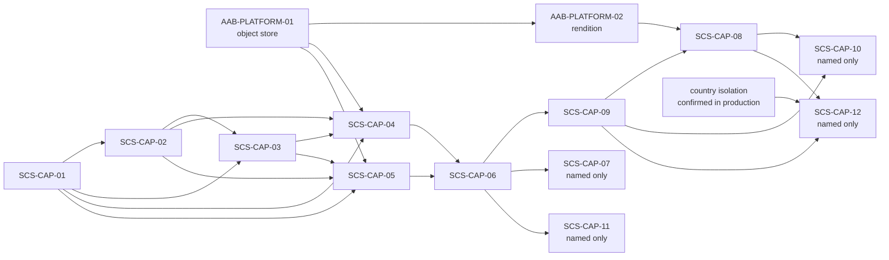
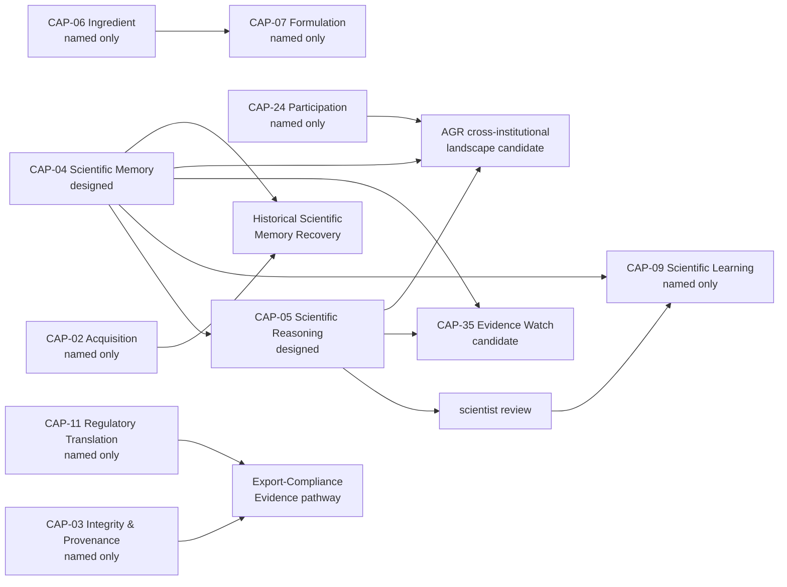
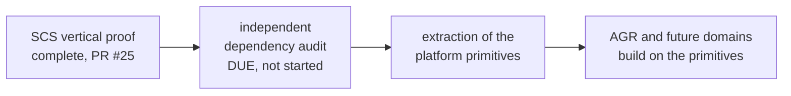

# AAB Platform Roadmap — 2026-09-27

**Status:** PLATFORM ROADMAP
**Renamed identifiers (2026-09-27):** SCS-PLATFORM-01 and SCS-PLATFORM-02 are now AAB-PLATFORM-01 and AAB-PLATFORM-02, and are cited by their new names throughout.
**Authority:** RECORDS THE STATE OF EVERY AAB PLATFORM PRIMITIVE AND CAPABILITY, AS DEMONSTRATED BY THE CONTRACTS, CODE, TESTS AND PROOFS ON `main` AT `9f17cc2`, AND WHAT MUST EXIST BEFORE WHAT. Admits no capability, grants no implementation, commissioning, production, regulatory or scientific authority, changes no control's status, and does not satisfy Gate D or begin WP05.
**Sources:**
- `governance/AAB-PLATFORM-PURPOSE-AND-VALUES-REVISION-2026-09-25.md`
- `governance/AAB-PLATFORM-DOMAIN-SEPARATION-DECISION-2026-09-25.md`
- every contract and record in `governance/workstream-b/`
- `governance/AAB-CAP-20-…` and `governance/AAB-CAP-21-…`
- `governance/AAB-current-technical-contract-catalogue-2026-09-20.md`
- `simulation/cap34/capability-fidelity-manifest.json` (snapshot 008)
- the SCS pilot READMEs in `scs-pilot/packages/api/src/capabilities/`
- the two SCS pilot proof records
- the Phase-1 sovereignty register
- every `TODO(` in the repository

## How to read this roadmap

### State labels

Every capability carries exactly one label: the highest state its contracts, code, tests and records actually demonstrate. The labels are the purpose revision's five maturity states, plus `named only` for the state before any contract exists. There is no other state: a capability with a canonical contract is `designed`.

| Label | Meaning here | Source of the definition |
|---|---|---|
| `named only` | Named in a roster, manifest or landscape, with no canonical contract. A candidate design record, if one exists, is noted; it is not a contract. | The state before **Designed** (implicit in the purpose revision) |
| `designed` | A canonical contract defines the capability. | The purpose revision |
| `implemented` | Code on `main` performs part or all of what the contract defines. | The purpose revision |
| `behaviourally proven` | A committed record states that tests or proofs demonstrate the behaviour end to end, over real inputs. For the SCS pilot, that record is `MINIMUM_VERTICAL_SLICE_PROVEN` in the capability README, or a proof record. | The purpose revision |
| `admitted` | The capability has passed the ten-point admission checklist. | The purpose revision |
| `commissioned` | The capability is authorised for operational use through commissioning. | The purpose revision |

**Each state requires the one before it.** A capability with running code but no contract is `named only`, with the code noted. It does not skip to `implemented`.

**Three rules for applying the labels:**
- **A behavioural proof covers the operations it names, not the whole capability.** Every SCS pilot proof is a minimum vertical slice. The operations that are not built are listed with each capability.
- **A capability is `behaviourally proven` on its proof record.** For SCS-CAP-08 and SCS-CAP-09 the proof is in the vertical proof merged as PR #25 (CI run 36228700962). Their READMEs were not updated to record it. The `MINIMUM_VERTICAL_SLICE_PROVEN` records follow in a separate commit after this roadmap.
- **Simulation is not implementation.** CAP-34 represents some capabilities with real logic over synthetic data. The CAP-34 design says "simulation state can never be promoted into production state", so a simulation representation never raises a capability's label.

**Nothing on the platform is admitted or commissioned.** The purpose revision states this, and nothing since has changed it.

### Two numbering systems

AAB has two capability numberings, and their numbers collide:
- **`SCS-CAP-NN`** is the Supply Chain Sovereignty domain (section 2).
- **`CAP-NN`** is the AAB capability landscape, CAP-01 to CAP-34 (section 3).

`CAP-04` (Governed Scientific Memory) and `SCS-CAP-04` (Deforestation Evidence Admission) are different capabilities. This roadmap always writes the `SCS-` prefix.

## 1. Platform primitives

The domain separation decision (25 September) names eleven platform primitives. The SCS pilot built and exercised all of them, because SCS was the first domain to run end to end. The decision's status column has changed since 25 September: SCS-CAP-09, SCS-CAP-08 and both proofs have since been completed.

| # | Primitive | Where it exists | Current state | What it does not yet do |
|---|---|---|---|---|
| 1 | Canonical runtime schemas | JSON Schema 2020-12 with strict Ajv; generated types; the whole registry compiled up front (`foundation/validation.ts`) | `implemented`, exercised by every endpoint and the 549-test suite | No platform-level schema registry; schemas live in `scs-pilot` |
| 2 | Governed identity and authority | `foundation/auth.ts`: static bearer tokens stored as SHA-256, role checks, separation of duties | `implemented` | `TODO(oidc)`; `TODO(role-registry)`; the actor-to-party link (`TODO(actor-reference)`: `ActorReference` has no shared contract and no `partyId`), so mandate-based submission is refused everywhere |
| 3 | Immutable evidence objects | AAB-PLATFORM-01: content-addressed by SHA-256, conditional write, never overwritten | `implemented` (upload only) | Retrieval, retention and read access are undefined in the contract; `TODO(object-store-credentials)`; SCS-CAP-02 and SCS-CAP-03 evidence ids are not linked to stored objects (`TODO(evidence-id-model)`) |
| 4 | Provenance | Submitter, submission time, cited and linked lineage, recorded at admission | `implemented` | No shared provenance contract; each capability records its own |
| 5 | Admission decisions | SCS-CAP-02 to SCS-CAP-05: admit, or admit with limitations, fail closed | `implemented` | `REJECTED` and `QUARANTINED` are reserved everywhere; no quarantine operation exists |
| 6 | Frozen evaluation snapshots | SCS-CAP-06: one REPEATABLE READ snapshot, a manifest, a pure evaluation, content-derived ids | `implemented` | Stored files are not re-hashed at evaluation time |
| 7 | Attributable human review | SCS-CAP-06 conflict resolution (independent `CONFLICT_RESOLVER`); SCS-CAP-09 review decisions with derived currency | `implemented` | Reviewer authority is declared, not verified; a decision cannot be challenged or corrected; eight staleness triggers have no operation that can fire them |
| 8 | Governed package compilation | SCS-CAP-08 with AAB-PLATFORM-02 rendition; digest over content only; `verifyPackageIntegrity` | `implemented` | The evidence export bundle; operator listing; the operator declaration; the authorised representative |
| 9 | Receipts and auditability | A receipt in the same transaction as the decision, a canonical digest, correlation ids, append-only tables guarded by triggers | `implemented`, exercised by every write | `TODO(idempotency-retention)`; failed attempts leave no audit record (SCS-CAP-08) |
| 10 | Country isolation | Internal network with no route outside; a pinned edge container; `scs_api` restricted by grants and RLS | `behaviourally proven` for one environment (access isolation proof; CI runs 36225055661 and 36225819409) | Isolation between environments on a shared host (`TODO(tenant-network-policy)`); organisation-level rows (`TODO(tenant-scope)`); log content; an independent security review |
| 11 | Backup and reconstruction | `scs-pilot/backup/`: full backup, restore into a fresh environment, verified | `behaviourally proven` for the pilot stack (backup-restore proof; CI run 36227701973) | `TODO(backup-encryption)`; signed backups; backup without an outage; recovery objectives; point-in-time recovery; backup location; deletion |

**Mechanisms built alongside the eleven primitives,** in the same pilot:
- the migration runner: owner only, checksums, fail closed;
- mandatory idempotency with byte-identical replay;
- the fail-closed error envelope;
- a server that refuses to start with an unsafe write route;
- a database connection that refuses superuser, BYPASSRLS or owner roles;
- the integrity verifier and the object store archive tool.

**Primitives 1–9 carry no proof record of their own.** Their tests exist and pass, but as primitives they carry `implemented`, by the rule above.

**Every primitive still lives in `scs-pilot` under SCS names:**
- the `ScsFailure` type;
- the `scs` database schema;
- SCS capability ids in `foundation/errors.ts`.

The domain separation decision allows extraction only after an independent dependency audit, which is now due (section 5.3).

## 2. Domain: Supply Chain Sovereignty

The SCS domain definition and the SCS capability roster name **twelve** SCS capabilities, SCS-CAP-01 to SCS-CAP-12. Eight have canonical contracts. Four exist only as concepts in the roster.

**All eight contract headers still read "No implementation exists".** So do the roster's implementation columns. They are out of date: the code and the READMEs record implementation (section 6, documentation that no longer matches the code).

### 2.1 Summary

| Capability | State | Operations built | Proof record |
|---|---|---|---|
| SCS-CAP-01 Regulatory Framework Registration | `behaviourally proven` | 1 of 7 | README, `da62ec3` |
| SCS-CAP-02 Operator and Supplier Identity Registration | `behaviourally proven` | 6 of 12 | README, `748aaba` |
| SCS-CAP-03 Plot and Land Unit Registration | `behaviourally proven` | 1 of 8 | README |
| SCS-CAP-04 Deforestation Evidence Admission | `behaviourally proven` | 1 of 4 | README |
| SCS-CAP-05 Supply Chain Custody Evidence Admission | `behaviourally proven` | 1 of 6 | README |
| SCS-CAP-06 Due Diligence Sufficiency Evaluation | `behaviourally proven` | 4 of 5 | README |
| SCS-CAP-07 Evidence Source Discovery | `named only` | — | — |
| SCS-CAP-08 Due Diligence Package Compilation | `behaviourally proven` | 3 of 5, and no export bundle | PR #25; README record to follow |
| SCS-CAP-09 Regulatory Review and Promotion | `behaviourally proven` | 4 of 6 | PR #25; README record to follow |
| SCS-CAP-10 Challenge Response and Evidence Retrieval | `named only` | — | — |
| SCS-CAP-11 Regulatory Framework Update Management | `named only` | — | — |
| SCS-CAP-12 Cross-Boundary Evidence Reference | `named only` | — | — |
| AAB-PLATFORM-01 Evidence Object Store | `implemented` | upload | none |
| AAB-PLATFORM-02 Governed Document Rendition | `implemented` | render, download | none |
| SCS-BRAIN-CANDIDATE-01 Governed Evidence Intelligence | `named only` (candidate design record) | — | — |

**The pilot's standard for `MINIMUM_VERTICAL_SLICE_PROVEN`:** records feed an SCS-CAP-06 evaluation that runs end to end, honestly, over real admitted evidence, as the restricted `scs_api` role. It does not mean a best-case outcome. **No pilot evaluation can reach `SUFFICIENT`** (`TODO(postgis)`); the best pilot outcome is `GAPS_REQUIRE_HUMAN_DECISION`. The READMEs require that pilot partners be told this.

**The whole chain runs end to end in CI on every pull request,** in two places:
- the `test` job's SCS-CAP-08 test: framework → parties → plot → evidence file → evaluation → review decision → package and PDF;
- the backup-restore proof, which rebuilds that chain in a restored environment.

### 2.2 Each capability

**SCS-CAP-01 Regulatory Framework Registration — `behaviourally proven`**
- **Built:** `registerFramework` (`POST /scs/v1/frameworks`).
- **Not built:** `getFramework`, `getFrameworkVersion`, `listFrameworks`, `updateFramework`, `getEvidenceRequirements`, `checkFrameworkApplicability`.
- **Deferred or open:**
  - The evidence-requirement derivation rules are undefined, so spec values are declared by the registrant (`TODO(spec-derivation)`).
  - Four eligibility checks are recorded `false`, NOT EVALUATED (`TODO(eligibility-rules)`).
  - `REJECTED` and `REQUIRES_REVIEW` are reserved.
  - Versioning is not built: `generatedFromFrameworkVersion` is fixed at "1".
- **Open TODOs:**
  - `TODO(immutability)`: the owner can still change the evidence spec.
  - `TODO(append-only)`: `versionHistory` is a JSON array.
- **Depends on:** nothing. Upstream of every other SCS capability.

**SCS-CAP-02 Operator and Supplier Identity Registration — `behaviourally proven`**
- **Built:** `registerParty`, `submitIdentityEvidence`, `registerRelationship`, `registerMandate`, `addRoleClaim`, `addVerificationAssessment`.
- **Not built:** `getParty`, `getRelationship`, `listRelationshipsForParty`, `revokeMandate`, `listMandatesForParty`, `listParties`.
- **Deferred or open:**
  - The conflict definition is interim, with no name normalisation; natural-person deduplication is left to human review.
  - `REGISTERED_WITH_GAPS`, `REJECTED` and `REQUIRES_HUMAN_REVIEW` are reserved.
  - Submission under a mandate is refused.
  - Scope is not paired per framework.
  - A mandate may outlast its relationship.
  - No party-level verification summary.
  - No registry of verifying authorities.
  - No sub-national jurisdictions.
- **Open TODOs:** `TODO(evidence-id-model)`, `TODO(evidence)`, `TODO(party-versions)`, `TODO(framework-association-arrays)`, `TODO(other-action)`, `TODO(role-registry)`.
- **Depends on:** SCS-CAP-01 (an ACTIVE framework, for relationships, mandates and role claims).

**SCS-CAP-03 Plot and Land Unit Registration — `behaviourally proven`**
- **Built:** `registerPlot` (`POST /scs/v1/plots`).
- **Not built:**
  - `getPlot`, `getPlotTenureClaims`, `getFrameworkAssociations`, `listPlots`, `retirePlot`;
  - `addTenureClaim` and `associateFramework`, whose contracts must be redefined first.
- **Deferred or open:**
  - Overlap is never evaluated, so every pilot plot is `REGISTERED_WITH_GAPS` (`TODO(postgis)`).
  - The declared area is not checked against the geometry.
  - There is no country boundary check (`TODO(country-boundary-check)`).
  - Duplicate plots are not detected.
  - Tenure claims can never be verified.
  - Aggregator and bulk registration are out of launch scope.
- **Depends on:** SCS-CAP-01 (an ACTIVE framework with a matching commodity) and SCS-CAP-02 (claimants and producers).

**SCS-CAP-04 Deforestation Evidence Admission — `behaviourally proven`**
- **Built:** `submitEvidence` (`POST /scs/v1/deforestation-evidence`).
- **Not built:** `getEvidenceRecord`, `listEvidenceForPlot`, and `quarantineEvidence` (not yet specified).
- **Deferred or open:**
  - Every pilot admission is `ADMITTED_WITH_LIMITATIONS`: spatial coverage is not verified, and temporal coverage is not evaluated.
  - Mandate-based submission is deferred.
  - There are no criteria for `REJECTED` or `QUARANTINED`.
  - Temporal sufficiency belongs to SCS-CAP-06.
- **Open TODOs:** `TODO(postgis)`, `TODO(object-store-credentials)`.
- **Depends on:** SCS-CAP-01, SCS-CAP-02, SCS-CAP-03 and AAB-PLATFORM-01.

**SCS-CAP-05 Supply Chain Custody Evidence Admission — `behaviourally proven`**
- **Built:** `submitCustodyEvent` (`POST /scs/v1/custody-events`).
- **Not built:** `getCustodyEvent`, `listCustodyEventsForBatch`, `listCustodyEventsForParty`, `quarantineCustodyEvent`, and `submitTransformationRecord` (which must be redefined first).
- **Deferred or open:**
  - The custody spec is recorded, not applied.
  - There is no producer role: a smallholder is recorded as `SUPPLIER`.
  - Processed products are refused under a raw-commodity framework.
  - There is no batch or facility registry.
  - Mandate scope is not checked.
- **Open TODOs:** `TODO(object-store-credentials)`.
- **Depends on:** SCS-CAP-01, SCS-CAP-02, SCS-CAP-03 (optional source plots) and AAB-PLATFORM-01.

**SCS-CAP-06 Due Diligence Sufficiency Evaluation — `behaviourally proven`**
- **Built:**
  - `evaluateSufficiency`;
  - `getEvaluationResult`;
  - `submitConflictResolution`;
  - `requestReEvaluation`, as an ordinary evaluation citing `previousEvaluationId`.
- **Not built:** `listEvaluationsForPlot`.
- **Deferred or open:**
  - Spatial coverage and overlap are always `NOT_EVALUATED`.
  - Three failure codes are never returned: `EVIDENCE_INTEGRITY_FAILED`, `QUARANTINED_EVIDENCE_IN_SCOPE` and `ACCESS_SCOPE_INVALID`.
  - A conflict resolution cannot be revised.
  - Sampled and risk-based coverage are undefined.
  - Undetected change is not quantified.
  - No lifecycle endpoints exist (tests set lifecycle states by SQL).
- **Open TODOs:** `TODO(postgis)`, `TODO(tenant-scope)`.
- **Depends on:** SCS-CAP-01 to SCS-CAP-05. The roster lists only 01, 03 and 04; the contract and code also require 02 and 05.

**SCS-CAP-07 Evidence Source Discovery — `named only`**
- The roster describes a concept preview for the second phase.
- It surfaces sources to close gaps; it does not fill gaps or admit evidence.
- **Depends on:** SCS-CAP-01 and SCS-CAP-06.

**SCS-CAP-08 Due Diligence Package Compilation — `behaviourally proven`**
- **Built:** `requestCompilation` with its PDF rendition, `getPackage`, `verifyPackageIntegrity`, and the rendition download through AAB-PLATFORM-02.
- **Not built:**
  - `listPackagesForOperator`;
  - `getPackageDigest` (deferred, since `getPackage` returns the digest);
  - the evidence export bundle (deferred until after the rendition).
- **Deferred or open:**
  - The package always states five limitations; one is that original files are not included.
  - English only.
  - No operator declaration and no authorised representative.
  - No bundle size rule.
  - Failed compilations leave no audit record.
- **Proof:** `cap-08-packages.test.ts` proves the whole chain end to end, from framework to package and PDF, every gap disclosed. `rendition.test.ts` checks the rendition digest across platforms. The backup-restore proof rebuilds a package in a restored environment. The proof was merged in PR #25 (CI run 36228700962). The README's `MINIMUM_VERTICAL_SLICE_PROVEN` record follows in a separate commit.
- **Depends on:** SCS-CAP-01 to SCS-CAP-06, SCS-CAP-09 (a CURRENT, VALID `PROCEED_TO_PACKAGE_COMPILATION` decision), AAB-PLATFORM-01 and AAB-PLATFORM-02.

**SCS-CAP-09 Regulatory Review and Promotion — `behaviourally proven`**
- **Built:** `submitDecision`, `getDecision`, `assessCurrency`, and `validateForPackageCompilation` (internal, called by SCS-CAP-08).
- **Not built:**
  - `requestReview` (deferred; no `ScsReviewPackage`);
  - `listDecisionsForSubject`. The contract says it "is built with SCS-CAP-08". SCS-CAP-08 is built and it is not.
- **Deferred or open:**
  - Reviewer authority is not modelled, and the reviewer's name is declared.
  - Challenge and correction are undefined.
  - Eight staleness triggers have no operation that can fire them.
  - `REVIEW_ABORTED_FAIL_CLOSED` is never recorded.
- **Proof:** `cap-09-review-decision.test.ts` proves the full staleness cycle through real endpoints, and the SCS-CAP-08 tests prove its gate end to end. The proof was merged in PR #25 (CI run 36228700962). The README's `MINIMUM_VERTICAL_SLICE_PROVEN` record follows in a separate commit.
- **Depends on:** SCS-CAP-06 (evaluation, receipt, conflict resolutions), SCS-CAP-02 (non-retired reviewer and operator parties), and SCS-CAP-04 and SCS-CAP-05 (the new-evidence staleness check).

**SCS-CAP-10 Challenge Response and Evidence Retrieval — `named only`**
- **Depends on:** SCS-CAP-01, 03, 04, 05, 08 and 09.
- SCS-CAP-08's contract reserves `challengeResponseMetadata` and `verifyPackageIntegrity` for it.

**SCS-CAP-11 Regulatory Framework Update Management — `named only`**
- **Depends on:** SCS-CAP-01 and SCS-CAP-06.

**SCS-CAP-12 Cross-Boundary Evidence Reference — `named only`**
- **Depends on:** SCS-CAP-01, 03, 04, 05, 08 and 09, "plus stable country-isolation architecture confirmed in production".
- The roster calls it last to be designed, and highest complexity.

**AAB-PLATFORM-01 Evidence Object Store — `implemented`**
- **Built:** upload (`POST /scs/v1/evidence-objects`), up to 50 MB, six media types, never overwritten.
- **Not defined by the contract:** retrieval, retention, read access, and who may upload.
- **Not verified:** that the media type matches the bytes.
- **Open TODOs:** `TODO(object-store-credentials)`, which must be done "before any real data is stored".

**AAB-PLATFORM-02 Governed Document Rendition — `implemented`**
- **Built:** a deterministic PDF renderer (pdfkit 0.20.2, fonts pinned by SHA-256) and `GET /scs/v1/renditions/:renditionId` with a re-hash on read.
- **Open:**
  - Thai line breaking.
  - Scripts other than Latin, Greek, Cyrillic and Thai.
  - PDF/A and PDF/UA are not claimed.
  - English only.
  - No signatures.
  - Retention.
- **Depends on:** AAB-PLATFORM-01.

**SCS-BRAIN-CANDIDATE-01 Governed Evidence Intelligence — `named only` (candidate design record)**
- A read-only, advisory reasoning layer above the SCS capabilities.
- Steps 4–8 of its sequencing are open: prove it on fixtures, confirm consistency with SCS-CAP-06, confirm its characterisation, review it against a real scenario, then consider implementation.
- **Depends on:** the outputs of SCS-CAP-01, 03, 04 and 06.

**Deliberately excluded from the SCS domain** (domain definition): automated satellite imagery analysis, predictive compliance risk scoring, and direct TRACES NT submission.

## 3. Domain: Agricultural Science

### 3.1 Where the evidence is

AAB's agricultural science capabilities come from the **AAB capability landscape**, CAP-01 to CAP-34. It was frozen on 19 September, before the platform–domain split, so it does not say which capabilities are AGR and which belong to the platform. There are three kinds of evidence for them, and none of them is the SCS pilot's kind:
- **Canonical contracts** in this repository: CAP-04 and CAP-05 (design contracts), CAP-20 and CAP-21.
- **The CAP-34 simulation** (`simulation/cap34/`): real logic over synthetic or reference data, with behavioural tests that CI does not run.
- **The Supabase rehearsal application.** It is evidenced only by the technical contract catalogue, compiled from a website bundle (`public_html (54)(1).zip`, dated 2 September).
  - **Its code is not in this repository.** `aab-local/` holds two PHP files.
  - The catalogue records 116 active gateway actions, 58 retired actions (HTTP 410), 683 browser contract files and 23 `PLAN_ONLY` tables.
  - It says it cannot prove the deployed database: "no SQL migration directory or authoritative PostgreSQL catalogue dump".

**The rehearsal application runs capabilities that have no canonical contract.** It has actor-gated gateway actions for trials, formulation, observation (including community photo upload), trial learning, cognitive signals and resource intelligence. By the rule above, running code without a contract leaves a capability `named only`, with the code noted. This is the largest honesty gap between what AAB runs and what AAB has contracted.

### 3.2 The scientific and domain capabilities

Names, fidelity and horizon are taken from the CAP-34 fidelity manifest (snapshot 008, v1.7.0).

| Capability | State | Evidence | Horizon |
|---|---|---|---|
| CAP-01 Country Intelligence & Discovery | `named only` | Simulation: `REAL_LOGIC_SYNTHETIC_REFERENCE_DATA`. The rehearsal browser contracts are `READ_ONLY_ADVISORY_SIMULATION_ONLY`, and the rehearsal's persistence route is retired (HTTP 410). | Launch release |
| CAP-02 Governed Scientific Data Acquisition & Interoperability | `named only` | Five source adapters in the rehearsal bundle, each `*_DEFINED_NOT_CONNECTED` (Airtable agriculture, aquaculture). The manifest: `CONCEPT_PREVIEW_NOT_IMPLEMENTED`. | Launch release |
| CAP-03 Evidence Integrity & Provenance | `named only` | The manifest: `CONCEPT_PREVIEW_NOT_IMPLEMENTED` | Launch release |
| CAP-04 Governed Scientific Memory | `designed` | Design contract: "GOVERNANCE DESIGN CONTRACT — NOT IMPLEMENTATION". Defines the `MemoryAdmissionDecision`, the scientific memory record, and a provider-neutral interface (`registerSource`, `preserveOriginal`, `registerExtraction`, `classifyEvidence`, `evaluateAdmission`, …). Nothing is built. | Launch release |
| CAP-05 Governed Scientific Reasoning | `designed` | Design contract, not implementation. Returns "a landscape, not a verdict"; proposes the gateway action `cap05_evaluate_evidence_landscape`. Simulation: real logic, synthetic data. | Launch release |
| CAP-06 Ingredient Intelligence | `named only` | Simulation: real logic, synthetic data. Rehearsal gateway: "Direct wire" (`get_workbench_ingredient_intelligence`). | Launch release |
| CAP-07 Formulation Intelligence | `named only` | Simulation: real logic, synthetic data. Rehearsal gateway: "Direct wire" (`AAB_WORKBENCH_ACTIONS`, 9 actions). | Launch release |
| CAP-08 Controlled Trials & Outcomes | `named only` | Rehearsal gateway: trial workspace, activation, observation capture and outcome actions (21 actions). The manifest: `NOT_YET_REPRESENTED`. | Launch release |
| CAP-09 Governed Scientific Learning | `named only` | Simulation: real logic, synthetic data. Rehearsal gateway: "Direct wire" (`prepare_trial_learning`, `submit_learning_review`, `decide_learning_review`), which shares a gateway scope with CAP-04. | Launch release |
| CAP-10 Safety & Ecological Intelligence | `named only` | The manifest: `NOT_YET_REPRESENTED` | Launch release |
| CAP-11 Regulatory Translation & Dossier Support | `named only` | The manifest: `CONCEPT_PREVIEW_NOT_IMPLEMENTED` | Post-launch |
| CAP-12 Controlled Manufacturing Transfer | `named only` | The manifest: `NOT_YET_REPRESENTED`. The rehearsal has `manufacturing_generate_transfer`. | Post-launch |
| CAP-32 Domain-Specific Scientific Intelligence | `named only` | The manifest: `NOT_YET_REPRESENTED` | Launch release |
| CAP-33 Cross-Domain Scientific Reasoning | `named only` | The manifest: `NOT_YET_REPRESENTED`; carries an `EXCEPTIONAL` disclosure burden | Future platform |

**Also in the rehearsal application, not assigned to any capability number:**
- **Observation** (21 gateway actions): community photo upload, campaigns, validation, photo assessment, and promotion to evidence.
- **Resource intelligence** (13 actions): resources, waste streams, environmental burden.
- **Cognitive** (9 actions): `submit_problem_signal`, `run_agriculture_cognitive_loop`.
- **Browser contracts only,** with `PLAN_ONLY` tables for water and aquaculture:
  - soil (14 contracts);
  - water (12);
  - aquaculture (16);
  - climate (15);
  - environment (13).

**AGR candidates** (not capabilities):
- **CAP-35 Governed Evidence Watch (candidate)** — `named only` (candidate design record).
  - `PROPOSED_NOT_ADMITTED`, post-launch.
  - None of the ten admission points is met.
  - Consumes CAP-04 admission events and CAP-05 landscape snapshots.
- **AGR-CROSS-INSTITUTIONAL-LANDSCAPE-CANDIDATE-01** — a composition profile of CAP-04 then CAP-05, "not a new numbered capability".
  - The independent review found it "SUPPORTED WITH CORRECTIONS REQUIRED".
  - Its remediation (eight items) is not recorded as complete on `main`.
  - Participation authority is unresolved while CAP-24 has no contract.

**Two pathways** are recorded by the CAP-34 pathway reconciliation, both "DESIGNED — BUILD REQUIRED; EVIDENCE REQUIRED":
- **Historical Scientific Memory Recovery:** CAP-02 with CAP-04.
- **Governed Export-Compliance Evidence:** CAP-03 with CAP-11, including EUDR.

### 3.3 The rest of the AAB capability landscape

These capabilities are platform-wide in nature. The landscape does not assign them to a domain.

| Capability | State | Evidence |
|---|---|---|
| CAP-13 Conversational AAB Intelligence | `named only` | `NOT_YET_REPRESENTED` |
| CAP-14A Minimum Sovereign Scientific Messaging | `named only` | `NOT_YET_REPRESENTED`; minimum launch scope |
| CAP-14B Advanced Collaboration | `named only` | `NOT_YET_REPRESENTED`; post-launch |
| CAP-15 Work & Attention Management | `named only` | `NOT_YET_REPRESENTED` |
| CAP-16 Sovereign Country Provisioning | `named only` | `NOT_YET_REPRESENTED`. The CAP-34 design says CAP-16 provisions real country environments. |
| CAP-17 Technical Qualification | `named only` | `NOT_YET_REPRESENTED`. The WP04 security qualification loop exists as Phase-2 work. |
| CAP-18 Governed Release & Country Update Management | `named only` | `NOT_YET_REPRESENTED` |
| CAP-19 Country-Local Support & Diagnostics | `named only` | `NOT_YET_REPRESENTED` |
| CAP-20 Country Capability Catalogue & Selection | `designed` | "CANONICAL CONTRACT — NOT IMPLEMENTATION" |
| CAP-21 Commercial Agreement & Entitlement Management | `designed` | "CANONICAL CONTRACT — NOT IMPLEMENTATION" |
| CAP-22 Capability Availability, Readiness & Activation Control | `named only` | `NOT_YET_REPRESENTED` |
| CAP-23 Governed Identity & Authority Resolution | `named only` | `NOT_YET_REPRESENTED`. Browser contracts `AAB-ID-01` to `09` are in `identity/`. |
| CAP-24 Governed Country, Institution & Professional Participation | `named only` | `NOT_YET_REPRESENTED` |
| CAP-25 Governed Human Decision & Approval Control | `named only` | `NOT_YET_REPRESENTED` |
| CAP-26 Sovereign Country Data Boundary | `named only` | `NOT_YET_REPRESENTED` |
| CAP-27 Protected Security Enforcement | `named only` | `NOT_YET_REPRESENTED` |
| CAP-28 Continuity, Backup & Recovery | `named only` | `NOT_YET_REPRESENTED` |
| CAP-29 | retired | "Intentionally unused"; must not be reused |
| CAP-30 Governed Country Assurance & Audit | `named only` | `NOT_YET_REPRESENTED` |
| CAP-31 Governed Domain Framework | `named only` | `NOT_YET_REPRESENTED` |
| CAP-34 Governed AAB Simulation & Demonstration Environment | `implemented` | See below |

**CAP-34 is `implemented`, as a simulation environment.**
- **Design status:** "BUILD AUTHORISED FOR CONTROLLED PRE-LAUNCH IMPLEMENTATION".
- **What is built:** the simulator, the fidelity manifest with its validator and eight snapshots, the disclosure receipt, and five live capability representations. There are ten behavioural test files.
- **What is not:**
  - The tests are not run in CI.
  - Its README is out of date: it cites snapshot 002 and old fixture counts.
  - No record shows all 15 of the design's minimum proof requirements met.
- **Commissioning credit:** "zero".

## 4. Platform capabilities: the eleven primitives across both domains

The eleven primitives of section 1 are what every domain builds on. This section shows where each is exercised in SCS, and what AGR has in its place today.

**The AGR column names the closest counterpart in the AAB landscape.** The platform–domain separation decision does not map primitives to landscape capabilities; this roadmap proposes the correspondence for review. It is not an established identity.

| # | Primitive | SCS | AGR today | Closest landscape counterpart |
|---|---|---|---|---|
| 1 | Canonical runtime schemas | `implemented`: every endpoint | Browser contracts in the rehearsal bundle; no runtime-enforced canonical schemas evidenced | — |
| 2 | Governed identity and authority | `implemented` | The rehearsal resolves actors through `agriculture.api_resolve_authenticated_actor`; browser contracts `AAB-ID-01` to `09` | CAP-23 (`named only`); CAP-24 (`named only`) |
| 3 | Immutable evidence objects | `implemented` (AAB-PLATFORM-01) | CAP-04 `preserveOriginal` (`designed`); the rehearsal's community photo upload | CAP-03 (`named only`) |
| 4 | Provenance | `implemented` | CAP-04 record envelope (`designed`) | CAP-03 (`named only`) |
| 5 | Admission decisions | `implemented` (SCS-CAP-02 to 05) | CAP-04 `MemoryAdmissionDecision` (`designed`) | CAP-04 (`designed`) |
| 6 | Frozen evaluation snapshots | `implemented` (SCS-CAP-06) | CAP-05 `EvidenceLandscapeSnapshotIdentity` (`designed`) | CAP-05 (`designed`) |
| 7 | Attributable human review | `implemented` (SCS-CAP-06, SCS-CAP-09) | The rehearsal's `decide_learning_review` and `decide_observation_review` | CAP-25 (`named only`); CAP-09 (`named only`) |
| 8 | Governed package compilation | `implemented` (SCS-CAP-08, AAB-PLATFORM-02) | None | CAP-11 (`named only`, post-launch) |
| 9 | Receipts and auditability | `implemented` | CAP-34 disclosure receipt (simulation only) | CAP-30 (`named only`) |
| 10 | Country isolation | `behaviourally proven`, one environment | The rehearsal: Phase-1 findings CR-02 and CR-04 are production-standard failures | CAP-26 (`named only`); CAP-16 (`named only`) |
| 11 | Backup and reconstruction | `behaviourally proven`, pilot stack | The rehearsal: CR-06 and CR-07 are production-standard failures | CAP-28 (`named only`) |

**What the table shows:**
- Every primitive exists in working, tested form only inside the SCS pilot.
- AGR's two designed capabilities, CAP-04 and CAP-05, specify their own versions of primitives 3 to 6.
- The platform–domain separation decision requires AGR to be "designed against the primitives listed here, not against SCS's domain modules". The CAP-04 and CAP-05 contracts predate that decision (20 September). Whether they align with the SCS-built primitives has not been assessed.

## 5. Dependencies

### 5.1 SCS

**The chain, in words:**
- SCS-CAP-01 comes first.
- SCS-CAP-02 and SCS-CAP-03 require it.
- SCS-CAP-04 and SCS-CAP-05 require 01, 02, 03 and the object store.
- SCS-CAP-06 requires 01 to 05.
- SCS-CAP-09 requires SCS-CAP-06.
- SCS-CAP-08 requires SCS-CAP-09's current decision and the rendition service.
- SCS-CAP-10 requires 08 and 09.
- SCS-CAP-12 also requires country isolation confirmed in production, which no environment has.
- SCS-CAP-07 and SCS-CAP-11 require 01 and 06.

**Prerequisites the diagram does not show:**
- **Before SCS-CAP-02 and SCS-CAP-03 evidence can be confirmed as stored files,** the evidence-id model needs a contract change and a migration (`TODO(evidence-id-model)`).
- **Before any SCS evaluation can be `SUFFICIENT`,** a spatial database is needed (`TODO(postgis)`), with country boundary data (`TODO(country-boundary-check)`).
- **Before mandate-based submission,** the actor-to-party link is needed (`TODO(actor-reference)`).

### 5.2 AGR

**The chain, in words:**
- CAP-05 evidence must resolve through CAP-04: admitted, with integrity verified.
- CAP-09 must reference admitted CAP-04 evidence ids, never raw source material.
- CAP-04 and CAP-09 share the rehearsal's `AAB_LEARNING_MEMORY_ACTIONS` scope, and must be separated together.
- Evidence Watch consumes CAP-04 and CAP-05, and must never run CAP-05 on its own initiative.
- CAP-07 consumes CAP-06's output.

### 5.3 The next required step: the independent dependency audit

**The independent dependency audit is now due, and is required before any platform extraction begins.**

- **Why it is due now.** The platform–domain separation decision allows extraction only after the SCS vertical proof is complete: SCS-CAP-09, SCS-CAP-08, the access isolation proof and the backup-restore proof. All four are on `main` (`9f17cc2`).
- **What the decision requires of it.**
  - It establishes the actual dependency graph: every place a primitive depends on the SCS domain, and every place the domain depends on a primitive in an undeclared way.
  - The extraction plan is based on the audit, not on the decision record.
  - It is independent.
- **What it should also cover:** whether the CAP-04 and CAP-05 contracts, written on 20 September before the primitives were named, align with the primitives the SCS pilot built.
- **Its constraint on extraction:** every existing behavioural test and proof must pass unchanged afterwards. An extraction that changes proven behaviour is a redesign, and needs its own decision.
- **Until then,** the decision authorises no refactor, code move or database change.

### 5.4 Platform and commercial
- **CAP-20 → CAP-21.** A selection may initiate an entitlement, never create one.
- **CAP-21 participant entitlement → a valid country deployment agreement.**
- **Activation of any capability** requires entitlement, provisioning, governance approval and admission (buyer journey record).
- **CAP-34 → CAP-16.** Real country environments are provisioned by CAP-16, not the simulation.

### 5.5 Before any capability can be admitted

- **An admission authority.** CAP-20 names a "capability identity and admission authority" as the source of admission status, and no document defines it. No capability can be admitted until it exists.
- **The ten-point admission checklist.** It is reproduced verbatim only in the Evidence Watch candidate design, and written for Evidence Watch. No capability has been put through it.
- **A shared `ActorReference` contract.** `TODO(actor-reference)` says this "must be confirmed in a shared contract before any capability is admitted".
- **Independent review** of each capability, as admission requires.
- **The capability registry and the CAP-34 fidelity manifest updated together** (checklist items 8 and 9).
  - The fidelity manifest does not list the SCS capabilities at all.
  - CAP-34's SCS roadmap preview (`simulation/cap34/scs-roadmap-preview.js`) shows them as `DESIGN_CONTRACT_COMPLETE_NOT_IMPLEMENTED`, or `CONCEPT_PREVIEW_NOT_IMPLEMENTED`.

Gate D is not an admission prerequisite. It follows admission, and blocks commissioning (section 7.3).

## 6. Open TODOs

**How the groups were set:** by the precondition the source itself states. Where a source states none, the TODO is grouped by what it limits. The grouping is this roadmap's, for review.

### 6.1 Blocks real data or live operation

| TODO | Gap | Stated precondition |
|---|---|---|
| `TODO(object-store-credentials)` | The API's object store identity has admin rights | "Before any real data is stored": a put/read-only identity with object locking |
| `TODO(backup-encryption)` | Backups are unencrypted and unsigned, and hold credentials and country data | Egress spec §6: backups follow the primary data's sovereignty classification |
| `TODO(tenant-scope)` | RLS is `USING (true)`: no organisation-level row filtering | "Sufficient only while each country deployment serves one organisation" |
| `TODO(tenant-network-policy)` | Environments on one host are not isolated from each other | Separate hosts, or host firewall or kernel-level network policy |
| `TODO(actor-reference)` | `ActorReference` has no shared contract and no `partyId` | "Before any capability is admitted" |

### 6.2 Limits what the pilot can conclude (disclosed in every result)

| TODO | Gap | Effect |
|---|---|---|
| `TODO(postgis)` | No spatial database | No evaluation can be `SUFFICIENT`; every plot is `REGISTERED_WITH_GAPS`; every deforestation admission has limitations |
| `TODO(country-boundary-check)` | No country boundary data | A plot outside its declared country is not detected |
| `TODO(eligibility-rules)` | The SCS-CAP-01 contract defines no eligibility rules | Four eligibility checks are always NOT EVALUATED |
| `TODO(spec-derivation)` | The SCS-CAP-01 contract defines no derivation rules | Evidence spec values are declared, not derived |
| `TODO(evidence-id-model)` | SCS-CAP-02 and SCS-CAP-03 evidence ids are not linked to stored objects | Every such decision discloses that cited evidence cannot be confirmed; needs a contract change and a migration |
| `TODO(evidence)` | Evidence id columns have no foreign key | As above |

### 6.3 Hardening

| TODO | Gap |
|---|---|
| `TODO(oidc)` | Static bearer tokens; OIDC to replace them behind the same interface |
| `TODO(role-registry)` | No central role list; unknown roles in the actors file are not refused |
| `TODO(idempotency-retention)` | Idempotency records never expire |
| `TODO(immutability)` | The database owner can still change the SCS-CAP-01 evidence spec |
| `TODO(append-only)` | SCS-CAP-01 `versionHistory` is a JSON array, not an insert-only table |
| `TODO(party-versions)` | Only the current party version is stored |
| `TODO(framework-association-arrays)` | uuid[] columns cannot carry foreign keys; the capability checks them instead |
| `TODO(other-action)` | `OTHER_EXPLICITLY_NAMED` has no describing field in migration 002 (a later migration added one) |

**Resolved, but the tag remains in immutable files:**
- `TODO(migration-runner)` in migration 001;
- `TODO(docker-e2e)`;
- `TODO(framework-association)` for role claims (resolved by migration 009).

### 6.4 Disclosed gaps without a TODO tag

**Operations the contracts define but that are not built:** listed per capability in section 2.2. Nearly every SCS read endpoint is among them.

**Other disclosed gaps:**
- **Proof:** no independent security review; `SHA256SUMS` unsigned; no recovery objectives; no point-in-time recovery.
- **Reserved outcomes:** `REJECTED` and `QUARANTINED` in every admission capability.
- **Undefined reviewer and verifier authority:** SCS-CAP-02 verifying authorities; SCS-CAP-09 reviewer authority.
- **Unsupported languages and scripts:** AAB-PLATFORM-02 and SCS-CAP-08 are English only.
- **AGR candidate:** the eight remediation items for the cross-institutional landscape candidate.
- **Phase 2 security:**
  - `PH2-SEC-CC-RLS-ADVISORY-01` is OPEN.
  - `PH2-SEC-RESTORE-FUNCTION-GRANT-01` has an open reconstruction root cause, and is recorded as an open mandatory Gate D item.

### 6.5 Documentation that no longer matches the code

These are corrections, not capability gaps. They should be fixed so the record stops understating what exists.

- **All eight SCS contract headers,** AAB-PLATFORM-01 and AAB-PLATFORM-02 say "No implementation exists".
- **The SCS roster** marks everything "NOT AUTHORISED — NOT STARTED" and `DESIGN_CONTRACT_COMPLETE_NOT_IMPLEMENTED`.
- **CAP-34's SCS roadmap preview** (`simulation/cap34/scs-roadmap-preview.js`) shows every SCS capability as not implemented. It shows SCS-CAP-02 and SCS-CAP-05 as `CONCEPT_PREVIEW_NOT_IMPLEMENTED`, although both have contracts.
- **`scs-pilot/README.md`** says "No capability logic is implemented", that only SCS-CAP-01 is served, and migrations 001–005.
- **`cap-06/README.md`** says only `COMPLIANCE_OFFICER` may read; the code and contract also allow `REGULATORY_REVIEWER`.
- **`cap-09/routes.ts`** calls `validateForPackageCompilation` deferred; it is built.
- **The SCS-CAP-05 contract** says SCS-CAP-06 has no custody-chain evaluation; it now does.
- **The SCS-CAP-09 contract** says `listDecisionsForSubject` is built with SCS-CAP-08; it is not.
- **`simulation/cap34/README.md`** cites snapshot 002 and superseded fixture counts.

## 7. Commissioning requirements

**No country environment is commissioned.** The Phase-1 sovereignty register's outcome is "**COMMISSIONING OUTCOME: NOT AUTHORISED**", and its controls are non-compensating: one unmet mandatory control prevents commissioning.

### 7.1 What a country environment must prove

**From the Phase-1 sovereignty register:** 30 controls. The status column records the rehearsal's findings, not the SCS pilot's.

| Control | Requirement | Rehearsal status |
|---|---|---|
| CR-01 SOV-OWN-COUNTRY-01 | The country owns its production infrastructure | EVIDENCE REQUIRED |
| CR-02 SOV-ISO-COUNTRY-01 | Isolated application, identity, database, storage, logging, backup and recovery | PRODUCTION STANDARD FAILURE |
| CR-03 SOV-RES-DB-01 | Every database copy inside the sovereign boundary | EVIDENCE REQUIRED |
| CR-04 SOV-ADM-INDEPENDENCE-01 | Independent administration | PRODUCTION STANDARD FAILURE |
| CR-05 SOV-RES-ORIGIN-01 | Every protected origin inside the boundary | PRODUCTION STANDARD FAILURE |
| CR-06 SOV-RES-HOST-BACKUP-01 | Hosting backups inside the boundary | PRODUCTION STANDARD FAILURE |
| CR-07 SOV-BACKUP-OBJECT-COVERAGE-01 | Objects in a tested sovereign backup | PRODUCTION STANDARD FAILURE |
| CR-08 SOV-RECOVERY-OBJECT-01 | Objects restorable within approved objectives | EVIDENCE REQUIRED |
| CR-09 SOV-RECOVERY-DB-01 | Database recovery commissioned with sovereign copies | EVIDENCE REQUIRED |
| CR-10 SOV-RES-LOG-01 | Protected logs sovereign | EVIDENCE REQUIRED |
| CR-11 SOV-RES-CACHE-01 | CDN and cache copies | EVIDENCE REQUIRED |
| CR-12 SOV-RES-EXECUTION-01 | Server-side execution residency | EVIDENCE REQUIRED |
| CR-13 SOV-DERIVATIVE-BOUNDARY-01 | Derivatives stay sovereign | EVIDENCE REQUIRED |
| CR-14 SOV-FLOW-NO-CANONICAL-RETURN-01 | No automatic return to canonical | PASS — reviewed implementation only |
| CR-15 SOV-FLOW-NO-CROSS-COUNTRY-01 | No country-to-country propagation | PASS — reviewed implementation only |
| CR-16 SOV-FLOW-NO-EXTERNAL-AI-01 | No external AI training export | PASS — reviewed implementation only |
| CR-17 SEC-AUTH-PERSISTED-AUTHORITY-01 | Persisted authority over browser claims | PASS — reviewed implementation |
| CR-18 SEC-AUTH-SCIENTIFIC-ACTION-01 | Critical scientific action authorisation | PASS — reviewed implementation |
| CR-19 SEC-DB-NO-DEFINER-ESCALATION-01 | No security-definer escalation | PASS — reviewed functions |
| CR-20 SEC-PRIV-MFA-01 | Privileged administrator MFA | PRODUCTION STANDARD FAILURE |
| CR-21 SEC-PRIV-TOKEN-LIFECYCLE-01 | Privileged token lifecycle | PRODUCTION STANDARD FAILURE |
| CR-22 SEC-PUBLIC-DIAGNOSTICS-01 | No public diagnostic paths | PRODUCTION STANDARD FAILURE |
| CR-23 SOV-ADM-PROVIDER-ACCESS-01 | Provider personnel access constrained | EVIDENCE REQUIRED |
| CR-24 SOV-KEY-COUNTRY-CONTROL-01 | Country-controlled encryption keys | EVIDENCE REQUIRED |
| CR-25 SOV-LIFECYCLE-DELETION-01 | Deletion across every copy | EVIDENCE REQUIRED |
| CR-26 DEP-PACKAGE-COUNTRY-CLEAN-01 | Clean country template | NOT APPLICABLE TO REHEARSAL — would fail production |
| CR-27 DEP-PACKAGE-VENDOR-NEUTRAL-01 | Vendor-neutral deployment package | EVIDENCE REQUIRED |
| CR-28 DEP-PACKAGE-INDEPENDENT-REBUILD-01 | Rebuild without the rehearsal provider | EVIDENCE REQUIRED |
| CR-29 COM-EVIDENCE-NO-AUTHORITY-01 | Commissioning evidence integrity (the harness is not implemented) | EVIDENCE REQUIRED |
| CR-30 COM-COUNTRY-GOV-APPROVAL-01 | Country and governance approval | NOT APPLICABLE — commissioning gate not satisfied |

**Also required by the other sources:**
- **The egress specification's twelve evidence items:** architecture, outbound endpoints, telemetry, code review, export tests, canonical separation, cross-country tests, embeddings, backup location and recovery, feedback audit, independent penetration review, and regression tests on every release.
- **The country isolation architectures:**
  - one environment per country, provisioned from the clean canonical baseline and never from another country's environment;
  - its own credentials, never copied;
  - vendor-neutral hosting;
  - releases distributed through governance approval, never promoted automatically.
- **The buyer journey:** provisioning assessment (stage 6), and governance approval with a formal activation authorisation (stage 7).
- **CAP-21 agreements:** data residency, permitted providers, administrative isolation, and exit and data-return provisions.

### 7.2 What the SCS pilot contributes

This is evidence for the SCS pilot stack only. It changes no control's status.

| Control or item | Contribution | Still required |
|---|---|---|
| CR-02 country isolation | Network isolation and table-level role isolation for one environment | Cross-environment isolation; organisation-level rows; identity isolation |
| CR-07 object backup coverage | Every object in the backup, tested on every pull request | Sovereign location; encryption |
| CR-08, CR-09 recovery | Complete, consistent restore, verified by digest | Approved recovery objectives, measured at scale |
| CR-28 independent rebuild | The pilot stack rebuilt from the repository and a backup alone | The finished AAB package; an independent assessor |
| Egress items 1–4, 9, 12 | Architecture, outbound inventory, telemetry, code review, recovery evidence, regression tests in CI | Items 5–8, 10, 11; backup location |

### 7.3 The commissioning path and its missing definitions

- **Phase 2 sequence** (register):
  1. sovereign infrastructure;
  2. direct security failures;
  3. unresolved mandatory evidence;
  4. normal hardening;
  5. commissioning verification design;
  6. rehearsal retirement, only after independent reconstruction is proven.
- **WP04** (security qualification loop): instance remediation is verified; the reconstruction root cause remains open.
- **WP05** (reconstruction replay and isolated authority regression proof): proposed only. "WP05 has not begun."
- **The commissioning harness** (`PH2-COM-AUTO-01`): provisional, and not implemented.
- **Gate D blocks commissioning.**
  - **When this roadmap was first written,** Gate D was defined in no document. About twenty documents disclaimed satisfying it; `governance/phase-2/wp04/PH2_WP04_GATE_D_TRACEABILITY_AMENDMENT.md` recorded `PH2-SEC-RESTORE-FUNCTION-GRANT-01` as an open "mandatory Gate-D qualification item"; and the country isolation architecture recorded that no country deployment had received Gate D authority.
  - **It is now defined** in `governance/AAB-GATE-D-DEPLOYMENT-QUALIFICATION-DEFINITION-2026-09-27.md` as **deployment qualification**:
    - it is the AAB authority decision between capability admission and country commissioning;
    - it is granted to one deployment (one country environment, one release, a named set of admitted capabilities), never to a capability in the abstract;
    - it is decided by the Platform Owner on an independent reviewer's assessment.
  - **Gate D follows admission.** An ungranted Gate D blocks commissioning. It does not block admission, which is blocked by its own prerequisites: an admission authority, the ten-point checklist, the shared `ActorReference` contract and independent review (section 5.5).
  - **No deployment has been assessed, and none could be granted today.** Three items block the first assessment: the admission authority, which no document defines; the first independent reviewer appointment; and the commissioning governance document.

## Decisions recorded on 2026-09-27

These points came up while compiling the roadmap and were decided in review.

1. **State vocabulary.** The purpose revision's five maturity states are the canonical vocabulary, with `named only` as the implicit state before any contract exists. A capability with a canonical contract is `designed`; there is no separate "contracted" state.
2. **Twelve SCS capabilities.** All twelve are listed. SCS-CAP-07, 10, 11 and 12 have no contract and are `named only`.
3. **SCS-CAP-08 and SCS-CAP-09 are `behaviourally proven`.** The proof was merged in PR #25. The `MINIMUM_VERTICAL_SLICE_PROVEN` records in their READMEs follow in a separate commit after this roadmap.
4. **Running code without a contract stays `named only`,** with the code noted, whatever it does.
5. **Gate D is recorded as a missing definition that blocks commissioning** (section 7.3). Corrected on 2026-09-27: this item first said it blocked admission as well. Gate D follows admission; it is now defined in `governance/AAB-GATE-D-DEPLOYMENT-QUALIFICATION-DEFINITION-2026-09-27.md`.
6. **The independent dependency audit is due now,** and is required before any platform extraction begins (section 5.3).
7. **The documents that understate what exists** (section 6.5) are corrected in their own commits after this roadmap, not in it.

**Still open, noted in the text:**
- The mapping of the eleven primitives to landscape capabilities (section 4) is proposed by this roadmap, not established.
- Whether the CAP-04 and CAP-05 contracts align with the primitives: for the dependency audit.

## What this document does not establish

- It does not admit, commission or authorise any capability.
- It does not change any control's status, and does not satisfy Gate D or begin WP05.
- It does not schedule build work. Section 5 records dependencies, and the one next step the separation decision itself requires (the dependency audit).
- It does not verify the rehearsal application, whose code is not in this repository.
- It does not define the missing terms it reports. Gate D is defined separately (`governance/AAB-GATE-D-DEPLOYMENT-QUALIFICATION-DEFINITION-2026-09-27.md`); the provisioning authority and the admission authority are not defined anywhere.
