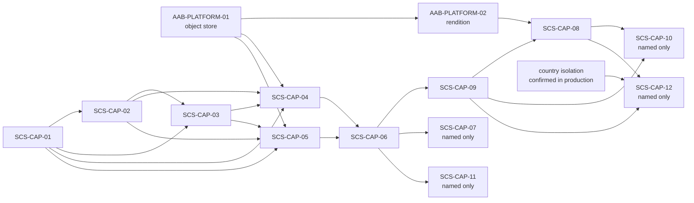
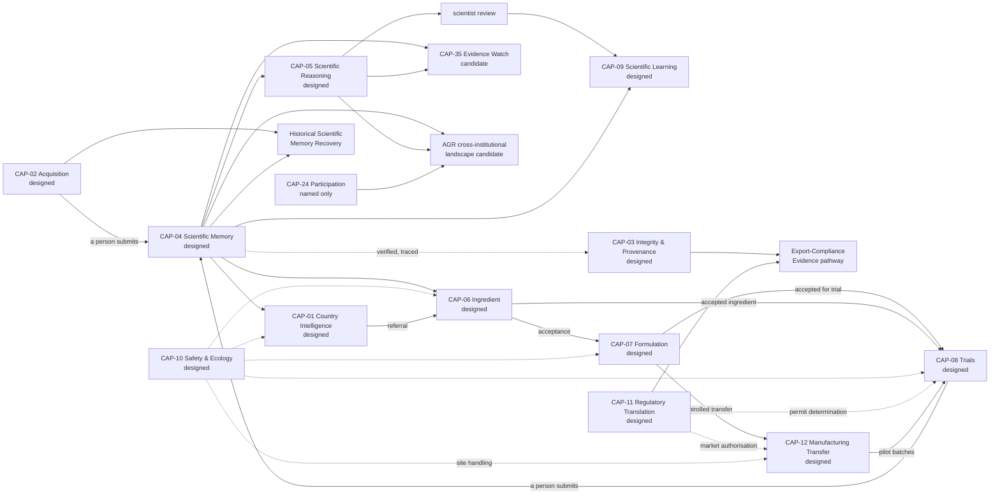
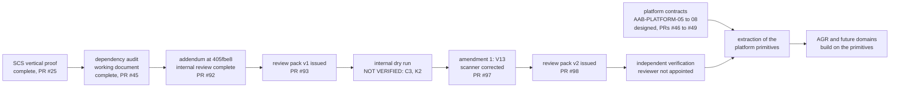
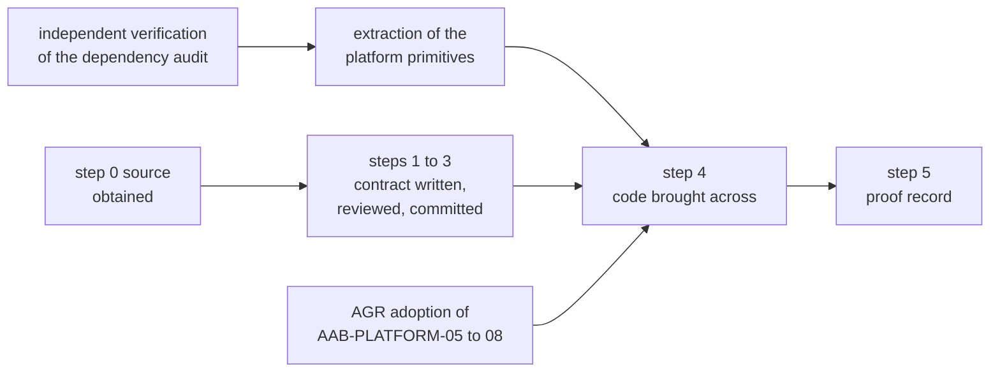

# AAB Platform Roadmap — 2026-09-27

**Status:** PLATFORM ROADMAP
**Renamed identifiers (2026-09-27):** SCS-PLATFORM-01 and SCS-PLATFORM-02 are now AAB-PLATFORM-01 and AAB-PLATFORM-02, and are cited by their new names throughout.
**Updated (2026-09-27):** to `main` at `634295a`, after PRs #27 to #35, from the stock-take `governance/AAB-STOCK-TAKE-2026-09-27.md`, section 8. Open PRs, unmerged branches and open decisions are recorded in the stock-take, not here.
**Updated again (2026-09-27):** to `main` at `67b6ba8`, after the representation path, PRs #37 to #43 (`scs-pilot/REPRESENTATION-PATH-BUILD-PLAN.md`): ActorReference version 2, actor–party links, mandate verification and representative submission are built.
**Updated again (2026-09-28):** to `main` at `c1586c6`, after PRs #44 to #49, from the stock-take `governance/AAB-STOCK-TAKE-2026-09-28.md`, section 11: the platform dependency audit, a completed working document (PR #45), and the platform contracts AAB-PLATFORM-05 to 08 (PRs #46 to #49), all `designed`.
**Updated again (2026-09-28):** to `main` at `fa84240`, after PRs #50 and #51: AAB-PLATFORM-09 Governed Public-Key Registry (`designed`) contracts signing-key history.
**Updated again (2026-09-28):** to `main` at `16d21cc`, after PRs #52 to #59: signing-key history is built and proven (`scs-pilot/SIGNING-KEY-HISTORY-BUILD-PLAN.md`), and AAB-PLATFORM-09 is `behaviourally proven` (`governance/workstream-b/AAB-PLATFORM-09-KEY-REGISTRY-PROOF-2026-09-28.md`). `TODO(signing-key-history)` no longer blocks real data; `TODO(object-store-credentials)` is the remaining blocker before real data is stored. **Also new:** the AGR rehearsal migration workstream (section 8).
**Updated again (2026-09-28):** to `main` at `dbb2408`, after PRs #60 to #65.
- **Step 0 of the AGR workstream is done** (#61, #62): the rehearsal's source is committed as dated evidence snapshots.
- **The AAB-PLATFORM-01 amendment** (#63) is built (#64, the plan; #65, the build) and `behaviourally proven` (`governance/workstream-b/AAB-PLATFORM-01-OBJECT-STORE-PROOF-2026-09-28.md`, on CI run 36417985710 of the merge commit).
- **`TODO(object-store-credentials)` no longer blocks real data.** Real data is now blocked by the override credential's governance, a condition the amendment itself sets (section 6.1).
**Updated again (2026-09-29):** to `main` at `f1bb47d`, after PRs #66 and #67.
- **CAP-04 Governed Scientific Memory has its contract committed under the AGR workstream** (#67): steps 1 to 3 are complete. It stays `designed`, and nothing is built.
- **The demonstration environment's condition is met** (section 8.6).
- **The AGR route prefix `/agr/v1/` is decided,** as a platform decision (decision 18).
- **AAB-PLATFORM-06 is amended** for checks that hold a record for review (#67).
**Updated again (2026-09-29):** to `main` at `d1bc453`, after PR #68, with the AGR capability identity decisions (`governance/workstream-b/AGR-CAPABILITY-IDENTITY-DECISIONS-2026-09-29.md`).
- **Observation is CAP-36 Governed Observation and Field Evidence, proposed:** its own capability, not part of CAP-08, and not canonical until the ten-point checklist is met.
- **Resource intelligence belongs to CAP-01,** with no new number. **Cognitive intelligence is split** between CAP-01 and CAP-06, and its loop is held until `cognitive_core` is read.
- **CAP-01 enters the workstream's priority order,** after CAP-05 (decision 22).
**Updated again (2026-09-29):** to `main` at `695bc18`, after PRs #69 to #71. Marked "update of `695bc18`" where it changes this roadmap.
- **Receipts accept AAB identifiers** (#70, migration 025): `CAP-01` to `CAP-99` except the retired `CAP-29`, and `AAB-PLATFORM-01` to `AAB-PLATFORM-99`, by pattern. **Format only: it makes no capability canonical.** CAP-04's receipt prerequisite is met in the database; the application's capability types open in the extraction's step 2 (decision 23).
- **CAP-05 Governed Scientific Reasoning has its contract committed under the AGR workstream** (#71): steps 1 to 3 are complete. It stays `designed`, and nothing is built (decision 24).
- **`cognitive_core` is read in full,** for CAP-05's amendment. The cognitive loop is not CAP-05, and CAP-05 never depends on it. `cognitive_foundation_workspace` moves from CAP-01 to the held group, so CAP-01 holds 15 rehearsal actions (decision 25).
- **CAP-04 is amended again,** with two corrections following CAP-05's amendment (#71).
**Updated again (2026-09-29):** to `main` at `46e3e09`, after PRs #72 to #74. Marked "update of `46e3e09`" where it changes this roadmap.
- **CAP-04 and CAP-05 name who may challenge their human decisions** (#73), completing their adoption of AAB-PLATFORM-08. Challenge resolutions are final, as the pilot position (decision 26).
- **AAB-PLATFORM-01 defines storage profiles, and the AGR profile** (#74): `agr-evidence`, GOVERNANCE for `Years: 100`, its own media types, 100 MB and 50 GiB limits, and uploads by `MEMORY_SUBMITTER`. The SCS profile is unchanged. **The lock is protection, not expiry** (decisions 27 and 28).
- **Both of CAP-04's prerequisites before any code are met** (#70, #74). CAP-04 adds check 12, `FORMAT_NOT_DECLARED`, under rules `cap-04-admission-2`. Its code still waits on the dependency audit's independent verification and the extraction.
**Updated again (2026-09-29):** to `main` at `7e7bbc0`, after PRs #75 to #77. Marked "update of `7e7bbc0`" where it changes this roadmap.
- **CAP-01 Country Intelligence & Discovery has its contract committed under the AGR workstream** (#76): a new canonical contract, steps 1 to 3 complete. It stays `designed`, and nothing is built (decision 29).
- **Eight of the 34 country actions are not platform-wide** (#76): six are CAP-01's, one CAP-02's and one CAP-06's, and none is brought across (decision 30).
- **The cognitive loop is retired from the migration** (#77), with no capability number; its ideas are recorded against their owners (decision 31).
**Updated again (2026-09-29):** to `main` at `0461bfb`, after PRs #78 to #81. Marked "update of `0461bfb`" where it changes this roadmap.
- **The platform's observation and brain governance is approved** (#79; `governance/AAB-PLATFORM-OBSERVATION-AND-BRAIN-GOVERNANCE-2026-09-29.md`): two observation classes, the observation chain, capability responsibilities, and the brain boundary, "automate reasoning, govern its outputs" (decision 32).
- **The purpose and values carry the corrected brain boundary** (#80; decision 33).
- **CAP-08 Controlled Trials & Outcomes has its contract committed under the AGR workstream** (#81): a new canonical contract, steps 1 to 3 complete. It stays `designed`, and nothing is built (decision 34).
- **AAB-PLATFORM-01's AGR profile names `TRIAL_RECORDER` as an uploader** (#81).
**Updated again (2026-09-30):** to `main` at `a0f0082`, after PRs #82 to #84. Marked "update of `a0f0082`" where it changes this roadmap.
- **The rehearsal's two unauthenticated ingredient reads are blocked at its server** (2026-09-29), at the Platform Owner's instruction: a change to the rehearsal's hosting, outside this repository (decision 35).
- **CAP-06 Ingredient Intelligence has its contract committed under the AGR workstream** (#83): a new canonical contract, steps 1 to 3 complete. It stays `designed`, and nothing is built. **CAP-06's rehearsal mapping is corrected:** five gateway actions the catalogue did not list (section 8.2; decision 36).
- **The domain register and cognitive architecture is approved** (#84; `governance/AAB-PLATFORM-DOMAIN-REGISTER-AND-COGNITIVE-ARCHITECTURE-2026-09-29.md`): AAB's independent knowledge domains are distinguished from the capabilities that operate across them, and the cognitive architecture is recorded. **No official domain or brain register is created** (decision 37).
**Updated again (2026-09-30):** to `main` at `0370bbc`, after PRs #85 to #87. Marked "update of `0370bbc`" where it changes this roadmap.
- **CAP-07 Formulation Intelligence has its contract committed under the AGR workstream** (#87): a new canonical contract, steps 1 to 3 complete. It stays `designed`, and nothing is built (decision 38).
- **CAP-08 is amended** (#87): its test material is governed by CAP-07 and CAP-06, checked at registration and activation (decision 39).
- **The public overview is revised** (#86), and is out of date again for CAP-07 (section 6.5).
**Updated again (2026-09-30):** to `main` at `cb0540d`, after PRs #88 and #89. Marked "update of `cb0540d`" where it changes this roadmap.
- **CAP-09 Governed Scientific Learning has its contract committed under the AGR workstream** (#89): a new canonical contract, steps 1 to 3 complete. It stays `designed`, and nothing is built (decision 40).
- **The contract phase of the AGR workstream is complete** (decision 41): all seven capabilities in its order are `designed`. None is built; code waits on the dependency audit's independent verification and the extraction (sections 5.3 and 8.5).
**Updated again (2026-09-30):** to `main` at `4e26c78`, after PRs #90 to #94. Marked "update of `4e26c78`" where it changes this roadmap.
- **The public overview is revised once, as decided** (#91): seven AGR capabilities `designed`, none built. It matches the governance records again.
- **The dependency audit has an addendum at `405fbe8`** (#92; `governance/AAB-PLATFORM-DEPENDENCY-AUDIT-ADDENDUM-2026-09-30.md`): INTERNAL REVIEW COMPLETE, INDEPENDENT VERIFICATION REQUIRED, with its tools and evidence committed for the first time (decision 42). Its V8 count is corrected (#94).
- **A new version of an existing schema keeps its namespace** (#92; decision 43).
- **The independent review pack is issued** (#93; `governance/review-packs/AAB-PLATFORM-DEPENDENCY-AUDIT-REVIEW-PACK/`), pinned to `c91ce3349856865ce28fb37ead94b8997abcfa8c` (decision 44). **The reviewer is not appointed.**
**Updated again (2026-09-30):** to `main` at `adda4e8`, after PRs #95 to #98. Marked "update of `adda4e8`" where it changes this roadmap.
- **The repository is public, deliberately, and carries no licence** (#96): a review access notice at its root, and a licence status notice in the README (decision 45).
- **An internal dry run of review pack version 1 produced NOT VERIFIED;** the audit's amendment 1 responds (#97; `governance/AAB-PLATFORM-DEPENDENCY-AUDIT-AMENDMENT-1-2026-09-30.md`): **violation V13,** three corrections to the addendum, and the vocabulary scanner corrected (decision 46).
- **Review pack version 2 is issued** (#98; `governance/review-packs/AAB-PLATFORM-DEPENDENCY-AUDIT-REVIEW-PACK-V2/`), pinned to `a797f54f26bb8a8f1a35f3cc7e1b2b92ba4e2afa`. It supersedes version 1 for the review (decision 47). **The reviewer is not appointed.**
**Noted (2026-10-01):** a second internal dry run, of review pack version 2, was carried out by an external AI system (ChatGPT) and, as reported to the Platform Owner, returned **VERIFIED FOR DEFINED SCOPE** on all 43 checklist items, with no FAIL, no EVIDENCE REQUIRED and no new finding: V1 to V13 confirmed, and its search beyond the listed vocabulary found no V14. Its corrected vocabulary scan detected V13 and derived the 32 SCS domain tables. **The same limitation applies as to the first:** it stated that it is not organisationally independent of the prior AAB work, so **it does not discharge the requirement for a signed review by an independent human reviewer.** Its report is recorded verbatim in `governance/audits/platform-dependency/2026-10-01-internal-dry-run-v2.md`. Code's own dry runs checked only that the pack's reproduction commands run end to end on a fresh clone; they did not work through the checklist.
**Updated again (2026-10-02):** to `main` at `625007d`, after PRs #100 and #101. Marked "update of `625007d`" where it changes this roadmap.
- **The second internal dry run is recorded** (#100): the note above, its report kept verbatim as a dated evidence record, and the corrected scanner's derivation limit as an open item (decision 48).
- **CAP-10 Safety & Ecological Intelligence has its contract committed under the AGR workstream** (#101): a new canonical contract, steps 1 to 3 complete, with twenty-six decisions. It stays `designed`, and nothing is built (decision 49).
- **CAP-01, CAP-06, CAP-07, CAP-08 and CAP-09 are amended with it** (#101): CAP-10 governs their safety and ecology, and CAP-08's safety escalation path is decided (decision 50). **`SAFETY_ECOLOGY_NOT_ASSESSED` stays on everything** until an assessment CAP-10 defines exists.
- **The public overview is out of date again,** for CAP-10 (section 6.5).
**Updated again (2026-10-02):** to `main` at `b2c5c10`, after PRs #102 to #104. Marked "update of `b2c5c10`" where it changes this roadmap.
- **The public overview is revised a third time** (#103), with CAP-10 `designed` and the statement that nothing is yet safety-assessed; it is cleared for external use (decision 51). It is out of date again, for CAP-11 (section 6.5).
- **CAP-11 Regulatory Translation & Dossier Support has its contract committed under the AGR workstream** (#104): a new canonical contract, steps 1 to 3 complete, with twenty-four decisions. It stays `designed` and post-launch, and nothing is built (decision 52).
- **CAP-06, CAP-07, CAP-08 and CAP-10 are amended with it** (#104), and **CAP-08's activation now needs a CAP-11 permit determination,** a hard, fail-closed gate. **Until CAP-11 is built, no trial can be activated** (decision 53; section 8.5).
**Updated again (2026-10-02):** to `main` at `591f167`, after PRs #105 to #107. Marked "update of `591f167`" where it changes this roadmap.
- **The public overview is revised a fourth time** (#106), with CAP-11 `designed` and the statement that nothing is yet regulatory-assessed and no field trial can yet be activated; it is cleared for external use (decision 54). It is out of date again, for CAP-12 (section 6.5).
- **CAP-12 Controlled Manufacturing Transfer has its contract committed under the AGR workstream** (#107): a new canonical contract, steps 1 to 3 complete, with twenty-four decisions. It stays `designed` and post-launch, and nothing is built (decision 55).
- **CAP-07, CAP-08, CAP-10 and CAP-11 are amended with it** (#107). **CAP-11 gains a market-authorisation determination,** and its permit determinations extend to manufacturing activities (decision 56).
**Updated again (2026-10-02):** to `main` at `8132243`, after PRs #108 to #111. Marked "update of `8132243`" where it changes this roadmap.
- **The public overview is revised a fifth time** (#109), with CAP-12 `designed` and the statement that nothing is yet transferred for manufacture; it is cleared for external use (decision 57). It is out of date again, for CAP-03 (section 6.5).
- **CAP-03 Evidence Integrity & Provenance has its contract committed under the AGR workstream** (#110): AGR's use of the platform's integrity and provenance mechanics, re-implementing none. It stays `designed`, and nothing is built (decision 58).
- **CAP-01 and CAP-04 to CAP-12 adopt CAP-03's integrity re-check, lineage and vocabulary** (#111), by a linked, stacked change (decision 59). **Of the AGR capabilities in the rehearsal's scope, only CAP-02 has no contract.**
- **CAP-03 raises three platform gaps:** canonicalisation, audit tamper evidence, and the sovereign data boundary ("Still open").
**Updated again (2026-10-02):** to `main` at `3b68e57`, after PRs #112 to #115. Marked "update of `3b68e57`" where it changes this roadmap.
- **The public overview is revised a sixth time** (#113), with CAP-03 `designed` and the statements that no integrity re-check or lineage trace yet runs, and that integrity never proves evidence scientifically true, sufficient or authentic in the world; it is cleared for external use (decision 60). It is out of date again, for CAP-02 (section 6.5).
- **The parallel development protocol is approved** (#114; `governance/development/PARALLEL-DEVELOPMENT-PROTOCOL-2026-10-02.md`): how AAB is developed when more than one AI system works on it at once. No work package is open (decision 61).
- **CAP-02 Governed Scientific Data Acquisition & Interoperability has its contract committed under the AGR workstream** (#115): a new canonical contract, steps 1 to 3 complete, with twenty-three decisions. It stays `designed`, and nothing is built (decision 62). **Every AGR capability in the rehearsal's scope now has a contract.**
- **CAP-01, CAP-04 and AAB-PLATFORM-01 are amended with it** (#115): **CAP-04 gains a batch route and check 13, `ACQUISITION_BASIS_VALID`,** and AAB-PLATFORM-01 an **AGR acquisition staging area** (decision 63).
**Authority:** RECORDS THE STATE OF EVERY AAB PLATFORM PRIMITIVE AND CAPABILITY, AS DEMONSTRATED BY THE CONTRACTS, CODE, TESTS AND PROOFS ON `main` AT `9f17cc2`, UPDATED TO `634295a`, TO `67b6ba8`, TO `c1586c6`, TO `fa84240`, TO `16d21cc`, TO `dbb2408`, TO `f1bb47d`, TO `d1bc453`, TO `695bc18`, TO `46e3e09`, TO `7e7bbc0`, TO `0461bfb`, TO `a0f0082`, TO `0370bbc`, TO `cb0540d`, TO `4e26c78`, TO `adda4e8`, TO `625007d`, TO `b2c5c10`, TO `591f167`, TO `8132243` AND TO `3b68e57`, AND WHAT MUST EXIST BEFORE WHAT. Admits no capability, grants no implementation, commissioning, production, regulatory or scientific authority, changes no control's status, and does not satisfy Gate D or begin WP05.
**Sources:**
- `governance/AAB-PLATFORM-PURPOSE-AND-VALUES-REVISION-2026-09-25.md`
- `governance/AAB-PLATFORM-OBSERVATION-AND-BRAIN-GOVERNANCE-2026-09-29.md` (update of `0461bfb`)
- `governance/AAB-PLATFORM-DOMAIN-REGISTER-AND-COGNITIVE-ARCHITECTURE-2026-09-29.md` (update of `a0f0082`)
- `governance/AAB-PLATFORM-DOMAIN-SEPARATION-DECISION-2026-09-25.md`
- the platform contracts AAB-PLATFORM-03 to 09 in `governance/`
- `governance/AAB-PLATFORM-DEPENDENCY-AUDIT-2026-09-27.md`, and its addendum `governance/AAB-PLATFORM-DEPENDENCY-AUDIT-ADDENDUM-2026-09-30.md` (update of `4e26c78`)
- the independent review pack, `governance/review-packs/AAB-PLATFORM-DEPENDENCY-AUDIT-REVIEW-PACK/` (update of `4e26c78`), superseded for the review by version 2, `governance/review-packs/AAB-PLATFORM-DEPENDENCY-AUDIT-REVIEW-PACK-V2/` (update of `adda4e8`)
- the audit's amendment 1, `governance/AAB-PLATFORM-DEPENDENCY-AUDIT-AMENDMENT-1-2026-09-30.md` (update of `adda4e8`)
- the second internal dry run's report, `governance/audits/platform-dependency/2026-10-01-internal-dry-run-v2.md` (update of `625007d`)
- the parallel development protocol, `governance/development/PARALLEL-DEVELOPMENT-PROTOCOL-2026-10-02.md` (update of `3b68e57`)
- every contract and record in `governance/workstream-b/`
- `governance/AAB-CAP-20-…` and `governance/AAB-CAP-21-…`
- `governance/AAB-current-technical-contract-catalogue-2026-09-20.md`
- `simulation/cap34/capability-fidelity-manifest.json` (snapshot 008)
- the SCS pilot READMEs in `scs-pilot/packages/api/src/capabilities/`
- the SCS pilot proof records, and the AAB-PLATFORM-09 and AAB-PLATFORM-01 proof records
- the Phase-1 sovereignty register
- every `TODO(` in the repository

## How to read this roadmap

### State labels

Every capability carries exactly one label: the highest state its contracts, code, tests and records actually demonstrate. The labels are the purpose revision's five maturity states, plus `named only` for the state before any contract exists. There is no other state: a capability with a canonical contract is `designed`.

| Label | Meaning here | Source of the definition |
|---|---|---|
| `named only` | Named in a roster, manifest or landscape, with no canonical contract. A candidate design record, if one exists, is noted; it is not a contract. | The state before **Designed** (implicit in the purpose revision) |
| `designed` | A canonical contract defines the capability. | The purpose revision |
| `implemented` | Code on `main` performs part or all of what the contract defines. | The purpose revision |
| `behaviourally proven` | A committed record states that tests or proofs demonstrate the behaviour end to end, over real inputs. For the SCS pilot, that record is `MINIMUM_VERTICAL_SLICE_PROVEN` in the capability README, or a proof record. | The purpose revision |
| `admitted` | The capability has passed the ten-point admission checklist. | The purpose revision |
| `commissioned` | The capability is authorised for operational use through commissioning. | The purpose revision |

**Each state requires the one before it.** A capability with running code but no contract is `named only`, with the code noted. It does not skip to `implemented`.

**Three rules for applying the labels:**
- **A behavioural proof covers the operations it names, not the whole capability.** Every SCS pilot proof is a minimum vertical slice. The operations that are not built are listed with each capability.
- **A capability is `behaviourally proven` on its proof record.** For SCS-CAP-08 and SCS-CAP-09 the proof is in the vertical proof merged as PR #25 (CI run 36228700962), and their READMEs record it (PR #26).
- **Simulation is not implementation.** CAP-34 represents some capabilities with real logic over synthetic data. The CAP-34 design says "simulation state can never be promoted into production state", so a simulation representation never raises a capability's label.

**Nothing on the platform is admitted or commissioned.** The purpose revision states this, and nothing since has changed it.

### Two numbering systems

AAB has two capability numberings, and their numbers collide:
- **`SCS-CAP-NN`** is the Supply Chain Sovereignty domain (section 2).
- **`CAP-NN`** is the AAB capability landscape, CAP-01 to CAP-34 (section 3).

`CAP-04` (Governed Scientific Memory) and `SCS-CAP-04` (Deforestation Evidence Admission) are different capabilities. This roadmap always writes the `SCS-` prefix.

## 1. Platform primitives

The domain separation decision (25 September) names eleven platform primitives. The SCS pilot built and exercised all of them, because SCS was the first domain to run end to end. The decision's status column has changed since 25 September: SCS-CAP-09, SCS-CAP-08 and both proofs have since been completed.

| # | Primitive | Where it exists | Current state | What it does not yet do |
|---|---|---|---|---|
| 1 | Canonical runtime schemas | JSON Schema 2020-12 with strict Ajv; generated types; the whole registry compiled up front (`foundation/validation.ts`) | `implemented`, exercised by every endpoint and the 723-test suite | No platform-level schema registry; schemas live in `scs-pilot` |
| 2 | Governed identity and authority | `foundation/auth.ts`: static bearer tokens stored as SHA-256; ActorReference version 2 (AAB-PLATFORM-03) with issuer and scoped authority, read through `holdsRole` and `sameActor`; Ed25519 signatures made outside the server, each verified against the key its statement names, as at its acceptance, from the public-key registry (AAB-PLATFORM-09); actor–subject links (AAB-PLATFORM-04) and representation under a verified mandate | `implemented`; links and representative submission `behaviourally proven` (SCS-CAP-02 README, PR #43); signing-key history `behaviourally proven` (AAB-PLATFORM-09 proof record, PR #59) | `TODO(oidc)`; `TODO(role-registry)`; actor-directory history (section 6.1); party-scoped grants are operator configuration, not signed, evidenced acts; both registries' first keys are self-attested, a disclosed pilot position, and no real key ceremony has been performed; AAB-PLATFORM-03, 04 and 09 are proposed, not admitted |
| 3 | Immutable evidence objects | AAB-PLATFORM-01: content-addressed by SHA-256, conditional write, never overwritten; Object Lock (GOVERNANCE, six years), three scoped identities and every read verified (amendment of 2026-09-28) | `behaviourally proven` (upload and the amendment; PR #65, proof record) | Retrieval and read access are undefined in the contract; the override credential's governance and erasure are undefined (they block real data); SCS-CAP-02 and SCS-CAP-03 evidence ids are not linked to stored objects (`TODO(evidence-id-model)`) |
| 4 | Provenance | Submitter, submission time, cited and linked lineage, recorded at admission | `implemented` | **Contract: AAB-PLATFORM-05 (`designed`, PR #46).** Not adopted by any domain; each capability still records its own provenance, and no gaps are carried into what is built from a record |
| 5 | Admission decisions | SCS-CAP-02 to SCS-CAP-05: admit, or admit with limitations, fail closed | `implemented` | **Contract: AAB-PLATFORM-06 (`designed`, PR #47).** Not adopted. `REJECTED` and `QUARANTINED` are reserved everywhere; under the contract, `REJECTED` is only a reviewer's decision on a held record, and quarantine is a status record after admission. No hold or quarantine operation exists |
| 6 | Frozen evaluation snapshots | SCS-CAP-06: one REPEATABLE READ snapshot, a manifest, a pure evaluation, content-derived ids | `implemented` | **Contract: AAB-PLATFORM-07 (`designed`, PR #48).** Not adopted. The snapshot is embedded in the evaluation, with no digest over its input and no recorded exclusions; some inputs are read but not recorded; stored files are not re-hashed at evaluation time |
| 7 | Attributable human review | SCS-CAP-06 conflict resolution (independent `CONFLICT_RESOLVER`); SCS-CAP-09 review decisions with derived currency | `implemented` | **Contract: AAB-PLATFORM-08 (`designed`, PR #49).** Not adopted. Reviewer authority is declared, not verified; decisions are not signed; a decision cannot be challenged or corrected; eight staleness triggers have no operation that can fire them. **Update of `46e3e09`:** AGR's CAP-04 and CAP-05 adopt its challenge rules, as contracts (#73) |
| 8 | Governed package compilation | SCS-CAP-08 with AAB-PLATFORM-02 rendition; digest over content only; `verifyPackageIntegrity` | `implemented` | The evidence export bundle; operator listing; the operator declaration; the authorised representative |
| 9 | Receipts and auditability | A receipt in the same transaction as the decision, a canonical digest, correlation ids, append-only tables guarded by triggers | `implemented`, exercised by every write | `TODO(idempotency-retention)`; failed attempts leave no audit record (SCS-CAP-08). **Update of `695bc18`:** receipts accept AAB landscape and platform contract identifiers by pattern (migration 025, #70); the application's capability types are still closed (dependency audit, V3) |
| 10 | Country isolation | Internal network with no route outside; a pinned edge container; `scs_api` restricted by grants and RLS | `behaviourally proven` for one environment (access isolation proof; CI runs 36225055661 and 36225819409) | Isolation between environments on a shared host (`TODO(tenant-network-policy)`); organisation-level rows (`TODO(tenant-scope)`); log content; an independent security review |
| 11 | Backup and reconstruction | `scs-pilot/backup/`: full backup, restore into a fresh environment, verified; the restore re-verifies every signature and the public-key registry, with a rotated key's records included | `behaviourally proven` for the pilot stack (backup-restore proof, CI run 36227701973; now 18 steps, CI run 36369519581, cited by the AAB-PLATFORM-09 proof record) | `TODO(backup-encryption)`; signed backups; backup without an outage; recovery objectives; point-in-time recovery; backup location; deletion |

**Mechanisms built alongside the eleven primitives,** in the same pilot:
- the migration runner: owner only, checksums, fail closed;
- mandatory idempotency with byte-identical replay;
- the fail-closed error envelope;
- a server that refuses to start with an unsafe write route;
- a database connection that refuses superuser, BYPASSRLS or owner roles;
- the integrity verifier and the object store archive tool.

**Primitives 1–9 carry no proof record of their own.** Their tests exist and pass, but as primitives they carry `implemented`, by the rule above.

**Every primitive still lives in `scs-pilot` under SCS names:**
- the `ScsFailure` type;
- the `scs` database schema;
- SCS capability ids in `foundation/errors.ts`.

The domain separation decision allows extraction only after an independent dependency audit. A working audit is complete (PR #45); its independent verification is due (section 5.3).

### Platform contracts

| Contract | State | Governs | What exists |
|---|---|---|---|
| AAB-PLATFORM-01 Evidence Object Store | `behaviourally proven` (was `implemented`) | Primitive 3 | Upload, and the amendment of 2026-09-28: scoped identities, Object Lock, verified reads (PR #65; proof record). **Amended on 2026-09-29** (PR #74; update of `46e3e09`): storage profiles, and the AGR profile. **Designed, not built:** the proof covers the SCS profile only. **Amended again** (PR #81; update of `0461bfb`): `TRIAL_RECORDER` may upload under the AGR profile. **Amended again** (PR #115; update of `3b68e57`): **the AGR acquisition staging area,** for CAP-02: not a profile, with no Object Lock and a 90-day expiry there only, not backed up, and copied into the AGR profile, re-hashed, when a person submits an item. **Designed, not built;** its store behaviour is tested before any build |
| AAB-PLATFORM-02 Governed Document Rendition | `implemented` | Primitive 8 (rendition) | Render and download |
| AAB-PLATFORM-03 ActorReference | `implemented` | Primitive 2 | Version 2 issued for every new record (PR #39); version 1 records stay readable. No proof record names it |
| AAB-PLATFORM-04 Actor–Subject Link | `behaviourally proven` | Primitive 2 | As adopted by SCS-CAP-02 (PRs #40, #42; README, PR #43) |
| AAB-PLATFORM-05 Governed Provenance | `designed` | Primitive 4 | Contract only (PR #46) |
| AAB-PLATFORM-06 Admission Decisions | `designed` | Primitive 5 | Contract only (PR #47). Amended on 2026-09-29 (PR #67): a check whose failure holds a record for review |
| AAB-PLATFORM-07 Frozen Evaluation Snapshots | `designed` | Primitive 6 | Contract only (PR #48) |
| AAB-PLATFORM-08 Attributable Human Review with Currency | `designed` | Primitive 7 | Contract only (PR #49) |
| AAB-PLATFORM-09 Governed Public-Key Registry | `behaviourally proven` | Primitive 2 (signing keys) | Built by PRs #53 to #59 (migrations 023 and 024, `/aab/v1/` registry endpoints, the control plane as a separate instance); proven for rotation, restoration, compromise and cross-issuer evidence (`governance/workstream-b/AAB-PLATFORM-09-KEY-REGISTRY-PROOF-2026-09-28.md`). Keys are no longer in the actors file |

**All nine are proposed, not admitted.** AAB-PLATFORM-05 to 08 are written domain-neutrally: each domain adopts them by amendment to its own contracts, mapping its existing records when read and never rewriting them. No domain has adopted them yet. **Update of `695bc18`:** AGR's CAP-04 (#67) and CAP-05 (#71) adopt them by amendment, as contracts; nothing implements an adoption, and SCS has not adopted them. AAB-PLATFORM-08's own precondition, that no adoption goes live with real data until signing-key history is implemented, **is now met** (PR #59); an adoption still needs its own amendment.

**AAB-PLATFORM-09** defines signing-key history: an issuer-owned, append-only registry of public keys, verification against the key active at the server's `acceptedAt`, and compromise as its own record. **It is built and `behaviourally proven`** (PR #59): its section 11 conditions, rotation, restoration, compromise and cross-issuer evidence, pass in CI, and the proof record names each test. **No registry can start until its first key is registered** (its section 3a). The pilot positions, both disclosed and neither a production solution: the Platform Owner's first key is self-attested in a documented ceremony; a country registry's first key is self-attested by the country's authorised representative, in a ceremony the Platform Owner witnesses and co-signs. The procedure is `scs-pilot/KEY-BOOTSTRAP-CEREMONY-RUNBOOK.md`; **no real ceremony has been performed.** The interim rule that a key is never rotated while records it signed are in use is lifted.

**The naming rule** (the dependency audit's step 0, decided on 2026-09-27): what is already stored or externally visible keeps its SCS name; everything new takes an AAB name. `/scs/v1` platform routes are kept as aliases and new ones use `/aab/v1/`; the `scs` schema is kept; new platform schemas use `urn:aab:schema:`; `SCS-PLATFORM` stays in error envelopes until a platform envelope contract exists. **AGR's routes are under `/agr/v1/`** (decision 18, 2026-09-29): a domain has its own route prefix, as SCS has `/scs/v1`, with its own database schema (`agr`) and JSON schema namespace (`urn:aab:schema:agr:`).

## 2. Domain: Supply Chain Sovereignty

The SCS domain definition and the SCS capability roster name **twelve** SCS capabilities, SCS-CAP-01 to SCS-CAP-12. Eight have canonical contracts. Four exist only as concepts in the roster.

**The eight contract headers, and the roster's implementation rows, point to each capability's README for what is implemented** (corrected in PR #26).

### 2.1 Summary

| Capability | State | Operations built | Proof record |
|---|---|---|---|
| SCS-CAP-01 Regulatory Framework Registration | `behaviourally proven` | 1 of 7 | README, `da62ec3` |
| SCS-CAP-02 Operator and Supplier Identity Registration | `behaviourally proven` | 10 of 16 | README, `748aaba`; links, mandate verification and representative submission, PR #43 |
| SCS-CAP-03 Plot and Land Unit Registration | `behaviourally proven` | 1 of 8 | README |
| SCS-CAP-04 Deforestation Evidence Admission | `behaviourally proven` | 1 of 4 | README; representative submission, PR #43 |
| SCS-CAP-05 Supply Chain Custody Evidence Admission | `behaviourally proven` | 1 of 6 | README; representative submission, PR #43 |
| SCS-CAP-06 Due Diligence Sufficiency Evaluation | `behaviourally proven` | 4 of 5 | README |
| SCS-CAP-07 Evidence Source Discovery | `named only` | — | — |
| SCS-CAP-08 Due Diligence Package Compilation | `behaviourally proven` | 3 of 5, and no export bundle | README (PR #26) |
| SCS-CAP-09 Regulatory Review and Promotion | `behaviourally proven` | 4 of 6 | README (PR #26) |
| SCS-CAP-10 Challenge Response and Evidence Retrieval | `named only` | — | — |
| SCS-CAP-11 Regulatory Framework Update Management | `named only` | — | — |
| SCS-CAP-12 Cross-Boundary Evidence Reference | `named only` | — | — |
| AAB-PLATFORM-01 Evidence Object Store | `behaviourally proven` | upload; the amendment of 2026-09-28 | `governance/workstream-b/AAB-PLATFORM-01-OBJECT-STORE-PROOF-2026-09-28.md` |
| AAB-PLATFORM-02 Governed Document Rendition | `implemented` | render, download | none |
| AAB-PLATFORM-03 ActorReference | `implemented` | version 2, issued for every new record (PR #39); version 1 records stay readable | — (no record names it) |
| AAB-PLATFORM-04 Actor–Subject Link | `behaviourally proven` | create, status records, read, use checks, as adopted by SCS-CAP-02 (PRs #40, #42) | SCS-CAP-02 README (PR #43) |
| SCS-BRAIN-CANDIDATE-01 Governed Evidence Intelligence | `named only` (candidate design record) | — | — |

**The pilot's standard for `MINIMUM_VERTICAL_SLICE_PROVEN`:** records feed an SCS-CAP-06 evaluation that runs end to end, honestly, over real admitted evidence, as the restricted `scs_api` role. It does not mean a best-case outcome. **No pilot evaluation can reach `SUFFICIENT`** (`TODO(postgis)`); the best pilot outcome is `GAPS_REQUIRE_HUMAN_DECISION`. The READMEs require that pilot partners be told this.

**The whole chain runs end to end in CI on every pull request,** in three places:
- the `test` job's SCS-CAP-08 test: framework → parties → plot → evidence file → evaluation → review decision → package and PDF;
- the backup-restore proof, which rebuilds that chain in a restored environment, with two signed actor–party links, one signed with a key since rotated, whose signatures and the public-key registry are re-verified after restore;
- the representation path's end-to-end test: a signed link, a verified mandate, three representative submissions, a suspension that refuses the next one, and a reinstatement.

### 2.2 Each capability

**SCS-CAP-01 Regulatory Framework Registration — `behaviourally proven`**
- **Built:** `registerFramework` (`POST /scs/v1/frameworks`).
- **Not built:** `getFramework`, `getFrameworkVersion`, `listFrameworks`, `updateFramework`, `getEvidenceRequirements`, `checkFrameworkApplicability`.
- **Deferred or open:**
  - The evidence-requirement derivation rules are undefined, so spec values are declared by the registrant (`TODO(spec-derivation)`).
  - Four eligibility checks are recorded `false`, NOT EVALUATED (`TODO(eligibility-rules)`).
  - `REJECTED` and `REQUIRES_REVIEW` are reserved.
  - Versioning is not built: `generatedFromFrameworkVersion` is fixed at "1".
- **Open TODOs:**
  - `TODO(immutability)`: the owner can still change the evidence spec.
  - `TODO(append-only)`: `versionHistory` is a JSON array.
- **Depends on:** nothing. Upstream of every other SCS capability.

**SCS-CAP-02 Operator and Supplier Identity Registration — `behaviourally proven`**
- **Built:** `registerParty`, `submitIdentityEvidence` (directly, or as a representative under a verified mandate), `registerRelationship`, `registerMandate`, `addRoleClaim`, `addVerificationAssessment`; and, from the amendments of 2026-09-27, `createActorPartyLink`, `recordActorPartyLinkStatus`, `getActorPartyLink` and `addMandateVerificationAssessment`.
- **Not built:** `getParty`, `getRelationship`, `listRelationshipsForParty`, `revokeMandate`, `listMandatesForParty`, `listParties`.
- **Deferred or open:**
  - The conflict definition is interim, with no name normalisation; natural-person deduplication is left to human review.
  - `REGISTERED_WITH_GAPS`, `REJECTED` and `REQUIRES_HUMAN_REVIEW` are reserved.
  - `PARTY_REPRESENTATIVE` and `PARTY_AUTHORITY_REPRESENTATIVE` grants for a party come from the actors file: operator configuration, not signed, evidenced acts. Every act that relies on one discloses it.
  - Scope is not paired per framework.
  - A mandate may outlast its relationship.
  - No party-level verification summary.
  - No registry of verifying authorities.
  - No sub-national jurisdictions.
- **Open TODOs:** `TODO(evidence-id-model)`, `TODO(evidence)`, `TODO(party-versions)`, `TODO(framework-association-arrays)`, `TODO(other-action)`, `TODO(role-registry)`.
- **Contract amendments for the representation path:** the amendment of 2026-09-27 (PR #34), and the second (PR #37), third (PR #40), fourth (PR #41) and fifth (PR #42) amendments, each made before or while building the part it settles. **For signing-key history:** the sixth amendment (PR #53), and a note of 2026-09-28 recording its proof and lifting the interim rule on key rotation.
- **Depends on:** SCS-CAP-01 (an ACTIVE framework, for relationships, mandates and role claims).

**SCS-CAP-03 Plot and Land Unit Registration — `behaviourally proven`**
- **Built:** `registerPlot` (`POST /scs/v1/plots`).
- **Not built:**
  - `getPlot`, `getPlotTenureClaims`, `getFrameworkAssociations`, `listPlots`, `retirePlot`;
  - `addTenureClaim` and `associateFramework`, whose contracts must be redefined first.
- **Deferred or open:**
  - Overlap is never evaluated, so every pilot plot is `REGISTERED_WITH_GAPS` (`TODO(postgis)`).
  - The declared area is not checked against the geometry.
  - There is no country boundary check (`TODO(country-boundary-check)`).
  - Duplicate plots are not detected.
  - Tenure claims can never be verified.
  - Aggregator and bulk registration are out of launch scope.
- **Depends on:** SCS-CAP-01 (an ACTIVE framework with a matching commodity) and SCS-CAP-02 (claimants and producers).

**SCS-CAP-04 Deforestation Evidence Admission — `behaviourally proven`**
- **Built:** `submitEvidence` (`POST /scs/v1/deforestation-evidence`).
- **Not built:** `getEvidenceRecord`, `listEvidenceForPlot`, and `quarantineEvidence` (not yet specified).
- **Deferred or open:**
  - Every pilot admission is `ADMITTED_WITH_LIMITATIONS`: spatial coverage is not verified, and temporal coverage is not evaluated.
  - Representative submission is built (PR #42): for the plot's producer or operator, or a tenure claimant on its current version.
  - How a party's own staff submit on its behalf is not defined.
  - There are no criteria for `REJECTED` or `QUARANTINED`.
  - Temporal sufficiency belongs to SCS-CAP-06.
- **Contract amendments for the representation path:** the amendment of 2026-09-27 (PR #35) and the second amendment (PR #42); for signing-key history, the third amendment (PR #53).
- **Open TODOs:** `TODO(postgis)`. `TODO(object-store-credentials)` is resolved (AAB-PLATFORM-01's proof record); real data waits on the override credential's governance (section 6.1).
- **Depends on:** SCS-CAP-01, SCS-CAP-02, SCS-CAP-03 and AAB-PLATFORM-01.

**SCS-CAP-05 Supply Chain Custody Evidence Admission — `behaviourally proven`**
- **Built:** `submitCustodyEvent` (`POST /scs/v1/custody-events`).
- **Not built:** `getCustodyEvent`, `listCustodyEventsForBatch`, `listCustodyEventsForParty`, `quarantineCustodyEvent`, and `submitTransformationRecord` (which must be redefined first).
- **Deferred or open:**
  - The custody spec is recorded, not applied.
  - There is no producer role: a smallholder is recorded as `SUPPLIER`.
  - Processed products are refused under a raw-commodity framework.
  - There is no batch or facility registry.
  - Representative submission is built (PR #42), for the source party. `actingUnder` replaced the request's `submissionMandateId`, a breaking change: a request sending it is refused. `provenance.submissionMandateId` is set from `actingUnder`, and the event's mandate (`sourceParty.actingUnderMandateId`) is now also checked against the mandate's scope, still only as the limitation `MANDATE_NOT_VALID`.
  - There is no mandate action for representing a party in a transaction.
  - How a party's own staff submit on its behalf is not defined.
- **Contract amendments for the representation path:** the amendment of 2026-09-27 (PR #35) and the second amendment (PR #42); for signing-key history, the third amendment (PR #53).
- **Open TODOs:** none of its own. `TODO(object-store-credentials)` is resolved (AAB-PLATFORM-01's proof record); real data waits on the override credential's governance (section 6.1).
- **Depends on:** SCS-CAP-01, SCS-CAP-02, SCS-CAP-03 (optional source plots) and AAB-PLATFORM-01.

**SCS-CAP-06 Due Diligence Sufficiency Evaluation — `behaviourally proven`**
- **Built:**
  - `evaluateSufficiency`;
  - `getEvaluationResult`;
  - `submitConflictResolution`;
  - `requestReEvaluation`, as an ordinary evaluation citing `previousEvaluationId`.
- **Not built:** `listEvaluationsForPlot`.
- **Deferred or open:**
  - Spatial coverage and overlap are always `NOT_EVALUATED`.
  - Three failure codes are never returned: `EVIDENCE_INTEGRITY_FAILED`, `QUARANTINED_EVIDENCE_IN_SCOPE` and `ACCESS_SCOPE_INVALID`.
  - A conflict resolution cannot be revised.
  - Sampled and risk-based coverage are undefined.
  - Undetected change is not quantified.
  - No lifecycle endpoints exist (tests set lifecycle states by SQL).
- **Open TODOs:** `TODO(postgis)`, `TODO(tenant-scope)`.
- **Depends on:** SCS-CAP-01 to SCS-CAP-05. The roster lists only 01, 03 and 04; the contract and code also require 02 and 05.

**SCS-CAP-07 Evidence Source Discovery — `named only`**
- The roster describes a concept preview for the second phase.
- It surfaces sources to close gaps; it does not fill gaps or admit evidence.
- **Depends on:** SCS-CAP-01 and SCS-CAP-06.

**SCS-CAP-08 Due Diligence Package Compilation — `behaviourally proven`**
- **Built:** `requestCompilation` with its PDF rendition, `getPackage`, `verifyPackageIntegrity`, and the rendition download through AAB-PLATFORM-02.
- **Not built:**
  - `listPackagesForOperator`;
  - `getPackageDigest` (deferred, since `getPackage` returns the digest);
  - the evidence export bundle (deferred until after the rendition).
- **Deferred or open:**
  - The package always states five limitations; one is that original files are not included.
  - English only.
  - No operator declaration and no authorised representative.
  - No bundle size rule.
  - Failed compilations leave no audit record.
- **Proof:** `cap-08-packages.test.ts` proves the whole chain end to end, from framework to package and PDF, every gap disclosed. `rendition.test.ts` checks the rendition digest across platforms. The backup-restore proof rebuilds a package in a restored environment. The proof was merged in PR #25 (CI run 36228700962). The README records `MINIMUM_VERTICAL_SLICE_PROVEN` (PR #26).
- **Depends on:** SCS-CAP-01 to SCS-CAP-06, SCS-CAP-09 (a CURRENT, VALID `PROCEED_TO_PACKAGE_COMPILATION` decision), AAB-PLATFORM-01 and AAB-PLATFORM-02.

**SCS-CAP-09 Regulatory Review and Promotion — `behaviourally proven`**
- **Built:** `submitDecision`, `getDecision`, `assessCurrency`, and `validateForPackageCompilation` (internal, called by SCS-CAP-08).
- **Not built:**
  - `requestReview` (deferred; no `ScsReviewPackage`);
  - `listDecisionsForSubject`. The contract says it "is built with SCS-CAP-08". SCS-CAP-08 is built and it is not.
- **Deferred or open:**
  - Reviewer authority is not modelled, and the reviewer's name is declared.
  - Challenge and correction are undefined.
  - Eight staleness triggers have no operation that can fire them.
  - `REVIEW_ABORTED_FAIL_CLOSED` is never recorded.
- **Proof:** `cap-09-review-decision.test.ts` proves the full staleness cycle through real endpoints, and the SCS-CAP-08 tests prove its gate end to end. The proof was merged in PR #25 (CI run 36228700962). The README records `MINIMUM_VERTICAL_SLICE_PROVEN` (PR #26).
- **Depends on:** SCS-CAP-06 (evaluation, receipt, conflict resolutions), SCS-CAP-02 (non-retired reviewer and operator parties), and SCS-CAP-04 and SCS-CAP-05 (the new-evidence staleness check).

**SCS-CAP-10 Challenge Response and Evidence Retrieval — `named only`**
- **Depends on:** SCS-CAP-01, 03, 04, 05, 08 and 09.
- SCS-CAP-08's contract reserves `challengeResponseMetadata` and `verifyPackageIntegrity` for it.

**SCS-CAP-11 Regulatory Framework Update Management — `named only`**
- **Depends on:** SCS-CAP-01 and SCS-CAP-06.

**SCS-CAP-12 Cross-Boundary Evidence Reference — `named only`**
- **Depends on:** SCS-CAP-01, 03, 04, 05, 08 and 09, "plus stable country-isolation architecture confirmed in production".
- The roster calls it last to be designed, and highest complexity.

**AAB-PLATFORM-01 Evidence Object Store — `behaviourally proven`** (was `implemented`)
- **Built:** upload (`POST /scs/v1/evidence-objects`), up to 50 MB, six media types, never overwritten.
- **Built and proven (amendment of 2026-09-28; PR #65; `governance/workstream-b/AAB-PLATFORM-01-OBJECT-STORE-PROOF-2026-09-28.md`):**
  - three identities: admin, API (read and write on the evidence bucket) and backup (read and list);
  - Object Lock, GOVERNANCE mode, 2,192 days;
  - a bucket policy naming the API by ARN;
  - the setup step (`objectstore-init`), which refuses and never repairs drift;
  - the API's startup checks;
  - every read verified against its key;
  - backup and restore on the scoped identities.

  Proven on CI run 36417985710 of the merge commit `dbb2408`: 748 tests, and the backup proof `PROVEN` with 20 steps.
- **`TODO(object-store-credentials)` is resolved,** and gone from the code.
- **Not defined by the contract:** retrieval, read access, and who may upload. **Also not defined, and blocking real data:** the override credential's governance, and erasure: what it leaves behind in records, packages and backups (section 6.1).
- **Not verified:** that the media type matches the bytes.
- **Specific to SeaweedFS 4.47:** three behaviours the checks rely on. They are asserted in CI, so an upgrade that changes one fails CI (the proof record's "Limits").

**AAB-PLATFORM-02 Governed Document Rendition — `implemented`**
- **Built:** a deterministic PDF renderer (pdfkit 0.20.2, fonts pinned by SHA-256) and `GET /scs/v1/renditions/:renditionId` with a re-hash on read.
- **Open:**
  - Thai line breaking.
  - Scripts other than Latin, Greek, Cyrillic and Thai.
  - PDF/A and PDF/UA are not claimed.
  - English only.
  - No signatures.
  - Retention.
- **Depends on:** AAB-PLATFORM-01.

**SCS-BRAIN-CANDIDATE-01 Governed Evidence Intelligence — `named only` (candidate design record)**
- A read-only, advisory reasoning layer above the SCS capabilities.
- Steps 4–8 of its sequencing are open: prove it on fixtures, confirm consistency with SCS-CAP-06, confirm its characterisation, review it against a real scenario, then consider implementation.
- **Depends on:** the outputs of SCS-CAP-01, 03, 04 and 06.

**Deliberately excluded from the SCS domain** (domain definition): automated satellite imagery analysis, predictive compliance risk scoring, and direct TRACES NT submission.

## 3. Domain: Agricultural Science

### 3.1 Where the evidence is

AAB's agricultural science capabilities come from the **AAB capability landscape**, CAP-01 to CAP-34. It was frozen on 19 September, before the platform–domain split, so it does not say which capabilities are AGR and which belong to the platform. There are three kinds of evidence for them, and none of them is the SCS pilot's kind:
- **Canonical contracts** in this repository: CAP-04 and CAP-05 (design contracts of 20 September, both amended under the AGR workstream on 2026-09-29: #67 and #71), CAP-20 and CAP-21. **Update of `7e7bbc0`:** and CAP-01, written under the AGR workstream on 2026-09-29 (#76). **Update of `a0f0082`:** and CAP-08 (#81) and CAP-06 (#83), both written under the workstream on 2026-09-29. CAP-08 was omitted here at `0461bfb`. **Update of `0370bbc`:** and CAP-07 (#87), written under the workstream on 2026-09-30. **Update of `cb0540d`:** and CAP-09 (#89), written under the workstream on 2026-09-30. **Update of `625007d`:** and CAP-10 (#101), written under the workstream on 2026-10-02, after its original order. **Update of `b2c5c10`:** and CAP-11 (#104), written under the workstream on 2026-10-02, after its original order. **Update of `591f167`:** and CAP-12 (#107), likewise. **Update of `8132243`:** and CAP-03 (#110), likewise, with CAP-01 and CAP-04 to CAP-12 adopting it (#111). **Update of `3b68e57`:** and CAP-02 (#115), likewise, with CAP-01, CAP-04 and AAB-PLATFORM-01 amended with it.
- **The CAP-34 simulation** (`simulation/cap34/`): real logic over synthetic or reference data, with behavioural tests that CI does not run.
- **The Supabase rehearsal application.** It is evidenced only by the technical contract catalogue, compiled from a website bundle (`public_html (54)(1).zip`, dated 2 September).
  - **Its code is not in this repository.** `aab-local/` holds two PHP files. **Update of `695bc18`:** its deployed gateway and its database schemas are now in the repository, as the step 0 evidence snapshots (`agr-rehearsal/`, #61 and #62; section 8.3). They are evidence, not governed code.
  - The catalogue records 116 active gateway actions, 58 retired actions (HTTP 410), 683 browser contract files and 23 `PLAN_ONLY` tables.
  - It says it cannot prove the deployed database: "no SQL migration directory or authoritative PostgreSQL catalogue dump".

**The rehearsal application runs capabilities that have no canonical contract.** It has actor-gated gateway actions for trials, formulation, observation (including community photo upload), trial learning, cognitive signals and resource intelligence. By the rule above, running code without a contract leaves a capability `named only`, with the code noted. This is the largest honesty gap between what AAB runs and what AAB has contracted. **Closing it is a workstream of its own** (section 8).

### 3.2 The scientific and domain capabilities

Names, fidelity and horizon are taken from the CAP-34 fidelity manifest (snapshot 008, v1.7.0).

| Capability | State | Evidence | Horizon |
|---|---|---|---|
| CAP-01 Country Intelligence & Discovery | **`designed`** (update of `7e7bbc0`; was `named only`) | **Canonical contract, committed under the AGR workstream** (PR #76; `governance/workstream-b/CAP-01-COUNTRY-INTELLIGENCE-AND-DISCOVERY-CANONICAL-CONTRACT-2026-09-29.md`). It adopts AAB-PLATFORM-01, 03 and 05 to 09, and CAP-04. People record problems, resources, waste streams, burdens, recovery pathways and opportunities; admitted CAP-04 records evidence them. A discovery dossier shows coverage, gaps and conflicts, with no score; a scientist's review may refer a subject to CAP-06. Safety and ecology are CAP-10's, disclosed as not assessed. Nothing is built. Simulation: `REAL_LOGIC_SYNTHETIC_REFERENCE_DATA`, not a model for the contract. **Amended** (update of `625007d`; PR #101): CAP-10 may screen a resource or waste stream for handling, shown and never gating; `SAFETY_ECOLOGY_NOT_ASSESSED` permanent in CAP-01. **Adopts CAP-03** (update of `8132243`; PR #111): its integrity re-check, lineage and vocabulary, with its own consequences for compromised or undetermined evidence. **Amended** (update of `3b68e57`; PR #115): external sources and spatial acquisition are CAP-02's, and reach CAP-01 only as admitted CAP-04 evidence; its two open gaps are closed. | Launch release |
| CAP-02 Governed Scientific Data Acquisition & Interoperability | **`designed`** (update of `3b68e57`; was `named only`) | **Canonical contract, committed under the AGR workstream** (PR #115; `governance/workstream-b/CAP-02-GOVERNED-SCIENTIFIC-DATA-ACQUISITION-AND-INTEROPERABILITY-CANONICAL-CONTRACT-2026-10-02.md`). Its governing principle: **CAP-02 brings external material to CAP-04's door, with its source, terms of use, retrieval and any mapping recorded; it never makes anything evidence, true or authoritative.** It adopts AAB-PLATFORM-01 (its staging area), 03, 05, 06, 08 and 09, CAP-03 and CAP-04, and cites the observation and brain governance, the domain register and cognitive architecture, the non-return boundary and the egress specification as binding. Sources registered and approved by a second person, never ranked, on an evidenced permitted-use basis that is a hard gate; a named steward starts every run, and a `MEMORY_SUBMITTER` submits to CAP-04 in their own name, no service account; platform-computed digests, and staging until submission; retrieval only to governor-approved destinations by fixed templates, with no caller URL, no category-2 parameter and no schedule; approved, versioned mappings, never by name, never guessing, originals kept; negatives and nulls kept, duplicates flagged never merged, nothing created elsewhere automatically; spatial acquisition CAP-02's, computation out of launch scope; **launch scope: person-supplied files and allowlisted public retrieval,** live institutional connectors waiting for the sovereign data boundary. Nothing is built. The rehearsal's authority tiers, `VERIFIED` labels, caller-supplied hashes, unauthenticated ingest, Thailand seed and adapters are not carried across. **Corrected** (update of `3b68e57`): the catalogue lists **six** adapter files, `AAB-ADAPTER-AGRI-01`, `-AQUA-01`, `-ENV-01`, `-MFG-01`, `-WATER-01` and the cross-domain `-CORE-01`, each `*_DEFINED_NOT_CONNECTED`; this row named five, and two of them. They are browser files, not in the step 0 snapshot. The manifest: `CONCEPT_PREVIEW_NOT_IMPLEMENTED`. | Launch release |
| CAP-03 Evidence Integrity & Provenance | **`designed`** (update of `8132243`; was `named only`) | **Canonical contract, committed under the AGR workstream** (PR #110; `governance/workstream-b/CAP-03-EVIDENCE-INTEGRITY-AND-PROVENANCE-CANONICAL-CONTRACT-2026-10-02.md`). **The platform proves the integrity and provenance mechanics; CAP-03 applies them to AGR's evidence relationships, traces what an AGR output relied upon, retrieves that evidence when challenged, and fails closed when integrity or lineage cannot be established. Integrity proves that evidence and its history remain what AAB recorded, not that it is true, sufficient or authentic in the world.** It re-implements no platform mechanism and owns no audit ledger. The AGR provenance vocabulary, with mappings from every existing term; five verification profiles and runs; thirteen separate findings, never one "verified"; lineage evaluation, stopping at every boundary but an explicit packet; classified failure consequences, historical decisions never rewritten; incidents scoped by a demonstrated dependency closure; evidence retrieval through the platform's sovereign data boundary. **Adopted by CAP-01 and CAP-04 to CAP-12** (PR #111). Nothing is built. The rehearsal's forkable hash chain, caller-supplied hashes and never-verified assertions are not carried across. The manifest: `CONCEPT_PREVIEW_NOT_IMPLEMENTED`. | Launch release |
| CAP-04 Governed Scientific Memory | `designed` | Canonical contract, **committed under the AGR workstream** (amendment of 2026-09-29, PR #67; `governance/workstream-b/CAP-04-SCIENTIFIC-MEMORY-CANONICAL-CONTRACT-2026-09-20.md`). It adopts AAB-PLATFORM-01, 03 and 05 to 09. One submission, decided in one transaction: refused, held for review, or admitted with or without limitations. Automated and sensitive content is always held. Its routes are under `/agr/v1/`. Nothing is built, and two platform prerequisites come before any code (section 8.5). **Update of `46e3e09`:** both prerequisites are met (#70, #74). Its originals are stored under AAB-PLATFORM-01's AGR profile, and its human decisions can be challenged (#73). **Adopts CAP-03** (update of `8132243`; PR #111): its integrity re-check, lineage and vocabulary, with its own consequences for compromised or undetermined evidence. **Amended** (update of `3b68e57`; PR #115): a batch route; a system-set acquisition reference; **check 13, `ACQUISITION_BASIS_VALID`,** under rules `cap-04-admission-3`; check 10 unchanged, an open question ("Still open"). | Launch release |
| CAP-05 Governed Scientific Reasoning | `designed` | Canonical contract, **committed under the AGR workstream** (amendment of 2026-09-29, PR #71; `governance/workstream-b/CAP-05-GOVERNED-SCIENTIFIC-REASONING-CANONICAL-CONTRACT-2026-09-20.md`). It adopts AAB-PLATFORM-03 and 05 to 09. A scientist lists admitted CAP-04 records and assigns each a stance; CAP-05 returns "a landscape, not a verdict", written once with its frozen snapshot and receipt. A scientist may review it, and a review can be challenged (update of `46e3e09`; #73). No automated stance, no historical landscapes, no automated runs. Its routes are under `/agr/v1/`. Nothing is built. Simulation: real logic, synthetic data. **Adopts CAP-03** (update of `8132243`; PR #111): its integrity re-check, lineage and vocabulary, with its own consequences for compromised or undetermined evidence. | Launch release |
| CAP-06 Ingredient Intelligence | **`designed`** (update of `a0f0082`; was `named only`) | **Canonical contract, committed under the AGR workstream** (PR #83; `governance/workstream-b/CAP-06-INGREDIENT-INTELLIGENCE-CANONICAL-CONTRACT-2026-09-29.md`). It adopts AAB-PLATFORM-01, 03 and 05 to 09, and CAP-04, and cites the observation and brain governance as binding. Ingredients and ingredient candidates, each written once and evidenced by admitted CAP-04 records; an ingredient dossier that shows what is known and missing, with no score or ranking; acceptance for formulation research by a scientist who did not register the ingredient, the only thing that lets CAP-07 use it, on a declared safety and handling basis; prohibited, restricted, unsafe and unidentified material never accepted, and synthetic agrochemicals only as reference material, **a governed mission choice, not a technical limitation**; CAP-01's referrals received by a person. Nothing is built. The simulation's readiness score is not adopted. **Amended** (update of `625007d`; PR #101): a CAP-10 outcome replaces `SAFETY_ECOLOGY_NOT_ASSESSED` where one exists; a negative research-handling outcome refuses acceptance; acceptance no longer suffices alone for field use. **Amended again** (update of `b2c5c10`; PR #104): a verified CAP-11 regulator decision supersedes the declared regulatory status for its jurisdiction. **Adopts CAP-03** (update of `8132243`; PR #111): its integrity re-check, lineage and vocabulary, with its own consequences for compromised or undetermined evidence. | Launch release |
| CAP-07 Formulation Intelligence | **`designed`** (update of `0370bbc`; was `named only`) | **Canonical contract, committed under the AGR workstream** (PR #87; `governance/workstream-b/CAP-07-FORMULATION-INTELLIGENCE-CANONICAL-CONTRACT-2026-09-30.md`). It adopts AAB-PLATFORM-01, 03 and 05 to 09, CAP-04 and CAP-06, and cites the observation and brain governance and the domain register and cognitive architecture as binding. Formulation objectives and formulations, written once; every component a CAP-06 ingredient with a valid, current acceptance for formulation research; quantities on a declared basis with units; a dossier with no score or ranking; `ACCEPT_FOR_TRIAL` by a scientist who did not author the formulation, the only thing that lets CAP-08 register a trial of it; no manufacturing eligibility, no trial creation, no formulation generator; composition disclosed only to CAP-07 roles. Nothing is built. The simulation's formulation score is not adopted. **Amended** (update of `625007d`; PR #101): the same safety rules as CAP-06; a composition access grant for a safety assessment, purpose-, version- and time-bound. **Amended again** (update of `b2c5c10`; PR #104): `REGULATORY_STATUS_NOT_ASSESSED` replaced per jurisdiction only by a CAP-11 outcome or verified regulator decision. **Amended a third time** (update of `591f167`; PR #107): a composition grant for `MANUFACTURING_TRANSFER`, issued only under a valid CAP-12 authorisation, staged. **Adopts CAP-03** (update of `8132243`; PR #111): its integrity re-check, lineage and vocabulary, with its own consequences for compromised or undetermined evidence. | Launch release |
| CAP-08 Controlled Trials & Outcomes | **`designed`** (update of `0461bfb`; was `named only`) | **Canonical contract, committed under the AGR workstream** (PR #81; `governance/workstream-b/CAP-08-CONTROLLED-TRIALS-AND-OUTCOMES-CANONICAL-CONTRACT-2026-09-29.md`). It adopts AAB-PLATFORM-01, 03 and 05 to 09, and CAP-04, and cites the observation and brain governance as binding. A protocol declared first and locked at activation, with a control arm; activation by a scientist who did not design the trial, on a declared safety basis; trial observations admitted by rule, a safety signal held at once; a descriptive, machine-generated outcome summary with no efficacy verdict; an independent outcome review; closure that never requires a positive result. Results reach CAP-04 only on a person's submission. Nothing is built. The manifest: `NOT_YET_REPRESENTED`. **Amended** (update of `0370bbc`; PR #87): the test material is governed by CAP-07 and CAP-06, checked at registration and activation. **Amended** (update of `625007d`; PR #101): a CAP-10 outcome required at activation for every applied material, a registered product exempt only within its registration; safety signals become CAP-10 signals; holds and directions in the trial's state; interim position 8 closed. **Amended again** (update of `b2c5c10`; PR #104): **a CAP-11 permit determination required at activation,** a hard gate; a permit's expiry, suspension or revocation holds further application. **Amended a third time** (update of `591f167`; PR #107): pilot batches named on arms, traceable to their exact specification and the manufacturer's QC release. **Adopts CAP-03** (update of `8132243`; PR #111): its integrity re-check, lineage and vocabulary, with its own consequences for compromised or undetermined evidence. | Launch release |
| CAP-09 Governed Scientific Learning | **`designed`** (update of `cb0540d`; was `named only`) | **Canonical contract, committed under the AGR workstream** (PR #89; `governance/workstream-b/CAP-09-GOVERNED-SCIENTIFIC-LEARNING-CANONICAL-CONTRACT-2026-09-30.md`). It adopts AAB-PLATFORM-03 and 05 to 09, CAP-04 and CAP-05, and cites the brain governance, the domain register and cognitive architecture and the non-return boundary as binding. Learning claims citing only admitted CAP-04 records, from any admitted evidence, each with a declared applicability boundary; a learning dossier with no confidence score and no automatic promotion; `PROMOTE` by a scientist who neither proposed the claim nor submitted its evidence; an unreplicated promotion carrying `UNREPLICATED` permanently; negative and adverse results as learning, acted on by nothing automatically; never a claim of safety, never approval; a 36-month lapse. Nothing is built. The simulation's automatic promotion is not adopted. **Amended** (update of `625007d`; PR #101): `SAFETY_ECOLOGY_NOT_ASSESSED` permanent in CAP-09; a promoted adverse effect is a currency trigger in CAP-10. **Adopts CAP-03** (update of `8132243`; PR #111): its integrity re-check, lineage and vocabulary, with its own consequences for compromised or undetermined evidence. | Launch release |
| CAP-10 Safety & Ecological Intelligence | **`designed`** (update of `625007d`; was `named only`) | **Canonical contract, committed under the AGR workstream** (PR #101; `governance/workstream-b/CAP-10-SAFETY-AND-ECOLOGICAL-INTELLIGENCE-CANONICAL-CONTRACT-2026-10-02.md`). It adopts AAB-PLATFORM-03 and 05 to 09, and CAP-04, and cites the observation and brain governance, the domain register and cognitive architecture and the non-return boundary as binding. Assessments of an ingredient, formulation or off-label product use, within a declared use boundary, by qualified, independent assessors (two for elevated risk), with five outcomes that never say "cleared" or "safe" and a display block that says it is not general safety certification or regulatory approval; a separately limited hazard screen for raw material handled during discovery; mandatory minimum dimensions; traditional knowledge and supplier material never independently sufficient; event-driven currency under a 24-month pilot ceiling; a safety-signal lifecycle; automatic precautionary holds, fail closed, with narrow deterministic critical rules; severity-based notification and triage; protected information classes; a `SAFETY_GOVERNOR`. Nothing is built. The rehearsal's concern scores, attention bands and gate that could never pass are not carried across. The manifest: `NOT_YET_REPRESENTED`. **Amended** (update of `b2c5c10`; PR #104): CAP-11's name corrected, a clerical correction; regulatory status shown beside its outcomes, never merged. **Amended again** (update of `591f167`; PR #107): a `MANUFACTURING_HANDLING` use stage for one named site; manufacturing reports as a signal channel. **Adopts CAP-03** (update of `8132243`; PR #111): its integrity re-check, lineage and vocabulary, with its own consequences for compromised or undetermined evidence. | Launch release |
| CAP-11 Regulatory Translation & Dossier Support | **`designed`** (update of `b2c5c10`; was `named only`) | **Canonical contract, committed under the AGR workstream** (PR #104; `governance/workstream-b/CAP-11-REGULATORY-TRANSLATION-AND-DOSSIER-SUPPORT-CANONICAL-CONTRACT-2026-10-02.md`). Its governing principle: **AAB may organise regulatory evidence, expose gaps and assemble a governed dossier; it does not practise law, declare compliance, grant market access or substitute its decision for a regulator's.** It adopts AAB-PLATFORM-02, 03 and 05 to 09, package compilation and CAP-04, whose admitted documents hold every source and regulator document. A country's working record of each jurisdiction's law, never the law itself, citing authoritative sources; requirement sets verified by two qualified people; person-declared evidence mappings; seven dossier outcomes with no percentage or rank, never "compliant" or "approved"; regulator decisions recorded with authenticity evidence from the regulator; **a hard, fail-closed permit determination for every field trial;** event-driven currency under a 12-month pilot ceiling, `UNDETERMINED` when monitoring is overdue; governed dossier egress; **EUDR stays with SCS.** Nothing is built. The rehearsal's readiness percentage, unwritable tables and unenforced security gate are not carried across. The manifest: `CONCEPT_PREVIEW_NOT_IMPLEMENTED`. **Amended** (update of `591f167`; PR #107): **a market-authorisation determination,** with two assessors for `MARKET_AUTHORISATION_NOT_REQUIRED_WITHIN_BOUNDARY`; permit determinations for manufacturing evaluation and pilot activities. **Adopts CAP-03** (update of `8132243`; PR #111): its integrity re-check, lineage and vocabulary, with its own consequences for compromised or undetermined evidence. | Post-launch |
| CAP-12 Controlled Manufacturing Transfer | **`designed`** (update of `591f167`; was `named only`) | **Canonical contract, committed under the AGR workstream** (PR #107; `governance/workstream-b/CAP-12-CONTROLLED-MANUFACTURING-TRANSFER-CANONICAL-CONTRACT-2026-10-02.md`). Its governing principle: **AAB may assemble a governed manufacturing specification and record a controlled transfer; it does not authorise sale, release a batch, certify quality, grant intellectual-property rights or substitute for a regulator or a manufacturer's qualified authority. A controlled transfer proceeds only when the exact specification, evidence basis, safety conditions, regulatory pathway, rights authority, recipient, site and permitted purpose are established.** It adopts AAB-PLATFORM-02, 03 and 05 to 09, package compilation and CAP-04. Disclosure, manufacturing activity and physical transfer kept separate; **a stage-specific gate matrix** (`TECH_TRANSFER_ONLY`, producing no material; `MANUFACTURING_EVALUATION`; `PILOT_MANUFACTURE`; `COMMERCIAL_MANUFACTURING_TRANSFER`); an `AUTHORISED_RIGHTS_CONTROLLER` on a recorded authority basis, AAB never adjudicating IP; a governed evidence basis of every trial, whatever its outcome; composition only by a staged CAP-07 grant; two independent approvers and the manufacturer's separate acceptance for commercial transfer; batch attestations, release being the manufacturer's QC act; holds that follow the basis relied on. Nothing is built. The rehearsal's transfer, which could disclose a full production formula for commercial manufacture with no gate, is not carried across. The manifest: `NOT_YET_REPRESENTED`. **Adopts CAP-03** (update of `8132243`; PR #111): its integrity re-check, lineage and vocabulary, with its own consequences for compromised or undetermined evidence. | Post-launch |
| CAP-32 Domain-Specific Scientific Intelligence | `named only` | The manifest: `NOT_YET_REPRESENTED` | Launch release |
| CAP-33 Cross-Domain Scientific Reasoning | `named only` | The manifest: `NOT_YET_REPRESENTED`; carries an `EXCEPTIONAL` disclosure burden | Future platform |

**Also in the rehearsal application, not assigned to any capability number** until the identity decisions of 2026-09-29 (`governance/workstream-b/AGR-CAPABILITY-IDENTITY-DECISIONS-2026-09-29.md`):
- **Observation** (21 gateway actions): community photo upload, campaigns, validation, photo assessment, and promotion to evidence. **Now CAP-36 Governed Observation and Field Evidence, proposed,** not canonical until the ten-point checklist is met.
- **Resource intelligence** (13 actions): resources, waste streams, environmental burden. **Now CAP-01.**
- **Cognitive** (9 actions): `submit_problem_signal`, `run_agriculture_cognitive_loop`. **Now split:** three actions to CAP-01, one to CAP-06, and the loop with its four reads held. **Update of `695bc18`:** two to CAP-01; `cognitive_foundation_workspace` is a dashboard for the whole kernel, and is held with the loop (identity record, note of 2026-09-29). **Update of `7e7bbc0`:** the loop and every held action are retired from the migration, with no number (#77).
- **Browser contracts only,** with `PLAN_ONLY` tables for water and aquaculture. **Update of `a0f0082`:** the domain register and cognitive architecture (`governance/AAB-PLATFORM-DOMAIN-REGISTER-AND-COGNITIVE-ARCHITECTURE-2026-09-29.md`) records Soil, Water, Climate, Environment, Ecosystem and Aquaculture as planned AAB domains, each owning its own knowledge, not AGR subsystems (decision 37). These browser contracts are not domain contracts:
  - soil (14 contracts);
  - water (12);
  - aquaculture (16);
  - climate (15);
  - environment (13).

**AGR candidates** (not capabilities):
- **CAP-35 Governed Evidence Watch (candidate)** — `named only` (candidate design record).
  - `PROPOSED_NOT_ADMITTED`, post-launch.
  - None of the ten admission points is met.
  - Consumes CAP-04 admission events and CAP-05 landscape snapshots. **Update of `695bc18`:** CAP-05's amendment anchors it to persisted landscapes, derives what has changed when read, and lets it only suggest a new evaluation. Its design, which stores notices and an as-of time, must align when it is written as a contract.
- **AGR-CROSS-INSTITUTIONAL-LANDSCAPE-CANDIDATE-01** — a composition profile of CAP-04 then CAP-05, "not a new numbered capability".
  - The independent review found it "SUPPORTED WITH CORRECTIONS REQUIRED".
  - Its remediation (eight items) is not recorded as complete on `main`.
  - Participation authority is unresolved while CAP-24 has no contract.

**Two pathways** are recorded by the CAP-34 pathway reconciliation, both "DESIGNED — BUILD REQUIRED; EVIDENCE REQUIRED":
- **Historical Scientific Memory Recovery:** CAP-02 with CAP-04. **Update of `3b68e57`:** both are `designed`, and CAP-02's contract adopts the pathway's required outcomes (CAP-02, decision 10). Build and evidence are still required, and its live institutional connectors wait for the sovereign data boundary.
- **Governed Export-Compliance Evidence:** CAP-03 with CAP-11, including EUDR. **Update of `b2c5c10`:** superseded for CAP-11 by the platform–domain split. EUDR has its domain home in SCS, and stays there (CAP-11, decision 18). Any AGR evidence reaching SCS is a future governed cross-domain pathway.

### 3.3 The rest of the AAB capability landscape

These capabilities are platform-wide in nature. The landscape does not assign them to a domain.

| Capability | State | Evidence |
|---|---|---|
| CAP-13 Conversational AAB Intelligence | `named only` | `NOT_YET_REPRESENTED` |
| CAP-14A Minimum Sovereign Scientific Messaging | `named only` | `NOT_YET_REPRESENTED`; minimum launch scope |
| CAP-14B Advanced Collaboration | `named only` | `NOT_YET_REPRESENTED`; post-launch |
| CAP-15 Work & Attention Management | `named only` | `NOT_YET_REPRESENTED` |
| CAP-16 Sovereign Country Provisioning | `named only` | `NOT_YET_REPRESENTED`. The CAP-34 design says CAP-16 provisions real country environments. |
| CAP-17 Technical Qualification | `named only` | `NOT_YET_REPRESENTED`. The WP04 security qualification loop exists as Phase-2 work. |
| CAP-18 Governed Release & Country Update Management | `named only` | `NOT_YET_REPRESENTED` |
| CAP-19 Country-Local Support & Diagnostics | `named only` | `NOT_YET_REPRESENTED` |
| CAP-20 Country Capability Catalogue & Selection | `designed` | "CANONICAL CONTRACT — NOT IMPLEMENTATION" |
| CAP-21 Commercial Agreement & Entitlement Management | `designed` | "CANONICAL CONTRACT — NOT IMPLEMENTATION" |
| CAP-22 Capability Availability, Readiness & Activation Control | `named only` | `NOT_YET_REPRESENTED` |
| CAP-23 Governed Identity & Authority Resolution | `named only` | `NOT_YET_REPRESENTED`. Browser contracts `AAB-ID-01` to `09` are in `identity/`. |
| CAP-24 Governed Country, Institution & Professional Participation | `named only` | `NOT_YET_REPRESENTED` |
| CAP-25 Governed Human Decision & Approval Control | `named only` | `NOT_YET_REPRESENTED` |
| CAP-26 Sovereign Country Data Boundary | `named only` | `NOT_YET_REPRESENTED` |
| CAP-27 Protected Security Enforcement | `named only` | `NOT_YET_REPRESENTED` |
| CAP-28 Continuity, Backup & Recovery | `named only` | `NOT_YET_REPRESENTED` |
| CAP-29 | retired | "Intentionally unused"; must not be reused |
| CAP-30 Governed Country Assurance & Audit | `named only` | `NOT_YET_REPRESENTED` |
| CAP-31 Governed Domain Framework | `named only` | `NOT_YET_REPRESENTED` |
| CAP-34 Governed AAB Simulation & Demonstration Environment | `implemented` | See below |

**CAP-34 is `implemented`, as a simulation environment.**
- **Design status:** "BUILD AUTHORISED FOR CONTROLLED PRE-LAUNCH IMPLEMENTATION".
- **What is built:** the simulator, the fidelity manifest with its validator and eight snapshots, the disclosure receipt, and five live capability representations. There are ten behavioural test files.
- **What is not:**
  - The tests are not run in CI.
  - Its README is out of date: it cites snapshot 002 and old fixture counts.
  - No record shows all 15 of the design's minimum proof requirements met.
- **Commissioning credit:** "zero".

## 4. Platform capabilities: the eleven primitives across both domains

The eleven primitives of section 1 are what every domain builds on. This section shows where each is exercised in SCS, and what AGR has in its place today.

**The AGR column names the closest counterpart in the AAB landscape.** The platform–domain separation decision does not map primitives to landscape capabilities; this roadmap proposes the correspondence for review. It is not an established identity.

| # | Primitive | SCS | AGR today | Closest landscape counterpart |
|---|---|---|---|---|
| 1 | Canonical runtime schemas | `implemented`: every endpoint | Browser contracts in the rehearsal bundle; no runtime-enforced canonical schemas evidenced | — |
| 2 | Governed identity and authority | `implemented`; links and representative submission `behaviourally proven` | The rehearsal resolves actors through `agriculture.api_resolve_authenticated_actor`; browser contracts `AAB-ID-01` to `09` | CAP-23 (`named only`); CAP-24 (`named only`) |
| 3 | Immutable evidence objects | `behaviourally proven` (AAB-PLATFORM-01) | CAP-04 `preserveOriginal` (`designed`); the rehearsal's community photo upload. **Update of `46e3e09`:** CAP-04's originals under AAB-PLATFORM-01's AGR profile (`designed`, #74). **Update of `3b68e57`:** CAP-02's acquired bytes in the AGR acquisition staging area, copied into the AGR profile when submitted (`designed`, #115) | CAP-03 (`designed`; update of `8132243`): AGR's use of the primitive, never a re-implementation of it |
| 4 | Provenance | `implemented` | CAP-04 record envelope (`designed`) | CAP-03 (`designed`; update of `8132243`): AGR's use of the primitive, never a re-implementation of it |
| 5 | Admission decisions | `implemented` (SCS-CAP-02 to 05) | CAP-04 `MemoryAdmissionDecision` (`designed`) | CAP-04 (`designed`) |
| 6 | Frozen evaluation snapshots | `implemented` (SCS-CAP-06) | CAP-05 adopts AAB-PLATFORM-07 (`designed`; update of `695bc18`; it replaced `EvidenceLandscapeSnapshotIdentity`) | CAP-05 (`designed`) |
| 7 | Attributable human review | `implemented` (SCS-CAP-06, SCS-CAP-09) | The rehearsal's `decide_learning_review` and `decide_observation_review`. **Update of `695bc18`:** CAP-04's held-record resolutions and CAP-05's `LANDSCAPE_REVIEW` adopt AAB-PLATFORM-08 (`designed`) | CAP-25 (`named only`); CAP-09 (`named only`) |
| 8 | Governed package compilation | `implemented` (SCS-CAP-08, AAB-PLATFORM-02) | None | CAP-11 (`designed`, post-launch; update of `b2c5c10`) |
| 9 | Receipts and auditability | `implemented` | CAP-34 disclosure receipt (simulation only) | CAP-30 (`named only`) |
| 10 | Country isolation | `behaviourally proven`, one environment | The rehearsal: Phase-1 findings CR-02 and CR-04 are production-standard failures | CAP-26 (`named only`); CAP-16 (`named only`) |
| 11 | Backup and reconstruction | `behaviourally proven`, pilot stack | The rehearsal: CR-06 and CR-07 are production-standard failures | CAP-28 (`named only`) |

**What the table shows:**
- Every primitive exists in working, tested form only inside the SCS pilot.
- AGR's two designed capabilities, CAP-04 and CAP-05, specify their own versions of primitives 3 to 6.
- The platform–domain separation decision requires AGR to be "designed against the primitives listed here, not against SCS's domain modules". The CAP-04 and CAP-05 contracts predate that decision (20 September). Whether they align with the primitives has not been assessed. **Update of `695bc18`:** both are now amended to adopt the platform contracts (#67, #71).
- **Primitives 4 to 7 now have platform contracts** (AAB-PLATFORM-05 to 08). AGR's alignment is assessed against those contracts, not against the SCS code, and AGR adopts them by amendment, as SCS must. The surveys for those contracts found where CAP-04 and CAP-05 differ from them, and each contract's "Settled here" section records how.

## 5. Dependencies

### 5.1 SCS

**The chain, in words:**
- SCS-CAP-01 comes first.
- SCS-CAP-02 and SCS-CAP-03 require it.
- SCS-CAP-04 and SCS-CAP-05 require 01, 02, 03 and the object store.
- SCS-CAP-06 requires 01 to 05.
- SCS-CAP-09 requires SCS-CAP-06.
- SCS-CAP-08 requires SCS-CAP-09's current decision and the rendition service.
- SCS-CAP-10 requires 08 and 09.
- SCS-CAP-12 also requires country isolation confirmed in production, which no environment has.
- SCS-CAP-07 and SCS-CAP-11 require 01 and 06.

**Prerequisites the diagram does not show:**
- **Before SCS-CAP-02 and SCS-CAP-03 evidence can be confirmed as stored files,** the evidence-id model needs a contract change and a migration (`TODO(evidence-id-model)`).
- **Before any SCS evaluation can be `SUFFICIENT`,** a spatial database is needed (`TODO(postgis)`), with country boundary data (`TODO(country-boundary-check)`).
- **Mandate-based submission is built** (PRs #37 to #43), **and signing-key history with it** (PRs #53 to #59): a link or status record is verified against the key that signed it, as at its acceptance, so a replaced key no longer invalidates what it signed. AAB-PLATFORM-09's section 11 proof exists. **Before it is used with real data,** the override credential's governance remains (section 6.1). `TODO(object-store-credentials)` is resolved (update of `dbb2408`).

### 5.2 AGR

**The chain, in words:**
- CAP-05 evidence must resolve through CAP-04: admitted, with integrity verified. **Update of `695bc18`:** admitted, read for a declared purpose, and frozen in a snapshot. Unverified integrity and limitations are disclosed, not excluded, unless the requester chooses a narrower, disclosed policy (CAP-05 amendment, decision 5).
- CAP-09 must reference admitted CAP-04 evidence ids, never raw source material. **Update of `cb0540d`:** met by CAP-09's contract: every citation is an admitted CAP-04 record, by identifier, version and admission decision; CAP-09 never writes into CAP-04. A claim may also cite CAP-05 landscapes, whose reviews must be current at promotion.
- CAP-04 and CAP-09 share the rehearsal's `AAB_LEARNING_MEMORY_ACTIONS` scope, and must be separated together. **Update of `f1bb47d`:** all four of its actions are CAP-09's. The rehearsal's "scientific memory" (`agriculture.scientific_memory_entry`) is promoted learning, CAP-09's end state, not admitted evidence (CAP-04 amendment of 2026-09-29).
- Evidence Watch consumes CAP-04 and CAP-05, and must never run CAP-05 on its own initiative. **Update of `695bc18`:** only a person requests a landscape (CAP-05 amendment, decision 10).
- CAP-07 consumes CAP-06's output. **Update of `a0f0082`:** only a valid, current acceptance for formulation research lets CAP-07 use an ingredient (CAP-06, decision 6). **Update of `0370bbc`:** every component must hold one when a formulation is admitted, and again whenever the formulation is relied on (CAP-07, decisions 4 and 10).
- **CAP-06 cites admitted CAP-04 evidence, and receives CAP-01's referrals** (update of `a0f0082`), each received by a person, opened as a candidate or declined. Until CAP-10 exists, acceptance rests on a declared safety and handling basis, and every dossier discloses that safety and ecology are not assessed. **Update of `625007d`:** a valid, current CAP-10 outcome on the version replaces the label where one exists; a negative one for research handling refuses acceptance (CAP-06 and CAP-07, amendments of 2026-10-02).
- **CAP-01 cites admitted CAP-04 evidence, and refers subjects to CAP-06** on a scientist's valid, current review (update of `7e7bbc0`). Safety and ecology are CAP-10's; until CAP-10 has a contract, CAP-01 discloses them as not assessed. **Update of `625007d`:** always, now: a CAP-01 subject is never assessed as an ingredient. CAP-10 may screen its handling, shown and never gating (CAP-01, amendment of 2026-10-02).
- **CAP-08 tests material from CAP-07 or CAP-06, and its accepted results reach CAP-04 only when a person submits them** (update of `0461bfb`). CAP-04 admits them as evidence; CAP-09 decides any learning. Until CAP-10 exists, a trial is activated on a declared safety basis, and discloses that safety and ecology are not assessed. **Update of `0370bbc`:** CAP-08 relies on a formulation only while its `ACCEPT_FOR_TRIAL` is valid and current and every component's CAP-06 acceptance is too, and on a single ingredient only while its acceptance for formulation research is. Both are checked at registration and at activation (CAP-08, amendment of 2026-09-30). **Update of `625007d`:** activation also needs a valid, current CAP-10 outcome covering the protocol's use for every applied material, a registered product exempt only within its registration; a safety signal becomes a CAP-10 signal, and CAP-10's holds and directions restrict the trial (CAP-08, amendment of 2026-10-02).
- **CAP-03 verifies and traces what every AGR capability relies on** (update of `8132243`): a verification run over an evaluation's members replaces `INTEGRITY_RECHECK_NOT_PERFORMED` with its findings; a lineage evaluation traces any output back to its originals. **An integrity failure propagates by currency triggers,** with each capability's own consequence: CAP-08 activation refused, CAP-10 and CAP-08 holds through `CR-06`, CAP-11 determinations holding CAP-08 or CAP-12, CAP-12 `EVIDENCE_REQUIRED`, CAP-09 promotion refused. **CAP-03 depends on no other AGR capability for egress.**
- **CAP-02 brings external material to CAP-04, and to nothing else** (update of `3b68e57`): a person submits each staged item to CAP-04, where check 13 refuses it unless its source approval, permitted-use basis, digest and any mapping hold, and every other check applies as for any submission. **Material from outside reaches CAP-01, and every other capability, only as admitted CAP-04 records.** Spatial acquisition is CAP-02's; interpreting it is CAP-01's or proposed CAP-36's. **The Historical Scientific Memory Recovery pathway now has both its capabilities `designed`;** its live institutional connectors wait for the sovereign data boundary.
- **CAP-12 transfers a CAP-07 formulation's specification to a named manufacturer, stage by stage, only when that stage's gates are met** (update of `591f167`): rights authority and named recipients at every stage; a site-specific CAP-10 handling outcome and CAP-11 activity permits for evaluation; trial linkage and traceability for pilot batches, which return to CAP-08 as trial material; and, for commercial transfer, an evidence basis of every trial, a CAP-11 market-authorisation determination, two approvers and the manufacturer's acceptance. **No CAP-07, CAP-08 or CAP-09 decision is itself a manufacturing authority.**
- **CAP-11 determines whether a field trial needs a permit, and CAP-08 does not activate without that determination** (update of `b2c5c10`; CAP-08, amendment of 2026-10-02, second). CAP-11's dossiers map admitted CAP-04 evidence and CAP-10 outcomes to a country's verified working record of a jurisdiction's requirements; a verified regulator decision replaces CAP-06's and CAP-07's regulatory labels for its jurisdiction. **CAP-11 and SCS depend on neither's code.**
- **CAP-10 assesses what CAP-06, CAP-07 and CAP-08 rely on** (update of `625007d`), citing only admitted CAP-04 evidence for a durable decision. Unadmitted information may place a precautionary hold, never an affirmative outcome. Ecological evidence comes from the planned Ecosystem domain, among others; CAP-10 owns the assessment, not the knowledge.

### 5.3 The next required step: independent verification of the dependency audit

**A working dependency audit is complete** (PR #45, `governance/AAB-PLATFORM-DEPENDENCY-AUDIT-2026-09-27.md`). **Its independent verification is now due, and is required before any platform extraction begins.**

**Update of `4e26c78`: the audit is current, and the review pack is issued.**
- **The addendum** (#92; `governance/AAB-PLATFORM-DEPENDENCY-AUDIT-ADDENDUM-2026-09-30.md`; corrected by #94) brings the audit from `eb9f338` to `405fbe8`, where nine commits had changed 128 files. Status: INTERNAL REVIEW COMPLETE, INDEPENDENT VERIFICATION REQUIRED. Still exactly one platform-to-domain import (V1); V2 grown to ten production modules, eight of them the new key registry; V5 partly relieved by migration `025`; V12's contract prerequisite met; the rest unchanged in kind. One omission in the audit is corrected.
- **The tools the audit relied on are committed for the first time** (`governance/tools/dependency-audit/`), with their outputs at both commits (`governance/audits/platform-dependency/2026-09-30/`). On `eb9f338` they reproduce the audit exactly.
- **The review pack** (#93; `governance/review-packs/AAB-PLATFORM-DEPENDENCY-AUDIT-REVIEW-PACK/`) pins `c91ce3349856865ce28fb37ead94b8997abcfa8c`, whose `scs-pilot/` is identical to `405fbe8`. It is written so that a qualified architect with no knowledge of AAB can complete it without asking the Platform Owner anything: a 41-item checklist, a conflict-of-interest declaration made before starting, a findings template, and three results, **VERIFIED FOR DEFINED SCOPE, NOT VERIFIED or EVIDENCE REQUIRED, never PRODUCTION AUTHORISED.** Every reproduction command but one was run end to end on a fresh clone.
- **The reviewer is not appointed.** Appointing one is the Platform Owner's decision, and the only step between the pack and the verification.

**Update of `adda4e8`: the internal dry run, amendment 1, and version 2.**
- **An internal dry run of version 1 produced NOT VERIFIED,** on items C3 (beyond the listed vocabulary) and K2 (completeness). Every reproduction step passed and every digest matched; the completeness check found that **the platform key registry names SCS-CAP-02's link tables, `actor_party_link` and `actor_party_link_status`, in a platform type, two published platform schemas and two platform-table constraints, and reads them.** Neither the audit nor the addendum recorded it. Under the pack's rule, that is the correct result. The dry run was internal: the independent verification has not begun.
- **Amendment 1** (#97; `governance/AAB-PLATFORM-DEPENDENCY-AUDIT-AMENDMENT-1-2026-09-30.md`; INTERNAL REVIEW COMPLETE, INDEPENDENT VERIFICATION REQUIRED) records it as **V13,** a new finding: not V9, not an AAB-PLATFORM-04 storage dependency, not V1, V3, V5 or V11. It corrects three statements in the addendum (two `scs.` references counted under V8 are V13; the key registry has V2, V3, V9 **and V13**; V1's link queries are lines 153 to 162), and records `roles-rls.sql`'s grants as not a violation. V13 came in with the key registry, after the audit.
- **The vocabulary scanner is corrected:** a `DOMAIN_TABLE` term derives the SCS domain tables from `db/schema/cap-*.sql` and searches for each, with or without `scs.`, in platform code and the platform's database files. Every earlier row is unchanged. Its evidence is in `governance/audits/platform-dependency/2026-09-30-amendment-1/`.
- **Review pack version 2** (#98; `governance/review-packs/AAB-PLATFORM-DEPENDENCY-AUDIT-REVIEW-PACK-V2/`) is self-contained and pinned to `a797f54f26bb8a8f1a35f3cc7e1b2b92ba4e2afa`, whose `scs-pilot/` is still identical to `405fbe8`. It supersedes version 1 for the review; version 1 stays on record as issued. It has 43 checklist items, among them C5 (domain tables) and F13 (V13). Its every command but one was run end to end on a fresh clone.
- **V13's fix** (a registration of signed record kinds, with the domain's lookups; a migration for the two constraints; a contract decision for the published enums) is extraction work, best designed with step 3 (V11): both need the link-store interface.
- **Noted (2026-10-01): a second internal dry run.** A second internal dry run, of review pack version 2, was carried out by an external AI system (ChatGPT) and, as reported to the Platform Owner, returned **VERIFIED FOR DEFINED SCOPE** on all 43 checklist items, with no FAIL, no EVIDENCE REQUIRED and no new finding: V1 to V13 confirmed, and its search beyond the listed vocabulary found no V14. Its corrected vocabulary scan detected V13 and derived the 32 SCS domain tables. **The same limitation applies as to the first:** it stated that it is not organisationally independent of the prior AAB work, so **it does not discharge the requirement for a signed review by an independent human reviewer.** Its report is recorded verbatim in `governance/audits/platform-dependency/2026-10-01-internal-dry-run-v2.md`. Code's own dry runs checked only that the pack's reproduction commands run end to end on a fresh clone; they did not work through the checklist.

- **What the working audit records:** twelve violations (V1 to V12) of the separation between platform and domain, among them the integrity verifier importing SCS-CAP-02 code (V1), a closed capability id type (V3), SCS identifiers in platform table constraints (V5), and four primitives that existed only as SCS code (V12); a nine-step extraction plan; and the step 0 naming decision (section 1).
- **Why it is not enough on its own.** It was performed by the author of much of the code it audits, and says so. An independent technical reviewer must verify the import graph (the script is reproducible), the vocabulary scan and each violation before the extraction plan is relied on.
- **V12 is answered in contracts.** AAB-PLATFORM-05 to 08 now define the four primitives that had no contract. No extraction of a primitive begins before its contract exists; that condition is now met for primitives 4 to 7.

- **Why the audit was due.** The platform–domain separation decision allows extraction only after the SCS vertical proof is complete: SCS-CAP-09, SCS-CAP-08, the access isolation proof and the backup-restore proof. All four are on `main` (`9f17cc2`).
- **What the decision requires of the audit.**
  - It establishes the actual dependency graph: every place a primitive depends on the SCS domain, and every place the domain depends on a primitive in an undeclared way.
  - The extraction plan is based on the audit, not on the decision record.
  - It is independent.
- **What the verification should also cover:** whether the CAP-04 and CAP-05 contracts, written on 20 September before the primitives were named, align with the primitives, now assessed against AAB-PLATFORM-05 to 08. **Update of `695bc18`:** both are amended to adopt them (#67, #71); the verification checks the amendments. **Update of `4e26c78`: not in the independent verification's scope.** The review pack, as approved on 2026-09-30, covers the dependency audit's defined scope only, and excludes every domain's capability contracts. CAP-04's and CAP-05's adoption of AAB-PLATFORM-05 to 08 was approved in their own reviews (#67, #71), as was every later AGR contract's.
- **Its constraint on extraction:** every existing behavioural test and proof must pass unchanged afterwards. An extraction that changes proven behaviour is a redesign, and needs its own decision.
- **Until then,** the decision authorises no refactor, code move or database change.

### 5.4 Platform and commercial
- **CAP-20 → CAP-21.** A selection may initiate an entitlement, never create one.
- **CAP-21 participant entitlement → a valid country deployment agreement.**
- **Activation of any capability** requires entitlement, provisioning, governance approval and admission (buyer journey record).
- **CAP-34 → CAP-16.** Real country environments are provisioned by CAP-16, not the simulation.

### 5.5 Before any capability can be admitted

- **An admission authority.** Defined (PR #28), with the pilot joint authority of the Platform Owner and the founding institution's representative (PR #29): `governance/AAB-CAPABILITY-ADMISSION-AUTHORITY-DEFINITION-2026-09-27.md`. Not yet constituted: the representative is not identified.
- **The capability admission registry.** Defined (PR #29), not built: `governance/AAB-CAPABILITY-ADMISSION-REGISTRY-DEFINITION-2026-09-27.md`.
- **The ten-point admission checklist.** It is reproduced verbatim only in the Evidence Watch candidate design, and written for Evidence Watch. No capability has been put through it.
- **A shared `ActorReference` contract.** Defined as AAB-PLATFORM-03 (PR #30), and version 2 implemented (PR #39). The contract itself is proposed, not admitted (`TODO(actor-reference)`).
- **Independent review** of each capability, by a reviewer appointed jointly under the pilot authority. None is appointed.
- **Signing keys** for the admission decisions and reviewer assessments. The registry that holds them is built and proven (AAB-PLATFORM-09); none is issued, since no real bootstrap ceremony has been performed (`scs-pilot/KEY-BOOTSTRAP-CEREMONY-RUNBOOK.md`).
- **The capability registry and the CAP-34 fidelity manifest updated together** (checklist items 8 and 9).
  - The fidelity manifest does not list the SCS capabilities at all.
  - CAP-34's SCS roadmap preview (`simulation/cap34/scs-roadmap-preview.js`) shows them as `DESIGN_CONTRACT_COMPLETE_NOT_IMPLEMENTED`, or `CONCEPT_PREVIEW_NOT_IMPLEMENTED`.

Gate D is not an admission prerequisite. It follows admission, and blocks commissioning (section 7.3).

## 6. Open TODOs

**How the groups were set:** by the precondition the source itself states. Where a source states none, the TODO is grouped by what it limits. The grouping is this roadmap's, for review.

### 6.1 Blocks real data or live operation

| TODO | Gap | Stated precondition |
|---|---|---|
| `TODO(object-store-credentials)`: **resolved** (update of `dbb2408`) | The API's object store identity had admin rights | Built by PR #65 and proven (`governance/workstream-b/AAB-PLATFORM-01-OBJECT-STORE-PROOF-2026-09-28.md`). It no longer blocks real data. As first recorded: "Before any real data is stored": a put/read-only identity with object locking |
| The override credential's governance (no tag; AAB-PLATFORM-01, amendment of 2026-09-28, section 4) | Who holds the override credential, what a use requires, and how each use is recorded, are not defined. Nor is what an erasure leaves behind: citing records, packages (each records its objects' SHA-256) and backups | **"Must be defined before any real data is admitted"** (section 4). **The remaining blocker before real data** since object-store credentials were proven (update of `dbb2408`). Until it is defined, the credential is never used. **Update of `46e3e09`:** legal hold's governance is defined with it, and also before real data (AAB-PLATFORM-01, amendment of 2026-09-29, section 4) |
| `TODO(backup-encryption)` | Backups are unencrypted and unsigned, and hold credentials and country data | Egress spec §6: backups follow the primary data's sovereignty classification |
| `TODO(tenant-scope)` | RLS is `USING (true)`: no organisation-level row filtering | "Sufficient only while each country deployment serves one organisation" |
| `TODO(tenant-network-policy)` | Environments on one host are not isolated from each other | Separate hosts, or host firewall or kernel-level network policy |
| `TODO(actor-reference)` | The contract exists (AAB-PLATFORM-03), and version 2 is implemented (PR #39); the contract is proposed, not admitted | "Before any capability is admitted" |
| Actor-directory history (no tag yet) | The accountable name held for a decider at the time of a human decision cannot be established later, within the country | Raised by AAB-PLATFORM-08 ("Open items"). **Blocking for production:** without it, a human decision cannot be fully verified after the fact. **For the pilot,** with its fixed actors file, a disclosed limitation, not an immediate blocker (stock-take of 2026-09-28, section 5) |

**Resolved: `TODO(signing-key-history)`.** It blocked real data because a signature was verified against the signer's current key, so a replaced key invalidated every link and status record it signed. AAB-PLATFORM-09 replaced that: built by PRs #53 to #59, its section 11 conditions proven in CI (`governance/workstream-b/AAB-PLATFORM-09-KEY-REGISTRY-PROOF-2026-09-28.md`). The tag is gone from the code; it remains only in dated records.

### 6.2 Limits what the pilot can conclude (disclosed in every result)

| TODO | Gap | Effect |
|---|---|---|
| `TODO(postgis)` | No spatial database | No evaluation can be `SUFFICIENT`; every plot is `REGISTERED_WITH_GAPS`; every deforestation admission has limitations |
| `TODO(country-boundary-check)` | No country boundary data | A plot outside its declared country is not detected |
| `TODO(eligibility-rules)` | The SCS-CAP-01 contract defines no eligibility rules | Four eligibility checks are always NOT EVALUATED |
| `TODO(spec-derivation)` | The SCS-CAP-01 contract defines no derivation rules | Evidence spec values are declared, not derived |
| `TODO(evidence-id-model)` | SCS-CAP-02 and SCS-CAP-03 evidence ids are not linked to stored objects | Every such decision discloses that cited evidence cannot be confirmed; needs a contract change and a migration |
| `TODO(evidence)` | Evidence id columns have no foreign key | As above |

### 6.3 Hardening

| TODO | Gap |
|---|---|
| `TODO(oidc)` | Static bearer tokens; OIDC to replace them behind the same interface |
| `TODO(role-registry)` | No central role list; unknown roles in the actors file are not refused |
| `TODO(idempotency-retention)` | Idempotency records never expire |
| `TODO(multi-issuer-idempotency)` | Idempotency keys are scoped by `actorId`; by (`issuer`, `actorId`) once a second issuer acts in a deployment |
| `TODO(immutability)` | The database owner can still change the SCS-CAP-01 evidence spec |
| `TODO(append-only)` | SCS-CAP-01 `versionHistory` is a JSON array, not an insert-only table |
| `TODO(party-versions)` | Only the current party version is stored |
| `TODO(framework-association-arrays)` | uuid[] columns cannot carry foreign keys; the capability checks them instead |
| `TODO(other-action)` | `OTHER_EXPLICITLY_NAMED` has no describing field in migration 002 (a later migration added one) |

**Resolved, but the tag remains in immutable files:**
- `TODO(migration-runner)` in migration 001;
- `TODO(docker-e2e)`;
- `TODO(framework-association)` for role claims (resolved by migration 009).

### 6.4 Disclosed gaps without a TODO tag

**Operations the contracts define but that are not built:** listed per capability in section 2.2. Nearly every SCS read endpoint is among them.

**Other disclosed gaps:**
- **Proof:** no independent security review; `SHA256SUMS` unsigned; no recovery objectives; no point-in-time recovery.
- **Party-scoped grants:** `PARTY_REPRESENTATIVE` and `PARTY_AUTHORITY_REPRESENTATIVE` grants are operator configuration in the actors file. In production, each must be a signed, evidenced act with a receipt (SCS-CAP-02, open item).
- **Reserved outcomes:** `REJECTED` and `QUARANTINED` in every admission capability.
- **Undefined reviewer and verifier authority:** SCS-CAP-02 verifying authorities; SCS-CAP-09 reviewer authority. AAB-PLATFORM-08 requires a decider's authority to be verified through a scoped grant; how grants for deciding roles are issued, scoped and revoked is not defined anywhere.
- **Unsupported languages and scripts:** AAB-PLATFORM-02 and SCS-CAP-08 are English only.
- **AGR candidate:** the eight remediation items for the cross-institutional landscape candidate.
- **Phase 2 security:**
  - `PH2-SEC-CC-RLS-ADVISORY-01` is OPEN.
  - `PH2-SEC-RESTORE-FUNCTION-GRANT-01` has an open reconstruction root cause, and is recorded as an open mandatory Gate D item.

### 6.5 Documentation that no longer matches the code

**The public overview is out of date** (update of `a0f0082`). `governance/AAB-PLATFORM-OVERVIEW-2026-09-27.md` (AAB-OVERVIEW-01), cleared for external use on 2026-09-27, still shows CAP-01, CAP-06 and CAP-08 as `named only`, counts two AGR capabilities `designed` (five are now: CAP-01, 04, 05, 06 and 08), and says of future domains "None is named yet", which the domain register and cognitive architecture supersedes (decision 37). **Not corrected here.** Correcting it changes public wording the Platform Owner cleared, so it waits for its own decision. Where the overview and a governance record differ, the overview itself says the governance record is correct. **Update of `0370bbc`:** revised (#86), and out of date again: it shows CAP-07 as `named only` and counts five AGR capabilities `designed`, where there are now six. Not corrected here. **Decided on 2026-09-30:** it is revised once, at the end of the workstream, when every AGR capability contract is on `main`. **Update of `cb0540d`:** and for CAP-09. With every AGR capability contract on `main`, the one revision is next. **Update of `4e26c78`:** revised once, as decided (#91). It matches the governance records at `4d35509`. **Update of `625007d`:** out of date again: it shows CAP-10 as `named only` with no description, and lists it among the capabilities with no contract. Not corrected here; its revision follows this update. **Update of `b2c5c10`:** revised a third time (#103), and cleared for external use. Out of date again: it shows CAP-11 as `named only`, lists it among the capabilities with no contract, and counts eight AGR capabilities `designed`, where there are now nine. Not corrected here; its revision follows this update. **Update of `591f167`:** revised a fourth time (#106), and cleared for external use. Out of date again: it shows CAP-12 as `named only`, lists it among the capabilities with no contract, and counts nine AGR capabilities `designed`, where there are now ten. Not corrected here; its revision follows this update. **Update of `8132243`:** revised a fifth time (#109), and cleared for external use. Out of date again: it shows CAP-03 as `named only`, lists it among the capabilities with no contract, and counts ten AGR capabilities `designed`, where there are now eleven. Not corrected here; its revision follows this update. **Update of `3b68e57`:** revised a sixth time (#113), and cleared for external use. Out of date again: it shows CAP-02 as `named only`, says CAP-02 has no contract yet, and counts eleven AGR capabilities `designed`, where there are now twelve. Not corrected here; its revision follows this update.

**Corrected in PR #26,** except one item:
- **CAP-34's SCS roadmap preview** (`simulation/cap34/scs-roadmap-preview.js`) still shows every SCS capability as not implemented, and SCS-CAP-02 and SCS-CAP-05 as `CONCEPT_PREVIEW_NOT_IMPLEMENTED`. Correcting it changes simulation code and a frozen proof record, so it waits for its own decision.

## 7. Commissioning requirements

**No country environment is commissioned.** The Phase-1 sovereignty register's outcome is "**COMMISSIONING OUTCOME: NOT AUTHORISED**", and its controls are non-compensating: one unmet mandatory control prevents commissioning.

### 7.1 What a country environment must prove

**From the Phase-1 sovereignty register:** 30 controls. The status column records the rehearsal's findings, not the SCS pilot's.

| Control | Requirement | Rehearsal status |
|---|---|---|
| CR-01 SOV-OWN-COUNTRY-01 | The country owns its production infrastructure | EVIDENCE REQUIRED |
| CR-02 SOV-ISO-COUNTRY-01 | Isolated application, identity, database, storage, logging, backup and recovery | PRODUCTION STANDARD FAILURE |
| CR-03 SOV-RES-DB-01 | Every database copy inside the sovereign boundary | EVIDENCE REQUIRED |
| CR-04 SOV-ADM-INDEPENDENCE-01 | Independent administration | PRODUCTION STANDARD FAILURE |
| CR-05 SOV-RES-ORIGIN-01 | Every protected origin inside the boundary | PRODUCTION STANDARD FAILURE |
| CR-06 SOV-RES-HOST-BACKUP-01 | Hosting backups inside the boundary | PRODUCTION STANDARD FAILURE |
| CR-07 SOV-BACKUP-OBJECT-COVERAGE-01 | Objects in a tested sovereign backup | PRODUCTION STANDARD FAILURE |
| CR-08 SOV-RECOVERY-OBJECT-01 | Objects restorable within approved objectives | EVIDENCE REQUIRED |
| CR-09 SOV-RECOVERY-DB-01 | Database recovery commissioned with sovereign copies | EVIDENCE REQUIRED |
| CR-10 SOV-RES-LOG-01 | Protected logs sovereign | EVIDENCE REQUIRED |
| CR-11 SOV-RES-CACHE-01 | CDN and cache copies | EVIDENCE REQUIRED |
| CR-12 SOV-RES-EXECUTION-01 | Server-side execution residency | EVIDENCE REQUIRED |
| CR-13 SOV-DERIVATIVE-BOUNDARY-01 | Derivatives stay sovereign | EVIDENCE REQUIRED |
| CR-14 SOV-FLOW-NO-CANONICAL-RETURN-01 | No automatic return to canonical | PASS — reviewed implementation only |
| CR-15 SOV-FLOW-NO-CROSS-COUNTRY-01 | No country-to-country propagation | PASS — reviewed implementation only |
| CR-16 SOV-FLOW-NO-EXTERNAL-AI-01 | No external AI training export | PASS — reviewed implementation only |
| CR-17 SEC-AUTH-PERSISTED-AUTHORITY-01 | Persisted authority over browser claims | PASS — reviewed implementation |
| CR-18 SEC-AUTH-SCIENTIFIC-ACTION-01 | Critical scientific action authorisation | PASS — reviewed implementation |
| CR-19 SEC-DB-NO-DEFINER-ESCALATION-01 | No security-definer escalation | PASS — reviewed functions |
| CR-20 SEC-PRIV-MFA-01 | Privileged administrator MFA | PRODUCTION STANDARD FAILURE |
| CR-21 SEC-PRIV-TOKEN-LIFECYCLE-01 | Privileged token lifecycle | PRODUCTION STANDARD FAILURE |
| CR-22 SEC-PUBLIC-DIAGNOSTICS-01 | No public diagnostic paths | PRODUCTION STANDARD FAILURE |
| CR-23 SOV-ADM-PROVIDER-ACCESS-01 | Provider personnel access constrained | EVIDENCE REQUIRED |
| CR-24 SOV-KEY-COUNTRY-CONTROL-01 | Country-controlled encryption keys | EVIDENCE REQUIRED |
| CR-25 SOV-LIFECYCLE-DELETION-01 | Deletion across every copy | EVIDENCE REQUIRED |
| CR-26 DEP-PACKAGE-COUNTRY-CLEAN-01 | Clean country template | NOT APPLICABLE TO REHEARSAL — would fail production |
| CR-27 DEP-PACKAGE-VENDOR-NEUTRAL-01 | Vendor-neutral deployment package | EVIDENCE REQUIRED |
| CR-28 DEP-PACKAGE-INDEPENDENT-REBUILD-01 | Rebuild without the rehearsal provider | EVIDENCE REQUIRED |
| CR-29 COM-EVIDENCE-NO-AUTHORITY-01 | Commissioning evidence integrity (the harness is not implemented) | EVIDENCE REQUIRED |
| CR-30 COM-COUNTRY-GOV-APPROVAL-01 | Country and governance approval | NOT APPLICABLE — commissioning gate not satisfied |

**Also required by the other sources:**
- **The egress specification's twelve evidence items:** architecture, outbound endpoints, telemetry, code review, export tests, canonical separation, cross-country tests, embeddings, backup location and recovery, feedback audit, independent penetration review, and regression tests on every release.
- **The country isolation architectures:**
  - one environment per country, provisioned from the clean canonical baseline and never from another country's environment;
  - its own credentials, never copied;
  - vendor-neutral hosting;
  - releases distributed through governance approval, never promoted automatically.
- **The buyer journey:** provisioning assessment (stage 6), and governance approval with a formal activation authorisation (stage 7).
- **CAP-21 agreements:** data residency, permitted providers, administrative isolation, and exit and data-return provisions.

### 7.2 What the SCS pilot contributes

This is evidence for the SCS pilot stack only. It changes no control's status.

| Control or item | Contribution | Still required |
|---|---|---|
| CR-02 country isolation | Network isolation and table-level role isolation for one environment | Cross-environment isolation; organisation-level rows; identity isolation |
| CR-07 object backup coverage | Every object in the backup, tested on every pull request | Sovereign location; encryption |
| CR-08, CR-09 recovery | Complete, consistent restore, verified by digest | Approved recovery objectives, measured at scale |
| CR-28 independent rebuild | The pilot stack rebuilt from the repository and a backup alone | The finished AAB package; an independent assessor |
| Egress items 1–4, 9, 12 | Architecture, outbound inventory, telemetry, code review, recovery evidence, regression tests in CI | Items 5–8, 10, 11; backup location |

### 7.3 The commissioning path and its missing definitions

- **Phase 2 sequence** (register):
  1. sovereign infrastructure;
  2. direct security failures;
  3. unresolved mandatory evidence;
  4. normal hardening;
  5. commissioning verification design;
  6. rehearsal retirement, only after independent reconstruction is proven.
- **WP04** (security qualification loop): instance remediation is verified; the reconstruction root cause remains open.
- **WP05** (reconstruction replay and isolated authority regression proof): proposed only. "WP05 has not begun."
- **The commissioning harness** (`PH2-COM-AUTO-01`): provisional, and not implemented.
- **Gate D blocks commissioning.**
  - **When this roadmap was first written,** Gate D was defined in no document. About twenty documents disclaimed satisfying it; `governance/phase-2/wp04/PH2_WP04_GATE_D_TRACEABILITY_AMENDMENT.md` recorded `PH2-SEC-RESTORE-FUNCTION-GRANT-01` as an open "mandatory Gate-D qualification item"; and the country isolation architecture recorded that no country deployment had received Gate D authority.
  - **It is now defined** in `governance/AAB-GATE-D-DEPLOYMENT-QUALIFICATION-DEFINITION-2026-09-27.md` as **deployment qualification**:
    - it is the AAB authority decision between capability admission and country commissioning;
    - it is granted to one deployment (one country environment, one release, a named set of admitted capabilities), never to a capability in the abstract;
    - it is decided by the Platform Owner on an independent reviewer's assessment.
  - **Gate D follows admission.** An ungranted Gate D blocks commissioning. It does not block admission, which is blocked by its own prerequisites: an admission authority, the ten-point checklist, the shared `ActorReference` contract and independent review (section 5.5).
  - **No deployment has been assessed, and none could be granted today.** Three items block the first assessment: the admission authority, now defined (PR #28, #29) but not constituted, and with its registry not built; the first independent reviewer appointment; and the commissioning governance document.

## 8. Workstream: the AGR rehearsal migration

**The Agricultural Science domain's path from vision to governed capability.** A formal workstream, with its own priority and prerequisites (added on 2026-09-28). It is not a cleanup.

### 8.1 Why it exists

- **The rehearsal application runs working code.** It is a PHP gateway on Hostinger over PostgreSQL functions on Supabase. It covers trials, formulation, observation (including field photo capture), ingredient intelligence, formulation intelligence and learning. The Platform Owner states that this code exists and runs (2026-09-28).
- **The governed record cannot see it.** The code is not in this repository, and none of it has a canonical contract. **Update of `695bc18`:** the step 0 snapshots now hold its source as evidence (#61, #62); none of it has a canonical contract.
  - This repository evidences it only through the technical contract catalogue (`governance/AAB-current-technical-contract-catalogue-2026-09-20.md`). The catalogue was compiled from a website bundle dated 2 September.
  - The catalogue records the gateway's actions and the database functions they call. It does not record the SQL behind them: "no SQL migration directory or authoritative PostgreSQL catalogue dump".
  - This roadmap has not verified that the code runs.
- **Under decision 4, every capability it serves stays `named only`.** This workstream brings that code under governance, one capability at a time: contract, then code, then proof.
- **Its priority:** the AGR domain's first workstream. SCS work continues on its own path.

### 8.2 The catalogue: rehearsal code with no governed contract

Every active gateway group in the catalogue, all 116 actions, with the landscape capability each serves. The 58 retired actions (HTTP 410) are not counted.

**A proposed mapping, requiring review.** The mapping of groups to capabilities is this roadmap's analysis of the catalogue: evidence and analysis, not a governance decision. It is reviewed before any migration work begins. Where the catalogue gives no capability, the row says so.

| Gateway group | Actions | What the code does | Capability | Contract in this repository |
|---|---:|---|---|---|
| `AAB_TRIAL_WORKSPACE_ACTIONS` | 2 | Trial workspace list and read | CAP-08 Controlled Trials & Outcomes | None |
| `AAB_TRIAL_ACTIVATION_ACTIONS` | 4 | Trial plots, activation submitted and decided | CAP-08 | None |
| `AAB_OBSERVATION_CAPTURE_ACTIONS` | 5 | Trial protocols, capture targets, observation capture | CAP-08 | None |
| `AAB_OBSERVATION_OUTCOME_ACTIONS` | 10 | Observation review, outcome recording and review, trial completion | CAP-08 | None |
| `AAB_WORKBENCH_ACTIONS` | 9 | Formulations listed, read, created, derived, decided and sent to trial (7); ingredients listed and their intelligence read (2) | CAP-07 Formulation Intelligence; CAP-06 Ingredient Intelligence | None |
| `AAB_PLATFORM_ACTIONS` | 5 | Ingredient submitted for review and decided (2); navigation, administration and library summaries (3) | CAP-06 (the review); platform (the rest) | None |
| `AAB_LEARNING_MEMORY_ACTIONS` | 4 | Trial learning prepared, submitted for review and decided | CAP-09 Governed Scientific Learning. **All four actions are CAP-09's** (update of `f1bb47d`): its "memory" is promoted learning, not CAP-04's admitted evidence | None **Update of `cb0540d`:** not carried across; CAP-09's records are never called memory (CAP-09, decision 16) |
| `AAB_OBSERVATION_ACTIONS` | 21 | Community campaigns and profiles, **field photo upload**, submissions (including offline), validation, photo assessment, review, and promotion to evidence | **CAP-36 Governed Observation and Field Evidence, proposed** (identity decisions of 2026-09-29): not canonical until the ten-point checklist is met | None |
| `AAB_COGNITIVE_ACTIONS` | 9 | Problem signals, transformation opportunities, ingredient build candidates, the cognitive loop | **Split** (identity decisions of 2026-09-29): `submit_problem_signal`, `create_transformation_opportunity` and `cognitive_foundation_workspace` to CAP-01; `propose_ingredient_build_candidate` to CAP-06; the loop and its four reads held until `cognitive_core` is read. **Update of `695bc18`:** `cognitive_foundation_workspace` moved to the held group (identity record, note of 2026-09-29). **Update of `7e7bbc0`:** the loop and the six held actions retired from the migration (#77) | None |
| `AAB_RESOURCE_INTELLIGENCE_ACTIONS` | 13 | Country resources, waste streams, recovery pathways, environmental burden, resource discovery and its review | **CAP-01 Country Intelligence & Discovery** (identity decisions of 2026-09-29): its description names resources and waste streams; no new number | None |
| `AAB_COUNTRY_ACTIONS` | 34 | Country and institution setup, dashboards, activation, sharing, manufacturing transfer | Platform-wide (CAP-16, CAP-24, `named only`); `manufacturing_generate_transfer` is CAP-12. **Corrected** (update of `7e7bbc0`; identity record, note of 2026-09-29): eight are not platform-wide. Six are CAP-01's (the bootstrap scan and its events, the country brief, recommendations, economic context, scan knowledge), one CAP-02's (source status), one CAP-06's (starter ingredients); none is brought across **Update of `591f167`:** CAP-12's contract does not carry `manufacturing_generate_transfer` or `manufacturing_transfer_summary` across; the latter read any country's transfers. **Update of `3b68e57`:** CAP-02's contract does not carry `country_source_status` across; it listed the adapter catalogue to any signed-in user, with no workspace scope. | None |

**Not in the catalogue: five CAP-06 actions** (update of `a0f0082`; found in the step 0 snapshot of the gateway while writing CAP-06's contract). The catalogue's count of 116 does not include them:
- **an ungrouped write block** (`api.php`, lines 328 to 492): `create_ingredient`, `update_ingredient` and `archive_ingredient`;
- **a read bridge** (`api.php`, lines 1861 to 1998) serving `get_ingredient` and `list_ingredient_versions` **with no authentication at all.** The version history names who created and approved each version, as email addresses. **Blocked at the rehearsal's server on 2026-09-29** (decision 35). The bridge's other three actions are refused earlier in the gateway as retired legacy actions (HTTP 410).

**CAP-04 and CAP-05 differ from the rest.** Both have canonical design contracts (20 September), and neither has dedicated rehearsal code.
- CAP-04's memory shares `AAB_LEARNING_MEMORY_ACTIONS` with CAP-09. **Update of `f1bb47d`:** read from the step 0 snapshots, the rehearsal has no CAP-04 code at all. Its nearest counterparts are evidence packets, an eligibility verdict overwritten in place, and source, provenance and quarantine tables that nothing writes. CAP-04 is new code, not a port.
- CAP-05's proposed action, `cap05_evaluate_evidence_landscape`, is not among the 116. **Update of `695bc18`:** read from the step 0 snapshots, the rehearsal has no CAP-05 code. The nearest thing, the cognitive loop in `cognitive_core`, runs automatically after approvals, infers stance from record type, and overwrites belief states: CAP-05's amendment records why it is not CAP-05. CAP-05 is new code, not a port.
- CAP-05 is represented in the CAP-34 simulation, which never counts as implementation.

**Also in the bundle:** 683 browser contract files. Many describe plan-only tables or read-only envelopes (section 3.2), and are not working code.

### 8.3 The governed migration path, for each capability

Each step is reviewed before the next, one PR per step, as the SCS pilot was built.

0. **Obtain the source. Mandatory, and first: no contract work begins before it.**
   - **What it is:** a snapshot of the PHP gateway code, and a schema-only export of the rehearsal database: its PostgreSQL functions, tables and policies.
   - **How it is kept:** committed as a dated, read-only evidence record, with its digest. It is evidence of what exists, not governed code.
   - **Why it comes first:** without it, there is nothing authoritative to write a contract against, and step 4 has nothing to bring across.
   - **Scope:** it covers the whole rehearsal, taken once and then kept as it is. A later snapshot is a new record, never a change to this one.
1. **Write the canonical contract.** It brings the capability under governance discipline.
   - It is written against the platform primitives and the platform contracts AAB-PLATFORM-05 to 09, which the platform–domain separation decision requires.
   - For CAP-04 and CAP-05, which already have design contracts, this step is an amendment that aligns them. Both were written before the primitives were named (section 4).
2. **Review and approve the contract** in review, before anything is committed.
3. **Commit the contract.** The capability becomes `designed`.
4. **Bring the implementation across and adapt it to the governed platform architecture.**
   - The target is a country environment built on the extracted primitives. Every governed write has its receipt in the same transaction, fails closed, runs as a least-privilege role, and has tests with each endpoint.
   - **The rehearsal code is a source, not a template.** Its sovereignty audit found production-standard failures (CR-02, CR-04, CR-06, CR-07 and others; section 7.1). Code is adapted to the platform, never deployed as it is.
   - The capability becomes `implemented`.
5. **Write the proof record.** The capability becomes `behaviourally proven`, for the operations the record names.

### 8.4 Priority order

**The order: CAP-04 → CAP-05 → CAP-01 → CAP-08 → CAP-06 → CAP-07 → CAP-09.** CAP-01 entered the order on 2026-09-29 (decision 22). **Update of `625007d`:** CAP-10 follows, after the original order, at the Platform Owner's instruction on 2026-10-02 (decision 49). **Update of `b2c5c10`:** and CAP-11, likewise (decision 52). **Update of `591f167`:** and CAP-12, likewise (decision 55). **Update of `8132243`:** and CAP-03, likewise (decision 58). **Update of `3b68e57`:** and CAP-02, likewise (decision 62).

**The order follows dependency, not the amount of code** (decided on 2026-09-28).
- **CAP-04 and CAP-05 come first because everything else resolves its evidence through CAP-04** (section 5.2). They have the least rehearsal code of the six.
- **After them, the order weighs working code and institutional value:** CAP-08 has the most code, then CAP-06, CAP-07 and CAP-09.
- **CAP-01 comes third** (decided on 2026-09-29). It now holds 16 of the rehearsal's actions: the 13 of resource intelligence and 3 of cognitive intelligence. **Update of `695bc18`:** 15, with two of cognitive intelligence. It enters the order now that those identity decisions are settled, and its contract comes after CAP-04's and CAP-05's, because both remain dependencies for everything else.

| Order | Capability | State now | Rehearsal code (section 8.2) | Why here |
|---:|---|---|---|---|
| 1 | CAP-04 Governed Scientific Memory | `designed`: **steps 1 to 3 complete** (PR #67); **both prerequisites before any code met** (#70, #74; update of `46e3e09`) | None of its own; the shared gateway scope is CAP-09's | Every other scientific capability resolves its evidence through it (section 5.2) |
| 2 | CAP-05 Governed Scientific Reasoning | `designed`: **steps 1 to 3 complete** (PR #71) | None; represented in the simulation. The cognitive loop is not CAP-05 | Reasons only over CAP-04's admitted evidence |
| 3 | CAP-01 Country Intelligence & Discovery | `designed`: **steps 1 to 3 complete** (PR #76; update of `7e7bbc0`) | 15 actions: resource intelligence (13) and two cognitive actions (identity decisions of 2026-09-29, and its note of the same date) | Country resources, waste streams, problems and opportunities; hands candidates to CAP-06 |
| 4 | CAP-08 Controlled Trials & Outcomes | `designed`: **steps 1 to 3 complete** (PR #81; update of `0461bfb`) | 21 actions: the most of any capability | The trial and outcome lifecycle |
| 5 | CAP-06 Ingredient Intelligence | `designed`: **steps 1 to 3 complete** (PR #83; update of `a0f0082`) | 4 actions, and `propose_ingredient_build_candidate`. **Corrected** (update of `a0f0082`): 10, with three ungrouped write actions and two read-bridge actions the catalogue did not list (section 8.2) | Feeds CAP-07 |
| 6 | CAP-07 Formulation Intelligence | `designed`: **steps 1 to 3 complete** (PR #87; update of `0370bbc`) | 7 actions, including sending a formulation to trial (CAP-08). Send-to-trial is not carried across | Consumes CAP-06's output |
| 7 | CAP-09 Governed Scientific Learning | `designed`: **steps 1 to 3 complete** (PR #89; update of `cb0540d`) | 4 actions, none carried across | References admitted CAP-04 evidence only. **The contract phase of the workstream is complete** (update of `cb0540d`) |
| 8 | CAP-10 Safety & Ecological Intelligence | `designed`: **steps 1 to 3 complete** (PR #101; update of `625007d`) | None of its own: the resource safety and ecology gate in CAP-01's group is not carried across | Assesses what CAP-06, CAP-07 and CAP-08 rely on; decides CAP-08's safety escalation |
| 9 | CAP-11 Regulatory Translation & Dossier Support | `designed`: **steps 1 to 3 complete** (PR #104; update of `b2c5c10`); post-launch | None reachable: `regulatory_core`'s functions are not exposed by the gateway, and its tables have no writer | CAP-08's permit gate depends on it (section 8.5) |
| 10 | CAP-12 Controlled Manufacturing Transfer | `designed`: **steps 1 to 3 complete** (PR #107; update of `591f167`); post-launch | `manufacturing_generate_transfer` and `manufacturing_transfer_summary`, neither carried across; reachable only in a rollback-only test | Its stages depend on CAP-07, CAP-08, CAP-10 and CAP-11 (section 8.5) |
| 11 | CAP-03 Evidence Integrity & Provenance | `designed`: **steps 1 to 3 complete** (PR #110; update of `8132243`); adopted by every other AGR contract (PR #111) | `agriculture`'s audit ledger, provenance assertions, packets, source objects and integrity tables; none carried across | Every AGR evaluation's integrity re-check and lineage depend on it; it needs the platform's canonicalisation first |
| 12 | CAP-02 Governed Scientific Data Acquisition & Interoperability | `designed`: **steps 1 to 3 complete** (PR #115; update of `3b68e57`) | `country_source_status`, and a source, adapter, snapshot, atom, synthesis and spatial model with no writer; an ingest function with no authority check; none carried across | Everything from outside AAB reaches CAP-04 through it; its live institutional connectors wait for the sovereign data boundary |

**For CAP-04 and CAP-05, the migration is mostly new code plus contract alignment.** Their design contracts predate this workstream and were written without the rehearsal code in view. Step 1 for each is an amendment that aligns the contract with the primitives and accounts for what the rehearsal does, and step 4 builds rather than brings across.

**A pre-workstream decision: identities for observation, cognitive intelligence and resource intelligence.** None of the three had a capability number. **Decided, and recorded on 2026-09-29** (`governance/workstream-b/AGR-CAPABILITY-IDENTITY-DECISIONS-2026-09-29.md`):
- **Observation,** including field photo capture (21 actions), **is its own capability, not absorbed into CAP-08** (decided on 2026-09-28): **CAP-36 Governed Observation and Field Evidence, proposed.** It is not canonical until the ten-point checklist is met, with the capability registry, the CAP-34 fidelity manifest and the validators updated together. It enters the priority order when its identity is canonical and its release classification decided.
- **Cognitive intelligence** (9 actions): **split, no new number.** Three actions go to CAP-01, and `propose_ingredient_build_candidate` to CAP-06. The loop and its four reads are held until `cognitive_core` is read: it may be a platform primitive, CAP-33, or a capability of its own. **Update of `695bc18`:** `cognitive_foundation_workspace` moved from CAP-01 to the held group. `cognitive_core` has been read in full for CAP-05's amendment; the loop's identity decision is still to be made. **Update of `7e7bbc0`:** decided. The loop is retired from the migration, with no number, and its ideas are recorded against their owners (#77; decision 31).
- **Resource intelligence** (13 actions): **CAP-01,** whose description names resources and waste streams. No new number.

**Also outside the order:**
- **CAP-02,** represented by adapters that are defined and not connected. (CAP-01 entered the order on 2026-09-29.) **Update of `3b68e57`:** no longer outside the order: its contract is committed (decision 62).
- **CAP-36 (proposed),** until its identity is canonical. **The cognitive loop is no longer outside the order: it is retired from the migration** (update of `7e7bbc0`; #77).
- **The country actions** (34). They are platform-wide, not AGR.

### 8.5 Prerequisites

- **Step 0 is done** (PRs #61 and #62; decision 17), **and contract work may begin.** Steps 0 to 3 need no extraction.
- **Before any AGR capability code is brought across (step 4),** two things must happen first, in order:
  1. **the independent verification of the dependency audit** (section 5.3), due now, with no reviewer appointed; **Update of `4e26c78`:** the review pack is issued (#93); the reviewer is not appointed. **Update of `adda4e8`:** version 2 of the pack supersedes version 1 (#98); the reviewer is not appointed.
  2. **the extraction of the platform primitives** out of `scs-pilot`, which the separation decision allows only after that verification.

  **This is a hard dependency.** Until both are done, no AGR code is brought across, because it would be built on SCS's domain modules. The separation decision forbids that.
- **A release-order consequence** (update of `b2c5c10`; decision 53). CAP-08's activation needs a CAP-11 permit determination, and CAP-11 is post-launch. **Until CAP-11 is built, no CAP-08 trial can be activated:** CAP-08 is research and design only, or a launch including CAP-08 explicitly excludes trial activation requiring regulatory permission. Bringing permit determination forward is the Platform Owner's release decision, not yet made.
- **And for CAP-12** (update of `591f167`; decision 55). CAP-12 is post-launch. **A commercial transfer needs CAP-11 built** (its market-authorisation determination); **pilot manufacture needs CAP-08 activation, which needs CAP-11's permit determination.** Until CAP-11 is built, only `TECH_TRANSFER_ONLY`, and `MANUFACTURING_EVALUATION` where no permit is needed, could proceed, once CAP-12 itself is built.
- **AGR adopts AAB-PLATFORM-05 to 08** by amendment to its own contracts, as SCS must (section 4). This happens before or with step 4 of the first capability. **Update of `f1bb47d`:** CAP-04's amendment adopts them, with AAB-PLATFORM-01, 03 and 09. **Update of `695bc18`:** so does CAP-05's, with AAB-PLATFORM-03 and 09.
- **CAP-04's own prerequisites before any code** (decided on 2026-09-29, and recorded in its contract):
  1. **a platform migration extending the receipt table to AGR capability identifiers,** before any CAP-04 endpoint. The pilot's receipts accept only SCS identifiers and AAB-PLATFORM-09 (the dependency audit's V3 and V5). **Met in the database** (update of `695bc18`): migration 025 (#70). The application's capability types open in the extraction's step 2, before any AGR capability code;
  2. **a platform decision on the object store's parameters for AGR content:** retention, media types and size limits. AAB-PLATFORM-01's were set for EUDR, and are not inherited. Until it is made, no AGR original is stored. **Made** (update of `46e3e09`; #74): AAB-PLATFORM-01's AGR profile.
- **CAP-05's prerequisites before any code** (update of `695bc18`; recorded in its contract): CAP-04 built first, since every landscape member is read from it; and the extraction, as for every AGR capability. Its receipts are accepted already (migration 025).
- **Before real data,** AGR is blocked as SCS is: the override credential's governance (section 6.1; `TODO(object-store-credentials)` is resolved, update of `dbb2408`). Before live operation, it needs a commissioned country environment (section 7).

### 8.6 Impact on governance records

- **State labels move one step at a time,** each only on its evidence: `named only` → `designed` at step 3, → `implemented` at step 4, → `behaviourally proven` at step 5.
- **Each change is recorded** in this roadmap and the current stock-take when it merges. The CAP-34 fidelity manifest is updated with it (admission checklist items 8 and 9, section 5.5).
- **The demonstration environment (aab.ag/demo) is not published** until the first capability in this workstream has its contract committed under the workstream.
  - That means a contract that accounts for the rehearsal code, reviewed and committed under this workstream's discipline (steps 0 to 3).
  - **CAP-04's and CAP-05's existing design contracts do not meet it.** They predate this workstream and were written without the rehearsal code in view (decided on 2026-09-28).
  - **CAP-05's contract is also committed under the workstream** (update of `695bc18`; PR #71), with the rehearsal, `cognitive_core` included, accounted for.
  - **So is CAP-01's** (update of `7e7bbc0`; PR #76), with `agriculture`, `country_core` and `cognitive_core` read in full.
  - **And CAP-08's** (update of `0461bfb`; PR #81), with the trial path and `observation_core` read in full.
  - **And CAP-02's** (update of `3b68e57`; PR #115), with every acquisition, source, adapter, snapshot, atom, synthesis, spatial, investigation, economic-fact and crosswalk path in `country_core`, `agriculture`, `public`, `observation_core` and `regulatory_core`, and the whole PHP gateway, read in full.
  - **And CAP-03's** (update of `8132243`; PR #110), with every audit, provenance, integrity, packet, source and version path in `agriculture`, and the hash and provenance fields of five other schemas, read in full.
  - **And CAP-12's** (update of `591f167`; PR #107), with all of `manufacturing_core`, the gateway's two manufacturing actions, and the `country_core` paths reaching them read in full.
  - **And CAP-11's** (update of `b2c5c10`; PR #104), with all of `regulatory_core`, and every regulatory path in `country_core`, `manufacturing_core`, `agriculture`, `cognitive_core`, `continuity_core` and the gateway, read in full.
  - **And CAP-10's** (update of `625007d`; PR #101), with every safety, ecology, toxicity, hazard, contraindication and handling path in `agriculture`, `cognitive_core` and `country_core` read in full.
  - **And CAP-09's** (update of `cb0540d`; PR #89), with the learning group, the learning, negative learning and memory tables, and the retired loop's learning code read in full.
  - **And CAP-07's** (update of `0370bbc`; PR #87), with the workbench group, every formulation table, function and trigger in `agriculture`, and `manufacturing_core`'s transfer package read in full.
  - **And CAP-06's** (update of `a0f0082`; PR #83), with every ingredient path in the gateway and `agriculture`, and the ingredient paths in `cognitive_core` and `country_core`, read in full.
  - **Met on 2026-09-29** (update of `f1bb47d`): CAP-04's amendment, committed under the workstream by PR #67, accounts for the rehearsal code and was reviewed and approved before commit. **Meeting the condition does not publish anything.** Publishing is a separate decision, and what is shown remains bound by the rule below.
- **Until then,** every AGR capability that runs in the rehearsal is shown as `named only`, with its code noted. It is never shown as `implemented`.

## Decisions recorded on 2026-09-27

These points came up while compiling the roadmap and were decided in review.

1. **State vocabulary.** The purpose revision's five maturity states are the canonical vocabulary, with `named only` as the implicit state before any contract exists. A capability with a canonical contract is `designed`; there is no separate "contracted" state.
2. **Twelve SCS capabilities.** All twelve are listed. SCS-CAP-07, 10, 11 and 12 have no contract and are `named only`.
3. **SCS-CAP-08 and SCS-CAP-09 are `behaviourally proven`.** The proof was merged in PR #25. The `MINIMUM_VERTICAL_SLICE_PROVEN` records in their READMEs follow in a separate commit after this roadmap. (Done in PR #26.)
4. **Running code without a contract stays `named only`,** with the code noted, whatever it does.
5. **Gate D is recorded as a missing definition that blocks commissioning** (section 7.3). Corrected on 2026-09-27: this item first said it blocked admission as well. Gate D follows admission; it is now defined in `governance/AAB-GATE-D-DEPLOYMENT-QUALIFICATION-DEFINITION-2026-09-27.md`.
6. **The independent dependency audit is due now,** and is required before any platform extraction begins (section 5.3). Updated on 2026-09-28: a working audit is complete (PR #45); its independent verification is what is due.
7. **The documents that understate what exists** (section 6.5) are corrected in their own commits after this roadmap, not in it. (Done in PR #26, except `scs-roadmap-preview.js`.)

## Decisions recorded on 2026-09-28

8. **The AGR rehearsal migration is a formal workstream** (section 8), with its own priority, prerequisites and order: CAP-04 → CAP-05 → CAP-08 → CAP-06 → CAP-07 → CAP-09. **Amended by decision 22** (2026-09-29): CAP-01 enters the order third.
9. **No AGR capability code is brought across before the dependency audit's independent verification and the extraction of the platform primitives** (section 8.5).
10. **The demonstration environment is not published before the first capability in the workstream has its contract committed under it:** a contract that accounts for the rehearsal code, reviewed and committed under the workstream's discipline. CAP-04's and CAP-05's existing design contracts do not meet this (section 8.6).
11. **Signing-key history is complete.** `TODO(signing-key-history)` no longer blocks real data, and `TODO(object-store-credentials)` is the remaining blocker before real data is stored (section 6.1).
12. **The priority order follows dependency, not code volume.** CAP-04 and CAP-05 come first because everything else resolves its evidence through CAP-04 (section 8.4).
13. **Step 0, obtaining the source, is mandatory and first.** No contract work begins before the rehearsal's gateway code and a schema-only database export are committed as a dated, read-only evidence record (section 8.3).
14. **Observation, cognitive intelligence and resource intelligence need capability numbers and identities before their migration paths are defined.** Observation becomes its own numbered capability, not part of CAP-08 (section 8.4). **Decided** (update of `d1bc453`): see decision 21.
15. **The catalogue mapping is a proposed mapping, requiring review** before any migration work begins. It is evidence and analysis, not a governance decision (section 8.2).
16. **Object-store credentials are complete** (update of `dbb2408`). AAB-PLATFORM-01's amendment is built and proven. `TODO(object-store-credentials)` no longer blocks real data. The override credential's governance, which the amendment requires before any real data is admitted, is now the remaining blocker (section 6.1).
17. **Step 0 of the AGR workstream is done** (update of `dbb2408`). The rehearsal's source is committed as dated, read-only evidence: `agr-rehearsal/snapshot-2026-09-28/` (PR #61: the deployed gateway PHP, and the schemas of `agriculture`, `platform` and `public`) and `agr-rehearsal/snapshot-2026-09-28-supplementary/` (PR #62: the eight other application schemas, which the first snapshot missed). Contract work may begin (section 8.3).
18. **AGR's route prefix is `/agr/v1/`** (update of `f1bb47d`; CAP-04 amendment, decision 2). **A platform decision, made there for the first time:** it establishes AGR's separation from SCS at the API level. Every AGR capability's routes are under `/agr/v1/`, as SCS's are under `/scs/v1/`, and platform routes are under `/aab/v1/`. AGR has its own database schema (`agr`) and JSON schema namespace (`urn:aab:schema:agr:`).
19. **CAP-04 has its contract committed under the AGR workstream** (update of `f1bb47d`; PR #67). Steps 1 to 3 are complete, and the demonstration environment's condition (section 8.6) is met. CAP-04 stays `designed`: nothing is built, and it waits on its two prerequisites (section 8.5), the dependency audit's independent verification and the extraction.
20. **AAB-PLATFORM-06 is amended** (update of `f1bb47d`; PR #67). A check whose failure holds a record for review is `NOT_PASSED` only in a `HELD_FOR_REVIEW` decision, named in `heldBecause`, and never discloses a limitation by itself. CAP-04 was the first domain to need it.
21. **The AGR capability identities are decided** (update of `d1bc453`; `governance/workstream-b/AGR-CAPABILITY-IDENTITY-DECISIONS-2026-09-29.md`). Observation is **CAP-36 Governed Observation and Field Evidence, proposed:** its own capability, not part of CAP-08. **CAP-36 is not canonical** until the ten-point checklist is completed, and completing it requires the capability registry, the CAP-34 fidelity manifest and the validators to be updated together. No PR may treat it as canonical without that work. Resource intelligence belongs to CAP-01, with no new number. Cognitive intelligence is split between CAP-01 and CAP-06, with its loop held until `cognitive_core` is read. **Corrected by decision 25** (update of `695bc18`): `cognitive_foundation_workspace` is held with the loop.
22. **CAP-01 enters the workstream's priority order,** third, after CAP-04 and CAP-05 and before CAP-08 (update of `d1bc453`). It now holds 16 rehearsal actions, and its contract depends on the resource and cognitive identity decisions, which are settled. The order is CAP-04 → CAP-05 → CAP-01 → CAP-08 → CAP-06 → CAP-07 → CAP-09. **Update of `695bc18`:** CAP-01 holds 15 (decision 25); its place is unchanged.

## Decisions recorded on 2026-09-29, after `d1bc453`

23. **Receipts accept AAB identifiers by pattern** (update of `695bc18`; PR #70, migration 025): `CAP-01` to `CAP-99` except the retired `CAP-29`, and `AAB-PLATFORM-01` to `AAB-PLATFORM-99`. The landscape namespace is wider than AGR, and the pattern says so. The SCS capabilities stay an explicit list, until the extraction's step 5 frees the table of them. **The check governs format only, and makes no capability canonical,** CAP-36 included. The application's capability types (V3) open in the extraction's step 2.
24. **CAP-05 has its contract committed under the AGR workstream** (update of `695bc18`; PR #71). Steps 1 to 3 are complete. Its eleven decisions, approved in review: evaluations persisted and written once; `LANDSCAPE_REVIEW` human decisions, with currency and a 12-month lapse; no historical landscapes; records listed by the requester; every admitted record used by default, limitations disclosed; stance assigned by the requester, never automatically; the question as the evaluation's subject; no integrity re-check required; the roles `LANDSCAPE_REQUESTER` and `LANDSCAPE_REVIEWER`, reading CAP-04 for the purpose `SCIENTIFIC_EVIDENCE_EVALUATION`; only a person requests a landscape; and **CAP-05 never depends on the cognitive loop.** CAP-04 is amended in the same change, with two corrections that follow. CAP-05 stays `designed`, and waits on CAP-04 being built and the extraction.
25. **`cognitive_foundation_workspace` moves from CAP-01 to the held group** (update of `695bc18`; the identity record's note of 2026-09-29). Reading `cognitive_core` shows it is a dashboard for the whole kernel, not a CAP-01 action. Its identity is held with the loop's. CAP-01 holds 15 rehearsal actions.

## Decisions recorded on 2026-09-29, after `695bc18`

26. **CAP-04 and CAP-05 name who may challenge their human decisions** (update of `46e3e09`; PR #73). In CAP-04, a `MEMORY_REVIEWER` or `MEMORY_QUARANTINE_OFFICER` who did not make the decision, or the record's submitter; an open challenge suspends nothing, and an upheld one returns the record to its prior state. In CAP-05, a `LANDSCAPE_REVIEWER` who did not make the review; an open challenge prevents reliance, as AAB-PLATFORM-08 requires of reviews. **Challenge resolutions are final: the pilot position.** Whether they should be challengeable under AAB-PLATFORM-08 remains an open platform question.
27. **AAB-PLATFORM-01 defines storage profiles** (update of `46e3e09`; PR #74). The platform's guarantees are the same for every profile; a profile varies only its bucket, route and reference, retention, media types, sizes and who may upload, and is defined in the platform contract, never in a domain annex. **The AGR profile:** `agr-evidence`, `POST /agr/v1/evidence-objects`, `agr-object:sha256:…`; GOVERNANCE, `Years: 100`; 100 MB by standard upload and 50 GiB by the large upload route, larger originals cited where they are held; uploads by `MEMORY_SUBMITTER`. The SCS profile is unchanged.
28. **The lock is protection, not expiry** (update of `46e3e09`; AAB-PLATFORM-01, amendment of 2026-09-29, section 3). The lock sets how long the store protects an object; it is not an expiry date. The platform never deletes on a schedule, and when a lock ends, nothing is deleted automatically. A platform principle, for every profile.

## Decisions recorded on 2026-09-29, after `46e3e09`

29. **CAP-01 has its contract committed under the AGR workstream** (update of `7e7bbc0`; PR #76). A new canonical contract; steps 1 to 3 are complete. Its twelve decisions, approved in review: CAP-01 records and CAP-04 evidences, with no self-asserted evidence strength; admission under AAB-PLATFORM-06, with traditional knowledge and personal information always held; records written once; **no computed score, priority or band;** the discovery dossier, an AAB-PLATFORM-07 evaluation of coverage, gaps and conflicts; a scientist's `DISCOVERY_REVIEW`, and a referral to CAP-06 only on a valid, current review; **safety and ecology are CAP-10's,** disclosed as not assessed until CAP-10 has a contract; people only, with no automated signals and no `AAB_DETECTION` from a caller; four roles, with the country from the grant; eight country actions assigned (decision 30); country data stays in the country. CAP-01 stays `designed`, and waits on CAP-04 being built and the extraction.
30. **Eight of the 34 country actions are not platform-wide** (update of `7e7bbc0`; the identity record's note of 2026-09-29). Six are CAP-01's, one CAP-02's and one CAP-06's. None is brought across: the bootstrap is narration, the economic facts are typed into code for Thailand only, and the brief is a template. The other 26 stay as mapped in section 8.2.
31. **The cognitive loop is retired from the migration** (update of `7e7bbc0`; PR #77; the identity record's note of 2026-09-29). It gets no capability number: it is not CAP-33, since there is no cross-domain reasoning; not a platform primitive, since it is hard-wired to agriculture and makes judgements; and not a capability, since it fails the checklist. **Its ideas go to their owners:** new-evidence reassessment to the Evidence Watch candidate (proposed CAP-35), which may only notify; knowledge-gap-driven investigation to CAP-04 and CAP-05 gap findings and CAP-01 dossiers, with a person deciding; activity telemetry to platform observability, if ever wanted. Its automatic runs after approvals are not carried across. The priority order is unchanged.

## Decisions recorded on 2026-09-29, after `7e7bbc0`

32. **The platform's observation and brain governance is approved** (update of `0461bfb`; PR #79; `governance/AAB-PLATFORM-OBSERVATION-AND-BRAIN-GOVERNANCE-2026-09-29.md`). **A platform rule, binding every capability contract and brain implementation.** Two observation classes: unverified field observations, and controlled trial observations. The canonical observation chain, with scientific analysis only after intake and a person's triage. Each capability's responsibility: proposed CAP-36 owns field observation, the Evidence Watch candidate (proposed CAP-35) owns monitoring, CAP-04 admission, CAP-05 reasoning, CAP-08 trials. **Brains may reason automatically; their outputs are labelled, linked, versioned, explainable and supersedable, and never become facts, evidence, conclusions, approvals or memory without the required human decision.** Machine state is not governed scientific state. Missing evidence produces `EVIDENCE REQUIRED`.
33. **The purpose and values carry the corrected brain boundary** (update of `0461bfb`; PR #80): "automate reasoning, govern its outputs", extending the value of honest gap disclosure to automated reasoning. The revision had no explicit brain boundary before.
34. **CAP-08 has its contract committed under the AGR workstream** (update of `0461bfb`; PR #81). A new canonical contract; steps 1 to 3 are complete. Its thirteen decisions, approved in review: the protocol declared first and locked at activation, with a control arm required; activation by a scientist who did not design the trial; **safety and ecology are CAP-10's, and a trial is activated on a declared safety basis with `SAFETY_ECOLOGY_NOT_ASSESSED` on every trial;** permits, ethics and consent declared and addressed, not verified; observations admitted by rule, with a safety signal held at once; **a descriptive outcome summary only, labelled machine-generated, with no significance test or efficacy verdict;** an independent outcome review that accepts a trial record, never a claim; closure that never requires a positive result; nothing automatic, and no brain analysing trial observations; trial and field observations never mixed; four roles; trial data kept in the country. **Eight interim positions** from the observation and brain governance are recorded with it, among them that no brain is yet defined for observations and no safety escalation path exists. AAB-PLATFORM-01's AGR profile names `TRIAL_RECORDER` as an uploader. CAP-08 stays `designed`, and waits on CAP-04 being built and the extraction.

## Decisions recorded on 2026-09-29 and 2026-09-30, after `0461bfb`

35. **The rehearsal's two unauthenticated ingredient reads are blocked at its server** (update of `a0f0082`; decided 2026-09-29). `get_ingredient` and `list_ingredient_versions` answered anyone, and the version history exposes email addresses. At the Platform Owner's instruction, a rule in the rehearsal's web server configuration refuses them, including encoded and request-body variants, verified by request tests the same day; the original configuration is kept. **A change outside this repository.** The rehearsal's code is unchanged, so the block holds only while the rule does. The rehearsal is not carried forward; CAP-06's contract authenticates and scopes every read.
36. **CAP-06 has its contract committed under the AGR workstream** (update of `a0f0082`; PR #83; `governance/workstream-b/CAP-06-INGREDIENT-INTELLIGENCE-CANONICAL-CONTRACT-2026-09-29.md`). A new canonical contract; steps 1 to 3 are complete. Its fourteen decisions, approved in review: CAP-06 records and CAP-04 evidences; ingredients and ingredient candidates, a candidate never becoming an ingredient by itself; every record admitted and written once, traditional knowledge and personal information held; **no readiness score, ranking or partner selection;** acceptance for formulation research by an independent scientist, the only thing that lets CAP-07 use an ingredient; safety and ecology CAP-10's, on a declared basis; regulatory status declared, not verified; **prohibited, restricted, unsafe and unidentified material never accepted, and synthetic agrochemicals only as reference material, a governed mission choice, not a technical limitation;** CAP-01's referrals received by a person; people only; no global starter library; three roles; ingredient intelligence kept in the country. **The catalogue mapping is corrected** with five actions it did not list (section 8.2). CAP-06 stays `designed`, and waits on CAP-04 being built and the extraction.
37. **The domain register and cognitive architecture is approved** (update of `a0f0082`; PR #84; `governance/AAB-PLATFORM-DOMAIN-REGISTER-AND-COGNITIVE-ARCHITECTURE-2026-09-29.md`; internal reference AAB-GOV-DEC-DOMAIN-COGNITIVE-01). **A platform rule.** AAB's independent knowledge domains (Agriculture, the proving domain; Soil, Water, Climate, Environment, Ecosystem, Aquaculture, Manufacturing, Regulatory, Commercial and Governance, planned; SCS, current) are distinguished from the capabilities that operate across them. Environmental restoration, waste and resource recovery, minerals and public health are provisional. **No capability identifier is reassigned.** The cognitive architecture: domain brains that own their knowledge; the Main Brain (a working name), which coordinates them through minimum-necessary governed packets and owns only its cross-domain reasoning record; and human governance above both. Intake processing is permitted during quarantine; scientific reasoning is not. **No official domain or brain register is created:** the step 0 snapshot holds no registry rows, and its brain codes show functional reasoning engines, not domain specialists.

## Decisions recorded on 2026-09-30, after `a0f0082`

38. **CAP-07 has its contract committed under the AGR workstream** (update of `0370bbc`; PR #87; `governance/workstream-b/CAP-07-FORMULATION-INTELLIGENCE-CANONICAL-CONTRACT-2026-09-30.md`). A new canonical contract; steps 1 to 3 are complete. Its seventeen decisions, approved in review: formulation objectives and formulations, written once, with versions and variants and no editable drafts; **every component a CAP-06 ingredient with a valid, current acceptance for formulation research,** never a reference material; quantities on a declared basis with units, checked by rule; CAP-07 records and CAP-04 evidences; **a dossier with no score, ranking or recommendation,** and the difference from a parent as a list; `ACCEPT_FOR_TRIAL` by a scientist who did not author the formulation; **acceptance for trial is never approval, and makes nothing eligible for manufacture;** a formulation resting on a component acceptance no longer current cannot be relied on; safety and ecology CAP-10's, on a declared basis; no trial creation; people only, with no formulation generator; three roles; formulations kept in the country; **composition disclosed only to CAP-07 roles, any other disclosure a governed act needing explicit authorisation;** carrier-only controls. The rehearsal's findings are accounted for: formulations with no country, self-acceptance, and a manufacturing transfer reachable with no trial, safety or regulatory gate are not carried across. CAP-07 stays `designed`, and waits on CAP-04 and CAP-06 being built and the extraction.
39. **CAP-08 is amended: its test material is governed by CAP-07 and CAP-06** (update of `0370bbc`; PR #87; CAP-08, amendment of 2026-09-30). A formulation under test needs a valid, current `ACCEPT_FOR_TRIAL` with every component current; a single ingredient, a valid, current acceptance for formulation research. Both are checked at registration and at activation (`TEST_MATERIAL_NOT_ACCEPTED`). Arms may name their material; a reference material appears only in a control or reference arm. **If an acceptance lapses during a trial, the trial continues,** the lapse is disclosed in every output and addressed by the outcome review, and a new activation is refused until acceptances are current. **This is the pilot position; automatic suspension is open, pending the safety escalation decision.** Summary rules `cap-08-summary-rules-2`; the protocol schema stays at version 1 until implementation begins. CAP-08 roles never see a formulation's composition.

## Decisions recorded on 2026-09-30, after `0370bbc`

40. **CAP-09 has its contract committed under the AGR workstream** (update of `cb0540d`; PR #89; `governance/workstream-b/CAP-09-GOVERNED-SCIENTIFIC-LEARNING-CANONICAL-CONTRACT-2026-09-30.md`). A new canonical contract; steps 1 to 3 are complete. Its seventeen decisions, approved in review: **learning claims cite only admitted CAP-04 records,** as supporting, contradicting or context, from any admitted evidence, not only trials; CAP-09 never writes into CAP-04; **every claim declares its applicability boundary,** and a promotion is valid only within it; a learning dossier with no confidence score and no automatic promotion; **replication shown, never assumed: an unreplicated claim may be promoted, carrying `UNREPLICATED` permanently;** `PROMOTE` by a scientist who neither proposed the claim nor submitted its evidence; negative, null and adverse results as learning, acted on by nothing automatically; never a claim of safety; never approval, a recommendation or canonical AAB knowledge; **a 36-month lapse, as the pilot position,** with the Evidence Watch candidate the intended way to detect new contrary evidence; a cited CAP-05 landscape review must be current at promotion, answering CAP-05's open gap; people only; three roles; learning kept in the country. **Two reviewers for wide-boundary claims** is recorded as an open gap. The rehearsal's findings are accounted for: self-approval, six records from one approval, automatic warn, suppress and reject, the loop run on approval, and approved learning that could never be revised are not carried across. CAP-09 stays `designed`, and waits on CAP-04 being built and the extraction.
41. **The contract phase of the AGR workstream is complete** (update of `cb0540d`). All seven capabilities in its order have canonical contracts committed under the workstream: CAP-04 (#67), CAP-05 (#71), CAP-01 (#76), CAP-08 (#81), CAP-06 (#83), CAP-07 (#87) and CAP-09 (#89). **None is built.** Step 4 for every one of them waits on the dependency audit's independent verification, which has no reviewer appointed, and then the extraction of the platform primitives (sections 5.3 and 8.5). Outside the order, CAP-02, CAP-03, CAP-10, CAP-11, CAP-12 and proposed CAP-36 have no contract.

## Decisions recorded on 2026-09-30, after `cb0540d`

42. **The dependency audit is brought to the current code by an addendum** (update of `4e26c78`; PR #92, corrected by #94; `governance/AAB-PLATFORM-DEPENDENCY-AUDIT-ADDENDUM-2026-09-30.md`). **INTERNAL REVIEW COMPLETE, INDEPENDENT VERIFICATION REQUIRED.** Reviewing `eb9f338` would have verified a graph that no longer matched the code an extraction would move, and the audit's import-graph script had never been committed. The addendum re-runs the graph at `405fbe8` with committed tools (`governance/tools/dependency-audit/`), records the evidence and its digests (`governance/audits/platform-dependency/2026-09-30/`), records what changed for V1 to V12 and the new key-registry modules, and corrects one omission. The tools reproduce the audit exactly on `eb9f338`. Its V8 count (migration `023` adds nine functions, not one) was corrected by #94, after the review pack disclosed it.
43. **A new version of an existing schema is the existing schema** (update of `4e26c78`; PR #92). The naming decision of 2026-09-27 is forward-looking: a version 2 of a schema that existed before it keeps its namespace, since changing it would break compatibility with the version 1 records that cite it. Only schemas new after 2026-09-27 must use `urn:aab:schema:`. Of the 44 schemas added since `eb9f338`, 42 do; the two version 2 link schemas are the decided exception.
44. **The independent review pack is issued** (update of `4e26c78`; PR #93; `governance/review-packs/AAB-PLATFORM-DEPENDENCY-AUDIT-REVIEW-PACK/`). Pinned to `c91ce3349856865ce28fb37ead94b8997abcfa8c`. Its scope is the dependency audit's only: not domain capability contracts, agricultural science or country commissioning, and never PRODUCTION AUTHORISED. The twelve npm packages are recorded in an annex, out of scope. `PH2-SEC-RESTORE-FUNCTION-GRANT-01` (WP04, reconstruction root cause open) is a related item outside its scope, which no finding changes. The pack is immutable: a corrected pack is a new, dated pack. **VERIFIED FOR DEFINED SCOPE satisfies rule 3 of the separation decision for the pinned commit; starting extraction remains the Platform Owner's decision under rule 1.**

## Decisions recorded on 2026-09-30, after `4e26c78`

45. **The repository is public, deliberately** (update of `adda4e8`; PR #96). Made public for the independent reviewer's access, and for transparency about AAB's governance and architecture. **It carries no licence.** `REVIEW-ACCESS-NOTICE.md` at its root: publicly accessible for technical inspection and independent audit only; AAB retains full copyright; no licence, expressly or by implication, for production deployment, commercial use, redistribution or derivative works; the AAB name, branding and trademarks not licensed; an appointed reviewer may run the supplied audit tools and make temporary working copies solely to complete the review; protected data never introduced into review outputs; any other purpose needs the Platform Owner's written permission. The README carries a licence status notice, and no longer calls the repository private. The rehearsal snapshot was checked for credentials and personal data before it was committed; its hostname and project identifier being visible is accepted, since the rehearsal is not production and its unauthenticated reads are blocked.
46. **V13, and the audit's amendment 1** (update of `adda4e8`; PR #97; `governance/AAB-PLATFORM-DEPENDENCY-AUDIT-AMENDMENT-1-2026-09-30.md`). In response to an internal dry run of review pack version 1 that produced NOT VERIFIED on C3 and K2. **V13: the platform key registry knows SCS-CAP-02's link tables by name, in a platform type, published platform schemas and two platform-table constraints, and reads them.** A new finding, classified against V1, V3, V5, V9, V11 and AAB-PLATFORM-04 and fitting none. Three corrections to the addendum. The vocabulary scanner corrected (`DOMAIN_TABLE`), as a tool correction, not a finding change. `roles-rls.sql`'s grants on the first seven domain tables recorded as not a violation: each capability's access to its own tables, placed in the role's file by migration order, and read by no platform code. No V14.
47. **Review pack version 2 is issued, and supersedes version 1 for the review** (update of `adda4e8`; PR #98; `governance/review-packs/AAB-PLATFORM-DEPENDENCY-AUDIT-REVIEW-PACK-V2/`). A full, self-contained version rather than an amendment, so that a reviewer with no prior context works from one document and reconciles nothing. Pinned to `a797f54f26bb8a8f1a35f3cc7e1b2b92ba4e2afa`. Version 1 stays on record as issued. The independent reviewer assesses the original evidence and amendment 1 together, through version 2.

## Decisions recorded on 2026-10-01 and 2026-10-02, after `adda4e8`

48. **The second internal dry run is recorded** (update of `625007d`; PR #100). An external AI system (ChatGPT) worked through review pack version 2 and, as reported to the Platform Owner, returned VERIFIED FOR DEFINED SCOPE on all 43 items, with no new finding. **It is not independent, and does not discharge the requirement for a signed independent human review** (section 5.3). Its report is kept verbatim, as a dated evidence record (`governance/audits/platform-dependency/2026-10-01-internal-dry-run-v2.md`), because governance records belong on `main`. **The corrected scanner's derivation limit,** which it raised, is recorded as an open item, and in the tools' README.
49. **CAP-10 has its contract committed under the AGR workstream** (update of `625007d`; PR #101; `governance/workstream-b/CAP-10-SAFETY-AND-ECOLOGICAL-INTELLIGENCE-CANONICAL-CONTRACT-2026-10-02.md`). A new canonical contract, written after the workstream's original order at the Platform Owner's instruction; steps 1 to 3 are complete. **The rehearsal has a safety vocabulary and one gate that cannot pass; no safety or ecological assessment ever happens,** so AAB represents nothing as safety-assessed on its account. Its twenty-six decisions, approved in review with corrections: a dossier and qualified people's assessment, no score or band; subjects an ingredient or candidate version, a formulation version or an off-label product use, **and a separately limited `INVESTIGATION_MATERIAL_HAZARD_SCREEN`** for raw material handled during discovery, which never assesses it as an ingredient; a declared use boundary, country-scoped; **mandatory minimum dimensions, never silently omitted;** traditional knowledge and supplier material admissible, never independently sufficient; outcomes `ASSESSED_ACCEPTABLE_FOR_HANDLING_WITHIN_BOUNDARY`, `ASSESSED_ACCEPTABLE_FOR_CONTROLLED_TRIAL_WITHIN_BOUNDARY`, `ASSESSED_ACCEPTABLE_WITH_CONDITIONS`, `NOT_ACCEPTABLE_WITHIN_BOUNDARY` and `DEFERRED_EVIDENCE_REQUIRED`, **never "cleared" or "safe",** each shown with what it is not; component interactions assessed by name; **one assessor for routine handling, two for elevated risk;** `SAFETY_ASSESSOR` only within a reviewed qualification; composition access purpose-, version- and time-bound; event-driven currency under a 24-month pilot ceiling; precaution separate from decision; **a safety-signal lifecycle in which a signal never disappears;** **automatic precautionary holds, fail closed,** with deterministic critical rules `CR-01` to `CR-07`, released only by people, two for critical holds; severity-based notification and triage (pilot defaults 4, 24 and 72 hours, a country may only shorten); statutory deadlines the country's; protected information classes; country policy may only add; CAP-10 owns the assessment, not ecological knowledge; a `SAFETY_GOVERNOR`. AAB-PLATFORM-01 is not adopted in this version, recorded as a gap. CAP-10 stays `designed`, and waits on CAP-04 being built and the extraction.
50. **CAP-01, CAP-06, CAP-07, CAP-08 and CAP-09 are amended with CAP-10** (update of `625007d`; PR #101; each, amendment of 2026-10-02). **CAP-08:** activation needs a valid, current CAP-10 outcome covering the protocol's use for every applied material, carrier-only controls and reference materials included; **a registered product is exempt only within all eight conditions of its registration;** a material of the kind `OTHER` cannot be activated; arms declare their application, matched exactly against the boundary; every safety signal and adverse event becomes a CAP-10 signal; holds and directions are read into the trial's state, observations continue, and an application during a hold is a `PROTOCOL_DEVIATION`. **The safety escalation decision is made:** interim position 8 is closed; an administrative lapse suspends nothing, **as the pilot position;** a safety-driven lapse places a hold at once. **CAP-06 and CAP-07:** a valid, current CAP-10 outcome replaces `SAFETY_ECOLOGY_NOT_ASSESSED`; a negative one for research handling refuses acceptance; **CAP-07 grants composition access for a safety assessment,** closing its disclosure gap for that purpose only. **CAP-01 and CAP-09:** the label is permanent there; CAP-01 shows hazard screens, never gating; a promoted adverse effect is a CAP-10 currency trigger.

## Decisions recorded on 2026-10-02, after `625007d`

51. **The public overview is revised a third time, and cleared for external use** (update of `b2c5c10`; PR #103). To the governance records at `a5784be`, with CAP-10 `designed`, eight AGR capabilities `designed`, and a new statement, kept at the Platform Owner's instruction: **"Nothing is yet safety-assessed."** It tells external contacts that CAP-10 defines how a proposed use is assessed, never as general safety certification or regulatory approval, and that until an assessment exists every ingredient, formulation and trial says safety and ecology are not assessed. Cleared for external use once merged; earlier versions should no longer be sent.
52. **CAP-11 has its contract committed under the AGR workstream** (update of `b2c5c10`; PR #104; `governance/workstream-b/CAP-11-REGULATORY-TRANSLATION-AND-DOSSIER-SUPPORT-CANONICAL-CONTRACT-2026-10-02.md`). A new canonical contract, written after the workstream's original order at the Platform Owner's instruction; steps 1 to 3 are complete; its horizon stays post-launch. **The rehearsal's `regulatory_core` has a sound model and an honest fail-closed translation, but nothing populates, verifies, secures or uses it; no regulatory assessment ever happens.** Its governing principle: **AAB may organise regulatory evidence, expose gaps and assemble a governed dossier. It does not practise law, declare compliance, grant market access or substitute its decision for that of a regulator. Where permit applicability or authority cannot be established, AAB returns EVIDENCE REQUIRED and the trial does not activate.** Its twenty-four decisions, approved in review with corrections: **the canonical name kept,** since "Regulatory Intelligence" overstates AAB's authority; a country owns its copy, evidence and working analysis, never another jurisdiction's law, and every requirement records its issuing authority, territorial level, authoritative source, official language, translation provenance, dates, digest, binding status, interpreter and ambiguities; nine kinds of authority, never confused; **requirement sets verified by two qualified people,** neither verifying their own work, bound to source digests; person-declared evidence mappings, nothing inferred; outcomes `DOSSIER_EVIDENCE_MAPPING_COMPLETE`, `DOSSIER_EVIDENCE_MAPPING_INCOMPLETE`, `LOCAL_STUDY_REQUIRED`, `REGULATOR_CONFIRMATION_REQUIRED`, `CONFLICTING_REQUIREMENTS_REQUIRE_REVIEW`, `DEFERRED_EVIDENCE_REQUIRED` and `DOSSIER_NOT_READY_FOR_AUTHORISED_SUBMISSION`, **no percentage or rank,** each with what it is not; **regulator decisions recorded as the regulator's act,** with at least one item of authenticity evidence from the regulator directly; labels replaced only by evidence, for the exact version and jurisdiction; **a hard, fail-closed permit determination;** event-driven currency under a 12-month pilot ceiling, **`UNDETERMINED` when monitoring is overdue;** platform package compilation and AAB-PLATFORM-02; **dossier egress authorised by a `REGULATORY_GOVERNOR`,** with the irreversibility acknowledged, never automatic; **EUDR stays with SCS,** and any AGR-to-SCS evidence pathway is a future governed cross-domain decision; machines detect, extract, compare and assemble, and never verify, interpret, map or decide; country policy may only add; CAP-11 owns the workflow, not the Regulatory domain; five roles, `REGULATORY_REQUESTER` among them; source and regulator documents held as admitted CAP-04 `DOCUMENT` records. CAP-11 stays `designed`, and waits on CAP-04 being built and the extraction.
53. **CAP-06, CAP-07, CAP-08 and CAP-10 are amended with CAP-11** (update of `b2c5c10`; PR #104; each, amendment of 2026-10-02, second). **CAP-08:** activation needs a valid, current CAP-11 permit determination of `PERMIT_NOT_REQUIRED`, `VALID_PERMIT_RECORDED` or `COUNTRY_GOVERNANCE_EXEMPTION_RECORDED`, for the locked protocol version; seven blocking states block it; every permit condition is addressed by name; **a permit's expiry, suspension or revocation holds further application at once,** unlike CAP-10's administrative lapse, while a change of interpretation only discloses; a verified registration replaces "declared, not verified"; ethics approval and consent stay declared. **The release-order consequence:** until CAP-11 is built, no trial activates (section 8.5). **CAP-06 and CAP-07:** regulatory labels replaced per jurisdiction only by a verified regulator decision or a current CAP-11 assessment; acceptance unchanged, and never eligibility for manufacture. **CAP-10:** CAP-11's name corrected, recorded as a clerical correction; regulatory status shown beside a safety outcome, never merged.

## Decisions recorded on 2026-10-02, after `b2c5c10`

54. **The public overview is revised a fourth time, and cleared for external use** (update of `591f167`; PR #106). To the governance records at `4035179`, with CAP-11 `designed`, nine AGR capabilities `designed`, and a new statement, kept in full at the Platform Owner's instruction: **"Nothing is yet regulatory-assessed, and no field trial can yet be activated."** It tells partners that CAP-11 gives no legal advice, declares no compliance and grants no market access, and that until CAP-11 is built no trial is activated. **If the release decision on permit determination changes, the overview is revised then.**
55. **CAP-12 has its contract committed under the AGR workstream** (update of `591f167`; PR #107; `governance/workstream-b/CAP-12-CONTROLLED-MANUFACTURING-TRANSFER-CANONICAL-CONTRACT-2026-10-02.md`). A new canonical contract, written after the workstream's original order at the Platform Owner's instruction; steps 1 to 3 are complete; its horizon stays post-launch. **The rehearsal's `manufacturing_core` could disclose a complete production formula for commercial manufacture without trial, safety, regulatory or rights-authority gates, and every later step had no code;** none of it is carried across. Its governing principle and commercial boundary are recorded before its decisions. Its twenty-four decisions, approved in review with corrections: **the canonical name kept;** disclosure of knowledge, manufacturing activity and physical transfer never blurred, so that a specification transfer authorises no import, export, customs clearance, manufacture, batch release, sale or distribution; **a stage-specific gate matrix,** `COMMERCIAL_MANUFACTURE` renamed `COMMERCIAL_MANUFACTURING_TRANSFER`, and `TECH_TRANSFER_ONLY` producing no material; **an `AUTHORISED_RIGHTS_CONTROLLER` with recorded evidence of authority for the specific disclosure and use,** AAB never adjudicating IP, traditional knowledge and genetic resources held for governance; **a governed evidence basis including every trial of the version, whatever its outcome,** judged sufficient by a qualified person, equivalence shown as declared until evidenced; composition only by a staged CAP-07 grant, with the statement that revocation cannot retrieve what was disclosed; **two independent approvers, and the manufacturer's separate acceptance,** for commercial transfer; five acts, five accountable parties, and no person making two of the three source-side decisions; an exact, versioned specification under change control; **batch attestations, with release the manufacturer's qualified QC act,** and full batch management outside CAP-12; **holds that follow the basis relied on,** notified, acknowledged and escalated, AAB stopping only what AAB enables; cross-border manufacture as several separately governed transfers, with no automatic return; machines never authorising; CAP-12 not the Manufacturing domain; the release order recorded. CAP-12 stays `designed`, and waits on CAP-04 being built and the extraction.
56. **CAP-07, CAP-08, CAP-10 and CAP-11 are amended with CAP-12** (update of `591f167`; PR #107). **CAP-07** (third): a composition grant for `MANUFACTURING_TRANSFER`, only under a valid CAP-12 authorisation naming the person, staged, controlled, at most 180 days (pilot position), revoked by a hold. **CAP-08** (third): pilot batches named on arms, activation refused unless each batch's specification is the exact formulation version, the attestation lists the trial and the manufacturer's QC decision is `RELEASED`. **CAP-10** (second): a `MANUFACTURING_HANDLING` use stage for one named site, never assessing the product in use or on the market; manufacturing reports as a signal channel, keeping an unverified report, a signal, a hold and a substantiated finding distinct. **CAP-11:** a **market-authorisation determination**, `REGULATOR_AUTHORISATION_RECORDED`, `MARKET_AUTHORISATION_NOT_REQUIRED_WITHIN_BOUNDARY` (naming every element, by two independent qualified assessors, never an inferred exemption), `REGULATOR_CONFIRMATION_REQUIRED` and `EVIDENCE_REQUIRED`; and permit determinations for manufacturing evaluation and pilot activities.

## Decisions recorded on 2026-10-02, after `591f167`

57. **The public overview is revised a fifth time, and cleared for external use** (update of `8132243`; PR #109). To the governance records at `77b573e`, with CAP-12 `designed`, ten AGR capabilities `designed`, and a new statement, kept in full at the Platform Owner's instruction: **"Nothing is yet transferred for manufacture."** It tells partners that CAP-12 transfers stage by stage only when each stage's gates are met, and never authorises sale, releases a batch, certifies quality or grants intellectual-property rights.
58. **CAP-03 has its contract committed under the AGR workstream** (update of `8132243`; PR #110; `governance/workstream-b/CAP-03-EVIDENCE-INTEGRITY-AND-PROVENANCE-CANONICAL-CONTRACT-2026-10-02.md`). A new canonical contract, written after the original order at the Platform Owner's instruction; its horizon stays launch release. **Most of what its name describes was already a platform primitive** (AAB-PLATFORM-01, 05, 07, 08, 09, receipts, package compilation), so **CAP-03 is AGR's use of those mechanisms:** the AGR provenance vocabulary and lineage relations; verification profiles; lineage evaluation across AGR capabilities; integrity recheck requests; evidence retrieval when an AGR output is challenged; integrity-incident coordination; and the propagation of integrity status through AGR's dependency chains. **The rehearsal had the right instincts, but its hash chain could fork and never recomputed content, its hashes were caller-supplied, and no provenance was ever verified or integrity check ever run;** none of it is carried across. Its twenty-four decisions, approved in review with corrections: **thirteen separate findings, never one "verified";** canonicalisation is the platform's, and its incompleteness is a prerequisite; **classified failure consequences, historical decisions never rewritten;** incidents scoped by a demonstrated dependency closure, never by a report alone, unaffected evidence staying usable; real stored-object verification and historical-key signature verification; **egress through the platform's sovereign data boundary, never CAP-11;** cross-domain and cross-country lineage only through explicit packets; the AGR vocabulary with mappings from every existing term, deprecation and extension rules; **audit tamper evidence recorded as a platform gap;** no score; machines check, people close incidents; three roles. CAP-03 stays `designed`, and waits on CAP-04 being built, the extraction, and the platform's canonicalisation.
59. **CAP-01 and CAP-04 to CAP-12 adopt CAP-03** (update of `8132243`; PR #111, stacked on #110 and merged after it, its CI confirmed on `main` between). Each adoption, a short dated section: CAP-03's re-check and lineage, a cited run replacing `INTEGRITY_RECHECK_NOT_PERFORMED` with its findings by kind; the vocabulary, with no record renamed; how its outputs reference CAP-03; failures always shown, never rewriting history; adoption before step 4. **The capability-specific consequences:** CAP-08 activation refused on compromised or undetermined gate evidence, and a compromised CAP-10 outcome during a trial a safety-driven lapse (`CR-06`); CAP-10 the same lapse, never closing a signal on compromised evidence; CAP-11 determinations on compromised documents holding CAP-08 or CAP-12, **CAP-03 verifying bytes and CAP-11 authenticity in the world;** CAP-12 `EVIDENCE_REQUIRED` and a transfer hold; CAP-09 `PROMOTE` refused; CAP-05 reviews not relied on; CAP-06 no candidate from a compromised referral; CAP-07 acceptances not relied on; CAP-04 the read-only purpose `INTEGRITY_VERIFICATION`.

## Decisions recorded on 2026-10-02, after `8132243`

60. **The public overview is revised a sixth time, and cleared for external use** (update of `3b68e57`; PR #113). To the governance records at `5af54d4`, with CAP-03 `designed`, eleven AGR capabilities `designed`, and new statements: **no integrity re-check or lineage trace yet runs, and integrity never proves evidence scientifically true, sufficient or authentic in the world.** Only CAP-02 remained with no contract.
61. **The parallel development protocol is approved** (update of `3b68e57`; PR #114; `governance/development/PARALLEL-DEVELOPMENT-PROTOCOL-2026-10-02.md`, AAB-GOV-DEC-PARALLEL-DEVELOPMENT-01). Its governing principle: **no fact required to continue AAB may exist only inside a chat.** Twelve rules for parallel work, among them one owner per file, no concurrent migrations, cross-review, and **merging by the Platform Owner only**; development work packages `DWP-NNN`, never `WPnn`; a `WORK-PACKAGE.md` on `main` before work starts, and a `HANDOVER.md` on its branch; checkpoint commits; recovery of a lagging or lost chat; a coordination register, created with the first package; a documentation-only first experiment; and a staged sequence: the audit's verification, extraction as one stream, CAP-04, adversarial tests, then parallel capability branches. **Decided at approval: CAP-02 is not the first experiment,** and `DWP-001` and `DWP-002` begin only from clean, approved starting points. **No work package is open.** It changes no contract, state or priority.
62. **CAP-02 has its contract committed under the AGR workstream** (update of `3b68e57`; PR #115; `governance/workstream-b/CAP-02-GOVERNED-SCIENTIFIC-DATA-ACQUISITION-AND-INTEROPERABILITY-CANONICAL-CONTRACT-2026-10-02.md`). A new canonical contract, written after the original order at the Platform Owner's instruction; its horizon stays launch release. **The rehearsal names every part of acquisition and connects none of them:** a registry with authority tiers and literal `VERIFIED` labels and no licence; adapter configurations read by nothing; snapshots, atoms, synthesis and spatial tables with no writer and caller-supplied hashes; one ingest function with no authority check that creates CAP-01 records as a system actor; a Thailand seed overwritten in place. None of it is carried across. Its governing principle is recorded before its twenty-three decisions, four of them (5, 7, 12 and 21) confirmed after their options were set out: **a named person starts every run and a `MEMORY_SUBMITTER` submits, no service account; acquired bytes staged until submission; spatial acquisition CAP-02's, computation out of launch scope; launch scope person-supplied files and allowlisted public retrieval, live institutional connectors waiting for the sovereign data boundary.** Also: sources approved by a second person, never ranked; a permitted-use basis, evidenced, a hard gate; governor-approved outbound destinations, fixed templates, no category-2 parameter, no schedule; approved mappings, never by name, never guessing; negatives kept, duplicates never merged, nothing materialised; a 12-month approval lapse; `AUTOMATED_MAPPING` registered under CAP-03's extension rule; roles `ACQUISITION_STEWARD`, `SOURCE_APPROVER`, `ACQUISITION_GOVERNOR` and `ACQUISITION_READER`. **Every AGR capability in the rehearsal's scope now has a contract.**
63. **CAP-01, CAP-04 and AAB-PLATFORM-01 are amended with CAP-02** (update of `3b68e57`; PR #115). **CAP-04** (second, of 2026-10-02): a batch route of up to 200 submissions, each its own decision, not atomic; a system-set acquisition reference; **check 13, `ACQUISITION_BASIS_VALID`,** refusing a submission whose acquired item, digest, source approval, purposes, source type or mapping does not hold; rules `cap-04-admission-3`; the purpose `ACQUISITION_GOVERNANCE`. **Check 10 is unchanged:** whether a CAP-02 source approval should satisfy it is left open, for its own decision. **CAP-01** (third): its external-sources and spatial-investigation gaps closed. **AAB-PLATFORM-01:** the **AGR acquisition staging area,** deliberately not a profile, with no Object Lock and a 90-day expiry there only (the pilot value), not backed up, and copied into the AGR profile, re-hashed, only when a `MEMORY_SUBMITTER` submits; **its store behaviour is tested on SeaweedFS 4.47 before any build.**

**Still open, noted in the text:**
- The mapping of the eleven primitives to landscape capabilities (section 4) is proposed by this roadmap, not established.
- Whether the CAP-04 and CAP-05 contracts align with the primitives: now assessed against AAB-PLATFORM-05 to 08, and settled by AGR's adoption of them. **Update of `695bc18`:** both have adopted them by amendment (#67, #71).
- **The cognitive loop's identity** (section 8.4): a platform primitive, CAP-33, or a capability of its own, now that `cognitive_core` has been read. **Closed** (update of `7e7bbc0`): retired from the migration, with no number (decision 31).
- **An invalidated admission in AAB-PLATFORM-07** (update of `46e3e09`): its comparison has no change kind for a snapshot member whose admission is invalidated by an upheld challenge, so a review's triggers do not fire on it. It needs its own amendment (CAP-04 and CAP-05, "Open gaps").
- **A safety escalation path** (update of `0461bfb`; CAP-08, interim position 8): a safety signal in a trial is quarantined at once, but who must be told, how fast, and who may stop a trial need a future governance decision. **Update of `0370bbc`:** it also decides whether a trial is suspended automatically when its test material's acceptance lapses; until then the trial continues, disclosed (decision 39). **Closed** (update of `625007d`): decided by CAP-10 and CAP-08's amendment of 2026-10-02 (decision 50). What remains is recorded below.
- **The automated reasoning pathway for observations** (update of `0461bfb`; CAP-08, interim position 2): no brain is defined to receive field or trial observations. The Evidence Watch candidate has no contract.
- **Reconciling the domain and brain registers** (update of `a0f0082`; decision 37): the 10 registered domains and 11 registered brains of the earlier system evidence stay unconfirmed until a separately authorised read of the live registries, reported to the Platform Owner before anything is committed.
- **The domain register's other open questions** (update of `a0f0082`): the Environment–Ecosystem boundary; whether environmental restoration is part of Environment; how the Regulatory, Manufacturing, Commercial and Governance domains relate to CAP-20, CAP-21 and CAP-25; the Main Brain's canonical name and identity, and whether it may rank or recommend; the governed knowledge packet and the Intelligent Node Model as contracts.
- **Appointing the dependency audit's independent reviewer** (update of `4e26c78`; decision 44): the pack is issued; nothing else stands between it and the verification. **Update of `adda4e8`:** the reviewer works from version 2 (decision 47). **Noted (2026-10-01):** a second internal dry run, of version 2, by an external AI system, returned VERIFIED FOR DEFINED SCOPE on all 43 items with no new finding; it is not independent, and does not discharge this requirement (section 5.3).
- **The corrected scanner's derivation of domain tables** (noted 2026-10-01; raised by the second internal dry run): `DOMAIN_TABLE` derives the SCS domain tables from conventional `CREATE TABLE scs.…` declarations in `db/schema/cap-*.sql`. A domain view or function, SQL generated unconventionally, or an identifier built at runtime would not be derived, and would need separate detection rules. It does not affect the current result, which a broader search beyond the scanner also supported; it bounds what the scanner alone can be relied on to find, for a future reviewer or developer.
- **Two reviewers for wide-boundary learning claims** (update of `cb0540d`; CAP-09, open gaps): the right long-term discipline, not required now, since before the Evidence Watch candidate exists it would leave wide-boundary promotions blocked. What counts as a wide boundary is undefined.
- **Disclosing one formulation's composition** (update of `0370bbc`; CAP-07, decision 16): a governed act disclosing it to a named person for a stated need is not defined. Until it is, the only authorisation is a `FORMULATION_READER` grant. **Update of `625007d`:** closed for the purpose `SAFETY_ASSESSMENT`, by CAP-07's composition access grant (decision 50); open for every other purpose.
- **CAP-10's open gaps** (update of `625007d`; CAP-10, "Open gaps"): storing its originals (qualification evidence, outside attachments, regulator correspondence), which needs AAB-PLATFORM-01's AGR profile to name CAP-10 uploaders; delivering notifications, through the country's internal messaging; a governed vocabulary for use boundaries, which until then are matched exactly; who may hold `SAFETY_GOVERNOR`, with CAP-24 and the country; reports from people without a role, with proposed CAP-36 and CAP-24; sharing a substantiated signal beyond the country; the Ecosystem domain's evidence packets. **CAP-11** still has no contract, so `REGULATORY_STATUS_NOT_ASSESSED` stays on every outcome. **Update of `b2c5c10`:** CAP-11 has its contract (#104); the label stays until a CAP-11 outcome or verified regulator decision exists for the subject, version and jurisdiction.
- **Bringing permit determination forward** (update of `b2c5c10`; decision 53): until CAP-11 is built, no CAP-08 trial can be activated. Whether to bring permit determination forward, ahead of the rest of CAP-11, is the Platform Owner's release decision.
- **CAP-11's open gaps** (update of `b2c5c10`; CAP-11, "Open gaps"): **strong authentication** (MFA and re-authentication before regulatory actions), a platform requirement with no contract; sharing requirement knowledge between countries; the Regulatory domain's evidence; the cross-domain pathway to SCS; CAP-12's reliance before commercial manufacture; governed vocabularies for jurisdictions, product categories, activities and sites; ethics approval and consent, still declared in CAP-08. **Update of `591f167`:** CAP-12's reliance is now defined (decision 56).
- **CAP-12's open gaps** (update of `591f167`; CAP-12, "Open gaps"): **physical transfer** (export, import, customs, biological material, quarantine), governed by no AAB capability; **ongoing commercial production** (complete batch records, quality management, recalls), the manufacturer's and the future Manufacturing domain's; the technical design of watermarking and controlled viewing; standards for rights evidence, the country's and the controller's advisers'; vocabularies for product classes, process types and sites.
- **Platform prerequisite: canonicalisation** (update of `8132243`; CAP-03, decision 7). The platform's canonical JSON specifies key order, whitespace, and number and string form; it must also specify its format version, date representation, Unicode normalisation, absent and null values, included and excluded metadata, schema version, and attachment and manifest handling. **No CAP-03 record-digest verification is built until it does.**
- **Platform gap: audit tamper evidence** (update of `8132243`; CAP-03, decision 17). Receipts and signed decisions must be shown append-only against privileged owners, modification-detecting, preserved by restoration, and, where required, independently anchored. **It may affect commissioning evidence.**
- **Platform gap: the sovereign data boundary** (update of `8132243`; CAP-03). The egress specification exists; no platform capability operating it has a contract. CAP-11's and CAP-12's egress records, and CAP-03's retrieval, would all use it.
- **CAP-03's other open gaps:** cross-domain packets and their acceptance; run schedules and staleness periods, country policy with no platform default.
- **Legal hold's governance, lock renewal and staging** (update of `46e3e09`; AAB-PLATFORM-01, amendment of 2026-09-29): legal hold before real data; renewal before the AGR profile's locks end; staging, not decided. **Update of `3b68e57`:** staging is decided for acquired material (AAB-PLATFORM-01, amendment of 2026-10-02), and stays open for CAP-04's own originals.
- **CAP-04's check 10 and CAP-02's source approvals** (update of `3b68e57`; decision 63): a record from a public source, submitted by someone whose grant is not scoped to the publisher, is held. **Whether a valid CAP-02 source approval should satisfy check 10** changes CAP-04's admission semantics, and is the Platform Owner's decision.
- **CAP-02's other open gaps** (update of `3b68e57`; CAP-02, "Open gaps"): **live institutional connectors**, waiting for the sovereign data boundary and Gate D's outbound inventory; scheduled runs; review at historical scale; honouring attribution obligations in use; source discovery; spatial computation; staged items lost in a restoration; vocabularies for publisher kinds, purposes and jurisdictions.

## What this document does not establish

- It does not admit, commission or authorise any capability.
- It does not change any control's status, and does not satisfy Gate D or begin WP05.
- It does not schedule build work. Section 5 records dependencies, and the one next step the separation decision itself requires (the independent verification of the dependency audit). Section 8 records an order for the AGR workstream, not dates.
- It does not verify the rehearsal application, whose code is not in this repository. **Update of `695bc18`:** its source is here as the step 0 evidence snapshots; this roadmap still does not verify that it runs.
- It does not define the missing terms it reports. Gate D is defined separately (`governance/AAB-GATE-D-DEPLOYMENT-QUALIFICATION-DEFINITION-2026-09-27.md`); the admission authority and its registry are defined separately (PR #28, #29); the provisioning authority is not defined anywhere.
