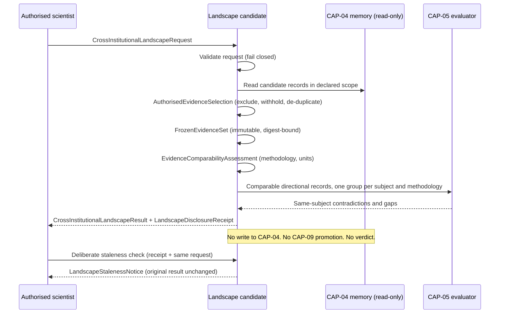

# AGR-CROSS-INSTITUTIONAL-LANDSCAPE-CANDIDATE-01 — Provider-Neutral Candidate Contract — 2026-09-23

**Status:** CANDIDATE CONTRACT — NOT ADMITTED — NOT IMPLEMENTED IN ANY PRODUCT PATH
**Domain:** Agricultural Science (AGR)
**Designation:** AGR-CROSS-INSTITUTIONAL-LANDSCAPE-CANDIDATE-01 — no CAP number is assigned
**Authority:** DEFINES PROVIDER-NEUTRAL INTERFACES AND RECORDS A FIXTURE-DERIVED IDENTITY CLASSIFICATION FOR REVIEW. It does not admit any capability, assign a CAP number, grant implementation authority, alter commissioning status, satisfy Gate D, close WP05, or grant any production authority.

This document completes steps 4 and 5 of the sequencing in `AGR-CROSS-INSTITUTIONAL-LANDSCAPE-CANDIDATE-01-2026-09-22.md`: the provider-neutral interfaces, and the controlled fixtures used to answer the capability-identity question.

| Artefact | Path |
|---|---|
| Candidate design record | `governance/workstream-b/AGR-CROSS-INSTITUTIONAL-LANDSCAPE-CANDIDATE-01-2026-09-22.md` |
| Reference evaluator | `simulation/agr-candidates/cross-institutional-landscape-01/landscape-candidate.js` |
| Behavioural suite | `simulation/agr-candidates/cross-institutional-landscape-01/landscape-candidate.behavioural-test.js` |
| Behavioural proof | `governance/workstream-b/AGR-CROSS-INSTITUTIONAL-LANDSCAPE-CANDIDATE-01-BEHAVIOURAL-PROOF.json` |

The reference evaluator is a synthetic-fixture reference only. It is not wired into CAP-34, the capability fidelity manifest, any gateway, Supabase, or any deployed site.

## Governing boundaries

- Provider-neutral interfaces only. The CAP-05 evaluator, digest function, clock, and withheld-reference generator are injected dependencies.
- One stateless, deliberate evaluation per human request. No autonomous monitoring, watch, schedule or continuing process.
- Read-only and advisory-only. Inputs are never mutated; outputs are immutable.
- No writes into CAP-04 memory. No CAP-09 learning promotion.
- No policy recommendation, verdict, contradiction resolution or winning-institution selection.
- Institutional provenance is data. Institutional reputation is never read and never alters evidential treatment.
- Restricted evidence is disclosed only as a counted limitation with an opaque reference, never by identity or content.

## Evaluation sequence



## 1. `CrossInstitutionalLandscapeRequest`

```typescript
interface CrossInstitutionalLandscapeRequest {
  requestId: string;

  // Derived from the authenticated identity; must hold
  // REQUEST_CROSS_INSTITUTIONAL_LANDSCAPE.
  requestedBy: { actorId: string; role: string; authorityScope: string[] };

  question: {
    questionText: string;
    subjectKey: string;
    relatedSubjectKeys?: string[];
  };

  workspace: { workspaceId: string; jurisdictionCode: string };

  // Every institution must carry a participation authority.
  // Any reputation or ranking field supplied here is ignored.
  participatingInstitutions: Array<{
    institutionId: string;
    institutionName?: string;
    participationAuthorityId: string;
  }>;

  // Dataset-level sharing authority. A record from a participating
  // institution outside these datasets is excluded.
  authorisedDatasets: Array<{
    institutionId: string;
    datasetId: string;
    sharingAuthorityId: string;
    permittedUse?: string;
  }>;

  temporalScope: { from: string; to: string };
  geographicScope: { regionCodes: string[] };

  // Immutable once set. Records admitted after it are excluded.
  evidenceCutOff: string;

  // Cannot be weakened. Any other value fails closed.
  cap04EligibilityRequirement: {
    requiredAdmissionDecision: "ADMITTED";
    requireEligibleForScientificMemory: true;
    requireIntegrityVerified: true;
  };

  // Must equal the available CAP-05 implementation version.
  requestedCap05EvaluationVersion: string;

  comparability: {
    requiredEvidenceCategories: string[];
    measure?: {
      canonicalUnit: string;
      authorisedUnitTransformations: Array<{
        transformationId: string;
        fromUnit: string;
        toUnit: string;
        multiplier: number;
        authorisedBy: string;
        authorityReference: string;
      }>;
    };
    // Methodologies are comparable only when explicitly declared.
    declaredCompatibleMethodologies?: string[][];
  };

  accessAndDisclosure: {
    // Records under any other classification are withheld.
    disclosableClassifications: string[];
  };

  // Anything other than these fails closed. Operational outputs
  // (recommendation, ranking, verdict, promotion, write-back) are blocked.
  requestedOutputs?: Array<"EVIDENCE_LANDSCAPE" | "DISCLOSURE_RECEIPT">;
}
```

## 2. `AuthorisedEvidenceSelection`

Each candidate CAP-04 record is either included, excluded with every reason, withheld, marked superseded, or marked a duplicate. Nothing is silently dropped.

```typescript
interface AuthorisedEvidenceSelection {
  included: CandidateEvidenceRecord[];

  excluded: Array<
    | {
        evidenceRecordId: string;
        evidenceRecordVersion: number;
        institutionId: string;
        reasonCodes: SelectionExclusionReason[];
      }
    | {
        // A restricted record excluded for scope keeps its identity withheld.
        withheldReference: string;
        institutionId: string;
        reasonCodes: SelectionExclusionReason[];
        identityWithheld: true;
      }
  >;

  // The same observation (content digest, or source authority + source
  // record) counts once, whichever institution submitted it.
  duplicates: Array<{
    evidenceRecordId: string;
    evidenceRecordVersion: number;
    institutionId: string;
    duplicateOf: { evidenceRecordId: string; evidenceRecordVersion: number };
    duplicateBasis: "SAME_CONTENT_DIGEST" | "SAME_SOURCE_RECORD";
  }>;

  // In scope and authorised, but not disclosable to this requester.
  withheld: CandidateEvidenceRecord[];
}

type SelectionExclusionReason =
  | "JURISDICTION_OUT_OF_SCOPE"
  | "INSTITUTION_NOT_PARTICIPATING"
  | "DATASET_NOT_AUTHORISED"
  | "CAP04_NOT_ADMITTED"
  | "INTEGRITY_NOT_VERIFIED"
  | "ADMITTED_AFTER_EVIDENCE_CUT_OFF"
  | "OUTSIDE_TEMPORAL_SCOPE"
  | "OUTSIDE_GEOGRAPHIC_SCOPE"
  | "SUBJECT_OUT_OF_SCOPE"
  | "STANCE_NOT_ESTABLISHED"
  | "SUPERSEDED_BY_LATER_VERSION_WITHIN_CUT_OFF";
```

The candidate record view read from CAP-04 extends the design record's `AgrCrossInstitutionalEvidenceRecord` with the fields selection needs:

```typescript
interface CandidateEvidenceRecord {
  evidenceRecordId: string;
  evidenceRecordVersion: number;
  institutionId: string;
  institutionWorkspaceId: string;
  datasetId: string;
  jurisdictionCode: string;
  sourceAuthority: string;
  sourceRecordId: string;
  contentDigest: string;

  subjectKey: string;
  evidenceCategory: string;
  // Explicit for this question, as the CAP-05 contract requires.
  stance: "SUPPORTS" | "OPPOSES" | "NEUTRAL" | "INCONCLUSIVE";
  measuredValue: unknown;
  unit: string;
  methodologyReference: string;
  regionCode: string;
  dateObserved: string;

  integrityStatus: "VERIFIED" | "UNVERIFIED" | "FAILED";
  accessClassification: string;

  admission: {
    admissionDecisionId: string;
    decision: "ADMITTED" | "QUARANTINED" | "REJECTED" | "REQUIRES_REVIEW";
    eligibleForScientificMemory: boolean;
    admittedAt: string;
  };
}
```

## 3. `FrozenEvidenceSet`

```typescript
interface FrozenEvidenceSet {
  frozenSetId: string;
  // Digest over every field below. Recomputable by an auditor.
  evidenceSetDigest: string;

  requestId: string;
  evidenceCutOff: string;
  selectionScope: LandscapeSelectionScope;
  selectionScopeDigest: string;

  includedRecords: Array<{
    evidenceRecordId: string;
    evidenceRecordVersion: number;
    institutionId: string;
    datasetId: string;
    subjectKey: string;
    admissionDecisionId: string;
    admissionDecision: "ADMITTED";
    admittedAt: string;
    contentDigest: string;
  }>;

  excludedRecords: AuthorisedEvidenceSelection["excluded"];
  duplicateRecords: AuthorisedEvidenceSelection["duplicates"];

  withheldDisclosure: Array<{
    institutionId: string;
    accessClassification: string;
    // Produced by the injected generateWithheldReference(record, requestId),
    // never computed by the candidate. Production supplies a keyed,
    // request-scoped generator (e.g. HMAC) from an authorised disclosure
    // component, so the reference cannot be confirmed by guessing a record ID.
    withheldReference: string;
  }>;
}

// The request scope without any reputation field, sorted canonically.
type LandscapeSelectionScope = Pick<
  CrossInstitutionalLandscapeRequest,
  | "requestId" | "question" | "workspace" | "participatingInstitutions"
  | "authorisedDatasets" | "temporalScope" | "geographicScope"
  | "evidenceCutOff" | "cap04EligibilityRequirement"
  | "requestedCap05EvaluationVersion" | "accessAndDisclosure"
>;
```

The set is immutable once created. A later admission cannot enter it; re-evaluation is a new, separate request.

## 4. `InstitutionalEvidenceContribution`

One per participating institution, keyed and ordered by identifier. It never contains reputation, rank or preference.

```typescript
interface InstitutionalEvidenceContribution {
  institutionId: string;
  includedRecordCount: number;
  independentObservationCount: number;
  subjectsCovered: string[];
  regionsCovered: string[];
  duplicateSubmissionCount: number;
  excludedRecordCount: number;
  withheldRecordCount: number;
  coverageStatus: "CONTRIBUTED_ELIGIBLE_EVIDENCE" | "NO_ELIGIBLE_EVIDENCE_IN_SCOPE";
}
```

## 5. `EvidenceComparabilityAssessment`

One per subject in scope.

```typescript
interface EvidenceComparabilityAssessment {
  subjectKey: string;
  recordCount: number;

  // Methodologies are grouped only by exact match or explicit declaration.
  // Similar names are never assumed compatible.
  methodologyGroups: Array<{
    methodologyGroupId: string;
    methodologyReferences: string[];
    recordIds: string[];
  }>;
  methodologicallyIncompatible: boolean;
  comparisonTreatment:
    | "SINGLE_COMPARABLE_GROUP"
    | "EVALUATED_SEPARATELY_PER_METHODOLOGY_GROUP_NOT_POOLED";

  unitAssessment: {
    canonicalUnit: string | null;
    // Only request-declared, authority-referenced transformations are applied.
    // Conversion factors carried inside records are ignored.
    converted: Array<{
      evidenceRecordId: string;
      fromUnit: string;
      toUnit: string;
      transformationId: string;
      authorisedBy: string;
      authorityReference: string;
    }>;
    incomparable: Array<{
      evidenceRecordId: string;
      unit: string;
      reasonCode: "NO_AUTHORISED_UNIT_TRANSFORMATION" | "NON_NUMERIC_VALUE";
    }>;
    normalisedValues: Record<string, number>;
  };
}
```

## 6. `CrossInstitutionalLandscapeResult`

```typescript
interface CrossInstitutionalLandscapeResult {
  ok: true;
  resultType: "CROSS_INSTITUTIONAL_EVIDENCE_LANDSCAPE";
  candidateId: "AGR-CROSS-INSTITUTIONAL-LANDSCAPE-CANDIDATE-01";
  landscapeId: string;
  // Digest over everything except generatedAt: the same inputs always
  // give the same digest, at any time.
  resultDigest: string;
  generatedAt: string;

  binding: {
    requestId: string;
    frozenSetId: string;
    evidenceSetDigest: string;
    selectionScopeDigest: string;
    evidenceCutOff: string;
  };

  versions: {
    candidateEvaluatorVersion: string;
    cap05ImplementationVersion: string;
    requestedCap05EvaluationVersion: string;
    includedRecordVersions: Record<string, number>;
    admissionDecisionIds: string[];
  };

  landscape: {
    question: { questionText: string; subjectKey: string };
    subjects: Array<{
      subjectKey: string;
      evidenceState:
        | "OBSERVED_WITHOUT_CONTRADICTION"
        | "CONTRADICTED_UNRESOLVED"
        | "NOT_COMPARABLE_ACROSS_METHODOLOGIES"
        | "NON_DIRECTIONAL_EVIDENCE_ONLY"
        | "NO_ELIGIBLE_EVIDENCE_KNOWLEDGE_GAP";
      includedRecordCount: number;
    }>;

    supportedObservations: Array<{
      subjectKey: string;
      methodologyGroupId: string;
      stance: "SUPPORTS" | "OPPOSES";
      independentObservationCount: number;
      recordIds: string[];
      contributingInstitutionIds: string[];
      duplicateSubmissionsAlsoReportedBy: string[];
      crossInstitutionalAgreement: boolean;
      nonDirectionalRecordIds: string[];
      valueSummary: {
        canonicalUnit: string | null;
        comparableValueCount: number;
        minimum: number | null;
        maximum: number | null;
      };
    }>;

    // Detected by CAP-05. Never resolved, never counted into a majority.
    genuineContradictions: Array<{
      subjectKey: string;
      methodologyGroupId: string;
      supportingRecordIds: string[];
      opposingRecordIds: string[];
      supportingInstitutionIds: string[];
      opposingInstitutionIds: string[];
      detectedBy: "CAP-05";
      resolutionStatus: "UNRESOLVED_HUMAN_REVIEW_REQUIRED";
    }>;

    compatibleDifferences: Array<{
      subjectKeys: [string, string];
      stances: [string, string];
      classification: "OPPOSING_RESULTS_CONCERN_DIFFERENT_SUBJECTS";
      isContradiction: false;
    }>;

    methodologicalIncompatibilities: Array<{
      subjectKey: string;
      methodologyGroups: EvidenceComparabilityAssessment["methodologyGroups"];
      treatment: "EVALUATED_SEPARATELY_PER_METHODOLOGY_GROUP_NOT_POOLED";
    }>;

    unitComparability: Array<{
      subjectKey: string;
      canonicalUnit: string | null;
      converted: EvidenceComparabilityAssessment["unitAssessment"]["converted"];
      incomparable: EvidenceComparabilityAssessment["unitAssessment"]["incomparable"];
    }>;

    institutionCoverage: Record<string, InstitutionalEvidenceContribution>;
    temporalGaps: Array<{ year: number; consequence: "NO_ELIGIBLE_EVIDENCE_FOR_PERIOD" }>;
    geographicGaps: Array<{ regionCode: string; consequence: "NO_ELIGIBLE_EVIDENCE_FOR_REGION" }>;

    // A missing category is a gap, never a negative finding.
    knowledgeGaps: Array<{
      subjectKey: string;
      missingEvidenceCategory: string;
      consequence: "KNOWLEDGE_GAP_NOT_A_NEGATIVE_FINDING";
    }>;

    excludedEvidence: FrozenEvidenceSet["excludedRecords"];
    duplicateEvidence: FrozenEvidenceSet["duplicateRecords"];

    limitationsPreventingComparison: Array<{
      limitationCode:
        | "NO_AUTHORISED_UNIT_TRANSFORMATION"
        | "NON_NUMERIC_VALUE"
        | "METHODOLOGICAL_INCOMPATIBILITY"
        | "RESTRICTED_EVIDENCE_WITHHELD"
        | "CAP05_STANCE_ADAPTER";
      detail: string;
      subjectKey?: string;
      evidenceRecordId?: string;
      institutionId?: string;
      accessClassification?: string;
      withheldRecordCount?: number;
    }>;
  };

  cap05Evaluation: {
    implementationVersion: string;
    inputRecordCount: number;
    outcome: string;
    computedFacts: unknown;
  };

  authorityBoundary: LandscapeAuthorityBoundary;
}

interface LandscapeAuthorityBoundary {
  readOnly: true;
  advisoryOnly: true;
  statelessDeliberateEvaluation: true;
  noVerdictProduced: true;
  noInstitutionRanked: true;
  noContradictionResolved: true;
  noPolicyRecommendation: true;
  noKnowledgePromotion: true;
  noWriteBackToInstitutionalMemory: true;
  noAutonomousMonitoring: true;
  institutionalProvenanceIsDataNotWeighting: true;
  restrictedEvidenceDisclosedOnlyAsLimitation: true;
}
```

### CAP-05 composition adapter

The candidate does not detect contradictions itself. It passes each comparable directional record to CAP-05 with `source` set to `subjectKey::methodologyGroupId`, so CAP-05's own pairwise grouping keeps different subjects and incompatible methodologies apart. Explicit stances are mapped to CAP-05's finding text through a disclosed, deterministic adapter, as the CAP-05 contract requires. `NEUTRAL` and `INCONCLUSIVE` records are reported but not stance-compared. This adapter is always disclosed as the `CAP05_STANCE_ADAPTER` limitation.

## 7. `LandscapeDisclosureReceipt`

```typescript
interface LandscapeDisclosureReceipt {
  receiptId: string;
  receiptDigest: string;
  receiptType: "LANDSCAPE_DISCLOSURE_RECEIPT";
  candidateId: "AGR-CROSS-INSTITUTIONAL-LANDSCAPE-CANDIDATE-01";

  landscapeId: string;
  resultDigest: string;
  requestId: string;
  requestedBy: { actorId: string; role: string | null };

  frozenSetId: string;
  evidenceSetDigest: string;
  selectionScope: LandscapeSelectionScope;
  selectionScopeDigest: string;
  evidenceCutOff: string;

  includedEvidence: Array<{
    evidenceRecordId: string;
    evidenceRecordVersion: number;
    institutionId: string;
    admissionDecisionId: string;
    admissionDecision: "ADMITTED";
  }>;
  excludedEvidence: FrozenEvidenceSet["excludedRecords"];
  duplicateEvidence: FrozenEvidenceSet["duplicateRecords"];

  // Counts only. No identity, value, subject or stance of withheld evidence.
  withheldEvidence: Array<{
    institutionId: string;
    accessClassification: string;
    withheldRecordCount: number;
    contentDisclosed: false;
  }>;
  withheldReferences: string[];

  versions: CrossInstitutionalLandscapeResult["versions"];
  limitations: string[];
  authorityBoundary: LandscapeAuthorityBoundary;
}
```

## 8. `LandscapeStalenessNotice`

Produced only by a separate, deliberate request. It never re-runs the evaluation, never edits the original result, and establishes no monitoring.

```typescript
interface LandscapeStalenessNotice {
  ok: true;
  noticeId: string;
  noticeDigest: string;
  noticeType: "LANDSCAPE_STALENESS_NOTICE";
  candidateId: "AGR-CROSS-INSTITUTIONAL-LANDSCAPE-CANDIDATE-01";
  assessedAt: string;

  landscapeId: string;
  receiptId: string;
  frozenSetId: string;
  evidenceSetDigest: string;
  originalResultDigest: string;
  evidenceCutOff: string;

  status: "POTENTIALLY_STALE" | "NO_NEWER_ELIGIBLE_EVIDENCE_FOUND";
  triggers: Array<
    | {
        reasonCode:
          | "NEW_ELIGIBLE_EVIDENCE_ADMITTED_AFTER_CUT_OFF"
          | "NEWER_VERSION_OF_INCLUDED_EVIDENCE_ADMITTED"
          | "INCLUDED_EVIDENCE_ADMISSION_NO_LONGER_CURRENT";
        evidenceRecordId: string;
        evidenceRecordVersion: number;
        subjectKey?: string;
      }
    | {
        reasonCode: "NEW_RESTRICTED_EVIDENCE_ADMITTED_AFTER_CUT_OFF";
        withheldRecordCount: number;
        contentDisclosed: false;
      }
  >;

  originalLandscapeUnchanged: true;
  reEvaluationRequiresDeliberateRequest: true;
  noAutomaticReEvaluation: true;
  noMonitoringEstablished: true;
}
```

The staleness check must use the exact request scope bound in the receipt; any other scope fails closed.

## Failure contract

No partial landscape is ever returned.

```typescript
interface CrossInstitutionalLandscapeFailure {
  ok: false;
  candidateId: "AGR-CROSS-INSTITUTIONAL-LANDSCAPE-CANDIDATE-01";
  result: "FAIL_CLOSED";

  errors: Array<
    | "REQUEST_INVALID"
    | "REQUESTER_NOT_AUTHORISED"
    | "PARTICIPATION_AUTHORITY_MISSING"
    | "DATASET_AUTHORITY_INVALID"
    | "CAP04_ELIGIBILITY_REQUIREMENT_WEAKENED"
    | "CAP05_VERSION_UNAVAILABLE"
    | "OPERATIONAL_INTENT_BLOCKED"
    | "EVIDENCE_SET_EMPTY"
    | "CAP05_RESULT_UNMAPPABLE"
    | "RECEIPT_REQUEST_MISMATCH"
    | "CAP05_DEPENDENCY_UNAVAILABLE"
    | "DIGEST_DEPENDENCY_UNAVAILABLE"
    | "CLOCK_DEPENDENCY_UNAVAILABLE"
    | "WITHHELD_REFERENCE_DEPENDENCY_UNAVAILABLE"
  >;
  reasons: string[];

  partialLandscapeReturned: false;
  noWrites: true;
  noMutation: true;
}
```

## Controlled fixtures

The suite runs every fixture against the candidate, which composes the real live CAP-05 evaluator (`cap05-reasoning.js`, implementation 1.0.0). Where a fixture is marked *attribution*, it runs the same inputs through a **composition baseline** instead: CAP-04 admission and workspace filtering, the CAP-05 request contract's `organizationIds` and `asOf` bounds, then live CAP-05. Most requirements include perturbation and adversarial cases, not only happy paths, but coverage is not uniform: R01, R03 and R09 have no adversarial fixture; R07, R08, R09 and R12 have no perturbation fixture.

| # | Requirement | Fixtures | What the adversarial and perturbation cases prove |
|---|---|---|---|
| 1 | Cross-institution agreement | 3 | Agreement disappears when one institution's record is removed; composition also provides it |
| 2 | Same-subject contradiction | 4 | Contradiction appears and disappears with one stance; 3-to-1 is still unresolved, no majority |
| 3 | Cross-subject is not contradiction | 3 | Moving the record onto the same subject creates the contradiction |
| 4 | Authorised unit transformation or incomparability | 5 | Unreferenced transformations and record-supplied factors are refused |
| 5 | Methodological incompatibility surfaced | 4 | Only an explicit declaration allows pooling; V2 vs V3 is not assumed compatible |
| 6 | Missing evidence is a knowledge gap | 4 | A gap closes exactly when its evidence arrives; no evidence at all fails closed |
| 7 | Unauthorised evidence excluded or fails closed | 9 | Institution, dataset, participation authority, requester authority, weakened CAP-04 eligibility, jurisdiction |
| 8 | Duplicates create no artificial weight | 6 | Duplicates cannot manufacture agreement, outvote, or satisfy CAP-05 volume; one version per record |
| 9 | Reputation has no weighting | 3 | Inverting or removing reputation leaves digests and ordering identical; sides are symmetric |
| 10 | Staleness without rewriting | 9 | The frozen result is immutable; staleness is scope-bound, deliberate and stateless |
| 11 | Restricted evidence disclosed only as limitation | 7 | No identity, value, digest or decision ID leaks, including through exclusions and staleness |
| 12 | No recommendation, promotion, verdict or write | 6 | Operational outputs fail closed; CAP-04 write and CAP-09 promotion traps are never called |

**Result: 63 of 63 fixtures pass.**

The build session reported that the suite was also checked against 18 deliberately planted faults in a scratch copy of the evaluator. Examples reported:

- disabling de-duplication;
- pooling methodologies;
- including withheld evidence;
- ignoring dataset authority;
- ordering or weighting by reputation;
- removing immutability;
- ignoring the cut-off;
- allowing policy output;
- resolving by majority;
- treating missing evidence as negative;
- leaking restricted identities;
- writing into input records.

The build session reported that every planted fault was caught by at least one fixture. These claims cannot be verified from the repository — the scratch copy was not committed, and both the rule and the fixtures landed in a single commit. They are recorded here as reported but are not independently verifiable.

## Capability-identity result

> Does this candidate introduce material governed logic beyond authorised CAP-04 evidence selection followed by CAP-05 evaluation?

**Classification: `CANDIDATE_FOR_SEPARATE_CAPABILITY_REVIEW`**

The decision rule was stated as fixed in the suite before evaluation — this chronology cannot be verified from the repository, as the rule and the fixtures landed in a single commit. A governed function counts as logic beyond composition only when all three conditions hold:

1. It is not provided by the CAP-04 or CAP-05 canonical contracts, and is not assigned to another designated capability.
2. A composition-baseline fixture demonstrates that the baseline fails it.
3. Every candidate fixture for that function passes.

One or more such functions gives `CANDIDATE_FOR_SEPARATE_CAPABILITY_REVIEW`; none gives `GOVERNED_COMPOSITION_PROFILE`.

| Governed function | Attribution | Composition baseline | Counts |
|---|---|---|---|
| Dataset-level sharing authority | Not in CAP-04/CAP-05 contracts | F07-H: unauthorised dataset enters CAP-05 and creates a contradiction | **Yes** |
| Participation authority | Possibly assigned to CAP-24, which has no contract (`NOT_YET_REPRESENTED`) | — | **Unresolved** pending CAP-24's contract |
| Methodological comparability | Not in CAP-04/CAP-05 contracts | F05-D: methodologies silently pooled into a contradiction | **Yes** |
| Authorised unit transformation | Not in CAP-04/CAP-05 contracts | F04-E: no conversion, no incomparability declaration | **Yes** |
| Duplicate-weight prevention | Not in CAP-04/CAP-05 contracts | F08-E: a duplicate changes CAP-05's outcome by satisfying its volume check | **Yes** |
| Restricted evidence disclosed as limitation | Not in CAP-04/CAP-05 contracts | F11-F: the fixture baseline (live CAP-05, no access check) exposes the restricted opposing stance; the canonical CAP-05 contract would instead refuse with `EVIDENCE_ACCESS_DENIED`. The candidate proceeds with a disclosed limitation where a contract-faithful composition would refuse | **Yes** |
| Evidence-set freezing and scope binding | Partially in CAP-05 (`EvidenceLandscapeSnapshotIdentity`) | — | No |
| Staleness notice | Ownership unresolved: the CAP-05 contract names the Governed Evidence Watch, but open question 1 records whether this candidate or the Watch owns staleness as undecided | — | No |
| Same-subject contradiction; cross-subject distinction | CAP-05 (F02-D, F03-C) | — | No |
| Cross-institution agreement | CAP-05 (F01-C) | — | No |
| Knowledge gaps | CAP-05 contract | — | No |
| Institution-level exclusion | CAP-05 request `organizationIds` (F07-I) | — | No |
| Reputation neutrality | Invariant, not logic | — | No |
| No operational output | Shared with CAP-05 boundary | — | No |

Against the design record's own admission criteria:

| Criterion | Finding |
|---|---|
| Distinct failure contract | **Demonstrated.** `PARTICIPATION_AUTHORITY_MISSING`, `DATASET_AUTHORITY_INVALID`, `CAP04_ELIGIBILITY_REQUIREMENT_WEAKENED`, `RECEIPT_REQUEST_MISMATCH` and `CAP05_VERSION_UNAVAILABLE` are not in CAP-05's failure contract. |
| Distinct disclosure receipt type | **Demonstrated.** The receipt binds scope, exclusions, duplicates and opaque withheld references. |
| Distinct authority boundary | **Partial.** It adds cross-institutional flags to CAP-05's advisory boundary. |
| Independent lifecycle | **Not demonstrated.** The evaluator is deliberately stateless; governed persistence of frozen sets, receipts and notices is out of scope. |
| Distinct gateway action | **Not demonstrated.** No gateway was in scope. |

### What the classification does and does not mean

It means the fixtures show five governed functions that composition of CAP-04 and CAP-05 does not provide, so the candidate has evidence to support **consideration** as a separately numbered capability.

It does not admit the candidate, assign a CAP number, or decide the outcome of that review.

Before any review, four matters must be settled:

1. **Governed Evidence Watch overlap.** The candidate's staleness notice overlaps the Governed Evidence Watch that the CAP-05 contract names as the next design task. One of them must own staleness.
2. **Lifecycle.** A separately numbered capability would need a governed lifecycle for frozen sets, receipts and notices. That has not been designed or demonstrated.
**3. Whether CAP-23, CAP-24, or extensions to existing capabilities are the right home**

Two functions require a decision about where they belong before this candidate
can be considered for admission:

Dataset-level sharing authority (confirmed as beyond composition) might belong
in CAP-24 (Governed Country, Institution and Professional Participation) — the
designated capability for institutional participation governance — or it might
require its own logic in this candidate. This cannot be determined until CAP-24
has a contract.

Participation authority is likely the natural scope of CAP-24. Once CAP-24's
contract is written, this question should be revisited.

Duplicate detection might be better placed in CAP-04 where admission decisions
live. If it can be placed there cleanly without overloading CAP-04, the
candidate's case weakens for that function.

This question cannot be answered until CAP-23 and CAP-24 have contracts.

**4. Integrity failure and access reclassification as staleness triggers**

If staleness ownership is assigned to this candidate, two material changes to
previously included records are not currently detected: document integrity
becoming FAILED, and sharing classification becoming more restrictive, after the
evidence set is frozen. Admission revocation or supersession and evidence version
changes do trigger staleness notices (F10-E, F10-F). Permitted use withdrawal and
methodology or unit-transformation authority changes have not been tested. If
staleness belongs to the Governed Evidence Watch, this question transfers with it.

The composition baseline uses the live CAP-05 simulation evaluator (1.0.0), which is thinner than the CAP-05 canonical contract. To avoid overstating the candidate, functions the CAP-05 contract assigns to CAP-05 are attributed to CAP-05 even where the live evaluator lacks them.

## What this document does not establish

- It does not admit this candidate or assign a CAP number.
- It does not implement anything in a product path, gateway, database, Supabase project or deployed site.
- It does not change CAP-04, CAP-05, CAP-09, CAP-20, CAP-21, CAP-34, the capability identity roster or the fidelity manifest.
- It does not prove scientific correctness; the fixtures are synthetic.
- It does not alter commissioning status, satisfy Gate D, close WP05, or grant any production or commissioning authority.
- Legal and scientific responsibility for any landscape remains with the authorised human who requests and acts on it.
