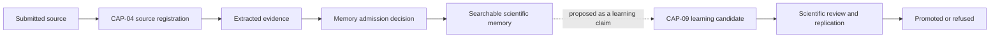
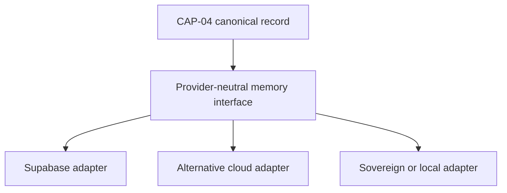

# CAP-04 Scientific Memory — Canonical Contract — 2026-09-20

**Status:** GOVERNANCE DESIGN CONTRACT — NOT IMPLEMENTATION
**Authority:** DEFINES THE CANONICAL CAP-04/CAP-09 BOUNDARY FOR FUTURE WIRING. Establishes no commissioning, production, Gate D, WP05, scientific-validity or regulatory authority, and makes no Supabase or other provider change.
**Resolves:** the "design decision required before wiring" finding recorded for CAP-04 in `governance/AAB-CAPABILITY-GATEWAY-RECONCILIATION-2026-09-20.md`.
**Not part of PR #16.** PR #16's boundary (`governance/workstream-b/`, `simulation/cap34/`, draft, simulation-only) is unaffected by this document. No code changes and no Supabase changes are made or authorised by this document.

## The boundary, in plain English

> **CAP-04 allows AAB to remember something responsibly. CAP-09 allows an authorised scientist to decide whether AAB may treat a conclusion drawn from it as validated knowledge.**

CAP-04 and CAP-09 answer different questions and must remain separately auditable, separately testable and independently fail-closed.

| Capability | Governing question | What it controls |
|---|---|---|
| CAP-04 | "May this material enter governed scientific memory?" | Source registration, ingestion, provenance, integrity, extraction, classification, access conditions and memory admission |
| CAP-09 | "Has this learning claim earned promotion?" | Scientific review, replication, contradiction handling, limitations, applicability and knowledge promotion |

**CAP-04 admits evidence. CAP-09 promotes scientific learning.** AAB must be able to remember evidence without asserting that the evidence proves a conclusion.

## Two corrections to the prior framing

This document supersedes two imprecisions in the earlier reconciliation work:

1. **Admission is not proof.** Admission to CAP-04 means the record is traceable, intact, classified and eligible for scientific use. It does **not** mean the scientific content has been proven true. A record can be fully admitted — correctly attributed, integrity-verified, extraction-traceable — while the conclusion someone might draw from it remains unreviewed, contradicted, methodologically weak, geographically limited, unreplicated or unsuitable for generalisation. Whether that conclusion may be treated as validated knowledge is exclusively CAP-09's question.
2. **The simulation's seven measurement fields are not the whole canonical schema.** `CAP-04-SCIENTIFIC-MEMORY-LIVE-LOGIC-BEHAVIOURAL-PROOF.json` and its companion fixtures test a real and useful portable observation shape, but institutional scientific memory also has to hold complete reports, spreadsheets, photographs, laboratory certificates, methods and protocols, multi-variable observations, time-series data, qualitative observations, trial designs, failed experiments, spatial datasets, source revisions and contradictory interpretations. Adopting the seven fields as the entire canonical memory-record schema would either exclude these record types or force them into misleading fields. This document keeps the tested seven-field shape intact as one typed content variant (`MeasurementObservation`) inside a broader canonical envelope (`Cap04ScientificMemoryRecord`), so existing fixtures keep testing domain portability without one fixture shape defining all of institutional memory.

## Why an example clarifies the boundary

A 2016 field-trial report can be **admitted by CAP-04** because:

- the institution has authority to provide it
- its source is identifiable
- the original file is retained
- its integrity can be checked
- its date and location are known
- extraction is traceable
- confidentiality is classified
- the evidence has not been silently altered

But a conclusion extracted from that same report might remain unreviewed, contradicted, methodologically weak, geographically limited, unreplicated or unsuitable for generalisation. **CAP-09 controls whether that learning can progress beyond evidence into a governed knowledge state.** CAP-09 is never required merely to preserve a legitimate source — it becomes relevant only when AAB or a scientist proposes that the evidence supports a learning claim.

### Lifecycle



Admission (D→E) and promotion (F→H) are distinct, independently gated transitions. Reaching E never implies reaching H.

## Does the current gateway already separate them?

`AAB_LEARNING_MEMORY_ACTIONS`'s *name* conflates the two concepts, but its actual actions already show some lifecycle separation, and that separation sits closer to CAP-09 than to CAP-04:

- `prepare_trial_learning`
- `submit_learning_review`
- `decide_learning_review`

What is missing is a genuine CAP-04 gateway responsible for: registering an institutional source; preserving the original object; recording source authority and ownership; verifying integrity; recording extraction lineage; classifying extracted evidence; making an independent admission decision; and preventing admitted evidence from being represented as promoted knowledge.

**Structural conclusion:** do not split the existing action group arbitrarily and label half of it CAP-04. Instead:

1. Retain the existing trial-learning actions under CAP-09.
2. Rename their gateway grouping when it is safe to do so, so the name no longer claims "memory" for a CAP-09-scoped action set.
3. Create a distinct CAP-04 provider-neutral ingestion interface (below).
4. Require CAP-09 inputs to reference CAP-04 evidence identifiers (`supportingEvidenceRecordIds`), never raw source material directly.

This creates a genuinely enforceable boundary rather than two differently named code sections sharing one implementation.

## The independent gateway controls

CAP-04 and CAP-09 each enforce their own decision record, so each can be audited, tested and fail-closed independently.

### CAP-04 — `MemoryAdmissionDecision`

```typescript
interface MemoryAdmissionDecision {
  admissionDecisionId: string;
  evidenceRecordId: string;
  decision:
    | "ADMITTED"
    | "QUARANTINED"
    | "REJECTED"
    | "REQUIRES_REVIEW";

  eligibilityChecks: {
    sourceRegistered: boolean;
    provenanceComplete: boolean;
    integrityVerified: boolean;
    extractionTraceable: boolean;
    authorityConfirmed: boolean;
    classificationComplete: boolean;
    accessConditionsKnown: boolean;
  };

  eligibleForScientificMemory: boolean;
  decisionReasons: string[];
  decidedBy: ActorReference;
  decidedAt: string;
}
```

### CAP-09 — `LearningPromotionDecision`

```typescript
interface LearningPromotionDecision {
  promotionDecisionId: string;
  learningCandidateId: string;
  supportingEvidenceRecordIds: string[];

  decision:
    | "PROMOTED"
    | "REFUSED"
    | "REQUIRES_MORE_EVIDENCE"
    | "REQUIRES_REPLICATION"
    | "QUARANTINED";

  contradictionState:
    | "NONE_IDENTIFIED"
    | "RESOLVED"
    | "UNRESOLVED"
    | "MATERIAL_CONTRADICTION";

  replicationState:
    | "NOT_REQUIRED"
    | "REQUIRED"
    | "PARTIAL"
    | "SATISFIED";

  applicabilityScope?: ApplicabilityScope;
  limitations: string[];
  decidedBy: ScientistReference;
  decidedAt: string;
}
```

`LearningPromotionDecision.supportingEvidenceRecordIds` is the enforced link back to CAP-04: a learning candidate can only be evaluated in terms of evidence that has already been admitted, never raw or unadmitted material.

## The canonical CAP-04 memory record

### Why the seven simulation fields cannot stand alone

The simulation's tested shape is a real, useful, portable measurement observation:

```typescript
interface MeasurementObservation {
  subjectKey: string;
  treatmentLabel?: string | null;
  location?: LocationReference | null;
  unit?: string | null;
  dateObserved: string;
  measuredValue: number | string | boolean | null;
  outcomePolarity:
    | "POSITIVE"
    | "NEGATIVE"
    | "INCONCLUSIVE";
}
```

But `measuredValue` and `unit` presume every memory item is fundamentally a measurement. That is not true for scientific methods, photographs, narrative field reports, safety warnings, contamination findings, traditional knowledge, trial designs, contradictions, or incomplete historical records. The correct resolution is to preserve this shape unchanged as the `MeasurementObservation` variant of a broader canonical envelope, not to extend or overload it to cover everything.

### Recommended canonical structure

```typescript
interface Cap04ScientificMemoryRecord {
  // Canonical identity
  memoryRecordId: string;
  recordType:
    | "MEASUREMENT_OBSERVATION"
    | "QUALITATIVE_OBSERVATION"
    | "DATASET"
    | "DOCUMENT"
    | "IMAGE"
    | "LAB_RESULT"
    | "METHOD"
    | "TRIAL_RECORD"
    | "OUTCOME_RECORD"
    | "OTHER";

  schemaVersion: string;

  // What the record concerns
  subject: {
    subjectKey: string;
    subjectType?: string;
    subjectLabel?: string;
  };

  // Source and ownership
  source: {
    sourceId: string;
    sourceRecordReference?: string;
    sourceType: string;
    sourceTitle?: string;
    sourceOrganizationId: string;
    countryWorkspaceId: string;
    ownerOrganizationId: string;
    originalCreatedAt?: string;
    receivedAt: string;
  };

  // Provenance and integrity
  provenance: {
    acquisitionMethod: string;
    submittedBy: ActorReference;
    originalObjectReference?: string;
    contentDigest?: string;
    integrityStatus:
      | "UNVERIFIED"
      | "VERIFIED"
      | "FAILED";
    chainOfCustody: ProvenanceEvent[];
  };

  // Extraction lineage
  extraction?: {
    extractionId: string;
    extractionMethod:
      | "HUMAN"
      | "AUTOMATED"
      | "AUTOMATED_WITH_HUMAN_REVIEW";
    sourceLocation?: string;
    extractorReference?: string;
    extractedAt: string;
    reviewedBy?: ScientistReference;
    reviewStatus:
      | "UNREVIEWED"
      | "REVIEW_REQUIRED"
      | "REVIEWED"
      | "REJECTED";
  };

  // Scientific context
  context: {
    domainCodes: string[];
    location?: LocationReference;
    dateObserved?: string;
    periodStart?: string;
    periodEnd?: string;
    treatmentLabel?: string;
    methodReference?: string;
    environmentalContext?: Record<string, unknown>;
  };

  // Typed scientific content
  content:
    | MeasurementObservation
    | QualitativeObservation
    | DatasetReference
    | DocumentEvidence
    | ImageEvidence
    | LaboratoryResult
    | Record<string, unknown>;

  // Classification and access
  classification: {
    dataClass: string;
    confidentialityClass: string;
    sharingClassification: string;
    permittedUses: string[];
    traditionalKnowledgeLinked?: boolean;
    personalInformationPresent?: boolean;
  };

  // CAP-04 admission state
  admission: {
    status:
      | "RECEIVED"
      | "CLASSIFYING"
      | "REQUIRES_REVIEW"
      | "ADMITTED"
      | "QUARANTINED"
      | "REJECTED";

    eligibleForScientificMemory: boolean;
    admissionDecisionId?: string;
    reasons: string[];
  };

  // Truth boundary
  epistemicStatus:
    | "SOURCE_MATERIAL"
    | "EXTRACTED_EVIDENCE"
    | "REVIEWED_EVIDENCE";

  createdAt: string;
  updatedAt?: string;
}
```

`epistemicStatus` is the field that most directly enforces correction (1) above: nothing in `Cap04ScientificMemoryRecord` ever reaches a "validated" or "promoted" state. That state exists only in CAP-09's `LearningPromotionDecision`, referenced back to this record's `memoryRecordId` via `supportingEvidenceRecordIds`.

## Provider-neutral gateway interface

The canonical record and its admission/promotion decisions sit above any specific provider. Consistent with `governance/AAB-CAPABILITY-GATEWAY-RECONCILIATION-2026-09-20.md`'s vendor posture, Supabase is one possible adapter target among several, not the definition of the interface.



```typescript
interface ScientificMemoryProvider {
  registerSource(
    request: RegisterSourceRequest
  ): Promise<RegisterSourceResult>;

  preserveOriginal(
    request: PreserveOriginalRequest
  ): Promise<PreserveOriginalResult>;

  registerExtraction(
    request: RegisterExtractionRequest
  ): Promise<RegisterExtractionResult>;

  classifyEvidence(
    request: ClassifyEvidenceRequest
  ): Promise<ClassifyEvidenceResult>;

  evaluateAdmission(
    request: EvaluateMemoryAdmissionRequest
  ): Promise<MemoryAdmissionDecision>;

  getMemoryRecord(
    memoryRecordId: string
  ): Promise<Cap04ScientificMemoryRecord>;

  searchAdmittedMemory(
    request: ScientificMemorySearchRequest
  ): Promise<ScientificMemorySearchResult>;
}
```

A Supabase adapter would translate this interface into its own tables and RPCs. A different country or deployment could implement the same interface against a different database or a sovereign provider, without changing CAP-04's canonical contract.

### Mapping correction — no convenient name substitutions

Do not directly map `subjectKey → outcome_code`. `subjectKey` identifies what the evidence concerns; `outcome_code` classifies or identifies an outcome — they are not semantically equivalent. Similarly:

- `dateObserved` can map reasonably to `observed_at`.
- `measuredValue` may be represented inside `values`.
- `unit` may be obtained from the metric definition rather than submitted with the value.
- `outcomePolarity` may contribute to an outcome classification, but it is not necessarily the same as `outcome_type`.
- `treatmentLabel` may refer to a trial arm, formulation, environmental condition or other intervention.

Every adapter requires an explicit semantic mapping table, never a convenient name substitution, and the current Supabase field names must not be treated as canonical by default.

## What the scientist sees, and when

The distinction between admitted evidence and promoted knowledge must be unmistakable in the interface, not just in the schema.

**After CAP-04 admission:**

> Admitted to Scientific Memory
> Source and provenance verified. Available for search and evidence review. This record has not been promoted to validated knowledge.

At this stage the record may appear in evidence search, be linked to a trial or question, support or contradict a hypothesis, be included in an evidence landscape, expose its source and limitations, and contribute to a knowledge-gap assessment. It must **not** yet appear as an accepted scientific finding, establish a general rule, drive automatic formulation or deployment, or be represented as validated knowledge.

**During CAP-09 review**, the scientist consciously selects or encounters a proposed learning claim, e.g. *"Across the admitted trial evidence, treatment X appears associated with improved moisture retention under conditions Y."* The interface shows supporting evidence, contradictory evidence, replication state, method compatibility, applicable locations and conditions, limitations, and unresolved gaps, and the scientist decides: promote, refuse, require more evidence, require replication, or quarantine for contradiction.

**After CAP-09 promotion:**

> Promoted Scientific Knowledge
> Scientist-reviewed, evidence-linked and valid only within the recorded applicability boundary.

The promoted knowledge record retains permanent references to the CAP-04 evidence records that supported it.

## Final design decision

1. Preserve CAP-04 and CAP-09 as separate capabilities.
2. Place the boundary in the real provider-neutral gateway, not only in simulation logic.
3. Keep the simulation's seven fields as the canonical `MeasurementObservation` subtype.
4. Create a broader CAP-04 scientific-memory envelope for documents, datasets, images, methods and other evidence.
5. Map provider fields through explicit adapters; do not make current Supabase field names canonical.
6. Require CAP-09 to reference admitted CAP-04 evidence records (`supportingEvidenceRecordIds`), never raw source material.
7. Make "admitted evidence" and "promoted knowledge" visibly different states in the scientist interface.

> **CAP-04 allows AAB to remember something responsibly. CAP-09 allows an authorised scientist to decide whether AAB may treat a conclusion drawn from it as validated knowledge.**

## What this document does not establish

- It does not implement, deploy or migrate anything — no code, Supabase or other provider change is made or authorised.
- It does not touch PR #16 or its boundary.
- It does not fix AAB's final canonical field names beyond what is specified here; adapters must still perform explicit semantic mapping, not name substitution.
- It does not establish that CAP-04 or CAP-09 is production-ready, scientifically valid or regulatorily compliant.
- It does not alter commissioning status, satisfy Gate D, close WP05, or grant any production or commissioning authority.
