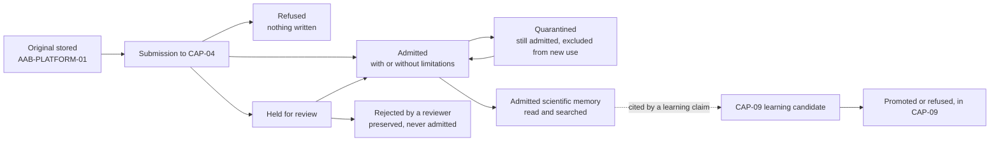

# CAP-04 Scientific Memory — Canonical Contract — 2026-09-20

**Status:** CANONICAL CONTRACT — NOT IMPLEMENTATION
**Domain:** Agricultural Science (AGR)
**Capability:** CAP-04 Governed Scientific Memory. It is not SCS-CAP-04 (Deforestation Evidence Admission), a different capability in another domain.
**Authority:** DEFINES THE CONTRACT FOR CAP-04: WHAT MAY ENTER GOVERNED SCIENTIFIC MEMORY, HOW IT IS ADMITTED, HELD, QUARANTINED AND SUPERSEDED, HOW ADMITTED MEMORY IS READ, AND THE BOUNDARY WITH CAP-05 AND CAP-09. Establishes no commissioning, production, Gate D, WP05, scientific-validity or regulatory authority, and makes no Supabase or other provider change. This capability is PROPOSED_NOT_ADMITTED. No implementation exists.
**Amended:** 2026-09-29, step 1 of the AGR rehearsal migration workstream (`governance/AAB-PLATFORM-ROADMAP-2026-09-27.md`, section 8.3): aligned with the platform contracts, and the rehearsal accounted for (see "Amendment of 2026-09-29: canonical alignment, and the rehearsal accounted for"). Amended again on 2026-09-29, with two corrections following CAP-05's canonical amendment (see "Amendment of 2026-09-29: two corrections following CAP-05 canonical amendment"), for challenges to its human decisions (see "Amendment of 2026-09-29: challenges to CAP-04's human decisions"), and for originals stored under the AGR storage profile (see "Amendment of 2026-09-29: originals stored under the AGR storage profile"); and 2026-10-02 (integrity, lineage and the AGR vocabulary, under CAP-03), with CAP-03's canonical contract; and 2026-10-02, second (acquired material, under CAP-02), with CAP-02's canonical contract.
**History:** first written on 2026-09-20 as a governance design contract, resolving the "design decision required before wiring" finding for CAP-04 in `governance/AAB-CAPABILITY-GATEWAY-RECONCILIATION-2026-09-20.md`. It was not part of PR #16. The 2026-09-20 text is in the repository's history.

## Amendment of 2026-09-29: canonical alignment, and the rehearsal accounted for

**Why.** This contract was written on 2026-09-20, before the platform primitives were named and before the rehearsal's source was in the repository. The platform–domain separation decision requires AGR to be "designed against the primitives listed here, not against SCS's domain modules" (`governance/AAB-PLATFORM-DOMAIN-SEPARATION-DECISION-2026-09-25.md`). The roadmap makes this amendment CAP-04's step 1: it aligns the contract with the platform contracts and accounts for what the rehearsal does (section 8.3). The evidence for the rehearsal is the step 0 snapshots: `agr-rehearsal/snapshot-2026-09-28/` and `agr-rehearsal/snapshot-2026-09-28-supplementary/`.

**What it adopts:**
- **AAB-PLATFORM-03 (ActorReference):** every actor is an ActorReference version 2, with server-resolved, scoped authority.
- **AAB-PLATFORM-05 (governed provenance):** the memory record's provenance is the platform's `Provenance` record.
- **AAB-PLATFORM-06 (admission decisions):** admission is refused, held or admitted in one transaction, with the platform's decision record.
- **AAB-PLATFORM-07 (frozen evaluation snapshots):** an admitted memory record can be a snapshot member.
- **AAB-PLATFORM-08 (attributable human review):** the resolution of a held record, and quarantine and its release, are human decisions.
- **AAB-PLATFORM-09 (public-key registry):** those decisions are signed, and verified as at their acceptance.
- **AAB-PLATFORM-01 (evidence object store):** originals are stored objects, and every read of them is verified.

AAB-PLATFORM-04 (actor–subject links) is **not adopted**: CAP-04 has no submission on behalf of another party ("Open gaps").

**What it changes from the text of 2026-09-20:**

| Designed on 2026-09-20 | Now |
|---|---|
| A staged provider interface: `registerSource`, `preserveOriginal`, `registerExtraction`, `classifyEvidence`, `evaluateAdmission`, with statuses `RECEIVED` and `CLASSIFYING` | **One submission, decided in one transaction** (AAB-PLATFORM-06). The original is stored first, as an AAB-PLATFORM-01 object; the source, provenance, extraction lineage, classification and content arrive together, and are refused, held or admitted |
| `MemoryAdmissionDecision` with `ADMITTED`, `QUARANTINED`, `REJECTED`, `REQUIRES_REVIEW` | The platform's `AdmissionDecision`: **refused** (nothing written), **`HELD_FOR_REVIEW`**, **`ADMITTED`**, **`ADMITTED_WITH_LIMITATIONS`**. `REJECTED` exists only as a reviewer's resolution of a held record. `QUARANTINED` is after admission, a status record, never a decision |
| `eligibilityChecks`: seven booleans | Ten checks (corrected on 2026-09-29: eleven, as "The checks" lists them; twelve since the storage profile amendment), each `PASSED`, `NOT_PASSED` or `NOT_EVALUATED`, and each stated as refusing, limiting or holding ("The checks") |
| `admission.status` and `updatedAt` on the record | **No status on the record, and no update.** What a record is, is derived when read, from its decisions and status records |
| `integrityStatus: "FAILED"` | Never recorded. A declared digest that contradicts the stored original refuses the submission |
| `chainOfCustody: ProvenanceEvent[]` | The platform's `custody`: `declaredComplete`, and optional declared steps |
| `ScientistReference` for an extraction's reviewer | An extractor or reviewer named in the source is **declared data**, not an actor. A person reviewing the record in the platform is an AAB-PLATFORM-08 decider |
| `epistemicStatus` stored on the record | **Derived when read,** and never "validated" |
| CAP-09's `LearningPromotionDecision`, defined here | **Moved out** to CAP-09's own contract. What CAP-04 requires of CAP-09 stays here ("The CAP-09 boundary") |
| Three gateway actions under `AAB_LEARNING_MEMORY_ACTIONS` | **Four,** and all four are CAP-09's. The rehearsal's "scientific memory" is promoted learning, not admitted evidence ("What the rehearsal does") |

**Decisions recorded on 2026-09-29** (approved by the Platform Owner in review):
1. **Capability identifier.** Receipts and failures carry `capabilityId: "CAP-04"`, the landscape identifier, as CAP-20 and CAP-21 do. It is distinct from `SCS-CAP-04`. The domain is recorded as `AGR`.
2. **Routes and schemas: the AGR route prefix `/agr/v1/`.** **This is a platform decision, made here for the first time,** not only a route for CAP-04. It establishes AGR's separation from SCS at the API level: every AGR capability's routes are under `/agr/v1/`, as SCS's are under `/scs/v1/`, and platform routes are under `/aab/v1/` (the naming rule). CAP-04's are `/agr/v1/memory-records`. AGR's database schema is its own (`agr`), as "a second domain gets its own schema", and its JSON schemas use `urn:aab:schema:agr:`. Originals are stored through AAB-PLATFORM-01's existing route until its platform route under `/aab/v1/` exists. **Now:** at `POST /agr/v1/evidence-objects`, under AAB-PLATFORM-01's AGR profile (amended on 2026-09-29, storage profile).
3. **One transaction, not stages.** The design's five staged calls and intermediate statuses are replaced by one submission (above): one transaction, one decision, one receipt. The original object is the only thing stored before it, and a stored object is never evidence until a record that cites it is admitted (AAB-PLATFORM-01).
4. **Admission is automated; review is a person's.** At submission the rules decide (`decisionMode: "AUTOMATED"`, `requestedBy` the submitter). A person decides only a held record, a quarantine and a release. No platform primitive makes a judgement: people decide the exceptions.
5. **Automated content is always held.** A record whose content a system produced (`generation.automated: true`) is held for a reviewer, never admitted at submission, as the gateway reconciliation required ("never structurally eligible until reviewed"). An automated extraction entering governed memory without a person's review would be exactly the silent promotion AAB exists to prevent.
6. **Sensitive content is always held:** a record declaring traditional knowledge, or personal information. These are not edge cases: they are structurally different from other content, and need a person's review before admission.
7. **Roles:** `MEMORY_SUBMITTER`, `MEMORY_REVIEWER`, `MEMORY_QUARANTINE_OFFICER` and `MEMORY_READER`, each a scoped grant (AAB-PLATFORM-03).
8. **CAP-09's promotion decision leaves this contract.** CAP-09's own contract defines it, when CAP-09 reaches step 1 (roadmap, section 8.4). The rehearsal's `agriculture.scientific_memory_entry` is CAP-09's register of promoted learning, and is named as such when CAP-09 is contracted.
9. **The rehearsal's data is not CAP-04's existing records.** Nothing CAP-04 is stored anywhere, and CAP-04's records start empty in any new deployment. Whether, and how, any rehearsal data is brought into governed memory is a separate governed decision ("Open gaps").
10. **How a holding check is recorded follows AAB-PLATFORM-06,** amended on 2026-09-29 for exactly this case, in the same change as this amendment. CAP-04 does not rely on a reading of its own.

**Prerequisites before any code** (recorded on 2026-09-29, and in "Open gaps"):
- **A platform migration extending the receipt table to AGR capability identifiers.** It comes before any CAP-04 endpoint is built. **Met:** migration 025 (PR #70) (amended on 2026-09-29, storage profile).
- **A platform decision on the object store's parameters for AGR content:** retention, media types and size limits. AAB-PLATFORM-01's were set for EUDR supply-chain evidence, and scientific memory is not to inherit them by default. It is decided before the object store is used for AGR content. **Decided:** AAB-PLATFORM-01's AGR profile, amendment of 2026-09-29 (amended on 2026-09-29, storage profile).

**Nothing is implemented by this amendment.** It adopts the platform contracts; it does not implement them. Every rule of 2026-09-20 not changed above is kept.

## Amendment of 2026-09-29: two corrections following CAP-05 canonical amendment

**Why.** CAP-05's canonical amendment of 2026-09-29 (`governance/workstream-b/CAP-05-GOVERNED-SCIENTIFIC-REASONING-CANONICAL-CONTRACT-2026-09-20.md`) takes every evidence landscape over a frozen snapshot at the platform's clock, and **takes no historical landscapes** (AAB-PLATFORM-07, section 4). It selects every admitted record by default, disclosing limitations and unverified originals. Two statements in "Reading admitted memory" said otherwise. **No other rule of CAP-04 changes, and the as-of read itself is unchanged.**

**The corrections**, each marked in place with "(corrected on 2026-09-29)":

| Statement | Was | Now |
|---|---|---|
| An as-of read | "CAP-05's evidence landscapes and the Governed Evidence Watch candidate need it." | It is for display and inspection, and never the input to an evaluation: an evaluation reads through a snapshot taken at the platform's clock |
| What CAP-05 receives | "CAP-05's contract asks for records with `integrityStatus: "VERIFIED"` and admission `ADMITTED`." | Each listed record, read for the purpose `SCIENTIFIC_EVIDENCE_EVALUATION`, with its derived state. Which records CAP-05 selects stays CAP-05's disclosed policy |

## Amendment of 2026-09-29: challenges to CAP-04's human decisions

**Why.** AAB-PLATFORM-08 requires every adopting domain to name its challenging role (section 13), and to say what must happen to anything that relied on a decision later invalidated (section 8). CAP-04's canonical amendment adopted AAB-PLATFORM-08, and said only that challenges "follow AAB-PLATFORM-08, section 8": it named no challenging role, and said nothing of invalidation. Found in the review of CAP-05's amendment, and agreed there as a follow-up (stock-take, section 3). **This amendment completes CAP-04's adoption of AAB-PLATFORM-08.** No other rule changes.

**Decisions recorded on 2026-09-29** (approved by the Platform Owner in review):
1. **Who may challenge:** a `MEMORY_REVIEWER` or `MEMORY_QUARANTINE_OFFICER` in the record's country workspace, other than the challenged decision's decider; and **the record's submitter,** for any decision on their own record. No new role.
2. **Who resolves:** a `MEMORY_REVIEWER`, for a challenge to a held resolution; a `MEMORY_QUARANTINE_OFFICER`, for a challenge to a quarantine or a release. Never the challenger, the challenged decision's decider, or the record's submitter.
3. **An open challenge suspends nothing.** The decision stands until a challenge is upheld, and every read shows that a challenge is open. Otherwise, a challenge would be a way to withdraw evidence without a decision.
4. **An upheld challenge returns the record to where it was before the invalidated decision:** a held record is held again, awaiting a new resolution; a quarantine no longer applies; a released quarantine applies again. **Past uses are unchanged,** as for quarantine.
5. **A held resolution may be superseded only after it is invalidated.** "Resolved at most once" is kept for a valid resolution. A reviewer who no longer stands by one challenges it; they do not supersede it.
6. **One open challenge per decision,** and **a challenge resolution is final in CAP-04:** it is not itself challenged. A later challenge of the same decision, with new grounds, is allowed. This is the pilot position. Whether resolutions should be challengeable under AAB-PLATFORM-08 remains an open platform question.
7. **One decider per decision.** No CAP-04 decision kind needs more than one.

**Nothing is implemented by this amendment.**

## Amendment of 2026-09-29: originals stored under the AGR storage profile

**Why.** CAP-04's second prerequisite before any code was a platform decision on the object store's parameters for AGR content. **It is made:** AAB-PLATFORM-01's amendment of 2026-09-29 defines storage profiles, and the AGR profile. This amendment brings CAP-04 into line with it, and adds one admission rule the Platform Owner required in the same review. Each change is marked in place "(amended on 2026-09-29, storage profile)".

**What changes:**

| Before | Now |
|---|---|
| Originals stored at `POST /scs/v1/evidence-objects`, "until its platform route exists" (decision 2; "Operations and routes") | **`POST /agr/v1/evidence-objects`,** under AAB-PLATFORM-01's AGR profile: its own bucket, `agr-evidence`, locked in GOVERNANCE mode for `Years: 100` |
| An original cited by its object identifier | **Cited by its `agr-object:sha256:…` reference.** An object stored under another profile is not found (`ORIGINAL_NOT_FOUND`) |
| "The store's parameters for AGR content are not yet decided," and no AGR original is stored | **Decided.** AGR originals may be stored, up to the AGR profile's limits, in its media types |
| Any authenticated actor may upload (AAB-PLATFORM-01) | **Storing an AGR original requires `MEMORY_SUBMITTER`** |
| Eleven admission checks; rules version `cap-04-admission-1` | **Check 12, `ORIGINAL_FORMAT_DECLARED`,** with the limitation `FORMAT_NOT_DECLARED`; rules version **`cap-04-admission-2`** |

**Decision recorded on 2026-09-29** (approved by the Platform Owner in review):
- **An original stored as `application/octet-stream` must have its format stated by the record,** in `originalFormat` (for example `"FASTQ"`). A record that cites such an original without stating it is an admission with a limitation that would otherwise go undisclosed: it is **`ADMITTED_WITH_LIMITATIONS`, with the limitation `FORMAT_NOT_DECLARED`.** It is never refused for it, and never admitted without it.

**The rules version.** A change to the admission rules is a new version ("Admission rules"), so the rules are now `cap-04-admission-2`. Version 1 was never in force: nothing of CAP-04 is built, and no decision exists under it.

**Both prerequisites before any code are now met:** the receipt migration (migration 025, PR #70; the application's capability types open in the extraction's step 2), and the store's parameters (this amendment). CAP-04's code still waits on the dependency audit's independent verification and the extraction.

**Nothing is implemented by this amendment.**

## Amendment of 2026-10-02: integrity, lineage and the AGR vocabulary, under CAP-03

**Why.** CAP-03 now has a contract (`governance/workstream-b/CAP-03-EVIDENCE-INTEGRITY-AND-PROVENANCE-CANONICAL-CONTRACT-2026-10-02.md`). It provides the integrity re-check and lineage AGR's evaluations lacked, and the AGR provenance vocabulary, which every AGR capability adopts before implementation (CAP-03, decision 16). Approved by the Platform Owner in review on 2026-10-02. Nothing else in this contract changes.

**1. Integrity re-check and lineage.** **CAP-04 has no evaluation of its own.** Its admitted records are what CAP-03 verifies: every read shows a record's latest CAP-03 findings, by kind, and whether they are current. **`INTEGRITY_VERIFICATION` is a purpose CAP-03 may declare** to read any admitted record, its original and its provenance; it reads, and changes nothing. **A lineage evaluation** may be requested for any of its admitted records. **No finding is ever shown as "verified" in general,** and none says the evidence is true, sufficient or authentic in the world.

**2. The vocabulary.** CAP-04 adopts `cap-03-vocabulary-1`: **its `sourceType`, `generation.method` and `lineage.relation` lists are the base of the vocabulary, unchanged;** the terms CAP-03 adds are available to CAP-04 records from the next schema version (CAP-03, "Mappings from existing terms"). **No record is renamed.** A term of CAP-04's own, added later, is registered here and mapped to the vocabulary, or refused (`VOCABULARY_TERM_UNMAPPED`).

**3. How its outputs reference CAP-03.** Each of its admitted records may carry `integrity?: { verificationRunIds: string[]; lineageEvaluationId?: string }`, set by the system when a run or evaluation is cited, and shown with the findings by kind and whether they are current.

**4. Failures stay visible.** CAP-03's findings are currency triggers for CAP-04's decisions (CAP-03, "Integrity findings and their consequences"). **A record `INTEGRITY_COMPROMISED` or `UNDETERMINED`** is never changed. It is shown as such on every read, for every purpose, and **its reliance is prohibited or waits as CAP-03's table says.** A restored original is a new admission, superseding the record, with its own provenance. **Historical decisions are never rewritten;** their current reliance changes, derived when read. **Missing or failed mandatory verification is always shown,** never hidden or treated as a pass.

**5. Before implementation.** CAP-04's step 4 (code) uses the vocabulary and CAP-03's verification as adopted here.

**6. What this amendment replaces.** The dependencies gain a row: **CAP-03 Evidence Integrity & Provenance: integrity re-check, lineage, the AGR vocabulary and integrity incidents; `designed`, launch release.**

## Amendment of 2026-10-02 (second): acquired material, under CAP-02

**Why.** CAP-02 now has a contract (`governance/workstream-b/CAP-02-GOVERNED-SCIENTIFIC-DATA-ACQUISITION-AND-INTEROPERABILITY-CANONICAL-CONTRACT-2026-10-02.md`). **Everything CAP-02 acquires reaches AGR only as a CAP-04 submission by a `MEMORY_SUBMITTER`,** in their own name (CAP-02, decision 5). This amendment adds what that needs: a batch route, a reference to the acquired item, and a check that the item's basis holds. Approved by the Platform Owner in review on 2026-10-02. **Nothing about what is admitted, held or refused changes for a record that cites no acquired item.**

**1. The batch route.** `POST /agr/v1/memory-records/batches` accepts **up to 200 submissions** (the pilot value) from one `MEMORY_SUBMITTER`.
- **Each is a complete submission,** decided by the same checks as one made singly, **in its own transaction,** with its own record, decision and receipt. **A batch is not atomic:** one item's refusal leaves the others as they were decided.
- **The response lists every item's result,** in order: admitted, held, or the refusal with its reasons.
- **Idempotency:** the batch carries an `Idempotency-Key`; each item is keyed by it and its position. A replay returns every item's original result.
- **It is open to any submitter,** with or without CAP-02.

**2. The acquisition reference.** A record may carry, **set by the system** from the request's `acquisitionItemId`:

```typescript
acquisition?: {
  acquisitionItemId: string;            // the CAP-02 staged item
  runId: string;
  sourceRegistrationId: string;
  registrationVersion: number;
  sourceApprovalDecisionId: string;
  mappingId?: string;                   // when the content was produced by an approved mapping
  mappingVersion?: number;
};
```

It is part of the record, and of `recordDigest`. A request that supplies the object itself, rather than the item's identifier, is refused (`REQUEST_VALIDATION_FAILED`), as for every system-set field.

**3. Check 13, `ACQUISITION_BASIS_VALID`.** Evaluated with the refusing checks, after check 5; numbered 13 so that every existing number keeps its meaning. **`PASSED`, or `NOT_EVALUATED` when no acquired item is cited.** It refuses, with **`ACQUISITION_BASIS_INVALID`** (422), naming each reason, when:
- the item does not exist in the workspace, or was purged or withdrawn;
- the record's original is not the item: its stored object's digest differs from the item's recorded digest;
- the source approval the run relied on was not valid and current when the run started;
- `classification.permittedUses` includes a purpose outside the approval's `permittedPurposes`;
- `provenance.source.sourceType` is not among the registration's `sourceTypes`;
- the content was produced by a mapping (`generation.method` `AUTOMATED_MAPPING`) and the mapping version cited was not approved, or does not belong to the registration;
- the item failed CAP-02's malicious content scan.

**The rules become `cap-04-admission-3`:** version 2, with check 13. Version 2 was never in force: nothing of CAP-04 is built.

**4. The vocabulary.** CAP-02's generation method `AUTOMATED_MAPPING` (CAP-02, decision 23), mapped to `AUTOMATED_EXTRACTION`, is accepted. It contains `AUTOMATED`, so check 9 holds every record that uses it.

**5. The purpose `ACQUISITION_GOVERNANCE`.** CAP-02's `SOURCE_APPROVER` and `ACQUISITION_GOVERNOR` may declare it to read the admitted documents that evidence a permitted-use basis. It reads, and changes nothing.

**6. What does not change.** Check 9 still holds automated content; **check 10 still holds a record whose submitter's grant is not scoped to the owning institution, whether or not a CAP-02 source approval exists** (CAP-02, "Open gaps"); an original is still in the AGR profile before the submission (decision 3), now possibly copied there from CAP-02's staging area (AAB-PLATFORM-01's amendment of 2026-10-02).

**7. What this amendment replaces.**
- **The failure contract** gains `ACQUISITION_BASIS_INVALID` (422): the cited acquired item's basis does not hold.
- **The routes** gain `POST /agr/v1/memory-records/batches`.
- **The dependencies** gain a row: **CAP-02 Governed Scientific Data Acquisition & Interoperability: acquired items, their source approvals and mappings; `designed`, launch release.**

**Nothing is implemented by this amendment.**

## The boundary, in plain English

> **CAP-04 allows AAB to remember something responsibly. CAP-09 allows an authorised scientist to decide whether AAB may treat a conclusion drawn from it as validated knowledge.**

CAP-04 and CAP-09 answer different questions and must remain separately auditable, separately testable and independently fail-closed.

| Capability | Governing question | What it controls |
|---|---|---|
| CAP-04 | "May this material enter governed scientific memory?" | Source registration, preservation of the original, provenance, integrity, extraction lineage, classification, access conditions and memory admission |
| CAP-09 | "Has this learning claim earned promotion?" | Scientific review, replication, contradiction handling, limitations, applicability and knowledge promotion |

**CAP-04 admits evidence. CAP-09 promotes scientific learning.** AAB must be able to remember evidence without asserting that the evidence proves a conclusion.

## What CAP-04 answers, and what it does not

| Question | Answered by |
|---|---|
| May this material enter governed scientific memory, and with what limitations? | **CAP-04** |
| Is this stored file the file that was submitted, unchanged? | AAB-PLATFORM-01, which CAP-04 relies on |
| What does the admitted evidence, taken together, show about a question? | CAP-05: "a landscape, not a verdict" |
| Has a learning claim drawn from admitted evidence earned promotion? | CAP-09 |
| Was a trial run and observed as protocol required? | CAP-08, which may submit its outcomes to CAP-04 |
| Was a field observation or photo valid? | The observation capability (proposed CAP-36, not yet numbered), which may submit to CAP-04 |
| Is anything in memory true? | Nothing in CAP-04. Admission is not verification |

## Two corrections to the prior framing

This document supersedes two imprecisions in the earlier reconciliation work:

1. **Admission is not proof.** Admission to CAP-04 means the record is traceable, intact where an original is held, classified and eligible for scientific use. It does **not** mean the scientific content has been proven true. A record can be fully admitted, correctly attributed, integrity-verified and extraction-traceable, while the conclusion someone might draw from it remains unreviewed, contradicted, methodologically weak, geographically limited, unreplicated or unsuitable for generalisation. Whether that conclusion may be treated as validated knowledge is exclusively CAP-09's question.
2. **The simulation's seven measurement fields are not the whole canonical schema.** The CAP-04 simulation proofs tested a real and useful portable observation shape. **Those files are not on `main`:** they exist only on the unadopted branch `claude/pensive-knuth-pdlko1` (`governance/AAB-STOCK-TAKE-2026-09-27.md`). Institutional scientific memory also holds complete reports, spreadsheets, photographs, laboratory certificates, methods and protocols, multi-variable observations, time series, qualitative observations, trial designs, failed experiments, spatial datasets, source revisions and contradictory interpretations. The seven-field shape is kept intact as one content variant, `MeasurementObservation`, inside the broader memory record.

## Why an example clarifies the boundary

A 2016 field-trial report can be **admitted by CAP-04** because:
- the submitter holds authority to submit for the institution that holds it;
- its source is identifiable;
- the original file is stored, and its integrity verified;
- its date and location are known;
- extraction is traceable;
- confidentiality and permitted uses are classified;
- the evidence has not been silently altered, because nothing in memory can be.

A conclusion drawn from the same report may remain unreviewed, contradicted, methodologically weak, geographically limited, unreplicated or unsuitable for generalisation. **CAP-09 controls whether that learning can progress beyond evidence into a governed knowledge state.** CAP-09 is never required to preserve a legitimate source. It becomes relevant only when AAB or a scientist proposes that the evidence supports a learning claim.

### Lifecycle



Admission and promotion are distinct, independently gated transitions. Reaching admitted memory never implies promotion.

## What the rehearsal does, and how this contract accounts for it

**The evidence:** the step 0 snapshots. The PHP gateway is `agr-rehearsal/snapshot-2026-09-28/source-a/aab-local/app/_rebuild/api.php`; the database is in the two snapshots' `source-b/`.

**The rehearsal's "scientific memory" is promoted learning, not admitted evidence.** It is the inverse of CAP-04.
- `agriculture.scientific_memory_entry` is written only inside `api_decide_learning_review`, when a learning review is approved.
- A trigger refuses any memory entry without an ACTIVE approved learning: `validate_memory_source` raises `SCIENTIFIC_MEMORY_REQUIRES_ACTIVE_APPROVED_LEARNING` (`source-b/agriculture/functions.sql`, the function at line 3683; `triggers.sql`, line 80).
- So a memory entry exists only after promotion. In CAP-04's terms, that is CAP-09's end state wearing CAP-04's name.

**`AAB_LEARNING_MEMORY_ACTIONS` has four actions, all CAP-09's** (`api.php`, from line 1051). The text of 2026-09-20 listed three.

| Action | What it does | Capability |
|---|---|---|
| `list_learning_memory_workspace` | Returns every learning candidate, approved learning, memory entry, negative learning, knowledge gap, mechanism and contradiction in the actor's country workspace, as one unfiltered object | CAP-09 (a read of its registers) |
| `prepare_trial_learning` | Creates a learning candidate from a completed, reviewed trial | CAP-09 |
| `submit_learning_review` | Opens a scientific review of the candidate | CAP-09 |
| `decide_learning_review` | Decides the review; on approval writes approved learning, a memory entry and its evidence links, and any negative learning, knowledge gap, mechanism or contradiction | CAP-09 |

**What the rehearsal has in CAP-04's territory, and what becomes of it:**

| Rehearsal artefact | What it is | In this contract |
|---|---|---|
| Evidence packets (`agriculture.evidence_packet`, `evidence_packet_item`), assembled from observations, measurements and photos, reviewed and decided | The rehearsal's unit of evidence review | **Not CAP-04's unit.** A packet's review belongs to the capability that produced its contents (CAP-08, or observation). What it approves may then be submitted to CAP-04, record by record, citing the packet in `lineage` |
| The six-gate eligibility verdict (`brain_evidence_eligibility`, computed by `api_compute_brain_evidence_eligibility`) | The rehearsal's de facto admission decision. One row per subject, overwritten on each assessment, with no history | **Replaced by CAP-04's admission decision:** written once, with its checks, limitations and receipt. The overwrite is not carried across |
| Photos (`photo_evidence`): SHA-256 at upload, duplicates refused, consent status, stored on the host's private file system | The only original the rehearsal preserves with a digest. Nothing re-verifies it when read | **Originals are AAB-PLATFORM-01 objects:** content-addressed, locked, and verified on every read. Consent becomes classification and access conditions |
| Source registry (`source_object`, `source_system`, `source_record_reference`, `evidence_source`) and provenance assertions (`provenance_assertion`) | Tables that exist, with **no function or gateway action writing them** | **Source and provenance are the platform's `Provenance`,** recorded with every admission, never a separate, optional registry |
| Quarantine (`quarantined_record`, `api_quarantine_record`, `api_release_quarantined_record`) | Release by an approved decision. **Never called** | **Quarantine after admission,** a status record by a named person; release by another, never by the submitter |
| Data-quality assessment (`data_quality_assessment`) | Overwritten on each assessment; for outcomes, hard-coded to the strongest grades on approval | **Not carried across.** Quality is CAP-05's to weigh, and a declared or disclosed limitation here, never a grade the system invents |
| The hash-chained audit ledger (`audit_event`) | A chain over table mutations, with no content digest | **Replaced by receipts:** one per governed decision, in the same transaction, with its digest |
| Memory in the country workspace | Every read filtered by the actor's country workspace | **Kept:** every record belongs to one country tenancy, and nothing crosses it implicitly |

**What the rehearsal does that is not carried across.** These are production-standard failures, recorded so that none is brought across by accident (the roadmap: "the rehearsal code is a source, not a template"):
- **Actors are asserted by the caller,** and authority is granted from the gateway's own role string on every request (`api_resolve_authenticated_actor`). Here, the platform resolves the actor and every grant; the client never supplies authority.
- **No separation of duties.** One actor may submit and decide the same learning review, and a universal observation is promoted to evidence by a single actor who creates, reviews and decides it. Here, the reviewer of a held record and the officer who releases a quarantine are never the submitter.
- **Decisions change in place:** memory entries, eligibility, quality, sharing, governance decisions and packets are updated with no history. Here, nothing is updated.
- **Broad database access:** row-level security with no policies, under the owner role, and in `observation_core` row-level security disabled on every table, with every function executable by `PUBLIC`. Here, a least-privilege role with its grants, as in the SCS pilot.

## The memory record

A memory record is written once, when its submission is admitted or held, and never changed. Correction is by supersession.

```typescript
interface Cap04ScientificMemoryRecord {
  // Identity: set by the system
  memoryRecordId: string;               // uuid
  recordVersion: 1;                     // a record is never changed; a correction is a new record
  schemaVersion: string;                // "urn:aab:schema:agr:cap-04:memory-record:1"
  countryWorkspaceId: string;           // the country tenancy it belongs to

  recordType:
    | "MEASUREMENT_OBSERVATION"
    | "QUALITATIVE_OBSERVATION"
    | "DATASET"
    | "DOCUMENT"
    | "IMAGE"
    | "LAB_RESULT"
    | "METHOD"
    | "TRIAL_RECORD"
    | "OUTCOME_RECORD"
    | "OTHER";

  // What the record concerns: declared
  subject: {
    subjectKey: string;
    subjectType?: string;
    subjectLabel?: string;
  };

  // The original's format, when its media type does not name it: declared (amended on 2026-09-29, storage profile)
  originalFormat?: string;              // e.g. "FASTQ", "BAM", "netCDF"; check 12

  // Where it came from, how it was made, and its lineage: AAB-PLATFORM-05
  provenance: Provenance;

  // Who holds it: declared
  ownership: {
    ownerOrganizationId: string;        // the institution that holds rights in it
    holderStatement?: string;           // as declared: on what basis the source is provided
  };

  // Extraction details, when the content was extracted from an original: declared
  extraction?: {
    sourceLocation?: string;            // where in the original, e.g. a page, table or cell range
    extractorName?: string;             // a person or system named as having extracted it; not an actor
    sourceReviewerName?: string;        // a reviewer named in the source; not an actor
  };

  // Scientific context: declared
  context: {
    domainCodes: string[];
    location?: LocationReference;
    dateObserved?: string;
    periodStart?: string;
    periodEnd?: string;
    treatmentLabel?: string;
    methodReference?: string;
    environmentalContext?: Record<string, unknown>;
  };

  // Typed scientific content: declared
  content:
    | MeasurementObservation
    | QualitativeObservation
    | DatasetReference
    | DocumentEvidence
    | ImageEvidence
    | LaboratoryResult
    | Record<string, unknown>;          // OTHER only

  // Classification and access conditions: declared
  classification: {
    dataClass: string;
    confidentialityClass: string;
    sharingClassification: string;
    permittedUses: string[];            // never empty
    traditionalKnowledgeLinked: boolean;
    personalInformationPresent: boolean;
  };

  // Correction: set by the system from the request
  supersedes?: {
    memoryRecordId: string;
    recordVersion: number;
    recordDigest: string;
    reason: "CORRECTION" | "WITHDRAWAL";
    explanation: string;
  };

  recordDigest: string;                 // "sha256:" over every field above, provenance included, in canonical JSON
}
```

**The seven-field measurement shape, unchanged:**

```typescript
interface MeasurementObservation {
  subjectKey: string;
  treatmentLabel?: string | null;
  location?: LocationReference | null;
  unit?: string | null;
  dateObserved: string;
  measuredValue: number | string | boolean | null;
  outcomePolarity:
    | "POSITIVE"
    | "NEGATIVE"
    | "INCONCLUSIVE";
}
```

`outcomePolarity` is as declared. It is never, alone, a statement that evidence supports or opposes anything: CAP-05 decides that, and must not infer it from polarity alone.

**Field rules:**
- **The system sets** `memoryRecordId`, `recordVersion`, `schemaVersion`, `countryWorkspaceId`, `recordDigest`, the provenance fields the platform sets (`submission`, `original.objectId`, `original.integrityStatus`, `lineage[].resolved`, `gaps`) and `supersedes` from the request's reference. **A request that supplies any of them is refused.**
- **Every declared string is recorded exactly as given:** no normalisation, correction or inference (AAB-PLATFORM-05).
- **`classification` is always complete.** `permittedUses` is never empty, and `traditionalKnowledgeLinked` and `personalInformationPresent` are always stated, `true` or `false`, never omitted.
- **There is no admission status, update time or epistemic status on the record.** They are derived when read ("Reading admitted memory").
- **`originalFormat` states the format of an original stored as `application/octet-stream`,** as declared (amended on 2026-09-29, storage profile). Without it, such a record is admitted with the limitation `FORMAT_NOT_DECLARED` (check 12).
- **Persons named in the source are declared data.** An extractor or reviewer named in the source is recorded as the source names them. They are not actors, and naming them asserts nothing about them.

**Required fields, by record type.** Every record requires `subject`, `provenance` (with `source.sourceType`), `ownership`, `context.domainCodes` and `classification`. In addition:

| Record type | Also required |
|---|---|
| `MEASUREMENT_OBSERVATION` | `content` as `MeasurementObservation` |
| `QUALITATIVE_OBSERVATION` | `content` as `QualitativeObservation`; `context.dateObserved` or a period |
| `DATASET` | `content` as `DatasetReference`; an original, stored or referenced |
| `DOCUMENT`, `IMAGE`, `LAB_RESULT` | An original, stored or referenced; `content` of the matching type |
| `METHOD` | `content` describing the method; `context.methodReference` |
| `TRIAL_RECORD`, `OUTCOME_RECORD` | `context.dateObserved` or a period; `context.treatmentLabel` where there was one |
| `OTHER` | A non-empty `content`, and a `subject.subjectType` naming what it is |

**The provenance vocabularies (AAB-PLATFORM-05, section 7):**
- **`source.sourceType`:** `INSTITUTIONAL_RECORD`, `FIELD_TRIAL`, `FIELD_OBSERVATION`, `LABORATORY`, `PEER_REVIEWED_PUBLICATION`, `GOVERNMENT_PUBLICATION`, `STANDARD`, `HISTORICAL_ARCHIVE`, `DATASET_PUBLICATION`, `CAPABILITY_OUTPUT` (the approved output of another AGR capability, such as a CAP-08 outcome), `OTHER`.
- **`generation.method`:** `HUMAN_TRANSCRIPTION`, `HUMAN_EXTRACTION`, `AUTOMATED_EXTRACTION`, `AUTOMATED_EXTRACTION_HUMAN_CHECKED`, `ANALYSIS`, `DIGITISATION`, `OTHER`. A method containing `AUTOMATED` always has `automated: true`.
- **`lineage.relation`:** `EXTRACTED_FROM` (the record's content came from the cited record), `DERIVED_FROM`, `PART_OF`, `REPLICATES`, `CONTRADICTS`, `REFERS_TO`, `PRODUCED_BY` (a capability's record, such as an approved evidence packet).

## Admission rules

CAP-04 adopts AAB-PLATFORM-06 by this amendment. The rules below are **rules version `cap-04-admission-2`** (amended on 2026-09-29, storage profile); version 1 was never in force. A change to them is a new version, and decisions made under earlier rules keep theirs.

### Outcomes

| Result | Written | Read as admitted memory |
|---|---|---|
| **Refused** | Nothing: no record, decision, receipt or idempotency record | No |
| **`HELD_FOR_REVIEW`** | The record, the decision and its receipt | No, until a reviewer admits it |
| **`ADMITTED`** | The record, the decision and its receipt | Yes |
| **`ADMITTED_WITH_LIMITATIONS`** | The same, with every limitation disclosed | Yes |

- **`ADMITTED` is reachable:** a record of human-produced content, with a stored and verified original whose format is named by its media type or stated by the record, an identified source, custody declared complete, every citation resolved, no sensitive content, and a submitter whose grant covers the owning institution.
- **`ADMITTED_WITH_LIMITATIONS` if and only if** at least one limitation is disclosed.
- **There is no `REJECTED` at submission.** A reviewer rejects a held record ("Held records and their review").

### The original, and its integrity

- **The original is stored before the submission,** as an AAB-PLATFORM-01 object under the AGR profile, at `POST /agr/v1/evidence-objects`, and cited by its `agr-object:sha256:…` reference (amended on 2026-09-29, storage profile). Storing it admits nothing (AAB-PLATFORM-01). An object stored under another profile is not found.
- **When an original is cited:** it must be in the store, and its bytes must re-hash to its identifier on the read the admission makes. If the submitter declared a digest, it must equal the stored object's. Otherwise the submission is refused. `original.integrityStatus` is then `VERIFIED`.
- **When an original is held elsewhere** (`original.externalReference`), or cannot be stored, it is `UNVERIFIED`, and the gaps are disclosed as limitations. Historical institutional records often have no stored original; they may still be admitted, with their limitations.
- **The store's parameters for AGR content are decided** (amended on 2026-09-29, storage profile): AAB-PLATFORM-01's AGR profile. Its media types, its limits of 100 MB by standard upload and 50 GiB by the large upload route, and its hundred-year lock apply. **An original larger than 50 GiB is not stored:** it is cited where it is held (`original.externalReference`), `UNVERIFIED`, with its limitations disclosed.

### Authority

- **Submitting:** an actor holding **`MEMORY_SUBMITTER`**, through a scoped grant (AAB-PLATFORM-03) whose scope covers the country workspace. They submit in their own name. Submission on behalf of another party is not defined ("Open gaps").
- **Storing an original:** **`MEMORY_SUBMITTER`**, as AAB-PLATFORM-01's AGR profile requires (amended on 2026-09-29, storage profile).
- **Owning institution:** when the submitter's grant is scoped to the institution the record names as `ownership.ownerOrganizationId`, the source authority check passes. When it is not, the record is held for a reviewer to decide whether the submitter may provide it.
- **Reviewing held records:** **`MEMORY_REVIEWER`**, a `HUMAN`, never the submitter.
- **Quarantine and release:** **`MEMORY_QUARANTINE_OFFICER`**, a `HUMAN`. The submitter never releases a quarantine on their own record.
- **Challenging a human decision** (amended on 2026-09-29, challenges): a **`MEMORY_REVIEWER`** or **`MEMORY_QUARANTINE_OFFICER`** in the workspace, other than the decision's decider; or the record's submitter, for a decision on their own record ("Challenges").
- **Reading:** **`MEMORY_READER`**, within the country workspace, and only for the purposes a record permits ("Reading admitted memory"). Any role above also reads what its duty requires.
- **Authority is resolved by the platform, never taken from the request.**

### The checks

The checks run in this order. A refusal names the first check that failed, with every reason found at that check.

| # | Check | Replaces (2026-09-20) | Results | On failure |
|---:|---|---|---|---|
| 1 | `SUBMITTER_AUTHORITY`: the submitter holds `MEMORY_SUBMITTER` for the country workspace | part of `authorityConfirmed` | `PASSED` | **Refuses:** `ROLE_NOT_AUTHORISED` |
| 2 | `RECORD_COMPLETE`: the fields the record type requires are present, and no system-set field was supplied | `sourceRegistered` | `PASSED` | **Refuses:** `REQUEST_VALIDATION_FAILED` |
| 3 | `CLASSIFICATION_COMPLETE`: every classification field is stated, and `permittedUses` is not empty | `classificationComplete`, `accessConditionsKnown` | `PASSED` | **Refuses:** `CLASSIFICATION_INCOMPLETE` |
| 4 | `ORIGINAL_INTEGRITY`: a cited original is in the store and re-hashes, and any declared digest matches | `integrityVerified` | `PASSED`, or `NOT_EVALUATED` when no original is stored | **Refuses:** `ORIGINAL_NOT_FOUND` or `ORIGINAL_INTEGRITY_MISMATCH`. Not stored: limitations |
| 5 | `SUPERSESSION_VALID`: a superseded record exists in the workspace, is not already superseded, and its owner is covered by the submitter's grant | — | `PASSED`, or `NOT_EVALUATED` when nothing is superseded | **Refuses:** `SUPERSESSION_NOT_PERMITTED` |
| 6 | `SOURCE_IDENTIFIED`: `source.sourceId` or `source.sourceReference` is given | part of `provenanceComplete` | `PASSED` or `NOT_PASSED` | **Limitation:** `SOURCE_UNIDENTIFIED` |
| 7 | `CUSTODY_ACCOUNTED`: custody is declared, and declared complete, where there is an original | part of `provenanceComplete` | `PASSED`, `NOT_PASSED`, or `NOT_EVALUATED` when there is no original | **Limitation:** `CUSTODY_INCOMPLETE` or `CUSTODY_NOT_DECLARED` |
| 8 | `CITATIONS_RESOLVED`: every lineage citation resolved to an admitted record in the workspace | — | `PASSED`, `NOT_PASSED`, or `NOT_EVALUATED` when nothing is cited | **Limitation:** `CITATION_UNRESOLVED` |
| 9 | `CONTENT_HUMAN_PRODUCED`: the content was not produced by an automated system | `extractionTraceable` (in part) | `PASSED` or `NOT_PASSED` | **Held:** `AUTOMATED_CONTENT` |
| 10 | `SOURCE_AUTHORITY`: the submitter's grant is scoped to the owning institution | `authorityConfirmed` (in part) | `PASSED` or `NOT_PASSED` | **Held:** `SOURCE_AUTHORITY_UNCONFIRMED` |
| 11 | `SENSITIVE_CONTENT`: neither traditional knowledge nor personal information is declared | — | `PASSED` or `NOT_PASSED` | **Held:** `TRADITIONAL_KNOWLEDGE` or `PERSONAL_INFORMATION` |
| 12 | `ORIGINAL_FORMAT_DECLARED` (amended on 2026-09-29, storage profile): an original stored as `application/octet-stream` has its format stated in `originalFormat` | — | `PASSED`, `NOT_PASSED`, or `NOT_EVALUATED` when no original is stored, or its media type names its format | **Limitation:** `FORMAT_NOT_DECLARED` |

- **A refusing check never appears in a decision:** it either passed, or nothing was written.
- **Held checks are evaluated after every refusing check has passed.** A record is held when any of checks 9 to 11 did not pass, and `heldBecause` names each.
- **How a holding check is recorded** is AAB-PLATFORM-06's, as amended on 2026-09-29: in a held decision it is `NOT_PASSED` and named in `heldBecause`; in a decision that admits at submission it is always `PASSED`; and it never discloses a limitation by itself.
- **A check that was not made is `NOT_EVALUATED`,** with its reason, never `PASSED` and never `NOT_PASSED`.

### Limitation codes, and the provenance gaps they disclose

| Limitation | Meaning | Provenance gap (AAB-PLATFORM-05) |
|---|---|---|
| `SOURCE_UNIDENTIFIED` | The source gave no identifier or reference to find the material again | `SOURCE_UNIDENTIFIED` |
| `ORIGINAL_NOT_STORED` | An original exists but is held elsewhere, not in the store | `ORIGINAL_NOT_STORED` |
| `INTEGRITY_UNVERIFIED` | Nothing the platform holds confirms the original | `INTEGRITY_UNVERIFIED` |
| `CUSTODY_INCOMPLETE` | The submitter declared custody of the original incomplete | `CUSTODY_DECLARED_INCOMPLETE` |
| `CUSTODY_NOT_DECLARED` | An original exists, and no custody was declared | `CUSTODY_NOT_DECLARED` |
| `CITATION_UNRESOLVED` | A cited record was not found among admitted records in the workspace | `CITATION_UNRESOLVED` |
| `FORMAT_NOT_DECLARED` (amended on 2026-09-29, storage profile) | An original stored as `application/octet-stream` has no stated format | None: CAP-04's own. The platform's provenance records no format |

**The gap mapping:** every platform gap is a disclosed limitation. None refuses a submission, because an institution's historical record may lack any of them and still be worth remembering, honestly limited.

### Held records, and their review

- **A held record is preserved, readable by reviewers, and excluded from everything that reads admitted memory.**
- **A `MEMORY_REVIEWER` resolves it** with a human decision (AAB-PLATFORM-08) of the kind `MEMORY_HELD_RESOLUTION`, bound to the record by its identifier, version, digest and held decision:

  | Outcome | Class | Result |
  |---|---|---|
  | `ADMIT` | `AFFIRMATIVE` | Admitted, with the limitations found at submission. That a reviewer admitted it is shown by its decision, and its `epistemicStatus` is `REVIEWED_EVIDENCE` |
  | `REJECT` | `NEGATIVE` | `REJECTED`: preserved, never admitted |
  | `REQUIRE_INFORMATION` | `DEFERRED` | Still held; the reasoning says what is needed. The submitter supplies it by a superseding submission |

- **The reviewer addresses every reason the record was held,** and every limitation, as AAB-PLATFORM-08 requires. For automated content, they state what they checked against the original. For traditional knowledge, they state the basis on which it may be held and used. For personal information, the basis on which it may be held ("Open gaps").
- **The reviewer is never the submitter,** and never holds a declared conflict with the owning institution.
- **A held decision is resolved at most once,** while the resolution is valid. A resolution invalidated by an upheld challenge is superseded by a new one, under AAB-PLATFORM-08, section 6 (amended on 2026-09-29, challenges). What a held record now is, is derived from its decisions.

### Quarantine, and its release

- **A `MEMORY_QUARANTINE_OFFICER` quarantines an admitted record** with a human decision of the kind `MEMORY_QUARANTINE`, naming the reason. It writes a status record. The record stays admitted and readable, and is excluded from new reads of admitted memory by default.
- **Release** is a human decision of the kind `MEMORY_QUARANTINE_RELEASE`, by a quarantine officer who is **never the submitter** of the record.
- **Past uses are unchanged.** A snapshot, landscape or learning decision that cited the record before its quarantine still names it, as it was.
- **Quarantine is not correction.** A record whose content is wrong is superseded.

### Supersession and withdrawal

- **A correction is a new record that supersedes the old one,** submitted and admitted like any other, with `supersedes` naming the old record's identifier, version and digest, the reason and an explanation.
- **Who may supersede:** a `MEMORY_SUBMITTER` whose grant covers the owning institution of the superseded record. A record is superseded at most once, and only within its workspace.
- **Withdrawal is a supersession** whose reason is `WITHDRAWAL`, and whose content states the withdrawal.
- **A superseded record stays readable,** and everything that cited it still names it.

### The admission decision

The decision is the platform's `AdmissionDecision` (AAB-PLATFORM-06, section 3), unchanged, with CAP-04's own boundary statements added:

```typescript
interface Cap04MemoryAdmissionDecision extends AdmissionDecision {
  // recordId is the memoryRecordId; recordVersion and recordDigest are the record's
  rulesVersion: "cap-04-admission-2";

  boundary: {
    admissionIsNotVerification: true;         // the platform's three
    admissionIsNotSufficiency: true;
    declaredContentIsNotConfirmed: true;
    admissionIsNotPromotedKnowledge: true;    // CAP-04's own: nothing here is validated learning
    accessLimitedToPermittedUses: true;       // CAP-04's own: admitted memory is read only for its permitted uses
  };
}
```

**The names of 2026-09-20, mapped:**
- `MemoryAdmissionDecision` → `Cap04MemoryAdmissionDecision`;
- `admissionDecisionId` → `decisionId`; `evidenceRecordId` → `recordId`;
- `decision` → `outcome`, with `REQUIRES_REVIEW` → `HELD_FOR_REVIEW`;
- `eligibilityChecks` → `checks`, as in "The checks";
- `eligibleForScientificMemory` → derived: true exactly when the record is currently admitted and not quarantined;
- `decidedBy` → `requestedBy`, the submitter. An automated admission is never presented as a person's judgement;
- `decisionReasons` → `decisionReasons`.

Nothing of CAP-04 is stored, so there are no existing decisions to map.

**Invariants (AAB-PLATFORM-06, section 4):**
- **One transaction:** the record, its provenance, the decision and the receipt are written together, or not at all.
- **Idempotent:** the same key and the same content replay the first response exactly. A refusal is not recorded for replay.
- **Written once:** no record, decision or status record is changed or deleted.

## Reading admitted memory

**A record is always read with its state, derived when read:**

```typescript
interface Cap04MemoryRecordRead {
  record: Cap04ScientificMemoryRecord;
  admission: Cap04MemoryAdmissionDecision;
  heldResolution?: HumanDecision;          // when the record was held
  derived: {
    state: "HELD" | "ADMITTED" | "REJECTED";
    quarantined: boolean;
    supersededBy?: { memoryRecordId: string };
    openChallenges: Array<{ challengeId: string; challengedDecisionId: string }>;  // amended on 2026-09-29, challenges
    eligibleForScientificMemory: boolean;  // ADMITTED, not quarantined, not superseded
    epistemicStatus:
      | "SOURCE_MATERIAL"                  // the record is the source as received: no generation
      | "EXTRACTED_EVIDENCE"               // content produced from an original
      | "REVIEWED_EVIDENCE";               // admitted by a reviewer's decision
    readAt: string;
  };
}
```

`epistemicStatus` never reaches "validated" or "promoted". That state exists only in CAP-09.

**Operations:**
- **`getMemoryRecord(memoryRecordId, asOf?)`:** one record with its derived state, as at `asOf` when given.
- **`searchAdmittedMemory(request)`:** admitted records in the workspace, filtered by `domainCodes`, `subjectKey`, `recordType`, `sourceOrganizationId`, observation date and admission time, **for one declared purpose**, as at `asOf` when given.
  - **Purpose is required.** A record is returned only if its `permittedUses` includes the purpose. The request's purpose is recorded with the read.
  - **Excluded by default:** held, rejected, superseded and quarantined records. A request may include superseded or quarantined records only by saying so, and the response marks each.
  - **The selection policy is disclosed** in the response: what was included and what was excluded, with counts and reasons. A limitation never silently removes a record.
  - **An as-of read** returns what was admitted, and not superseded or quarantined, at that time. It is for display and inspection. It is never the input to an evaluation: an evaluation reads through a snapshot taken at the platform's clock (AAB-PLATFORM-07, section 4). (corrected on 2026-09-29)
- **Held records** are readable only by reviewers, and rejected ones only by reviewers and the submitter.

**Snapshot membership (AAB-PLATFORM-07).** An admitted record can be a member of a frozen evaluation snapshot. It supplies its `recordId`, `recordVersion`, its admission decision's digest (never an original's digest alone), `admissionDecisionId`, limitations, gaps and quarantine state. Every exclusion reason AAB-PLATFORM-07 names is derivable: held, rejected, superseded, withdrawn and quarantined.

**What CAP-05 receives.** Each listed record, read for the purpose `SCIENTIFIC_EVIDENCE_EVALUATION`, with its derived state. A record's integrity is its provenance's `original.integrityStatus`, and its admission is its derived state. Which records CAP-05 selects is CAP-05's disclosed policy, not CAP-04's. (corrected on 2026-09-29)

## Receipts

Every governed write has its receipt, in the same transaction:

| Decision type | Written when |
|---|---|
| `MEMORY_ADMISSION` | A submission is held or admitted |
| `MEMORY_HELD_RESOLUTION` | A reviewer resolves a held record |
| `MEMORY_QUARANTINE` | A record is quarantined |
| `MEMORY_QUARANTINE_RELEASE` | A quarantine is released |
| `MEMORY_DECISION_CHALLENGE` | A human decision is challenged (amended on 2026-09-29, challenges) |
| `MEMORY_CHALLENGE_RESOLUTION` | A challenge is resolved |

The receipt names `capabilityId: "CAP-04"`, the decision type, the record as its subject, the requester and the decision's digest. **The pilot's receipt table accepts only SCS capability identifiers and AAB-PLATFORM-09.** Extending it to AGR capability identifiers is a platform migration, and a prerequisite before any CAP-04 endpoint is built ("Open gaps").

## Human decisions, and signatures

- **The three decision kinds** `MEMORY_HELD_RESOLUTION`, `MEMORY_QUARANTINE` and `MEMORY_QUARANTINE_RELEASE` are AAB-PLATFORM-08 human decisions: one named person, `HUMAN`, in their own name, with a verified scoped grant, never under representation.
- **Each is signed** by the decider with their registered key, and verified against the key that was active when the server accepted it (AAB-PLATFORM-09). Only a decision whose signature is `VERIFIED` or `AFFIRMED_AFTER_COMPROMISE` is relied on.
- **Currency does not apply.** These decisions act on records that never change (AAB-PLATFORM-08, section 1).
- **Challenges** follow AAB-PLATFORM-08, section 8, as below (amended on 2026-09-29, challenges).
- **One decider per decision.** No CAP-04 decision kind needs more than one (AAB-PLATFORM-08, section 7).

### Challenges

**Every CAP-04 human decision can be challenged:** a held resolution, a quarantine and a release.

| Challenged decision | Who may challenge | Who resolves |
|---|---|---|
| `MEMORY_HELD_RESOLUTION` | A `MEMORY_REVIEWER` or `MEMORY_QUARANTINE_OFFICER` in the workspace, other than its decider; or the record's submitter | A `MEMORY_REVIEWER` |
| `MEMORY_QUARANTINE` | As above | A `MEMORY_QUARANTINE_OFFICER` |
| `MEMORY_QUARANTINE_RELEASE` | As above | A `MEMORY_QUARANTINE_OFFICER` |

- **A challenge is an attributable record:** a `HUMAN`, in their own name, with a verified scoped grant, signed, written once. It names the challenged decision and its digest, and states its grounds. The submitter challenges through their `MEMORY_SUBMITTER` grant, for their own record only.
- **It is resolved by a `CHALLENGE_RESOLUTION` decision,** outcome `UPHELD` or `DISMISSED`, with reasoning that answers the grounds. The resolver is never the challenger, the challenged decision's decider, or the record's submitter, and holds the role in the table.
- **One open challenge per decision.** A second is refused while one is open.
- **A challenge resolution is final in CAP-04.** It is not itself challenged. A later challenge of the same decision, with new grounds, is allowed. This is the pilot position. Whether resolutions should be challengeable under AAB-PLATFORM-08 remains an open platform question.
- **An open challenge suspends nothing.** The decision stands until a challenge is upheld. Every read of the record shows its open challenges (`derived.openChallenges`).
- **Validity is derived when read:** `VALID`, `UNDER_CHALLENGE` or `INVALIDATED` (AAB-PLATFORM-08, section 8). An invalidated decision stays on the record, with its outcome, and is never relied on again.

**What an upheld challenge does** (AAB-PLATFORM-08, section 8: "The domain says what must happen to anything that relied on it"):

| Invalidated decision | The record, derived when read | What follows |
|---|---|---|
| `MEMORY_HELD_RESOLUTION`, outcome `ADMIT` | Held again, and excluded from new reads of admitted memory | A new resolution, superseding the invalidated one |
| `MEMORY_HELD_RESOLUTION`, outcome `REJECT` or `REQUIRE_INFORMATION` | Held again | A new resolution, superseding the invalidated one |
| `MEMORY_QUARANTINE` | Not quarantined | Nothing further. A new quarantine is a new decision |
| `MEMORY_QUARANTINE_RELEASE` | Quarantined again | Nothing further. A new release is a new decision |

- **Past uses are unchanged.** A snapshot, landscape or learning decision that cited the record while the decision was valid still names it, as it was. A later comparison with the store shows the record's new state ("Open gaps": an invalidated admission).
- **An automated admission is not a human decision,** and is not challenged. A record wrongly admitted at submission is quarantined, or superseded.

## Operations and routes

The interface stays provider-neutral: a Supabase adapter is one possible implementation, never the definition. Every adapter maps its own fields to these explicitly, never by name substitution, and the rehearsal's field names are not canonical.

```typescript
interface ScientificMemoryProvider {
  submitMemoryRecord(request: SubmitMemoryRecordRequest): Promise<Cap04SubmissionResult>;
  resolveHeldRecord(request: ResolveHeldRecordRequest): Promise<HumanDecision>;
  quarantineRecord(request: QuarantineRequest): Promise<HumanDecision>;
  releaseQuarantine(request: ReleaseQuarantineRequest): Promise<HumanDecision>;
  challengeDecision(request: ChallengeDecisionRequest): Promise<DecisionChallenge>;
  resolveChallenge(request: ResolveChallengeRequest): Promise<HumanDecision>;
  getMemoryRecord(memoryRecordId: string, asOf?: string): Promise<Cap04MemoryRecordRead>;
  searchAdmittedMemory(request: ScientificMemorySearchRequest): Promise<ScientificMemorySearchResult>;
}
```

**Routes (decision 2):**

| Operation | Route |
|---|---|
| Store an original | `POST /agr/v1/evidence-objects` (AAB-PLATFORM-01, the AGR profile) (amended on 2026-09-29, storage profile) |
| `submitMemoryRecord` | `POST /agr/v1/memory-records`: `201` admitted, `202` held, with `{ record, decision, receipt }` |
| `resolveHeldRecord` | `POST /agr/v1/memory-records/:memoryRecordId/held-resolutions` |
| `quarantineRecord` | `POST /agr/v1/memory-records/:memoryRecordId/quarantines` |
| `releaseQuarantine` | `POST /agr/v1/memory-records/:memoryRecordId/quarantine-releases` |
| `challengeDecision` | `POST /agr/v1/memory-records/:memoryRecordId/challenges`, naming the decision (amended on 2026-09-29, challenges) |
| `resolveChallenge` | `POST /agr/v1/memory-records/:memoryRecordId/challenges/:challengeId/resolutions` |
| `getMemoryRecord` | `GET /agr/v1/memory-records/:memoryRecordId?asOf=` |
| `searchAdmittedMemory` | `GET /agr/v1/memory-records?purpose=&…` |

Every write requires an `Idempotency-Key`, keyed by the actor.

## Failure contract

```typescript
interface Cap04Failure {
  ok: false;
  capabilityId: "CAP-04";
  result: "FAIL_CLOSED";
  correlationId: string;

  error:
    // Submission, in the order of the checks
    | "UNAUTHENTICATED"
    | "ROLE_NOT_AUTHORISED"
    | "REQUEST_VALIDATION_FAILED"
    | "IDEMPOTENCY_KEY_CONFLICT"
    | "CLASSIFICATION_INCOMPLETE"
    | "ORIGINAL_NOT_FOUND"
    | "ORIGINAL_INTEGRITY_MISMATCH"
    | "SUPERSESSION_NOT_PERMITTED"
    // Human decisions
    | "MEMORY_RECORD_NOT_FOUND"
    | "RECORD_NOT_HELD"
    | "HELD_RECORD_ALREADY_RESOLVED"
    | "RECORD_NOT_ADMITTED"
    | "RECORD_ALREADY_QUARANTINED"
    | "RECORD_NOT_QUARANTINED"
    | "DECIDER_NOT_INDEPENDENT"
    | "REASONING_INCOMPLETE"
    | "DECISION_SIGNATURE_INVALID"
    // Challenges (amended on 2026-09-29, challenges)
    | "CHALLENGED_DECISION_NOT_FOUND"
    | "CHALLENGE_ALREADY_OPEN"
    | "CHALLENGE_NOT_OPEN"
    | "CHALLENGE_NOT_PERMITTED"
    // Reads
    | "PURPOSE_NOT_PERMITTED"
    | "CROSS_BOUNDARY_REQUEST_BLOCKED"
    // Any operation
    | "DEPENDENCY_UNAVAILABLE";

  reasons: string[];
  noWrites: true;
  noMemoryAdmitted: true;
}
```

| Code | HTTP | Meaning |
|---|---:|---|
| `UNAUTHENTICATED` | 401 | No actor |
| `ROLE_NOT_AUTHORISED` | 403 | The actor lacks the role, in a scope that covers the act |
| `REQUEST_VALIDATION_FAILED` | 400 | The request does not match its schema, lacks a field its record type requires, or supplies a system-set field |
| `IDEMPOTENCY_KEY_CONFLICT` | 409 | The key was used with different content |
| `CLASSIFICATION_INCOMPLETE` | 422 | A classification field is missing, or `permittedUses` is empty |
| `ORIGINAL_NOT_FOUND` | 422 | The cited original is not in the store |
| `ORIGINAL_INTEGRITY_MISMATCH` | 422 | The stored original does not re-hash to its identifier, or the declared digest differs |
| `SUPERSESSION_NOT_PERMITTED` | 409 | The superseded record does not exist in the workspace, is already superseded, or is not the submitter's to supersede |
| `MEMORY_RECORD_NOT_FOUND` | 404 | No record with that identifier in the workspace, or none the actor may see |
| `RECORD_NOT_HELD` | 409 | A held resolution for a record that was not held |
| `HELD_RECORD_ALREADY_RESOLVED` | 409 | The held decision was already resolved, by a resolution that is not invalidated |
| `RECORD_NOT_ADMITTED` | 409 | A quarantine of a record that is not admitted |
| `RECORD_ALREADY_QUARANTINED`, `RECORD_NOT_QUARANTINED` | 409 | Quarantine or release that does not match the record's state |
| `DECIDER_NOT_INDEPENDENT` | 403 | The decider is the record's submitter, or otherwise not independent; for a challenge resolution, also the challenger or the challenged decision's decider |
| `REASONING_INCOMPLETE` | 422 | A reason for holding, or a limitation, is not addressed |
| `DECISION_SIGNATURE_INVALID` | 422 | The decision's signature does not verify against the decider's key as at acceptance |
| `CHALLENGED_DECISION_NOT_FOUND` | 404 | No human decision with that identifier on the record, or none the actor may see |
| `CHALLENGE_ALREADY_OPEN` | 409 | The decision already has an open challenge |
| `CHALLENGE_NOT_OPEN` | 409 | A resolution of a challenge already resolved |
| `CHALLENGE_NOT_PERMITTED` | 409 | The decision is a challenge resolution, or an automated admission, which are not challenged |
| `PURPOSE_NOT_PERMITTED` | 403 | A read without a purpose, or for a purpose the actor may not declare |
| `CROSS_BOUNDARY_REQUEST_BLOCKED` | 403 | A request for records outside the actor's country workspace |
| `DEPENDENCY_UNAVAILABLE` | 503 | The database or the object store could not be reached |

**A refusal never reveals more than the requester may see.** A reason that would disclose a record outside the requester's boundary, or its content, is not given.

## The CAP-09 boundary

CAP-09's promotion decision, first sketched in this contract on 2026-09-20, is **defined by CAP-09's own contract** (decision 8). What CAP-04 requires of CAP-09 stays here:
- **A learning claim cites admitted CAP-04 records** by identifier, version and admission decision, never raw or unadmitted material. A held, rejected, superseded or quarantined record is never cited as support.
- **Promoted knowledge is never written into CAP-04.** CAP-04 holds evidence. A promotion lives in CAP-09, and cites the evidence it relied on.
- **CAP-09 never changes a CAP-04 record.** Anything CAP-09 concludes about evidence, such as a contradiction, is CAP-09's record, citing CAP-04's.
- **The rehearsal's gateway group is CAP-09's.** When CAP-09 is contracted, `AAB_LEARNING_MEMORY_ACTIONS` is renamed so it no longer claims "memory", and `agriculture.scientific_memory_entry` is named as CAP-09's register of promoted learning. They are separated together (roadmap, section 5.2).

## What the scientist sees, and when

The distinction between admitted evidence and promoted knowledge must be unmistakable in the interface, not just in the schema.

**After CAP-04 admission:**

> Admitted to Scientific Memory
> Source and provenance recorded, with any limitations shown. Available for search and evidence review, for its permitted uses. This record has not been promoted to validated knowledge.

The record may appear in evidence search, be linked to a trial or question, support or contradict a hypothesis in CAP-05's landscape, expose its source and limitations, and contribute to a knowledge-gap assessment. It must **not** yet appear as an accepted scientific finding, establish a general rule, drive automatic formulation or deployment, or be represented as validated knowledge.

**While held:**

> Held for Review
> Preserved, and not yet in Scientific Memory. A reviewer who did not submit it will decide whether it is admitted.

**During CAP-09 review**, the scientist selects or encounters a proposed learning claim, for example: "Across the admitted trial evidence, treatment X appears associated with improved moisture retention under conditions Y". The interface shows supporting evidence, contradictory evidence, replication state, method compatibility, applicable locations and conditions, limitations and unresolved gaps. The scientist decides in CAP-09.

**After CAP-09 promotion:**

> Promoted Scientific Knowledge
> Scientist-reviewed, evidence-linked and valid only within the recorded applicability boundary.

The promoted knowledge record retains permanent references to the CAP-04 records that supported it.

## Open gaps

**Contract gap: submission on behalf of another party.** A submitter acts in their own name, with a grant for the institution. Submission as, or for, an institution by someone who is not its member, under AAB-PLATFORM-04 links and mandates, is not defined. AGR has no party registry or mandate concept yet.

**Prerequisite, and a platform decision: the object store's parameters for AGR content.** AAB-PLATFORM-01's six media types, 50 MB limit and six-year retention were set for EUDR supply-chain evidence, and its route and `scs-object:` references are SCS's. Scientific memory will need different parameters: potentially longer retention, other media types (datasets, spreadsheets), and larger files. **They are a deliberate platform decision, made before the object store is used for AGR content,** never an inheritance from EUDR's assumptions. Until that decision, no AGR original is stored. **Decided on 2026-09-29:** AAB-PLATFORM-01's AGR profile (amended on 2026-09-29, storage profile).

**Contract gap: erasure.** A record is never deleted. Where the law requires personal information to be erased, the platform's override credential is the only way to erase a stored original, and its governance is not defined (AAB-PLATFORM-01). What an erasure leaves of a record that cites the original, and of the snapshots, landscapes and learning decisions that cite the record, is not defined either. Until both are, records declaring personal information are held, and admitted only on a reviewer's decision.

**Contract gap: traditional knowledge.** Records linked to traditional knowledge are held for a reviewer. The basis on which such knowledge may be held and used, the consent of its holders, benefit-sharing and who may review it, is not defined here, and is the country's to set with its institutions.

**Contract gap: purposes.** `permittedUses` and the purpose declared on a read are strings, and there is no governed vocabulary of purposes yet, nor a rule for which roles may declare which purpose. Until there is, a read's purpose is matched exactly against a record's permitted uses.

**Contract gap: sharing across institutions and countries.** Records are read within their country workspace. Reading another institution's records within the workspace is governed only by `permittedUses` and `sharingClassification`. Cross-country reading needs an explicit, authorised sharing arrangement (AAB-PLATFORM-05, section 4), which is not defined. The AGR cross-institutional landscape candidate's independent review asked for this to be reconciled with CAP-23 and CAP-24.

**Platform gap: an invalidated admission** (amended on 2026-09-29, challenges). When a challenge to an `ADMIT` resolution is upheld, the record is held again. AAB-PLATFORM-07's comparison with the store has no change kind for a member that is no longer admitted for this reason: `MEMBER_SUPERSEDED` and `MEMBER_QUARANTINED` do not describe it. Until AAB-PLATFORM-07 names one, a comparison reports it as the member's current state, disclosed, and a domain's review triggers do not fire on it. It is AAB-PLATFORM-07's to settle, not CAP-04's.

**Contract gap: an admission feed.** The Governed Evidence Watch candidate needs new admissions as events. Until one is defined, it reads admitted memory by admission time.

**Contract gap: bringing rehearsal data across.** No rehearsal data is a CAP-04 record (decision 9). Importing any of it would be a submission like any other, with its provenance declaring the rehearsal as its source. Whether to do so, and how, is a separate decision.

**Prerequisite: receipts for AGR capabilities.** The pilot's receipt table and error types accept only SCS capability identifiers and AAB-PLATFORM-09. **A platform migration extending them to AGR capability identifiers comes before any CAP-04 endpoint is built.** It is the change the dependency audit records (V3, V5), made for AGR. **Met in the database:** migration 025 (PR #70) (amended on 2026-09-29, storage profile). The error types open in the extraction's step 2.

**Current system limit: no implementation, and no extraction yet.** Nothing of CAP-04 is built. It is built (step 4) only after the dependency audit's independent verification and the extraction of the platform primitives (roadmap, section 8.5).

## What this document does not establish

- It does not implement, deploy or migrate anything. No code, Supabase or other provider change is made or authorised.
- It does not admit any record, and it does not bring any rehearsal data into governed memory.
- It does not define CAP-09's promotion decision, which CAP-09's own contract defines.
- It does not establish that anything in scientific memory is true, sufficient, or valid beyond its recorded limitations.
- It does not establish that CAP-04 or CAP-09 is production-ready, scientifically valid or regulatorily compliant.
- It does not admit CAP-04: the capability stays `PROPOSED_NOT_ADMITTED`, and its admission is a separate decision under the capability admission authority.
- It does not alter commissioning status, satisfy Gate D, close WP05, or grant any production or commissioning authority.
