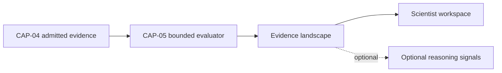

# CAP-05 Governed Scientific Reasoning — Canonical Contract — 2026-09-20

**Status:** GOVERNANCE DESIGN CONTRACT — NOT IMPLEMENTATION
**Authority:** DEFINES THE CANONICAL CAP-05 GATEWAY BOUNDARY FOR FUTURE WIRING. Establishes no commissioning, production, Gate D, WP05, scientific-validity or regulatory authority, and makes no Supabase or other provider change.
**Resolves:** the "design decision required before wiring" finding recorded for CAP-05 in `governance/AAB-CAPABILITY-GATEWAY-RECONCILIATION-2026-09-20.md`.
**Not part of PR #16.** PR #16's boundary (`governance/workstream-b/`, `simulation/cap34/`, draft, simulation-only) is unaffected by this document. No code changes and no Supabase changes are made or authorised by this document.

## The boundary, in plain English

> **The scientist deliberately asks, "Show me what the admitted evidence says about this question right now." AAB returns a time-bounded, evidence-linked landscape and stops.**

CAP-05 is a single deliberate, bounded act. It should not inherit the existing agriculture cognitive loop. The ongoing "keep watching this topic" behaviour is potentially useful later, but it is a different capability — Governed Evidence Watch — with different authority, persistence and notification requirements (see below).

## CAP-05 as a single deliberate, bounded act

As behaviourally proven in the simulation, CAP-05:

1. receives an explicitly bounded evidence set
2. groups evidence by subject
3. compares stances
4. identifies contradictions
5. identifies missing evidence categories
6. produces an evidence landscape
7. stops

## Why the cognitive loop is the wrong execution boundary

The current gateway evidence shows that `run_agriculture_cognitive_loop` is not merely a read-only reasoning request. It can:

- materialise observation nodes
- materialise evidence signals
- materialise scientific relationships
- recompute cognitive states
- create investigation candidates
- create problem signals
- record intelligence-activity events

That is a stateful orchestration process. CAP-05 does none of those things. Putting CAP-05 behind `run_agriculture_cognitive_loop` would give a read-only analytical capability an execution path materially broader than its contract. **That violates least authority even if CAP-05 initially uses only part of the loop.**

## Why `submit_problem_signal` is also the wrong action

`submit_problem_signal` is a governed intake and persistence action. It accepts:

```typescript
interface ProblemSignalRequest {
  problem_statement: string;
  problem_type?: string;
  domain_code?: string;
  country_workspace_id?: string;
  origin_type?: string;
  origin_reference?: Record<string, unknown>;
  local_context?: Record<string, unknown>;
}
```

It then calls `cognitive_core.api_submit_problem_signal_guarded`. That action creates a problem signal for later processing. It does not answer the scientist's immediate evidence question. A scientist asking CAP-05 to assess evidence should not have to create a persistent problem, start a cognitive process, modify a cognitive graph, create an investigation candidate, or alter AAB's stored belief state. **Submitting a problem and evaluating an evidence landscape are different user intents.**

## Recommended landing zone

CAP-05 needs its own provider-neutral, stateless gateway action, in a distinct action group:

```
AAB_GOVERNED_REASONING_ACTIONS
  cap05_evaluate_evidence_landscape
```

The explicit capability-named `cap05_evaluate_evidence_landscape` is preferred over a bare `evaluate_evidence_landscape` because it makes audit and authority review easier. The group could initially contain only this one action. The name "reasoning" is acceptable because the action reasons over evidence, but its contract must prevent it from becoming a general cognitive execution gateway.

## Proposed CAP-05 request contract

CAP-05 should preferably receive references to CAP-04-admitted records rather than arbitrary ungoverned evidence objects.

```typescript
interface Cap05EvidenceLandscapeRequest {
  requestId: string;

  question: {
    questionText: string;
    subjectScope?: string[];
    domainCodes: string[];
  };

  evidenceScope: {
    memoryRecordIds: string[];
    countryWorkspaceId: string;
    organizationIds?: string[];
  };

  evaluationScope: {
    asOf: string;
    contradictionComparison: true;
    knowledgeGapAssessment: true;
    includeUnreviewedEvidence?: boolean;
    includeQuarantinedEvidence?: false;
  };

  requestedBy: {
    actorId: string;
    role: string;
  };
}
```

The important controls are: the evidence set is explicit; every record must resolve through CAP-04; the country boundary is explicit; the time boundary is explicit; quarantined evidence is excluded by default; the scientist initiates the evaluation; the request grants no mutation authority.

The server should derive the actor from the authenticated identity. It should not trust a client-supplied `requestedBy.actorId` for authority. Therefore, the actual external request may omit `requestedBy`, while the trusted internal contract adds it after authentication.

### Internal trusted request

```typescript
interface TrustedCap05EvidenceLandscapeRequest
  extends Omit<Cap05EvidenceLandscapeRequest, "requestedBy"> {

  requestedBy: {
    actorId: string;
    role: string;
    authorityScope: string[];
  };
}
```

## Proposed evidence input shape

CAP-05 should receive the parts of CAP-04 evidence required for reasoning:

```typescript
interface Cap05EvidenceRecord {
  memoryRecordId: string;
  subjectKey: string;

  stance:
    | "SUPPORTS"
    | "OPPOSES"
    | "NEUTRAL"
    | "INCONCLUSIVE"
    | "NOT_APPLICABLE";

  evidenceCategory: string;
  evidenceSummary: string;

  context: {
    domainCode: string;
    location?: LocationReference;
    dateObserved?: string;
    treatmentLabel?: string;
    methodReference?: string;
  };

  provenance: {
    sourceId: string;
    sourceOrganizationId: string;
    integrityStatus: "VERIFIED";
  };

  admission: {
    eligibleForScientificMemory: true;
    status: "ADMITTED";
  };

  reviewStatus:
    | "UNREVIEWED"
    | "REVIEWED_EVIDENCE";
}
```

CAP-05 should not silently infer `SUPPORTS` or `OPPOSES` from `outcomePolarity` alone. A negative outcome does not always oppose a claim — its meaning depends on the question. The stance must either be explicitly established for the current reasoning question, or derived through a disclosed, deterministic classification step.

## Proposed response contract

```typescript
interface Cap05EvidenceLandscapeResponse {
  ok: true;
  capabilityId: "CAP-05";
  resultType: "EVIDENCE_LANDSCAPE";
  schemaVersion: string;

  requestId: string;
  evaluatedAt: string;
  asOf: string;

  question: {
    questionText: string;
    domainCodes: string[];
    subjectScope?: string[];
  };

  evidenceSet: {
    requestedRecordCount: number;
    admittedRecordCount: number;
    excludedRecordCount: number;
    excludedRecords: Array<{
      memoryRecordId: string;
      reason: string;
    }>;
  };

  subjects: Array<{
    subjectKey: string;

    evidenceRecords: Array<{
      memoryRecordId: string;
      stance: Cap05EvidenceRecord["stance"];
      evidenceCategory: string;
      evidenceSummary: string;
    }>;

    evidenceState:
      | "SUPPORTED"
      | "PARTIALLY_SUPPORTED"
      | "CONFLICTING"
      | "INSUFFICIENT"
      | "UNKNOWN";
  }>;

  contradictions: Array<{
    subjectKey: string;
    recordA: string;
    recordB: string;
    stanceA: string;
    stanceB: string;
    contradictionType: string;
    explanation: string;
  }>;

  knowledgeGaps: Array<{
    subjectKey: string;
    missingEvidenceCategory: string;
    reasonRequired: string;
  }>;

  limitations: string[];

  authorityBoundary: {
    readOnly: true;
    advisoryOnly: true;
    failClosed: true;
    noWrites: true;
    noMutation: true;
    noPromotionAuthority: true;
    noApprovalAuthority: true;
    noInvestigationCreation: true;
    noBeliefStateMutation: true;
  };
}
```

Notice what is intentionally absent: recommendation, preferred treatment, approval, promotion decision, formulation action, trial creation, investigation creation, updated belief state, autonomous continuation. **CAP-05 returns a landscape, not a verdict.**

## Failure contract

CAP-05 should fail closed when: a requested CAP-04 record does not exist; the actor cannot access one or more records; a record crosses an unauthorised country or institution boundary; provenance or memory admission cannot be verified; the evidence set is empty; required stance or subject classification is unavailable; an operational action is requested; or the provider cannot complete the full bounded evaluation.

```typescript
interface Cap05EvidenceLandscapeFailure {
  ok: false;
  capabilityId: "CAP-05";
  result: "FAIL_CLOSED";

  error:
    | "AUTHORITY_SCOPE_INVALID"
    | "EVIDENCE_RECORD_NOT_FOUND"
    | "EVIDENCE_NOT_ADMITTED"
    | "EVIDENCE_ACCESS_DENIED"
    | "CROSS_BOUNDARY_REQUEST_BLOCKED"
    | "EVIDENCE_SET_EMPTY"
    | "CLASSIFICATION_INCOMPLETE"
    | "DEPENDENCY_UNAVAILABLE"
    | "OPERATIONAL_INTENT_BLOCKED";

  affectedRecordIds?: string[];
  reasons: string[];

  partialLandscapeReturned: false;
  noWrites: true;
  noMutation: true;
}
```

Returning a partial landscape without clearly disclosing missing evidence could materially distort what the scientist sees. The default is therefore no partial result unless a later contract explicitly supports a visible incomplete-evidence mode.

## Relationship to the existing reasoning packet

The existing `ReasoningSignalPacket` contains useful vocabulary:

```typescript
signalType:
  | "MECHANISM"
  | "COMPATIBILITY"
  | "NOVELTY"
  | "EVIDENCE"
  | "CONFIDENCE"
  | "LEARNING";

evidenceState:
  | "SUPPORTED"
  | "PARTIALLY_SUPPORTED"
  | "CONFLICTING"
  | "INSUFFICIENT"
  | "UNKNOWN";
```

CAP-05 can reuse the `evidenceState` vocabulary. It should not, however, use the whole `ReasoningSignalPacket` as its canonical output — that packet represents one reasoning signal sent between components, while CAP-05 produces a structured landscape containing multiple subjects, evidence groups, contradiction pairs, missing evidence categories, exclusions and limitations.

The clean relationship is:



CAP-05 may produce read-only signals derived from its landscape for other authorised views, but those signals must not cause the cognitive loop to execute automatically.

## Governed Evidence Watch — a separate future capability (not deferred)

"Keep watching this topic" is potentially useful later, but it is a different capability with different authority, persistence and notification requirements than CAP-05's single bounded act. It is recorded here, distinctly from CAP-05, so it is not lost — it is the immediate next design task, not a deferred one.

Its job would be to:

1. store a scientist-authorised watch definition
2. **detect when newly admitted CAP-04 evidence matches that definition** — this is its trigger mechanism: new admission events flowing out of CAP-04, filtered against the stored watch definition, are what cause a watch to fire. Nothing about a watch definition or its trigger ever re-runs CAP-05 by itself.
3. create a notice that the existing landscape may be stale
4. invite the scientist to run CAP-05 again

It should not silently modify the previous evidence landscape. Each CAP-05 result remains an immutable snapshot, identified by:

```typescript
interface EvidenceLandscapeSnapshotIdentity {
  landscapeId: string;
  requestId: string;
  evidenceRecordIds: string[];
  evidenceSetDigest: string;
  asOf: string;
  evaluatedAt: string;
  evaluatorVersion: string;
}
```

When new evidence arrives, AAB could say: *"Three newly admitted evidence records may affect this landscape. Re-evaluation is available."* The scientist then deliberately initiates another CAP-05 evaluation. Even if a country later authorises automatic re-evaluation, each run remains a discrete, versioned snapshot, and automatic re-evaluation must still not promote knowledge, create investigations or change belief states.

This section fixes only the anchor points needed to design Governed Evidence Watch without losing them against this CAP-05 contract: its trigger mechanism (item 2 above) and the `EvidenceLandscapeSnapshotIdentity` it must key off. It does not design the watch definition's own storage shape, notification contract, or authority model — that is the next document.

## Final decision

CAP-05 should not be wired to either `submit_problem_signal` or `run_agriculture_cognitive_loop`. It should have a separate, stateless, provider-neutral gateway action.

It may reuse:

- the cognitive layer's evidence-state vocabulary
- read-only comparison algorithms
- shared provenance resolution
- shared authority checks

But it must not inherit:

- persistent problem creation
- graph materialisation
- cognitive-state recomputation
- investigation creation
- iterative execution
- autonomous continuation

> **The scientist deliberately asks, "Show me what the admitted evidence says about this question right now." AAB returns a time-bounded, evidence-linked landscape and stops.**

## What this document does not establish

- It does not implement, deploy or migrate anything — no code, Supabase or other provider change is made or authorised.
- It does not touch PR #16 or its boundary.
- It does not design Governed Evidence Watch — only anchors the two pieces (trigger mechanism, `EvidenceLandscapeSnapshotIdentity`) that CAP-05's contract must not contradict when that design happens next.
- It does not fix AAB's final canonical field names beyond what is specified here.
- It does not establish that CAP-05 is production-ready, scientifically valid or regulatorily compliant.
- It does not alter commissioning status, satisfy Gate D, close WP05, or grant any production or commissioning authority.
