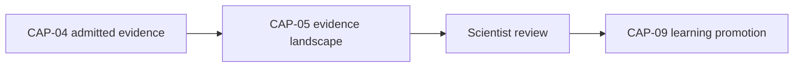

# Governed Evidence Watch — Candidate Design — 2026-09-20

**Status:** CANDIDATE DESIGN — NOT ADMITTED. No CAP number is assigned by this document.
**Authority:** RECORDS A PROPOSED CAPABILITY FOR FUTURE FORMAL ADMISSION. Establishes no commissioning, production, Gate D, WP05, scientific-validity or regulatory authority, grants no Launch Release status, and makes no Supabase or other provider change.
**Relationship to CAP-05:** anchored from, and consistent with, the Governed Evidence Watch section of `governance/workstream-b/CAP-05-GOVERNED-SCIENTIFIC-REASONING-CANONICAL-CONTRACT-2026-09-20.md`. That document fixed only `EvidenceLandscapeSnapshotIdentity` and the trigger concept so they would not be lost; this document is the design pass promised there, now carrying the full candidate interface specification.
**Not part of PR #16.** PR #16's boundary (`governance/workstream-b/`, `simulation/cap34/`, draft, simulation-only) is unaffected by this document. No code changes and no Supabase changes are made or authorised by this document.

## Provisional identity

Until formally admitted, this capability is recorded under a candidate identity, not a CAP number:

```typescript
interface EvidenceWatchCandidateIdentity {
  candidateId: "CAP-CANDIDATE-GOVERNED-EVIDENCE-WATCH-01";
  proposedName: "Governed Evidence Watch";
  proposedType: "STATEFUL_MONITORING_AND_NOTIFICATION";
  proposedRelease: "POST_LAUNCH";
  capabilityStatus: "PROPOSED_NOT_ADMITTED";
  implementationStatus: "NOT_YET_REPRESENTED";
  launchDependency: false;
}
```

This allows the design to be preserved without falsely inserting it into the admitted capability landscape.

## Responsibility boundary

The capability should do only this:

> **Maintain a scientist-authorised watch definition, detect newly admitted CAP-04 evidence that may match it, and notify the authorised scientist that a new CAP-05 evaluation may be warranted.**

It must not: run CAP-05 automatically by default; change an existing landscape; change a belief state; create a scientific conclusion; create or promote a learning claim; begin an investigation; recommend action; override changed access permissions; or continue after expiry or withdrawal.

## Output — `EvidenceWatchNotice`

```typescript
interface EvidenceWatchNotice {
  watchId: string;
  noticeId: string;
  matchingMemoryRecordIds: string[];
  previousLandscapeId?: string;
  reasonMatched: string[];
  detectedAt: string;

  actionAvailable: "REQUEST_NEW_CAP05_EVALUATION";

  cap05Executed: false;
  landscapeChanged: false;
  knowledgePromoted: false;
}
```

Every field ending in `false` is load-bearing: a notice is evidence that a watch matched, not an action that changed anything.

## Why it deserves a separate identity, not a CAP-05 sub-capability

CAP-05 and Evidence Watch have fundamentally different operating models:

| Boundary | CAP-05 | Governed Evidence Watch |
|---|---|---|
| Initiation | Scientist requests an evaluation | Scientist establishes a continuing watch |
| Duration | One bounded execution | Persists until suspended, expired or withdrawn |
| State | Stateless evaluation | Stateful watch definition |
| Trigger | Direct human request | Admission of potentially relevant new evidence |
| Input | Explicit evidence set | Matching criteria plus future CAP-04 events |
| Output | Evidence-landscape snapshot | Notice that re-evaluation may be warranted |
| Writes | None | Must store the authorised watch definition and notices |
| Continuation | Stops after returning the landscape | Continues within an authorised lifecycle |
| CAP-05 execution | Performs evaluation | Must not execute CAP-05 without separate authority |
| Scientific authority | No conclusion or promotion | No conclusion, promotion or silent landscape change |

Making Evidence Watch a CAP-05 extension would weaken CAP-05's most important property — its stateless, deliberate, read-only execution boundary — and would introduce persistent processing into a capability whose contract says it evaluates a fixed evidence set and stops.

## Why it should not be a Launch Release capability yet

Evidence Watch is useful, but it is not necessary to prove AAB's foundational scientific pathway. Launch can operate safely through deliberate scientist-initiated evaluations:



Evidence Watch adds convenience and continuity, but it also introduces significant new governance requirements that this pathway does not need:

- persistent watch definitions
- event matching
- subscriptions
- expiry and withdrawal
- notification delivery
- deduplication
- country and institution scope
- access changes after creation
- evidence-access revalidation
- processing cadence
- failure and retry behaviour
- audit records
- protection against autonomous CAP-05 execution

Those controls should not be introduced into Launch merely because CAP-05 revealed a possible future feature. This list is the explicit reason Evidence Watch is not a Launch Release capability.

## Ten-point admission checklist

A new capability cannot be inserted silently into the current CAP-34 snapshot. Admission should first confirm:

1. no existing CAP-01–CAP-34 capability already owns the responsibility
2. CAP-29 remains retired and is not reused
3. Evidence Watch is not required to correct an incomplete existing capability
4. its responsibility is scientifically and operationally distinct
5. its dependencies are explicit
6. its authority boundary is enforceable
7. its release classification is accepted
8. the Capability Architecture and Implementation Registry are updated together
9. the CAP-34 fidelity manifest records its truthful representation status
10. all validators recognise the new canonical capability set

This document satisfies none of these ten points on its own; it is design input to that process, not the process itself.

## Eventual CAP number

If the capability-admission process accepts it, the natural next identifier would probably be:

**CAP-35 — Governed Evidence Watch**

**But CAP-35 must not become canonical merely because it is numerically available.** It becomes canonical only once the ten-point checklist above has actually been satisfied, not because the next integer happens to be free.

## Full candidate interface specification

The three interfaces originally flagged as missing at commit time — `GovernedEvidenceWatchDefinition`, `GovernedEvidenceWatchTrigger` and `GovernedEvidenceWatchNotice` — have since been supplied and are recorded here verbatim, alongside a fail-closed failure contract. Together with `EvidenceWatchCandidateIdentity`, `EvidenceWatchNotice` and `EvidenceLandscapeSnapshotIdentity` (the latter defined in the CAP-05 contract) above, this is the full candidate contract surface for Governed Evidence Watch.

```typescript
interface GovernedEvidenceWatchDefinition {
  watchId: string;
  schemaVersion: string;
  authorisedBy: ScientistReference;
  countryWorkspaceId: string;
  organizationIds?: string[];
  domainCodes: string[];
  subjectScope?: string[];
  evidenceCategories?: string[];
  minimumAdmissionStatus: "ADMITTED";
  excludeQuarantined: true;
  anchoredToLandscape?: EvidenceLandscapeSnapshotIdentity;
  status:
    | "ACTIVE"
    | "PAUSED"
    | "TRIGGERED"
    | "EXPIRED"
    | "CANCELLED";
  createdAt: string;
  expiresAt?: string;
  lastCheckedAt?: string;
}

interface GovernedEvidenceWatchTrigger {
  triggerId: string;
  watchId: string;
  triggeredAt: string;
  matchingMemoryRecordIds: string[];
  matchCount: number;
  suggestedAction: "RUN_CAP05_EVALUATION";
  suggestedEvidenceScope: {
    memoryRecordIds: string[];
    asOf: string;
  };
  autonomousActionTaken: false;
  landscapeModified: false;
  evidenceModified: false;
  knowledgePromoted: false;
}

interface GovernedEvidenceWatchNotice {
  noticeId: string;
  watchId: string;
  triggerId: string;
  message: string;
  matchingRecordCount: number;
  anchoredLandscapeId?: string;
  invitedAction: "RE_EVALUATE_EVIDENCE_LANDSCAPE";
  invitedActionAvailable: true;
  readOnly: true;
  noAutonomousEvaluation: true;
  noLandscapeUpdate: true;
  scientistInitiatedOnly: true;
  createdAt: string;
  acknowledgedAt?: string;
  dismissedAt?: string;
}
```

`GovernedEvidenceWatchDefinition.anchoredToLandscape` is the enforced link back to CAP-05: a watch can be scoped against a prior evidence-landscape snapshot, but `GovernedEvidenceWatchTrigger.autonomousActionTaken`, `landscapeModified`, `evidenceModified` and `knowledgePromoted` are all fixed at `false` — matching alone never mutates anything. `GovernedEvidenceWatchNotice` carries the same load-bearing `false`/`true` boundary fields as `EvidenceWatchNotice` above; the two are complementary views (`EvidenceWatchNotice` is the minimal notice shape recorded at candidate-identity time, `GovernedEvidenceWatchNotice` is the fuller notice tied to a specific `GovernedEvidenceWatchTrigger`), not a contradiction to be resolved before implementation.

### Failure contract

```typescript
interface GovernedEvidenceWatchFailure {
  ok: false;
  capabilityId: "CAP-CANDIDATE-GOVERNED-EVIDENCE-WATCH-01";
  result: "FAIL_CLOSED";
  error:
    | "AUTHORITY_SCOPE_INVALID"
    | "LANDSCAPE_SNAPSHOT_NOT_FOUND"
    | "WATCH_DEFINITION_INVALID"
    | "COUNTRY_BOUNDARY_VIOLATION"
    | "SCIENTIST_REFERENCE_INVALID"
    | "DEPENDENCY_UNAVAILABLE";
  noWrites: true;
  noMutation: true;
  noNotificationSent: true;
}
```

## Final preference

- **Capability identity:** separate.
- **Launch Release:** no.
- **Current canonical CAP number:** none yet.
- **Provisional identity:** `CAP-CANDIDATE-GOVERNED-EVIDENCE-WATCH-01`.
- **Likely number after formal admission:** CAP-35.
- **Relationship to CAP-05:** optional downstream monitoring capability, not a CAP-05 sub-capability.
- **Current representation status:** `NOT_YET_REPRESENTED`.

This keeps CAP-05 clean and prevents a useful future monitoring function from quietly introducing ongoing autonomous behaviour into AAB's foundational reasoning capability.

## What this document does not establish

- It does not admit Governed Evidence Watch as a capability, assign it CAP-35 or any CAP number, or add it to the Launch Release.
- It does not update the Capability Architecture and Implementation Registry or the CAP-34 fidelity manifest — checklist points 8–10 remain outstanding.
- It does not itself admit, register or deploy `GovernedEvidenceWatchDefinition`, `GovernedEvidenceWatchTrigger`, `GovernedEvidenceWatchNotice` or `GovernedEvidenceWatchFailure` — the interfaces are now fully specified (see "Full candidate interface specification" above), but specifying a contract is not implementing, storing or executing it.
- It does not implement, deploy or migrate anything — no code, Supabase or other provider change is made or authorised.
- It does not touch PR #16 or its boundary.
- It does not alter commissioning status, satisfy Gate D, close WP05, or grant any production or commissioning authority.
