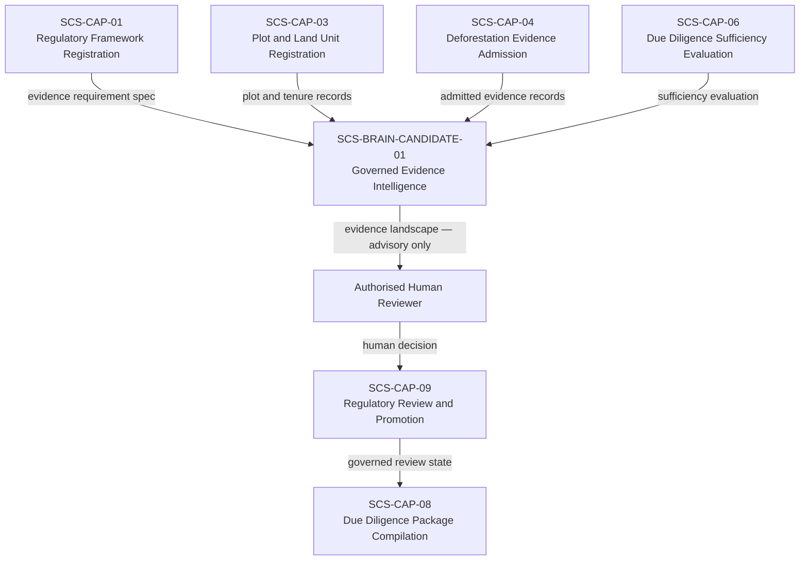

# SCS-BRAIN-CANDIDATE-01 — Governed Supply Chain Evidence Intelligence — 2026-09-22

**Status:** CANDIDATE DESIGN RECORD — NOT A CAPABILITY CONTRACT — NOT ADMITTED — NOT IMPLEMENTED
**Domain:** Supply Chain Sovereignty (SCS)
**Designation:** SCS-BRAIN-CANDIDATE-01
**Authority:** RECORDS A PROPOSED COMPOSITION LAYER FOR REVIEW. This document does not admit any capability. It does not assign a CAP number. It does not grant implementation authority. It does not alter commissioning status, satisfy Gate D, close WP05, or grant any production authority.

## What this document is

This is a candidate design record for a governed reasoning layer that sits above the SCS capabilities — reading their governed outputs to produce an honest, structured evidence intelligence landscape for authorised reviewers. It is not a capability contract. It has not been through the ten-point admission checklist. It has not been behaviourally proven.

It is recorded here so the design is not lost, the architecture is explicit before implementation is considered, and the authority boundary is stated precisely before any code is written.

## The governing statement

> The SCS Brain would help an authorised reviewer see exactly what is known, what conflicts, what is missing and why — across thousands of plots and evidence records — without hiding uncertainty or taking the legal decision away from the responsible human.

## What it is not

The SCS Brain is not an autonomous compliance authority. It must never:
- Declare a product EUDR-compliant
- Determine that legal risk is negligible
- Sign or submit a due diligence statement
- Approve a plot
- Validate a tenure claim
- Modify plot boundaries
- Strengthen a source's claim
- Manufacture temporal coverage
- Ignore contradictory evidence
- Automatically obtain or purchase external data
- Contact regulatory authorities
- Promote evidence into accepted regulatory knowledge
- Change framework requirements
- Continue running without authorised initiation
- Learn from a reviewer's decision without governed promotion
- Resolve a conflict by selecting the more convenient evidence

These boundaries must be enforced in the interface contract and in behavioural tests before any implementation is authorised.

## Where it sits



The Brain reads governed outputs from individual capabilities. It does not replace those capabilities or bypass their boundaries. It does not feed into SCS-CAP-09 directly — the human reviewer does.

## What it is — three candidate characterisations

Before a CAP number is assigned, it must first be determined which of these the Brain actually is:

1. **A composition of CAP-01, CAP-03, CAP-04, and CAP-06** — a governed orchestration layer that calls existing capabilities in sequence and presents their collective output as a unified landscape. No new logic of its own.

2. **A shared reasoning service used by several SCS capabilities** — logic that CAP-06 and future capabilities call into, but which has its own lifecycle, versioning, and behavioural tests.

3. **A genuinely independent capability with its own lifecycle** — requiring its own admission, its own canonical contract, its own disclosure receipt, and its own CAP number.

Giving it a CAP number before this question is answered risks changing the twelve-capability landscape before the roster is settled. The designation `SCS-BRAIN-CANDIDATE-01` is used until the characterisation is confirmed through review.

## What it does — six analytical functions

### 1. Translate regulatory requirements into an evidence landscape

For a given framework, commodity, and market — show:
- Applicable requirements from the registered framework
- Required evidence categories per the `ScsEvidenceRequirementSpec`
- Evidence already admitted and what it covers
- Evidence missing entirely
- Evidence that is out of date relative to the framework period
- Evidence that covers only part of a plot spatially
- Evidence that covers only part of the required period temporally
- Unresolved human decisions that are blocking progress

**Example output for a Thai rubber plot:**
```
EUDR rubber assessment for Plot TH-CR-004
Plot geometry recorded. Formal registry unverified.
Satellite evidence covers 2021–2022 and 2024–2026.
No adequate coverage has been identified for 2023.
Customary tenure evidence is present but has not been
independently reviewed.
Human sufficiency decision required.
```

### 2. Compare temporal coverage across four layers

The Brain analyses the four temporal layers preserved by SCS-CAP-04:
- Acquisition period — when the sensor actually observed the plot
- Analysis period — what period the submitted analysis evaluated
- Attested period — what period an authority accepts responsibility for
- Framework-required period — what the framework demands

It identifies:
- Uncovered periods
- Overlapping evidence
- Inconsistent date claims between sources
- Attestations that exceed the underlying analytical coverage
- Evidence that has become stale relative to the evaluation date
- Apparent coverage created only by joining incompatible sources

It must not treat the earliest start date and latest end date of admitted evidence as proof of continuous coverage.

### 3. Compare spatial coverage

The Brain compares:
- The registered plot geometry per SCS-CAP-03
- Each admitted evidence item's spatial footprint
- Excluded or cloud-covered areas recorded in SCS-CAP-04
- Disputed boundaries from tenure records
- Overlapping cooperative or community plots
- Changes between plot versions

**Example:**
```
Remote-sensing evidence covers 87% of the registered plot.
The northwestern section is outside the submitted evidence footprint.
```

It cannot silently classify the remaining 13% as safe.

### 4. Detect contradictions

Examples of contradictions the Brain would surface:
- Satellite analysis reports no detected clearing; a forestry-authority record identifies a clearing event for the same period and area
- The producer declares continuous use; the plot boundary changed after the evidence was created
- Two tenure claims overlap the same area
- Two providers assign different land-cover classifications to the same plot area

The Brain identifies and explains the contradiction. It does not choose the preferred source. Only a human reviewer with an explicit resolution record — as defined in SCS-CAP-06 — can resolve a contradiction. The Brain may consume that resolution record in a subsequent evaluation.

### 5. Identify the next evidence need

The Brain produces bounded, specific evidence requests — not compliance recommendations:
- Obtain evidence for the missing 2023 interval
- Confirm whether the updated polygon represents the same real-world plot
- Request the issuing authority's certificate reference
- Review overlapping tenure claims with the cooperative administrator
- Obtain higher-resolution imagery for the partially obscured area
- Confirm whether an analysis detects deforestation, degradation, or only generic tree-cover change

These are evidence requests. They are not sufficiency determinations and they are not compliance advice.

### 6. Explain why an evaluation is blocked

Instead of surfacing only `INSUFFICIENT`, the Brain provides a traceable explanation tied to the specific evidence records:

```
Evaluation cannot reach SUFFICIENT because:

1. Framework requirement EUDR-DEF-01 covers 2021-01-01 to 2026-09-22.
2. Admitted evidence supports 2021-01-01 to 2023-02-14.
3. The remaining source is a point-in-time observation from 2025-06-08.
4. No admitted evidence supports the intervening period.
5. Source AAB-EV-00247's attestation extends beyond its disclosed
   analysis period.
6. Human review cannot remove the missing-evidence fact.
```

This makes the system defensible when a due diligence statement is later challenged.

## Stateless first

The first SCS Brain operates as a single deliberate evaluation:

> "Show me the evidence landscape for these plots under this framework as it stands now."

It produces an immutable snapshot and stops. It does not:
- Watch evidence continuously
- Re-run when new evidence is admitted
- Modify previous results
- Create compliance cases automatically
- Update its own reasoning rules

A later governed watch capability — separate from the Brain — could notify a human reviewer that new admitted evidence may justify requesting a new evaluation. That capability remains separate and is not part of this candidate design.

## Contradiction-surfacing behaviour after prior human decisions

When a compliance officer has made a prior sufficiency review decision through SCS-CAP-09, and new evidence is subsequently admitted that changes the landscape, the Brain must:

1. Surface the contradiction between the new admitted evidence and the prior review decision explicitly
2. Produce a traceable explanation of what changed and why the landscape differs from the prior review
3. Flag that a new human review is required — it does not automatically invalidate the prior decision
4. Create a visible, governed record that the landscape has changed

The Brain does not silently incorporate new evidence as if the prior decision never happened. The prior decision remains on record. The new landscape is a new evaluation. The human reviewer decides what to do with both.

## Proposed input interface

```typescript
interface ScsBrainReasoningRequest {
  requestId: string;
  requestedBy: ActorReference;
  requestedAt: string;

  subject: {
    plotIds: string[];
    commodityCode: string;
    relevantProductCode?: string;
    shipmentOrBatchId?: string;
  };

  framework: {
    frameworkId: string;
    frameworkVersion: string;
    evidenceRequirementSpecIds: string[];
  };

  evidenceScope: {
    admittedEvidenceIds: string[];
    includeEvidenceWithLimitations: boolean;
    // Quarantined evidence must never be included
    includeQuarantinedEvidence: false;
  };

  evaluationDate: string;

  requestedAnalysis: Array
    | "REQUIREMENT_MAPPING"
    | "TEMPORAL_COVERAGE"
    | "SPATIAL_COVERAGE"
    | "CONTRADICTION_DETECTION"
    | "KNOWLEDGE_GAPS"
    | "EVIDENCE_REQUESTS"
  >;
}
```

The authenticated server — not the browser — must establish the requesting actor and authority scope.

## Proposed output interface

```typescript
interface ScsBrainEvidenceLandscape {
  requestId: string;
  evaluatedAt: string;
  evaluatorVersion: string;

  frameworkContext: {
    frameworkId: string;
    frameworkVersion: string;
    commodityCode: string;
  };

  plots: Array<{
    plotId: string;
    plotVersion: number;
    registryVerificationStatus: string;
    tenureGapCount: number;
    boundaryGapCount: number;
  }>;

  requirementLandscape: Array<{
    requirementCode: string;
    evidenceState:
      | "SUPPORTED"
      | "PARTIALLY_SUPPORTED"
      | "CONFLICTING"
      | "INSUFFICIENT"
      | "UNKNOWN";
    supportingEvidenceIds: string[];
    conflictingEvidenceIds: string[];
    missingEvidenceCategories: string[];
  }>;

  temporalCoverage: {
    supportedIntervals: Array<{
      start: string;
      end: string;
      evidenceIds: string[];
    }>;
    uncoveredIntervals: Array<{
      start: string;
      end: string;
      reason: string;
    }>;
    incompatibleIntervals: Array<{
      start: string;
      end: string;
      explanation: string;
    }>;
  };

  spatialCoverage: {
    fullyCoveredPlotIds: string[];
    partiallyCoveredPlotIds: string[];
    uncoveredAreaReferences: string[];
  };

  contradictions: Array<{
    subject: string;
    evidenceIds: string[];
    explanation: string;
  }>;

  evidenceRequests: Array<{
    requirementCode: string;
    requestedEvidenceCategory: string;
    reason: string;
  }>;

  limitations: string[];

  // Permanent authority boundary — present on every result
  // Cannot be stripped from the output
  authorityBoundary: {
    advisoryOnly: true;
    readOnly: true;
    failClosed: true;
    noComplianceDetermination: true;
    noDueDiligenceStatementAuthority: true;
    noRegulatoryPromotionAuthority: true;
    noSubmissionAuthority: true;
  };
}
```

## How the Brain becomes more intelligent — safely

The Brain's capability can improve through controlled additions:
- More precise framework requirement mappings
- Validated remote-sensing method classifications
- Additional evidence-quality rules
- Better temporal coverage reasoning
- Better spatial intersection analysis
- Scientist-reviewed contradiction patterns
- Known false-positive and false-negative cases for specific evidence types
- Additional country-specific evidence type mappings
- Validated terminology mappings across regulatory frameworks
- Reviewed examples of adequate and inadequate evidence packages

Every improvement must be:
- Versioned — each update has an explicit version identifier
- Attributable — who proposed it, who reviewed it, what evidence supported it
- Behaviourally tested — proven against controlled evidence landscapes before deployment
- Independently reviewable — a separate reviewer can inspect and challenge each addition
- Reversible — a prior version can be restored if an update is found to be wrong
- Limited to its declared authority — an improvement in temporal reasoning does not expand the Brain's authority to make compliance determinations

The Brain must never silently train itself on institutional decisions and treat those decisions as universal regulatory truth. A reviewer's resolution of a specific conflict in a specific context is a governed human decision — it is not a new rule that applies to all future evaluations of similar conflicts.

## Benefits for Thai and Vietnamese institutions

For Thai and Vietnamese cooperatives, aggregators, and exporters managing large numbers of smallholder plots under EUDR deadlines, the Brain provides:

- One clear view across fragmented evidence — instead of separate documents that require manual correlation
- Earlier detection of missing evidence — before submission deadlines, not at customs
- Fewer last-minute due diligence surprises
- Traceability from every result back to its source evidence record
- Honest handling of smallholder and informal land evidence — GPS-only plots are not excluded, their gaps are explicitly surfaced
- Explicit distinction between mapped land and verified title
- Detection of temporal satellite gaps before they become challenge points
- Detection of plot/evidence spatial mismatches
- Clearer evidence requests to producers and aggregators
- Consistent evaluation across many plots under the same framework
- Preservation of human regulatory responsibility at every decision point
- Reusable evidence across multiple frameworks without duplicating the underlying plot record

## Sequencing before implementation

The following steps must be completed before any implementation of SCS-BRAIN-CANDIDATE-01 is authorised:

1. ~~Complete the twelve-capability identity roster~~ — done at `652681e`
2. ~~Complete SCS-CAP-06~~ — done at `d57297f`
3. ~~Record this candidate design~~ — this document
4. Prove the Brain against controlled evidence landscapes — controlled test fixtures with known gaps, conflicts, and sufficient cases
5. Confirm that its outputs match CAP-06 without bypassing it — the Brain's landscape must be consistent with what CAP-06 would independently evaluate
6. Confirm the characterisation — composition layer, shared reasoning service, or independent capability
7. Review the authority boundary against a real institutional scenario
8. Only then consider implementation and formal admission

## What this document does not establish

- It does not admit SCS-BRAIN-CANDIDATE-01 as a canonical capability
- It does not assign a CAP number — designation remains `SCS-BRAIN-CANDIDATE-01` until characterisation is confirmed
- It does not implement, deploy or migrate anything
- It does not make compliance determinations
- It does not alter commissioning status, satisfy Gate D, close WP05, or grant any production authority
- It does not update the Capability Identity Roster — the Brain is not yet a numbered capability and the roster records numbered capabilities only
