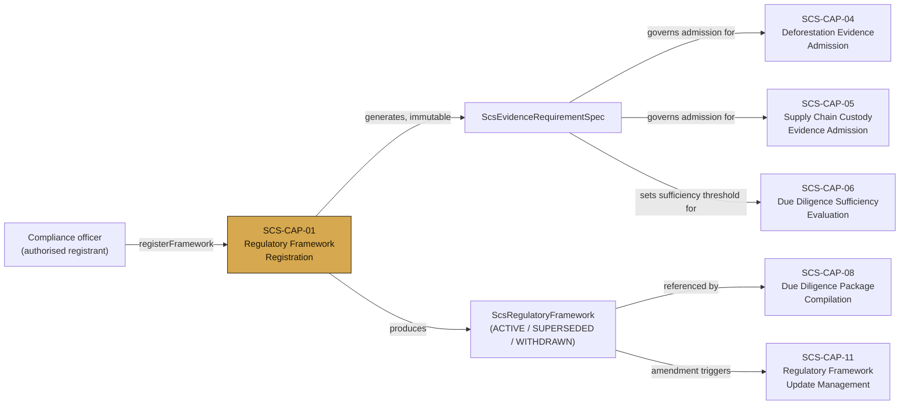
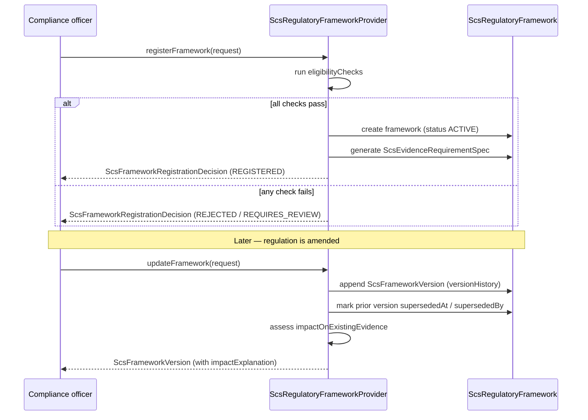

# SCS-CAP-01 — Regulatory Framework Registration — Canonical Contract Design — 2026-09-22

**Status:** CANONICAL CONTRACT DESIGN — NOT ADMITTED
**Authority:** DEFINES THE PROPOSED CANONICAL CONTRACT FOR SCS-CAP-01. Does not admit SCS-CAP-01 as a canonical capability. Establishes no commissioning, production, Gate D, WP05, scientific-validity or regulatory authority. A pilot implementation exists; what it covers is recorded in `scs-pilot/packages/api/src/capabilities/cap-01/README.md`.
**Domain:** Supply Chain Sovereignty (SCS)
**Depends on:** `governance/workstream-b/SCS-SUPPLY-CHAIN-SOVEREIGNTY-DOMAIN-DEFINITION-2026-09-22.md`

## Plain-English boundary statement

SCS-CAP-01 allows an authorised compliance officer to register a specific regulatory framework — identifying which regulation, which version, which commodity, which country of origin, and which destination market apply — and generates the precise evidence requirement specification that governs what must be admitted before a due diligence evaluation can proceed. It does not evaluate evidence. It does not make compliance determinations. It creates the governed standard that every subsequent SCS capability checks against.

## Where SCS-CAP-01 sits in the domain



SCS-CAP-01 is upstream of every other SCS capability. Nothing else in the domain can admit evidence, evaluate sufficiency, or compile a due diligence package without a registered framework and its generated `ScsEvidenceRequirementSpec` to check against.

## Registration and versioning flow



Version history is append-only and never deleted. A framework update never mutates a prior `ScsEvidenceRequirementSpec` in place — it produces a new immutable snapshot and records what the change means for evidence already admitted under the prior version.

## The core interfaces

```typescript
interface ScsRegulatoryFramework {
  // Canonical identity
  frameworkId: string;
  schemaVersion: string;
  registeredAt: string;
  registeredBy: ActorReference;
  status:
    | "ACTIVE"
    | "SUPERSEDED"
    | "WITHDRAWN";

  // What this framework governs
  regulation: {
    regulationId: string;
    regulationName: string;
    regulationVersion: string;
    regulationDate: string;
    regulatoryAuthority: string;
    sourceReference: string;
  };

  // Specific scope
  scope: {
    commodityCode: string;
    commodityName: string;
    countryOfOrigin: string;
    destinationMarket: string;
    applicableNationalLaws: string[];
    effectiveFrom: string;
    effectiveTo?: string;
  };

  // The evidence requirement specification —
  // generated at registration, immutable thereafter
  evidenceRequirements: ScsEvidenceRequirementSpec;

  // Version history — append-only, never deleted
  versionHistory: ScsFrameworkVersion[];
}

interface ScsEvidenceRequirementSpec {
  specId: string;
  generatedAt: string;
  generatedFromFrameworkVersion: string;

  // Deforestation evidence requirements
  deforestationEvidence: {
    referenceCutoffDate: string;
    requiredCoverageType:
      | "FULL_PLOT_COVERAGE"
      | "REPRESENTATIVE_SAMPLE"
      | "RISK_BASED";
    acceptedSourceTypes: string[];
    minimumResolutionMetres?: number;
    minimumRecencyDays?: number;
    integrityRequirement:
      | "VERIFIED"
      | "VERIFIABLE";
    authorityConfirmationRequired: boolean;
  };

  // Supply chain custody requirements
  custodyEvidence: {
    requiredDocumentTypes: string[];
    chainOfCustodyStandards: string[];
    traceabilityDepth:
      | "FIRST_SUPPLIER"
      | "FULL_CHAIN"
      | "RISK_PROPORTIONATE";
  };

  // Land and plot requirements
  plotRequirements: {
    geolocationRequired: boolean;
    landRegistryRequired: boolean;
    minimumPlotIdentifierType: string;
    ownershipVerificationRequired: boolean;
  };

  // What triggers a SUFFICIENT evaluation
  sufficiencyThreshold: {
    allPlotsRegistered: boolean;
    allPlotsHaveDeforestationEvidence: boolean;
    custodyChainComplete: boolean;
    noUnresolvedGaps: boolean;
    humanReviewCompleted: boolean;
  };

  // Honest disclosure of what this spec cannot determine
  specLimitations: string[];
}

interface ScsFrameworkVersion {
  versionId: string;
  versionNumber: string;
  effectiveFrom: string;
  supersededAt?: string;
  supersededBy?: string;
  changeReason: string;
  changedBy: ActorReference;

  // Snapshot of the evidence requirement spec
  // at this version — immutable
  evidenceRequirementsSnapshot: ScsEvidenceRequirementSpec;

  // What this version change means for
  // previously admitted evidence
  impactOnExistingEvidence:
    | "NO_IMPACT"
    | "REVIEW_RECOMMENDED"
    | "REVIEW_REQUIRED"
    | "RESUBMISSION_REQUIRED";

  impactExplanation: string;
}

interface ScsFrameworkRegistrationDecision {
  decisionId: string;
  frameworkId: string;
  decision:
    | "REGISTERED"
    | "REJECTED"
    | "REQUIRES_REVIEW";

  eligibilityChecks: {
    regulationReferenceValid: boolean;
    commodityRecognised: boolean;
    countryOfOriginValid: boolean;
    destinationMarketValid: boolean;
    applicableLawsConfirmed: boolean;
    noConflictingFrameworkExists: boolean;
    registrantAuthorised: boolean;
  };

  decisionReasons: string[];
  decidedBy: ActorReference;
  decidedAt: string;
}
```

**Contract gap — evidence requirement derivation rules are undefined.** This contract says the
`ScsEvidenceRequirementSpec` is generated at registration, but it does not define the rules that
derive the specification's values from the registered regulation, scope and commodity. Until those
rules are specified in this contract, an implementation must not invent them: the values of the
specification are declared by the authorised registrant, and CAP-01 generates only the
system-generated fields (`specId`, `generatedAt`, `generatedFromFrameworkVersion`). The derivation
rules must be specified here before a production implementation.

## Registration outcomes, attestation and open gaps

### When registration is FAIL_CLOSED, REJECTED or REQUIRES_REVIEW

**Contract gap — decision rule.** This contract defines two ways a registration can fail to
register a framework: an `ScsFrameworkRegistrationDecision` of `REJECTED` or `REQUIRES_REVIEW`,
and an `ScsFrameworkRegistrationFailure` with `result: "FAIL_CLOSED"`. Several conditions appear in
both, for example a conflicting framework is both the `noConflictingFrameworkExists` eligibility
check and the `CONFLICTING_FRAMEWORK_EXISTS` error. The contract does not say which path applies.
Until it does, this rule applies:

- **FAIL_CLOSED.** Any condition in the failure contract's `error` union, including
  `REGISTRANT_NOT_AUTHORISED`, `CONFLICTING_FRAMEWORK_EXISTS`, `DEPENDENCY_UNAVAILABLE` and
  `EVIDENCE_SPEC_CANNOT_BE_GENERATED`, ends in `FAIL_CLOSED`. Nothing is written: no
  framework, no decision, no receipt.
- **REJECTED and REQUIRES_REVIEW** are reserved for eligibility-check outcomes, and they can only
  arise once evaluation rules for those checks are specified (see below). A `REJECTED` or
  `REQUIRES_REVIEW` decision records no framework, but it is still recorded with its receipt.
- **Until then**, registration produces only a `REGISTERED` decision or a `FAIL_CLOSED`
  failure.

### Applicable laws attestation

`registerFramework` takes a `RegisterFrameworkRequest`, which this contract references but does
not otherwise define. It must include the registrant's attestation that the applicable national
laws have been confirmed:

```typescript
// Added to RegisterFrameworkRequest
applicableLawsAttested: boolean;
```

`applicableLawsAttested` is a declaration by the authorised registrant, not an independent
confirmation. The `applicableLawsConfirmed` eligibility check may be evaluated from it: it is
`true` only when `applicableLawsAttested` is `true`, and the decision's `decisionReasons` must
state that it rests on the registrant's attestation. No machine can confirm that national laws
apply to a scope; the attestation makes the human judgement explicit and attributable instead of
implied.

### Eligibility checks without evaluation rules

**Contract gap — eligibility evaluation rules are undefined.** `ScsFrameworkRegistrationDecision`
names seven eligibility checks. The contract gives evaluation rules for none of these five:

- `regulationReferenceValid`
- `commodityRecognised`
- `countryOfOriginValid`
- `destinationMarketValid`
- `applicableLawsConfirmed` (it may be evaluated from `applicableLawsAttested`, as above)

Until their rules are specified here, an implementation must not invent them. A check that was not
performed is recorded as `false`, and `decisionReasons` names it explicitly as not evaluated, so it
is clear it was not performed rather than failed. A check is never recorded as `true` unless it
was actually performed and passed. The rules must be specified before a production
implementation.

### Accepted source types (constraint from SCS-CAP-04)

`deforestationEvidence.acceptedSourceTypes` must use the `evidenceType` values of SCS-CAP-04
(`SATELLITE_IMAGE`, `REMOTE_SENSING_ANALYSIS`, `LAND_COVER_DATA_PRODUCT`,
`FORESTRY_AUTHORITY_CERTIFICATE`, `GOVERNMENT_RECORD`, `FIELD_VERIFICATION`,
`EXPERT_ASSESSMENT`, `OTHER`). Registration does not refuse other values: SCS-CAP-04 ignores
them when it checks compatibility and records the limitation `SOURCE_TYPE_VOCABULARY_UNKNOWN`
on the evidence it admits.

## Provider-neutral interface

```typescript
interface ScsRegulatoryFrameworkProvider {
  registerFramework(
    request: RegisterFrameworkRequest
  ): Promise<ScsFrameworkRegistrationDecision>;

  getFramework(
    frameworkId: string
  ): Promise<ScsRegulatoryFramework>;

  getFrameworkVersion(
    frameworkId: string,
    versionId: string
  ): Promise<ScsFrameworkVersion>;

  listFrameworks(
    request: ListFrameworksRequest
  ): Promise<ListFrameworksResult>;

  updateFramework(
    request: UpdateFrameworkRequest
  ): Promise<ScsFrameworkVersion>;

  getEvidenceRequirements(
    frameworkId: string,
    asOf?: string
  ): Promise<ScsEvidenceRequirementSpec>;

  checkFrameworkApplicability(
    request: CheckApplicabilityRequest
  ): Promise<CheckApplicabilityResult>;
}
```

## Failure contract

```typescript
interface ScsFrameworkRegistrationFailure {
  ok: false;
  capabilityId: "SCS-CAP-01";
  result: "FAIL_CLOSED";

  error:
    | "REGISTRANT_NOT_AUTHORISED"
    | "REGULATION_REFERENCE_INVALID"
    | "COMMODITY_NOT_RECOGNISED"
    | "COUNTRY_OF_ORIGIN_INVALID"
    | "DESTINATION_MARKET_INVALID"
    | "CONFLICTING_FRAMEWORK_EXISTS"
    | "EVIDENCE_SPEC_CANNOT_BE_GENERATED"
    | "APPLICABLE_LAWS_UNCONFIRMED"
    | "DEPENDENCY_UNAVAILABLE";

  reasons: string[];
  noWrites: true;
  noFrameworkRegistered: true;
}
```

## What this document does not establish

- It does not admit SCS-CAP-01 as a canonical capability — that requires the ten-point admission checklist
- It does not implement, deploy or migrate anything
- It does not make any compliance determination
- It does not confirm that the evidence requirement specifications it generates meet any specific regulatory authority's current interpretation of EUDR requirements — the specifications are derived from the registered framework and are the operator's responsibility to validate against current regulatory guidance
- It does not alter commissioning status, satisfy Gate D, close WP05, or grant any production or commissioning authority
