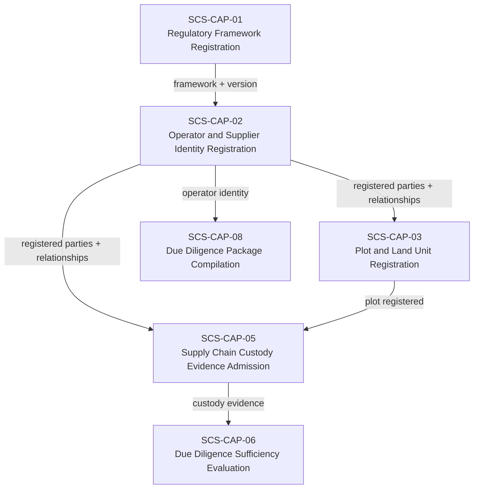
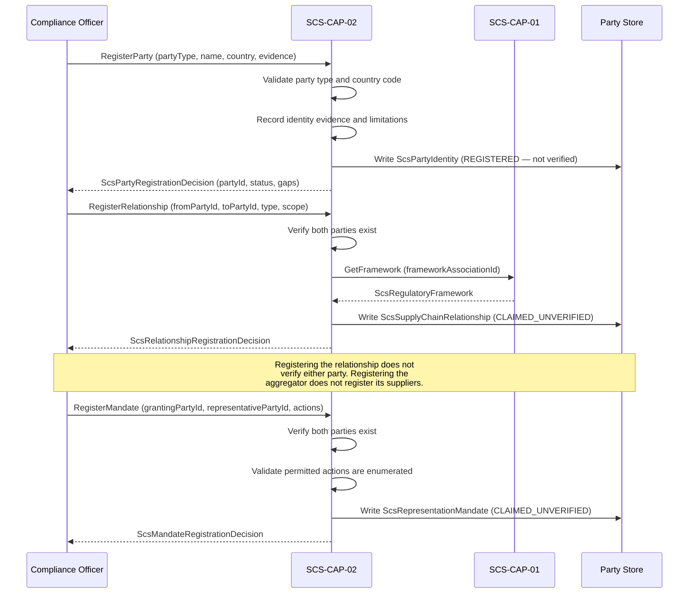

# SCS-CAP-02 — Operator and Supplier Identity Registration — Canonical Contract — 2026-09-23

**Status:** CANONICAL CONTRACT — NOT IMPLEMENTATION
**Domain:** Supply Chain Sovereignty (SCS)
**Authority:** DEFINES THE CONTRACT FOR SCS-CAP-02. Establishes no commissioning,
production, Gate D, WP05, scientific-validity or regulatory authority. This
capability is PROPOSED_NOT_ADMITTED. No implementation exists.

## Plain-English boundary statement

SCS-CAP-02 allows authorised parties to register the legal or natural persons
who occupy roles in a supply chain — operators, suppliers, aggregators,
processors, and exporters — along with the bilateral relationships between them
and the scoped mandates that permit one party to act on another's behalf. It
does not verify identity beyond the scope explicitly declared and evidenced. It
does not prove that a commodity batch moved between any two parties. It does not
grant regulatory eligibility, sanctions clearance, or compliance authority to
any registered party.

## The governing rule

> Every supply-chain relationship is bilateral. One-to-many aggregation is a
> derived network view. Representation authority is a separate, scoped and
> revocable record. Neither relationship nor representation constitutes identity
> verification or proof of commodity movement.

## Registration must not silently equal verification

`registrationStatus: REGISTERED` means only that SCS has created a governed
record of this party. It does not mean:

- Legal identity confirmed
- Sanctions clearance obtained
- Beneficial ownership verified
- Regulatory eligibility established
- Supply-chain role confirmed
- Relationship with any other party verified

Verification always names its scope, evidence, authority, jurisdiction, and
date. AAB must not imply that registering a supplier confirms legal ownership,
sanctions clearance, beneficial ownership, or regulatory eligibility unless
those matters were independently evidenced and explicitly recorded.

## The aggregator model — bilateral relationships only

An aggregator serving 400 smallholder suppliers has 400 independently governed
bilateral relationships. The one-to-many network is a derived view, not a
special record that obscures its members.

Each relationship connects exactly two parties:

```
supplierPartyId → aggregatorPartyId
aggregatorPartyId → processorPartyId
processorPartyId → exporterPartyId
```

Registering an aggregator does not register or verify its suppliers. An
aggregator's assertion that a farmer supplies it is a claim until supported
by evidence and independently assessed. Terminating one supplier relationship
must not affect the aggregator's other relationships.

## Six objects — kept separate

| Record | Purpose |
|---|---|
| Party identity | Identifies the person or legal entity |
| Claimed role | Records operator, supplier, aggregator, processor or exporter role |
| Identity evidence | Records documents and sources supporting identity |
| Verification assessment | Records what was verified, by whom, and when |
| Supply-chain relationship | Connects two parties without merging their identities |
| Framework association | Records the framework and version under which the party participates |

These six objects must never be silently merged. A party's identity record is
independent of any relationship record. A relationship record is independent of
any verification assessment. One party must not alter another party's canonical
identity record.

## Domain position



## Core interfaces

### Party identity record

```typescript
interface ScsPartyIdentity {
  // Canonical identity
  partyId: string;
  partyVersion: number;
  schemaVersion: string;
  registeredAt: string;
  registeredBy: ActorReference;

  // What kind of entity this is
  partyType:
    | "NATURAL_PERSON"
    | "LEGAL_ENTITY"
    | "COOPERATIVE"
    | "COMMUNITY_GROUP"
    | "GOVERNMENT_BODY"
    | "OTHER";

  // Human-readable identifier
  partyName: string;
  countryOfRegistration: string;
  countryOfOperation?: string;

  // Registration status — not verification status
  registrationStatus:
    | "REGISTERED"
    | "REQUIRES_HUMAN_REVIEW"
    | "DISPUTED"
    | "RETIRED";

  // Identity evidence — what documents support this identity
  identityEvidence: {
    evidenceIds: string[];
    evidenceLimitations: string[];
  };

  // Verification — separate from registration
  // Always scoped — never a blanket assertion
  verificationAssessments: ScsPartyVerificationAssessment[];

  // Provenance
  provenance: {
    submittedBy: ActorReference;
    submittingOrganizationId?: string;
    recordedAt: string;
  };
}
```

### Identity verification states

```typescript
type ScsIdentityVerificationStatus =
  | "REGISTERED_UNVERIFIED"
  | "PARTIALLY_VERIFIED"
  | "VERIFIED_FOR_DECLARED_SCOPE"
  | "VERIFICATION_EXPIRED"
  | "DISPUTED"
  | "FAIL_CLOSED";
```

### Party verification assessment — scoped, never blanket

```typescript
interface ScsPartyVerificationAssessment {
  assessmentId: string;
  partyId: string;
  partyVersion: number;

  verificationStatus: ScsIdentityVerificationStatus;

  // Verification is always scoped — what was verified
  verificationScope: {
    scopeDescription: string;
    jurisdictionCode: string;
    verifiedAttributes: string[];
    // Explicit exclusions — what was NOT verified
    excludedFromVerification: string[];
  };

  // Who verified and on what authority
  verifyingAuthority: {
    authorityId: string;
    authorityName: string;
    authorityBasis: string;
    jurisdictionCode: string;
  };

  verifiedAt: string;
  expiresAt?: string;
  evidenceIds: string[];
  limitations: string[];

  // Who recorded this assessment in SCS, and when (set by the system)
  recordedBy: ActorReference;
  recordedAt: string;

  // The earlier assessment of the same party that this one replaces, if any
  supersedesAssessmentId?: string;

  // Verification never implies broader authority
  authorityBoundary: {
    doesNotConfirmSanctionsClearance: true;
    doesNotConfirmBeneficialOwnership: true;
    doesNotGrantRegulatoryEligibility: true;
    doesNotImplyComplianceWithOtherFrameworks: true;
  };
}
```

### Claimed role record

```typescript
interface ScsPartyRoleClaim {
  roleClaimId: string;
  partyId: string;
  partyVersion: number;

  claimedRole:
    | "OPERATOR"
    | "SUPPLIER"
    | "AGGREGATOR"
    | "PROCESSOR"
    | "EXPORTER"
    | "IMPORTER"
    | "TRADER"
    | "OTHER";
  // Required exactly when claimedRole is OTHER
  otherRoleDescription?: string;

  frameworkAssociationId: string;
  frameworkVersion: string;
  commodityScope: string[];
  geographicScope: string[];

  roleEvidenceIds: string[];

  verificationStatus:
    | "CLAIMED_UNVERIFIED"
    | "EVIDENCE_SUBMITTED"
    | "PARTIALLY_VERIFIED"
    | "VERIFIED_FOR_DECLARED_SCOPE"
    | "DISPUTED"
    | "EXPIRED"
    | "SUPERSEDED"
    | "FAIL_CLOSED";

  validFrom?: string;
  validUntil?: string;
  limitations: string[];

  claimedAt: string;
  claimedBy: ActorReference;
}
```

### Bilateral supply-chain relationship record

```typescript
interface ScsSupplyChainRelationship {
  relationshipId: string;
  schemaVersion: string;

  // Exactly two parties — always bilateral
  fromPartyId: string;
  toPartyId: string;

  relationshipType:
    | "SUPPLIES_TO"
    | "PROCESSES_FOR"
    | "AGGREGATES_FOR"
    | "EXPORTS_FOR"
    | "CERTIFIES_FOR"
    | "OTHER";
  // Required exactly when relationshipType is OTHER
  otherRelationshipTypeDescription?: string;

  commodityScope: string[];
  geographicScope: string[];

  // Framework association — explicit and version-bound
  // Participation under one regulation does not imply
  // participation under another
  frameworkAssociationIds: string[];

  validFrom?: string;
  validUntil?: string;

  // Who claimed this relationship and when
  claimedByPartyId: string;
  claimedAt: string;

  relationshipEvidenceIds: string[];

  verificationStatus:
    | "CLAIMED_UNVERIFIED"
    | "EVIDENCE_SUBMITTED"
    | "PARTIALLY_VERIFIED"
    | "VERIFIED_FOR_DECLARED_SCOPE"
    | "DISPUTED"
    | "EXPIRED"
    | "SUPERSEDED"
    | "FAIL_CLOSED";

  verificationScope?: string;
  lifecycleStatus: "ACTIVE" | "EXPIRED" | "SUPERSEDED" | "WITHDRAWN";

  // Immutable history — superseded relationships remain on record
  supersedesRelationshipId?: string;
  supersededByRelationshipId?: string;

  representationVersion: string;
  createdAt: string;
  createdBy: ActorReference;
}
```

### Representation mandate — separate from relationship

An aggregator may collect or submit evidence on a smallholder's behalf, but
that authority requires its own governed mandate — separate from the supply
relationship, separately scoped, and revocable independently.

```typescript
interface ScsRepresentationMandate {
  mandateId: string;
  schemaVersion: string;

  // Who grants authority and to whom
  grantingPartyId: string;
  representativePartyId: string;

  // What the representative is permitted to do
  // Enumerated — not open-ended
  permittedActions: Array<
    | "SUBMIT_IDENTITY_EVIDENCE"
    | "SUBMIT_PLOT_ASSOCIATION_EVIDENCE"
    | "SUBMIT_CUSTODY_EVIDENCE"
    | "SUBMIT_DEFORESTATION_EVIDENCE"
    | "REQUEST_FRAMEWORK_ASSOCIATION"
    | "OTHER_EXPLICITLY_NAMED"
  >;

  // Present only when permittedActions includes OTHER_EXPLICITLY_NAMED.
  // Names the specific action permitted. Required if OTHER_EXPLICITLY_NAMED
  // is used; must be absent otherwise.
  otherActionDescription?: string;

  // Scope — explicit and version-bound
  frameworkAssociationIds: string[];
  commodityScope: string[];
  geographicScope: string[];

  validFrom: string;
  // Required: a mandate always expires
  validUntil: string;

  // At least one: evidence that the granting party agreed
  mandateEvidenceIds: string[];

  verificationStatus:
    | "CLAIMED_UNVERIFIED"
    | "EVIDENCE_SUBMITTED"
    | "PARTIALLY_VERIFIED"
    | "VERIFIED_FOR_DECLARED_SCOPE"
    | "DISPUTED"
    | "EXPIRED"
    | "REVOKED"
    | "FAIL_CLOSED";

  revocationStatus: "NOT_REVOKED" | "REVOKED" | "EXPIRED";
  revokedAt?: string;
  revocationReason?: string;

  createdAt: string;
  createdBy: ActorReference;

  // What this mandate does not permit
  authorityBoundary: {
    doesNotPermitApprovalOfGrantingParty: true;
    doesNotPermitAlterationOfGrantingPartyIdentity: true;
    doesNotPermitLegalDeclarationsWithoutExplicitAuthority: true;
    doesNotConcealWhichRecordsWereSubmitted: true;
    doesNotReuseAuthorityOutsideDeclaredScope: true;
    doesNotExtendToOtherFrameworksOrCommodities: true;
  };
}
```

When `OTHER_EXPLICITLY_NAMED` is included in `permittedActions`,
`otherActionDescription` must name the specific action explicitly. A mandate
that includes `OTHER_EXPLICITLY_NAMED` without a description is incomplete
and must be rejected.

## Registration and relationship sequence



## Registration decision

```typescript
interface ScsPartyRegistrationDecision {
  decisionId: string;
  partyId: string;
  decision:
    | "REGISTERED"
    | "REGISTERED_WITH_GAPS"
    | "REJECTED"
    | "REQUIRES_HUMAN_REVIEW";

  eligibilityChecks: {
    partyTypeValid: boolean;
    countryCodeValid: boolean;
    partyNameProvided: boolean;
    registrantAuthorised: boolean;
    noConflictingRegistrationDetected: boolean;
  };

  gaps: Array<{
    gapCode: string;
    gapDescription: string;
    humanReviewRequired: boolean;
  }>;

  decisionReasons: string[];
  decidedBy: ActorReference;
  decidedAt: string;
}
```

## Party registration: conflicts, outcomes and open gaps

### Conflicting registrations

**Contract gap: the conflict definition.** This contract names the
`noConflictingRegistrationDetected` eligibility check and the `CONFLICTING_REGISTRATION_DETECTED`
error, but it does not say what makes two registrations conflict. It does not say:

- which fields are compared;
- whether names are normalised (case, spacing, punctuation, transliteration between scripts);
- whether the rule depends on `partyType`.

Until the contract defines it, this rule applies:

- **Organisational parties.** For `LEGAL_ENTITY`, `COOPERATIVE`, `COMMUNITY_GROUP` and
  `GOVERNMENT_BODY`, a registration conflicts when a party of one of those four types, whose
  `registrationStatus` is anything other than `RETIRED`, has exactly the same `partyName` and
  `countryOfRegistration`.
- **Exact comparison.** The comparison does not normalise case, spacing, punctuation or
  transliteration.
- **Conflict outcome.** A conflict ends in `FAIL_CLOSED` with `CONFLICTING_REGISTRATION_DETECTED`,
  and its reasons name the existing `partyId`. A `RETIRED` party never conflicts.
- **Natural persons and `OTHER`.** For `NATURAL_PERSON` and `OTHER`, there is no automatic
  conflict check, in either direction: such a registration neither conflicts with nor blocks
  any other party. A name and a country of registration cannot establish that two registrations
  are the same person; two smallholders in one province can share a name. Deduplication of
  these parties is a human review concern.
- **Recording the unperformed check.** For `NATURAL_PERSON` and `OTHER`, the check is not
  performed, so `noConflictingRegistrationDetected` is recorded as `false`, and `decisionReasons`
  names it as not evaluated.

The conflict definition, including whether names are normalised and how natural persons are
deduplicated, must be specified here before a production implementation.

### When registration is FAIL_CLOSED, REGISTERED_WITH_GAPS, REJECTED or REQUIRES_HUMAN_REVIEW

**Contract gap: no decision criteria.** `ScsPartyRegistrationDecision` defines four outcomes:
`REGISTERED`, `REGISTERED_WITH_GAPS`, `REJECTED` and `REQUIRES_HUMAN_REVIEW`. The contract gives
no criteria for the last three. Until it does, this rule applies:

- **FAIL_CLOSED.** Any condition in the failure contract's `error` union ends in `FAIL_CLOSED`.
  Examples are `REGISTRANT_NOT_AUTHORISED`, `COUNTRY_CODE_UNRECOGNISED`,
  `CONFLICTING_REGISTRATION_DETECTED` and `DEPENDENCY_UNAVAILABLE`. Nothing is written: no party,
  no decision, no receipt.
- **Otherwise, `REGISTERED`, with an empty `gaps` list.** A registration that does not fail
  closed always returns `REGISTERED`, even when an eligibility check was not performed. The
  unperformed check is recorded as `false`, and `decisionReasons` names it. `REGISTERED` records
  that a governed identity record exists; it verifies nothing.
- **Reserved outcomes.** `REGISTERED_WITH_GAPS`, `REJECTED` and `REQUIRES_HUMAN_REVIEW` are
  reserved until their criteria are specified here. No implementation may invent those criteria.

### Country of operation

**Contract gap: `countryOfOperation` validation.** The registration sequence says CAP-02 validates
"country code", and `COUNTRY_CODE_UNRECOGNISED` is in the failure contract. The contract does not
say which code system is used. It also does not say whether `countryOfOperation` is validated,
or only `countryOfRegistration`.

Pending clarification, the implementation has made a deliberate decision:

- Both `countryOfRegistration` and `countryOfOperation` (when present) must be officially
  assigned ISO 3166-1 alpha-2 codes, in uppercase.
- User-assigned codes such as `XK` are not accepted.
- Any other value ends in `FAIL_CLOSED` with `COUNTRY_CODE_UNRECOGNISED`.
- The reason is that free text invites malformed data.

The code system, and which fields it applies to, must be confirmed here before a production
implementation.

## Identity evidence submission

### Governing principle

> Submitting identity evidence admits evidence. It does not verify identity. It
> does not change the party's `registrationStatus`, does not create a new party
> version, and does not create or change any verification assessment. What the
> evidence proves is evaluated separately, by an `ScsPartyVerificationAssessment`
> that names its scope, evidence, authority, jurisdiction and date.

Evidence can be submitted after registration. At registration, evidence travels
inside `ScsPartyRegistrationRequest.identityEvidence`. After registration, each
submission is its own record, kept separate from the party identity record as
the six-object rule requires.

### Identity evidence submission record

```typescript
interface ScsPartyIdentityEvidenceSubmission {
  submissionId: string;
  partyId: string;
  // The party version the evidence is attached to: the party's current version
  partyVersion: number;

  evidenceIds: string[];
  evidenceLimitations: string[];

  submittedBy: ActorReference;
  submittingOrganizationId?: string;
  submittedAt: string;
}
```

### Submission request

```typescript
// partyId is taken from the request path, not the body
interface ScsIdentityEvidenceSubmissionRequest {
  // One to 200 identifiers, no duplicates
  evidenceIds: string[];
  evidenceLimitations: string[];
  submittingOrganizationId?: string;
}
```

### Submission decision

```typescript
interface ScsIdentityEvidenceSubmissionDecision {
  decisionId: string;
  submissionId: string;
  partyId: string;
  partyVersion: number;
  decision: "RECORDED";

  eligibilityChecks: {
    partyExists: boolean;
    partyNotRetired: boolean;
    submitterAuthorised: boolean;
    evidenceIdsNotAlreadyLinked: boolean;
  };

  decisionReasons: string[];
  decidedBy: ActorReference;
  decidedAt: string;
}
```

### Submission rules

The checks run in this order. Each failure ends in `FAIL_CLOSED` and writes nothing: no
submission, no evidence link, no decision, no receipt.

1. **Authority.** Only a `COMPLIANCE_OFFICER` may submit identity evidence. Otherwise
   `REGISTRANT_NOT_AUTHORISED` (403).
2. **Party exists.** The `partyId` must identify a registered party. Otherwise
   `PARTY_NOT_FOUND` (404).
3. **Party not retired.** A `RETIRED` party accepts no new evidence: `PARTY_RETIRED` (422).
   Parties that are `REGISTERED`, `REQUIRES_HUMAN_REVIEW` or `DISPUTED` accept evidence,
   because evidence may help resolve a review or a dispute.
4. **No duplicate links.** No submitted `evidenceId` may already be linked to the party's
   current version, whether at registration or by an earlier submission. Otherwise
   `EVIDENCE_ALREADY_LINKED` (409), whose reasons name every duplicate id. Duplicates are
   never skipped silently.

When every check passes, the decision is `RECORDED`. The submission is recorded, each
evidence id is linked to the party's current version, and the decision's receipt, with
decision type `IDENTITY_EVIDENCE_SUBMISSION`, is written in the same transaction. The
party identity record is not changed.

### Open gaps

**Contract gap: representative submission.** `SUBMIT_IDENTITY_EVIDENCE` is a mandate
action, so a representative party may be able to submit evidence under a mandate. This
contract does not say how a mandate authorises a submission. Until it does, only a
`COMPLIANCE_OFFICER` may submit, and mandate-based submission is not accepted.

**Contract gap: party versions.** This contract gives parties a `partyVersion` but does
not say what creates a new version. Until it does, evidence attaches to the party's
current version, and submitting evidence never creates one.

**Contract gap: evidence in the party record.** `ScsPartyIdentity.identityEvidence`
holds the evidence given at registration. This contract does not say whether reading a
party (`getParty`) also returns evidence submitted later. That must be specified before
`getParty` is implemented.

**Contract gap: the evidence id model.** The evidence identifiers in this contract are
uuids, and predate the SCS evidence object store (SCS-PLATFORM-01), which identifies files
by their SHA-256 digest. They are not linked to the store and cannot be confirmed against
it. Aligning them, so that evidence cites stored objects as SCS-CAP-04 and SCS-CAP-05 do,
requires a contract change and a migration. Until then, identifiers are recorded as
submitted, and every decision's `decisionReasons` states that the cited evidence ids are
not linked to the SCS evidence object store and cannot be confirmed against it.

## Role claims, relationships and mandates: registration rules

These rules apply to `addRoleClaim`, `registerRelationship` and `registerMandate`. Each
registration is FAIL_CLOSED on any failure and writes nothing: no record, no decision, no
receipt. When every check passes, the record is written and its decision and receipt are
written in the same transaction.

### Framework associations

A framework association is a reference to a regulatory framework registered by SCS-CAP-01.
Its identifier is that framework's `frameworkId`. Every `frameworkAssociationId` and every
element of `frameworkAssociationIds` names a CAP-01 framework.

- **The framework must exist.** Otherwise `FRAMEWORK_ASSOCIATION_NOT_FOUND`.
- **The framework must be `ACTIVE`.** A `SUPERSEDED` or `WITHDRAWN` framework cannot be the
  basis for a new supply-chain registration: `FRAMEWORK_NOT_ACTIVE`.
- **At least one framework.** `frameworkAssociationIds` on a relationship or a mandate must
  not be empty. A role claim always names exactly one framework.
- **Framework version.** `frameworkVersion` on a role claim is set by the system to the
  referenced framework's `regulation.regulationVersion`, until SCS-CAP-01 defines internal
  framework versioning.

### Scope within the framework

`commodityScope` and `geographicScope` must not be empty. The referenced frameworks set the
boundary; a registration cannot declare scope that its frameworks do not cover. This enforces
the mandate boundary `doesNotReuseAuthorityOutsideDeclaredScope` and applies equally to role
claims and relationships.

- **Commodity.** Each `commodityScope` value must equal the `scope.commodityCode` of a
  referenced framework.
- **Geography.** Each `geographicScope` value must equal the `scope.countryOfOrigin` of a
  referenced framework.
- Any other value is refused with `SCOPE_OUTSIDE_FRAMEWORK`, naming each value outside scope.

**Contract gap: scope across several frameworks.** With several frameworks, each value is
checked on its own. A relationship referencing a Thai rubber framework and a Vietnamese coffee
framework may therefore declare rubber from Vietnam. Pairing commodity and country per
framework needs a scope structure this contract does not have.

### Fields the system sets

The request carries only what the submitter declares. The system sets: the record's
identifier (`roleClaimId`, `relationshipId`, `mandateId`); `claimedAt` and `claimedBy`, or
`createdAt` and `createdBy` (the authenticated actor and the transaction time);
`schemaVersion`; `partyVersion` (the party's current version); the role claim's
`frameworkVersion`; and the starting statuses below. A mandate's `authorityBoundary` flags
are always `true`.

### Starting status

- A role claim, a relationship and a mandate all start as `CLAIMED_UNVERIFIED`.
- A relationship starts with `lifecycleStatus: ACTIVE`; a mandate with
  `revocationStatus: NOT_REVOKED`.
- Submitting evidence identifiers does not change the status. Status changes only through a
  separate verification assessment.

### Common rules

- **Authority.** Only a `COMPLIANCE_OFFICER` may register a role claim, a relationship or a
  mandate. Otherwise `REGISTRANT_NOT_AUTHORISED`.
- **Retired parties.** A `RETIRED` party cannot take part in a new registration:
  `PARTY_RETIRED`. This applies to the party of a role claim, both parties of a relationship,
  and both parties of a mandate.
- **Validity period.** When both are given, the end (`validUntil`) must be after the start
  (`validFrom`). Otherwise `VALIDITY_PERIOD_INVALID`.
- **`OTHER` needs a description.** A role claim with `claimedRole: OTHER` must carry
  `otherRoleDescription`; a relationship with `relationshipType: OTHER` must carry
  `otherRelationshipTypeDescription`; a mandate with `OTHER_EXPLICITLY_NAMED` must carry
  `otherActionDescription`. Otherwise `OTHER_TYPE_REQUIRES_DESCRIPTION`. A description given
  without `OTHER` is a request error and is refused, not ignored.
- **Conflicting records.** A registration that duplicates or overlaps an existing record is
  refused with `CONFLICTING_RECORD`, naming the existing record. The conflict rule for each
  record is given in its section below. Validity periods overlap unless one ends before the
  other begins; a missing `validFrom` or `validUntil` is open-ended.

### Role claim registration

```typescript
// partyId is taken from the request path
interface ScsRoleClaimRequest {
  claimedRole:
    | "OPERATOR"
    | "SUPPLIER"
    | "AGGREGATOR"
    | "PROCESSOR"
    | "EXPORTER"
    | "IMPORTER"
    | "TRADER"
    | "OTHER";
  // Required exactly when claimedRole is OTHER
  otherRoleDescription?: string;

  frameworkAssociationId: string;
  commodityScope: string[];
  geographicScope: string[];

  roleEvidenceIds: string[];
  validFrom?: string;
  validUntil?: string;
  limitations: string[];
}

interface ScsRoleClaimDecision {
  decisionId: string;
  roleClaimId: string;
  partyId: string;
  partyVersion: number;
  decision: "REGISTERED";

  eligibilityChecks: {
    registrantAuthorised: boolean;
    partyExists: boolean;
    partyNotRetired: boolean;
    otherRoleDescribed: boolean;
    frameworkExists: boolean;
    frameworkActive: boolean;
    scopeWithinFramework: boolean;
    validityPeriodValid: boolean;
    noConflictingRecord: boolean;
  };

  decisionReasons: string[];
  decidedBy: ActorReference;
  decidedAt: string;
}
```

`ScsPartyRoleClaim` gains `otherRoleDescription?: string`. The path's party must exist:
`PARTY_NOT_FOUND`. **Conflict:** a role claim for the same party, the same `claimedRole` and
the same framework whose validity period overlaps the new one.

**Contract gap: which role claims can conflict.** The conflict rule above names no
`verificationStatus`. Read literally, a `SUPERSEDED` or `EXPIRED` claim would block every new
overlapping claim for the same role and framework for ever. Relationships conflict only while
`ACTIVE` and mandates only while `NOT_REVOKED`. This contract is silent on role claims, so the
implementation applies the consistent reading: a role claim whose `verificationStatus` is
`SUPERSEDED` or `EXPIRED` does not conflict. The rule must be confirmed here before a
production implementation.

### Relationship registration

```typescript
interface ScsRelationshipRegistrationRequest {
  fromPartyId: string;
  toPartyId: string;

  relationshipType:
    | "SUPPLIES_TO"
    | "PROCESSES_FOR"
    | "AGGREGATES_FOR"
    | "EXPORTS_FOR"
    | "CERTIFIES_FOR"
    | "OTHER";
  // Required exactly when relationshipType is OTHER
  otherRelationshipTypeDescription?: string;

  commodityScope: string[];
  geographicScope: string[];
  // At least one ACTIVE CAP-01 framework
  frameworkAssociationIds: string[];

  validFrom?: string;
  validUntil?: string;

  // One of the two parties: fromPartyId or toPartyId
  claimedByPartyId: string;
  relationshipEvidenceIds: string[];
}

interface ScsRelationshipRegistrationDecision {
  decisionId: string;
  relationshipId: string;
  decision: "REGISTERED";

  eligibilityChecks: {
    registrantAuthorised: boolean;
    fromPartyExists: boolean;
    toPartyExists: boolean;
    partiesNotRetired: boolean;
    notSelfReferential: boolean;
    claimingPartyIsAParty: boolean;
    otherTypeDescribed: boolean;
    frameworksExist: boolean;
    frameworksActive: boolean;
    scopeWithinFrameworks: boolean;
    validityPeriodValid: boolean;
    noConflictingRecord: boolean;
  };

  decisionReasons: string[];
  decidedBy: ActorReference;
  decidedAt: string;
}
```

`ScsSupplyChainRelationship` gains `otherRelationshipTypeDescription?: string`.

- `fromPartyId` and `toPartyId` must exist: `FROM_PARTY_NOT_FOUND`, `TO_PARTY_NOT_FOUND`.
- They must differ: `SELF_REFERENTIAL_RELATIONSHIP`.
- `claimedByPartyId` must be one of the two parties: `CLAIMING_PARTY_NOT_IN_RELATIONSHIP`.
  A bilateral relationship is claimed by a party to it, never by a third party.
- A registration creates a new relationship only. It cannot supersede another relationship;
  supersession is a separate operation.
- **Conflict:** an `ACTIVE` relationship with the same `fromPartyId`, `toPartyId` and
  `relationshipType` that shares at least one framework and whose validity period overlaps the
  new one. The same two parties in the opposite direction are a different relationship.

**Contract gap: `representationVersion`.** The relationship record requires
`representationVersion`, but this contract does not say what it versions. Until it does,
the system sets it to `"1"`.

### Mandate registration

```typescript
interface ScsMandateRegistrationRequest {
  grantingPartyId: string;
  representativePartyId: string;

  permittedActions: Array<
    | "SUBMIT_IDENTITY_EVIDENCE"
    | "SUBMIT_PLOT_ASSOCIATION_EVIDENCE"
    | "SUBMIT_CUSTODY_EVIDENCE"
    | "SUBMIT_DEFORESTATION_EVIDENCE"
    | "REQUEST_FRAMEWORK_ASSOCIATION"
    | "OTHER_EXPLICITLY_NAMED"
  >;
  // Required exactly when permittedActions includes OTHER_EXPLICITLY_NAMED
  otherActionDescription?: string;

  // At least one ACTIVE CAP-01 framework
  frameworkAssociationIds: string[];
  commodityScope: string[];
  geographicScope: string[];

  validFrom: string;
  // Required: a mandate always expires
  validUntil: string;

  // At least one: evidence that the granting party agreed
  mandateEvidenceIds: string[];
}

interface ScsMandateRegistrationDecision {
  decisionId: string;
  mandateId: string;
  decision: "REGISTERED";

  eligibilityChecks: {
    registrantAuthorised: boolean;
    grantingPartyExists: boolean;
    representativePartyExists: boolean;
    partiesNotRetired: boolean;
    notSelfGranted: boolean;
    activeRelationshipExists: boolean;
    otherActionDescribed: boolean;
    frameworksExist: boolean;
    frameworksActive: boolean;
    scopeWithinFrameworks: boolean;
    validityPeriodValid: boolean;
    consentEvidenceProvided: boolean;
    noConflictingRecord: boolean;
  };

  decisionReasons: string[];
  decidedBy: ActorReference;
  decidedAt: string;
}
```

- **Expiry is required.** `ScsRepresentationMandate.validUntil` is required. A mandate
  without an expiry would be a permanent grant of authority, which the authority boundary
  prohibits.
- **Consent evidence is required.** `mandateEvidenceIds` must contain at least one
  identifier: evidence that the granting party agreed. Representation authority is always
  separately evidenced. A request without it is refused.
- **Both parties must exist**: `GRANTING_PARTY_NOT_FOUND`, `REPRESENTATIVE_PARTY_NOT_FOUND`.
  They must differ: `SELF_GRANTED_MANDATE`.
- **Every permitted action must be enumerated**: `MANDATE_ACTION_NOT_ENUMERATED`.
- **A relationship must exist first.** An `ACTIVE` relationship between the granting and
  representative parties, in either direction, must already be registered. It must not be
  past its `validUntil`, and it must reference every framework the mandate references.
  Otherwise `RELATIONSHIP_NOT_FOUND`. A mandate grants submission authority within a
  governed supply-chain relationship; without one it has no governed context.
- **Conflict:** a mandate that is `NOT_REVOKED`, with the same granting and representative
  parties, that shares at least one framework and at least one permitted action, and whose
  validity period overlaps the new one.

**Contract gap: a mandate that outlasts its relationship.** The prerequisite relationship
must exist and be `ACTIVE` when the mandate is registered; a relationship whose validity has
not yet started qualifies. This contract does not require the mandate's validity period to
fall within the relationship's. A mandate that outlasts its governing relationship keeps
representation authority after the supply-chain context that justified it has ended. That is
a real governance problem, but the rule is not specified here, so it is not enforced. It must
be specified before a production implementation.

## Verification assessment recording

`addVerificationAssessment` records an `ScsPartyVerificationAssessment` for a party and
returns a decision with its receipt, like every other registration.

### Separation of duties

Only an actor holding the `VERIFICATION_OFFICER` role may record a verification assessment.
A `COMPLIANCE_OFFICER` who registered the party cannot also verify it. An actor who registered
the party (its `registeredBy`) may not record an assessment for that party, even if they also
hold `VERIFICATION_OFFICER`. Either failure is `VERIFIER_NOT_AUTHORISED`.

### Provenance

`ScsPartyVerificationAssessment` records who verified (`verifyingAuthority`) but not who
recorded the assessment in SCS. Every other CAP-02 record names the actor who created it.
The assessment gains:

```typescript
// Added to ScsPartyVerificationAssessment
recordedBy: ActorReference;
recordedAt: string;
```

Both are set by the system: the authenticated actor and the transaction time.

### Verification request and decision

```typescript
// partyId is taken from the request path
interface ScsVerificationAssessmentRequest {
  verificationStatus: ScsIdentityVerificationStatus;

  verificationScope: {
    scopeDescription: string;
    jurisdictionCode: string;
    verifiedAttributes: string[];
    excludedFromVerification: string[];
  };

  verifyingAuthority: {
    authorityId: string;
    authorityName: string;
    authorityBasis: string;
    jurisdictionCode: string;
  };

  verifiedAt: string;
  expiresAt?: string;
  // At least one, each already linked to the party's current version
  evidenceIds: string[];
  limitations: string[];

  // The earlier assessment of the same party that this one replaces, if any
  supersedesAssessmentId?: string;
}

interface ScsVerificationAssessmentDecision {
  decisionId: string;
  assessmentId: string;
  partyId: string;
  partyVersion: number;
  decision: "RECORDED";

  eligibilityChecks: {
    verifierAuthorised: boolean;
    statusRecordable: boolean;
    datesValid: boolean;
    jurisdictionsRecognised: boolean;
    partyExists: boolean;
    partyNotRetired: boolean;
    verifierIndependentOfRegistrant: boolean;
    evidenceLinkedToParty: boolean;
    supersessionValid: boolean;
  };

  decisionReasons: string[];
  decidedBy: ActorReference;
  decidedAt: string;
}
```

The system sets `assessmentId`, `partyId` (from the path), `partyVersion` (the party's
current version), `recordedBy`, `recordedAt` and the `authorityBoundary` flags, which are
always `true`.

### Assessment is not registration

An assessment never changes the party's `registrationStatus`. Registration and verification
are separate governed records: a `DISPUTED` assessment does not make the party `DISPUTED`. Any
future operation that changes `registrationStatus` has its own authority and its own rules.
Recording an assessment also never changes an earlier assessment; supersession is recorded on
the new assessment, which names the one it replaces.

### Recordable statuses

An assessment may record only `PARTIALLY_VERIFIED`, `VERIFIED_FOR_DECLARED_SCOPE`, `DISPUTED`
or `FAIL_CLOSED`. `FAIL_CLOSED` records that verification was attempted and the identity could
not be verified for the declared scope. The other two values are never recorded; they are
derived when read:

- `REGISTERED_UNVERIFIED` is a party with no assessment that is neither superseded nor expired.
- `VERIFICATION_EXPIRED` is an assessment whose `expiresAt` has passed.

Any other value is refused: `VERIFICATION_STATUS_NOT_RECORDABLE`.

### Current verification status

A party's current verification status is not stored; a stored status would drift from reality
as assessments expire. It is derived when read. An assessment that a later assessment
supersedes no longer counts. An assessment whose `expiresAt` has passed counts as
`VERIFICATION_EXPIRED`. Assessments are scoped, so a party can hold several current
assessments at once, for different scopes or jurisdictions.

### Recording rules

The checks run in this order. Each failure ends in `FAIL_CLOSED` and writes nothing: no
assessment, no decision, no receipt.

1. **Authority.** The actor holds `VERIFICATION_OFFICER`. Otherwise `VERIFIER_NOT_AUTHORISED`.
2. **Recordable status.** Otherwise `VERIFICATION_STATUS_NOT_RECORDABLE`.
3. **Dates.** `verifiedAt` is not in the future. `expiresAt`, when given, is after
   `verifiedAt`; the same instant is a zero-length verification window and is refused.
   Otherwise `VALIDITY_PERIOD_INVALID`. An assessment that has already expired may be recorded
   as a historical fact, and `verifiedAt` may be earlier than the party's registration.
4. **Jurisdictions.** Both `jurisdictionCode` fields are officially assigned ISO 3166-1
   alpha-2 codes. Otherwise `COUNTRY_CODE_UNRECOGNISED`.
5. **Party.** The path's party exists (`PARTY_NOT_FOUND`) and is not `RETIRED`
   (`PARTY_RETIRED`).
6. **Independence.** The actor is not the party's registrant (its `registeredBy`). Otherwise
   `VERIFIER_NOT_AUTHORISED`.
7. **Evidence.** At least one evidence identifier, and every cited identifier is already
   linked to the party's current version, at registration or by an identity evidence
   submission. Otherwise `VERIFICATION_EVIDENCE_NOT_LINKED`, naming every unlinked identifier.
   Verification always names its evidence.
8. **Supersession.** When `supersedesAssessmentId` is given, it names an assessment of the same
   party (`SUPERSEDED_ASSESSMENT_NOT_FOUND`) that no other assessment has already superseded
   (`CONFLICTING_RECORD`, naming the assessment that did).

When every check passes, the decision is `RECORDED` and the assessment and its receipt are
written in the same transaction. The decision states that the verifying authority is recorded
as declared and that the cited evidence identifiers cannot be confirmed while the evidence
store is not built.

### Open gaps

**Contract gap: the party-level summary.** How several current assessments of one party, with
different scopes and statuses, combine into one summary for `getParty` is not defined. It must
be specified before `getParty` is implemented.

**Contract gap: an assessment with no verified attributes.** `verificationScope.verifiedAttributes`
may be empty: this contract does not require an assessment to name at least one attribute it
verified. An assessment recording `VERIFIED_FOR_DECLARED_SCOPE` or `PARTIALLY_VERIFIED` with no
verified attributes says little about what was verified. Whether at least one attribute is
required, and for which statuses, must be specified before a production implementation.

**Contract gap: sub-national jurisdictions.** `jurisdictionCode` accepts ISO 3166-1 alpha-2
country codes only. Province-level jurisdictions (ISO 3166-2, for example `TH-10`) are not yet
accepted.

**Contract gap: independence from evidence submitters.** The verifier must not be the party's
registrant. Whether the verifier must also be independent of the actors who submitted the
cited evidence is not decided. It needs the submission history of each cited identifier and a
defined submitting role, and is a future contract decision.

**Contract gap: verification of role claims, relationships and mandates.** Their
`verificationStatus` changes only through a verification assessment, but this contract defines
verification assessments for parties only.

**Current system limit: no registry of verifying authorities.** `verifyingAuthority` is
recorded as declared; it cannot be checked against a registry, and the decision must say so.

## Provider-neutral interface

```typescript
interface ScsPartyIdentityProvider {
  registerParty(
    request: ScsPartyRegistrationRequest
  ): Promise<ScsPartyRegistrationDecision>;

  getParty(
    partyId: string,
    version?: number
  ): Promise<ScsPartyIdentity>;

  submitIdentityEvidence(
    partyId: string,
    request: ScsIdentityEvidenceSubmissionRequest
  ): Promise<ScsIdentityEvidenceSubmissionDecision>;

  addVerificationAssessment(
    partyId: string,
    request: ScsVerificationAssessmentRequest
  ): Promise<ScsVerificationAssessmentDecision>;

  addRoleClaim(
    partyId: string,
    request: ScsRoleClaimRequest
  ): Promise<ScsRoleClaimDecision>;

  registerRelationship(
    request: ScsRelationshipRegistrationRequest
  ): Promise<ScsRelationshipRegistrationDecision>;

  getRelationship(
    relationshipId: string
  ): Promise<ScsSupplyChainRelationship>;

  listRelationshipsForParty(
    partyId: string,
    direction?: "FROM" | "TO" | "BOTH"
  ): Promise<ScsSupplyChainRelationship[]>;

  registerMandate(
    request: ScsMandateRegistrationRequest
  ): Promise<ScsMandateRegistrationDecision>;

  revokeMandate(
    mandateId: string,
    reason: string,
    revokedBy: ActorReference
  ): Promise<ScsRepresentationMandate>;

  listMandatesForParty(
    partyId: string,
    role?: "GRANTING" | "REPRESENTATIVE"
  ): Promise<ScsRepresentationMandate[]>;

  listParties(
    request: ScsListPartiesRequest
  ): Promise<ScsListPartiesResult>;
}
```

## Failure contract

```typescript
interface ScsPartyRegistrationFailure {
  ok: false;
  capabilityId: "SCS-CAP-02";
  result: "FAIL_CLOSED";

  error:
    | "REGISTRANT_NOT_AUTHORISED"
    | "PARTY_TYPE_INVALID"
    | "COUNTRY_CODE_UNRECOGNISED"
    | "PARTY_NAME_MISSING"
    | "CONFLICTING_REGISTRATION_DETECTED"
    | "PARTY_NOT_FOUND"
    | "PARTY_RETIRED"
    | "EVIDENCE_ALREADY_LINKED"
    | "FRAMEWORK_ASSOCIATION_NOT_FOUND"
    | "FROM_PARTY_NOT_FOUND"
    | "TO_PARTY_NOT_FOUND"
    | "SELF_REFERENTIAL_RELATIONSHIP"
    | "MANDATE_ACTION_NOT_ENUMERATED"
    | "GRANTING_PARTY_NOT_FOUND"
    | "REPRESENTATIVE_PARTY_NOT_FOUND"
    | "FRAMEWORK_NOT_ACTIVE"
    | "SCOPE_OUTSIDE_FRAMEWORK"
    | "VALIDITY_PERIOD_INVALID"
    | "OTHER_TYPE_REQUIRES_DESCRIPTION"
    | "CONFLICTING_RECORD"
    | "CLAIMING_PARTY_NOT_IN_RELATIONSHIP"
    | "SELF_GRANTED_MANDATE"
    | "RELATIONSHIP_NOT_FOUND"
    | "VERIFIER_NOT_AUTHORISED"
    | "VERIFICATION_STATUS_NOT_RECORDABLE"
    | "VERIFICATION_EVIDENCE_NOT_LINKED"
    | "SUPERSEDED_ASSESSMENT_NOT_FOUND"
    | "DEPENDENCY_UNAVAILABLE";

  reasons: string[];
  noWrites: true;
  noPartyRegistered: true;
}
```

## Southeast Asia operational context

In Thailand and Vietnam, the majority of commodity production — rubber, palm oil,
coffee — comes from smallholder farmers who may have:

- No formal legal entity registration
- Traditional or customary land rights rather than registered title
- Limited documentation of their supply relationships
- GPS coordinates but no formal cadastral records

SCS-CAP-02 handles this through honest gap disclosure rather than exclusion:

- A smallholder with no formal legal registration is admitted as
  `partyType: NATURAL_PERSON` with `registrationStatus: REGISTERED` and
  `verificationStatus: REGISTERED_UNVERIFIED`
- The gap is disclosed — not papered over
- SCS-CAP-06's sufficiency evaluation determines the consequence of that gap
  for a specific framework's requirements
- The aggregator who collects on their behalf has a separately governed mandate
  with explicit permitted actions and explicit expiry

A Thai rubber cooperative managing 400 smallholder members registers 400
bilateral relationships and 400 representation mandates. Each smallholder's
identity, plot registration, and evidence remain individually governed. The
cooperative's submission authority is explicit, scoped, and revocable per
smallholder. No smallholder's record is obscured by the cooperative's
registration.

## What this document does not establish

- It does not admit SCS-CAP-02 as a canonical capability — that requires
  the ten-point admission checklist
- It does not implement, deploy or migrate anything
- It does not verify the legal identity, sanctions status, beneficial ownership,
  or regulatory eligibility of any registered party
- `REGISTERED` means a governed record exists — nothing more
- Registering an aggregator does not register its suppliers
- Registering a relationship does not verify either party
- A representation mandate does not grant the representative authority to
  approve, alter, or make legal declarations on behalf of the granting party
  beyond its explicitly enumerated permitted actions
- It does not alter commissioning status, satisfy Gate D, close WP05, or
  grant any production or commissioning authority
