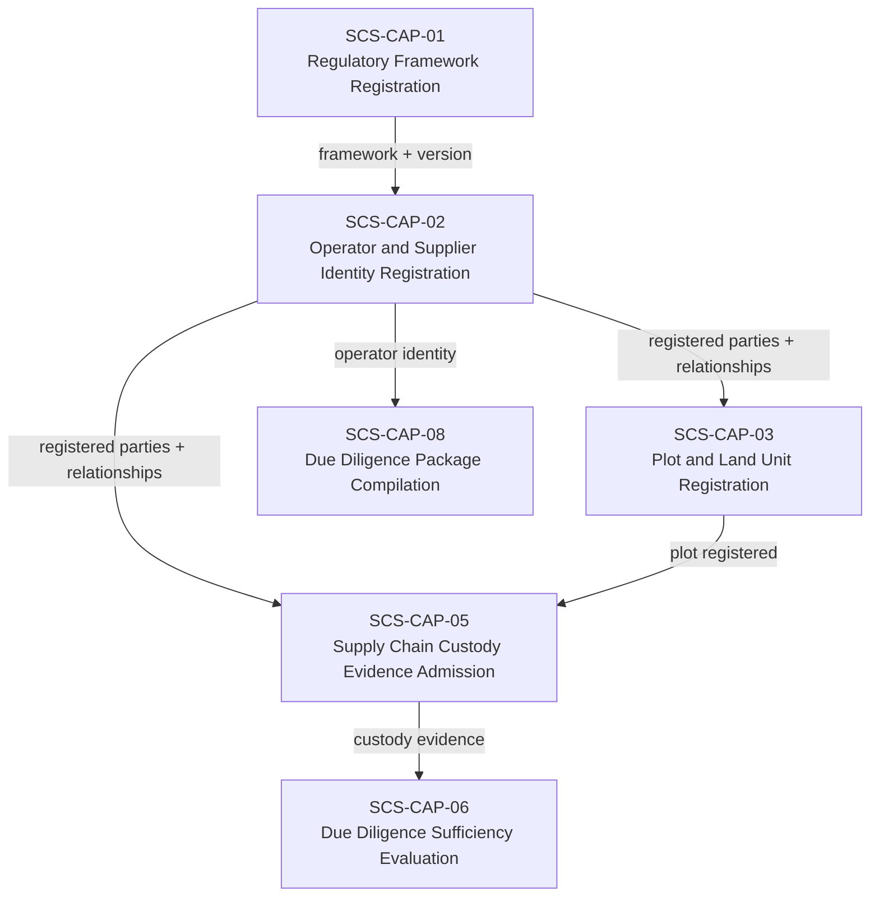
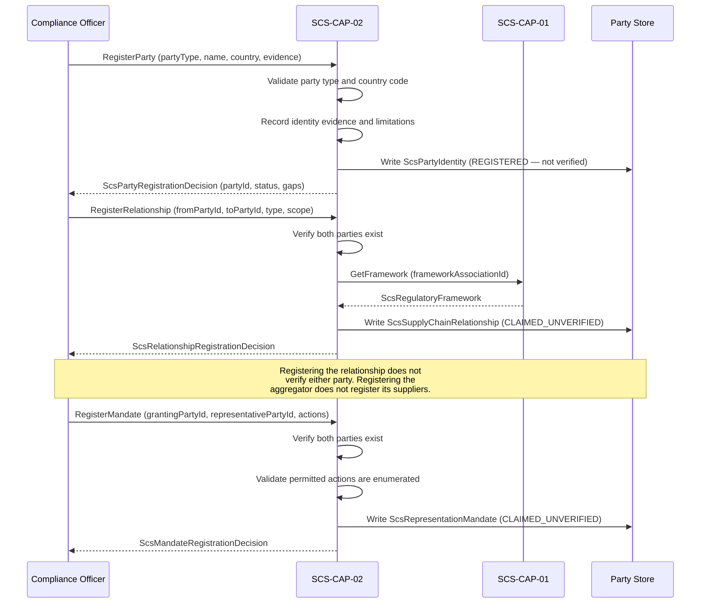

# SCS-CAP-02 — Operator and Supplier Identity Registration — Canonical Contract — 2026-09-23

**Status:** CANONICAL CONTRACT — NOT IMPLEMENTATION
**Domain:** Supply Chain Sovereignty (SCS)
**Authority:** DEFINES THE CONTRACT FOR SCS-CAP-02. Establishes no commissioning,
production, Gate D, WP05, scientific-validity or regulatory authority. This
capability is PROPOSED_NOT_ADMITTED. A pilot implementation exists; what it covers is recorded in `scs-pilot/packages/api/src/capabilities/cap-02/README.md`.

## Amendment of 2026-09-27: links, mandate verification and representative submission

This contract adopts AAB-PLATFORM-04 (Actor–Subject Link) and AAB-PLATFORM-03 (ActorReference) section 3 (mandate-based submission). Three additions:
- **Actor–party links** ("Actor–party links", below). SCS-CAP-02 is the SCS domain that stores links to parties, and documents everything AAB-PLATFORM-04 requires of an adopting domain.
- **Mandate verification** ("Mandate verification", under "Verification assessment recording"). AAB-PLATFORM-03 lets an actor act under a mandate only when the mandate is `VERIFIED_FOR_DECLARED_SCOPE`, and this contract defined verification for parties only, so no mandate could ever qualify.
- **Representative submission of identity evidence** ("Representative submission"). `SUBMIT_IDENTITY_EVIDENCE` is a mandate action. It is now accepted from a `PARTY_REPRESENTATIVE` who passes every link and mandate check, closing this contract's gap on representative submission.

Nothing is implemented by this amendment. Every other rule in this contract is unchanged.

**Second amendment of 2026-09-27: request and decision types, and the party's authority representative.** Before build, this contract defines the request and decision types that the first amendment only named ("Actor–party links: requests and decisions", "Mandate verification"). It also names SCS's subject authority role, `PARTY_AUTHORITY_REPRESENTATIVE`, which AAB-PLATFORM-04 now requires ("Who may suspend a link").

**Third amendment of 2026-09-27: rules the link endpoints need.** Found while building the link endpoints. AAB-PLATFORM-04 leaves five things to the adopting domain, or does not say: who may read a link; whether a link may be recorded before its validity starts; what a superseded link must be; which failure a relation that does not fit the party's type gets; and what binds a status statement to the link it is sent to. "Link endpoints: rules this contract adds" settles each. One failure code is added, `LINK_READER_NOT_AUTHORISED`.

**Fourth amendment of 2026-09-27: mandate verification made exact.** Found while building mandate verification. Two rules could be read two ways, and representative submission relies on the second, so both are settled before it is built ("Mandate verification"):
- **Independence:** a verifier "linked to either of its parties" means any link ever held, in any state.
- **The current verification status:** the latest standing assessment decides, and a newer adverse finding is never hidden by an older positive one.

It also records that a mandate verification assessment is not a governance decision. Nothing else changes.

**Fifth amendment of 2026-09-27: representative submission made exact.** Found while building representative submission ("Representative submission"). Three rules are settled: whose `PARTY_REPRESENTATIVE` counts; an actor who holds both a direct role and `PARTY_REPRESENTATIVE`; and when a mandate is current. The second departs deliberately from the literal text of SCS-CAP-04 and SCS-CAP-05, and says why. Signing-key history is recorded as blocking the admission of any real data (AAB-PLATFORM-04, second amendment).

**Decisions recorded on 2026-09-27:**
1. **All three additions go together.** Without mandate verification, links deliver nothing usable: an unverified mandate cannot be acted under.
2. **`IS_SUBJECT` is for natural persons only, and `ACTS_FOR_SUBJECT` for organisations only.** A natural person acting for another natural person does so under a mandate, not a link.
3. **Links last at most 12 months,** a domain decision that may be revised when operational experience shows a different period is needed.
4. **Disputed parties, and parties under review, remain current.** A dispute is an unresolved question, not a determination. Treating the party as not current would stop its own people acting during the dispute, harming the party the dispute process protects.
5. **Separation of duties:** a link's creator cannot verify a mandate that the link enables, and a mandate's verifier cannot have created a link to its representative party.
6. **For identity evidence, the mandate scope check is geography only.** Identity evidence establishes who someone is, not which commodity or framework they operate under.
7. **Mandate verification proceeds on unconfirmable evidence ids, disclosed.** It is a limitation, not a blocker (`TODO(evidence-id-model)`). Holding it back until the evidence-id model is fixed would block the whole representation pathway indefinitely.

## Plain-English boundary statement

SCS-CAP-02 allows authorised parties to register the legal or natural persons
who occupy roles in a supply chain — operators, suppliers, aggregators,
processors, and exporters — along with the bilateral relationships between them
and the scoped mandates that permit one party to act on another's behalf. It
does not verify identity beyond the scope explicitly declared and evidenced. It
does not prove that a commodity batch moved between any two parties. It does not
grant regulatory eligibility, sanctions clearance, or compliance authority to
any registered party.

## The governing rule

> Every supply-chain relationship is bilateral. One-to-many aggregation is a
> derived network view. Representation authority is a separate, scoped and
> revocable record. Neither relationship nor representation constitutes identity
> verification or proof of commodity movement.

## Registration must not silently equal verification

`registrationStatus: REGISTERED` means only that SCS has created a governed
record of this party. It does not mean:

- Legal identity confirmed
- Sanctions clearance obtained
- Beneficial ownership verified
- Regulatory eligibility established
- Supply-chain role confirmed
- Relationship with any other party verified

Verification always names its scope, evidence, authority, jurisdiction, and
date. AAB must not imply that registering a supplier confirms legal ownership,
sanctions clearance, beneficial ownership, or regulatory eligibility unless
those matters were independently evidenced and explicitly recorded.

## The aggregator model — bilateral relationships only

An aggregator serving 400 smallholder suppliers has 400 independently governed
bilateral relationships. The one-to-many network is a derived view, not a
special record that obscures its members.

Each relationship connects exactly two parties:

```
supplierPartyId → aggregatorPartyId
aggregatorPartyId → processorPartyId
processorPartyId → exporterPartyId
```

Registering an aggregator does not register or verify its suppliers. An
aggregator's assertion that a farmer supplies it is a claim until supported
by evidence and independently assessed. Terminating one supplier relationship
must not affect the aggregator's other relationships.

## Seven objects — kept separate

| Record | Purpose |
|---|---|
| Party identity | Identifies the person or legal entity |
| Claimed role | Records operator, supplier, aggregator, processor or exporter role |
| Identity evidence | Records documents and sources supporting identity |
| Verification assessment | Records what was verified, by whom, and when |
| Supply-chain relationship | Connects two parties without merging their identities |
| Framework association | Records the framework and version under which the party participates |
| Actor–party link | Binds an AAB actor to a party, so the actor may act as or for it (AAB-PLATFORM-04). Grants no authority. |

These seven objects must never be silently merged. An actor–party link is not a party, a role claim or a mandate: it says only that an actor may be associated with a party. A party's identity record is
independent of any relationship record. A relationship record is independent of
any verification assessment. One party must not alter another party's canonical
identity record.

## Domain position



## Core interfaces

### Party identity record

```typescript
interface ScsPartyIdentity {
  // Canonical identity
  partyId: string;
  partyVersion: number;
  schemaVersion: string;
  registeredAt: string;
  registeredBy: ActorReference;

  // What kind of entity this is
  partyType:
    | "NATURAL_PERSON"
    | "LEGAL_ENTITY"
    | "COOPERATIVE"
    | "COMMUNITY_GROUP"
    | "GOVERNMENT_BODY"
    | "OTHER";

  // Human-readable identifier
  partyName: string;
  countryOfRegistration: string;
  countryOfOperation?: string;

  // Registration status — not verification status
  registrationStatus:
    | "REGISTERED"
    | "REQUIRES_HUMAN_REVIEW"
    | "DISPUTED"
    | "RETIRED";

  // Identity evidence — what documents support this identity
  identityEvidence: {
    evidenceIds: string[];
    evidenceLimitations: string[];
  };

  // Verification — separate from registration
  // Always scoped — never a blanket assertion
  verificationAssessments: ScsPartyVerificationAssessment[];

  // Provenance
  provenance: {
    submittedBy: ActorReference;
    submittingOrganizationId?: string;
    recordedAt: string;
  };
}
```

### Identity verification states

```typescript
type ScsIdentityVerificationStatus =
  | "REGISTERED_UNVERIFIED"
  | "PARTIALLY_VERIFIED"
  | "VERIFIED_FOR_DECLARED_SCOPE"
  | "VERIFICATION_EXPIRED"
  | "DISPUTED"
  | "FAIL_CLOSED";
```

### Party verification assessment — scoped, never blanket

```typescript
interface ScsPartyVerificationAssessment {
  assessmentId: string;
  partyId: string;
  partyVersion: number;

  verificationStatus: ScsIdentityVerificationStatus;

  // Verification is always scoped — what was verified
  verificationScope: {
    scopeDescription: string;
    jurisdictionCode: string;
    verifiedAttributes: string[];
    // Explicit exclusions — what was NOT verified
    excludedFromVerification: string[];
  };

  // Who verified and on what authority
  verifyingAuthority: {
    authorityId: string;
    authorityName: string;
    authorityBasis: string;
    jurisdictionCode: string;
  };

  verifiedAt: string;
  expiresAt?: string;
  evidenceIds: string[];
  limitations: string[];

  // Who recorded this assessment in SCS, and when (set by the system)
  recordedBy: ActorReference;
  recordedAt: string;

  // The earlier assessment of the same party that this one replaces, if any
  supersedesAssessmentId?: string;

  // Verification never implies broader authority
  authorityBoundary: {
    doesNotConfirmSanctionsClearance: true;
    doesNotConfirmBeneficialOwnership: true;
    doesNotGrantRegulatoryEligibility: true;
    doesNotImplyComplianceWithOtherFrameworks: true;
  };
}
```

### Claimed role record

```typescript
interface ScsPartyRoleClaim {
  roleClaimId: string;
  partyId: string;
  partyVersion: number;

  claimedRole:
    | "OPERATOR"
    | "SUPPLIER"
    | "AGGREGATOR"
    | "PROCESSOR"
    | "EXPORTER"
    | "IMPORTER"
    | "TRADER"
    | "OTHER";
  // Required exactly when claimedRole is OTHER
  otherRoleDescription?: string;

  frameworkAssociationId: string;
  frameworkVersion: string;
  commodityScope: string[];
  geographicScope: string[];

  roleEvidenceIds: string[];

  verificationStatus:
    | "CLAIMED_UNVERIFIED"
    | "EVIDENCE_SUBMITTED"
    | "PARTIALLY_VERIFIED"
    | "VERIFIED_FOR_DECLARED_SCOPE"
    | "DISPUTED"
    | "EXPIRED"
    | "SUPERSEDED"
    | "FAIL_CLOSED";

  validFrom?: string;
  validUntil?: string;
  limitations: string[];

  claimedAt: string;
  claimedBy: ActorReference;
}
```

### Bilateral supply-chain relationship record

```typescript
interface ScsSupplyChainRelationship {
  relationshipId: string;
  schemaVersion: string;

  // Exactly two parties — always bilateral
  fromPartyId: string;
  toPartyId: string;

  relationshipType:
    | "SUPPLIES_TO"
    | "PROCESSES_FOR"
    | "AGGREGATES_FOR"
    | "EXPORTS_FOR"
    | "CERTIFIES_FOR"
    | "OTHER";
  // Required exactly when relationshipType is OTHER
  otherRelationshipTypeDescription?: string;

  commodityScope: string[];
  geographicScope: string[];

  // Framework association — explicit and version-bound
  // Participation under one regulation does not imply
  // participation under another
  frameworkAssociationIds: string[];

  validFrom?: string;
  validUntil?: string;

  // Who claimed this relationship and when
  claimedByPartyId: string;
  claimedAt: string;

  relationshipEvidenceIds: string[];

  verificationStatus:
    | "CLAIMED_UNVERIFIED"
    | "EVIDENCE_SUBMITTED"
    | "PARTIALLY_VERIFIED"
    | "VERIFIED_FOR_DECLARED_SCOPE"
    | "DISPUTED"
    | "EXPIRED"
    | "SUPERSEDED"
    | "FAIL_CLOSED";

  verificationScope?: string;
  lifecycleStatus: "ACTIVE" | "EXPIRED" | "SUPERSEDED" | "WITHDRAWN";

  // Immutable history — superseded relationships remain on record
  supersedesRelationshipId?: string;
  supersededByRelationshipId?: string;

  representationVersion: string;
  createdAt: string;
  createdBy: ActorReference;
}
```

### Representation mandate — separate from relationship

An aggregator may collect or submit evidence on a smallholder's behalf, but
that authority requires its own governed mandate — separate from the supply
relationship, separately scoped, and revocable independently.

```typescript
interface ScsRepresentationMandate {
  mandateId: string;
  schemaVersion: string;

  // Who grants authority and to whom
  grantingPartyId: string;
  representativePartyId: string;

  // What the representative is permitted to do
  // Enumerated — not open-ended
  permittedActions: Array<
    | "SUBMIT_IDENTITY_EVIDENCE"
    | "SUBMIT_PLOT_ASSOCIATION_EVIDENCE"
    | "SUBMIT_CUSTODY_EVIDENCE"
    | "SUBMIT_DEFORESTATION_EVIDENCE"
    | "REQUEST_FRAMEWORK_ASSOCIATION"
    | "OTHER_EXPLICITLY_NAMED"
  >;

  // Present only when permittedActions includes OTHER_EXPLICITLY_NAMED.
  // Names the specific action permitted. Required if OTHER_EXPLICITLY_NAMED
  // is used; must be absent otherwise.
  otherActionDescription?: string;

  // Scope — explicit and version-bound
  frameworkAssociationIds: string[];
  commodityScope: string[];
  geographicScope: string[];

  validFrom: string;
  // Required: a mandate always expires
  validUntil: string;

  // At least one: evidence that the granting party agreed
  mandateEvidenceIds: string[];

  verificationStatus:
    | "CLAIMED_UNVERIFIED"
    | "EVIDENCE_SUBMITTED"
    | "PARTIALLY_VERIFIED"
    | "VERIFIED_FOR_DECLARED_SCOPE"
    | "DISPUTED"
    | "EXPIRED"
    | "REVOKED"
    | "FAIL_CLOSED";

  revocationStatus: "NOT_REVOKED" | "REVOKED" | "EXPIRED";
  revokedAt?: string;
  revocationReason?: string;

  createdAt: string;
  createdBy: ActorReference;

  // What this mandate does not permit
  authorityBoundary: {
    doesNotPermitApprovalOfGrantingParty: true;
    doesNotPermitAlterationOfGrantingPartyIdentity: true;
    doesNotPermitLegalDeclarationsWithoutExplicitAuthority: true;
    doesNotConcealWhichRecordsWereSubmitted: true;
    doesNotReuseAuthorityOutsideDeclaredScope: true;
    doesNotExtendToOtherFrameworksOrCommodities: true;
  };
}
```

When `OTHER_EXPLICITLY_NAMED` is included in `permittedActions`,
`otherActionDescription` must name the specific action explicitly. A mandate
that includes `OTHER_EXPLICITLY_NAMED` without a description is incomplete
and must be rejected.

## Registration and relationship sequence



## Registration decision

```typescript
interface ScsPartyRegistrationDecision {
  decisionId: string;
  partyId: string;
  decision:
    | "REGISTERED"
    | "REGISTERED_WITH_GAPS"
    | "REJECTED"
    | "REQUIRES_HUMAN_REVIEW";

  eligibilityChecks: {
    partyTypeValid: boolean;
    countryCodeValid: boolean;
    partyNameProvided: boolean;
    registrantAuthorised: boolean;
    noConflictingRegistrationDetected: boolean;
  };

  gaps: Array<{
    gapCode: string;
    gapDescription: string;
    humanReviewRequired: boolean;
  }>;

  decisionReasons: string[];
  decidedBy: ActorReference;
  decidedAt: string;
}
```

## Party registration: conflicts, outcomes and open gaps

### Conflicting registrations

**Contract gap: the conflict definition.** This contract names the
`noConflictingRegistrationDetected` eligibility check and the `CONFLICTING_REGISTRATION_DETECTED`
error, but it does not say what makes two registrations conflict. It does not say:

- which fields are compared;
- whether names are normalised (case, spacing, punctuation, transliteration between scripts);
- whether the rule depends on `partyType`.

Until the contract defines it, this rule applies:

- **Organisational parties.** For `LEGAL_ENTITY`, `COOPERATIVE`, `COMMUNITY_GROUP` and
  `GOVERNMENT_BODY`, a registration conflicts when a party of one of those four types, whose
  `registrationStatus` is anything other than `RETIRED`, has exactly the same `partyName` and
  `countryOfRegistration`.
- **Exact comparison.** The comparison does not normalise case, spacing, punctuation or
  transliteration.
- **Conflict outcome.** A conflict ends in `FAIL_CLOSED` with `CONFLICTING_REGISTRATION_DETECTED`,
  and its reasons name the existing `partyId`. A `RETIRED` party never conflicts.
- **Natural persons and `OTHER`.** For `NATURAL_PERSON` and `OTHER`, there is no automatic
  conflict check, in either direction: such a registration neither conflicts with nor blocks
  any other party. A name and a country of registration cannot establish that two registrations
  are the same person; two smallholders in one province can share a name. Deduplication of
  these parties is a human review concern.
- **Recording the unperformed check.** For `NATURAL_PERSON` and `OTHER`, the check is not
  performed, so `noConflictingRegistrationDetected` is recorded as `false`, and `decisionReasons`
  names it as not evaluated.

The conflict definition, including whether names are normalised and how natural persons are
deduplicated, must be specified here before a production implementation.

### When registration is FAIL_CLOSED, REGISTERED_WITH_GAPS, REJECTED or REQUIRES_HUMAN_REVIEW

**Contract gap: no decision criteria.** `ScsPartyRegistrationDecision` defines four outcomes:
`REGISTERED`, `REGISTERED_WITH_GAPS`, `REJECTED` and `REQUIRES_HUMAN_REVIEW`. The contract gives
no criteria for the last three. Until it does, this rule applies:

- **FAIL_CLOSED.** Any condition in the failure contract's `error` union ends in `FAIL_CLOSED`.
  Examples are `REGISTRANT_NOT_AUTHORISED`, `COUNTRY_CODE_UNRECOGNISED`,
  `CONFLICTING_REGISTRATION_DETECTED` and `DEPENDENCY_UNAVAILABLE`. Nothing is written: no party,
  no decision, no receipt.
- **Otherwise, `REGISTERED`, with an empty `gaps` list.** A registration that does not fail
  closed always returns `REGISTERED`, even when an eligibility check was not performed. The
  unperformed check is recorded as `false`, and `decisionReasons` names it. `REGISTERED` records
  that a governed identity record exists; it verifies nothing.
- **Reserved outcomes.** `REGISTERED_WITH_GAPS`, `REJECTED` and `REQUIRES_HUMAN_REVIEW` are
  reserved until their criteria are specified here. No implementation may invent those criteria.

### Country of operation

**Contract gap: `countryOfOperation` validation.** The registration sequence says CAP-02 validates
"country code", and `COUNTRY_CODE_UNRECOGNISED` is in the failure contract. The contract does not
say which code system is used. It also does not say whether `countryOfOperation` is validated,
or only `countryOfRegistration`.

Pending clarification, the implementation has made a deliberate decision:

- Both `countryOfRegistration` and `countryOfOperation` (when present) must be officially
  assigned ISO 3166-1 alpha-2 codes, in uppercase.
- User-assigned codes such as `XK` are not accepted.
- Any other value ends in `FAIL_CLOSED` with `COUNTRY_CODE_UNRECOGNISED`.
- The reason is that free text invites malformed data.

The code system, and which fields it applies to, must be confirmed here before a production
implementation.

## Identity evidence submission

### Governing principle

> Submitting identity evidence admits evidence. It does not verify identity. It
> does not change the party's `registrationStatus`, does not create a new party
> version, and does not create or change any verification assessment. What the
> evidence proves is evaluated separately, by an `ScsPartyVerificationAssessment`
> that names its scope, evidence, authority, jurisdiction and date.

Evidence can be submitted after registration. At registration, evidence travels
inside `ScsPartyRegistrationRequest.identityEvidence`. After registration, each
submission is its own record, kept separate from the party identity record as
the six-object rule requires.

### Identity evidence submission record

```typescript
interface ScsPartyIdentityEvidenceSubmission {
  submissionId: string;
  partyId: string;
  // The party version the evidence is attached to: the party's current version
  partyVersion: number;

  evidenceIds: string[];
  evidenceLimitations: string[];

  submittedBy: ActorReference;
  submittingOrganizationId?: string;
  submittedAt: string;
}
```

### Submission request

```typescript
// partyId is taken from the request path, not the body
interface ScsIdentityEvidenceSubmissionRequest {
  // One to 200 identifiers, no duplicates
  evidenceIds: string[];
  evidenceLimitations: string[];
  submittingOrganizationId?: string;

  // Present only for a representative submission
  actingUnder?: {
    representativePartyId: string;  // the party the actor is linked to
    mandateId: string;              // the mandate from the path's party to it
  };
}
```

### Submission decision

```typescript
interface ScsIdentityEvidenceSubmissionDecision {
  decisionId: string;
  submissionId: string;
  partyId: string;
  partyVersion: number;
  decision: "RECORDED";

  eligibilityChecks: {
    partyExists: boolean;
    partyNotRetired: boolean;
    submitterAuthorised: boolean;
    evidenceIdsNotAlreadyLinked: boolean;
    // Present only for a representative submission: each check of "Representative submission"
    representation?: ScsRepresentationChecks;
  };

  decisionReasons: string[];
  decidedBy: ActorReference;
  decidedAt: string;
}
```

### Submission rules

The checks run in this order. Each failure ends in `FAIL_CLOSED` and writes nothing: no
submission, no evidence link, no decision, no receipt.

1. **Authority.** A `COMPLIANCE_OFFICER` may submit identity evidence directly. A
   `PARTY_REPRESENTATIVE` may submit it for the path's party only under a mandate, passing
   every check in "Representative submission" first. Otherwise `REGISTRANT_NOT_AUTHORISED`
   (403), or the representative-submission failure that applies.
2. **Party exists.** The `partyId` must identify a registered party. Otherwise
   `PARTY_NOT_FOUND` (404).
3. **Party not retired.** A `RETIRED` party accepts no new evidence: `PARTY_RETIRED` (422).
   Parties that are `REGISTERED`, `REQUIRES_HUMAN_REVIEW` or `DISPUTED` accept evidence,
   because evidence may help resolve a review or a dispute.
4. **No duplicate links.** No submitted `evidenceId` may already be linked to the party's
   current version, whether at registration or by an earlier submission. Otherwise
   `EVIDENCE_ALREADY_LINKED` (409), whose reasons name every duplicate id. Duplicates are
   never skipped silently.

When every check passes, the decision is `RECORDED`. The submission is recorded, each
evidence id is linked to the party's current version, and the decision's receipt, with
decision type `IDENTITY_EVIDENCE_SUBMISSION`, is written in the same transaction. The
party identity record is not changed.

### Open gaps

**Representative submission: specified by the amendment of 2026-09-27.** This contract
previously did not say how a mandate authorises a submission, so only a
`COMPLIANCE_OFFICER` could submit. "Representative submission" now specifies it.

**Contract gap: party versions.** This contract gives parties a `partyVersion` but does
not say what creates a new version. Until it does, evidence attaches to the party's
current version, and submitting evidence never creates one.

**Contract gap: evidence in the party record.** `ScsPartyIdentity.identityEvidence`
holds the evidence given at registration. This contract does not say whether reading a
party (`getParty`) also returns evidence submitted later. That must be specified before
`getParty` is implemented.

**Contract gap: the evidence id model.** The evidence identifiers in this contract are
uuids, and predate the SCS evidence object store (AAB-PLATFORM-01), which identifies files
by their SHA-256 digest. They are not linked to the store and cannot be confirmed against
it. Aligning them, so that evidence cites stored objects as SCS-CAP-04 and SCS-CAP-05 do,
requires a contract change and a migration. Until then, identifiers are recorded as
submitted, and every decision's `decisionReasons` states that the cited evidence ids are
not linked to the SCS evidence object store and cannot be confirmed against it.

## Role claims, relationships and mandates: registration rules

These rules apply to `addRoleClaim`, `registerRelationship` and `registerMandate`. Each
registration is FAIL_CLOSED on any failure and writes nothing: no record, no decision, no
receipt. When every check passes, the record is written and its decision and receipt are
written in the same transaction.

### Framework associations

A framework association is a reference to a regulatory framework registered by SCS-CAP-01.
Its identifier is that framework's `frameworkId`. Every `frameworkAssociationId` and every
element of `frameworkAssociationIds` names a CAP-01 framework.

- **The framework must exist.** Otherwise `FRAMEWORK_ASSOCIATION_NOT_FOUND`.
- **The framework must be `ACTIVE`.** A `SUPERSEDED` or `WITHDRAWN` framework cannot be the
  basis for a new supply-chain registration: `FRAMEWORK_NOT_ACTIVE`.
- **At least one framework.** `frameworkAssociationIds` on a relationship or a mandate must
  not be empty. A role claim always names exactly one framework.
- **Framework version.** `frameworkVersion` on a role claim is set by the system to the
  referenced framework's `regulation.regulationVersion`, until SCS-CAP-01 defines internal
  framework versioning.

### Scope within the framework

`commodityScope` and `geographicScope` must not be empty. The referenced frameworks set the
boundary; a registration cannot declare scope that its frameworks do not cover. This enforces
the mandate boundary `doesNotReuseAuthorityOutsideDeclaredScope` and applies equally to role
claims and relationships.

- **Commodity.** Each `commodityScope` value must equal the `scope.commodityCode` of a
  referenced framework.
- **Geography.** Each `geographicScope` value must equal the `scope.countryOfOrigin` of a
  referenced framework.
- Any other value is refused with `SCOPE_OUTSIDE_FRAMEWORK`, naming each value outside scope.

**Contract gap: scope across several frameworks.** With several frameworks, each value is
checked on its own. A relationship referencing a Thai rubber framework and a Vietnamese coffee
framework may therefore declare rubber from Vietnam. Pairing commodity and country per
framework needs a scope structure this contract does not have.

### Fields the system sets

The request carries only what the submitter declares. The system sets: the record's
identifier (`roleClaimId`, `relationshipId`, `mandateId`); `claimedAt` and `claimedBy`, or
`createdAt` and `createdBy` (the authenticated actor and the transaction time);
`schemaVersion`; `partyVersion` (the party's current version); the role claim's
`frameworkVersion`; and the starting statuses below. A mandate's `authorityBoundary` flags
are always `true`.

### Starting status

- A role claim, a relationship and a mandate all start as `CLAIMED_UNVERIFIED`.
- A relationship starts with `lifecycleStatus: ACTIVE`; a mandate with
  `revocationStatus: NOT_REVOKED`.
- Submitting evidence identifiers does not change the status. Status changes only through a
  separate verification assessment.

### Common rules

- **Authority.** Only a `COMPLIANCE_OFFICER` may register a role claim, a relationship or a
  mandate. Otherwise `REGISTRANT_NOT_AUTHORISED`.
- **Retired parties.** A `RETIRED` party cannot take part in a new registration:
  `PARTY_RETIRED`. This applies to the party of a role claim, both parties of a relationship,
  and both parties of a mandate.
- **Validity period.** When both are given, the end (`validUntil`) must be after the start
  (`validFrom`). Otherwise `VALIDITY_PERIOD_INVALID`.
- **`OTHER` needs a description.** A role claim with `claimedRole: OTHER` must carry
  `otherRoleDescription`; a relationship with `relationshipType: OTHER` must carry
  `otherRelationshipTypeDescription`; a mandate with `OTHER_EXPLICITLY_NAMED` must carry
  `otherActionDescription`. Otherwise `OTHER_TYPE_REQUIRES_DESCRIPTION`. A description given
  without `OTHER` is a request error and is refused, not ignored.
- **Conflicting records.** A registration that duplicates or overlaps an existing record is
  refused with `CONFLICTING_RECORD`, naming the existing record. The conflict rule for each
  record is given in its section below. Validity periods overlap unless one ends before the
  other begins; a missing `validFrom` or `validUntil` is open-ended.

### Role claim registration

```typescript
// partyId is taken from the request path
interface ScsRoleClaimRequest {
  claimedRole:
    | "OPERATOR"
    | "SUPPLIER"
    | "AGGREGATOR"
    | "PROCESSOR"
    | "EXPORTER"
    | "IMPORTER"
    | "TRADER"
    | "OTHER";
  // Required exactly when claimedRole is OTHER
  otherRoleDescription?: string;

  frameworkAssociationId: string;
  commodityScope: string[];
  geographicScope: string[];

  roleEvidenceIds: string[];
  validFrom?: string;
  validUntil?: string;
  limitations: string[];
}

interface ScsRoleClaimDecision {
  decisionId: string;
  roleClaimId: string;
  partyId: string;
  partyVersion: number;
  decision: "REGISTERED";

  eligibilityChecks: {
    registrantAuthorised: boolean;
    partyExists: boolean;
    partyNotRetired: boolean;
    otherRoleDescribed: boolean;
    frameworkExists: boolean;
    frameworkActive: boolean;
    scopeWithinFramework: boolean;
    validityPeriodValid: boolean;
    noConflictingRecord: boolean;
  };

  decisionReasons: string[];
  decidedBy: ActorReference;
  decidedAt: string;
}
```

`ScsPartyRoleClaim` gains `otherRoleDescription?: string`. The path's party must exist:
`PARTY_NOT_FOUND`. **Conflict:** a role claim for the same party, the same `claimedRole` and
the same framework whose validity period overlaps the new one.

**Contract gap: which role claims can conflict.** The conflict rule above names no
`verificationStatus`. Read literally, a `SUPERSEDED` or `EXPIRED` claim would block every new
overlapping claim for the same role and framework for ever. Relationships conflict only while
`ACTIVE` and mandates only while `NOT_REVOKED`. This contract is silent on role claims, so the
implementation applies the consistent reading: a role claim whose `verificationStatus` is
`SUPERSEDED` or `EXPIRED` does not conflict. The rule must be confirmed here before a
production implementation.

### Relationship registration

```typescript
interface ScsRelationshipRegistrationRequest {
  fromPartyId: string;
  toPartyId: string;

  relationshipType:
    | "SUPPLIES_TO"
    | "PROCESSES_FOR"
    | "AGGREGATES_FOR"
    | "EXPORTS_FOR"
    | "CERTIFIES_FOR"
    | "OTHER";
  // Required exactly when relationshipType is OTHER
  otherRelationshipTypeDescription?: string;

  commodityScope: string[];
  geographicScope: string[];
  // At least one ACTIVE CAP-01 framework
  frameworkAssociationIds: string[];

  validFrom?: string;
  validUntil?: string;

  // One of the two parties: fromPartyId or toPartyId
  claimedByPartyId: string;
  relationshipEvidenceIds: string[];
}

interface ScsRelationshipRegistrationDecision {
  decisionId: string;
  relationshipId: string;
  decision: "REGISTERED";

  eligibilityChecks: {
    registrantAuthorised: boolean;
    fromPartyExists: boolean;
    toPartyExists: boolean;
    partiesNotRetired: boolean;
    notSelfReferential: boolean;
    claimingPartyIsAParty: boolean;
    otherTypeDescribed: boolean;
    frameworksExist: boolean;
    frameworksActive: boolean;
    scopeWithinFrameworks: boolean;
    validityPeriodValid: boolean;
    noConflictingRecord: boolean;
  };

  decisionReasons: string[];
  decidedBy: ActorReference;
  decidedAt: string;
}
```

`ScsSupplyChainRelationship` gains `otherRelationshipTypeDescription?: string`.

- `fromPartyId` and `toPartyId` must exist: `FROM_PARTY_NOT_FOUND`, `TO_PARTY_NOT_FOUND`.
- They must differ: `SELF_REFERENTIAL_RELATIONSHIP`.
- `claimedByPartyId` must be one of the two parties: `CLAIMING_PARTY_NOT_IN_RELATIONSHIP`.
  A bilateral relationship is claimed by a party to it, never by a third party.
- A registration creates a new relationship only. It cannot supersede another relationship;
  supersession is a separate operation.
- **Conflict:** an `ACTIVE` relationship with the same `fromPartyId`, `toPartyId` and
  `relationshipType` that shares at least one framework and whose validity period overlaps the
  new one. The same two parties in the opposite direction are a different relationship.

**Contract gap: `representationVersion`.** The relationship record requires
`representationVersion`, but this contract does not say what it versions. Until it does,
the system sets it to `"1"`.

### Mandate registration

```typescript
interface ScsMandateRegistrationRequest {
  grantingPartyId: string;
  representativePartyId: string;

  permittedActions: Array<
    | "SUBMIT_IDENTITY_EVIDENCE"
    | "SUBMIT_PLOT_ASSOCIATION_EVIDENCE"
    | "SUBMIT_CUSTODY_EVIDENCE"
    | "SUBMIT_DEFORESTATION_EVIDENCE"
    | "REQUEST_FRAMEWORK_ASSOCIATION"
    | "OTHER_EXPLICITLY_NAMED"
  >;
  // Required exactly when permittedActions includes OTHER_EXPLICITLY_NAMED
  otherActionDescription?: string;

  // At least one ACTIVE CAP-01 framework
  frameworkAssociationIds: string[];
  commodityScope: string[];
  geographicScope: string[];

  validFrom: string;
  // Required: a mandate always expires
  validUntil: string;

  // At least one: evidence that the granting party agreed
  mandateEvidenceIds: string[];
}

interface ScsMandateRegistrationDecision {
  decisionId: string;
  mandateId: string;
  decision: "REGISTERED";

  eligibilityChecks: {
    registrantAuthorised: boolean;
    grantingPartyExists: boolean;
    representativePartyExists: boolean;
    partiesNotRetired: boolean;
    notSelfGranted: boolean;
    activeRelationshipExists: boolean;
    otherActionDescribed: boolean;
    frameworksExist: boolean;
    frameworksActive: boolean;
    scopeWithinFrameworks: boolean;
    validityPeriodValid: boolean;
    consentEvidenceProvided: boolean;
    noConflictingRecord: boolean;
  };

  decisionReasons: string[];
  decidedBy: ActorReference;
  decidedAt: string;
}
```

- **Expiry is required.** `ScsRepresentationMandate.validUntil` is required. A mandate
  without an expiry would be a permanent grant of authority, which the authority boundary
  prohibits.
- **Consent evidence is required.** `mandateEvidenceIds` must contain at least one
  identifier: evidence that the granting party agreed. Representation authority is always
  separately evidenced. A request without it is refused.
- **Both parties must exist**: `GRANTING_PARTY_NOT_FOUND`, `REPRESENTATIVE_PARTY_NOT_FOUND`.
  They must differ: `SELF_GRANTED_MANDATE`.
- **Every permitted action must be enumerated**: `MANDATE_ACTION_NOT_ENUMERATED`.
- **A relationship must exist first.** An `ACTIVE` relationship between the granting and
  representative parties, in either direction, must already be registered. It must not be
  past its `validUntil`, and it must reference every framework the mandate references.
  Otherwise `RELATIONSHIP_NOT_FOUND`. A mandate grants submission authority within a
  governed supply-chain relationship; without one it has no governed context.
- **Conflict:** a mandate that is `NOT_REVOKED`, with the same granting and representative
  parties, that shares at least one framework and at least one permitted action, and whose
  validity period overlaps the new one.

**Contract gap: a mandate that outlasts its relationship.** The prerequisite relationship
must exist and be `ACTIVE` when the mandate is registered; a relationship whose validity has
not yet started qualifies. This contract does not require the mandate's validity period to
fall within the relationship's. A mandate that outlasts its governing relationship keeps
representation authority after the supply-chain context that justified it has ended. That is
a real governance problem, but the rule is not specified here, so it is not enforced. It must
be specified before a production implementation.

## Actor–party links

**SCS-CAP-02 adopts AAB-PLATFORM-04 (Actor–Subject Link) for CAP-02 parties.** Everything in AAB-PLATFORM-04 applies unchanged: the write-once link record, its four derived states, signed creation and status records, the creation rules and the use checks. This section documents what AAB-PLATFORM-04's "Adopting this contract" requires of SCS.

### Subject type

- **One subject type:** `domain: "SCS"`, `subjectType: "PARTY"`. The `subjectId` is a CAP-02 `partyId`.
- **Relations by party type:**
  - `IS_SUBJECT` links only to a `NATURAL_PERSON` party: the person acting as themselves, for example a smallholder submitting their own evidence.
  - `ACTS_FOR_SUBJECT` links only to a party that is not a `NATURAL_PERSON`: a staff member or officer acting for a legal entity, cooperative, community group or government body.
  - Anyone acting for a natural person does so as a separate party, under a mandate from that person. It is never done through a link.

### Creating role

- **`LINK_OFFICER`** creates actor–party links and writes their status records. It is a dedicated role, held in the creator's `authorityBasis` in a scope that covers the party.
- **Separation of duties:**
  - A `LINK_OFFICER` never creates a link for themselves (AAB-PLATFORM-04, `LINK_SELF_ASSERTED`).
  - The actor who created a link to a party may not record a verification assessment of any mandate whose representative party is that party.
  - The actor who verified a mandate may not create a link to its representative party.

  Otherwise `LINK_CREATOR_NOT_AUTHORISED`, or `VERIFIER_NOT_AUTHORISED`.

### Maximum link period

**A link to a CAP-02 party is valid for at most 12 months,** from `validFrom` to `validUntil`. A longer period is `LINK_VALIDITY_INVALID`. A link that is still needed is superseded by a new link, with fresh evidence, before it expires.

Twelve months is a domain decision: in a regulated supply chain, relationships and authorisations should be reviewed at least annually. It may be revised by amendment when operational experience shows that a different period is needed.

### Evidence, in addition to AAB-PLATFORM-04

AAB-PLATFORM-04 requires at least one stored object showing that the subject authorised the relationship. SCS adds:
- **For `ACTS_FOR_SUBJECT`:** the stored authorisation is issued by the party (for example a letter of authority), and names the actor and the party.
- **For `IS_SUBJECT`:** the stored evidence shows that the actor is the natural person the party records, for example an identity document matching the party's name.

Link evidence is always an AAB-PLATFORM-01 stored object, cited by SHA-256. It is never a CAP-02 evidence id, because those ids are not linked to the object store (`TODO(evidence-id-model)`).

### Subject resolver

SCS implements AAB-PLATFORM-04's `SubjectResolver` for `subjectType: "PARTY"`, answering from the party's current record:

| Party | Resolver answer |
|---|---|
| No party with this `partyId` | `NOT_FOUND` |
| `registrationStatus: RETIRED` | `NOT_CURRENT` |
| `registrationStatus: REGISTERED`, `REQUIRES_HUMAN_REVIEW` or `DISPUTED` | `CURRENT` |

These are the parties that accept identity evidence (submission rule 3). A party under review or in dispute stays current, so its own people can help resolve the review.

### Where links are stored

- Links and their status records are stored in the SCS store, in the country's tenancy, beside the CAP-02 records.
- Write-once is enforced as for every CAP-02 record. `scs_api` may SELECT and INSERT only, and a trigger refuses UPDATE, DELETE and TRUNCATE for every role.
- Each link and each status record is written with its decision receipt, in one transaction.

### Who may suspend a link

A link to a party may be suspended by the party's authorised representative (AAB-PLATFORM-04, section 4). For CAP-02 parties, that is:
- **for a `NATURAL_PERSON` party:** the person themselves, holding an `ACTIVE` `IS_SUBJECT` link to the party;
- **for any other party:** an actor holding **`PARTY_AUTHORITY_REPRESENTATIVE`**, granted with `scopeType: SUBJECT` and `scopeId: "SCS:PARTY:<partyId>"`, and an `ACTIVE` `ACTS_FOR_SUBJECT` link to the party.

A staff member holding only an `ACTS_FOR_SUBJECT` link, or only `PARTY_REPRESENTATIVE`, cannot suspend another actor's link to their organisation. `PARTY_AUTHORITY_REPRESENTATIVE` is a separate role from `PARTY_REPRESENTATIVE`. The first withdraws the party's authorisations; the second acts under a mandate.

**Pilot limitation: how the designation is recorded.** In the pilot, `PARTY_AUTHORITY_REPRESENTATIVE` grants come from the actors file, which is operator configuration, as every pilot role assignment is. They are not signed, evidenced or receipted. In a production deployment, designating a party's authority representative must itself be a signed, evidenced act with a receipt, made on evidence that the party designated that person. Until then, every suspension by a party's representative discloses that the representative's designation is recorded as operator configuration.

### Operations

`createActorPartyLink`, `recordActorPartyLinkStatus` and `getActorPartyLink`, added to the provider interface below. Their rules are AAB-PLATFORM-04's creation rules, status-record rules and use checks, with this section's additions.

### Link endpoints: rules this contract adds

Third amendment of 2026-09-27. Each adds to AAB-PLATFORM-04, as an adopting domain may, and removes nothing from it.

**Routes.**

| Operation | Route |
|---|---|
| `createActorPartyLink` | `POST /scs/v1/actor-party-links` |
| `recordActorPartyLinkStatus` | `POST /scs/v1/actor-party-links/:linkId/status-records` |
| `getActorPartyLink` | `GET /scs/v1/actor-party-links/:linkId` |

**A link is valid when it is recorded.** `validFrom` is not after the moment the link is recorded, and `validUntil` is after it. Otherwise `LINK_VALIDITY_INVALID`, as for AAB-PLATFORM-04's creation rule 5.
- AAB-PLATFORM-04's four states then describe every link. A link recorded before its validity started would be none of them.
- A `validFrom` in the past is allowed. It does not authorise any past act: a link is checked when an act relies on it.

**The relation fits the party's type** ("Subject type", above). An `IS_SUBJECT` link to a party that is not a `NATURAL_PERSON`, or an `ACTS_FOR_SUBJECT` link to a `NATURAL_PERSON`, is `LINK_RELATION_NOT_PERMITTED`.

**Supersession, when a link is created with `supersedesLinkId`:**
- The superseded link is a link for the same actor (`issuer`, `actorId`) and the same party. Otherwise `LINK_NOT_FOUND`.
- It is `ACTIVE` when its successor is recorded. Otherwise `LINK_NOT_ACTIVE`, naming its state:
  - a `SUSPENDED` link is reinstated or revoked first, so a suspension is never ended by replacing the link;
  - a `REVOKED` or `EXPIRED` link is replaced by a new link without `supersedesLinkId`.
- The successor may have a different relation. Supersession is how a link's relation, validity or evidence changes.
- The superseded link does not count against AAB-PLATFORM-04's creation rule 6 (no other `ACTIVE` link), since it is `REVOKED` from the moment its successor is recorded.

**A status statement binds the link it is sent to.** The statement's `linkId` is the link in the route, and its `writer` is the authenticated actor. Otherwise `LINK_SIGNATURE_INVALID`, as for a statement that names another `linkDigest`.

**The order of status records** is the order of their `recordedAt`. Each status record, and each successor link, is recorded while its link is locked against other writes, so the order is never ambiguous.

**Who may read a link.** A `LINK_OFFICER` or a `COMPLIANCE_OFFICER`. Anyone else is `LINK_READER_NOT_AUTHORISED`.
- The read returns the link and its status records exactly as recorded, with `currentState` and `supersededByLinkId` derived when it is read. Nothing is written.
- The read does not verify signatures or digests. The use checks (AAB-PLATFORM-04, section 3) verify them whenever a link is relied on, and the integrity tool verifies every stored link.

### Actor–party links: requests and decisions

```typescript
// POST: create a link. The creator signs linkStatement outside the server first
interface ScsActorPartyLinkRequest {
  // AAB-PLATFORM-04 ActorSubjectLinkStatement, with subject.domain "SCS"
  // and subject.subjectType "PARTY"
  linkStatement: ActorSubjectLinkStatement;
  statementSignature: string;
}

interface ScsActorPartyLinkDecision {
  decisionId: string;
  linkId: string;
  partyId: string;
  decision: "CREATED";

  eligibilityChecks: {
    creatorAuthorised: boolean;             // LINK_OFFICER, in scope
    notSelfAsserted: boolean;
    partyCurrent: boolean;                  // the subject resolver answered CURRENT
    relationFitsPartyType: boolean;         // IS_SUBJECT for NATURAL_PERSON only
    evidenceStored: boolean;                // every evidence object is in AAB-PLATFORM-01
    validityWithinMaximum: boolean;         // at most 12 months
    noOverlappingActiveLink: boolean;
    creatorIndependentOfMandateVerification: boolean;
    statementSignatureVerified: boolean;
  };

  linkDigest: string;
  decisionReasons: string[];
  decidedBy: ActorReference;
  decidedAt: string;
}

// POST: write a status record against a link. The writer signs statusStatement first
interface ScsActorPartyLinkStatusRequest {
  // AAB-PLATFORM-04 ActorSubjectLinkStatusStatement
  statusStatement: ActorSubjectLinkStatusStatement;
  statementSignature: string;
}

interface ScsActorPartyLinkStatusDecision {
  decisionId: string;
  statusRecordId: string;
  linkId: string;
  action: "SUSPEND" | "REINSTATE" | "REVOKE";
  decision: "RECORDED";
  writerCapacity: "CREATING_ROLE" | "SUBJECT_AUTHORITY";

  eligibilityChecks: {
    linkExists: boolean;
    writerPermittedForAction: boolean;
    actionPossibleFromCurrentState: boolean;
    statementBindsCurrentLink: boolean;
    statementSignatureVerified: boolean;
  };

  // The link's state after this record
  resultingState: "ACTIVE" | "SUSPENDED" | "REVOKED" | "EXPIRED";
  recordDigest: string;
  decisionReasons: string[];
  decidedBy: ActorReference;
  decidedAt: string;
}

// GET: the link as recorded, with its state derived at read time
interface ScsActorPartyLink {
  link: ActorSubjectLink;
  statusRecords: ActorSubjectLinkStatusRecord[];
  currentState: "ACTIVE" | "SUSPENDED" | "REVOKED" | "EXPIRED";
  supersededByLinkId?: string;
}
```

Every write returns its decision with a receipt, written in the same transaction, as every CAP-02 registration does.

## Representative submission

**A representative act passes every check below, in the act's own transaction, before the act's own rules.** This implements AAB-PLATFORM-03 section 3 for SCS. It applies to every capability whose act is a mandate action. In this contract, that is `SUBMIT_IDENTITY_EVIDENCE`; SCS-CAP-03, SCS-CAP-04 and SCS-CAP-05 adopt it by their own amendments.

The checks run in this order, and each failure ends in `FAIL_CLOSED` and writes nothing:
1. **Role.** The actor holds `PARTY_REPRESENTATIVE` granted for `actingUnder.representativePartyId` itself: `scopeType: SUBJECT`, `scopeId: "SCS:PARTY:<partyId>"` (fifth amendment of 2026-09-27). A deployment-wide grant is not enough: it would let anyone holding the role act for any party. Nor is a grant for another party. Otherwise `REPRESENTATIVE_NOT_AUTHORISED`. Pilot limitation: as for `PARTY_AUTHORITY_REPRESENTATIVE`, the grant is operator configuration, not a signed, evidenced act, and every representative act discloses this.
2. **Link.** Exactly one `ACTIVE`, validly signed `ACTS_FOR_SUBJECT` link binds the actor to `actingUnder.representativePartyId`, and that party is current. Otherwise the AAB-PLATFORM-04 use-check failure: `LINK_NOT_FOUND`, `LINK_AMBIGUOUS`, `LINK_NOT_ACTIVE`, `LINK_SIGNATURE_INVALID`, `LINK_RELATION_NOT_PERMITTED` or `LINK_SUBJECT_NOT_CURRENT`.
3. **Mandate parties.** The mandate exists (`MANDATE_NOT_FOUND`). Its `representativePartyId` is the linked party, and its `grantingPartyId` is the party the act is for. Otherwise `MANDATE_PARTIES_MISMATCH`.
4. **Mandate current.** `revocationStatus: NOT_REVOKED`, and the act falls within `validFrom` and `validUntil`. Otherwise `MANDATE_NOT_CURRENT`. The act's time is the time of the submission, and the mandate is current from `validFrom` up to, not including, `validUntil` (fifth amendment of 2026-09-27).
5. **Action.** The mandate's `permittedActions` include the act's action, for example `SUBMIT_IDENTITY_EVIDENCE`. Otherwise `MANDATE_ACTION_NOT_PERMITTED`.
6. **Scope.** The act falls within the mandate's `frameworkAssociationIds`, `commodityScope` and `geographicScope`. Otherwise `MANDATE_SCOPE_MISMATCH`. Identity evidence is not tied to a framework or commodity, so for `SUBMIT_IDENTITY_EVIDENCE` only geography applies: the granting party's `countryOfOperation`, or its `countryOfRegistration` when no country of operation is recorded, is within `geographicScope`.
7. **Relationship.** An `ACTIVE` relationship still exists between the two parties, covering every framework the mandate references. Otherwise `MANDATE_RELATIONSHIP_NOT_ACTIVE`.
8. **Verification.** The mandate's current verification status is `VERIFIED_FOR_DECLARED_SCOPE` ("Mandate verification"). Otherwise `MANDATE_NOT_VERIFIED`. Any lesser status is refused, never accepted as a limitation.

**What is recorded:**
- The submitter's `ActorReference` carries `representation`, with the link, the representative party, the mandate and the granting party.
- The decision's `eligibilityChecks.representation` records each check.
- The act is otherwise recorded exactly as a direct submission is.

```typescript
interface ScsRepresentationChecks {
  representativeRoleHeld: boolean;
  activeLinkToRepresentativeParty: boolean;
  mandatePartiesMatch: boolean;
  mandateCurrent: boolean;
  actionPermitted: boolean;
  withinMandateScope: boolean;
  relationshipActive: boolean;
  mandateVerified: boolean;
}
```

**The mandate's authority boundary still applies.** A representative never approves the granting party, alters its identity, makes legal declarations without explicit authority, or acts outside the mandate's declared scope.

**Who submits as a representative** (fifth amendment of 2026-09-27):
- **`actingUnder` makes a submission representative,** whatever other roles the actor holds. It is then checked in full, and refused on any failure.
- **Without `actingUnder`, the submission is direct,** on the capability's direct role. A `PARTY_REPRESENTATIVE` never submits directly: without `actingUnder`, it is refused as `REPRESENTATIVE_NOT_AUTHORISED`.
- **This departs from the literal text of SCS-CAP-04 and SCS-CAP-05,** "A `COMPLIANCE_OFFICER` sending `actingUnder` is refused." Read literally, it refuses an actor who holds both `COMPLIANCE_OFFICER` and `PARTY_REPRESENTATIVE` for the party, so such an actor could never act as a representative: an operational dead end for the pilot, where one person often holds both. What that text protects is kept: an actor without `PARTY_REPRESENTATIVE` for the party, a compliance officer included, is refused when sending `actingUnder`. A representative act never proceeds on a direct role, and a direct act never on `PARTY_REPRESENTATIVE` (AAB-PLATFORM-03, section 3).

## Verification assessment recording

`addVerificationAssessment` records an `ScsPartyVerificationAssessment` for a party and
returns a decision with its receipt, like every other registration.

### Separation of duties

Only an actor holding the `VERIFICATION_OFFICER` role may record a verification assessment.
A `COMPLIANCE_OFFICER` who registered the party cannot also verify it. An actor who registered
the party (its `registeredBy`) may not record an assessment for that party, even if they also
hold `VERIFICATION_OFFICER`. Either failure is `VERIFIER_NOT_AUTHORISED`.

### Provenance

`ScsPartyVerificationAssessment` records who verified (`verifyingAuthority`) but not who
recorded the assessment in SCS. Every other CAP-02 record names the actor who created it.
The assessment gains:

```typescript
// Added to ScsPartyVerificationAssessment
recordedBy: ActorReference;
recordedAt: string;
```

Both are set by the system: the authenticated actor and the transaction time.

### Verification request and decision

```typescript
// partyId is taken from the request path
interface ScsVerificationAssessmentRequest {
  verificationStatus: ScsIdentityVerificationStatus;

  verificationScope: {
    scopeDescription: string;
    jurisdictionCode: string;
    verifiedAttributes: string[];
    excludedFromVerification: string[];
  };

  verifyingAuthority: {
    authorityId: string;
    authorityName: string;
    authorityBasis: string;
    jurisdictionCode: string;
  };

  verifiedAt: string;
  expiresAt?: string;
  // At least one, each already linked to the party's current version
  evidenceIds: string[];
  limitations: string[];

  // The earlier assessment of the same party that this one replaces, if any
  supersedesAssessmentId?: string;
}

interface ScsVerificationAssessmentDecision {
  decisionId: string;
  assessmentId: string;
  partyId: string;
  partyVersion: number;
  decision: "RECORDED";

  eligibilityChecks: {
    verifierAuthorised: boolean;
    statusRecordable: boolean;
    datesValid: boolean;
    jurisdictionsRecognised: boolean;
    partyExists: boolean;
    partyNotRetired: boolean;
    verifierIndependentOfRegistrant: boolean;
    evidenceLinkedToParty: boolean;
    supersessionValid: boolean;
  };

  decisionReasons: string[];
  decidedBy: ActorReference;
  decidedAt: string;
}
```

The system sets `assessmentId`, `partyId` (from the path), `partyVersion` (the party's
current version), `recordedBy`, `recordedAt` and the `authorityBoundary` flags, which are
always `true`.

### Assessment is not registration

An assessment never changes the party's `registrationStatus`. Registration and verification
are separate governed records: a `DISPUTED` assessment does not make the party `DISPUTED`. Any
future operation that changes `registrationStatus` has its own authority and its own rules.
Recording an assessment also never changes an earlier assessment; supersession is recorded on
the new assessment, which names the one it replaces.

### Recordable statuses

An assessment may record only `PARTIALLY_VERIFIED`, `VERIFIED_FOR_DECLARED_SCOPE`, `DISPUTED`
or `FAIL_CLOSED`. `FAIL_CLOSED` records that verification was attempted and the identity could
not be verified for the declared scope. The other two values are never recorded; they are
derived when read:

- `REGISTERED_UNVERIFIED` is a party with no assessment that is neither superseded nor expired.
- `VERIFICATION_EXPIRED` is an assessment whose `expiresAt` has passed.

Any other value is refused: `VERIFICATION_STATUS_NOT_RECORDABLE`.

### Current verification status

A party's current verification status is not stored; a stored status would drift from reality
as assessments expire. It is derived when read. An assessment that a later assessment
supersedes no longer counts. An assessment whose `expiresAt` has passed counts as
`VERIFICATION_EXPIRED`. Assessments are scoped, so a party can hold several current
assessments at once, for different scopes or jurisdictions.

### Recording rules

The checks run in this order. Each failure ends in `FAIL_CLOSED` and writes nothing: no
assessment, no decision, no receipt.

1. **Authority.** The actor holds `VERIFICATION_OFFICER`. Otherwise `VERIFIER_NOT_AUTHORISED`.
2. **Recordable status.** Otherwise `VERIFICATION_STATUS_NOT_RECORDABLE`.
3. **Dates.** `verifiedAt` is not in the future. `expiresAt`, when given, is after
   `verifiedAt`; the same instant is a zero-length verification window and is refused.
   Otherwise `VALIDITY_PERIOD_INVALID`. An assessment that has already expired may be recorded
   as a historical fact, and `verifiedAt` may be earlier than the party's registration.
4. **Jurisdictions.** Both `jurisdictionCode` fields are officially assigned ISO 3166-1
   alpha-2 codes. Otherwise `COUNTRY_CODE_UNRECOGNISED`.
5. **Party.** The path's party exists (`PARTY_NOT_FOUND`) and is not `RETIRED`
   (`PARTY_RETIRED`).
6. **Independence.** The actor is not the party's registrant (its `registeredBy`). Otherwise
   `VERIFIER_NOT_AUTHORISED`.
7. **Evidence.** At least one evidence identifier, and every cited identifier is already
   linked to the party's current version, at registration or by an identity evidence
   submission. Otherwise `VERIFICATION_EVIDENCE_NOT_LINKED`, naming every unlinked identifier.
   Verification always names its evidence.
8. **Supersession.** When `supersedesAssessmentId` is given, it names an assessment of the same
   party (`SUPERSEDED_ASSESSMENT_NOT_FOUND`) that no other assessment has already superseded
   (`CONFLICTING_RECORD`, naming the assessment that did).

When every check passes, the decision is `RECORDED` and the assessment and its receipt are
written in the same transaction. The decision states that the verifying authority is recorded
as declared and that the cited evidence identifiers cannot be confirmed while the evidence
store is not built.

### Mandate verification

**A mandate's verification status changes only through a mandate verification assessment,** recorded by `addMandateVerificationAssessment`. It follows the party assessment's model, with these differences.

```typescript
interface ScsMandateVerificationAssessment {
  assessmentId: string;
  mandateId: string;

  verificationStatus: ScsIdentityVerificationStatus;

  // What was verified about the mandate
  verificationScope: {
    scopeDescription: string;
    // For example: grantingPartyConsent, permittedActions, frameworkScope,
    // commodityScope, geographicScope, validityPeriod
    verifiedAttributes: string[];
    excludedFromVerification: string[];
  };

  verifyingAuthority: {
    authorityId: string;
    authorityName: string;
    authorityBasis: string;
    jurisdictionCode: string;
  };

  verifiedAt: string;
  expiresAt?: string;
  // At least one, each among the mandate's mandateEvidenceIds
  evidenceIds: string[];
  limitations: string[];

  recordedBy: ActorReference;
  recordedAt: string;
  supersedesAssessmentId?: string;

  authorityBoundary: {
    doesNotExtendTheMandatesScope: true;
    doesNotVerifyEitherPartysIdentity: true;
    doesNotGrantRegulatoryEligibility: true;
  };
}
```

**Request and decision:**

```typescript
// mandateId is taken from the request path
interface ScsMandateVerificationAssessmentRequest {
  verificationStatus: ScsIdentityVerificationStatus;
  verificationScope: ScsMandateVerificationAssessment["verificationScope"];
  verifyingAuthority: ScsMandateVerificationAssessment["verifyingAuthority"];
  verifiedAt: string;
  expiresAt?: string;
  // At least one, each among the mandate's mandateEvidenceIds
  evidenceIds: string[];
  limitations: string[];
  supersedesAssessmentId?: string;
}

interface ScsMandateVerificationAssessmentDecision {
  decisionId: string;
  assessmentId: string;
  mandateId: string;
  decision: "RECORDED";

  eligibilityChecks: {
    verifierAuthorised: boolean;
    statusRecordable: boolean;
    datesValid: boolean;
    jurisdictionRecognised: boolean;
    mandateExists: boolean;
    mandateCurrent: boolean;
    verifierIndependent: boolean;           // not the registrant, not linked, did not create a link to the representative
    evidenceAmongMandateEvidence: boolean;
    supersessionValid: boolean;
  };

  // The mandate's verification status, derived after this assessment
  resultingVerificationStatus: ScsIdentityVerificationStatus;
  decisionReasons: string[];
  decidedBy: ActorReference;
  decidedAt: string;
}
```

The system sets `assessmentId`, `mandateId` (from the path), `recordedBy`, `recordedAt` and the `authorityBoundary` flags, which are always `true`.

**Recording rules**, in this order, each failing closed and writing nothing:
1. **Authority.** The actor holds `VERIFICATION_OFFICER`. Otherwise `VERIFIER_NOT_AUTHORISED`.
2. **Recordable status.** `PARTIALLY_VERIFIED`, `VERIFIED_FOR_DECLARED_SCOPE`, `DISPUTED` or `FAIL_CLOSED` only. Otherwise `VERIFICATION_STATUS_NOT_RECORDABLE`.
3. **Dates.** As for a party assessment. Otherwise `VALIDITY_PERIOD_INVALID`. An `expiresAt` later than the mandate's `validUntil` is refused, because a mandate's verification cannot outlast the mandate.
4. **Jurisdiction.** `jurisdictionCode` is an officially assigned ISO 3166-1 alpha-2 code. Otherwise `COUNTRY_CODE_UNRECOGNISED`.
5. **Mandate.** The mandate exists (`MANDATE_NOT_FOUND`), and is `NOT_REVOKED` and not past `validUntil` (`MANDATE_NOT_CURRENT`).
6. **Independence.** The actor did not register the mandate (its `createdBy`), is not linked to either of its parties, and did not create a link to its representative party ("Actor–party links"). Otherwise `VERIFIER_NOT_AUTHORISED`.
   - **"Linked" means any link the actor has ever held to either party, in any state** (fourth amendment of 2026-09-27). A link that is `REVOKED`, `EXPIRED` or `SUSPENDED` still disqualifies: it records a relationship the verifier had with a party to the mandate.
   - **"Created a link" likewise means any link, in any state,** that the actor created to the representative party.
7. **Evidence.** At least one evidence identifier, each among the mandate's `mandateEvidenceIds`. Otherwise `VERIFICATION_EVIDENCE_NOT_LINKED`.
8. **Supersession.** As for a party assessment: `SUPERSEDED_ASSESSMENT_NOT_FOUND` or `CONFLICTING_RECORD`.

**A mandate's current verification status is derived when read,** as a party's is. Made exact by the fourth amendment of 2026-09-27:
1. **Superseded assessments do not count.** An assessment that another assessment of the same mandate supersedes is set aside.
2. **None left:** `CLAIMED_UNVERIFIED`.
3. **Otherwise the latest recorded assessment decides:** its `verificationStatus`, or `VERIFICATION_EXPIRED` once its `expiresAt` has passed.
   - An older assessment never stands in for the latest one. If the latest has expired, the mandate's status is `VERIFICATION_EXPIRED`, even when an older assessment has not expired.
   - Several assessments may stand at once, for example from two independent verifiers. The latest still decides, so **a newer adverse finding (`DISPUTED`, `FAIL_CLOSED`, `PARTIALLY_VERIFIED`) is never hidden by an older positive one.** A status that could be improved by choosing which assessment counts would not be an honest status.
   - A verifier who means to replace an assessment supersedes it, which the record shows.
4. **"Latest" is never ambiguous.** Assessments of one mandate are recorded one at a time, so each has its own `recordedAt`.

**A mandate verification assessment is not a governance decision** (fourth amendment of 2026-09-27). As for a party assessment, it is not signed, and `recordedBy` is the verifier's `ActorReference` without `accountableName` (AAB-PLATFORM-03, section 4). Making it a signed governance decision would need an amendment of its own.

The stored `verificationStatus` of the mandate record keeps its starting value. It is never updated.

**When every check passes,** the decision is `RECORDED`, and the assessment and its receipt are written in the same transaction. As for a party assessment, the decision states that:
- the verifying authority is recorded as declared;
- the cited evidence identifiers cannot be confirmed against stored objects. `mandateEvidenceIds` are CAP-02 evidence ids, which predate the evidence object store (`TODO(evidence-id-model)`). A mandate is therefore verified on evidence the system discloses it cannot yet confirm. That is the same limitation, disclosed the same way, as for party and plot evidence. It does not block mandate verification.

### Open gaps

**Contract gap: the party-level summary.** How several current assessments of one party, with
different scopes and statuses, combine into one summary for `getParty` is not defined. It must
be specified before `getParty` is implemented.

**Contract gap: an assessment with no verified attributes.** `verificationScope.verifiedAttributes`
may be empty: this contract does not require an assessment to name at least one attribute it
verified. An assessment recording `VERIFIED_FOR_DECLARED_SCOPE` or `PARTIALLY_VERIFIED` with no
verified attributes says little about what was verified. Whether at least one attribute is
required, and for which statuses, must be specified before a production implementation.

**Contract gap: sub-national jurisdictions.** `jurisdictionCode` accepts ISO 3166-1 alpha-2
country codes only. Province-level jurisdictions (ISO 3166-2, for example `TH-10`) are not yet
accepted.

**Contract gap: independence from evidence submitters.** The verifier must not be the party's
registrant. Whether the verifier must also be independent of the actors who submitted the
cited evidence is not decided. It needs the submission history of each cited identifier and a
defined submitting role, and is a future contract decision.

**Contract gap: verification of role claims and relationships.** Their `verificationStatus`
changes only through a verification assessment, but this contract defines verification
assessments for parties and, since the amendment of 2026-09-27, mandates only.

**Open item: designating a party's authority representative.** In production, designating a `PARTY_AUTHORITY_REPRESENTATIVE` must be a signed, evidenced act with a receipt. It is not defined yet; the pilot records the designation as operator configuration, disclosed ("Who may suspend a link"). The same holds for `PARTY_REPRESENTATIVE` grants for a party ("Representative submission", check 1).

**BLOCKING before any real data is admitted: signing-key history** (AAB-PLATFORM-04, second amendment of 2026-09-27). A signature is verified against the signer's currently registered key. Rotating a key therefore makes every record signed with the earlier key fail verification: every link and status record the signer ever made becomes unusable at once, and every act that relies on one is refused. A governed record must not stop being valid because its signer's key changed. Before any real data is admitted, each actor's signing keys must be kept with the period each was valid, and a record verified against the key that was valid when it was signed. Until then, a key is never rotated while records it signed are in use; the SCS pilot keeps one key per actor, in its actors file.

**Current system limit: no registry of verifying authorities.** `verifyingAuthority` is
recorded as declared; it cannot be checked against a registry, and the decision must say so.

## Provider-neutral interface

```typescript
interface ScsPartyIdentityProvider {
  registerParty(
    request: ScsPartyRegistrationRequest
  ): Promise<ScsPartyRegistrationDecision>;

  getParty(
    partyId: string,
    version?: number
  ): Promise<ScsPartyIdentity>;

  submitIdentityEvidence(
    partyId: string,
    request: ScsIdentityEvidenceSubmissionRequest
  ): Promise<ScsIdentityEvidenceSubmissionDecision>;

  addVerificationAssessment(
    partyId: string,
    request: ScsVerificationAssessmentRequest
  ): Promise<ScsVerificationAssessmentDecision>;

  addRoleClaim(
    partyId: string,
    request: ScsRoleClaimRequest
  ): Promise<ScsRoleClaimDecision>;

  registerRelationship(
    request: ScsRelationshipRegistrationRequest
  ): Promise<ScsRelationshipRegistrationDecision>;

  getRelationship(
    relationshipId: string
  ): Promise<ScsSupplyChainRelationship>;

  listRelationshipsForParty(
    partyId: string,
    direction?: "FROM" | "TO" | "BOTH"
  ): Promise<ScsSupplyChainRelationship[]>;

  registerMandate(
    request: ScsMandateRegistrationRequest
  ): Promise<ScsMandateRegistrationDecision>;

  revokeMandate(
    mandateId: string,
    reason: string,
    revokedBy: ActorReference
  ): Promise<ScsRepresentationMandate>;

  listMandatesForParty(
    partyId: string,
    role?: "GRANTING" | "REPRESENTATIVE"
  ): Promise<ScsRepresentationMandate[]>;

  listParties(
    request: ScsListPartiesRequest
  ): Promise<ScsListPartiesResult>;

  // Amendment of 2026-09-27
  addMandateVerificationAssessment(
    mandateId: string,
    request: ScsMandateVerificationAssessmentRequest
  ): Promise<ScsMandateVerificationAssessmentDecision>;

  createActorPartyLink(
    request: ScsActorPartyLinkRequest
  ): Promise<ScsActorPartyLinkDecision>;

  recordActorPartyLinkStatus(
    linkId: string,
    request: ScsActorPartyLinkStatusRequest
  ): Promise<ScsActorPartyLinkStatusDecision>;

  getActorPartyLink(
    linkId: string
  ): Promise<ScsActorPartyLink>;
}
```

## Failure contract

```typescript
interface ScsPartyRegistrationFailure {
  ok: false;
  capabilityId: "SCS-CAP-02";
  result: "FAIL_CLOSED";

  error:
    | "REGISTRANT_NOT_AUTHORISED"
    | "PARTY_TYPE_INVALID"
    | "COUNTRY_CODE_UNRECOGNISED"
    | "PARTY_NAME_MISSING"
    | "CONFLICTING_REGISTRATION_DETECTED"
    | "PARTY_NOT_FOUND"
    | "PARTY_RETIRED"
    | "EVIDENCE_ALREADY_LINKED"
    | "FRAMEWORK_ASSOCIATION_NOT_FOUND"
    | "FROM_PARTY_NOT_FOUND"
    | "TO_PARTY_NOT_FOUND"
    | "SELF_REFERENTIAL_RELATIONSHIP"
    | "MANDATE_ACTION_NOT_ENUMERATED"
    | "GRANTING_PARTY_NOT_FOUND"
    | "REPRESENTATIVE_PARTY_NOT_FOUND"
    | "FRAMEWORK_NOT_ACTIVE"
    | "SCOPE_OUTSIDE_FRAMEWORK"
    | "VALIDITY_PERIOD_INVALID"
    | "OTHER_TYPE_REQUIRES_DESCRIPTION"
    | "CONFLICTING_RECORD"
    | "CLAIMING_PARTY_NOT_IN_RELATIONSHIP"
    | "SELF_GRANTED_MANDATE"
    | "RELATIONSHIP_NOT_FOUND"
    | "VERIFIER_NOT_AUTHORISED"
    | "VERIFICATION_STATUS_NOT_RECORDABLE"
    | "VERIFICATION_EVIDENCE_NOT_LINKED"
    | "SUPERSEDED_ASSESSMENT_NOT_FOUND"
    // Amendment of 2026-09-27: links (AAB-PLATFORM-04)
    | "LINK_CREATOR_NOT_AUTHORISED"
    | "LINK_SELF_ASSERTED"
    | "LINK_SUBJECT_NOT_FOUND"
    | "LINK_SUBJECT_NOT_CURRENT"
    | "LINK_EVIDENCE_MISSING"
    | "LINK_VALIDITY_INVALID"
    | "LINK_ALREADY_ACTIVE"
    | "LINK_SIGNATURE_INVALID"
    | "LINK_NOT_FOUND"
    | "LINK_AMBIGUOUS"
    | "LINK_NOT_ACTIVE"
    | "LINK_RELATION_NOT_PERMITTED"
    | "LINK_STATUS_NOT_PERMITTED"
    | "LINK_STATUS_WRITER_NOT_AUTHORISED"
    | "LINK_READER_NOT_AUTHORISED"          // third amendment of 2026-09-27
    // Amendment of 2026-09-27: representative submission and mandate verification
    | "REPRESENTATIVE_NOT_AUTHORISED"
    | "MANDATE_NOT_FOUND"
    | "MANDATE_PARTIES_MISMATCH"
    | "MANDATE_NOT_CURRENT"
    | "MANDATE_ACTION_NOT_PERMITTED"
    | "MANDATE_SCOPE_MISMATCH"
    | "MANDATE_RELATIONSHIP_NOT_ACTIVE"
    | "MANDATE_NOT_VERIFIED"
    | "DEPENDENCY_UNAVAILABLE";

  reasons: string[];
  noWrites: true;
  noPartyRegistered: true;
}
```

## Southeast Asia operational context

In Thailand and Vietnam, the majority of commodity production — rubber, palm oil,
coffee — comes from smallholder farmers who may have:

- No formal legal entity registration
- Traditional or customary land rights rather than registered title
- Limited documentation of their supply relationships
- GPS coordinates but no formal cadastral records

SCS-CAP-02 handles this through honest gap disclosure rather than exclusion:

- A smallholder with no formal legal registration is admitted as
  `partyType: NATURAL_PERSON` with `registrationStatus: REGISTERED` and
  `verificationStatus: REGISTERED_UNVERIFIED`
- The gap is disclosed — not papered over
- SCS-CAP-06's sufficiency evaluation determines the consequence of that gap
  for a specific framework's requirements
- The aggregator who collects on their behalf has a separately governed mandate
  with explicit permitted actions and explicit expiry

A Thai rubber cooperative managing 400 smallholder members registers 400
bilateral relationships and 400 representation mandates. Each smallholder's
identity, plot registration, and evidence remain individually governed. The
cooperative's submission authority is explicit, scoped, and revocable per
smallholder. The cooperative's staff member who submits holds an actor–party link to the
cooperative, and acts under each smallholder's verified mandate. A smallholder who submits
their own evidence holds an `IS_SUBJECT` link to their own party record. No smallholder's record is obscured by the cooperative's
registration.

## What this document does not establish

- It does not admit SCS-CAP-02 as a canonical capability — that requires
  the ten-point admission checklist
- It does not implement, deploy or migrate anything
- It does not verify the legal identity, sanctions status, beneficial ownership,
  or regulatory eligibility of any registered party
- `REGISTERED` means a governed record exists — nothing more
- Registering an aggregator does not register its suppliers
- Registering a relationship does not verify either party
- A representation mandate does not grant the representative authority to
  approve, alter, or make legal declarations on behalf of the granting party
  beyond its explicitly enumerated permitted actions
- An actor–party link does not make the actor a party, verify either of them, or grant any
  authority. What the actor may do is decided by their role and, for representation, a
  verified mandate.
- Verifying a mandate verifies the mandate only. It does not verify either party's identity.
- It does not alter commissioning status, satisfy Gate D, close WP05, or
  grant any production or commissioning authority
