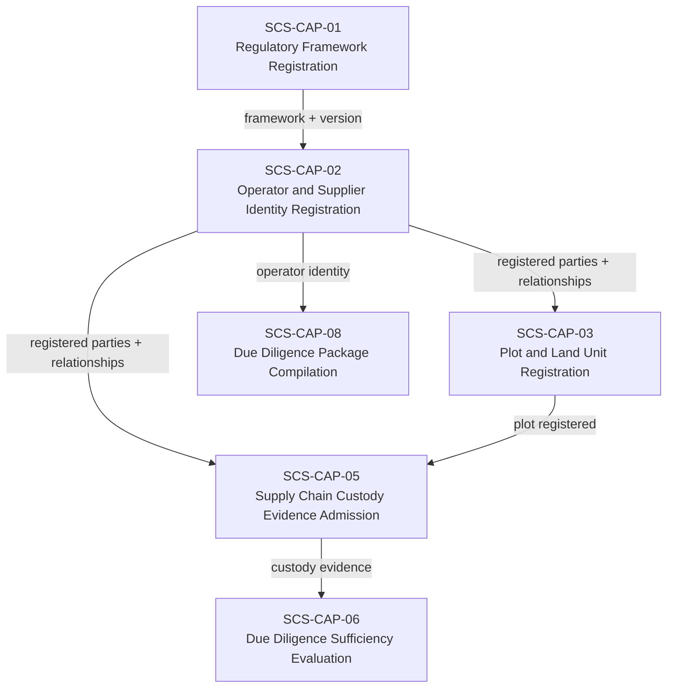
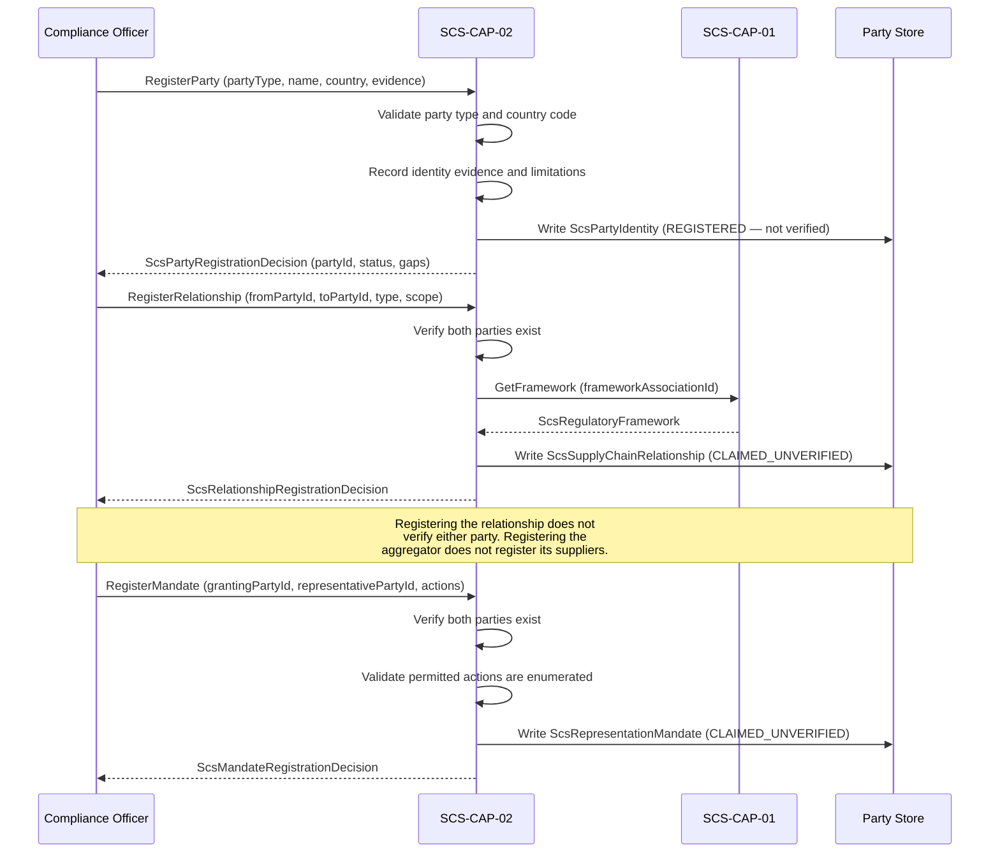

# SCS-CAP-02 — Operator and Supplier Identity Registration — Canonical Contract — 2026-09-23

**Status:** CANONICAL CONTRACT — NOT IMPLEMENTATION
**Domain:** Supply Chain Sovereignty (SCS)
**Authority:** DEFINES THE CONTRACT FOR SCS-CAP-02. Establishes no commissioning,
production, Gate D, WP05, scientific-validity or regulatory authority. This
capability is PROPOSED_NOT_ADMITTED. No implementation exists.

## Plain-English boundary statement

SCS-CAP-02 allows authorised parties to register the legal or natural persons
who occupy roles in a supply chain — operators, suppliers, aggregators,
processors, and exporters — along with the bilateral relationships between them
and the scoped mandates that permit one party to act on another's behalf. It
does not verify identity beyond the scope explicitly declared and evidenced. It
does not prove that a commodity batch moved between any two parties. It does not
grant regulatory eligibility, sanctions clearance, or compliance authority to
any registered party.

## The governing rule

> Every supply-chain relationship is bilateral. One-to-many aggregation is a
> derived network view. Representation authority is a separate, scoped and
> revocable record. Neither relationship nor representation constitutes identity
> verification or proof of commodity movement.

## Registration must not silently equal verification

`registrationStatus: REGISTERED` means only that SCS has created a governed
record of this party. It does not mean:

- Legal identity confirmed
- Sanctions clearance obtained
- Beneficial ownership verified
- Regulatory eligibility established
- Supply-chain role confirmed
- Relationship with any other party verified

Verification always names its scope, evidence, authority, jurisdiction, and
date. AAB must not imply that registering a supplier confirms legal ownership,
sanctions clearance, beneficial ownership, or regulatory eligibility unless
those matters were independently evidenced and explicitly recorded.

## The aggregator model — bilateral relationships only

An aggregator serving 400 smallholder suppliers has 400 independently governed
bilateral relationships. The one-to-many network is a derived view, not a
special record that obscures its members.

Each relationship connects exactly two parties:

```
supplierPartyId → aggregatorPartyId
aggregatorPartyId → processorPartyId
processorPartyId → exporterPartyId
```

Registering an aggregator does not register or verify its suppliers. An
aggregator's assertion that a farmer supplies it is a claim until supported
by evidence and independently assessed. Terminating one supplier relationship
must not affect the aggregator's other relationships.

## Six objects — kept separate

| Record | Purpose |
|---|---|
| Party identity | Identifies the person or legal entity |
| Claimed role | Records operator, supplier, aggregator, processor or exporter role |
| Identity evidence | Records documents and sources supporting identity |
| Verification assessment | Records what was verified, by whom, and when |
| Supply-chain relationship | Connects two parties without merging their identities |
| Framework association | Records the framework and version under which the party participates |

These six objects must never be silently merged. A party's identity record is
independent of any relationship record. A relationship record is independent of
any verification assessment. One party must not alter another party's canonical
identity record.

## Domain position



## Core interfaces

### Party identity record

```typescript
interface ScsPartyIdentity {
  // Canonical identity
  partyId: string;
  partyVersion: number;
  schemaVersion: string;
  registeredAt: string;
  registeredBy: ActorReference;

  // What kind of entity this is
  partyType:
    | "NATURAL_PERSON"
    | "LEGAL_ENTITY"
    | "COOPERATIVE"
    | "COMMUNITY_GROUP"
    | "GOVERNMENT_BODY"
    | "OTHER";

  // Human-readable identifier
  partyName: string;
  countryOfRegistration: string;
  countryOfOperation?: string;

  // Registration status — not verification status
  registrationStatus:
    | "REGISTERED"
    | "REQUIRES_HUMAN_REVIEW"
    | "DISPUTED"
    | "RETIRED";

  // Identity evidence — what documents support this identity
  identityEvidence: {
    evidenceIds: string[];
    evidenceLimitations: string[];
  };

  // Verification — separate from registration
  // Always scoped — never a blanket assertion
  verificationAssessments: ScsPartyVerificationAssessment[];

  // Provenance
  provenance: {
    submittedBy: ActorReference;
    submittingOrganizationId?: string;
    recordedAt: string;
  };
}
```

### Identity verification states

```typescript
type ScsIdentityVerificationStatus =
  | "REGISTERED_UNVERIFIED"
  | "PARTIALLY_VERIFIED"
  | "VERIFIED_FOR_DECLARED_SCOPE"
  | "VERIFICATION_EXPIRED"
  | "DISPUTED"
  | "FAIL_CLOSED";
```

### Party verification assessment — scoped, never blanket

```typescript
interface ScsPartyVerificationAssessment {
  assessmentId: string;
  partyId: string;
  partyVersion: number;

  verificationStatus: ScsIdentityVerificationStatus;

  // Verification is always scoped — what was verified
  verificationScope: {
    scopeDescription: string;
    jurisdictionCode: string;
    verifiedAttributes: string[];
    // Explicit exclusions — what was NOT verified
    excludedFromVerification: string[];
  };

  // Who verified and on what authority
  verifyingAuthority: {
    authorityId: string;
    authorityName: string;
    authorityBasis: string;
    jurisdictionCode: string;
  };

  verifiedAt: string;
  expiresAt?: string;
  evidenceIds: string[];
  limitations: string[];

  // Verification never implies broader authority
  authorityBoundary: {
    doesNotConfirmSanctionsClearance: true;
    doesNotConfirmBeneficialOwnership: true;
    doesNotGrantRegulatoryEligibility: true;
    doesNotImplyComplianceWithOtherFrameworks: true;
  };
}
```

### Claimed role record

```typescript
interface ScsPartyRoleClaim {
  roleClaimId: string;
  partyId: string;
  partyVersion: number;

  claimedRole:
    | "OPERATOR"
    | "SUPPLIER"
    | "AGGREGATOR"
    | "PROCESSOR"
    | "EXPORTER"
    | "IMPORTER"
    | "TRADER"
    | "OTHER";

  frameworkAssociationId: string;
  frameworkVersion: string;
  commodityScope: string[];
  geographicScope: string[];

  roleEvidenceIds: string[];

  verificationStatus:
    | "CLAIMED_UNVERIFIED"
    | "EVIDENCE_SUBMITTED"
    | "PARTIALLY_VERIFIED"
    | "VERIFIED_FOR_DECLARED_SCOPE"
    | "DISPUTED"
    | "EXPIRED"
    | "SUPERSEDED"
    | "FAIL_CLOSED";

  validFrom?: string;
  validUntil?: string;
  limitations: string[];

  claimedAt: string;
  claimedBy: ActorReference;
}
```

### Bilateral supply-chain relationship record

```typescript
interface ScsSupplyChainRelationship {
  relationshipId: string;
  schemaVersion: string;

  // Exactly two parties — always bilateral
  fromPartyId: string;
  toPartyId: string;

  relationshipType:
    | "SUPPLIES_TO"
    | "PROCESSES_FOR"
    | "AGGREGATES_FOR"
    | "EXPORTS_FOR"
    | "CERTIFIES_FOR"
    | "OTHER";

  commodityScope: string[];
  geographicScope: string[];

  // Framework association — explicit and version-bound
  // Participation under one regulation does not imply
  // participation under another
  frameworkAssociationIds: string[];

  validFrom?: string;
  validUntil?: string;

  // Who claimed this relationship and when
  claimedByPartyId: string;
  claimedAt: string;

  relationshipEvidenceIds: string[];

  verificationStatus:
    | "CLAIMED_UNVERIFIED"
    | "EVIDENCE_SUBMITTED"
    | "PARTIALLY_VERIFIED"
    | "VERIFIED_FOR_DECLARED_SCOPE"
    | "DISPUTED"
    | "EXPIRED"
    | "SUPERSEDED"
    | "FAIL_CLOSED";

  verificationScope?: string;
  lifecycleStatus: "ACTIVE" | "EXPIRED" | "SUPERSEDED" | "WITHDRAWN";

  // Immutable history — superseded relationships remain on record
  supersedesRelationshipId?: string;
  supersededByRelationshipId?: string;

  representationVersion: string;
  createdAt: string;
  createdBy: ActorReference;
}
```

### Representation mandate — separate from relationship

An aggregator may collect or submit evidence on a smallholder's behalf, but
that authority requires its own governed mandate — separate from the supply
relationship, separately scoped, and revocable independently.

```typescript
interface ScsRepresentationMandate {
  mandateId: string;
  schemaVersion: string;

  // Who grants authority and to whom
  grantingPartyId: string;
  representativePartyId: string;

  // What the representative is permitted to do
  // Enumerated — not open-ended
  permittedActions: Array<
    | "SUBMIT_IDENTITY_EVIDENCE"
    | "SUBMIT_PLOT_ASSOCIATION_EVIDENCE"
    | "SUBMIT_CUSTODY_EVIDENCE"
    | "SUBMIT_DEFORESTATION_EVIDENCE"
    | "REQUEST_FRAMEWORK_ASSOCIATION"
    | "OTHER_EXPLICITLY_NAMED"
  >;

  // Present only when permittedActions includes OTHER_EXPLICITLY_NAMED.
  // Names the specific action permitted. Required if OTHER_EXPLICITLY_NAMED
  // is used; ignored otherwise.
  otherActionDescription?: string;

  // Scope — explicit and version-bound
  frameworkAssociationIds: string[];
  commodityScope: string[];
  geographicScope: string[];

  validFrom: string;
  validUntil?: string;

  mandateEvidenceIds: string[];

  verificationStatus:
    | "CLAIMED_UNVERIFIED"
    | "EVIDENCE_SUBMITTED"
    | "PARTIALLY_VERIFIED"
    | "VERIFIED_FOR_DECLARED_SCOPE"
    | "DISPUTED"
    | "EXPIRED"
    | "REVOKED"
    | "FAIL_CLOSED";

  revocationStatus: "NOT_REVOKED" | "REVOKED" | "EXPIRED";
  revokedAt?: string;
  revocationReason?: string;

  createdAt: string;
  createdBy: ActorReference;

  // What this mandate does not permit
  authorityBoundary: {
    doesNotPermitApprovalOfGrantingParty: true;
    doesNotPermitAlterationOfGrantingPartyIdentity: true;
    doesNotPermitLegalDeclarationsWithoutExplicitAuthority: true;
    doesNotConcealWhichRecordsWereSubmitted: true;
    doesNotReuseAuthorityOutsideDeclaredScope: true;
    doesNotExtendToOtherFrameworksOrCommodities: true;
  };
}
```

When `OTHER_EXPLICITLY_NAMED` is included in `permittedActions`,
`otherActionDescription` must name the specific action explicitly. A mandate
that includes `OTHER_EXPLICITLY_NAMED` without a description is incomplete
and must be rejected.

## Registration and relationship sequence



## Registration decision

```typescript
interface ScsPartyRegistrationDecision {
  decisionId: string;
  partyId: string;
  decision:
    | "REGISTERED"
    | "REGISTERED_WITH_GAPS"
    | "REJECTED"
    | "REQUIRES_HUMAN_REVIEW";

  eligibilityChecks: {
    partyTypeValid: boolean;
    countryCodeValid: boolean;
    partyNameProvided: boolean;
    registrantAuthorised: boolean;
    noConflictingRegistrationDetected: boolean;
  };

  gaps: Array<{
    gapCode: string;
    gapDescription: string;
    humanReviewRequired: boolean;
  }>;

  decisionReasons: string[];
  decidedBy: ActorReference;
  decidedAt: string;
}
```

## Party registration: conflicts, outcomes and open gaps

### Conflicting registrations

**Contract gap: the conflict definition.** This contract names the
`noConflictingRegistrationDetected` eligibility check and the `CONFLICTING_REGISTRATION_DETECTED`
error, but it does not say what makes two registrations conflict. It does not say:

- which fields are compared;
- whether names are normalised (case, spacing, punctuation, transliteration between scripts);
- whether the rule depends on `partyType`.

Until the contract defines it, this rule applies:

- **Organisational parties.** For `LEGAL_ENTITY`, `COOPERATIVE`, `COMMUNITY_GROUP` and
  `GOVERNMENT_BODY`, a registration conflicts when a party of one of those four types, whose
  `registrationStatus` is anything other than `RETIRED`, has exactly the same `partyName` and
  `countryOfRegistration`.
- **Exact comparison.** The comparison does not normalise case, spacing, punctuation or
  transliteration.
- **Conflict outcome.** A conflict ends in `FAIL_CLOSED` with `CONFLICTING_REGISTRATION_DETECTED`,
  and its reasons name the existing `partyId`. A `RETIRED` party never conflicts.
- **Natural persons and `OTHER`.** For `NATURAL_PERSON` and `OTHER`, there is no automatic
  conflict check, in either direction: such a registration neither conflicts with nor blocks
  any other party. A name and a country of registration cannot establish that two registrations
  are the same person; two smallholders in one province can share a name. Deduplication of
  these parties is a human review concern.
- **Recording the unperformed check.** For `NATURAL_PERSON` and `OTHER`, the check is not
  performed, so `noConflictingRegistrationDetected` is recorded as `false`, and `decisionReasons`
  names it as not evaluated.

The conflict definition, including whether names are normalised and how natural persons are
deduplicated, must be specified here before a production implementation.

### When registration is FAIL_CLOSED, REGISTERED_WITH_GAPS, REJECTED or REQUIRES_HUMAN_REVIEW

**Contract gap: no decision criteria.** `ScsPartyRegistrationDecision` defines four outcomes:
`REGISTERED`, `REGISTERED_WITH_GAPS`, `REJECTED` and `REQUIRES_HUMAN_REVIEW`. The contract gives
no criteria for the last three. Until it does, this rule applies:

- **FAIL_CLOSED.** Any condition in the failure contract's `error` union ends in `FAIL_CLOSED`.
  Examples are `REGISTRANT_NOT_AUTHORISED`, `COUNTRY_CODE_UNRECOGNISED`,
  `CONFLICTING_REGISTRATION_DETECTED` and `DEPENDENCY_UNAVAILABLE`. Nothing is written: no party,
  no decision, no receipt.
- **Otherwise, `REGISTERED`, with an empty `gaps` list.** A registration that does not fail
  closed always returns `REGISTERED`, even when an eligibility check was not performed. The
  unperformed check is recorded as `false`, and `decisionReasons` names it. `REGISTERED` records
  that a governed identity record exists; it verifies nothing.
- **Reserved outcomes.** `REGISTERED_WITH_GAPS`, `REJECTED` and `REQUIRES_HUMAN_REVIEW` are
  reserved until their criteria are specified here. No implementation may invent those criteria.

### Country of operation

**Contract gap: `countryOfOperation` validation.** The registration sequence says CAP-02 validates
"country code", and `COUNTRY_CODE_UNRECOGNISED` is in the failure contract. The contract does not
say which code system is used. It also does not say whether `countryOfOperation` is validated,
or only `countryOfRegistration`.

Pending clarification, the implementation has made a deliberate decision:

- Both `countryOfRegistration` and `countryOfOperation` (when present) must be officially
  assigned ISO 3166-1 alpha-2 codes, in uppercase.
- User-assigned codes such as `XK` are not accepted.
- Any other value ends in `FAIL_CLOSED` with `COUNTRY_CODE_UNRECOGNISED`.
- The reason is that free text invites malformed data.

The code system, and which fields it applies to, must be confirmed here before a production
implementation.

## Identity evidence submission

### Governing principle

> Submitting identity evidence admits evidence. It does not verify identity. It
> does not change the party's `registrationStatus`, does not create a new party
> version, and does not create or change any verification assessment. What the
> evidence proves is evaluated separately, by an `ScsPartyVerificationAssessment`
> that names its scope, evidence, authority, jurisdiction and date.

Evidence can be submitted after registration. At registration, evidence travels
inside `ScsPartyRegistrationRequest.identityEvidence`. After registration, each
submission is its own record, kept separate from the party identity record as
the six-object rule requires.

### Identity evidence submission record

```typescript
interface ScsPartyIdentityEvidenceSubmission {
  submissionId: string;
  partyId: string;
  // The party version the evidence is attached to: the party's current version
  partyVersion: number;

  evidenceIds: string[];
  evidenceLimitations: string[];

  submittedBy: ActorReference;
  submittingOrganizationId?: string;
  submittedAt: string;
}
```

### Submission request

```typescript
// partyId is taken from the request path, not the body
interface ScsIdentityEvidenceSubmissionRequest {
  // One to 200 identifiers, no duplicates
  evidenceIds: string[];
  evidenceLimitations: string[];
  submittingOrganizationId?: string;
}
```

### Submission decision

```typescript
interface ScsIdentityEvidenceSubmissionDecision {
  decisionId: string;
  submissionId: string;
  partyId: string;
  partyVersion: number;
  decision: "RECORDED";

  eligibilityChecks: {
    partyExists: boolean;
    partyNotRetired: boolean;
    submitterAuthorised: boolean;
    evidenceIdsNotAlreadyLinked: boolean;
  };

  decisionReasons: string[];
  decidedBy: ActorReference;
  decidedAt: string;
}
```

### Submission rules

The checks run in this order. Each failure ends in `FAIL_CLOSED` and writes nothing: no
submission, no evidence link, no decision, no receipt.

1. **Authority.** Only a `COMPLIANCE_OFFICER` may submit identity evidence. Otherwise
   `REGISTRANT_NOT_AUTHORISED` (403).
2. **Party exists.** The `partyId` must identify a registered party. Otherwise
   `PARTY_NOT_FOUND` (404).
3. **Party not retired.** A `RETIRED` party accepts no new evidence: `PARTY_RETIRED` (422).
   Parties that are `REGISTERED`, `REQUIRES_HUMAN_REVIEW` or `DISPUTED` accept evidence,
   because evidence may help resolve a review or a dispute.
4. **No duplicate links.** No submitted `evidenceId` may already be linked to the party's
   current version, whether at registration or by an earlier submission. Otherwise
   `EVIDENCE_ALREADY_LINKED` (409), whose reasons name every duplicate id. Duplicates are
   never skipped silently.

When every check passes, the decision is `RECORDED`. The submission is recorded, each
evidence id is linked to the party's current version, and the decision's receipt, with
decision type `IDENTITY_EVIDENCE_SUBMISSION`, is written in the same transaction. The
party identity record is not changed.

### Open gaps

**Contract gap: representative submission.** `SUBMIT_IDENTITY_EVIDENCE` is a mandate
action, so a representative party may be able to submit evidence under a mandate. This
contract does not say how a mandate authorises a submission. Until it does, only a
`COMPLIANCE_OFFICER` may submit, and mandate-based submission is not accepted.

**Contract gap: party versions.** This contract gives parties a `partyVersion` but does
not say what creates a new version. Until it does, evidence attaches to the party's
current version, and submitting evidence never creates one.

**Contract gap: evidence in the party record.** `ScsPartyIdentity.identityEvidence`
holds the evidence given at registration. This contract does not say whether reading a
party (`getParty`) also returns evidence submitted later. That must be specified before
`getParty` is implemented.

**Current system limit: no evidence store.** The system does not yet store evidence
documents, so a submitted `evidenceId` cannot be confirmed to identify any document. Until
an evidence store exists, identifiers are recorded as submitted, and every decision's
`decisionReasons` states that the identifiers were not confirmed and that the evidence
store is not yet built. This describes the current system, not the intended architecture.

## Provider-neutral interface

```typescript
interface ScsPartyIdentityProvider {
  registerParty(
    request: ScsPartyRegistrationRequest
  ): Promise<ScsPartyRegistrationDecision>;

  getParty(
    partyId: string,
    version?: number
  ): Promise<ScsPartyIdentity>;

  submitIdentityEvidence(
    partyId: string,
    request: ScsIdentityEvidenceSubmissionRequest
  ): Promise<ScsIdentityEvidenceSubmissionDecision>;

  addVerificationAssessment(
    assessment: ScsPartyVerificationAssessment
  ): Promise<ScsPartyVerificationAssessment>;

  addRoleClaim(
    claim: ScsPartyRoleClaim
  ): Promise<ScsPartyRoleClaim>;

  registerRelationship(
    relationship: ScsSupplyChainRelationship
  ): Promise<ScsRelationshipRegistrationDecision>;

  getRelationship(
    relationshipId: string
  ): Promise<ScsSupplyChainRelationship>;

  listRelationshipsForParty(
    partyId: string,
    direction?: "FROM" | "TO" | "BOTH"
  ): Promise<ScsSupplyChainRelationship[]>;

  registerMandate(
    mandate: ScsRepresentationMandate
  ): Promise<ScsMandateRegistrationDecision>;

  revokeMandate(
    mandateId: string,
    reason: string,
    revokedBy: ActorReference
  ): Promise<ScsRepresentationMandate>;

  listMandatesForParty(
    partyId: string,
    role?: "GRANTING" | "REPRESENTATIVE"
  ): Promise<ScsRepresentationMandate[]>;

  listParties(
    request: ScsListPartiesRequest
  ): Promise<ScsListPartiesResult>;
}
```

## Failure contract

```typescript
interface ScsPartyRegistrationFailure {
  ok: false;
  capabilityId: "SCS-CAP-02";
  result: "FAIL_CLOSED";

  error:
    | "REGISTRANT_NOT_AUTHORISED"
    | "PARTY_TYPE_INVALID"
    | "COUNTRY_CODE_UNRECOGNISED"
    | "PARTY_NAME_MISSING"
    | "CONFLICTING_REGISTRATION_DETECTED"
    | "PARTY_NOT_FOUND"
    | "PARTY_RETIRED"
    | "EVIDENCE_ALREADY_LINKED"
    | "FRAMEWORK_ASSOCIATION_NOT_FOUND"
    | "FROM_PARTY_NOT_FOUND"
    | "TO_PARTY_NOT_FOUND"
    | "SELF_REFERENTIAL_RELATIONSHIP"
    | "MANDATE_ACTION_NOT_ENUMERATED"
    | "GRANTING_PARTY_NOT_FOUND"
    | "REPRESENTATIVE_PARTY_NOT_FOUND"
    | "DEPENDENCY_UNAVAILABLE";

  reasons: string[];
  noWrites: true;
  noPartyRegistered: true;
}
```

## Southeast Asia operational context

In Thailand and Vietnam, the majority of commodity production — rubber, palm oil,
coffee — comes from smallholder farmers who may have:

- No formal legal entity registration
- Traditional or customary land rights rather than registered title
- Limited documentation of their supply relationships
- GPS coordinates but no formal cadastral records

SCS-CAP-02 handles this through honest gap disclosure rather than exclusion:

- A smallholder with no formal legal registration is admitted as
  `partyType: NATURAL_PERSON` with `registrationStatus: REGISTERED` and
  `verificationStatus: REGISTERED_UNVERIFIED`
- The gap is disclosed — not papered over
- SCS-CAP-06's sufficiency evaluation determines the consequence of that gap
  for a specific framework's requirements
- The aggregator who collects on their behalf has a separately governed mandate
  with explicit permitted actions and explicit expiry

A Thai rubber cooperative managing 400 smallholder members registers 400
bilateral relationships and 400 representation mandates. Each smallholder's
identity, plot registration, and evidence remain individually governed. The
cooperative's submission authority is explicit, scoped, and revocable per
smallholder. No smallholder's record is obscured by the cooperative's
registration.

## What this document does not establish

- It does not admit SCS-CAP-02 as a canonical capability — that requires
  the ten-point admission checklist
- It does not implement, deploy or migrate anything
- It does not verify the legal identity, sanctions status, beneficial ownership,
  or regulatory eligibility of any registered party
- `REGISTERED` means a governed record exists — nothing more
- Registering an aggregator does not register its suppliers
- Registering a relationship does not verify either party
- A representation mandate does not grant the representative authority to
  approve, alter, or make legal declarations on behalf of the granting party
  beyond its explicitly enumerated permitted actions
- It does not alter commissioning status, satisfy Gate D, close WP05, or
  grant any production or commissioning authority
