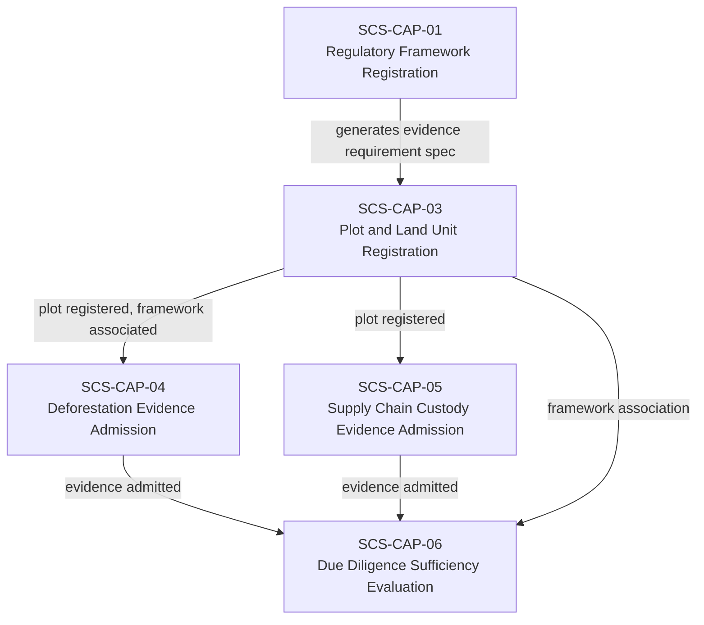
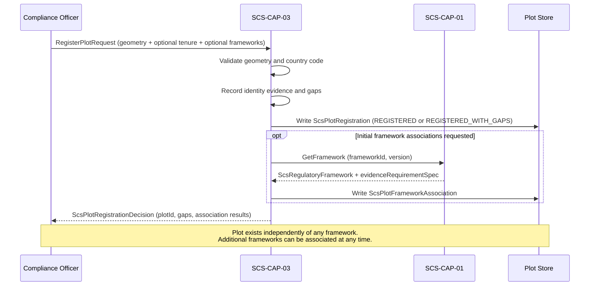

# SCS-CAP-03 — Plot and Land Unit Registration — Canonical Contract — 2026-09-22

**Status:** CANONICAL CONTRACT — NOT IMPLEMENTATION
**Domain:** Supply Chain Sovereignty (SCS)
**Authority:** DEFINES THE CONTRACT FOR SCS-CAP-03. Establishes no commissioning, production, Gate D, WP05, scientific-validity or regulatory authority. This capability is PROPOSED_NOT_ADMITTED. No implementation exists.

## Plain-English boundary statement

SCS-CAP-03 allows an authorised operator or aggregator to register a geographic plot as a real-world entity, with its boundary evidence, tenure claims, and framework associations recorded separately and honestly. It does not verify legal title. It does not confirm regulatory sufficiency. It does not decide between competing tenure claims. It creates a governed, versioned record of what is known about a place, who claims a relationship to it, and under which frameworks it is being assessed — with every gap and uncertainty explicitly disclosed.

## The governing principle

A plot is a place. A tenure record describes someone's evidenced relationship to that place. A framework association describes why that place is being assessed. A sufficiency decision describes whether the evidence meets that particular framework's needs. None of those should be silently treated as the other.

`registrationStatus: "REGISTERED"` means only that SCS has created a governed record of this plot. It does not mean:
- legal title verified
- tenure accepted
- boundary undisputed
- framework compliant
- commodity eligible

## Why plot and framework must be separated

A single plot may simultaneously be relevant to:
- EUDR commodity traceability
- national land-use regulation
- deforestation controls
- certification schemes (RSPO, Rainforest Alliance, FSC)
- carbon accounting mechanisms
- biodiversity safeguard frameworks
- customary-rights protections
- future regulatory frameworks that do not yet exist

If the regulatory framework were embedded into plot registration, the system would either duplicate the same plot for every framework, or modify the plot's foundational identity whenever regulations change. Both approaches weaken lineage and create opportunities for contradictory plot records. The plot is a real-world geographic entity. A regulatory framework is a changing legal and evidence context. They must not share the same identity or lifecycle.

## What a GPS polygon does and does not prove

A GPS polygon proves neither title nor control. SCS-CAP-03 keeps the following questions explicitly separate:

| Question | Example evidence |
|---|---|
| Where is the plot believed to be? | Survey polygon, phone GPS, mapped customary boundary |
| How precise is that boundary? | Survey accuracy, device accuracy, uncertainty statement |
| Who supplied the boundary? | Land office, farmer, cooperative, community representative |
| Who claims a relationship to it? | Owner, tenant, cooperative member, customary community |
| What is the basis of that relationship? | Title, lease, permit, customary tenure, attestation |
| Has a registry verified it? | Verified, unverified, conflicting, unavailable |
| Which framework is assessing it? | EUDR or another registered SCS framework |
| Is the available evidence sufficient? | Framework-specific SCS-CAP-06 determination |

This prevents an informal mapped boundary from being presented as formal ownership while still allowing the real plot to enter the system and be honestly assessed.

## Domain position



## Core interfaces

### Plot registration

```typescript
interface ScsPlotRegistration {
  // Canonical identity
  plotId: string;
  plotVersion: number;
  schemaVersion: string;
  registeredAt: string;
  registrationStatus:
    | "REGISTERED"
    | "REQUIRES_HUMAN_REVIEW"
    | "DISPUTED"
    | "RETIRED";

  // Human-readable identifier
  plotName?: string;
  countryCode: string;
  administrativeAreas?: string[];

  // Geographic boundary
  geometry: {
    geometryType: "POLYGON" | "MULTIPOLYGON";
    coordinates: unknown;
    coordinateReferenceSystem: string;
    captureMethod:
      | "FORMAL_CADASTRAL_SURVEY"
      | "GOVERNMENT_REGISTRY_GEOMETRY"
      | "PROFESSIONAL_SURVEY"
      | "PHONE_GPS"
      | "COMMUNITY_MAPPING"
      | "COOPERATIVE_MAPPING"
      | "REMOTE_SENSING_DERIVATION"
      | "OTHER";
    positionalAccuracyMetres?: number;
    boundaryUncertaintyDescription?: string;
    capturedAt?: string;
  };

  // Identity evidence — what is known about formal registration
  identityEvidence: {
    registryReference?: string;
    registryAuthority?: string;
    registryVerificationStatus:
      | "VERIFIED"
      | "UNVERIFIED"
      | "CONFLICTING"
      | "REGISTRY_UNAVAILABLE"
      | "NOT_APPLICABLE";
    supportingEvidenceIds: string[];
    evidenceLimitations: string[];
  };

  // Known or possible overlap with other registered plots
  overlapState:
    | "NO_KNOWN_OVERLAP"
    | "POSSIBLE_OVERLAP"
    | "CONFIRMED_OVERLAP"
    | "NOT_EVALUATED";

  // Provenance — who registered this and how
  provenance: {
    submittedBy: ActorReference;
    submittingOrganizationId?: string;
    sourceType: string;
    recordedAt: string;
  };
}
```

### Tenure claim — separate from plot registration

Tenure claims are separate records. Multiple claims may exist for the same plot. SCS-CAP-03 records them honestly without deciding which is legally correct.

```typescript
interface ScsPlotTenureClaim {
  tenureClaimId: string;
  plotId: string;
  plotVersion: number;

  claimantType:
    | "INDIVIDUAL"
    | "ORGANIZATION"
    | "COOPERATIVE"
    | "COMMUNITY"
    | "GOVERNMENT"
    | "OTHER";

  claimantId: string;

  tenureBasis:
    | "FORMAL_TITLE"
    | "LEASE"
    | "PERMIT"
    | "CUSTOMARY_COLLECTIVE_RIGHT"
    | "CUSTOMARY_INDIVIDUAL_RIGHT"
    | "COMMUNITY_ATTESTATION"
    | "OCCUPANCY_OR_USE_CLAIM"
    | "UNKNOWN";

  evidenceIds: string[];

  verificationStatus:
    | "VERIFIED"
    | "PARTIALLY_VERIFIED"
    | "UNVERIFIED"
    | "CONFLICTING"
    | "AUTHORITY_UNAVAILABLE";

  validFrom?: string;
  validUntil?: string;

  // Explicit disclosure of what this claim does not establish
  limitations: string[];

  recordedAt: string;
  recordedBy: ActorReference;
}
```

This allows customary rights to be represented directly rather than forced into a Western title-document model. It also allows multiple or competing claims to exist without SCS silently deciding which claimant is legally correct.

### Framework association — many-to-many, versioned

```typescript
interface ScsPlotFrameworkAssociation {
  associationId: string;

  plotId: string;
  frameworkId: string;
  frameworkVersion: string;

  commodityCode?: string;
  producerOrOperatorId?: string;

  applicabilityStatus:
    | "POTENTIALLY_APPLICABLE"
    | "APPLICABLE"
    | "NOT_APPLICABLE"
    | "REQUIRES_HUMAN_DECISION";

  associatedAt: string;
  associatedBy: ActorReference;
  associationReason: string;

  effectiveFrom?: string;
  effectiveUntil?: string;

  // Links to the exact evidence requirement spec
  // in force at the time of association
  evidenceRequirementSpecId: string;

  lifecycleStatus:
    | "ACTIVE"
    | "SUPERSEDED"
    | "WITHDRAWN";
}
```

One plot may have many framework associations. One framework may apply to many plots. Each association records the exact framework version and requirement specification — so a sufficiency evaluation always knows which standard it is checking against.

### Registration request — with optional initial framework associations

```typescript
interface RegisterPlotRequest {
  plot: ScsPlotRegistration;
  tenureClaims?: ScsPlotTenureClaim[];

  // Optional — framework associations may be created
  // separately after registration
  initialFrameworkAssociations?: Array<{
    frameworkId: string;
    frameworkVersion: string;
    commodityCode?: string;
    associationReason: string;
  }>;
}
```

If a framework association fails during registration, the plot registration still succeeds. The failed association is reported separately. This preserves the distinction between "this plot exists in SCS" and "this plot is being assessed against framework X."

### Registration decision

```typescript
interface ScsPlotRegistrationDecision {
  decisionId: string;
  plotId: string;
  decision:
    | "REGISTERED"
    | "REGISTERED_WITH_GAPS"
    | "REJECTED"
    | "REQUIRES_HUMAN_REVIEW";

  eligibilityChecks: {
    geometryValid: boolean;
    countryCodeValid: boolean;
    coordinateReferenceSystemRecognised: boolean;
    capturMethodRecorded: boolean;
    registrantAuthorised: boolean;
    noFatalOverlapDetected: boolean;
  };

  // Gaps are disclosed, not hidden
  gaps: Array<{
    gapCode: string;
    gapDescription: string;
    automaticFailure: boolean;
    humanReviewRequired: boolean;
  }>;

  frameworkAssociationResults: Array<{
    frameworkId: string;
    associationId?: string;
    outcome: "ASSOCIATED" | "FAILED" | "PENDING_HUMAN_DECISION";
    reason?: string;
  }>;

  decisionReasons: string[];
  decidedBy: ActorReference;
  decidedAt: string;
}
```

### Sufficiency evaluation request and result

Sufficiency is always contextual. SCS-CAP-06 does not ask "is this plot sufficient?" It asks "is the evidence for this plot sufficient for this commodity, under this framework version, for this declared purpose and relevant period?"

```typescript
interface ScsPlotSufficiencyRequest {
  plotId: string;
  plotVersion: number;
  frameworkAssociationId: string;
  evidenceRequirementSpecId: string;
  commodityCode: string;
  relevantPeriod: {
    from?: string;
    to?: string;
  };
  evidenceIds: string[];
}

interface ScsPlotSufficiencyResult {
  result:
    | "SUFFICIENT"
    | "GAPS_REQUIRE_HUMAN_DECISION"
    | "INSUFFICIENT"
    | "CONFLICTING_EVIDENCE"
    | "FAIL_CLOSED";

  gaps: Array<{
    requirementCode: string;
    gapType: string;
    explanation: string;
    automaticFailure: boolean;
    humanDecisionRequired: boolean;
  }>;

  // This result never authorises a due diligence statement
  // A human review through SCS-CAP-09 is always required
  noAutomaticApproval: true;
}
```

**Example result for a GPS-only plot with no formal registry reference:**

```json
{
  "result": "GAPS_REQUIRE_HUMAN_DECISION",
  "gaps": [
    {
      "requirementCode": "PLOT_REGISTRY_VERIFICATION",
      "gapType": "FORMAL_REGISTRY_NOT_VERIFIED",
      "explanation": "A geographic polygon is recorded, but no formal registry reference has been verified. The compliance officer must explicitly address this gap before a due diligence statement can be compiled.",
      "automaticFailure": false,
      "humanDecisionRequired": true
    }
  ],
  "noAutomaticApproval": true
}
```

## Provider-neutral interface

```typescript
interface ScsPlotRegistrationProvider {
  registerPlot(
    request: RegisterPlotRequest
  ): Promise<ScsPlotRegistrationDecision>;

  getPlot(
    plotId: string,
    version?: number
  ): Promise<ScsPlotRegistration>;

  getPlotTenureClaims(
    plotId: string
  ): Promise<ScsPlotTenureClaim[]>;

  addTenureClaim(
    claim: ScsPlotTenureClaim
  ): Promise<ScsPlotTenureClaim>;

  associateFramework(
    plotId: string,
    association: Omit<ScsPlotFrameworkAssociation, "associationId" | "associatedAt">
  ): Promise<ScsPlotFrameworkAssociation>;

  getFrameworkAssociations(
    plotId: string
  ): Promise<ScsPlotFrameworkAssociation[]>;

  evaluateSufficiency(
    request: ScsPlotSufficiencyRequest
  ): Promise<ScsPlotSufficiencyResult>;

  listPlots(
    request: ListPlotsRequest
  ): Promise<ListPlotsResult>;

  retirePlot(
    plotId: string,
    reason: string,
    retiredBy: ActorReference
  ): Promise<void>;
}
```

## Aggregator bulk registration — noted, not yet designed

The domain definition addendum records that in most target markets, an aggregator — a cooperative, trading company, or processing facility — manages plot data collection across hundreds or thousands of smallholder suppliers. Bulk registration workflows for aggregators are explicitly noted here so future capability design reflects this correctly. They are not in the launch scope of SCS-CAP-03 but must not be designed around when the core registration contract is implemented.

## Failure contract

```typescript
interface ScsPlotRegistrationFailure {
  ok: false;
  capabilityId: "SCS-CAP-03";
  result: "FAIL_CLOSED";

  error:
    | "REGISTRANT_NOT_AUTHORISED"
    | "GEOMETRY_INVALID"
    | "COUNTRY_CODE_UNRECOGNISED"
    | "COORDINATE_REFERENCE_SYSTEM_UNSUPPORTED"
    | "FATAL_OVERLAP_DETECTED"
    | "TENURE_CLAIM_INVALID"
    | "FRAMEWORK_REFERENCE_NOT_FOUND"
    | "DEPENDENCY_UNAVAILABLE";

  reasons: string[];
  noWrites: true;
  noPlotRegistered: true;
}
```

## Registration and association sequence



## What this document does not establish

- It does not admit SCS-CAP-03 as a canonical capability — that requires the ten-point admission checklist
- It does not implement, deploy or migrate anything
- It does not verify legal title or tenure for any plot
- It does not confirm that any registered plot meets the requirements of any regulatory framework — that is SCS-CAP-06's function
- It does not decide between competing tenure claims — it records them honestly
- It does not replace the need for operators to obtain and submit real evidence of boundary, identity and tenure through SCS-CAP-04 and SCS-CAP-05
- It does not alter commissioning status, satisfy Gate D, close WP05, or grant any production or commissioning authority
