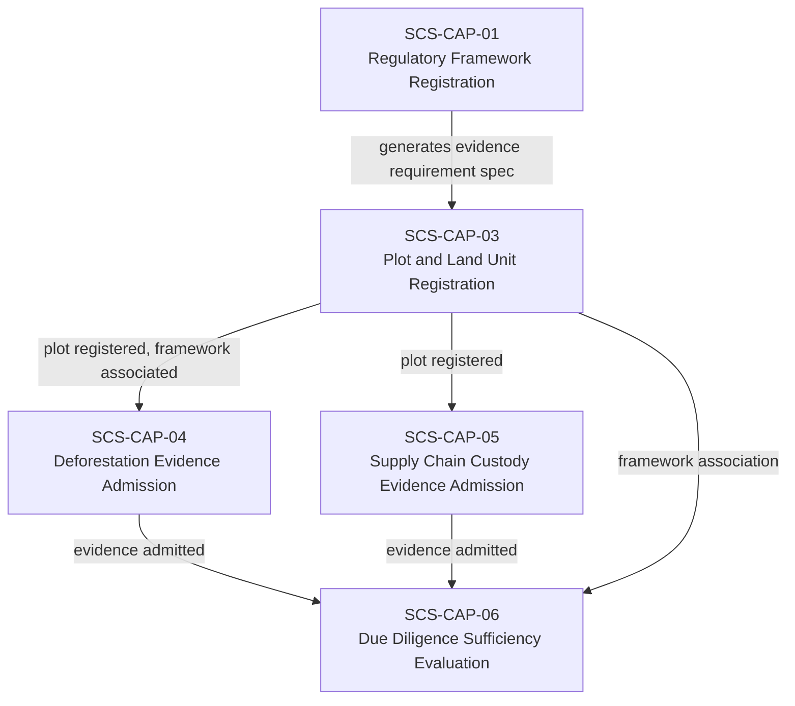
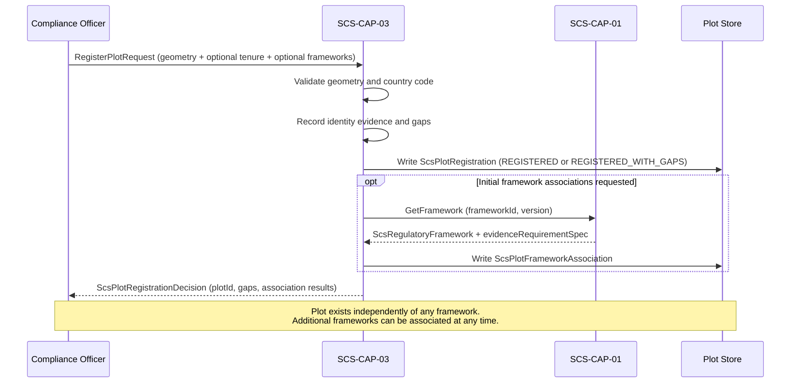

# SCS-CAP-03 — Plot and Land Unit Registration — Canonical Contract — 2026-09-22

**Status:** CANONICAL CONTRACT — NOT IMPLEMENTATION
**Domain:** Supply Chain Sovereignty (SCS)
**Authority:** DEFINES THE CONTRACT FOR SCS-CAP-03. Establishes no commissioning, production, Gate D, WP05, scientific-validity or regulatory authority. This capability is PROPOSED_NOT_ADMITTED. No implementation exists.

## Plain-English boundary statement

SCS-CAP-03 allows an authorised operator or aggregator to register a geographic plot as a real-world entity, with its boundary evidence, tenure claims, and framework associations recorded separately and honestly. It does not verify legal title. It does not confirm regulatory sufficiency. It does not decide between competing tenure claims. It creates a governed, versioned record of what is known about a place, who claims a relationship to it, and under which frameworks it is being assessed — with every gap and uncertainty explicitly disclosed.

## The governing principle

A plot is a place. A tenure record describes someone's evidenced relationship to that place. A framework association describes why that place is being assessed. A sufficiency decision describes whether the evidence meets that particular framework's needs. None of those should be silently treated as the other.

`registrationStatus: "REGISTERED"` means only that SCS has created a governed record of this plot. It does not mean:
- legal title verified
- tenure accepted
- boundary undisputed
- framework compliant
- commodity eligible

## Why plot and framework must be separated

A single plot may simultaneously be relevant to:
- EUDR commodity traceability
- national land-use regulation
- deforestation controls
- certification schemes (RSPO, Rainforest Alliance, FSC)
- carbon accounting mechanisms
- biodiversity safeguard frameworks
- customary-rights protections
- future regulatory frameworks that do not yet exist

If the regulatory framework were embedded into plot registration, the system would either duplicate the same plot for every framework, or modify the plot's foundational identity whenever regulations change. Both approaches weaken lineage and create opportunities for contradictory plot records. The plot is a real-world geographic entity. A regulatory framework is a changing legal and evidence context. They must not share the same identity or lifecycle.

## What a GPS polygon does and does not prove

A GPS polygon proves neither title nor control. SCS-CAP-03 keeps the following questions explicitly separate:

| Question | Example evidence |
|---|---|
| Where is the plot believed to be? | Survey polygon, phone GPS, mapped customary boundary |
| How precise is that boundary? | Survey accuracy, device accuracy, uncertainty statement |
| Who supplied the boundary? | Land office, farmer, cooperative, community representative |
| Who claims a relationship to it? | Owner, tenant, cooperative member, customary community |
| What is the basis of that relationship? | Title, lease, permit, customary tenure, attestation |
| Has a registry verified it? | Verified, unverified, conflicting, unavailable |
| Which framework is assessing it? | EUDR or another registered SCS framework |
| Is the available evidence sufficient? | Framework-specific SCS-CAP-06 determination |

This prevents an informal mapped boundary from being presented as formal ownership while still allowing the real plot to enter the system and be honestly assessed.

## Domain position



## Core interfaces

### Plot registration

```typescript
interface ScsPlotRegistration {
  // Canonical identity
  plotId: string;
  plotVersion: number;
  schemaVersion: string;
  registeredAt: string;
  registeredBy: ActorReference;
  registrationStatus:
    | "REGISTERED"
    | "REGISTERED_WITH_GAPS"
    | "REQUIRES_HUMAN_REVIEW"
    | "DISPUTED"
    | "RETIRED";

  // Human-readable identifier
  plotName?: string;
  countryCode: string;
  administrativeAreas?: string[];

  // Geographic boundary: GeoJSON (RFC 7946) in EPSG:4326
  geometry: {
    // POINT only for a plot of 4 hectares or less (EUDR Article 2(28))
    geometryType: "POINT" | "POLYGON" | "MULTIPOLYGON";
    // The GeoJSON coordinates member for geometryType
    coordinates: unknown;
    // Always "EPSG:4326"
    coordinateReferenceSystem: string;
    // Declared; required for POLYGON and MULTIPOLYGON
    areaHectares?: number;
    captureMethod:
      | "FORMAL_CADASTRAL_SURVEY"
      | "GOVERNMENT_REGISTRY_GEOMETRY"
      | "PROFESSIONAL_SURVEY"
      | "PHONE_GPS"
      | "COMMUNITY_MAPPING"
      | "COOPERATIVE_MAPPING"
      | "REMOTE_SENSING_DERIVATION"
      | "OTHER";
    positionalAccuracyMetres?: number;
    boundaryUncertaintyDescription?: string;
    capturedAt?: string;
  };

  // Identity evidence — what is known about formal registration
  identityEvidence: {
    registryReference?: string;
    registryAuthority?: string;
    registryVerificationStatus:
      | "VERIFIED"
      | "UNVERIFIED"
      | "CONFLICTING"
      | "REGISTRY_UNAVAILABLE"
      | "NOT_APPLICABLE";
    supportingEvidenceIds: string[];
    evidenceLimitations: string[];
  };

  // Known or possible overlap with other registered plots
  // (NOT_EVALUATED in the pilot: no spatial database)
  overlapState:
    | "NO_KNOWN_OVERLAP"
    | "POSSIBLE_OVERLAP"
    | "CONFIRMED_OVERLAP"
    | "NOT_EVALUATED";

  // Provenance — who registered this and how
  provenance: {
    submittedBy: ActorReference;
    submittingOrganizationId?: string;
    sourceType: string;
    recordedAt: string;
  };
}
```

### Tenure claim — separate from plot registration

Tenure claims are separate records. Multiple claims may exist for the same plot. SCS-CAP-03 records them honestly without deciding which is legally correct.

```typescript
interface ScsPlotTenureClaim {
  tenureClaimId: string;
  plotId: string;
  plotVersion: number;

  claimantType:
    | "INDIVIDUAL"
    | "ORGANIZATION"
    | "COOPERATIVE"
    | "COMMUNITY"
    | "GOVERNMENT"
    | "OTHER";

  // A registered SCS-CAP-02 partyId
  claimantId: string;

  tenureBasis:
    | "FORMAL_TITLE"
    | "LEASE"
    | "PERMIT"
    | "CUSTOMARY_COLLECTIVE_RIGHT"
    | "CUSTOMARY_INDIVIDUAL_RIGHT"
    | "COMMUNITY_ATTESTATION"
    | "OCCUPANCY_OR_USE_CLAIM"
    | "UNKNOWN";

  evidenceIds: string[];

  // Set by the system: UNVERIFIED when the claim is recorded
  verificationStatus:
    | "VERIFIED"
    | "PARTIALLY_VERIFIED"
    | "UNVERIFIED"
    | "CONFLICTING"
    | "AUTHORITY_UNAVAILABLE";

  validFrom?: string;
  validUntil?: string;

  // Explicit disclosure of what this claim does not establish
  limitations: string[];

  recordedAt: string;
  recordedBy: ActorReference;
}
```

This allows customary rights to be represented directly rather than forced into a Western title-document model. It also allows multiple or competing claims to exist without SCS silently deciding which claimant is legally correct.

### Framework association — many-to-many, versioned

```typescript
interface ScsPlotFrameworkAssociation {
  associationId: string;

  plotId: string;
  frameworkId: string;
  frameworkVersion: string;

  // Required: must equal the framework's commodityCode
  commodityCode: string;
  // When present, a registered SCS-CAP-02 partyId
  producerOrOperatorId?: string;

  // APPLICABLE when created at registration
  applicabilityStatus:
    | "POTENTIALLY_APPLICABLE"
    | "APPLICABLE"
    | "NOT_APPLICABLE"
    | "REQUIRES_HUMAN_DECISION";

  associatedAt: string;
  associatedBy: ActorReference;
  associationReason: string;

  effectiveFrom?: string;
  effectiveUntil?: string;

  // Links to the exact evidence requirement spec
  // in force at the time of association
  evidenceRequirementSpecId: string;

  lifecycleStatus:
    | "ACTIVE"
    | "SUPERSEDED"
    | "WITHDRAWN";
}
```

One plot may have many framework associations. One framework may apply to many plots. Each association records the exact framework version and requirement specification — so a sufficiency evaluation always knows which standard it is checking against.

### Registration decision

```typescript
interface ScsPlotRegistrationDecision {
  decisionId: string;
  plotId: string;
  decision:
    | "REGISTERED"
    | "REGISTERED_WITH_GAPS"
    | "REJECTED"
    | "REQUIRES_HUMAN_REVIEW";

  eligibilityChecks: {
    geometryValid: boolean;
    countryCodeValid: boolean;
    coordinateReferenceSystemRecognised: boolean;
    captureMethodRecorded: boolean;
    registrantAuthorised: boolean;
    // false with a NOT EVALUATED reason in the pilot
    noFatalOverlapDetected: boolean;
    tenureClaimsValid: boolean;
    claimantPartiesRegistered: boolean;
  };

  // Gaps are disclosed, not hidden
  gaps: Array<{
    gapCode: string;
    gapDescription: string;
    automaticFailure: boolean;
    humanReviewRequired: boolean;
  }>;

  frameworkAssociationResults: Array<{
    frameworkId: string;
    associationId?: string;
    outcome: "ASSOCIATED" | "FAILED" | "PENDING_HUMAN_DECISION";
    // Present when outcome is FAILED
    failureCode?:
      | "FRAMEWORK_REFERENCE_NOT_FOUND"
      | "FRAMEWORK_NOT_ACTIVE"
      | "COMMODITY_OUTSIDE_FRAMEWORK"
      | "PRODUCER_PARTY_NOT_FOUND"
      | "PARTY_RETIRED";
    reason?: string;
  }>;

  decisionReasons: string[];
  decidedBy: ActorReference;
  decidedAt: string;
}
```

### Sufficiency evaluation request and result

These interfaces are evaluated by SCS-CAP-06, not by SCS-CAP-03; they are kept here because
they describe what a plot's evidence is evaluated against. `evaluateSufficiency` is not part
of the SCS-CAP-03 provider.

Sufficiency is always contextual. SCS-CAP-06 does not ask "is this plot sufficient?" It asks "is the evidence for this plot sufficient for this commodity, under this framework version, for this declared purpose and relevant period?"

```typescript
interface ScsPlotSufficiencyRequest {
  plotId: string;
  plotVersion: number;
  frameworkAssociationId: string;
  evidenceRequirementSpecId: string;
  commodityCode: string;
  relevantPeriod: {
    from?: string;
    to?: string;
  };
  evidenceIds: string[];
}

interface ScsPlotSufficiencyResult {
  result:
    | "SUFFICIENT"
    | "GAPS_REQUIRE_HUMAN_DECISION"
    | "INSUFFICIENT"
    | "CONFLICTING_EVIDENCE"
    | "FAIL_CLOSED";

  gaps: Array<{
    requirementCode: string;
    gapType: string;
    explanation: string;
    automaticFailure: boolean;
    humanDecisionRequired: boolean;
  }>;

  // This result never authorises a due diligence statement
  // A human review through SCS-CAP-09 is always required
  noAutomaticApproval: true;
}
```

**Example result for a GPS-only plot with no formal registry reference:**

```json
{
  "result": "GAPS_REQUIRE_HUMAN_DECISION",
  "gaps": [
    {
      "requirementCode": "PLOT_REGISTRY_VERIFICATION",
      "gapType": "FORMAL_REGISTRY_NOT_VERIFIED",
      "explanation": "A geographic polygon is recorded, but no formal registry reference has been verified. The compliance officer must explicitly address this gap before a due diligence statement can be compiled.",
      "automaticFailure": false,
      "humanDecisionRequired": true
    }
  ],
  "noAutomaticApproval": true
}
```

## Plot registration rules

These rules define `registerPlot` for the pilot: one request registers a plot, at least one
tenure claim, and any initial framework associations. The system sets every field the
submitter does not declare.

### Geometry

A plot's location is a GeoJSON geometry (RFC 7946) in WGS 84, EPSG:4326.

- **Coordinate reference system.** `coordinateReferenceSystem` must be `"EPSG:4326"`.
  Otherwise `COORDINATE_REFERENCE_SYSTEM_UNSUPPORTED`.
- **Geometry types.** `POINT`, `POLYGON` or `MULTIPOLYGON`. `coordinates` is the GeoJSON
  `coordinates` member for that type. A position is `[longitude, latitude]`, optionally with
  an altitude, which is ignored.
- **Point or polygon (EUDR Article 2(28)).** A plot of 4 hectares or less may be a single
  point; a larger plot must be a polygon or multipolygon. `areaHectares` is required for
  `POLYGON` and `MULTIPOLYGON` and optional for `POINT`. A `POINT` with a declared
  `areaHectares` above 4 is refused. A `POINT` with no declared area is accepted as the
  registrant's representation of a plot of 4 hectares or less, and the gap is disclosed.
- **Valid geometry.** Longitude is within −180 to 180 and latitude within −90 to 90. Every
  polygon ring has at least 4 positions, is closed (its first and last positions are equal)
  and does not intersect itself. Any failure, or malformed GeoJSON, is `GEOMETRY_INVALID`,
  naming what failed.

The declared `areaHectares` is recorded as declared; it is not checked against the
geometry. TODO(postgis): the pilot stores GeoJSON and validates it in the application.
When PostGIS is adopted, geometry validation moves to the database, area is computed, and
overlap detection becomes real.

### Overlap

Overlap with other registered plots is not evaluated in the pilot: there is no spatial
database. `overlapState` is set by the system to `NOT_EVALUATED`, and the
`noFatalOverlapDetected` check is recorded as `false` with a reason stating it was not
evaluated. `FATAL_OVERLAP_DETECTED` is therefore never returned by the pilot.

### Fields the system sets

- **Plot:** `plotId`, `plotVersion` (1), `schemaVersion`, `registeredAt`, `registeredBy` (the
  authenticated actor), `registrationStatus`, `overlapState` (`NOT_EVALUATED`), and
  `provenance.submittedBy` and `provenance.recordedAt`.
- **Tenure claim:** `tenureClaimId`, `plotId`, `plotVersion`, `recordedAt`, `recordedBy`, and
  `verificationStatus`, which always starts as `UNVERIFIED`. A tenure claim is never verified
  by being registered; a submitted verification status is refused.
- **Framework association:** `associationId`, `frameworkVersion` (the CAP-01 framework's
  `regulation.regulationVersion`), `evidenceRequirementSpecId` (the framework's current
  evidence requirement specification), `associatedAt`, `associatedBy`, `applicabilityStatus`
  (`APPLICABLE`) and `lifecycleStatus` (`ACTIVE`).

`identityEvidence.registryVerificationStatus` is declared by the registrant: whether they
checked a formal registry, and what they found. A status other than `NOT_APPLICABLE` requires
a `registryReference`.

### Registration request

```typescript
interface RegisterPlotRequest {
  plot: ScsPlotRegistrationInput;
  // At least one: a plot with no tenure claim cannot be registered
  tenureClaims: ScsPlotTenureClaimInput[];
  // Optional: associations may also be created after registration
  initialFrameworkAssociations?: ScsPlotFrameworkAssociationInput[];
}

interface ScsPlotRegistrationInput {
  plotName?: string;
  countryCode: string;
  administrativeAreas?: string[];

  geometry: {
    geometryType: "POINT" | "POLYGON" | "MULTIPOLYGON";
    coordinates: unknown;
    coordinateReferenceSystem: string;
    areaHectares?: number;
    captureMethod:
      | "FORMAL_CADASTRAL_SURVEY"
      | "GOVERNMENT_REGISTRY_GEOMETRY"
      | "PROFESSIONAL_SURVEY"
      | "PHONE_GPS"
      | "COMMUNITY_MAPPING"
      | "COOPERATIVE_MAPPING"
      | "REMOTE_SENSING_DERIVATION"
      | "OTHER";
    positionalAccuracyMetres?: number;
    boundaryUncertaintyDescription?: string;
    capturedAt?: string;
  };

  identityEvidence: {
    registryReference?: string;
    registryAuthority?: string;
    registryVerificationStatus:
      | "VERIFIED"
      | "UNVERIFIED"
      | "CONFLICTING"
      | "REGISTRY_UNAVAILABLE"
      | "NOT_APPLICABLE";
    supportingEvidenceIds: string[];
    evidenceLimitations: string[];
  };

  submittingOrganizationId?: string;
  sourceType: string;
}

interface ScsPlotTenureClaimInput {
  claimantType:
    | "INDIVIDUAL"
    | "ORGANIZATION"
    | "COOPERATIVE"
    | "COMMUNITY"
    | "GOVERNMENT"
    | "OTHER";
  // A registered SCS-CAP-02 partyId, not RETIRED
  claimantId: string;

  tenureBasis:
    | "FORMAL_TITLE"
    | "LEASE"
    | "PERMIT"
    | "CUSTOMARY_COLLECTIVE_RIGHT"
    | "CUSTOMARY_INDIVIDUAL_RIGHT"
    | "COMMUNITY_ATTESTATION"
    | "OCCUPANCY_OR_USE_CLAIM"
    | "UNKNOWN";

  evidenceIds: string[];
  validFrom?: string;
  validUntil?: string;
  limitations: string[];
}

interface ScsPlotFrameworkAssociationInput {
  // A registered SCS-CAP-01 frameworkId
  frameworkId: string;
  // Required: must equal the framework's commodityCode
  commodityCode: string;
  // When present, a registered SCS-CAP-02 partyId, not RETIRED
  producerOrOperatorId?: string;
  associationReason: string;
}
```

The claimant type is declared by the submitter and is not derived from the claimant party's
`partyType`: a party's role in relation to a plot may differ from what kind of party it is.
Each framework may appear at most once in `initialFrameworkAssociations`; a repeated
framework is a request error.

### Registration checks and outcome

The plot-level checks run in this order. Each failure ends in `FAIL_CLOSED` and writes
nothing: no plot, no tenure claim, no association, no decision, no receipt.

1. **Authority.** Only a `COMPLIANCE_OFFICER` may register a plot. Otherwise
   `REGISTRANT_NOT_AUTHORISED`.
2. **Coordinate reference system.** `COORDINATE_REFERENCE_SYSTEM_UNSUPPORTED`.
3. **Geometry**, including the point-or-polygon rule. `GEOMETRY_INVALID`.
4. **Country.** `countryCode` is an officially assigned ISO 3166-1 alpha-2 code. Otherwise
   `COUNTRY_CODE_UNRECOGNISED`.
5. **Tenure claims.** At least one. Each claim's `validUntil`, when given with `validFrom`,
   is after it (`VALIDITY_PERIOD_INVALID`). Each `claimantId` is a registered party
   (`CLAIMANT_PARTY_NOT_FOUND`) that is not `RETIRED` (`PARTY_RETIRED`). A structurally
   invalid claim (a missing field or a value outside its type) is refused as a request
   error.

When every plot-level check passes, the plot and its tenure claims are written. Then each
initial framework association is attempted on its own. An association that fails does not
fail the registration: it is reported in `frameworkAssociationResults` with outcome `FAILED`
and a `failureCode`, and nothing is written for it:

| `failureCode` | When |
|---|---|
| `FRAMEWORK_REFERENCE_NOT_FOUND` | The frameworkId is not a registered SCS-CAP-01 framework |
| `FRAMEWORK_NOT_ACTIVE` | The framework is `SUPERSEDED` or `WITHDRAWN` |
| `COMMODITY_OUTSIDE_FRAMEWORK` | commodityCode is not the framework's `scope.commodityCode` |
| `PRODUCER_PARTY_NOT_FOUND` | producerOrOperatorId is not a registered party |
| `PARTY_RETIRED` | producerOrOperatorId names a `RETIRED` party |

The decision is:

- **`REGISTERED_WITH_GAPS`** when at least one gap is disclosed: no `registryReference`,
  overlap not evaluated, a `POINT` with no declared area, or one or more associations
  `FAILED`. Because overlap is never evaluated in the pilot, every pilot registration is
  `REGISTERED_WITH_GAPS`.
- **`REGISTERED`** only when every association succeeded and no gap is disclosed.

The plot's `registrationStatus` is the same value as the decision. The decision and its
receipt are written in the same transaction as the plot.

| `gapCode` | When | `automaticFailure` | `humanReviewRequired` |
|---|---|---|---|
| `REGISTRY_REFERENCE_MISSING` | No `registryReference` | false | false |
| `OVERLAP_NOT_EVALUATED` | Always, in the pilot | false | true |
| `POINT_AREA_UNDECLARED` | A `POINT` with no `areaHectares` | false | false |
| `FRAMEWORK_ASSOCIATION_FAILED` | Once per `FAILED` association | false | false |

### Open gaps

**Contract gap: `REJECTED` and `REQUIRES_HUMAN_REVIEW`.** No criteria are defined. Until they
are, a registration that passes the plot-level checks is `REGISTERED` or
`REGISTERED_WITH_GAPS`.

**Contract gap: aggregator submission.** The boundary statement allows an "authorised operator
or aggregator" to register plots, but only a `COMPLIANCE_OFFICER` may, until this contract
defines how a CAP-02 representation mandate (for example `SUBMIT_PLOT_ASSOCIATION_EVIDENCE`)
authorises submission.

**Contract gap: duplicate plots.** The same geometry registered twice is not detected; there
is no rule and no spatial comparison without PostGIS.

**Contract gap: plot and framework country.** Whether an association's framework
`countryOfOrigin` must match the plot's `countryCode` is not defined, and is not checked.

**Contract gap: free-text fields.** `sourceType`, `administrativeAreas` and
`associationReason` have no controlled vocabulary.

**Contract gap: geometry details.** Polygon holes are not checked to lie inside their outer
ring, multipolygon parts are not checked for mutual overlap, and coordinate precision is not
checked. EUDR's exception from the polygon requirement for cattle is not modelled.

**Contract gap: tenure claim verification.** A tenure claim starts `UNVERIFIED`; no operation
in this contract changes its verification status.

**Contract gap: status naming across capabilities.** A CAP-03 tenure claim starts as
`UNVERIFIED`, the value this contract defines. SCS-CAP-02 role claims, relationships and
mandates start as `CLAIMED_UNVERIFIED`. Both mean "claimed, not verified". A near-duplicate
value is not added here; the two vocabularies should be harmonised across capabilities in a
later contract change.

**Contract gap: operations after registration.** `addTenureClaim` and `associateFramework`
take full records and return records without a decision or receipt. They must be redefined
with request shapes and decisions before they are built. The pilot builds `registerPlot`
only.

**Current system limit: country boundaries.** Whether the geometry lies inside `countryCode`
is not checked: there is no country boundary data. TODO(country-boundary-check).

**Contract gap: the evidence id model.** `supportingEvidenceIds` and the tenure claims'
`evidenceIds` are uuids, and predate the SCS evidence object store (SCS-PLATFORM-01), which
identifies files by their SHA-256 digest. They are not linked to the store and cannot be
confirmed against it. Aligning them requires a contract change and a migration. Until then,
identifiers are recorded as submitted, and every decision must say that they cannot be
confirmed against the store.

## Provider-neutral interface

```typescript
interface ScsPlotRegistrationProvider {
  registerPlot(
    request: RegisterPlotRequest
  ): Promise<ScsPlotRegistrationDecision>;

  getPlot(
    plotId: string,
    version?: number
  ): Promise<ScsPlotRegistration>;

  getPlotTenureClaims(
    plotId: string
  ): Promise<ScsPlotTenureClaim[]>;

  addTenureClaim(
    claim: ScsPlotTenureClaim
  ): Promise<ScsPlotTenureClaim>;

  associateFramework(
    plotId: string,
    association: Omit<ScsPlotFrameworkAssociation, "associationId" | "associatedAt">
  ): Promise<ScsPlotFrameworkAssociation>;

  getFrameworkAssociations(
    plotId: string
  ): Promise<ScsPlotFrameworkAssociation[]>;

  listPlots(
    request: ListPlotsRequest
  ): Promise<ListPlotsResult>;

  retirePlot(
    plotId: string,
    reason: string,
    retiredBy: ActorReference
  ): Promise<void>;
}
```

## Aggregator bulk registration — noted, not yet designed

The domain definition addendum records that in most target markets, an aggregator — a cooperative, trading company, or processing facility — manages plot data collection across hundreds or thousands of smallholder suppliers. Bulk registration workflows for aggregators are explicitly noted here so future capability design reflects this correctly. They are not in the launch scope of SCS-CAP-03 but must not be designed around when the core registration contract is implemented.

## Failure contract

```typescript
interface ScsPlotRegistrationFailure {
  ok: false;
  capabilityId: "SCS-CAP-03";
  result: "FAIL_CLOSED";

  // Framework association problems are not here: they are reported per
  // association in frameworkAssociationResults and never fail the registration
  error:
    | "REGISTRANT_NOT_AUTHORISED"
    | "GEOMETRY_INVALID"
    | "COUNTRY_CODE_UNRECOGNISED"
    | "COORDINATE_REFERENCE_SYSTEM_UNSUPPORTED"
    | "FATAL_OVERLAP_DETECTED"
    | "TENURE_CLAIM_INVALID"
    | "CLAIMANT_PARTY_NOT_FOUND"
    | "PARTY_RETIRED"
    | "VALIDITY_PERIOD_INVALID"
    | "DEPENDENCY_UNAVAILABLE";

  reasons: string[];
  noWrites: true;
  noPlotRegistered: true;
}
```

## Registration and association sequence



## What this document does not establish

- It does not admit SCS-CAP-03 as a canonical capability — that requires the ten-point admission checklist
- It does not implement, deploy or migrate anything
- It does not verify legal title or tenure for any plot
- It does not confirm that any registered plot meets the requirements of any regulatory framework — that is SCS-CAP-06's function
- It does not decide between competing tenure claims — it records them honestly
- It does not replace the need for operators to obtain and submit real evidence of boundary, identity and tenure through SCS-CAP-04 and SCS-CAP-05
- It does not alter commissioning status, satisfy Gate D, close WP05, or grant any production or commissioning authority
