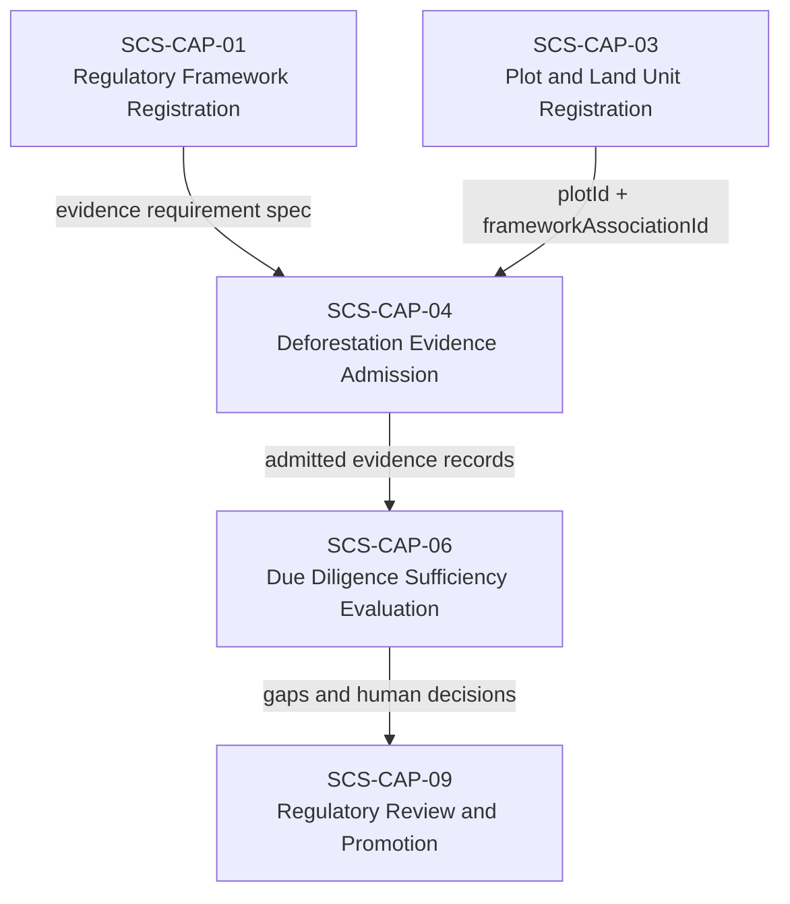
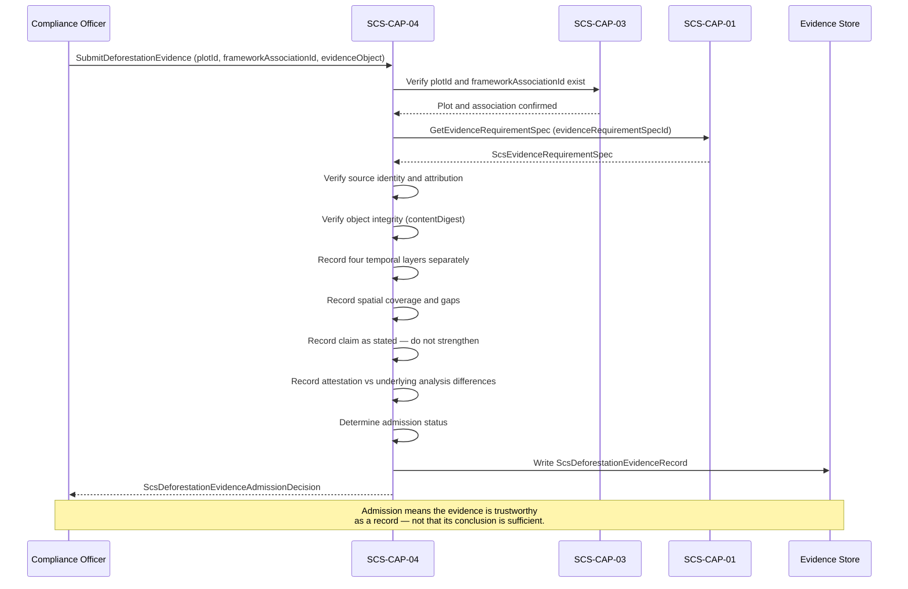

# SCS-CAP-04 — Deforestation Evidence Admission — Canonical Contract — 2026-09-22

**Status:** CANONICAL CONTRACT — NOT IMPLEMENTATION
**Domain:** Supply Chain Sovereignty (SCS)
**Authority:** DEFINES THE CONTRACT FOR SCS-CAP-04. Establishes no commissioning, production, Gate D, WP05, scientific-validity or regulatory authority. This capability is PROPOSED_NOT_ADMITTED. A pilot implementation exists; what it covers is recorded in `scs-pilot/packages/api/src/capabilities/cap-04/README.md`.

## Plain-English boundary statement

SCS-CAP-04 admits genuine, attributable, and usable deforestation evidence — satellite imagery, remote sensing analysis, land cover data products, forestry authority certificates, government records, field verification, and expert assessments — and records precisely what each item observed, analysed, and attested, including every temporal gap, spatial limitation, and claim boundary. It does not determine whether admitted evidence is sufficient for any regulatory framework. It does not make compliance determinations. It does not strengthen a source's claim beyond what the source actually declared.

## The governing sentence

> CAP-04 records exactly what the evidence observed, analysed and attested. CAP-06 decides whether the complete evidence set is sufficient for the applicable framework and period.

## What CAP-04 answers — and what it does not

**CAP-04 answers:**
> "Is this a genuine, attributable and usable evidence item, and exactly what does it observe or claim?"

**CAP-04 does not answer:**
> "Does this prove that the plot complies with EUDR?"

That second question belongs to SCS-CAP-06.

## The four temporal layers — never silently treated as equivalent

Every deforestation evidence item carries up to four distinct temporal references. CAP-04 records each separately and explicitly. They must never be merged, assumed equivalent, or silently promoted from one to another.

| Layer | Definition | Example |
|---|---|---|
| Acquisition coverage | When the satellite, sensor or authority actually observed the plot | 14 June 2023 |
| Analysis coverage | The period the submitted analysis says it evaluated | 31 December 2020 – 14 June 2023 |
| Attested claim coverage | The period for which an identified person or authority accepts responsibility | 1 January 2021 – 14 June 2023 |
| Framework-required period | The period derived from the applicable ScsEvidenceRequirementSpec | 1 January 2021 – due diligence date |

In this example, the evidence may support part of the framework period, but it does not automatically cover the period after 14 June 2023. CAP-06 evaluates the collective temporal coverage of all admitted evidence against the framework-required period — CAP-04 does not.

## The claim vocabulary distinction

A remote sensing result should say:

> `NO_DEFORESTATION_DETECTED`

not:

> `NO_DEFORESTATION_OCCURRED`

The first describes an analytical result subject to sensor, method, cloud cover, and detection limitations. The second is a stronger real-world conclusion that the evidence alone cannot support. CAP-04 preserves the source's actual claim without strengthening it.

## The EUDR regulatory precision

The EU Deforestation Regulation (EUDR) applies the post-31 December 2020 deforestation condition to all relevant commodities. The separate forest degradation limb, defined in Article 2(13) of the consolidated EUDR text, specifically concerns relevant products containing or made using wood.

The framework specification registered through SCS-CAP-01 — not CAP-04 — determines which assessment type applies to a given commodity. A rubber operator is not assessed against the forest degradation standard. A timber operator is assessed against both. CAP-04 records the assessment type declared in the evidence item and the framework association — it does not determine which assessment type is required.

The 31 December 2020 reference date lives in the versioned `ScsEvidenceRequirementSpec` registered through SCS-CAP-01. It is never hardcoded into CAP-04. A future regulatory amendment or a different framework can use a different date without any change to this capability.

## Domain position



## Admission flow



## Core interfaces

### Deforestation evidence record

```typescript
interface ScsDeforestationEvidenceRecord {
  // Canonical identity
  evidenceId: string;
  evidenceVersion: number;
  schemaVersion: string;

  // What plot and framework this evidence relates to
  plotId: string;
  plotVersion: number;
  frameworkAssociationId: string;
  evidenceRequirementSpecId: string;

  // What kind of evidence this is
  evidenceType:
    | "SATELLITE_IMAGE"
    | "REMOTE_SENSING_ANALYSIS"
    | "LAND_COVER_DATA_PRODUCT"
    | "FORESTRY_AUTHORITY_CERTIFICATE"
    | "GOVERNMENT_RECORD"
    | "FIELD_VERIFICATION"
    | "EXPERT_ASSESSMENT"
    | "OTHER";

  // Where the evidence came from
  source: {
    sourceId: string;
    sourceOrganizationId: string;
    sourceTitle?: string;
    providerName?: string;
    productName?: string;
    productVersion?: string;
    sourceReference: string;
    issuingAuthority?: string;
  };

  // Provenance and integrity
  provenance: {
    submittedBy: ActorReference;
    submittedAt: string;
    // The AAB-PLATFORM-01 evidence object store's objectId, when a stored file is cited
    evidenceObjectId?: string;
    originalObjectReference: string;
    contentDigest: string;
    // Set by the system: VERIFIED when the cited stored object's digest matches;
    // UNVERIFIED when no stored object is cited; FAILED is never recorded
    integrityStatus:
      | "VERIFIED"
      | "UNVERIFIED"
      | "FAILED";
    chainOfCustodyComplete: boolean;
    // If this is a derived product, what was it derived from
    derivedFromEvidenceIds?: string[];
  };

  // Spatial coverage — what area the evidence actually covers
  spatialCoverage: {
    // Identifies the GeoJSON coverage geometry submitted with the evidence
    coverageGeometryReference: string;
    // NOT_VERIFIED in the pilot: no spatial database
    intersectionWithPlot:
      | "FULL"
      | "PARTIAL"
      | "NONE"
      | "NOT_VERIFIED";
    plotCoveragePercent?: number;
    spatialResolutionMetres?: number;
    positionalAccuracyMetres?: number;
    // Areas explicitly excluded from the analysis
    excludedAreas?: Array<{
      geometryReference: string;
      reason: string;
    }>;
  };

  // Temporal coverage — four layers recorded separately
  temporalCoverage: {
    // Layer 1 — when the sensor actually observed the plot
    acquisitionInstant?: string;
    acquisitionStart?: string;
    acquisitionEnd?: string;

    // Layer 2 — what period the analysis evaluated
    analysisPeriodStart?: string;
    analysisPeriodEnd?: string;

    // Layer 3 — what period an authority accepts responsibility for
    attestedPeriodStart?: string;
    attestedPeriodEnd?: string;

    // How this evidence covers time
    coverageMode:
      | "POINT_IN_TIME"
      | "MULTIPLE_OBSERVATIONS"
      | "CONTINUOUS_MONITORING"
      | "CHANGE_ANALYSIS"
      | "AUTHORITY_ATTESTATION";

    // Known gaps within the coverage period — explicitly recorded
    knownGapPeriods: Array<{
      start: string;
      end: string;
      reason:
        | "CLOUD_COVER"
        | "NO_ACQUISITION"
        | "SENSOR_LIMITATION"
        | "DATA_UNAVAILABLE"
        | "ANALYSIS_EXCLUDED"
        | "OTHER";
    }>;
  };

  // How the analysis was conducted — if applicable
  analyticalMethod?: {
    methodName: string;
    methodVersion?: string;
    analystOrganizationId?: string;
    baselineEvidenceIds?: string[];
    comparisonEvidenceIds?: string[];

    // What the analysis was designed to detect
    detectionTarget:
      | "DEFORESTATION"
      | "FOREST_DEGRADATION"
      | "LAND_COVER_CHANGE"
      | "TREE_COVER_CHANGE"
      | "OTHER";

    minimumDetectableChange?: string;
    cloudCoverPercent?: number;
    qualityStatus:
      | "ACCEPTABLE"
      | "LIMITED"
      | "UNASSESSED";
  };

  // What the evidence actually claims — preserved as stated
  evidenceClaim: {
    // Claim vocabulary: DETECTED not OCCURRED
    claimType:
      | "NO_DEFORESTATION_DETECTED"
      | "POSSIBLE_DEFORESTATION_DETECTED"
      | "DEFORESTATION_DETECTED"
      | "NO_FOREST_DEGRADATION_DETECTED"
      | "POSSIBLE_FOREST_DEGRADATION_DETECTED"
      | "FOREST_DEGRADATION_DETECTED"
      | "INCONCLUSIVE";

    claimSummary: string;
    claimedPeriodStart?: string;
    claimedPeriodEnd?: string;

    confidence:
      | "HIGH"
      | "MEDIUM"
      | "LOW"
      | "NOT_STATED";

    // Limitations stated by the source — preserved verbatim
    limitations: string[];
  };

  // Layer 3 attestation — recorded separately from the claim
  coverageAttestation: {
    attestationProvided: boolean;
    attestingPartyId?: string;
    attestingRole?: string;
    authorityBasis?: string;
    attestedAt?: string;

    declaredCoverageStart?: string;
    declaredCoverageEnd?: string;

    // If the attested period differs from the analysis period,
    // that difference is explicitly visible here
    declarationTextReference?: string;
  };

  // Admission decision
  admission: {
    status:
      | "ADMITTED"
      | "ADMITTED_WITH_LIMITATIONS"
      | "QUARANTINED"
      | "REJECTED";

    // These flags are explicit — incomplete coverage does not
    // cause rejection, but the gap is always disclosed
    temporalCoverageCompleteAtAdmission: boolean;
    spatialCoverageCompleteAtAdmission: boolean;

    limitations: string[];
    limitationCodes: ScsDeforestationEvidenceLimitationCode[];
    admittedBy: ActorReference;
    admittedAt: string;
  };
}
```

### What an attestation cannot do

A coverage attestation is evidence — not authority over the final result. An attestation cannot transform:

- one image into continuous monitoring
- partial spatial coverage into complete coverage
- missing acquisitions into observations
- low-resolution imagery into high-resolution evidence
- an inconclusive analysis into proof of no deforestation

CAP-04 records the difference between the attested period and the underlying analytical record. If an authority attests to a broader period than the analysis supports, that difference is explicitly visible in the record.

### Admission decision

```typescript
interface ScsDeforestationEvidenceAdmissionDecision {
  decisionId: string;
  evidenceId: string;
  plotId: string;
  frameworkAssociationId: string;

  decision:
    | "ADMITTED"
    | "ADMITTED_WITH_LIMITATIONS"
    | "QUARANTINED"
    | "REJECTED";

  admissionChecks: {
    sourceIdentifiable: boolean;
    attributionEstablished: boolean;
    objectIntegrityVerified: boolean;
    evidenceRelatedToClaimedPlot: boolean;
    temporalDatesInternallyConsistent: boolean;
    attestationConsistentWithAnalysis: boolean;
    provenanceComplete: boolean;
    evidenceTypeCompatibleWithRequirement: boolean;
    submitterAuthorised: boolean;
  };

  // Incomplete temporal coverage alone does not cause rejection
  temporalCoverageCompleteAtAdmission: boolean;
  spatialCoverageCompleteAtAdmission: boolean;

  limitations: string[];
  limitationCodes: ScsDeforestationEvidenceLimitationCode[];
  rejectionReasons?: string[];

  decidedBy: ActorReference;
  decidedAt: string;
}
```

**Example — GPS-only plot with cloud cover gap admitted with limitations:**

```json
{
  "decision": "ADMITTED_WITH_LIMITATIONS",
  "temporalCoverageCompleteAtAdmission": false,
  "spatialCoverageCompleteAtAdmission": true,
  "limitations": [
    "No usable acquisition between 2021-01-01 and 2021-03-18 due to persistent cloud cover.",
    "Analysis period begins 2021-03-19. The interval 2021-01-01 to 2021-03-18 is not covered by this evidence item.",
    "SCS-CAP-06 will evaluate whether collective admitted evidence covers the full framework-required period."
  ]
}
```

Admission means the evidence is trustworthy as a record — not that its conclusion is sufficient.

## When CAP-04 rejects or quarantines

Incomplete temporal coverage does not by itself cause rejection. CAP-04 rejects or quarantines evidence when:

- the source cannot be identified
- object integrity verification fails
- the evidence does not relate to the claimed plot
- temporal dates are internally impossible or contradictory
- an attestation claims a period unsupported by the submitted analysis
- required provenance is missing
- the submitted object has been altered without lineage
- spatial coverage is falsely represented
- the evidence type is incompatible with the framework requirement
- submission or access authority is absent

For the pilot, "Admission rules for the pilot" below says which of these conditions end in
`FAIL_CLOSED` and which are admitted with a recorded limitation. An attestation that exceeds
its analysis, and incomplete lineage, are admitted with a limitation, not rejected.

## Collective sufficiency evaluation — CAP-06

These interfaces are evaluated by SCS-CAP-06, not by SCS-CAP-04; they are kept here because
they describe how admitted deforestation evidence is used. `evaluateTemporalSufficiency` is not
part of the SCS-CAP-04 provider.

**Superseded by SCS-CAP-06.** These definitions were written before SCS-CAP-06 was designed.
Where they differ, SCS-CAP-06's definitions govern: `ScsSufficiencyEvaluationRequest` in place
of `ScsDeforestationSufficiencyRequest`, and the per-plot `ScsTemporalCoverageEvaluation` in
place of `ScsTemporalCoverageResult`, with SCS-CAP-06's rules for temporal coverage.

CAP-06 evaluates all admitted evidence together. It does not apply simple date-union logic. Two items whose declared periods join together do not necessarily establish adequate coverage. CAP-06 must consider:

- whether the evidence covers the entire plot spatially
- sensor resolution and minimum detectable change
- cloud and atmospheric interference
- acquisition frequency relative to the risk of undetected change
- analytical method sensitivity
- baseline data quality
- whether land-cover change could occur undetected between observations
- whether the analysis was designed to detect the required kind of change
- contradictions between different sources
- framework-specific evidentiary standards

```typescript
interface ScsDeforestationSufficiencyRequest {
  plotId: string;
  plotVersion: number;
  frameworkAssociationId: string;
  evidenceRequirementSpecId: string;

  requiredAssessment: {
    // Derived from the framework spec — not hardcoded here
    assessmentType:
      | "DEFORESTATION"
      | "FOREST_DEGRADATION";
    referenceDate: string;
    assessmentEndDate: string;
  };

  evidenceIds: string[];
}

interface ScsTemporalCoverageResult {
  result:
    | "SUFFICIENT"
    | "GAPS_REQUIRE_HUMAN_DECISION"
    | "INSUFFICIENT"
    | "CONFLICTING_EVIDENCE"
    | "FAIL_CLOSED";

  requiredPeriod: {
    start: string;
    end: string;
  };

  // What the collective evidence set actually covers
  supportedIntervals: Array<{
    start: string;
    end: string;
    evidenceIds: string[];
    supportType: string;
  }>;

  // What is not covered — explicitly disclosed
  uncoveredIntervals: Array<{
    start: string;
    end: string;
    reason: string;
  }>;

  // This result never authorises a due diligence statement
  noAutomaticComplianceDecision: true;
}
```

## Admission rules for the pilot

These rules define `submitEvidence` for the pilot. Every condition in the failure contract ends
in `FAIL_CLOSED` and writes nothing. Everything else is admitted, with each shortfall recorded
as a limitation, never silently dropped.

### Outcomes

- **`ADMITTED` or `ADMITTED_WITH_LIMITATIONS`** are the only admission outcomes. The decision
  is `ADMITTED_WITH_LIMITATIONS` whenever at least one limitation code is recorded.
- **`QUARANTINED`** is reached only through a later `quarantineEvidence` operation, never at
  admission. Quarantine will be recorded as a separate event; the admitted record is never
  changed.
- **`REJECTED`** is reserved until its criteria are defined. A condition that would reject is
  a `FAIL_CLOSED` failure instead.

Because spatial coverage is never verified and temporal completeness is never evaluated at
admission (below), every pilot admission is `ADMITTED_WITH_LIMITATIONS`. This is the honest
result and must be disclosed to pilot partners.

### Evidence object and integrity

The evidence file itself is stored in the SCS evidence object store (AAB-PLATFORM-01), which
computes its SHA-256. The submission may cite a stored object by its `objectId`, and always
declares the file's `contentDigest`.

- **Cited object.** The object must exist in the store (`EVIDENCE_OBJECT_NOT_FOUND`), and the
  declared `contentDigest` must equal the stored digest (`OBJECT_INTEGRITY_FAILED`). When both
  hold, `integrityStatus` is `VERIFIED`.
- **No cited object.** `integrityStatus` is `UNVERIFIED`: nothing SCS holds can confirm the
  declared digest. The limitation `INTEGRITY_UNVERIFIED` is recorded.
- **Framework requirement.** When the specification's `integrityRequirement` is `VERIFIED`,
  unverified integrity fails with `OBJECT_INTEGRITY_FAILED`. This is the one specification
  requirement whose failure rejects the evidence.
- `integrityStatus: FAILED` is never recorded: a failed integrity check writes nothing.

### Fields the system sets

`evidenceId`, `evidenceVersion` (1 until a revision operation exists), `schemaVersion`,
`plotVersion` (the plot's current version), `evidenceRequirementSpecId` (from the plot's
framework association, never from the client), `provenance.submittedBy`,
`provenance.submittedAt`, `provenance.integrityStatus`, `spatialCoverage.intersectionWithPlot`
(`NOT_VERIFIED` in the pilot) and the whole `admission` block.

### Authority

Only a `COMPLIANCE_OFFICER` may submit deforestation evidence. Otherwise
`SUBMITTER_NOT_AUTHORISED`.

### Plot and framework association

- The plot must be registered (`PLOT_NOT_FOUND`) and not `RETIRED` (`PLOT_RETIRED`). A plot
  that is `REGISTERED_WITH_GAPS` is registered.
- The framework association must exist and belong to that plot
  (`FRAMEWORK_ASSOCIATION_NOT_FOUND`).
- The association must be `ACTIVE`, and so must its SCS-CAP-01 framework
  (`FRAMEWORK_ASSOCIATION_NOT_ACTIVE`).

### Spatial coverage

The coverage is a GeoJSON geometry in EPSG:4326, validated like a plot geometry
(SCS-CAP-03); an invalid geometry is `COVERAGE_GEOMETRY_INVALID`. Excluded areas are
geometries validated the same way.

- **Relation to the plot.** If the coverage's bounding box does not intersect the plot's
  bounding box, the evidence cannot relate to the plot: `EVIDENCE_NOT_RELATED_TO_PLOT`.
- **Intersection.** Beyond that bounding-box check, the intersection is not computed: there is
  no spatial database. `intersectionWithPlot` is `NOT_VERIFIED`,
  `spatialCoverageCompleteAtAdmission` is `false`, and the limitation
  `SPATIAL_COVERAGE_NOT_VERIFIED` is recorded. A declared `plotCoveragePercent` is recorded as
  declared. TODO(postgis).

### Dates

The dates must be internally consistent. Otherwise `TEMPORAL_DATES_INCONSISTENT`, naming each
inconsistency:

- in every layer, and in every known gap, a start is not after its end;
- `POINT_IN_TIME` coverage has an `acquisitionInstant`, and no instant is given together with
  an acquisition start or end;
- no date is in the future;
- every known gap lies within the evidence's acquisition or analysis window.

`temporalCoverageCompleteAtAdmission` is always `false`: the framework-required period ends on
a due diligence date that is not known at admission. The limitation
`TEMPORAL_COVERAGE_NOT_EVALUATED` is recorded; SCS-CAP-06 evaluates completeness when it knows
the required period.

### Attestation

An attestation that claims a period the submitted analysis does not support is admitted, not
rejected: CAP-04 records what the evidence attested, including an overclaim.

- **`ATTESTATION_EXCEEDS_ANALYSIS`** (a limitation): the attested period (`attestedPeriodStart`
  to `attestedPeriodEnd`, or the attestation's `declaredCoverageStart` to
  `declaredCoverageEnd`) begins before the analysis period begins or ends after it ends. The
  record shows both periods; SCS-CAP-06 decides whether the difference matters.
- An item with `coverageMode: AUTHORITY_ATTESTATION` and no analysis period cannot exceed an
  analysis period that does not exist, and is exempt from this check.

### Compatibility with the framework specification

The SCS-CAP-01 specification's `deforestationEvidence` requirements are applied as follows:

- **Accepted source types.** A specification's `acceptedSourceTypes` must use this contract's
  `evidenceType` values. An `evidenceType` that is not among the accepted source types is
  incompatible: `EVIDENCE_TYPE_INCOMPATIBLE`. Values in `acceptedSourceTypes` that are not
  `evidenceType` values are ignored for the check and recorded as the limitation
  `SOURCE_TYPE_VOCABULARY_UNKNOWN`.
- **Resolution.** A `spatialResolutionMetres` coarser than `minimumResolutionMetres`, or not
  stated when a minimum is set, is the limitation `RESOLUTION_BELOW_REQUIREMENT`.
- **Recency.** When `minimumRecencyDays` is set and the most recent observation
  (`acquisitionInstant` or `acquisitionEnd`) is older than that many days at admission, the
  limitation is `RECENCY_BELOW_REQUIREMENT`. With no acquisition date, recency cannot be
  evaluated: `RECENCY_NOT_EVALUATED`.
- **Integrity.** See "Evidence object and integrity" above.
- **Authority confirmation.** When `authorityConfirmationRequired` is `true` and no attestation
  is provided, the limitation is `AUTHORITY_CONFIRMATION_MISSING`.

### Provenance and lineage

- **Lineage.** Each of `derivedFromEvidenceIds`, `baselineEvidenceIds` and
  `comparisonEvidenceIds` should name an admitted CAP-04 record for the same plot. A cited
  identifier that does not is the limitation `PROVENANCE_INCOMPLETE`, naming it. Admission
  proceeds: lineage is often established after the fact.
- **Chain of custody.** `chainOfCustodyComplete` is recorded as declared. When it is `false`,
  the limitation `CHAIN_OF_CUSTODY_INCOMPLETE` is recorded.

### Parties

- `coverageAttestation.attestingPartyId`, when present, must be a registered SCS-CAP-02 party
  (`ATTESTING_PARTY_NOT_FOUND`).
- `analyticalMethod.analystOrganizationId`, when present, must be a registered SCS-CAP-02 party
  (`ANALYST_PARTY_NOT_FOUND`).
- Neither may be `RETIRED` (`PARTY_RETIRED`).
- `source.sourceOrganizationId` is an identifier issued outside SCS and is recorded as given.

### Limitation codes

A limitation code is not a failure. It is recorded with the evidence and in the decision, and
makes the decision `ADMITTED_WITH_LIMITATIONS`. The source's own stated limitations are kept
verbatim in `evidenceClaim.limitations`.

```typescript
type ScsDeforestationEvidenceLimitationCode =
  | "SPATIAL_COVERAGE_NOT_VERIFIED"
  | "TEMPORAL_COVERAGE_NOT_EVALUATED"
  | "INTEGRITY_UNVERIFIED"
  | "ATTESTATION_EXCEEDS_ANALYSIS"
  | "PROVENANCE_INCOMPLETE"
  | "CHAIN_OF_CUSTODY_INCOMPLETE"
  | "RESOLUTION_BELOW_REQUIREMENT"
  | "RECENCY_BELOW_REQUIREMENT"
  | "RECENCY_NOT_EVALUATED"
  | "AUTHORITY_CONFIRMATION_MISSING"
  | "SOURCE_TYPE_VOCABULARY_UNKNOWN";
```

### Submission request

```typescript
interface ScsDeforestationEvidenceSubmissionRequest {
  plotId: string;
  frameworkAssociationId: string;

  evidenceType:
    | "SATELLITE_IMAGE"
    | "REMOTE_SENSING_ANALYSIS"
    | "LAND_COVER_DATA_PRODUCT"
    | "FORESTRY_AUTHORITY_CERTIFICATE"
    | "GOVERNMENT_RECORD"
    | "FIELD_VERIFICATION"
    | "EXPERT_ASSESSMENT"
    | "OTHER";

  // As in ScsDeforestationEvidenceRecord.source
  source: ScsDeforestationEvidenceRecord["source"];

  evidenceObject: {
    // The AAB-PLATFORM-01 objectId of the stored file, when one is cited
    objectId?: string;
    // The source's own reference to the original object
    originalObjectReference: string;
    // Lowercase hexadecimal SHA-256 of the file
    contentDigest: string;
    chainOfCustodyComplete: boolean;
    derivedFromEvidenceIds?: string[];
  };

  spatialCoverage: {
    coverageGeometry: {
      geometryType: "POINT" | "POLYGON" | "MULTIPOLYGON";
      coordinates: unknown;
      coordinateReferenceSystem: string;
    };
    // Declared by the submitter; not computed in the pilot
    plotCoveragePercent?: number;
    spatialResolutionMetres?: number;
    positionalAccuracyMetres?: number;
    excludedAreas?: Array<{
      geometry: {
        geometryType: "POINT" | "POLYGON" | "MULTIPOLYGON";
        coordinates: unknown;
        coordinateReferenceSystem: string;
      };
      reason: string;
    }>;
  };

  // As in the record
  temporalCoverage: ScsDeforestationEvidenceRecord["temporalCoverage"];
  analyticalMethod?: ScsDeforestationEvidenceRecord["analyticalMethod"];
  evidenceClaim: ScsDeforestationEvidenceRecord["evidenceClaim"];
  coverageAttestation: ScsDeforestationEvidenceRecord["coverageAttestation"];
}
```

In the record, `spatialCoverage.coverageGeometryReference` and each excluded area's
`geometryReference` identify the geometries submitted in this request, which SCS stores with
the record.

### Checks and the decision

The failure checks run in this order: authority; dates; coverage geometry; the plot and
framework association; the evidence object and integrity; relation to the plot; evidence type
compatibility; parties. The admission checks in the decision record the outcome of each:

- `submitterAuthorised`, `sourceIdentifiable`, `attributionEstablished`,
  `temporalDatesInternallyConsistent` and `evidenceTypeCompatibleWithRequirement` are `true`
  whenever evidence is admitted.
- `sourceIdentifiable` rests on the required source fields (`sourceId`,
  `sourceOrganizationId`, `sourceReference`). `attributionEstablished` rests on those fields,
  the submitter's authority, and the attesting and analyst parties being registered.
- `evidenceRelatedToClaimedPlot` is `true` when the bounding-box check passes; the decision
  states that the full intersection was not verified.
- `objectIntegrityVerified` is `true` only when `integrityStatus` is `VERIFIED`.
- `attestationConsistentWithAnalysis` is `false` when `ATTESTATION_EXCEEDS_ANALYSIS` is
  recorded.
- `provenanceComplete` is `false` when `PROVENANCE_INCOMPLETE` or
  `CHAIN_OF_CUSTODY_INCOMPLETE` is recorded.

The decision gains `limitationCodes`, the codes recorded, alongside the human-readable
`limitations`.

### Open gaps

**Contract gap: submission under a mandate.** An SCS-CAP-02 mandate may permit
`SUBMIT_DEFORESTATION_EVIDENCE`, but an authenticated actor is not linked to a CAP-02 party:
`ActorReference` has no `partyId`. Until that link exists, only a `COMPLIANCE_OFFICER` may
submit, and mandate-based submission is deferred.

**Contract gap: two attested periods.** The record carries an attested period in
`temporalCoverage` (`attestedPeriodStart`, `attestedPeriodEnd`) and another in
`coverageAttestation` (`declaredCoverageStart`, `declaredCoverageEnd`). Which is
authoritative, and whether they must agree, is not defined. Both are recorded and both are
checked against the analysis period.

**Contract gap: claimed period and analysis period.** Whether `evidenceClaim`'s claimed period
must lie within the analysis period is not defined, and is not checked.

**Contract gap: `REJECTED` and `QUARANTINED`.** No criteria are defined for rejection at
admission, and `quarantineEvidence` is not yet specified as a request and decision.

**Contract gap: sufficiency interfaces.** `ScsDeforestationSufficiencyRequest` and
`ScsTemporalCoverageResult` describe SCS-CAP-06's evaluation. `evaluateTemporalSufficiency`
is not part of the CAP-04 provider.

**Current system limit: spatial verification.** Without a spatial database, only a
bounding-box check relates coverage to the plot. TODO(postgis).

## Provider-neutral interface

```typescript
interface ScsDeforestationEvidenceProvider {
  submitEvidence(
    request: ScsDeforestationEvidenceSubmissionRequest
  ): Promise<ScsDeforestationEvidenceAdmissionDecision>;

  getEvidenceRecord(
    evidenceId: string,
    version?: number
  ): Promise<ScsDeforestationEvidenceRecord>;

  listEvidenceForPlot(
    plotId: string,
    frameworkAssociationId?: string
  ): Promise<ScsDeforestationEvidenceRecord[]>;

  quarantineEvidence(
    evidenceId: string,
    reason: string,
    quarantinedBy: ActorReference
  ): Promise<void>;
}
```

## Failure contract

```typescript
interface ScsDeforestationEvidenceAdmissionFailure {
  ok: false;
  capabilityId: "SCS-CAP-04";
  result: "FAIL_CLOSED";

  // ATTESTATION_EXCEEDS_ANALYSIS and PROVENANCE_INCOMPLETE are limitation codes,
  // not failures: see "Admission rules for the pilot"
  error:
    | "SUBMITTER_NOT_AUTHORISED"
    | "PLOT_NOT_FOUND"
    | "PLOT_RETIRED"
    | "FRAMEWORK_ASSOCIATION_NOT_FOUND"
    | "FRAMEWORK_ASSOCIATION_NOT_ACTIVE"
    | "SOURCE_NOT_IDENTIFIABLE"
    | "EVIDENCE_OBJECT_NOT_FOUND"
    | "OBJECT_INTEGRITY_FAILED"
    | "COVERAGE_GEOMETRY_INVALID"
    | "EVIDENCE_NOT_RELATED_TO_PLOT"
    | "TEMPORAL_DATES_INCONSISTENT"
    | "EVIDENCE_TYPE_INCOMPATIBLE"
    | "ATTESTING_PARTY_NOT_FOUND"
    | "ANALYST_PARTY_NOT_FOUND"
    | "PARTY_RETIRED"
    | "DEPENDENCY_UNAVAILABLE";

  reasons: string[];
  noWrites: true;
  noEvidenceAdmitted: true;
}
```

## What this document does not establish

- It does not admit SCS-CAP-04 as a canonical capability — that requires the ten-point admission checklist
- It does not implement, deploy or migrate anything
- It does not determine whether any admitted evidence is sufficient for any regulatory framework — that is SCS-CAP-06's function
- It does not make any compliance determination on behalf of any operator
- It does not confirm that evidence admitted through this capability will satisfy any specific EU customs authority's current interpretation of EUDR requirements
- The 31 December 2020 reference date is an example derived from the current EUDR text — it lives in the versioned framework specification registered through SCS-CAP-01, not in this capability
- It does not alter commissioning status, satisfy Gate D, close WP05, or grant any production or commissioning authority
