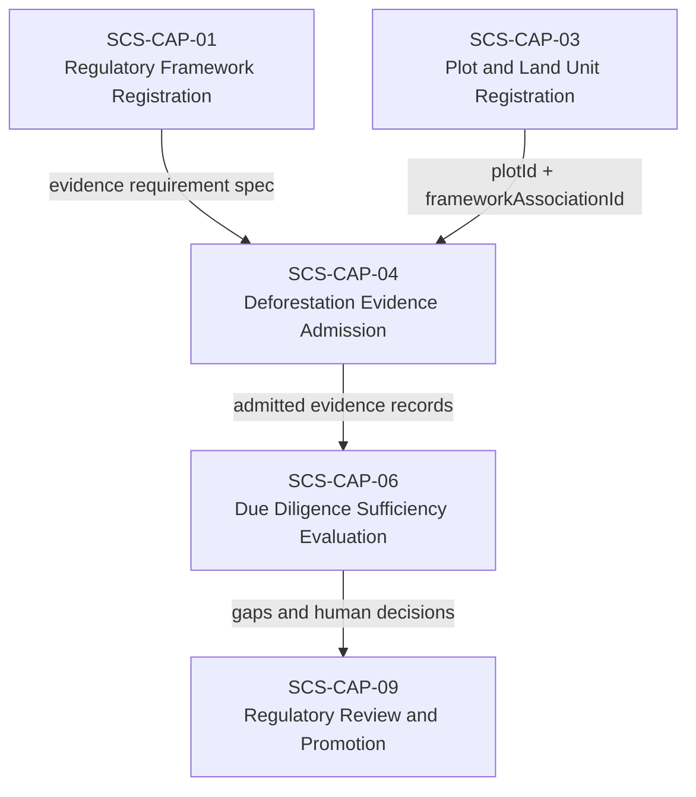
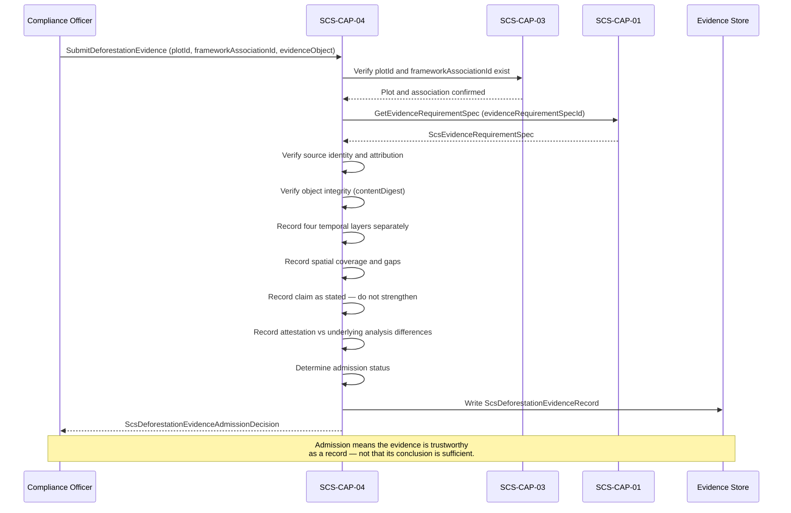

# SCS-CAP-04 — Deforestation Evidence Admission — Canonical Contract — 2026-09-22

**Status:** CANONICAL CONTRACT — NOT IMPLEMENTATION
**Domain:** Supply Chain Sovereignty (SCS)
**Authority:** DEFINES THE CONTRACT FOR SCS-CAP-04. Establishes no commissioning, production, Gate D, WP05, scientific-validity or regulatory authority. This capability is PROPOSED_NOT_ADMITTED. No implementation exists.

## Plain-English boundary statement

SCS-CAP-04 admits genuine, attributable, and usable deforestation evidence — satellite imagery, remote sensing analysis, land cover data products, forestry authority certificates, government records, field verification, and expert assessments — and records precisely what each item observed, analysed, and attested, including every temporal gap, spatial limitation, and claim boundary. It does not determine whether admitted evidence is sufficient for any regulatory framework. It does not make compliance determinations. It does not strengthen a source's claim beyond what the source actually declared.

## The governing sentence

> CAP-04 records exactly what the evidence observed, analysed and attested. CAP-06 decides whether the complete evidence set is sufficient for the applicable framework and period.

## What CAP-04 answers — and what it does not

**CAP-04 answers:**
> "Is this a genuine, attributable and usable evidence item, and exactly what does it observe or claim?"

**CAP-04 does not answer:**
> "Does this prove that the plot complies with EUDR?"

That second question belongs to SCS-CAP-06.

## The four temporal layers — never silently treated as equivalent

Every deforestation evidence item carries up to four distinct temporal references. CAP-04 records each separately and explicitly. They must never be merged, assumed equivalent, or silently promoted from one to another.

| Layer | Definition | Example |
|---|---|---|
| Acquisition coverage | When the satellite, sensor or authority actually observed the plot | 14 June 2023 |
| Analysis coverage | The period the submitted analysis says it evaluated | 31 December 2020 – 14 June 2023 |
| Attested claim coverage | The period for which an identified person or authority accepts responsibility | 1 January 2021 – 14 June 2023 |
| Framework-required period | The period derived from the applicable ScsEvidenceRequirementSpec | 1 January 2021 – due diligence date |

In this example, the evidence may support part of the framework period, but it does not automatically cover the period after 14 June 2023. CAP-06 evaluates the collective temporal coverage of all admitted evidence against the framework-required period — CAP-04 does not.

## The claim vocabulary distinction

A remote sensing result should say:

> `NO_DEFORESTATION_DETECTED`

not:

> `NO_DEFORESTATION_OCCURRED`

The first describes an analytical result subject to sensor, method, cloud cover, and detection limitations. The second is a stronger real-world conclusion that the evidence alone cannot support. CAP-04 preserves the source's actual claim without strengthening it.

## The EUDR regulatory precision

The EU Deforestation Regulation (EUDR) applies the post-31 December 2020 deforestation condition to all relevant commodities. The separate forest degradation limb, defined in Article 2(13) of the consolidated EUDR text, specifically concerns relevant products containing or made using wood.

The framework specification registered through SCS-CAP-01 — not CAP-04 — determines which assessment type applies to a given commodity. A rubber operator is not assessed against the forest degradation standard. A timber operator is assessed against both. CAP-04 records the assessment type declared in the evidence item and the framework association — it does not determine which assessment type is required.

The 31 December 2020 reference date lives in the versioned `ScsEvidenceRequirementSpec` registered through SCS-CAP-01. It is never hardcoded into CAP-04. A future regulatory amendment or a different framework can use a different date without any change to this capability.

## Domain position



## Admission flow



## Core interfaces

### Deforestation evidence record

```typescript
interface ScsDeforestationEvidenceRecord {
  // Canonical identity
  evidenceId: string;
  evidenceVersion: number;
  schemaVersion: string;

  // What plot and framework this evidence relates to
  plotId: string;
  plotVersion: number;
  frameworkAssociationId: string;
  evidenceRequirementSpecId: string;

  // What kind of evidence this is
  evidenceType:
    | "SATELLITE_IMAGE"
    | "REMOTE_SENSING_ANALYSIS"
    | "LAND_COVER_DATA_PRODUCT"
    | "FORESTRY_AUTHORITY_CERTIFICATE"
    | "GOVERNMENT_RECORD"
    | "FIELD_VERIFICATION"
    | "EXPERT_ASSESSMENT"
    | "OTHER";

  // Where the evidence came from
  source: {
    sourceId: string;
    sourceOrganizationId: string;
    sourceTitle?: string;
    providerName?: string;
    productName?: string;
    productVersion?: string;
    sourceReference: string;
    issuingAuthority?: string;
  };

  // Provenance and integrity
  provenance: {
    submittedBy: ActorReference;
    submittedAt: string;
    originalObjectReference: string;
    contentDigest: string;
    integrityStatus:
      | "VERIFIED"
      | "UNVERIFIED"
      | "FAILED";
    chainOfCustodyComplete: boolean;
    // If this is a derived product, what was it derived from
    derivedFromEvidenceIds?: string[];
  };

  // Spatial coverage — what area the evidence actually covers
  spatialCoverage: {
    coverageGeometryReference: string;
    intersectionWithPlot:
      | "FULL"
      | "PARTIAL"
      | "NONE"
      | "NOT_VERIFIED";
    plotCoveragePercent?: number;
    spatialResolutionMetres?: number;
    positionalAccuracyMetres?: number;
    // Areas explicitly excluded from the analysis
    excludedAreas?: Array<{
      geometryReference: string;
      reason: string;
    }>;
  };

  // Temporal coverage — four layers recorded separately
  temporalCoverage: {
    // Layer 1 — when the sensor actually observed the plot
    acquisitionInstant?: string;
    acquisitionStart?: string;
    acquisitionEnd?: string;

    // Layer 2 — what period the analysis evaluated
    analysisPeriodStart?: string;
    analysisPeriodEnd?: string;

    // Layer 3 — what period an authority accepts responsibility for
    attestedPeriodStart?: string;
    attestedPeriodEnd?: string;

    // How this evidence covers time
    coverageMode:
      | "POINT_IN_TIME"
      | "MULTIPLE_OBSERVATIONS"
      | "CONTINUOUS_MONITORING"
      | "CHANGE_ANALYSIS"
      | "AUTHORITY_ATTESTATION";

    // Known gaps within the coverage period — explicitly recorded
    knownGapPeriods: Array<{
      start: string;
      end: string;
      reason:
        | "CLOUD_COVER"
        | "NO_ACQUISITION"
        | "SENSOR_LIMITATION"
        | "DATA_UNAVAILABLE"
        | "ANALYSIS_EXCLUDED"
        | "OTHER";
    }>;
  };

  // How the analysis was conducted — if applicable
  analyticalMethod?: {
    methodName: string;
    methodVersion?: string;
    analystOrganizationId?: string;
    baselineEvidenceIds?: string[];
    comparisonEvidenceIds?: string[];

    // What the analysis was designed to detect
    detectionTarget:
      | "DEFORESTATION"
      | "FOREST_DEGRADATION"
      | "LAND_COVER_CHANGE"
      | "TREE_COVER_CHANGE"
      | "OTHER";

    minimumDetectableChange?: string;
    cloudCoverPercent?: number;
    qualityStatus:
      | "ACCEPTABLE"
      | "LIMITED"
      | "UNASSESSED";
  };

  // What the evidence actually claims — preserved as stated
  evidenceClaim: {
    // Claim vocabulary: DETECTED not OCCURRED
    claimType:
      | "NO_DEFORESTATION_DETECTED"
      | "POSSIBLE_DEFORESTATION_DETECTED"
      | "DEFORESTATION_DETECTED"
      | "NO_FOREST_DEGRADATION_DETECTED"
      | "POSSIBLE_FOREST_DEGRADATION_DETECTED"
      | "FOREST_DEGRADATION_DETECTED"
      | "INCONCLUSIVE";

    claimSummary: string;
    claimedPeriodStart?: string;
    claimedPeriodEnd?: string;

    confidence:
      | "HIGH"
      | "MEDIUM"
      | "LOW"
      | "NOT_STATED";

    // Limitations stated by the source — preserved verbatim
    limitations: string[];
  };

  // Layer 3 attestation — recorded separately from the claim
  coverageAttestation: {
    attestationProvided: boolean;
    attestingPartyId?: string;
    attestingRole?: string;
    authorityBasis?: string;
    attestedAt?: string;

    declaredCoverageStart?: string;
    declaredCoverageEnd?: string;

    // If the attested period differs from the analysis period,
    // that difference is explicitly visible here
    declarationTextReference?: string;
  };

  // Admission decision
  admission: {
    status:
      | "ADMITTED"
      | "ADMITTED_WITH_LIMITATIONS"
      | "QUARANTINED"
      | "REJECTED";

    // These flags are explicit — incomplete coverage does not
    // cause rejection, but the gap is always disclosed
    temporalCoverageCompleteAtAdmission: boolean;
    spatialCoverageCompleteAtAdmission: boolean;

    limitations: string[];
    admittedBy: ActorReference;
    admittedAt: string;
  };
}
```

### What an attestation cannot do

A coverage attestation is evidence — not authority over the final result. An attestation cannot transform:

- one image into continuous monitoring
- partial spatial coverage into complete coverage
- missing acquisitions into observations
- low-resolution imagery into high-resolution evidence
- an inconclusive analysis into proof of no deforestation

CAP-04 records the difference between the attested period and the underlying analytical record. If an authority attests to a broader period than the analysis supports, that difference is explicitly visible in the record.

### Admission decision

```typescript
interface ScsDeforestationEvidenceAdmissionDecision {
  decisionId: string;
  evidenceId: string;
  plotId: string;
  frameworkAssociationId: string;

  decision:
    | "ADMITTED"
    | "ADMITTED_WITH_LIMITATIONS"
    | "QUARANTINED"
    | "REJECTED";

  admissionChecks: {
    sourceIdentifiable: boolean;
    attributionEstablished: boolean;
    objectIntegrityVerified: boolean;
    evidenceRelatedToClaimedPlot: boolean;
    temporalDatesInternallyConsistent: boolean;
    attestationConsistentWithAnalysis: boolean;
    provenanceComplete: boolean;
    evidenceTypeCompatibleWithRequirement: boolean;
    submitterAuthorised: boolean;
  };

  // Incomplete temporal coverage alone does not cause rejection
  temporalCoverageCompleteAtAdmission: boolean;
  spatialCoverageCompleteAtAdmission: boolean;

  limitations: string[];
  rejectionReasons?: string[];

  decidedBy: ActorReference;
  decidedAt: string;
}
```

**Example — GPS-only plot with cloud cover gap admitted with limitations:**

```json
{
  "decision": "ADMITTED_WITH_LIMITATIONS",
  "temporalCoverageCompleteAtAdmission": false,
  "spatialCoverageCompleteAtAdmission": true,
  "limitations": [
    "No usable acquisition between 2021-01-01 and 2021-03-18 due to persistent cloud cover.",
    "Analysis period begins 2021-03-19. The interval 2021-01-01 to 2021-03-18 is not covered by this evidence item.",
    "SCS-CAP-06 will evaluate whether collective admitted evidence covers the full framework-required period."
  ]
}
```

Admission means the evidence is trustworthy as a record — not that its conclusion is sufficient.

## When CAP-04 rejects or quarantines

Incomplete temporal coverage does not by itself cause rejection. CAP-04 rejects or quarantines evidence when:

- the source cannot be identified
- object integrity verification fails
- the evidence does not relate to the claimed plot
- temporal dates are internally impossible or contradictory
- an attestation claims a period unsupported by the submitted analysis
- required provenance is missing
- the submitted object has been altered without lineage
- spatial coverage is falsely represented
- the evidence type is incompatible with the framework requirement
- submission or access authority is absent

## Collective sufficiency evaluation — CAP-06

CAP-06 evaluates all admitted evidence together. It does not apply simple date-union logic. Two items whose declared periods join together do not necessarily establish adequate coverage. CAP-06 must consider:

- whether the evidence covers the entire plot spatially
- sensor resolution and minimum detectable change
- cloud and atmospheric interference
- acquisition frequency relative to the risk of undetected change
- analytical method sensitivity
- baseline data quality
- whether land-cover change could occur undetected between observations
- whether the analysis was designed to detect the required kind of change
- contradictions between different sources
- framework-specific evidentiary standards

```typescript
interface ScsDeforestationSufficiencyRequest {
  plotId: string;
  plotVersion: number;
  frameworkAssociationId: string;
  evidenceRequirementSpecId: string;

  requiredAssessment: {
    // Derived from the framework spec — not hardcoded here
    assessmentType:
      | "DEFORESTATION"
      | "FOREST_DEGRADATION";
    referenceDate: string;
    assessmentEndDate: string;
  };

  evidenceIds: string[];
}

interface ScsTemporalCoverageResult {
  result:
    | "SUFFICIENT"
    | "GAPS_REQUIRE_HUMAN_DECISION"
    | "INSUFFICIENT"
    | "CONFLICTING_EVIDENCE"
    | "FAIL_CLOSED";

  requiredPeriod: {
    start: string;
    end: string;
  };

  // What the collective evidence set actually covers
  supportedIntervals: Array<{
    start: string;
    end: string;
    evidenceIds: string[];
    supportType: string;
  }>;

  // What is not covered — explicitly disclosed
  uncoveredIntervals: Array<{
    start: string;
    end: string;
    reason: string;
  }>;

  // This result never authorises a due diligence statement
  noAutomaticComplianceDecision: true;
}
```

## Provider-neutral interface

```typescript
interface ScsDeforestationEvidenceProvider {
  submitEvidence(
    request: ScsDeforestationEvidenceSubmissionRequest
  ): Promise<ScsDeforestationEvidenceAdmissionDecision>;

  getEvidenceRecord(
    evidenceId: string,
    version?: number
  ): Promise<ScsDeforestationEvidenceRecord>;

  listEvidenceForPlot(
    plotId: string,
    frameworkAssociationId?: string
  ): Promise<ScsDeforestationEvidenceRecord[]>;

  quarantineEvidence(
    evidenceId: string,
    reason: string,
    quarantinedBy: ActorReference
  ): Promise<void>;

  evaluateTemporalSufficiency(
    request: ScsDeforestationSufficiencyRequest
  ): Promise<ScsTemporalCoverageResult>;
}
```

## Failure contract

```typescript
interface ScsDeforestationEvidenceAdmissionFailure {
  ok: false;
  capabilityId: "SCS-CAP-04";
  result: "FAIL_CLOSED";

  error:
    | "SUBMITTER_NOT_AUTHORISED"
    | "PLOT_NOT_FOUND"
    | "FRAMEWORK_ASSOCIATION_NOT_FOUND"
    | "SOURCE_NOT_IDENTIFIABLE"
    | "OBJECT_INTEGRITY_FAILED"
    | "EVIDENCE_NOT_RELATED_TO_PLOT"
    | "TEMPORAL_DATES_INCONSISTENT"
    | "ATTESTATION_EXCEEDS_ANALYSIS"
    | "PROVENANCE_INCOMPLETE"
    | "EVIDENCE_TYPE_INCOMPATIBLE"
    | "DEPENDENCY_UNAVAILABLE";

  reasons: string[];
  noWrites: true;
  noEvidenceAdmitted: true;
}
```

## What this document does not establish

- It does not admit SCS-CAP-04 as a canonical capability — that requires the ten-point admission checklist
- It does not implement, deploy or migrate anything
- It does not determine whether any admitted evidence is sufficient for any regulatory framework — that is SCS-CAP-06's function
- It does not make any compliance determination on behalf of any operator
- It does not confirm that evidence admitted through this capability will satisfy any specific EU customs authority's current interpretation of EUDR requirements
- The 31 December 2020 reference date is an example derived from the current EUDR text — it lives in the versioned framework specification registered through SCS-CAP-01, not in this capability
- It does not alter commissioning status, satisfy Gate D, close WP05, or grant any production or commissioning authority
