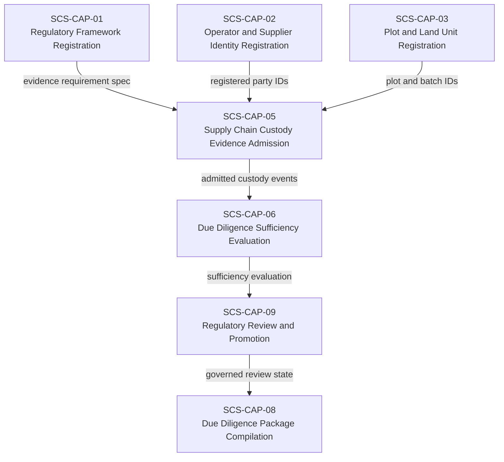
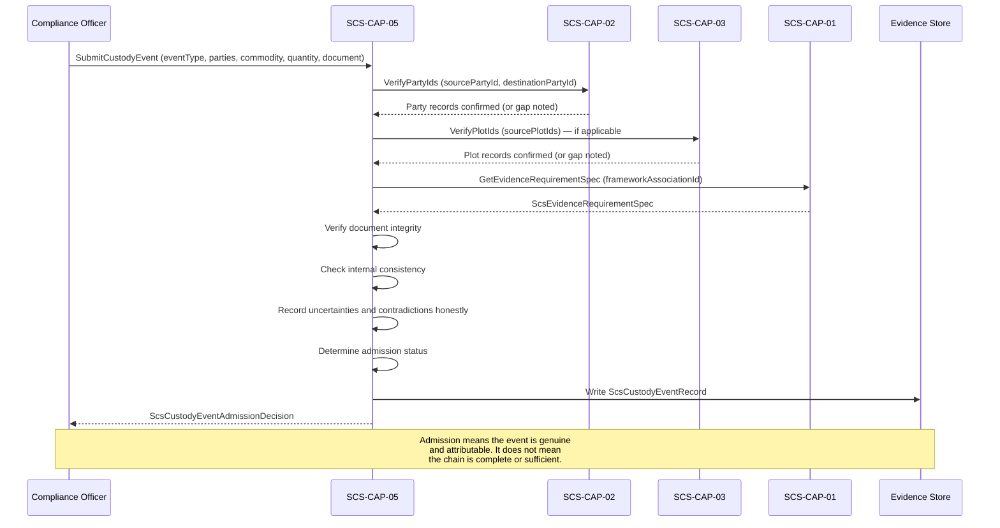

# SCS-CAP-05 — Supply Chain Custody Evidence Admission — Canonical Contract — 2026-09-23

**Status:** CANONICAL CONTRACT — NOT IMPLEMENTATION
**Domain:** Supply Chain Sovereignty (SCS)
**Authority:** DEFINES THE CONTRACT FOR SCS-CAP-05. Establishes no commissioning,
production, Gate D, WP05, scientific-validity or regulatory authority. This
capability is PROPOSED_NOT_ADMITTED. No implementation exists.

## Plain-English boundary statement

SCS-CAP-05 admits genuine, attributable, and usable supply chain custody
evidence — purchase records, transport documents, processing facility
certifications, weighing records, transformation records, and chain of custody
certificates — and records precisely what each item covers: which parties,
which commodity batch, which event type, which quantities, which location, and
which time. It does not determine whether the collective custody chain is
sufficiently continuous or consistent for any regulatory framework. It does not
produce due diligence statements. It does not verify the identity of any party —
that is SCS-CAP-02's function. It does not evaluate sufficiency — that is
SCS-CAP-06's function.

## The governing principle

> CAP-05 records custody events honestly. CAP-06 evaluates whether the
> collective chain of admitted events is sufficiently continuous and consistent
> for the applicable framework and period.

## Custody evidence records events — not chains

CAP-05 does not admit a "chain of custody" as a single object. It admits
individual custody events. Each event is a discrete, attributable record of
something that happened — a purchase, a transfer, a weighing, a transformation,
a certification — at a specific time, between specific parties, involving a
specific commodity batch.

The chain emerges from the collective set of admitted events when evaluated by
CAP-06. CAP-05 never asserts chain continuity. Several admitted custody
documents do not automatically constitute a continuous, verified chain.

## What each custody event must preserve

Every admitted custody event record preserves:

- Source and destination parties — linked to CAP-02 registered party IDs
- Plot, batch, and commodity identifiers — linked to CAP-03 plot records where applicable
- Event type — what happened
- Quantity and unit — how much commodity was involved
- Event time and location — when and where
- Supporting document — what evidence supports this event
- Submitting authority — who submitted this record and on what mandate
- Transformations, splits, and consolidations — how the commodity changed form or quantity
- Uncertainties and contradictions — honest disclosure of what is unknown or disputed
- Predecessor and successor references — how this event connects to adjacent events

## Domain position



## Core interfaces

### Custody event record

```typescript
interface ScsCustodyEventRecord {
  // Canonical identity
  eventId: string;
  eventVersion: number;
  schemaVersion: string;

  // What framework and evidence requirement this event relates to
  frameworkAssociationId: string;
  evidenceRequirementSpecId: string;

  // What kind of custody event this is
  eventType:
    | "PURCHASE"
    | "TRANSFER"
    | "WEIGHING"
    | "PROCESSING"
    | "TRANSFORMATION"
    | "SPLIT"
    | "CONSOLIDATION"
    | "EXPORT"
    | "IMPORT"
    | "CERTIFICATION"
    | "INSPECTION"
    | "OTHER";

  // Parties involved — linked to CAP-02 registered IDs
  sourceParty: {
    partyId: string;
    partyVersion: number;
    partyRoleAtEvent:
      | "SUPPLIER"
      | "AGGREGATOR"
      | "PROCESSOR"
      | "EXPORTER"
      | "OTHER";
    // Representation mandate if submitting on behalf of another party
    actingUnderMandateId?: string;
  };

  destinationParty: {
    partyId: string;
    partyVersion: number;
    partyRoleAtEvent:
      | "AGGREGATOR"
      | "PROCESSOR"
      | "EXPORTER"
      | "IMPORTER"
      | "OTHER";
  };

  // Commodity and batch — linked to CAP-03 where applicable
  commodity: {
    commodityCode: string;
    commodityName: string;
    // Plot IDs from CAP-03 — where the commodity originated
    // May be empty for downstream events where plot traceability
    // has not yet been established
    sourcePlotIds: string[];
    sourcePlotIdsComplete: boolean;
    batchIdentifier: string;
    batchVersion?: number;
  };

  // Quantity — what moved or changed
  quantity: {
    amount: number;
    unit: string;
    measurementMethod?: string;
    measurementUncertainty?: string;
  };

  // When and where
  eventLocation: {
    countryCode: string;
    administrativeArea?: string;
    facilityId?: string;
    facilityName?: string;
    coordinates?: {
      latitude: number;
      longitude: number;
      accuracyMetres?: number;
    };
  };

  eventTime: {
    eventDate: string;
    eventTimeUTC?: string;
    timePrecision:
      | "EXACT"
      | "DATE_ONLY"
      | "APPROXIMATE"
      | "UNKNOWN";
  };

  // Transformations — how the commodity changed
  transformation?: {
    transformationType:
      | "DRYING"
      | "MILLING"
      | "PRESSING"
      | "BLENDING"
      | "GRADING"
      | "PACKAGING"
      | "OTHER";
    inputQuantity: number;
    inputUnit: string;
    outputQuantity: number;
    outputUnit: string;
    conversionRatioDescription?: string;
  };

  // Splits and consolidations
  predecessorEventIds: string[];
  successorEventIds: string[];
  splitFromEventId?: string;
  consolidatedFromEventIds?: string[];

  // Supporting document
  supportingDocument: {
    documentId: string;
    documentType:
      | "PURCHASE_RECEIPT"
      | "WEIGHT_TICKET"
      | "TRANSPORT_DOCUMENT"
      | "PROCESSING_RECORD"
      | "CERTIFICATION_DOCUMENT"
      | "INSPECTION_REPORT"
      | "CUSTOMS_DECLARATION"
      | "OTHER";
    documentReference: string;
    issuingAuthority?: string;
    documentDate?: string;
    contentDigest: string;
    integrityStatus:
      | "VERIFIED"
      | "UNVERIFIED"
      | "FAILED";
  };

  // Provenance — who submitted this record and on what authority
  provenance: {
    submittedBy: ActorReference;
    submittedAt: string;
    // Mandate under which submission was made — links to CAP-02
    submissionMandateId?: string;
    chainOfCustodyComplete: boolean;
  };

  // Honest disclosure of uncertainties and contradictions
  uncertainties: string[];
  contradictions: string[];
  knownGaps: string[];

  // Admission decision
  admission: {
    status:
      | "ADMITTED"
      | "ADMITTED_WITH_LIMITATIONS"
      | "QUARANTINED"
      | "REJECTED";
    limitations: string[];
    admittedBy: ActorReference;
    admittedAt: string;
  };
}
```

### What admission means — and does not mean

`admission.status: ADMITTED` means the custody event record is genuine,
attributable, internally consistent, and usable as evidence. It does not mean:

- The custody chain is complete or continuous
- The commodity batch is traceable to deforestation-free plots
- The parties involved have been independently verified
- The quantities are accurate beyond what the document states
- The event constitutes proof of legal compliance
- CAP-06 will find the collective chain sufficient

`ADMITTED_WITH_LIMITATIONS` means the record is genuine and usable but carries
explicit limitations — missing quantity precision, uncertain timing, unverified
party identity, or a document whose integrity could not be confirmed. CAP-06
evaluates whether those limitations are material to the framework's requirements.

### Transformation and split handling

When a commodity is processed, transformed, split, or consolidated, the
traceability chain is not automatically broken — but the connection must be
explicitly recorded, not assumed.

```typescript
interface ScsCustodyTransformationRecord {
  transformationId: string;

  // Input events — what went in
  inputEventIds: string[];
  totalInputQuantity: number;
  inputUnit: string;

  // Output events — what came out
  outputEventIds: string[];
  totalOutputQuantity: number;
  outputUnit: string;

  // The transformation itself
  transformationType: string;
  facilityId?: string;
  transformationDate: string;

  // Yield and loss — honest accounting
  yieldPercent?: number;
  lossQuantity?: number;
  lossExplanation?: string;

  // If output quantity cannot be fully reconciled with input
  reconciliationStatus:
    | "FULLY_RECONCILED"
    | "PARTIALLY_RECONCILED"
    | "UNRECONCILED"
    | "NOT_EVALUATED";

  reconciliationGapExplanation?: string;
}
```

### Custody chain sufficiency request — for CAP-06

CAP-05 does not evaluate chain sufficiency. It provides the admitted events
that CAP-06 evaluates. The request structure makes clear what CAP-06 needs:

```typescript
interface ScsCustodyChainSufficiencyRequest {
  // What is being evaluated
  commodityCode: string;
  batchIdentifier: string;
  operatorPartyId: string;

  // Which framework governs this evaluation
  frameworkAssociationId: string;
  evidenceRequirementSpecId: string;

  // The admitted custody events in scope
  admittedCustodyEventIds: string[];

  // The period the chain must cover
  chainPeriod: {
    from: string;
    to: string;
  };

  // The plot registrations the chain must connect to
  requiredSourcePlotIds: string[];
}
```

CAP-06 evaluates whether:
- The admitted events form a sufficiently continuous chain from source plots
  to operator
- Quantities are consistent across the chain — no unexplained gains or losses
- All parties in the chain are registered in CAP-02
- Transformations and splits are explicitly recorded
- Temporal and geographic gaps are within acceptable bounds per the framework
- Contradictions between events are identified and disclosed

## Admission sequence



## Admission decision

```typescript
interface ScsCustodyEventAdmissionDecision {
  decisionId: string;
  eventId: string;
  frameworkAssociationId: string;

  decision:
    | "ADMITTED"
    | "ADMITTED_WITH_LIMITATIONS"
    | "QUARANTINED"
    | "REJECTED";

  admissionChecks: {
    sourcePartyIdentifiable: boolean;
    destinationPartyIdentifiable: boolean;
    commodityCodeRecognised: boolean;
    batchIdentifierPresent: boolean;
    eventTypeValid: boolean;
    quantityRecorded: boolean;
    eventTimeRecorded: boolean;
    supportingDocumentPresent: boolean;
    documentIntegrityVerified: boolean;
    submitterAuthorised: boolean;
    internallyConsistent: boolean;
  };

  limitations: string[];
  rejectionReasons?: string[];

  decidedBy: ActorReference;
  decidedAt: string;

  // Admission is not sufficiency
  authorityBoundary: {
    admissionIsNotSufficiency: true;
    admittedEventDoesNotProveChainContinuity: true;
    admittedEventDoesNotVerifyPartyIdentity: true;
    admittedEventDoesNotConstituteLegalCompliance: true;
  };
}
```

## When CAP-05 rejects or quarantines

Incomplete chain coverage does not by itself cause rejection. CAP-05 rejects
or quarantines custody evidence when:

- The source or destination party cannot be identified at all
- The commodity code is unrecognised
- No quantity is recorded
- The supporting document is absent or fails integrity verification
- The event is internally inconsistent in a material way
- The submitter has no authority to submit this record
- The document has been altered without recorded lineage

CAP-05 admits with limitations when:
- A party is registered but unverified
- Source plot IDs are absent or incomplete
- Quantity precision is uncertain
- Event timing is approximate
- Predecessor or successor events are referenced but not yet admitted

## Provider-neutral interface

```typescript
interface ScsCustodyEvidenceProvider {
  submitCustodyEvent(
    request: ScsCustodyEventSubmissionRequest
  ): Promise<ScsCustodyEventAdmissionDecision>;

  getCustodyEvent(
    eventId: string,
    version?: number
  ): Promise<ScsCustodyEventRecord>;

  listCustodyEventsForBatch(
    batchIdentifier: string,
    frameworkAssociationId?: string
  ): Promise<ScsCustodyEventRecord[]>;

  listCustodyEventsForParty(
    partyId: string,
    role?: "SOURCE" | "DESTINATION" | "BOTH"
  ): Promise<ScsCustodyEventRecord[]>;

  submitTransformationRecord(
    transformation: ScsCustodyTransformationRecord
  ): Promise<ScsCustodyTransformationRecord>;

  quarantineCustodyEvent(
    eventId: string,
    reason: string,
    quarantinedBy: ActorReference
  ): Promise<void>;
}
```

## Failure contract

```typescript
interface ScsCustodyEventAdmissionFailure {
  ok: false;
  capabilityId: "SCS-CAP-05";
  result: "FAIL_CLOSED";

  error:
    | "SUBMITTER_NOT_AUTHORISED"
    | "SOURCE_PARTY_NOT_IDENTIFIABLE"
    | "DESTINATION_PARTY_NOT_IDENTIFIABLE"
    | "COMMODITY_CODE_UNRECOGNISED"
    | "QUANTITY_NOT_RECORDED"
    | "SUPPORTING_DOCUMENT_ABSENT"
    | "DOCUMENT_INTEGRITY_FAILED"
    | "INTERNAL_INCONSISTENCY"
    | "FRAMEWORK_ASSOCIATION_NOT_FOUND"
    | "DEPENDENCY_UNAVAILABLE";

  reasons: string[];
  noWrites: true;
  noEventAdmitted: true;
}
```

## Southeast Asia operational context

In Thailand and Vietnam, custody chains for rubber, palm oil, and coffee
typically involve:

1. Smallholder farmer harvests and sells to village-level collector or
   cooperative (the aggregator)
2. Aggregator collects from multiple smallholders and sells to processing
   facility
3. Processing facility transforms commodity (ribbed smoked sheets, palm oil
   extraction, coffee processing) and sells to exporter
4. Exporter ships to EU market operator

Each step in this chain is a custody event. Each event must be separately
admitted. Common gaps in existing documentation:

- Weighing records at farm gate are often informal or absent
- Village-level collector transactions may be recorded only in handwritten
  ledgers
- Processing facility records may aggregate inputs from multiple aggregators
  without separating source plots
- Transformation yield records may not be maintained at the level of
  individual batches

CAP-05 handles these gaps through honest disclosure rather than exclusion. A
custody event with an informal weighing record is admitted with
`ADMITTED_WITH_LIMITATIONS` and the limitation explicitly recorded.
SCS-CAP-06 evaluates whether that limitation is material to the framework's
requirements for the specific commodity and destination market.

The combination of CAP-02 (registered parties and mandates), CAP-03
(registered plots), CAP-04 (deforestation evidence), and CAP-05 (custody
events) gives CAP-06 everything it needs to evaluate whether a due diligence
package is sufficiently supported — without any single capability claiming
more than it can honestly deliver.

## What this document does not establish

- It does not admit SCS-CAP-05 as a canonical capability — that requires
  the ten-point admission checklist
- It does not implement, deploy or migrate anything
- Admitting a custody event does not prove chain continuity or sufficiency —
  that is SCS-CAP-06's function
- Admitting a custody event does not verify the identity of any party —
  that is SCS-CAP-02's function
- Several admitted custody documents do not automatically constitute a
  continuous, verified chain — continuity is evaluated by CAP-06, not
  asserted by CAP-05
- It does not alter commissioning status, satisfy Gate D, close WP05, or
  grant any production or commissioning authority
