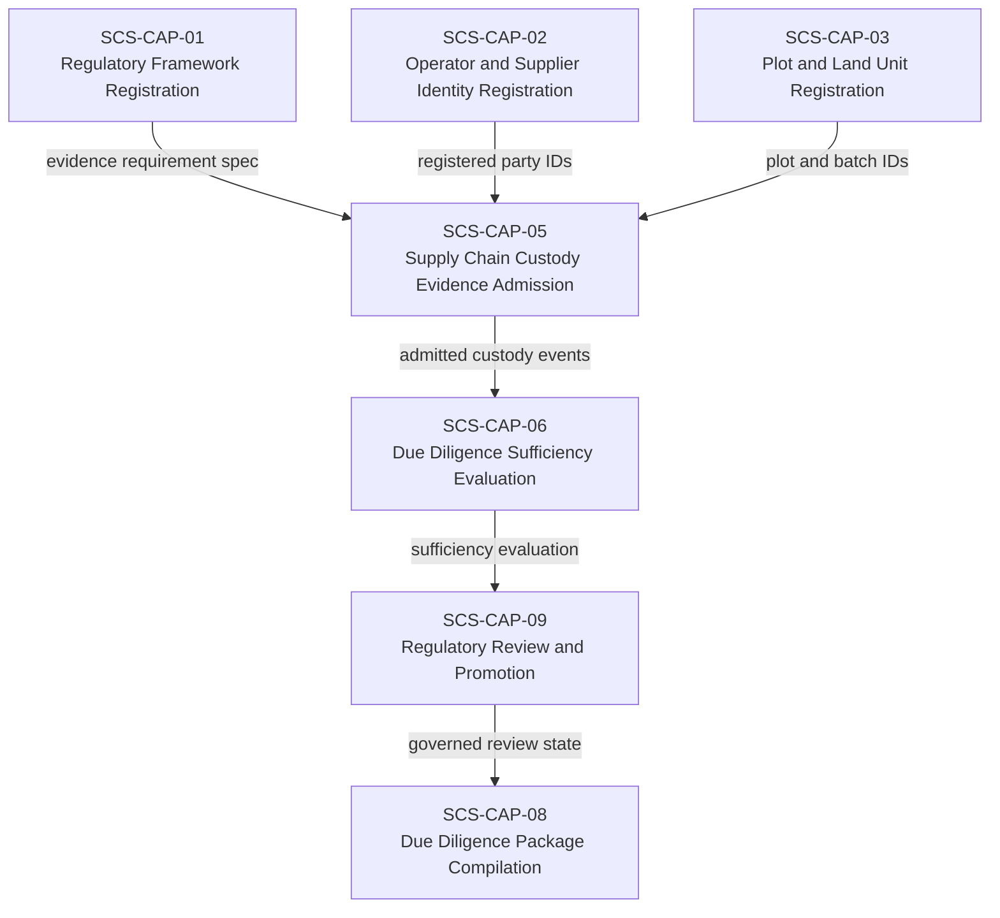
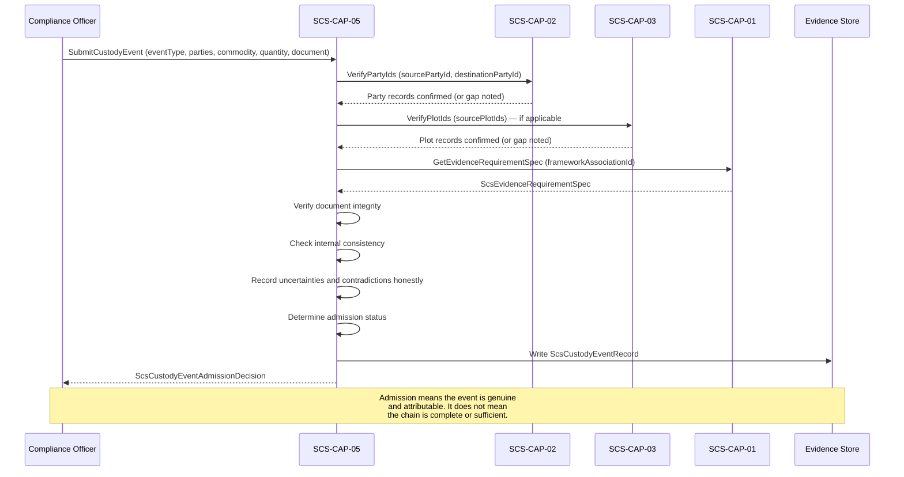

# SCS-CAP-05 — Supply Chain Custody Evidence Admission — Canonical Contract — 2026-09-23

**Status:** CANONICAL CONTRACT — NOT IMPLEMENTATION
**Domain:** Supply Chain Sovereignty (SCS)
**Authority:** DEFINES THE CONTRACT FOR SCS-CAP-05. Establishes no commissioning,
production, Gate D, WP05, scientific-validity or regulatory authority. This
capability is PROPOSED_NOT_ADMITTED. A pilot implementation exists; what it covers is recorded in `scs-pilot/packages/api/src/capabilities/cap-05/README.md`.

## Amendment of 2026-09-27: representative submission, and the two mandate fields

This contract adopts the representative submission defined in SCS-CAP-02 ("Representative submission"), which implements AAB-PLATFORM-03 section 3 and AAB-PLATFORM-04. It also settles what distinguishes its two mandate fields ("Authority and mandates", below):
- **`provenance.submissionMandateId`** is the authority for the *submission*: the mandate under which a `PARTY_REPRESENTATIVE` put the record into SCS. It is present exactly when the submission is representative, and every link and mandate check must pass. A failure refuses the submission.
- **`sourceParty.actingUnderMandateId`** is a fact about the *event*: the source party was represented at the transaction itself, for example by a cooperative selling its members' produce. It never authorises a submission. It is checked, including against the mandate's scope, and a failure is recorded as the limitation `MANDATE_NOT_VALID`, as before.

This closes this contract's gaps on submission under a mandate, the two mandate fields, and mandate scope. Nothing is implemented by this amendment, and every other rule is unchanged.

**A breaking interface change.** The submission request's `submissionMandateId` is replaced by `actingUnder`, with the same shape as SCS-CAP-02 and SCS-CAP-04. A request that sends `submissionMandateId` is no longer valid. Records already stored keep their `provenance.submissionMandateId` unchanged. The pilot implementation changes when this amendment is built.

**An intentional behaviour change.** A `COMPLIANCE_OFFICER` who cites a submission mandate is refused, where before the pilot recorded a limitation. Only a `PARTY_REPRESENTATIVE` submits under a mandate. A compliance officer still records the event's representation through `sourceParty.actingUnderMandateId`.

**Decisions recorded on 2026-09-27:**
- **`actingUnder` replaces the request's `submissionMandateId`,** for one shape across SCS-CAP-02, 04 and 05. A broken interface now is better than a permanent inconsistency in the contract.
- **A representative acts for the source party only.** A destination party's own staff submitting for their own organisation is a direct submission, not representation. How an organisation's own staff submit on its behalf is recorded as a gap.
- **A `COMPLIANCE_OFFICER` sending `actingUnder` is refused;** they record an event's representation through `sourceParty.actingUnderMandateId`.
- **No mandate action for representation in a transaction is added now.** The gap is recorded. It is addressed when SCS-CAP-02's mandate action vocabulary is reviewed deliberately, as its own contract change.

**Second amendment of 2026-09-27: representative submission made exact.** Found while building it:
- **Who submits as a representative** is as SCS-CAP-02 settles it ("Representative submission", fifth amendment): `actingUnder` makes a submission representative, whatever other roles the actor holds, and it is then checked in full. The decision above, read literally, would refuse an actor holding both `COMPLIANCE_OFFICER` and `PARTY_REPRESENTATIVE` for the party; this departs from that reading deliberately, for the reason SCS-CAP-02 records. An actor without `PARTY_REPRESENTATIVE` for the party, a compliance officer included, is still refused.
- **The two mandates are current at different times.** The submission's mandate (`actingUnder`) is current at the time of the submission, from `validFrom` up to, not including, `validUntil`. The event's mandate (`sourceParty.actingUnderMandateId`) is checked against the event's date, as before.

**Third amendment of 2026-09-28: signing-key history.** AAB-PLATFORM-04's third amendment adopts AAB-PLATFORM-09 Governed Public-Key Registry. For representative submission, the link and its status records are verified against their signers' keys as at acceptance, not current keys, and **`LINK_SIGNATURE_UNDER_REVIEW`** is added to the failure codes, for a link or status record inside a compromise window not yet assessed. Nothing else changes.

## Plain-English boundary statement

SCS-CAP-05 admits genuine, attributable, and usable supply chain custody
evidence — purchase records, transport documents, processing facility
certifications, weighing records, transformation records, and chain of custody
certificates — and records precisely what each item covers: which parties,
which commodity batch, which event type, which quantities, which location, and
which time. It does not determine whether the collective custody chain is
sufficiently continuous or consistent for any regulatory framework. It does not
produce due diligence statements. It does not verify the identity of any party —
that is SCS-CAP-02's function. It does not evaluate sufficiency — that is
SCS-CAP-06's function.

## The governing principle

> CAP-05 records custody events honestly. CAP-06 evaluates whether the
> collective chain of admitted events is sufficiently continuous and consistent
> for the applicable framework and period.

## Custody evidence records events — not chains

CAP-05 does not admit a "chain of custody" as a single object. It admits
individual custody events. Each event is a discrete, attributable record of
something that happened — a purchase, a transfer, a weighing, a transformation,
a certification — at a specific time, between specific parties, involving a
specific commodity batch.

The chain emerges from the collective set of admitted events when evaluated by
CAP-06. CAP-05 never asserts chain continuity. Several admitted custody
documents do not automatically constitute a continuous, verified chain.

## What each custody event must preserve

Every admitted custody event record preserves:

- Source and destination parties — linked to CAP-02 registered party IDs
- Plot, batch, and commodity identifiers — linked to CAP-03 plot records where applicable
- Event type — what happened
- Quantity and unit — how much commodity was involved
- Event time and location — when and where
- Supporting document — what evidence supports this event
- Submitting authority — who submitted this record and on what mandate
- Transformations, splits, and consolidations — how the commodity changed form or quantity
- Uncertainties and contradictions — honest disclosure of what is unknown or disputed
- Predecessor and successor references — how this event connects to adjacent events

## Domain position



## Core interfaces

### Custody event record

```typescript
interface ScsCustodyEventRecord {
  // Canonical identity
  eventId: string;
  eventVersion: number;
  schemaVersion: string;

  // What framework and evidence requirement this event relates to.
  // frameworkAssociationId names an SCS-CAP-01 framework (its frameworkId),
  // as in SCS-CAP-02 — not an SCS-CAP-03 plot association: a custody event
  // concerns a batch, not a plot
  frameworkAssociationId: string;
  evidenceRequirementSpecId: string;

  // What kind of custody event this is
  eventType:
    | "PURCHASE"
    | "TRANSFER"
    | "WEIGHING"
    | "PROCESSING"
    | "TRANSFORMATION"
    | "SPLIT"
    | "CONSOLIDATION"
    | "EXPORT"
    | "IMPORT"
    | "CERTIFICATION"
    | "INSPECTION"
    | "OTHER";

  // Parties involved — linked to CAP-02 registered IDs
  sourceParty: {
    partyId: string;
    partyVersion: number;
    partyRoleAtEvent:
      | "SUPPLIER"
      | "AGGREGATOR"
      | "PROCESSOR"
      | "EXPORTER"
      | "OTHER";
    // The mandate under which the source party was represented at the event itself.
    // A fact about the event, never the submission's authority (amendment of 2026-09-27)
    actingUnderMandateId?: string;
  };

  destinationParty: {
    partyId: string;
    partyVersion: number;
    partyRoleAtEvent:
      | "AGGREGATOR"
      | "PROCESSOR"
      | "EXPORTER"
      | "IMPORTER"
      | "OTHER";
  };

  // Commodity and batch — linked to CAP-03 where applicable
  commodity: {
    commodityCode: string;
    commodityName: string;
    // Plot IDs from CAP-03 — where the commodity originated
    // May be empty for downstream events where plot traceability
    // has not yet been established
    sourcePlotIds: string[];
    sourcePlotIdsComplete: boolean;
    batchIdentifier: string;
    batchVersion?: number;
  };

  // Quantity — what moved or changed. Absent only for CERTIFICATION and
  // INSPECTION events, which need not concern a quantity
  quantity?: {
    amount: number;
    unit: ScsCustodyQuantityUnit;
    // Required when unit is OTHER; absent otherwise
    unitDescription?: string;
    measurementMethod?: string;
    measurementUncertainty?: string;
  };

  // When and where
  eventLocation: {
    countryCode: string;
    administrativeArea?: string;
    facilityId?: string;
    facilityName?: string;
    coordinates?: {
      latitude: number;
      longitude: number;
      accuracyMetres?: number;
    };
  };

  eventTime: {
    // The local calendar date at the event location. Required even when
    // timePrecision is UNKNOWN: the date anchors the event in time
    eventDate: string;
    // A full ISO 8601 timestamp in UTC, not a time of day
    eventTimeUTC?: string;
    timePrecision:
      | "EXACT"
      | "DATE_ONLY"
      | "APPROXIMATE"
      | "UNKNOWN";
  };

  // Transformations — how the commodity changed
  transformation?: {
    transformationType:
      | "DRYING"
      | "MILLING"
      | "PRESSING"
      | "BLENDING"
      | "GRADING"
      | "PACKAGING"
      | "OTHER";
    inputQuantity: number;
    inputUnit: ScsCustodyQuantityUnit;
    // Required when inputUnit is OTHER; absent otherwise
    inputUnitDescription?: string;
    outputQuantity: number;
    outputUnit: ScsCustodyQuantityUnit;
    // Required when outputUnit is OTHER; absent otherwise
    outputUnitDescription?: string;
    conversionRatioDescription?: string;
  };

  // Splits and consolidations
  predecessorEventIds: string[];
  successorEventIds: string[];
  splitFromEventId?: string;
  consolidatedFromEventIds?: string[];

  // Supporting document
  supportingDocument: {
    documentId: string;
    documentType:
      | "PURCHASE_RECEIPT"
      | "WEIGHT_TICKET"
      | "TRANSPORT_DOCUMENT"
      | "PROCESSING_RECORD"
      | "CERTIFICATION_DOCUMENT"
      | "INSPECTION_REPORT"
      | "CUSTOMS_DECLARATION"
      | "OTHER";
    documentReference: string;
    issuingAuthority?: string;
    documentDate?: string;
    contentDigest: string;
    // FAILED is never recorded: a failed integrity check writes nothing
    integrityStatus:
      | "VERIFIED"
      | "UNVERIFIED"
      | "FAILED";
  };

  // Provenance — who submitted this record and on what authority
  provenance: {
    submittedBy: ActorReference;
    submittedAt: string;
    // The mandate under which a PARTY_REPRESENTATIVE made the submission. Set by the
    // system from the request's actingUnder; present exactly for a representative
    // submission (amendment of 2026-09-27)
    submissionMandateId?: string;
    chainOfCustodyComplete: boolean;
  };

  // Honest disclosure of uncertainties and contradictions
  uncertainties: string[];
  contradictions: string[];
  knownGaps: string[];

  // Admission decision
  admission: {
    status:
      | "ADMITTED"
      | "ADMITTED_WITH_LIMITATIONS"
      | "QUARANTINED"
      | "REJECTED";
    limitations: string[];
    limitationCodes: ScsCustodyEventLimitationCode[];
    admittedBy: ActorReference;
    admittedAt: string;
  };
}
```

### What admission means — and does not mean

`admission.status: ADMITTED` means the custody event record is genuine,
attributable, internally consistent, and usable as evidence. It does not mean:

- The custody chain is complete or continuous
- The commodity batch is traceable to deforestation-free plots
- The parties involved have been independently verified
- The quantities are accurate beyond what the document states
- The event constitutes proof of legal compliance
- CAP-06 will find the collective chain sufficient

`ADMITTED_WITH_LIMITATIONS` means the record is genuine and usable but carries
explicit limitations — missing quantity precision, uncertain timing, unverified
party identity, or a document whose integrity could not be confirmed. CAP-06
evaluates whether those limitations are material to the framework's requirements.

### Transformation and split handling

When a commodity is processed, transformed, split, or consolidated, the
traceability chain is not automatically broken — but the connection must be
explicitly recorded, not assumed.

```typescript
interface ScsCustodyTransformationRecord {
  transformationId: string;

  // Input events — what went in
  inputEventIds: string[];
  totalInputQuantity: number;
  inputUnit: string;

  // Output events — what came out
  outputEventIds: string[];
  totalOutputQuantity: number;
  outputUnit: string;

  // The transformation itself
  transformationType: string;
  facilityId?: string;
  transformationDate: string;

  // Yield and loss — honest accounting
  yieldPercent?: number;
  lossQuantity?: number;
  lossExplanation?: string;

  // If output quantity cannot be fully reconciled with input
  reconciliationStatus:
    | "FULLY_RECONCILED"
    | "PARTIALLY_RECONCILED"
    | "UNRECONCILED"
    | "NOT_EVALUATED";

  reconciliationGapExplanation?: string;
}
```

### Custody chain sufficiency request — for CAP-06

CAP-05 does not evaluate chain sufficiency. It provides the admitted events
that CAP-06 evaluates. The request structure makes clear what CAP-06 needs:

```typescript
interface ScsCustodyChainSufficiencyRequest {
  // What is being evaluated
  commodityCode: string;
  batchIdentifier: string;
  operatorPartyId: string;

  // Which framework governs this evaluation
  frameworkAssociationId: string;
  evidenceRequirementSpecId: string;

  // The admitted custody events in scope
  admittedCustodyEventIds: string[];

  // The period the chain must cover
  chainPeriod: {
    from: string;
    to: string;
  };

  // The plot registrations the chain must connect to
  requiredSourcePlotIds: string[];
}
```

CAP-06 evaluates whether:
- The admitted events form a sufficiently continuous chain from source plots
  to operator
- Quantities are consistent across the chain — no unexplained gains or losses
- All parties in the chain are registered in CAP-02
- Transformations and splits are explicitly recorded
- Temporal and geographic gaps are within acceptable bounds per the framework
- Contradictions between events are identified and disclosed

## Admission sequence



## Admission decision

```typescript
interface ScsCustodyEventAdmissionDecision {
  decisionId: string;
  eventId: string;
  frameworkAssociationId: string;

  decision:
    | "ADMITTED"
    | "ADMITTED_WITH_LIMITATIONS"
    | "QUARANTINED"
    | "REJECTED";

  admissionChecks: {
    sourcePartyIdentifiable: boolean;
    destinationPartyIdentifiable: boolean;
    commodityCodeRecognised: boolean;
    batchIdentifierPresent: boolean;
    eventTypeValid: boolean;
    quantityRecorded: boolean;
    eventTimeRecorded: boolean;
    supportingDocumentPresent: boolean;
    documentIntegrityVerified: boolean;
    submitterAuthorised: boolean;
    internallyConsistent: boolean;
  };

  limitations: string[];
  limitationCodes: ScsCustodyEventLimitationCode[];
  // How admission checks were decided where that is not self-evident
  // (for example a check that does not apply). Never a limitation
  decisionReasons: string[];
  rejectionReasons?: string[];

  decidedBy: ActorReference;
  decidedAt: string;

  // Admission is not sufficiency
  authorityBoundary: {
    admissionIsNotSufficiency: true;
    admittedEventDoesNotProveChainContinuity: true;
    admittedEventDoesNotVerifyPartyIdentity: true;
    admittedEventDoesNotConstituteLegalCompliance: true;
  };
}
```

## When CAP-05 rejects or quarantines

Incomplete chain coverage does not by itself cause rejection. CAP-05 rejects
or quarantines custody evidence when:

- The source or destination party cannot be identified at all
- The commodity code is unrecognised
- No quantity is recorded
- The supporting document is absent or fails integrity verification
- The event is internally inconsistent in a material way
- The submitter has no authority to submit this record
- The document has been altered without recorded lineage

CAP-05 admits with limitations when:
- A party is registered but unverified
- Source plot IDs are absent or incomplete
- Quantity precision is uncertain
- Event timing is approximate
- Predecessor or successor events are referenced but not yet admitted

## Admission rules for the pilot

These rules define `submitCustodyEvent` for the pilot. Every condition in the failure contract
ends in `FAIL_CLOSED` and writes nothing. Everything else is admitted, with each shortfall
recorded as a limitation, never silently dropped.

### Outcomes

- **`ADMITTED` or `ADMITTED_WITH_LIMITATIONS`** are the only admission outcomes. The decision
  is `ADMITTED_WITH_LIMITATIONS` whenever at least one limitation code is recorded, and
  `ADMITTED` otherwise.
- **A plain `ADMITTED` is reachable, and must stay reachable.** A fully documented event
  between verified parties, with a stored and verified document, carries no forced limitation.
- **`QUARANTINED`** is reached only through a later `quarantineCustodyEvent` operation, never
  at admission. Quarantine will be recorded as a separate event; the admitted record is never
  changed.
- **`REJECTED`** is reserved until its criteria are defined. A condition that would reject is
  a `FAIL_CLOSED` failure instead.

### Framework

A custody event concerns a commodity batch, which may come from many plots or, downstream, from
no known plot. It is therefore keyed to an SCS-CAP-01 framework, not to an SCS-CAP-03 plot
framework association.

- `frameworkAssociationId` names an SCS-CAP-01 framework by its `frameworkId`, as in
  SCS-CAP-02. The framework must be registered (`FRAMEWORK_ASSOCIATION_NOT_FOUND`) and
  `ACTIVE` (`FRAMEWORK_NOT_ACTIVE`).
- `evidenceRequirementSpecId` is the framework's current evidence requirement specification,
  set by the system.
- **The custody specification is recorded, not applied.** CAP-05 records the specification
  identifier only. `requiredDocumentTypes`, `chainOfCustodyStandards` and `traceabilityDepth`
  describe what a chain must contain, and are evaluated by SCS-CAP-06.

### Fields the system sets

`eventId`, `eventVersion` (1 until a revision operation exists), `schemaVersion`,
`evidenceRequirementSpecId` (from the framework, never from the client), `sourceParty.partyVersion`
and `destinationParty.partyVersion` (each party's current SCS-CAP-02 version at admission),
`supportingDocument.integrityStatus`, `provenance.submittedBy`, `provenance.submittedAt` and the
whole `admission` block.

### Authority and mandates

**The submission's authority.**
- **Directly:** a `COMPLIANCE_OFFICER` may submit a custody event. Their role is the authority,
  not a mandate.
- **As a representative:** a `PARTY_REPRESENTATIVE` may submit it only under a mandate, named in
  `actingUnder`, after every check of SCS-CAP-02 "Representative submission" passes. For this
  capability, those checks read as follows:
  - **Action:** the mandate permits `SUBMIT_CUSTODY_EVIDENCE`.
  - **The party the act is for** is the source party. The mandate's `grantingPartyId` is
    `sourceParty.partyId`. Otherwise `MANDATE_PARTIES_MISMATCH`.
  - **Scope:** the event's framework is among the mandate's `frameworkAssociationIds`; the
    event's `commodity.commodityCode` is within `commodityScope`; and
    `eventLocation.countryCode` is within `geographicScope`. Otherwise
    `MANDATE_SCOPE_MISMATCH`.

  The system sets `provenance.submissionMandateId` from `actingUnder.mandateId`.
- **Anyone else** is refused with `SUBMITTER_NOT_AUTHORISED`. A `PARTY_REPRESENTATIVE` without
  `actingUnder`, or anyone else sending `actingUnder`, is refused with
  `REPRESENTATIVE_NOT_AUTHORISED`.
- The role is checked first. The link and mandate checks run after the framework, commodity and
  parties are resolved, because the scope check needs them.

**The event's representation** (`sourceParty.actingUnderMandateId`), when given, records that
the source party was represented at the transaction itself. It never authorises the
submission, and never refuses the event. It must:
- be a registered SCS-CAP-02 representation mandate;
- be in force: `revocationStatus` `NOT_REVOKED`, and the event date within `validFrom` to
  `validUntil`;
- permit `SUBMIT_CUSTODY_EVIDENCE`;
- name the source party as its `grantingPartyId`, the party it acts for;
- cover the event: its framework, commodity code and location country within the mandate's
  `frameworkAssociationIds`, `commodityScope` and `geographicScope`.

A mandate cited here that fails any of these is recorded as cited, and the limitation
`MANDATE_NOT_VALID` is recorded, naming each failed condition.

### Parties

- **Identifiable.** `sourceParty.partyId` and `destinationParty.partyId` must each be a
  registered SCS-CAP-02 party (`SOURCE_PARTY_NOT_IDENTIFIABLE`,
  `DESTINATION_PARTY_NOT_IDENTIFIABLE`) that is not `RETIRED` (`PARTY_RETIRED`).
- **Unverified.** A party with no current SCS-CAP-02 verification assessment whose status is
  `VERIFIED_FOR_DECLARED_SCOPE` is unverified: the limitation `PARTY_UNVERIFIED` is recorded,
  naming the party. An assessment counts only while it is not superseded and not expired
  (SCS-CAP-02, "Current verification status"). Any scope counts.
- **Same party on both sides.** The source and destination may be the same party only for
  `WEIGHING`, `INSPECTION` and `PROCESSING`, as a deliberate exception: these events happen at
  one party's premises without a change of custody. For `PURCHASE`, `TRANSFER`, `EXPORT` and
  `IMPORT` they must differ (`INTERNAL_INCONSISTENCY`).

### Commodity

`commodity.commodityCode` must equal the framework's `commodityCode`. Otherwise
`COMMODITY_CODE_UNRECOGNISED`, which in the pilot means "outside the framework". No code
prefix or product hierarchy is matched.

### Quantity and units

- **Required, except for certifications and inspections.** For every event type except
  `CERTIFICATION` and `INSPECTION`, the quantity is required; its absence is refused by the
  request schema. A `CERTIFICATION` or `INSPECTION` event may omit it: a facility certification
  has no quantity, and requiring one would force a meaningless value. An omitted quantity on
  those two types is neither a failure nor a limitation.
- `amount` is greater than 0 (`INTERNAL_INCONSISTENCY`).
- Units are a closed vocabulary. `OTHER` requires a description, the same pattern as
  `OTHER_EXPLICITLY_NAMED` in SCS-CAP-02:

```typescript
type ScsCustodyQuantityUnit =
  | "KG"
  | "TONNE"
  | "LITRE"
  | "M3"
  | "BALE"
  | "SACK"
  | "UNIT"
  | "OTHER";
```

- CAP-05 never compares or converts units across events. That is SCS-CAP-06's concern.
- **Precision.** When `measurementUncertainty` is stated, or no `measurementMethod` is given,
  the limitation `QUANTITY_PRECISION_UNCERTAIN` is recorded.

### Supporting document and integrity

The document itself may be stored in the SCS evidence object store (AAB-PLATFORM-01), which
computes its SHA-256.

- **Always required:** `documentReference`, `documentType` and `contentDigest`. Their absence
  is refused by the request schema.
- **Cited object.** The submission may cite a stored object by its `objectId`. The object
  must exist in the store (`EVIDENCE_OBJECT_NOT_FOUND`), and the declared `contentDigest`
  must equal the stored digest (`DOCUMENT_INTEGRITY_FAILED`). When both hold,
  `integrityStatus` is `VERIFIED`.
- **No cited object.** `integrityStatus` is `UNVERIFIED`: nothing SCS holds can confirm the
  declared digest. The limitation `INTEGRITY_UNVERIFIED` is recorded. This keeps informal
  records admissible, such as handwritten ledgers, with that limitation disclosed.
- `integrityStatus: FAILED` is never recorded: a failed integrity check writes nothing.
- **Altered documents.** "The document has been altered without recorded lineage" is detected
  only as a digest mismatch (`DOCUMENT_INTEGRITY_FAILED`). See "Open gaps".

### Internal consistency

**Material inconsistencies** fail with `INTERNAL_INCONSISTENCY`, naming each one:

- `transformation` is present if and only if `eventType` is `TRANSFORMATION` or `PROCESSING`;
- `splitFromEventId` is present if and only if `eventType` is `SPLIT`;
- `consolidatedFromEventIds` has at least two identifiers if and only if `eventType` is
  `CONSOLIDATION`;
- `timePrecision` `EXACT` requires `eventTimeUTC`;
- `eventTimeUTC` is consistent with `eventDate`: because `eventDate` is the local date at the
  event location, `eventTimeUTC` must fall within the span of that date in some time zone
  from UTC−12:00 to UTC+14:00, that is from `eventDate` 00:00 UTC minus 14 hours to
  `eventDate` 00:00 UTC plus 36 hours;
- no date is in the future: timestamps are not after the current time (the database clock),
  and a date (`eventDate`, `documentDate`) is not after the current UTC date plus one day,
  the latest calendar date anywhere;
- `documentDate` is not after the submission;
- `eventLocation.countryCode` is an officially assigned ISO 3166-1 alpha-2 code;
- coordinates, when given, have latitude −90 to 90 and longitude −180 to 180;
- `quantity.amount` and the transformation quantities are greater than 0;
- a unit of `OTHER` has its description, and a description is given only for `OTHER`;
- the source and destination differ for `PURCHASE`, `TRANSFER`, `EXPORT` and `IMPORT`;
- no linked event identifier names the event itself (it cannot: the system generates
  `eventId`).

**Non-material inconsistencies** are limitations:

- a transformation whose output exceeds its input in the same unit (not `OTHER`), with no
  `conversionRatioDescription` explaining it: `QUANTITY_GAIN_UNEXPLAINED`;
- contradictions declared by the submitter in `contradictions`: `CONTRADICTION_DECLARED`. The
  contradictions are kept verbatim.

`uncertainties` and `knownGaps` are recorded verbatim as the submitter's disclosure.

### Event time

When `timePrecision` is `APPROXIMATE` or `UNKNOWN`, the limitation `EVENT_TIME_APPROXIMATE`
is recorded.

### Source plots

- **Registered.** Each of `commodity.sourcePlotIds` should name a registered SCS-CAP-03 plot.
  Each cited identifier is recorded as cited, and linked to the plot when it is registered. An
  identifier that names no registered plot is the limitation `SOURCE_PLOT_NOT_REGISTERED`,
  naming it.
- **Retired.** A plot that is `RETIRED` is the limitation `SOURCE_PLOT_RETIRED`, not a failure:
  the commodity may have been harvested before the plot was retired.
- **Incomplete.** `sourcePlotIdsComplete: false`, or no source plots at all, is the limitation
  `SOURCE_PLOTS_INCOMPLETE`.

### Linked events

- **Predecessors, split-from and consolidated-from.** Each of `predecessorEventIds`,
  `splitFromEventId` and `consolidatedFromEventIds` should name an admitted custody event. Each
  cited identifier is recorded as cited, and linked to the event when it is admitted. An
  identifier that names no admitted event is the limitation `LINKED_EVENT_NOT_ADMITTED`,
  naming it. Admission proceeds: events are often recorded out of order.
- **Other framework or batch.** A linked event may belong to a different framework or batch:
  custody events that cross frameworks are an operational reality in commodity chains. The link
  is kept, and the limitation `LINKED_EVENT_OUT_OF_SCOPE` is recorded, naming the event and how
  it differs.
- **Successors.** `successorEventIds` are recorded as declared and never resolved at admission:
  a successor is normally submitted later. SCS-CAP-06 derives successors from later events'
  predecessors.

### Chain of custody

`provenance.chainOfCustodyComplete` is recorded as declared. When it is `false`, the limitation
`CHAIN_OF_CUSTODY_INCOMPLETE` is recorded.

### Limitation codes

A limitation code is not a failure. It is recorded with the event and in the decision, and
makes the decision `ADMITTED_WITH_LIMITATIONS`.

```typescript
type ScsCustodyEventLimitationCode =
  | "PARTY_UNVERIFIED"
  | "SOURCE_PLOTS_INCOMPLETE"
  | "SOURCE_PLOT_NOT_REGISTERED"
  | "SOURCE_PLOT_RETIRED"
  | "QUANTITY_PRECISION_UNCERTAIN"
  | "EVENT_TIME_APPROXIMATE"
  | "LINKED_EVENT_NOT_ADMITTED"
  | "LINKED_EVENT_OUT_OF_SCOPE"
  | "INTEGRITY_UNVERIFIED"
  | "CHAIN_OF_CUSTODY_INCOMPLETE"
  | "MANDATE_NOT_VALID"
  | "QUANTITY_GAIN_UNEXPLAINED"
  | "CONTRADICTION_DECLARED";
```

### Submission request

```typescript
interface ScsCustodyEventSubmissionRequest {
  // An SCS-CAP-01 frameworkId
  frameworkAssociationId: string;

  eventType: ScsCustodyEventRecord["eventType"];

  // As in the record, without partyVersion (set by the system)
  sourceParty: {
    partyId: string;
    partyRoleAtEvent: ScsCustodyEventRecord["sourceParty"]["partyRoleAtEvent"];
    actingUnderMandateId?: string;
  };
  destinationParty: {
    partyId: string;
    partyRoleAtEvent: ScsCustodyEventRecord["destinationParty"]["partyRoleAtEvent"];
  };

  // As in the record. quantity may be omitted only for CERTIFICATION and
  // INSPECTION
  commodity: ScsCustodyEventRecord["commodity"];
  quantity?: ScsCustodyEventRecord["quantity"];
  eventLocation: ScsCustodyEventRecord["eventLocation"];
  eventTime: ScsCustodyEventRecord["eventTime"];
  transformation?: ScsCustodyEventRecord["transformation"];

  predecessorEventIds: string[];
  successorEventIds: string[];
  splitFromEventId?: string;
  consolidatedFromEventIds?: string[];

  // Present only for a representative submission (SCS-CAP-02, "Representative submission").
  // Replaces the request's former submissionMandateId (amendment of 2026-09-27)
  actingUnder?: {
    representativePartyId: string;  // the party the actor is linked to
    mandateId: string;              // the source party's mandate to it
  };

  supportingDocument: {
    // The AAB-PLATFORM-01 objectId of the stored document, when one is cited
    objectId?: string;
    documentId: string;
    documentType: ScsCustodyEventRecord["supportingDocument"]["documentType"];
    documentReference: string;
    issuingAuthority?: string;
    documentDate?: string;
    // Lowercase hexadecimal SHA-256 of the document
    contentDigest: string;
  };

  chainOfCustodyComplete: boolean;

  uncertainties: string[];
  contradictions: string[];
  knownGaps: string[];
}
```

### Checks and the decision

The failure checks run in this order: authority; internal consistency; the framework; the
commodity; the parties; for a representative submission, the link and mandate checks; the
supporting document and integrity. The admission checks in the
decision record the outcome of each:

- `submitterAuthorised`, `sourcePartyIdentifiable`, `destinationPartyIdentifiable`,
  `commodityCodeRecognised`, `batchIdentifierPresent`, `eventTypeValid`,
  `eventTimeRecorded` and `supportingDocumentPresent` are `true` whenever an event is admitted.
- `quantityRecorded` is `true` when a quantity is recorded. It is `false` only for a
  `CERTIFICATION` or `INSPECTION` event without one, and `decisionReasons` then states that a
  quantity does not apply to that event type.
- `documentIntegrityVerified` is `true` only when `integrityStatus` is `VERIFIED`.
- `internallyConsistent` is `false` when `QUANTITY_GAIN_UNEXPLAINED` is recorded: the material
  checks passed, but an inconsistency remains unexplained.

The decision carries `limitationCodes`, the codes recorded, alongside the human-readable
`limitations`; `decisionReasons`, which is never a limitation; and the fixed
`authorityBoundary`. For a representative submission, the admission checks also carry
`representation`, SCS-CAP-02's `ScsRepresentationChecks`, recording each link and mandate check,
and the submitter's `ActorReference` carries `representation`, naming the link, the mandate and
both parties.

### Deferred operations

- **`submitTransformationRecord`** is deferred. `ScsCustodyTransformationRecord` overlaps the
  event's own `transformation`; it returns a record rather than a decision; it needs its output
  events to exist before it can be written, which is circular when the transformation is itself
  an event; and who sets `reconciliationStatus` is undefined. It must be redefined before it is
  built. The pilot records transformations only through the event's `transformation`.
- **Reads** (`getCustodyEvent`, `listCustodyEventsForBatch`, `listCustodyEventsForParty`) and
  **`quarantineCustodyEvent`** are deferred. SCS-CAP-06 reads the admitted events directly.

### Open gaps

**Settled by the amendment of 2026-09-27** ("Authority and mandates"):
- **Submission under a mandate:** a `PARTY_REPRESENTATIVE` submits under a verified mandate,
  through an actor–party link, after every SCS-CAP-02 representative check passes.
- **The two mandate fields:** `provenance.submissionMandateId` is the submission's authority;
  `sourceParty.actingUnderMandateId` is a fact about the event.
- **Mandate scope:** both mandates are checked against the event's framework, commodity code
  and location country. The submission mandate is refused on a mismatch; the event mandate
  records `MANDATE_NOT_VALID`.

**Contract gap: an action for representation at the event.** SCS-CAP-02's mandate actions are
all submissions. None names conducting a transaction for the granting party, so an event's
representation is checked against `SUBMIT_CUSTODY_EVIDENCE`, the nearest action. A mandate
action for representing a party in a transaction is not defined. It is addressed when
SCS-CAP-02's mandate action vocabulary is reviewed, as its own change.

**Contract gap: an organisation's own staff.** A representative submits for another party
under that party's mandate. How a party's own staff submit on its behalf, as the party itself
rather than under a mandate, is not defined. Until it is, they submit only as a
`COMPLIANCE_OFFICER`.

**Contract gap: producer role.** `sourceParty.partyRoleAtEvent` has no producer role. A
smallholder selling their own harvest is recorded as `SUPPLIER`.

**Contract gap: processed products.** A processed product under a raw-commodity framework (for
example a rubber product under a natural rubber framework) is refused as
`COMMODITY_CODE_UNRECOGNISED`, because only an exact commodity code match is accepted. How
product codes relate to a framework's commodity is not defined.

**Contract gap: altered documents.** No document lineage model exists, so an alteration is
detected only as a mismatch between the declared digest and a stored object. A document with
no stored object cannot be checked for alteration (`INTEGRITY_UNVERIFIED`).

**Contract gap: batch and facility registries.** `batchIdentifier`, `batchVersion` and
`facilityId` identify things no SCS capability registers. They are recorded as given.

**Contract gap: chain sufficiency.** `ScsCustodyChainSufficiencyRequest` describes SCS-CAP-06's
evaluation. It is not part of the CAP-05 provider, and no `evaluateChainSufficiency` operation
belongs to CAP-05. SCS-CAP-06 now defines the custody-chain evaluation (its "Custody chain"
section).

**Contract gap: party verification summary.** "Unverified" rests on SCS-CAP-02 assessments,
whose party-level summary is itself an SCS-CAP-02 contract gap. The pilot counts any current
`VERIFIED_FOR_DECLARED_SCOPE` assessment, in any scope.

## Provider-neutral interface

```typescript
interface ScsCustodyEvidenceProvider {
  submitCustodyEvent(
    request: ScsCustodyEventSubmissionRequest
  ): Promise<ScsCustodyEventAdmissionDecision>;

  getCustodyEvent(
    eventId: string,
    version?: number
  ): Promise<ScsCustodyEventRecord>;

  listCustodyEventsForBatch(
    batchIdentifier: string,
    frameworkAssociationId?: string
  ): Promise<ScsCustodyEventRecord[]>;

  listCustodyEventsForParty(
    partyId: string,
    role?: "SOURCE" | "DESTINATION" | "BOTH"
  ): Promise<ScsCustodyEventRecord[]>;

  submitTransformationRecord(
    transformation: ScsCustodyTransformationRecord
  ): Promise<ScsCustodyTransformationRecord>;

  quarantineCustodyEvent(
    eventId: string,
    reason: string,
    quarantinedBy: ActorReference
  ): Promise<void>;
}
```

## Failure contract

```typescript
interface ScsCustodyEventAdmissionFailure {
  ok: false;
  capabilityId: "SCS-CAP-05";
  result: "FAIL_CLOSED";

  // Every shortfall that is not listed here is a limitation code, not a
  // failure: see "Admission rules for the pilot"
  error:
    | "SUBMITTER_NOT_AUTHORISED"
    // Amendment of 2026-09-27: representative submission (SCS-CAP-02)
    | "REPRESENTATIVE_NOT_AUTHORISED"
    | "LINK_NOT_FOUND"
    | "LINK_AMBIGUOUS"
    | "LINK_NOT_ACTIVE"
    | "LINK_SIGNATURE_INVALID"
    | "LINK_SIGNATURE_UNDER_REVIEW"   // third amendment of 2026-09-28
    | "LINK_RELATION_NOT_PERMITTED"
    | "LINK_SUBJECT_NOT_CURRENT"
    | "MANDATE_NOT_FOUND"
    | "MANDATE_PARTIES_MISMATCH"
    | "MANDATE_NOT_CURRENT"
    | "MANDATE_ACTION_NOT_PERMITTED"
    | "MANDATE_SCOPE_MISMATCH"
    | "MANDATE_RELATIONSHIP_NOT_ACTIVE"
    | "MANDATE_NOT_VERIFIED"
    | "SOURCE_PARTY_NOT_IDENTIFIABLE"
    | "DESTINATION_PARTY_NOT_IDENTIFIABLE"
    // A registered party that is RETIRED
    | "PARTY_RETIRED"
    // The event's commodityCode is not its framework's commodityCode
    | "COMMODITY_CODE_UNRECOGNISED"
    | "QUANTITY_NOT_RECORDED"
    | "SUPPORTING_DOCUMENT_ABSENT"
    // A cited stored object is not in the SCS evidence object store
    | "EVIDENCE_OBJECT_NOT_FOUND"
    | "DOCUMENT_INTEGRITY_FAILED"
    | "INTERNAL_INCONSISTENCY"
    // The SCS-CAP-01 framework is not registered
    | "FRAMEWORK_ASSOCIATION_NOT_FOUND"
    // The SCS-CAP-01 framework is not ACTIVE
    | "FRAMEWORK_NOT_ACTIVE"
    | "DEPENDENCY_UNAVAILABLE";

  reasons: string[];
  noWrites: true;
  noEventAdmitted: true;
}
```

## Southeast Asia operational context

In Thailand and Vietnam, custody chains for rubber, palm oil, and coffee
typically involve:

1. Smallholder farmer harvests and sells to village-level collector or
   cooperative (the aggregator)
2. Aggregator collects from multiple smallholders and sells to processing
   facility
3. Processing facility transforms commodity (ribbed smoked sheets, palm oil
   extraction, coffee processing) and sells to exporter
4. Exporter ships to EU market operator

Each step in this chain is a custody event. Each event must be separately
admitted. Common gaps in existing documentation:

- Weighing records at farm gate are often informal or absent
- Village-level collector transactions may be recorded only in handwritten
  ledgers
- Processing facility records may aggregate inputs from multiple aggregators
  without separating source plots
- Transformation yield records may not be maintained at the level of
  individual batches

CAP-05 handles these gaps through honest disclosure rather than exclusion. A
custody event with an informal weighing record is admitted with
`ADMITTED_WITH_LIMITATIONS` and the limitation explicitly recorded.
SCS-CAP-06 evaluates whether that limitation is material to the framework's
requirements for the specific commodity and destination market.

The combination of CAP-02 (registered parties and mandates), CAP-03
(registered plots), CAP-04 (deforestation evidence), and CAP-05 (custody
events) gives CAP-06 everything it needs to evaluate whether a due diligence
package is sufficiently supported — without any single capability claiming
more than it can honestly deliver.

## What this document does not establish

- A representative submission does not make the representative responsible for the event's
  truth, and does not verify either party. It records who submitted, for whom, under which
  mandate.
- An event's representation (`sourceParty.actingUnderMandateId`) is recorded as a fact about the
  event. It is never authority to submit.

- It does not admit SCS-CAP-05 as a canonical capability — that requires
  the ten-point admission checklist
- It does not implement, deploy or migrate anything
- Admitting a custody event does not prove chain continuity or sufficiency —
  that is SCS-CAP-06's function
- Admitting a custody event does not verify the identity of any party —
  that is SCS-CAP-02's function
- Several admitted custody documents do not automatically constitute a
  continuous, verified chain — continuity is evaluated by CAP-06, not
  asserted by CAP-05
- It does not alter commissioning status, satisfy Gate D, close WP05, or
  grant any production or commissioning authority
