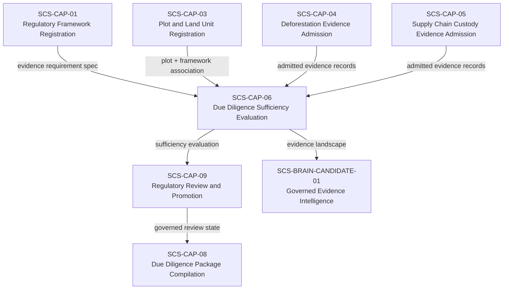
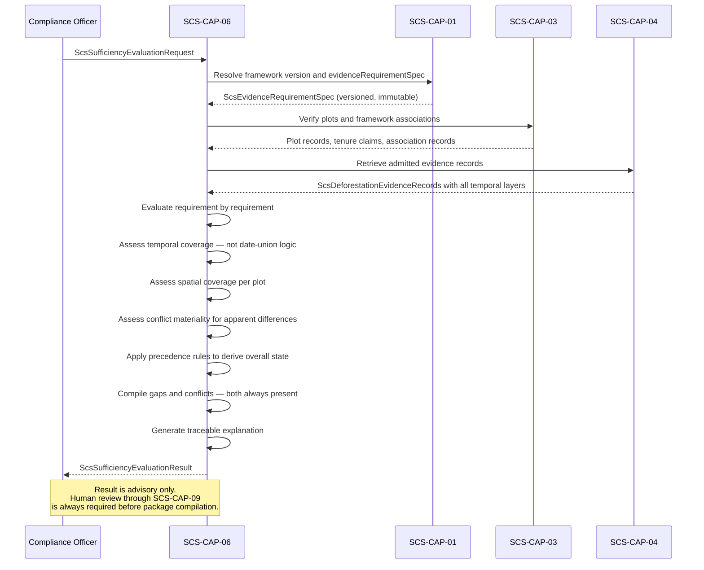

# SCS-CAP-06 — Due Diligence Sufficiency Evaluation — Canonical Contract — 2026-09-22

**Status:** CANONICAL CONTRACT — NOT IMPLEMENTATION
**Domain:** Supply Chain Sovereignty (SCS)
**Authority:** DEFINES THE CONTRACT FOR SCS-CAP-06. Establishes no commissioning, production, Gate D, WP05, scientific-validity or regulatory authority. This capability is PROPOSED_NOT_ADMITTED. No implementation exists.

## Plain-English boundary statement

SCS-CAP-06 evaluates the collective admitted evidence for a specific operator, commodity, regulatory framework version, and relevant period — producing an honest, structured sufficiency landscape that identifies what is satisfied, what is missing, what is conflicting, and what requires human decision. It does not make legal compliance determinations. It does not produce or authorise due diligence statements. It does not resolve conflicts by selecting the more convenient evidence. It does not treat simple date-union as proof of continuous temporal coverage.

## The governing sentence

> A gap says the evidence landscape is incomplete. A conflict says the evidence landscape contains materially incompatible claims. CAP-06 must preserve that distinction, expose both when they coexist, and never hide either behind a generic human-review state.

## What SUFFICIENT means — and what it does not

`SUFFICIENT` under SCS-CAP-06 means:

> Sufficient under the evaluated evidence-requirement specification, for the evaluated commodity, framework version, plots, and relevant period, as of the evaluation date.

`SUFFICIENT` does not mean:
- legally compliant
- approved for market placement
- due diligence completed
- negligible risk formally determined
- due diligence statement authorised
- regulatory review completed

`SUFFICIENT` is a sufficiency finding. The legal compliance determination remains with the named human operator. SCS-CAP-09 is the human gate before any package can be compiled.

## Gaps versus conflicts — a fundamental distinction

| Condition | Definition | Appropriate response |
|---|---|---|
| Gap | Required information is absent, incomplete, or does not cover the required scope | Obtain additional evidence |
| Conflict | Credible admitted evidence supports incompatible propositions about the same material subject | Investigate and resolve the contradiction |

These are different epistemic conditions requiring different corrective action. Collapsing both into a single human-review state would conceal whether the reviewer needs more evidence or needs to reconcile evidence already present.

**Specific examples:**

| Condition | Type | Response |
|---|---|---|
| Temporal interval missing | Gap | Obtain additional temporal evidence |
| Part of plot not covered | Gap | Obtain spatially complete evidence |
| Registry status unverified | Gap | Human decision or additional verification |
| Two sources make opposing land-change claims | Conflict | Investigate and resolve the contradiction |
| Attestation exceeds analysis period | Conflict | Challenge or correct the attestation |
| Satellite result conflicts with authority record | Conflict | Examine provenance, method, dates and applicability |

## Domain position



## Overall sufficiency states

```typescript
type ScsSufficiencyState =
  | "SUFFICIENT"
  | "GAPS_REQUIRE_HUMAN_DECISION"
  | "INSUFFICIENT"
  | "CONFLICTING_EVIDENCE"
  | "FAIL_CLOSED";
```

### Precedence rules — deterministic when multiple conditions coexist

When several conditions exist simultaneously, the overall state is determined by this precedence order. The highest-priority condition that applies determines the overall state. All conditions present are still reported in full — the overall state communicates the most urgent blocker, not the complete picture.

| Priority | State | Apply when |
|---|---|---|
| 1 | `FAIL_CLOSED` | CAP-06 cannot produce a trustworthy evaluation |
| 2 | `CONFLICTING_EVIDENCE` | At least one applicable requirement has a material unresolved contradiction |
| 3 | `INSUFFICIENT` | One or more mandatory requirements are unsatisfied with no bounded human-discretion path |
| 4 | `GAPS_REQUIRE_HUMAN_DECISION` | Gaps exist, no material unresolved conflict, framework permits human determination |
| 5 | `SUFFICIENT` | Every applicable mandatory requirement satisfied, no material conflict, no mandatory gap |

### When to apply each state

**`FAIL_CLOSED`** — use when CAP-06 cannot produce a trustworthy evaluation:
- Framework version cannot be resolved
- Evidence integrity failed
- Access scope is invalid
- Required dependencies are unavailable
- Plot or framework association cannot be established
- Evidence identifiers cannot be completely resolved

This is an evaluation failure, not an adverse compliance conclusion.

**`CONFLICTING_EVIDENCE`** — use when at least one applicable requirement has a material unresolved contradiction. Any gaps must still be reported alongside the conflict. The conflict state must not make gaps disappear.

**`INSUFFICIENT`** — use when one or more mandatory requirements are unsatisfied and the framework specification provides no bounded human-discretion path capable of curing that state using the present evidence. This is a sufficiency outcome — not a final legal non-compliance decision.

**`GAPS_REQUIRE_HUMAN_DECISION`** — use when: gaps exist; no material unresolved conflict exists; the applicable framework permits or requires a recorded human determination; and the present evidence does not justify `SUFFICIENT`.

**`SUFFICIENT`** — use only when every applicable mandatory requirement is satisfied, no material unresolved conflict exists, no mandatory gap remains, all required spatial and temporal evaluations pass, and all provenance and authority requirements pass.

### When gaps and conflicts coexist

If a plot has no evidence for part of 2022, and two admitted sources contradict each other about land-cover change in 2024, the overall result is:

```json
{
  "overallState": "CONFLICTING_EVIDENCE",
  "hasEvidenceGaps": true,
  "hasMaterialUnresolvedConflicts": true
}
```

The output must include both the uncovered 2022 interval and the unresolved 2024 contradiction. The single overall state communicates the most urgent blocker. The structured result preserves the complete landscape.

## Conflict materiality — not every apparent difference is a conflict

CAP-06 must first determine whether an apparent difference is a genuine material conflict before declaring `CONFLICTING_EVIDENCE`.

```typescript
type ConflictMateriality =
  | "NONE"
  | "APPARENT_BUT_COMPATIBLE"
  | "NON_MATERIAL"
  | "MATERIAL_RESOLVED"
  | "MATERIAL_UNRESOLVED";
```

**Examples of evidence that may appear different without actually conflicting:**
- Two sources cover different time periods
- One concerns deforestation and another generic tree-cover change
- One covers the entire plot while another covers only a sub-area
- Different sources use compatible measurement tolerances
- One source reports no event detected while another reports low-confidence possible change outside the claimed production area

CAP-06 should declare `CONFLICTING_EVIDENCE` only when all seven conditions are met:
1. Both records are admissible
2. They concern the same material subject
3. Their spatial and temporal scopes overlap sufficiently
4. They address the same applicable requirement or proposition
5. Their claims are genuinely incompatible
6. The conflict is material to sufficiency
7. It remains unresolved

## Core interfaces

### Sufficiency evaluation request

```typescript
interface ScsSufficiencyEvaluationRequest {
  // Set by the system, never by the requester
  requestId: string;
  requestedBy: ActorReference;
  requestedAt: string;

  // What is being evaluated
  subject: {
    plotIds: string[];
    plotVersions?: Record<string, number>;
    commodityCode: string;
    relevantProductCode?: string;
    // The custody chain: the batches and the operator they must reach
    batchIdentifiers?: string[];
    operatorPartyId?: string;
  };

  // Which framework governs this evaluation
  framework: {
    frameworkId: string;
    frameworkVersion: string;
    evidenceRequirementSpecId: string;
  };

  // The period the evaluation must cover
  // Framework-required period — not hardcoded here
  evaluationPeriod: {
    // Set by the system: the specification's referenceCutoffDate
    referenceDate: string;
    evaluationEndDate: string;
    assessmentType:
      | "DEFORESTATION"
      | "FOREST_DEGRADATION"
      | "BOTH";
  };

  // Which admitted evidence is in scope. The system determines the scope:
  // all admitted evidence for the subject under the framework. A list given
  // by the requester must match it exactly. Evidence with limitations is
  // always included; there is no option to exclude it
  evidenceScope: {
    admittedEvidenceIds?: string[];
    // Quarantined evidence must never be included
    includeQuarantinedEvidence: false;
  };

  // Which dimensions to evaluate
  requestedAnalysis: Array<
    | "TEMPORAL_COVERAGE"
    | "SPATIAL_COVERAGE"
    | "REQUIREMENT_BY_REQUIREMENT"
    | "CONFLICT_DETECTION"
    | "GAP_IDENTIFICATION"
    | "PROVENANCE_AND_AUTHORITY"
    | "CUSTODY_CHAIN"
  >;

  // A re-evaluation cites the evaluation it follows
  previousEvaluationId?: string;
}
```

### Evidence gap record

```typescript
interface ScsEvidenceGap {
  gapId: string;
  requirementCode: string;

  gapType:
    | "TEMPORAL_INTERVAL_MISSING"
    | "SPATIAL_AREA_NOT_COVERED"
    | "REGISTRY_VERIFICATION_ABSENT"
    | "TENURE_VERIFICATION_ABSENT"
    | "ATTESTATION_ABSENT"
    | "ATTESTATION_WITHOUT_ANALYSIS"
    | "PROVENANCE_INCOMPLETE"
    | "EVIDENCE_TYPE_NOT_PROVIDED"
    | "AUTHORITY_CONFIRMATION_ABSENT"
    | "RESOLUTION_BELOW_REQUIREMENT"
    | "RECENCY_BELOW_REQUIREMENT"
    | "EVIDENCE_ABSENT"
    | "SPATIAL_COVERAGE_NOT_EVALUATED"
    | "OVERLAP_NOT_EVALUATED"
    | "COVERAGE_TYPE_NOT_EVALUATED"
    | "INTEGRITY_UNVERIFIED"
    | "PARTY_UNVERIFIED"
    | "PLOT_IDENTIFIER_TYPE_NOT_MET"
    | "PLOT_IDENTIFIER_TYPE_UNRECOGNISED"
    | "CUSTODY_CHAIN_BROKEN"
    | "CUSTODY_DOCUMENT_TYPE_MISSING"
    | "CUSTODY_STANDARD_NOT_EVALUATED"
    | "TRACEABILITY_DEPTH_NOT_EVALUATED"
    | "OTHER";

  // plotId is absent for a custody subject (a batch)
  subject: {
    plotId?: string;
    subjectType: string;
    subjectReference?: string;
  };

  // For temporal gaps
  uncoveredPeriod?: {
    start: string;
    end: string;
    reason: string;
  };

  // For spatial gaps
  uncoveredAreaReference?: string;
  uncoveredAreaPercent?: number;

  automaticFailure: boolean;
  humanDecisionRequired: boolean;
  explanation: string;
}
```

### Evidence conflict record

```typescript
interface ScsEvidenceConflict {
  conflictId: string;
  // Stable across evaluations: the requirement code and the two evidence
  // ids, in sorted order. A resolution record names this key
  conflictKey: string;
  requirementCode: string;

  // plotId is absent for a custody subject (a batch)
  subject: {
    plotId?: string;
    subjectType: string;
    subjectReference?: string;
  };

  // The two admitted evidence items that conflict
  evidenceAId: string;
  evidenceBId: string;

  // What each claims — preserved exactly as stated
  propositionA: string;
  propositionB: string;

  // Overlap that makes this a genuine conflict
  temporalOverlap?: {
    start: string;
    end: string;
  };
  spatialOverlapReference?: string;

  materiality: ConflictMateriality;

  conflictType:
    | "OPPOSING_FINDINGS"
    | "INCOMPATIBLE_TEMPORAL_CLAIMS"
    | "INCOMPATIBLE_SPATIAL_CLAIMS"
    | "PROVENANCE_CONFLICT"
    | "METHOD_CONFLICT"
    | "AUTHORITY_CONFLICT"
    | "PLOT_VERSION_CONFLICT"
    | "QUANTITY_CONFLICT"
    | "OTHER";

  explanation: string;

  resolutionStatus:
    | "UNRESOLVED"
    | "RESOLVED"
    | "REQUIRES_ADDITIONAL_EVIDENCE"
    | "REQUIRES_AUTHORITY_CONFIRMATION";

  // Only present when resolutionStatus is RESOLVED: the resolutionId of the
  // ScsConflictResolutionRecord that resolved it
  resolutionDecisionId?: string;
}
```

### Requirement-level evaluation

Each requirement retains its own result. The overall state is derived from requirement-level results using the precedence rules — it does not replace them.

```typescript
type ScsRequirementEvaluationState =
  | "SATISFIED"
  | "PARTIALLY_SATISFIED"
  | "GAP_REQUIRES_HUMAN_DECISION"
  | "UNSATISFIED"
  | "CONFLICTING_EVIDENCE"
  | "NOT_APPLICABLE"
  | "FAIL_CLOSED";

interface ScsRequirementEvaluation {
  requirementCode: string;
  evidenceRequirementSpecId: string;

  state: ScsRequirementEvaluationState;

  supportingEvidenceIds: string[];
  conflictingEvidenceIds: string[];

  gaps: ScsEvidenceGap[];
  conflicts: ScsEvidenceConflict[];

  evaluationExplanation: string;
  humanDecisionRequired: boolean;

  // This result is never a compliance determination
  noComplianceDetermination: true;
}
```

### Temporal coverage evaluation

```typescript
// One per plot: evidence covers a plot, not the subject as a whole
interface ScsTemporalCoverageEvaluation {
  plotId: string;

  requiredPeriod: {
    start: string;
    end: string;
    assessmentType: "DEFORESTATION" | "FOREST_DEGRADATION" | "BOTH";
  };

  // What the collective admitted evidence actually covers
  supportedIntervals: Array<{
    start: string;
    end: string;
    evidenceIds: string[];
    coverageQuality:
      | "HIGH"
      | "MEDIUM"
      | "LOW"
      | "UNASSESSED";
    supportType: string;
  }>;

  // Periods not covered — explicitly disclosed
  uncoveredIntervals: Array<{
    start: string;
    end: string;
    reason: string;
    gapId: string;
  }>;

  // Periods where admitted evidence appears to conflict
  conflictingIntervals: Array<{
    start: string;
    end: string;
    conflictId: string;
    explanation: string;
  }>;

  // Attestations that claim broader coverage than the
  // underlying analysis supports
  attestationExceedingAnalysis: Array<{
    evidenceId: string;
    attestedStart: string;
    attestedEnd: string;
    analysisStart: string;
    analysisEnd: string;
    explanation: string;
  }>;

  // Coverage is never determined by simple date-union
  coverageNote: string;
}
```

### Spatial coverage evaluation

```typescript
interface ScsSpatialCoverageEvaluation {
  plotId: string;
  plotVersion: number;
  registeredGeometryReference: string;

  // What the collective evidence actually covers
  coveredAreaPercent?: number;
  uncoveredAreaPercent?: number;
  uncoveredAreaReferences: string[];

  // Areas explicitly excluded from submitted analyses
  excludedAreaReferences: string[];

  // Areas where different evidence items assign
  // different land cover classifications
  spatialConflictReferences: string[];

  coverageAssessment:
    | "FULL"
    | "SUBSTANTIAL"
    | "PARTIAL"
    | "MINIMAL"
    | "NONE"
    | "NOT_EVALUATED";

  // Whether the plot geometry changed between
  // the evidence period and the evaluation date
  plotGeometryChangedSinceEvidence: boolean;
  geometryChangeNote?: string;
}
```

### Full sufficiency evaluation result

```typescript
interface ScsSufficiencyEvaluationResult {
  evaluationId: string;
  requestId: string;
  evaluatedAt: string;
  evaluatorVersion: string;

  // What was evaluated
  frameworkId: string;
  frameworkVersion: string;
  evidenceRequirementSpecId: string;
  plotIds: string[];
  commodityCode: string;
  batchIdentifiers: string[];
  operatorPartyId?: string;
  evaluationPeriod: {
    referenceDate: string;
    evaluationEndDate: string;
    assessmentType: string;
  };

  // The frozen input: exactly the admitted records evaluated. The
  // evaluation reads its evidence in one snapshot taken at evidenceCutoffAt;
  // the manifest, not the cut-off time, is the authoritative input
  evidenceCutoffAt: string;
  evaluatedEvidence: {
    deforestationEvidenceIds: string[];
    custodyEventIds: string[];
    manifest: Array<{
      kind: "DEFORESTATION" | "CUSTODY";
      evidenceId: string;
      version: number;
      contentDigest: string;
      admittedAt: string;
    }>;
  };

  // The evaluation this one follows, for a re-evaluation
  previousEvaluationId?: string;

  // Overall result — derived from requirement-level results
  // using deterministic precedence rules
  overallState: ScsSufficiencyState;

  // These flags are always present regardless of overallState
  // Conflicts do not make gaps disappear
  hasEvidenceGaps: boolean;
  hasMaterialUnresolvedConflicts: boolean;
  hasFailClosedConditions: boolean;

  // Requirement-level results — the complete landscape
  requirementEvaluations: ScsRequirementEvaluation[];

  // Dimensional evaluations — temporal and spatial coverage per plot
  temporalCoverage: ScsTemporalCoverageEvaluation[];
  spatialCoverage: ScsSpatialCoverageEvaluation[];
  // Present when the subject names batches
  custodyChain?: ScsCustodyChainEvaluation[];

  // All gaps — even when overallState is CONFLICTING_EVIDENCE
  allGaps: ScsEvidenceGap[];

  // All conflicts — only material unresolved conflicts
  // affect the overall state, but all conflicts are reported
  allConflicts: ScsEvidenceConflict[];

  // Traceable explanation of the overall result
  // This is what makes the system defensible during challenge
  evaluationExplanation: string[];

  // What would need to change for the result to improve
  nextSteps: Array<{
    priority: "BLOCKING" | "SIGNIFICANT" | "ADVISORY";
    stepType:
      | "OBTAIN_TEMPORAL_EVIDENCE"
      | "OBTAIN_SPATIAL_EVIDENCE"
      | "RESOLVE_CONFLICT"
      | "HUMAN_DECISION_REQUIRED"
      | "OBTAIN_REGISTRY_VERIFICATION"
      | "CHALLENGE_ATTESTATION"
      | "OBTAIN_CUSTODY_EVIDENCE"
      | "OTHER";
    requirementCode: string;
    explanation: string;
  }>;

  // Permanent authority boundary — present on every result
  authorityBoundary: {
    advisoryOnly: true;
    noComplianceDetermination: true;
    noDueDiligenceStatementAuthority: true;
    noRegulatoryPromotionAuthority: true;
    sufficientMeansEvidenceSufficient: true;
    sufficientDoesNotMeanLegallyCompliant: true;
  };
}
```

## Evaluation sequence



## Human-resolution boundary

A human must not be allowed to resolve a conflict merely by selecting the more convenient evidence. A valid resolution record must contain:

- Which conflict was examined
- Which evidence items were compared
- What provenance and methods were considered
- The reason for resolution
- Whether one source was found inapplicable
- Whether additional evidence was obtained
- Limitations that remain after resolution
- Reviewer identity and authority basis
- Timestamp
- Whether re-evaluation is required

CAP-06 may consume a valid resolution record in a later evaluation. CAP-06 must not create that resolution record itself — resolution is a human act, not an evaluation output.

## What CAP-06 does not do

**Sufficiency is not simple date-union logic.** Two evidence items whose declared periods join together do not necessarily establish adequate coverage. CAP-06 must consider:
- Whether the evidence covers the entire plot spatially
- Sensor resolution and minimum detectable change
- Cloud and atmospheric interference
- Acquisition frequency relative to the risk of undetected change
- Analytical method sensitivity and detection target
- Baseline data quality
- Whether land-cover change could occur undetected between observations
- Whether the analysis was designed to detect the required kind of change
- Contradictions between different sources
- Framework-specific evidentiary standards

CAP-06 does not:
- Produce or authorise due diligence statements
- Make legal compliance determinations
- Resolve conflicts by selecting preferred evidence
- Treat attestation period as equivalent to analysis period
- Manufacture temporal coverage from incompatible sources
- Promote evidence into accepted regulatory knowledge
- Replace SCS-CAP-09's human review gate

## Evaluation rules for the pilot

These rules define `evaluateSufficiency` for the pilot. Every condition in the failure contract
ends in `FAIL_CLOSED` and produces no evaluation. Every other evaluation is recorded, whatever
its outcome, with every gap and conflict disclosed.

### Outcomes and the honest pilot result

- **Recorded states.** A recorded evaluation's `overallState` is `SUFFICIENT`,
  `GAPS_REQUIRE_HUMAN_DECISION`, `INSUFFICIENT` or `CONFLICTING_EVIDENCE`, derived by the
  precedence rules. `FAIL_CLOSED` is never recorded: a condition that prevents a trustworthy
  evaluation is a failure, and no evaluation is produced. `hasFailClosedConditions` is therefore
  always `false` on a recorded evaluation.
- **No pilot evaluation can be `SUFFICIENT`.** The pilot has no spatial database, so spatial
  coverage is `NOT_EVALUATED` for every plot. `SUFFICIENT` requires every spatial evaluation to
  pass. The best pilot outcome is `GAPS_REQUIRE_HUMAN_DECISION`. This is the honest result and
  must be disclosed to pilot partners. TODO(postgis).

### Authority and system-set fields

- Only a `COMPLIANCE_OFFICER` may request an evaluation. Otherwise `REQUESTOR_NOT_AUTHORISED`.
- The system sets `requestId`, `requestedBy`, `requestedAt`, `evaluationPeriod.referenceDate`,
  `evaluationId`, `evaluatedAt` and `evaluatorVersion` (the constant `scs-cap06-pilot-1`).
- `requestReEvaluation` is an ordinary evaluation that cites `previousEvaluationId`. It
  produces a new evaluation and never changes the earlier one. The cited evaluation must exist
  (`EVALUATION_NOT_FOUND`) and concern the same subject (`PREVIOUS_EVALUATION_NOT_SAME_SUBJECT`).
- **Repeated evaluations.** When an evaluation of the same subject for the same period and
  assessment type already exists, the new evaluation is still recorded; its explanation names
  the earlier one. Repetition is disclosed, never blocked.

### Framework and specification

- The framework must be registered by SCS-CAP-01 and `ACTIVE`, and `frameworkVersion` must
  equal its `regulationVersion`. Otherwise `FRAMEWORK_VERSION_NOT_RESOLVED`.
- `evidenceRequirementSpecId` must be that framework's own specification. Otherwise
  `EVIDENCE_REQUIREMENT_SPEC_NOT_FOUND`.
- `commodityCode` must equal the framework's `commodityCode`. Otherwise
  `FRAMEWORK_VERSION_NOT_RESOLVED`, naming the mismatch.

### Evaluation period

- `referenceDate` is the specification's `deforestationEvidence.referenceCutoffDate`, set by the
  system.
- `evaluationEndDate` comes from the request. It must be after `referenceDate` and not in the
  future (the database clock). Otherwise `EVALUATION_PERIOD_INVALID`.
- `assessmentType` comes from the request.

### Subject

- **Plots.** Every plot must be registered by SCS-CAP-03 (`PLOT_NOT_FOUND`) and have an `ACTIVE`
  association with the framework (`FRAMEWORK_ASSOCIATION_NOT_FOUND`). A `RETIRED` plot cannot be
  evaluated (`PLOT_NOT_FOUND`, naming it as retired). When `plotVersions` is given, each must be
  the plot's current version (`PLOT_NOT_FOUND`).
- **Custody.** `batchIdentifiers` and `operatorPartyId` are given together or not at all. Each
  batch must have at least one admitted custody event under the framework
  (`BATCH_NOT_FOUND`). The operator must be a registered SCS-CAP-02 party that is not `RETIRED`
  (`OPERATOR_PARTY_NOT_FOUND`).
- **Subject identity.** Two evaluations concern the same subject when they name the same set of
  plots, the same commodity, the same framework and the same set of batches. SCS-CAP-09 uses
  this identity to find the most recent evaluation of a subject.

### Evidence scope

The system, not the requester, decides which evidence is evaluated.

- **The scope** is every admitted SCS-CAP-04 record for the subject's plots whose framework
  association is with this framework, and every admitted SCS-CAP-05 event under the framework
  for the subject's batches.
- **Limitations never exclude evidence.** Evidence admitted with limitations is always
  evaluated: excluding it would exclude every SCS-CAP-04 record and would allow adverse evidence
  to be left out.
- **A requester's list.** When `evidenceScope.admittedEvidenceIds` is given, every identifier
  must be an admitted record (`EVIDENCE_RECORD_NOT_RESOLVED`), and the list must equal the
  system's scope exactly (`EVIDENCE_SCOPE_INCOMPLETE`, naming what is missing and what is
  extra). A requester cannot narrow the evidence.
- **Quarantine.** No quarantine operation exists yet, so no evidence in scope is quarantined.
  When quarantine exists, quarantined evidence in scope is `QUARANTINED_EVIDENCE_IN_SCOPE`.
- **The frozen input.** The evaluation records exactly which records it evaluated
  (`evaluatedEvidence`). Evaluating the same frozen input under the same rules gives the same
  result.
- **Requested analysis cannot narrow the evaluation.** Every applicable requirement and every
  dimension is always evaluated. `requestedAnalysis` is recorded as the requester asked, but
  omitting a dimension neither skips it nor changes the overall state.

### Requirement catalogue

Each requirement applies only when its specification field demands it; otherwise its state is
`NOT_APPLICABLE`.

| Code | Applies when | Satisfied when |
|---|---|---|
| `DEF-TEMPORAL-COVERAGE` | `sufficiencyThreshold.allPlotsHaveDeforestationEvidence` | every plot's required period is covered (see "Temporal coverage"), with no adverse finding |
| `DEF-SPATIAL-COVERAGE` | `sufficiencyThreshold.allPlotsHaveDeforestationEvidence` | every plot is fully covered (see "Spatial coverage") |
| `DEF-SOURCE-TYPE` | always | every covering item's `evidenceType` is among `acceptedSourceTypes` |
| `DEF-RESOLUTION` | `minimumResolutionMetres` is set | every covering item states a resolution at least that fine |
| `DEF-RECENCY` | `minimumRecencyDays` is set | each plot's most recent observation is within that many days of `evaluationEndDate` |
| `DEF-INTEGRITY` | always | every covering item's integrity is `VERIFIED` |
| `DEF-AUTHORITY-CONFIRMATION` | `authorityConfirmationRequired` | every plot has a covering item with an attestation |
| `PLOT-REGISTERED` | `sufficiencyThreshold.allPlotsRegistered` | every plot is registered and its overlap has been evaluated |
| `PLOT-GEOLOCATION` | `plotRequirements.geolocationRequired` | every plot has a geometry |
| `PLOT-LAND-REGISTRY` | `plotRequirements.landRegistryRequired` | every plot's `registryVerificationStatus` is `VERIFIED` |
| `PLOT-OWNERSHIP-VERIFIED` | `plotRequirements.ownershipVerificationRequired` | every plot has a `VERIFIED` tenure claim |
| `PLOT-IDENTIFIER-TYPE` | always | every plot's geometry meets `minimumPlotIdentifierType` |
| `CUSTODY-CHAIN-CONTINUITY` | `sufficiencyThreshold.custodyChainComplete` | each batch's chain is continuous to the operator at the required depth |
| `CUSTODY-DOCUMENT-TYPES` | `custodyEvidence.requiredDocumentTypes` is not empty | every required document type is present across the chain |
| `CUSTODY-TRACEABILITY-DEPTH` | `sufficiencyThreshold.custodyChainComplete` | the chain reaches the depth `traceabilityDepth` requires |

**`sufficiencyThreshold`.** Each `true` flag makes its condition mandatory, as the table shows.
`humanReviewCompleted` is a SCS-CAP-09 matter: human review follows the evaluation, so CAP-06
does not evaluate it, and the explanation says so. `noUnresolvedGaps: false` does not relax the
definition of `SUFFICIENT`: any remaining gap still prevents it (see "Open gaps").

**Provenance and authority** findings are recorded against the requirement the evidence
supports: an unverified analyst, attesting party or custody party is the gap `PARTY_UNVERIFIED`
(SCS-CAP-02: no current `VERIFIED_FOR_DECLARED_SCOPE` assessment), and a CAP-04
`PROVENANCE_INCOMPLETE` or `CHAIN_OF_CUSTODY_INCOMPLETE` limitation is the gap
`PROVENANCE_INCOMPLETE`.

### Gap classification

Every gap is either missing evidence, which human review cannot cure, or a verification gap,
which a recorded human determination can address.

- **Missing evidence** (`automaticFailure: true`; the requirement is `UNSATISFIED`):
  `TEMPORAL_INTERVAL_MISSING`, `EVIDENCE_ABSENT`, `EVIDENCE_TYPE_NOT_PROVIDED`,
  `RESOLUTION_BELOW_REQUIREMENT`, `RECENCY_BELOW_REQUIREMENT`, `PLOT_IDENTIFIER_TYPE_NOT_MET`,
  `CUSTODY_CHAIN_BROKEN`, `CUSTODY_DOCUMENT_TYPE_MISSING`.
- **Verification gaps** (`humanDecisionRequired: true`; the requirement is
  `GAP_REQUIRES_HUMAN_DECISION`): `REGISTRY_VERIFICATION_ABSENT`, `TENURE_VERIFICATION_ABSENT`,
  `OVERLAP_NOT_EVALUATED`, `SPATIAL_COVERAGE_NOT_EVALUATED`, `COVERAGE_TYPE_NOT_EVALUATED`,
  `AUTHORITY_CONFIRMATION_ABSENT`, `ATTESTATION_ABSENT`, `ATTESTATION_WITHOUT_ANALYSIS`,
  `INTEGRITY_UNVERIFIED`,
  `PARTY_UNVERIFIED`, `PROVENANCE_INCOMPLETE`, `PLOT_IDENTIFIER_TYPE_UNRECOGNISED`,
  `CUSTODY_STANDARD_NOT_EVALUATED`, `TRACEABILITY_DEPTH_NOT_EVALUATED`.

### Requirement state and overall state

A requirement's state is the first that applies:

1. `NOT_APPLICABLE` — its specification field does not demand it;
2. `CONFLICTING_EVIDENCE` — it has a material unresolved conflict;
3. `UNSATISFIED` — it has an adverse finding or a missing-evidence gap;
4. `GAP_REQUIRES_HUMAN_DECISION` — it has a verification gap;
5. `SATISFIED`.

`PARTIALLY_SATISFIED` is not used in the pilot: a partly met requirement is reported through its
gaps. The overall state is derived from the requirement states by the precedence rules:
`CONFLICTING_EVIDENCE` if any requirement is conflicting; otherwise `INSUFFICIENT` if any is
unsatisfied; otherwise `GAPS_REQUIRE_HUMAN_DECISION` if any has a verification gap; otherwise
`SUFFICIENT`.

### Temporal coverage

Coverage is evaluated per plot over the required period, from `referenceDate` to
`evaluationEndDate`. It is never a union of declared dates.

- **What an item supports.** An admitted CAP-04 record supports its **analysis period**, minus
  its declared known gaps, and only when its `analyticalMethod.detectionTarget` matches the
  assessment type (`DEFORESTATION`, `FOREST_DEGRADATION`, or either for `BOTH`, which needs
  both covered).
- **Point in time.** A `POINT_IN_TIME` item supports only its instant. It never fills an
  interval.
- **Attestations.** An attested period never creates coverage. An `AUTHORITY_ATTESTATION` item
  with no analysis period supports nothing; it is the verification gap
  `ATTESTATION_WITHOUT_ANALYSIS` for human decision: the attestation is present, the analysis
  behind it is not. An attestation that extends beyond its
  own analysis period is listed in `attestationExceedingAnalysis`, with the next step
  `CHALLENGE_ATTESTATION`. It is not a two-party conflict.
- **Claims.** `NO_DEFORESTATION_DETECTED` and `NO_FOREST_DEGRADATION_DETECTED` support coverage.
  `INCONCLUSIVE` supports none.
- **Adverse findings.** A `DEFORESTATION_DETECTED`, `POSSIBLE_DEFORESTATION_DETECTED`,
  `FOREST_DEGRADATION_DETECTED` or `POSSIBLE_FOREST_DEGRADATION_DETECTED` claim whose claimed or
  analysis period falls after `referenceDate`, not contradicted by other evidence, makes
  `DEF-TEMPORAL-COVERAGE` `UNSATISFIED`, so the result is at best `INSUFFICIENT`, never
  `SUFFICIENT`. The explanation names the finding, and the next step is
  `HUMAN_DECISION_REQUIRED`. When other evidence contradicts it, it is a conflict (below).
- **Quality.** `coverageQuality` follows the claim's `confidence` (`HIGH`, `MEDIUM`, `LOW`;
  `NOT_STATED` is `UNASSESSED`), and is at most `LOW` when the method's `qualityStatus` is
  `LIMITED`.
- **Uncovered intervals** are the missing-evidence gap `TEMPORAL_INTERVAL_MISSING`, one per
  interval.
- **Not quantified.** Acquisition frequency, cloud interference and the risk of undetected change
  between observations are not quantified in the pilot. The `coverageNote` says so, and they
  never help an evaluation reach `SUFFICIENT`.
- **Recency** is re-evaluated against `evaluationEndDate`, not the admission date: each plot's
  most recent observation (`acquisitionInstant` or `acquisitionEnd`) must be within
  `minimumRecencyDays` of it.

### Spatial coverage

- **Not evaluated in the pilot.** Without a spatial database the covered area cannot be
  computed. Every plot's `coverageAssessment` is `NOT_EVALUATED`, and `DEF-SPATIAL-COVERAGE`
  has the verification gap `SPATIAL_COVERAGE_NOT_EVALUATED`. TODO(postgis).
- **Coverage types.** Only `FULL_PLOT_COVERAGE` is evaluated. `REPRESENTATIVE_SAMPLE` and
  `RISK_BASED` are the verification gap `COVERAGE_TYPE_NOT_EVALUATED`.
- **Recorded.** Each CAP-04 excluded area is listed in `excludedAreaReferences`.
  `plotGeometryChangedSinceEvidence` is `true` when an item records an earlier `plotVersion`
  than the plot's current version.

### Plots

- **Overlap.** Every pilot plot has overlap `NOT_EVALUATED` (SCS-CAP-03). Where `PLOT-REGISTERED`
  applies, this is the verification gap `OVERLAP_NOT_EVALUATED`.
- **Registry and tenure.** Where required, a registry status other than `VERIFIED` is
  `REGISTRY_VERIFICATION_ABSENT`, and a plot with no `VERIFIED` tenure claim is
  `TENURE_VERIFICATION_ABSENT`, both for human decision.
- **Identifier type.** `minimumPlotIdentifierType` is matched only for `GPS_POLYGON` (a
  `POLYGON` or `MULTIPOLYGON` geometry) and `GPS_POINT` (any geometry). A point plot under
  `GPS_POLYGON` is the missing-evidence gap `PLOT_IDENTIFIER_TYPE_NOT_MET`. Any other value is
  the verification gap `PLOT_IDENTIFIER_TYPE_UNRECOGNISED`.

### Conflicts

- **Deforestation evidence.** Two admitted CAP-04 records are in material conflict when they
  concern the same plot, their analysis periods overlap, their detection targets are the same,
  and their claims are opposed: a `NO_…_DETECTED` claim against a `…_DETECTED` or
  `POSSIBLE_…_DETECTED` claim for the same target. Without a spatial database, spatial overlap
  is only "possible" (their bounding boxes intersect), and the explanation says so.
- **Custody.** A CAP-05 event with declared contradictions (`CONTRADICTION_DECLARED`) is a
  custody conflict. Two linked events whose quantities are incompatible (the later quantity
  exceeds the earlier in the same unit, with no transformation or consolidation between them)
  are a `QUANTITY_CONFLICT`.
- **Materiality.** A conflict meeting these rules is `MATERIAL_UNRESOLVED` unless a valid
  resolution record names its `conflictKey` (below). Every conflict found is reported.
- **Stable identity.** `conflictKey` is the requirement code and the two evidence identifiers
  in sorted order, so the same conflict has the same key in every evaluation.

### Custody chain

Evaluated when the subject names batches.

- **The chain** is the admitted CAP-05 events of the batch under the framework, joined by their
  resolved links (predecessor, split-from, consolidated-from). Successors are derived from
  later events' predecessors.
- **Continuity.** At `FULL_CHAIN` depth, the chain must run without a break from an event
  whose source plots include the subject's plots to an event whose destination is the operator.
  At `FIRST_SUPPLIER` depth, an event must deliver the batch to the operator from an identified
  source party. A break is the missing-evidence gap `CUSTODY_CHAIN_BROKEN`: an unresolved link,
  or an event whose source party is not the previous event's destination party.
- **Depth.** `RISK_PROPORTIONATE` is the verification gap `TRACEABILITY_DEPTH_NOT_EVALUATED`.
- **Documents.** Each of `requiredDocumentTypes` must appear as a supporting document type
  somewhere in the chain. A missing type is `CUSTODY_DOCUMENT_TYPE_MISSING`.
- **Standards.** `chainOfCustodyStandards` cannot be matched: no event field records a
  standard. A non-empty list is the verification gap `CUSTODY_STANDARD_NOT_EVALUATED`.

```typescript
interface ScsCustodyChainEvaluation {
  batchIdentifier: string;
  operatorPartyId: string;
  requiredDepth: "FIRST_SUPPLIER" | "FULL_CHAIN" | "RISK_PROPORTIONATE";

  // The admitted events evaluated, in chain order where known
  eventIds: string[];

  chainAssessment: "CONTINUOUS" | "BROKEN" | "NOT_EVALUATED";

  // Each break, as a gap
  breaks: Array<{
    afterEventId?: string;
    beforeEventId?: string;
    explanation: string;
    gapId: string;
  }>;

  documentTypesPresent: string[];
  documentTypesMissing: string[];

  // Conflicts found in the chain (declared contradictions, quantity conflicts)
  conflictIds: string[];
}
```

### Conflict resolution records

A conflict is resolved only by a human, through `submitConflictResolution`. CAP-06 never
creates a resolution.

```typescript
interface ScsConflictResolutionRecord {
  resolutionId: string;
  // The conflict examined, by its stable key
  conflictKey: string;
  // The evaluation in which the conflict was found
  evaluationId: string;
  // The evidence items compared
  comparedEvidenceIds: string[];
  // Provenance and methods considered
  provenanceAndMethodsConsidered: string;
  resolutionReason: string;
  // A source found inapplicable, if any
  inapplicableEvidenceId?: string;
  additionalEvidenceObtained: boolean;
  additionalEvidenceIds: string[];
  remainingLimitations: string[];
  reviewer: ActorReference;
  authorityBasis: string;
  resolvedAt: string;
  reEvaluationRequired: boolean;
}
```

- **Role.** Only an actor holding `CONFLICT_RESOLVER` may submit a resolution
  (`RESOLVER_NOT_AUTHORISED`). It is separate from `COMPLIANCE_OFFICER` and
  `VERIFICATION_OFFICER`: the separation of duties SCS-CAP-02 applies to verification.
- **Checks.** The conflict must have been reported under that key in that evaluation
  (`CONFLICT_NOT_FOUND`), and every field above must be given (`RESOLUTION_INCOMPLETE`).
- **Effect.** A later evaluation finding the same `conflictKey` records it as
  `MATERIAL_RESOLVED`, with `resolutionDecisionId` naming the resolution, and the remaining
  limitations are reported.
- **Build order.** `submitConflictResolution` is built after `evaluateSufficiency`. Until it
  exists, every material conflict is `UNRESOLVED`.

### The frozen input

An evaluation reads everything it evaluates in one consistent snapshot, and then evaluates only
what it read:

1. The requester's authority is checked, and the request is validated: the period, the
   framework and specification, the plots and the custody subject.
2. One repeatable-read transaction is opened. `evidenceCutoffAt` is its start time. Nothing
   admitted after the snapshot is taken can affect the evaluation.
3. The framework, the specification, the plots and all evidence in scope are read in that
   snapshot.
4. The `subject_key` is computed, and an earlier evaluation of the same subject and period is
   noted (not blocked).
5. The manifest is built: every evidence item's kind, identifier, version, content digest and
   admission time.
6. The evaluation runs over the manifest only, with no further reads. Given the same manifest,
   it produces the same requirement evaluations, gaps, conflicts and next steps: gap and
   conflict identifiers are derived from their content, not generated at random.
7. The result, its plots, its evidence rows and its receipt are written, and the transaction
   commits.

### Persistence

- An evaluation is recorded immutably, with its full result, the plots it covers and the
  frozen evidence it evaluated, and its receipt (`SUFFICIENCY_EVALUATION`) is written in the
  same transaction.
- `getEvaluationResult` returns a recorded evaluation exactly as recorded, to a
  `COMPLIANCE_OFFICER`. An unknown identifier is `EVALUATION_NOT_FOUND`.
  `listEvaluationsForPlot` returns a plot's evaluations, most recent first.

### Submission request

```typescript
interface ScsSufficiencyEvaluationSubmission {
  subject: ScsSufficiencyEvaluationRequest["subject"];
  framework: ScsSufficiencyEvaluationRequest["framework"];
  evaluationPeriod: {
    evaluationEndDate: string;
    assessmentType: "DEFORESTATION" | "FOREST_DEGRADATION" | "BOTH";
  };
  evidenceScope: ScsSufficiencyEvaluationRequest["evidenceScope"];
  requestedAnalysis: ScsSufficiencyEvaluationRequest["requestedAnalysis"];
  previousEvaluationId?: string;
}
```

### Open gaps

**Contract gap: undetected change.** Acquisition frequency, cloud interference and the risk of
undetected change between observations are listed as considerations but are not quantified.
The pilot records them as not evaluated.

**Contract gap: sampled and risk-based coverage.** What `REPRESENTATIVE_SAMPLE` and
`RISK_BASED` require is not defined.

**Contract gap: `noUnresolvedGaps: false`.** What a specification means by allowing unresolved
gaps is not defined. It does not relax `SUFFICIENT`.

**Contract gap: custody standards.** `chainOfCustodyStandards` names standards no custody event
records; matching them needs a field in SCS-CAP-05.

**Contract gap: distinct failure codes.** A `commodityCode` that is not the framework's is
refused as `FRAMEWORK_VERSION_NOT_RESOLVED`, naming the mismatch, because no closer code exists.
Each distinct failure mode should eventually have its own code.

**Contract gap: re-verifying integrity.** Stored files are not re-hashed at evaluation; integrity
is as verified at admission. `EVIDENCE_INTEGRITY_FAILED` is not returned by the pilot.

**Contract gap: access scope.** There are no tenants in the pilot, so `ACCESS_SCOPE_INVALID` is
not returned. TODO(tenant-scope).

**Current system limit: spatial evaluation.** Without a spatial database, spatial coverage and
overlap are not evaluated, so no pilot evaluation can be `SUFFICIENT`. TODO(postgis).

## Provider-neutral interface

```typescript
interface ScsSufficiencyEvaluationProvider {
  evaluateSufficiency(
    request: ScsSufficiencyEvaluationRequest
  ): Promise<ScsSufficiencyEvaluationResult>;

  getEvaluationResult(
    evaluationId: string
  ): Promise<ScsSufficiencyEvaluationResult>;

  listEvaluationsForPlot(
    plotId: string,
    frameworkId?: string
  ): Promise<ScsSufficiencyEvaluationResult[]>;

  // Submit a human conflict resolution record
  // CAP-06 does not create resolutions — it consumes them
  submitConflictResolution(
    resolution: ScsConflictResolutionRecord
  ): Promise<ScsConflictResolutionRecord>;

  // Re-evaluate after new evidence admission or
  // conflict resolution — produces a new evaluation record,
  // never modifies the previous one
  requestReEvaluation(
    originalEvaluationId: string,
    request: ScsSufficiencyEvaluationRequest
  ): Promise<ScsSufficiencyEvaluationResult>;
}
```

## Failure contract

```typescript
interface ScsSufficiencyEvaluationFailure {
  ok: false;
  capabilityId: "SCS-CAP-06";
  result: "FAIL_CLOSED";

  error:
    | "REQUESTOR_NOT_AUTHORISED"
    | "FRAMEWORK_VERSION_NOT_RESOLVED"
    | "EVIDENCE_REQUIREMENT_SPEC_NOT_FOUND"
    | "PLOT_NOT_FOUND"
    | "FRAMEWORK_ASSOCIATION_NOT_FOUND"
    | "EVIDENCE_RECORD_NOT_RESOLVED"
    | "EVIDENCE_INTEGRITY_FAILED"
    | "QUARANTINED_EVIDENCE_IN_SCOPE"
    | "ACCESS_SCOPE_INVALID"
    // evaluationEndDate not after the reference date, or in the future
    | "EVALUATION_PERIOD_INVALID"
    // A requester's evidence list that does not match the system's scope
    | "EVIDENCE_SCOPE_INCOMPLETE"
    // Custody subject: a batch with no admitted event under the framework,
    // or an operator that is not a registered party
    | "BATCH_NOT_FOUND"
    | "OPERATOR_PARTY_NOT_FOUND"
    // getEvaluationResult, or a previousEvaluationId that names no evaluation
    | "EVALUATION_NOT_FOUND"
    // A previousEvaluationId that names an evaluation of another subject
    | "PREVIOUS_EVALUATION_NOT_SAME_SUBJECT"
    // submitConflictResolution only
    | "CONFLICT_NOT_FOUND"
    | "RESOLVER_NOT_AUTHORISED"
    | "RESOLUTION_INCOMPLETE"
    | "DEPENDENCY_UNAVAILABLE";

  reasons: string[];
  noEvaluationProduced: true;
}
```

## Traceable explanation — what makes this defensible

When an evaluation cannot reach `SUFFICIENT`, CAP-06 must produce a traceable, numbered explanation. Example:

```
Evaluation cannot reach SUFFICIENT because:

1. Framework requirement EUDR-DEF-01 covers 2021-01-01 to 2026-09-22.
2. Admitted evidence supports 2021-01-01 to 2023-02-14.
3. The remaining source is a point-in-time observation from 2025-06-08.
4. No admitted evidence supports the intervening period 2023-02-15 to 2025-06-07.
5. Source AAB-EV-00247's attestation extends to 2025-06-08 but its
   disclosed analysis period ends 2023-02-14.
6. This attestation cannot manufacture coverage for the missing interval.
7. Human review cannot remove the missing-evidence fact.
```

This makes the system defensible when a due diligence statement is challenged — the institution can demonstrate exactly what the evaluation found, why it found it, and what evidence was missing.

## What this document does not establish

- It does not admit SCS-CAP-06 as a canonical capability — that requires the ten-point admission checklist
- It does not implement, deploy or migrate anything
- It does not make legal compliance determinations on behalf of any operator
- It does not produce or authorise due diligence statements
- `SUFFICIENT` in this contract means sufficient under the evaluated evidence-requirement specification — it does not mean legally compliant, approved for market, or due diligence completed
- It does not alter commissioning status, satisfy Gate D, close WP05, or grant any production or commissioning authority
