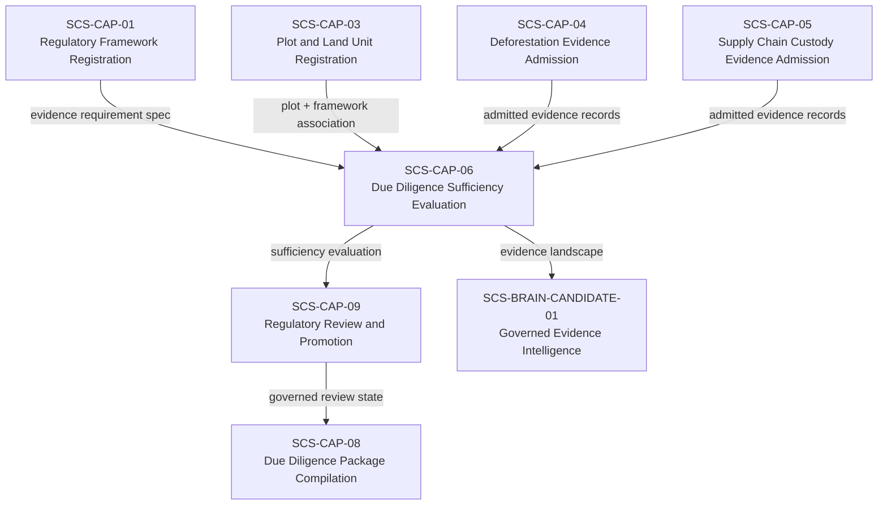
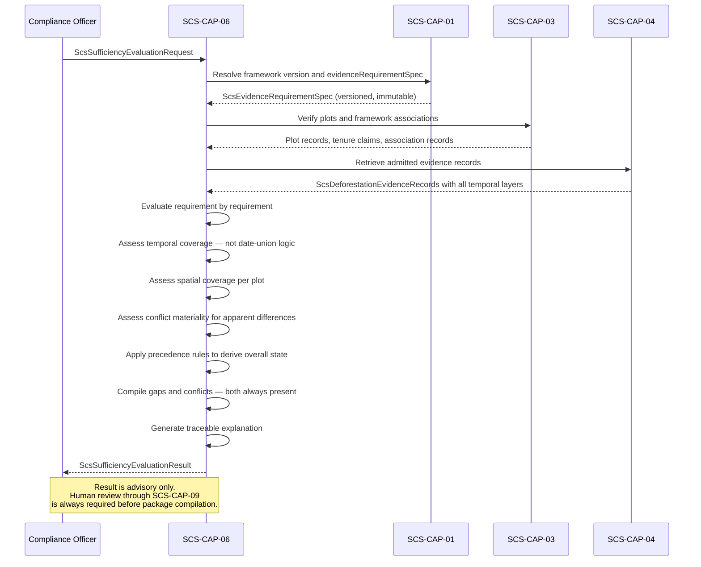

# SCS-CAP-06 — Due Diligence Sufficiency Evaluation — Canonical Contract — 2026-09-22

**Status:** CANONICAL CONTRACT — NOT IMPLEMENTATION
**Domain:** Supply Chain Sovereignty (SCS)
**Authority:** DEFINES THE CONTRACT FOR SCS-CAP-06. Establishes no commissioning, production, Gate D, WP05, scientific-validity or regulatory authority. This capability is PROPOSED_NOT_ADMITTED. No implementation exists.

## Plain-English boundary statement

SCS-CAP-06 evaluates the collective admitted evidence for a specific operator, commodity, regulatory framework version, and relevant period — producing an honest, structured sufficiency landscape that identifies what is satisfied, what is missing, what is conflicting, and what requires human decision. It does not make legal compliance determinations. It does not produce or authorise due diligence statements. It does not resolve conflicts by selecting the more convenient evidence. It does not treat simple date-union as proof of continuous temporal coverage.

## The governing sentence

> A gap says the evidence landscape is incomplete. A conflict says the evidence landscape contains materially incompatible claims. CAP-06 must preserve that distinction, expose both when they coexist, and never hide either behind a generic human-review state.

## What SUFFICIENT means — and what it does not

`SUFFICIENT` under SCS-CAP-06 means:

> Sufficient under the evaluated evidence-requirement specification, for the evaluated commodity, framework version, plots, and relevant period, as of the evaluation date.

`SUFFICIENT` does not mean:
- legally compliant
- approved for market placement
- due diligence completed
- negligible risk formally determined
- due diligence statement authorised
- regulatory review completed

`SUFFICIENT` is a sufficiency finding. The legal compliance determination remains with the named human operator. SCS-CAP-09 is the human gate before any package can be compiled.

## Gaps versus conflicts — a fundamental distinction

| Condition | Definition | Appropriate response |
|---|---|---|
| Gap | Required information is absent, incomplete, or does not cover the required scope | Obtain additional evidence |
| Conflict | Credible admitted evidence supports incompatible propositions about the same material subject | Investigate and resolve the contradiction |

These are different epistemic conditions requiring different corrective action. Collapsing both into a single human-review state would conceal whether the reviewer needs more evidence or needs to reconcile evidence already present.

**Specific examples:**

| Condition | Type | Response |
|---|---|---|
| Temporal interval missing | Gap | Obtain additional temporal evidence |
| Part of plot not covered | Gap | Obtain spatially complete evidence |
| Registry status unverified | Gap | Human decision or additional verification |
| Two sources make opposing land-change claims | Conflict | Investigate and resolve the contradiction |
| Attestation exceeds analysis period | Conflict | Challenge or correct the attestation |
| Satellite result conflicts with authority record | Conflict | Examine provenance, method, dates and applicability |

## Domain position



## Overall sufficiency states

```typescript
type ScsSufficiencyState =
  | "SUFFICIENT"
  | "GAPS_REQUIRE_HUMAN_DECISION"
  | "INSUFFICIENT"
  | "CONFLICTING_EVIDENCE"
  | "FAIL_CLOSED";
```

### Precedence rules — deterministic when multiple conditions coexist

When several conditions exist simultaneously, the overall state is determined by this precedence order. The highest-priority condition that applies determines the overall state. All conditions present are still reported in full — the overall state communicates the most urgent blocker, not the complete picture.

| Priority | State | Apply when |
|---|---|---|
| 1 | `FAIL_CLOSED` | CAP-06 cannot produce a trustworthy evaluation |
| 2 | `CONFLICTING_EVIDENCE` | At least one applicable requirement has a material unresolved contradiction |
| 3 | `INSUFFICIENT` | One or more mandatory requirements are unsatisfied with no bounded human-discretion path |
| 4 | `GAPS_REQUIRE_HUMAN_DECISION` | Gaps exist, no material unresolved conflict, framework permits human determination |
| 5 | `SUFFICIENT` | Every applicable mandatory requirement satisfied, no material conflict, no mandatory gap |

### When to apply each state

**`FAIL_CLOSED`** — use when CAP-06 cannot produce a trustworthy evaluation:
- Framework version cannot be resolved
- Evidence integrity failed
- Access scope is invalid
- Required dependencies are unavailable
- Plot or framework association cannot be established
- Evidence identifiers cannot be completely resolved

This is an evaluation failure, not an adverse compliance conclusion.

**`CONFLICTING_EVIDENCE`** — use when at least one applicable requirement has a material unresolved contradiction. Any gaps must still be reported alongside the conflict. The conflict state must not make gaps disappear.

**`INSUFFICIENT`** — use when one or more mandatory requirements are unsatisfied and the framework specification provides no bounded human-discretion path capable of curing that state using the present evidence. This is a sufficiency outcome — not a final legal non-compliance decision.

**`GAPS_REQUIRE_HUMAN_DECISION`** — use when: gaps exist; no material unresolved conflict exists; the applicable framework permits or requires a recorded human determination; and the present evidence does not justify `SUFFICIENT`.

**`SUFFICIENT`** — use only when every applicable mandatory requirement is satisfied, no material unresolved conflict exists, no mandatory gap remains, all required spatial and temporal evaluations pass, and all provenance and authority requirements pass.

### When gaps and conflicts coexist

If a plot has no evidence for part of 2022, and two admitted sources contradict each other about land-cover change in 2024, the overall result is:

```json
{
  "overallState": "CONFLICTING_EVIDENCE",
  "hasEvidenceGaps": true,
  "hasMaterialUnresolvedConflicts": true
}
```

The output must include both the uncovered 2022 interval and the unresolved 2024 contradiction. The single overall state communicates the most urgent blocker. The structured result preserves the complete landscape.

## Conflict materiality — not every apparent difference is a conflict

CAP-06 must first determine whether an apparent difference is a genuine material conflict before declaring `CONFLICTING_EVIDENCE`.

```typescript
type ConflictMateriality =
  | "NONE"
  | "APPARENT_BUT_COMPATIBLE"
  | "NON_MATERIAL"
  | "MATERIAL_RESOLVED"
  | "MATERIAL_UNRESOLVED";
```

**Examples of evidence that may appear different without actually conflicting:**
- Two sources cover different time periods
- One concerns deforestation and another generic tree-cover change
- One covers the entire plot while another covers only a sub-area
- Different sources use compatible measurement tolerances
- One source reports no event detected while another reports low-confidence possible change outside the claimed production area

CAP-06 should declare `CONFLICTING_EVIDENCE` only when all seven conditions are met:
1. Both records are admissible
2. They concern the same material subject
3. Their spatial and temporal scopes overlap sufficiently
4. They address the same applicable requirement or proposition
5. Their claims are genuinely incompatible
6. The conflict is material to sufficiency
7. It remains unresolved

## Core interfaces

### Sufficiency evaluation request

```typescript
interface ScsSufficiencyEvaluationRequest {
  requestId: string;
  requestedBy: ActorReference;
  requestedAt: string;

  // What is being evaluated
  subject: {
    plotIds: string[];
    plotVersions?: Record<string, number>;
    commodityCode: string;
    relevantProductCode?: string;
  };

  // Which framework governs this evaluation
  framework: {
    frameworkId: string;
    frameworkVersion: string;
    evidenceRequirementSpecId: string;
  };

  // The period the evaluation must cover
  // Framework-required period — not hardcoded here
  evaluationPeriod: {
    referenceDate: string;
    evaluationEndDate: string;
    assessmentType:
      | "DEFORESTATION"
      | "FOREST_DEGRADATION"
      | "BOTH";
  };

  // Which admitted evidence is in scope
  evidenceScope: {
    admittedEvidenceIds: string[];
    includeEvidenceWithLimitations: boolean;
    // Quarantined evidence must never be included
    includeQuarantinedEvidence: false;
  };

  // Which dimensions to evaluate
  requestedAnalysis: Array
    | "TEMPORAL_COVERAGE"
    | "SPATIAL_COVERAGE"
    | "REQUIREMENT_BY_REQUIREMENT"
    | "CONFLICT_DETECTION"
    | "GAP_IDENTIFICATION"
    | "PROVENANCE_AND_AUTHORITY"
  >;
}
```

### Evidence gap record

```typescript
interface ScsEvidenceGap {
  gapId: string;
  requirementCode: string;

  gapType:
    | "TEMPORAL_INTERVAL_MISSING"
    | "SPATIAL_AREA_NOT_COVERED"
    | "REGISTRY_VERIFICATION_ABSENT"
    | "TENURE_VERIFICATION_ABSENT"
    | "ATTESTATION_ABSENT"
    | "PROVENANCE_INCOMPLETE"
    | "EVIDENCE_TYPE_NOT_PROVIDED"
    | "AUTHORITY_CONFIRMATION_ABSENT"
    | "RESOLUTION_BELOW_REQUIREMENT"
    | "OTHER";

  subject: {
    plotId: string;
    subjectType: string;
    subjectReference?: string;
  };

  // For temporal gaps
  uncoveredPeriod?: {
    start: string;
    end: string;
    reason: string;
  };

  // For spatial gaps
  uncoveredAreaReference?: string;
  uncoveredAreaPercent?: number;

  automaticFailure: boolean;
  humanDecisionRequired: boolean;
  explanation: string;
}
```

### Evidence conflict record

```typescript
interface ScsEvidenceConflict {
  conflictId: string;
  requirementCode: string;

  subject: {
    plotId: string;
    subjectType: string;
    subjectReference?: string;
  };

  // The two admitted evidence items that conflict
  evidenceAId: string;
  evidenceBId: string;

  // What each claims — preserved exactly as stated
  propositionA: string;
  propositionB: string;

  // Overlap that makes this a genuine conflict
  temporalOverlap?: {
    start: string;
    end: string;
  };
  spatialOverlapReference?: string;

  materiality: ConflictMateriality;

  conflictType:
    | "OPPOSING_FINDINGS"
    | "INCOMPATIBLE_TEMPORAL_CLAIMS"
    | "INCOMPATIBLE_SPATIAL_CLAIMS"
    | "PROVENANCE_CONFLICT"
    | "METHOD_CONFLICT"
    | "AUTHORITY_CONFLICT"
    | "PLOT_VERSION_CONFLICT"
    | "OTHER";

  explanation: string;

  resolutionStatus:
    | "UNRESOLVED"
    | "RESOLVED"
    | "REQUIRES_ADDITIONAL_EVIDENCE"
    | "REQUIRES_AUTHORITY_CONFIRMATION";

  // Only present when resolutionStatus is RESOLVED
  resolutionDecisionId?: string;
}
```

### Requirement-level evaluation

Each requirement retains its own result. The overall state is derived from requirement-level results using the precedence rules — it does not replace them.

```typescript
type ScsRequirementEvaluationState =
  | "SATISFIED"
  | "PARTIALLY_SATISFIED"
  | "GAP_REQUIRES_HUMAN_DECISION"
  | "UNSATISFIED"
  | "CONFLICTING_EVIDENCE"
  | "NOT_APPLICABLE"
  | "FAIL_CLOSED";

interface ScsRequirementEvaluation {
  requirementCode: string;
  evidenceRequirementSpecId: string;

  state: ScsRequirementEvaluationState;

  supportingEvidenceIds: string[];
  conflictingEvidenceIds: string[];

  gaps: ScsEvidenceGap[];
  conflicts: ScsEvidenceConflict[];

  evaluationExplanation: string;
  humanDecisionRequired: boolean;

  // This result is never a compliance determination
  noComplianceDetermination: true;
}
```

### Temporal coverage evaluation

```typescript
interface ScsTemporalCoverageEvaluation {
  requiredPeriod: {
    start: string;
    end: string;
    assessmentType: "DEFORESTATION" | "FOREST_DEGRADATION" | "BOTH";
  };

  // What the collective admitted evidence actually covers
  supportedIntervals: Array<{
    start: string;
    end: string;
    evidenceIds: string[];
    coverageQuality:
      | "HIGH"
      | "MEDIUM"
      | "LOW"
      | "UNASSESSED";
    supportType: string;
  }>;

  // Periods not covered — explicitly disclosed
  uncoveredIntervals: Array<{
    start: string;
    end: string;
    reason: string;
    gapId: string;
  }>;

  // Periods where admitted evidence appears to conflict
  conflictingIntervals: Array<{
    start: string;
    end: string;
    conflictId: string;
    explanation: string;
  }>;

  // Attestations that claim broader coverage than the
  // underlying analysis supports
  attestationExceedingAnalysis: Array<{
    evidenceId: string;
    attestedStart: string;
    attestedEnd: string;
    analysisStart: string;
    analysisEnd: string;
    explanation: string;
  }>;

  // Coverage is never determined by simple date-union
  coverageNote: string;
}
```

### Spatial coverage evaluation

```typescript
interface ScsSpatialCoverageEvaluation {
  plotId: string;
  plotVersion: number;
  registeredGeometryReference: string;

  // What the collective evidence actually covers
  coveredAreaPercent?: number;
  uncoveredAreaPercent?: number;
  uncoveredAreaReferences: string[];

  // Areas explicitly excluded from submitted analyses
  excludedAreaReferences: string[];

  // Areas where different evidence items assign
  // different land cover classifications
  spatialConflictReferences: string[];

  coverageAssessment:
    | "FULL"
    | "SUBSTANTIAL"
    | "PARTIAL"
    | "MINIMAL"
    | "NONE"
    | "NOT_EVALUATED";

  // Whether the plot geometry changed between
  // the evidence period and the evaluation date
  plotGeometryChangedSinceEvidence: boolean;
  geometryChangeNote?: string;
}
```

### Full sufficiency evaluation result

```typescript
interface ScsSufficiencyEvaluationResult {
  evaluationId: string;
  requestId: string;
  evaluatedAt: string;
  evaluatorVersion: string;

  // What was evaluated
  frameworkId: string;
  frameworkVersion: string;
  evidenceRequirementSpecId: string;
  plotIds: string[];
  commodityCode: string;
  evaluationPeriod: {
    referenceDate: string;
    evaluationEndDate: string;
    assessmentType: string;
  };

  // Overall result — derived from requirement-level results
  // using deterministic precedence rules
  overallState: ScsSufficiencyState;

  // These flags are always present regardless of overallState
  // Conflicts do not make gaps disappear
  hasEvidenceGaps: boolean;
  hasMaterialUnresolvedConflicts: boolean;
  hasFailClosedConditions: boolean;

  // Requirement-level results — the complete landscape
  requirementEvaluations: ScsRequirementEvaluation[];

  // Dimensional evaluations
  temporalCoverage: ScsTemporalCoverageEvaluation;
  spatialCoverage: ScsSpatialCoverageEvaluation[];

  // All gaps — even when overallState is CONFLICTING_EVIDENCE
  allGaps: ScsEvidenceGap[];

  // All conflicts — only material unresolved conflicts
  // affect the overall state, but all conflicts are reported
  allConflicts: ScsEvidenceConflict[];

  // Traceable explanation of the overall result
  // This is what makes the system defensible during challenge
  evaluationExplanation: string[];

  // What would need to change for the result to improve
  nextSteps: Array<{
    priority: "BLOCKING" | "SIGNIFICANT" | "ADVISORY";
    stepType:
      | "OBTAIN_TEMPORAL_EVIDENCE"
      | "OBTAIN_SPATIAL_EVIDENCE"
      | "RESOLVE_CONFLICT"
      | "HUMAN_DECISION_REQUIRED"
      | "OBTAIN_REGISTRY_VERIFICATION"
      | "CHALLENGE_ATTESTATION"
      | "OTHER";
    requirementCode: string;
    explanation: string;
  }>;

  // Permanent authority boundary — present on every result
  authorityBoundary: {
    advisoryOnly: true;
    noComplianceDetermination: true;
    noDueDiligenceStatementAuthority: true;
    noRegulatoryPromotionAuthority: true;
    sufficientMeansEvidenceSufficient: true;
    sufficientDoesNotMeanLegallyCompliant: true;
  };
}
```

## Evaluation sequence



## Human-resolution boundary

A human must not be allowed to resolve a conflict merely by selecting the more convenient evidence. A valid resolution record must contain:

- Which conflict was examined
- Which evidence items were compared
- What provenance and methods were considered
- The reason for resolution
- Whether one source was found inapplicable
- Whether additional evidence was obtained
- Limitations that remain after resolution
- Reviewer identity and authority basis
- Timestamp
- Whether re-evaluation is required

CAP-06 may consume a valid resolution record in a later evaluation. CAP-06 must not create that resolution record itself — resolution is a human act, not an evaluation output.

## What CAP-06 does not do

**Sufficiency is not simple date-union logic.** Two evidence items whose declared periods join together do not necessarily establish adequate coverage. CAP-06 must consider:
- Whether the evidence covers the entire plot spatially
- Sensor resolution and minimum detectable change
- Cloud and atmospheric interference
- Acquisition frequency relative to the risk of undetected change
- Analytical method sensitivity and detection target
- Baseline data quality
- Whether land-cover change could occur undetected between observations
- Whether the analysis was designed to detect the required kind of change
- Contradictions between different sources
- Framework-specific evidentiary standards

CAP-06 does not:
- Produce or authorise due diligence statements
- Make legal compliance determinations
- Resolve conflicts by selecting preferred evidence
- Treat attestation period as equivalent to analysis period
- Manufacture temporal coverage from incompatible sources
- Promote evidence into accepted regulatory knowledge
- Replace SCS-CAP-09's human review gate

## Provider-neutral interface

```typescript
interface ScsSufficiencyEvaluationProvider {
  evaluateSufficiency(
    request: ScsSufficiencyEvaluationRequest
  ): Promise<ScsSufficiencyEvaluationResult>;

  getEvaluationResult(
    evaluationId: string
  ): Promise<ScsSufficiencyEvaluationResult>;

  listEvaluationsForPlot(
    plotId: string,
    frameworkId?: string
  ): Promise<ScsSufficiencyEvaluationResult[]>;

  // Submit a human conflict resolution record
  // CAP-06 does not create resolutions — it consumes them
  submitConflictResolution(
    resolution: ScsConflictResolutionRecord
  ): Promise<ScsConflictResolutionRecord>;

  // Re-evaluate after new evidence admission or
  // conflict resolution — produces a new evaluation record,
  // never modifies the previous one
  requestReEvaluation(
    originalEvaluationId: string,
    request: ScsSufficiencyEvaluationRequest
  ): Promise<ScsSufficiencyEvaluationResult>;
}
```

## Failure contract

```typescript
interface ScsSufficiencyEvaluationFailure {
  ok: false;
  capabilityId: "SCS-CAP-06";
  result: "FAIL_CLOSED";

  error:
    | "REQUESTOR_NOT_AUTHORISED"
    | "FRAMEWORK_VERSION_NOT_RESOLVED"
    | "EVIDENCE_REQUIREMENT_SPEC_NOT_FOUND"
    | "PLOT_NOT_FOUND"
    | "FRAMEWORK_ASSOCIATION_NOT_FOUND"
    | "EVIDENCE_RECORD_NOT_RESOLVED"
    | "EVIDENCE_INTEGRITY_FAILED"
    | "QUARANTINED_EVIDENCE_IN_SCOPE"
    | "ACCESS_SCOPE_INVALID"
    | "DEPENDENCY_UNAVAILABLE";

  reasons: string[];
  noEvaluationProduced: true;
}
```

## Traceable explanation — what makes this defensible

When an evaluation cannot reach `SUFFICIENT`, CAP-06 must produce a traceable, numbered explanation. Example:

```
Evaluation cannot reach SUFFICIENT because:

1. Framework requirement EUDR-DEF-01 covers 2021-01-01 to 2026-09-22.
2. Admitted evidence supports 2021-01-01 to 2023-02-14.
3. The remaining source is a point-in-time observation from 2025-06-08.
4. No admitted evidence supports the intervening period 2023-02-15 to 2025-06-07.
5. Source AAB-EV-00247's attestation extends to 2025-06-08 but its
   disclosed analysis period ends 2023-02-14.
6. This attestation cannot manufacture coverage for the missing interval.
7. Human review cannot remove the missing-evidence fact.
```

This makes the system defensible when a due diligence statement is challenged — the institution can demonstrate exactly what the evaluation found, why it found it, and what evidence was missing.

## What this document does not establish

- It does not admit SCS-CAP-06 as a canonical capability — that requires the ten-point admission checklist
- It does not implement, deploy or migrate anything
- It does not make legal compliance determinations on behalf of any operator
- It does not produce or authorise due diligence statements
- `SUFFICIENT` in this contract means sufficient under the evaluated evidence-requirement specification — it does not mean legally compliant, approved for market, or due diligence completed
- It does not alter commissioning status, satisfy Gate D, close WP05, or grant any production or commissioning authority
