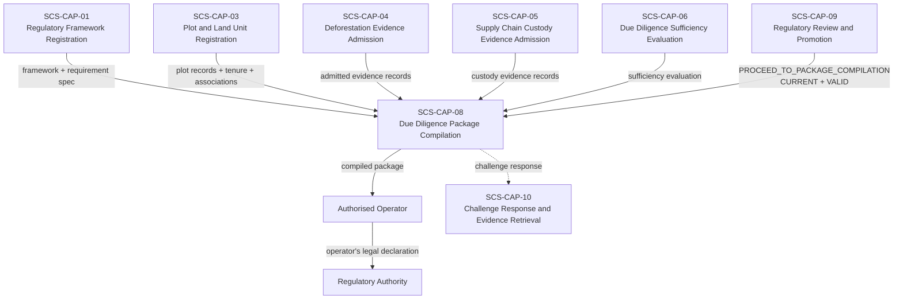
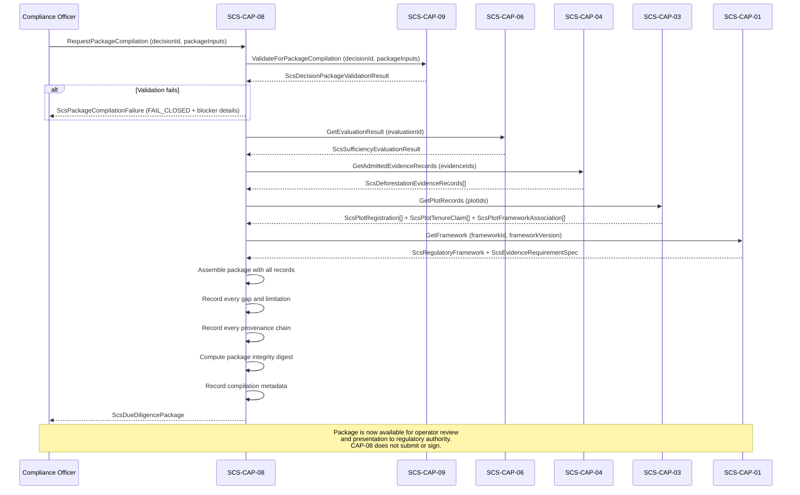

# SCS-CAP-08 — Due Diligence Package Compilation — Canonical Contract — 2026-09-22

**Status:** CANONICAL CONTRACT — NOT IMPLEMENTATION
**Domain:** Supply Chain Sovereignty (SCS)
**Authority:** DEFINES THE CONTRACT FOR SCS-CAP-08. Establishes no commissioning,
production, Gate D, WP05, scientific-validity or regulatory authority. This
capability is PROPOSED_NOT_ADMITTED. No implementation exists.

## Plain-English boundary statement

SCS-CAP-08 compiles a governed due diligence package — assembling all admitted
evidence records, provenance chains, plot registrations, tenure claims, framework
associations, sufficiency evaluation, and the human review decision into a
structured, traceable record that an authorised operator can present to a
regulatory authority. It does not submit the package. It does not sign on behalf
of the operator. It does not declare legal compliance. It does not assume the
operator's legal responsibility. It produces an honest record of what is known,
what its provenance is, what gaps remain, and what the compliance officer decided
— and it fails closed if the CAP-09 gate has not been properly cleared.

## The governing principle

> CAP-08 does not produce compliance. It produces a governed evidence package
> that honestly records what is known, what its provenance is, and what gaps
> remain. The operator presents that package and makes their legal declaration.
> CAP-08 is not the declaration. It is the record that supports it.

## The CAP-09 gate — non-negotiable

SCS-CAP-08 may begin compilation only when all of the following are confirmed:

- A CAP-09 decision exists for this subject and framework
- `decisionOutcome` is `PROCEED_TO_PACKAGE_COMPILATION`
- `recordValidity` is `VALID`
- `currencyStatus` is `CURRENT`
- The CAP-09 decision's `evaluationId` exactly matches the CAP-06 evaluation
  being packaged
- The CAP-09 decision's `frameworkVersion` exactly matches the package inputs
- The CAP-09 decision's `plotIds` exactly match the package inputs

If any condition fails, CAP-08 must fail closed. It does not produce a partial
package. It does not produce a draft. It does not proceed with warnings. It
stops and reports exactly which condition failed and what is required.

This gate does not erase prior decisions — it prevents continued reliance on
a stale or mismatched decision for a new package.

## What a due diligence package is — and is not

**A due diligence package is:**
- A structured, traceable, governed record of every piece of admitted evidence,
  its provenance, its limitations, and its relationship to the applicable
  framework requirements
- An honest disclosure of every gap that was identified and how it was addressed
  or left unresolved
- A permanent record of the sufficiency evaluation and the human review decision
  that authorised compilation
- A document an operator can present to a regulatory authority as evidence that
  due diligence was performed — with full traceability back to every source

**A due diligence package is not:**
- A compliance certificate
- A legal declaration of conformity
- A submission to any regulatory authority
- A guarantee that the commodity will be accepted by customs
- A replacement for the operator's own legal responsibility
- A statement that all evidence is sufficient — it honestly records what is
  sufficient and what gaps remain

## Domain position



## Package compilation sequence



## Core interfaces

### Package compilation request

```typescript
interface ScsPackageCompilationRequest {
  requestId: string;
  requestedBy: ActorReference;
  requestedAt: string;

  // The CAP-09 decision that authorises this compilation
  // Must be CURRENT, VALID, PROCEED_TO_PACKAGE_COMPILATION
  reviewDecisionId: string;

  // Package scope — must exactly match the CAP-09 decision
  operatorId: string;
  frameworkId: string;
  frameworkVersion: string;
  commodityCode: string;
  plotIds: string[];

  // The CAP-06 evaluation being packaged
  // Must exactly match the CAP-09 decision's evaluationId
  evaluationId: string;

  // Evidence scope — must include all evidence in the evaluation
  deforestationEvidenceIds: string[];
  custodyEvidenceIds?: string[];

  // Package metadata
  packageTitle?: string;
  packageLanguage?: string;
  operatorDeclarationText?: string;
}
```

### Due diligence package — the compiled record

```typescript
interface ScsDueDiligencePackage {
  // Package identity
  packageId: string;
  schemaVersion: string;
  compiledAt: string;
  compiledBy: ActorReference;

  // Package integrity — computed over all package contents
  packageDigest: string;
  digestAlgorithm: string;

  // Compilation provenance
  compilationMetadata: {
    requestId: string;
    reviewDecisionId: string;
    evaluationId: string;
    frameworkId: string;
    frameworkVersion: string;
    evidenceRequirementSpecId: string;
    compilationVersion: string;
  };

  // Section 1 — Regulatory framework
  regulatoryFramework: {
    frameworkId: string;
    frameworkVersion: string;
    regulationName: string;
    regulationVersion: string;
    regulatoryAuthority: string;
    commodityCode: string;
    commodityName: string;
    countryOfOrigin: string;
    destinationMarket: string;
    applicableNationalLaws: string[];
    evidenceRequirementSpecId: string;
    frameworkRegisteredAt: string;
  };

  // Section 2 — Operator identity
  operator: {
    operatorId: string;
    operatorName: string;
    operatorOrganizationType: string;
    countryOfOperation: string;
    authorisedRepresentativeId?: string;
  };

  // Section 3 — Plot and land unit records
  plots: Array<{
    plotId: string;
    plotVersion: number;
    plotName?: string;
    countryCode: string;
    administrativeAreas?: string[];
    geometryCaptureMethod: string;
    positionalAccuracyMetres?: number;
    registryVerificationStatus: string;
    overlapState: string;
    tenureClaims: Array<{
      tenureClaimId: string;
      claimantType: string;
      tenureBasis: string;
      verificationStatus: string;
      limitations: string[];
    }>;
    frameworkAssociationId: string;
    registrationStatus: string;
    // Gaps in plot registration — disclosed, not hidden
    plotGaps: Array<{
      gapType: string;
      explanation: string;
    }>;
  }>;

  // Section 4 — Admitted evidence records
  deforestationEvidence: Array<{
    evidenceId: string;
    evidenceVersion: number;
    evidenceType: string;
    plotId: string;
    source: {
      sourceOrganizationId: string;
      sourceTitle?: string;
      providerName?: string;
      sourceReference: string;
      issuingAuthority?: string;
    };
    provenance: {
      submittedBy: string;
      submittedAt: string;
      contentDigest: string;
      integrityStatus: string;
      chainOfCustodyComplete: boolean;
    };
    temporalCoverage: {
      acquisitionInstant?: string;
      acquisitionStart?: string;
      acquisitionEnd?: string;
      analysisPeriodStart?: string;
      analysisPeriodEnd?: string;
      attestedPeriodStart?: string;
      attestedPeriodEnd?: string;
      coverageMode: string;
      knownGapPeriods: Array<{
        start: string;
        end: string;
        reason: string;
      }>;
    };
    spatialCoverage: {
      intersectionWithPlot: string;
      plotCoveragePercent?: number;
      spatialResolutionMetres?: number;
    };
    evidenceClaim: {
      claimType: string;
      claimSummary: string;
      claimedPeriodStart?: string;
      claimedPeriodEnd?: string;
      confidence: string;
      limitations: string[];
    };
    admissionStatus: string;
    admissionLimitations: string[];
  }>;

  // Section 5 — Sufficiency evaluation
  sufficiencyEvaluation: {
    evaluationId: string;
    evaluatedAt: string;
    overallState: string;
    hasEvidenceGaps: boolean;
    hasMaterialUnresolvedConflicts: boolean;
    evaluationExplanation: string[];
    requirementEvaluations: Array<{
      requirementCode: string;
      state: string;
      evaluationExplanation: string;
      humanDecisionRequired: boolean;
    }>;
    temporalCoverage: {
      requiredPeriodStart: string;
      requiredPeriodEnd: string;
      supportedIntervals: Array<{
        start: string;
        end: string;
        evidenceIds: string[];
      }>;
      uncoveredIntervals: Array<{
        start: string;
        end: string;
        reason: string;
      }>;
    };
    // All gaps — disclosed in full
    allGaps: Array<{
      gapId: string;
      gapType: string;
      explanation: string;
      humanDecisionRequired: boolean;
    }>;
    // All conflicts — disclosed in full
    allConflicts: Array<{
      conflictId: string;
      conflictType: string;
      explanation: string;
      resolutionStatus: string;
    }>;
  };

  // Section 6 — Human review decision
  reviewDecision: {
    decisionId: string;
    decisionOutcome: string;
    decidedAt: string;
    reviewer: {
      reviewerId: string;
      reviewerName: string;
      reviewerOrganizationId: string;
      authorityBasis: string;
    };
    reviewReasoning: {
      evaluationSummaryAssessed: string;
      gapsConsidered: string[];
      conflictsConsidered: string[];
      limitationsAcknowledged: string[];
      basisForOutcome: string;
      remainingConcerns?: string[];
    };
    currencyStatusAtCompilation: string;
    recordValidityAtCompilation: string;
  };

  // Section 7 — Gap disclosure — every gap, not just blocking ones
  gapDisclosure: {
    totalGapsIdentified: number;
    blockingGaps: Array<{
      gapId: string;
      requirementCode: string;
      gapType: string;
      explanation: string;
      humanDecisionMade: boolean;
      humanDecisionId?: string;
    }>;
    nonBlockingGaps: Array<{
      gapId: string;
      requirementCode: string;
      gapType: string;
      explanation: string;
    }>;
    gapDisclosureStatement: string;
  };

  // Section 8 — Package limitations
  packageLimitations: string[];

  // Section 9 — Authority boundary
  // Present on every compiled package — cannot be removed
  authorityBoundary: {
    compiledNotSubmitted: true;
    operatorMustMakeDeclaration: true;
    noComplianceDetermination: true;
    doesNotGuaranteeRegulatoryAcceptance: true;
    legalResponsibilityRemainsWithOperator: true;
    sufficientEvidenceDoesNotMeanLegallyCompliant: true;
    gapsDisclosedNotResolved: true;
  };

  // Section 10 — Challenge response support
  // Records what SCS-CAP-10 would need to retrieve this package
  challengeResponseMetadata: {
    packageDigest: string;
    allEvidenceIds: string[];
    allProvenanceChains: string[];
    compilationTimestamp: string;
    retrievableViaCapability: "SCS-CAP-10";
  };
}
```

### Compilation decision record

```typescript
interface ScsPackageCompilationDecision {
  compilationId: string;
  packageId: string;
  requestId: string;

  decision:
    | "COMPILED"
    | "FAILED_GATE_CHECK"
    | "FAILED_COMPILATION";

  // Gate check results — all must pass
  gateChecks: {
    reviewDecisionFound: boolean;
    outcomePermitsCompilation: boolean;
    recordIsValid: boolean;
    currencyIsCurrent: boolean;
    evaluationIdMatches: boolean;
    frameworkVersionMatches: boolean;
    plotIdsMatch: boolean;
  };

  // If failed — what must happen before compilation
  blockers?: Array<{
    blockerType: string;
    explanation: string;
    requiredAction: string;
  }>;

  compiledAt?: string;
  packageDigest?: string;
}
```

## What the package discloses honestly

A due diligence package compiled by CAP-08 explicitly states:

**For every plot:**
- The geometry capture method and its accuracy
- The registry verification status — `VERIFIED`, `UNVERIFIED`, `CONFLICTING`, or `REGISTRY_UNAVAILABLE`
- Every tenure claim and its verification status
- Every gap in plot registration

**For every evidence item:**
- All four temporal layers — acquisition, analysis, attested, and framework-required — recorded separately
- Spatial coverage including excluded areas
- The claim exactly as the source stated it — `NO_DEFORESTATION_DETECTED` not `NO_DEFORESTATION_OCCURRED`
- Every known gap period within the temporal coverage
- Every limitation stated by the source

**For the sufficiency evaluation:**
- The overall state — including `CONFLICTING_EVIDENCE` and `GAPS_REQUIRE_HUMAN_DECISION` if that was the result
- Every requirement evaluation result
- Every gap — blocking and non-blocking
- Every conflict — resolved and unresolved
- The traceable explanation of why the result was reached

**For the human review:**
- The exact outcome — `PROCEED_TO_PACKAGE_COMPILATION` not "approved"
- The substantive reasoning the reviewer recorded
- The reviewer's identity and authority basis
- The currency status and record validity at compilation time

**The gap disclosure section** states in plain language what gaps exist, which were addressed through human decision, and which remain unresolved. It does not paper over gaps. It does not aggregate them into a summary that obscures their nature.

## Provider-neutral interface

```typescript
interface ScsDueDiligencePackageProvider {
  requestCompilation(
    request: ScsPackageCompilationRequest
  ): Promise<ScsPackageCompilationDecision>;

  getPackage(
    packageId: string
  ): Promise<ScsDueDiligencePackage>;

  getPackageDigest(
    packageId: string
  ): Promise<string>;

  listPackagesForOperator(
    operatorId: string,
    frameworkId?: string
  ): Promise<ScsDueDiligencePackage[]>;

  // Verify a package's integrity after the fact
  // Used by SCS-CAP-10 for challenge response
  verifyPackageIntegrity(
    packageId: string
  ): Promise<ScsPackageIntegrityVerificationResult>;
}

interface ScsPackageIntegrityVerificationResult {
  packageId: string;
  verifiedAt: string;
  integrityStatus:
    | "INTACT"
    | "DIGEST_MISMATCH"
    | "EVIDENCE_RECORDS_CHANGED"
    | "REVIEW_DECISION_CHANGED"
    | "UNVERIFIABLE";
  detail: string;
}
```

## Failure contract

```typescript
interface ScsPackageCompilationFailure {
  ok: false;
  capabilityId: "SCS-CAP-08";
  result: "FAIL_CLOSED";

  error:
    | "REQUESTOR_NOT_AUTHORISED"
    | "REVIEW_DECISION_NOT_FOUND"
    | "REVIEW_DECISION_NOT_CURRENT"
    | "REVIEW_DECISION_NOT_VALID"
    | "REVIEW_DECISION_OUTCOME_NOT_PROCEED"
    | "EVALUATION_ID_MISMATCH"
    | "FRAMEWORK_VERSION_MISMATCH"
    | "PLOT_IDS_MISMATCH"
    | "EVIDENCE_RECORDS_NOT_RESOLVED"
    | "EVIDENCE_INTEGRITY_FAILED"
    | "PLOT_RECORDS_NOT_FOUND"
    | "FRAMEWORK_NOT_FOUND"
    | "DEPENDENCY_UNAVAILABLE";

  // Exact gate check that failed
  failedGateCheck?: string;
  reasons: string[];
  noPackageCompiled: true;
  noPartialPackage: true;
}
```

## What CAP-08 does not do

- Does not submit the package to any regulatory authority
- Does not sign on behalf of the operator
- Does not assume the operator's legal responsibility
- Does not produce a package that asserts compliance
- Does not resolve gaps — discloses them
- Does not resolve conflicts — discloses them
- Does not strengthen evidence claims beyond what sources declared
- Does not produce a partial package when the gate fails
- Does not produce a draft package that bypasses the CAP-09 gate
- Does not interpret the package's contents for the regulatory authority

## Relationship to SCS-CAP-10

Every compiled package records `challengeResponseMetadata` containing the 
package digest, all evidence IDs, all provenance chains, and the compilation 
timestamp. When a due diligence statement is challenged, SCS-CAP-10 uses this 
metadata to retrieve the exact package that was compiled at the time of the 
statement, verify its integrity digest, and prove the provenance chain is 
intact. A package that passes `verifyPackageIntegrity` after a challenge 
demonstrates that the evidence record has not been altered since compilation.

## What this document does not establish

- It does not admit SCS-CAP-08 as a canonical capability — that requires
  the ten-point admission checklist
- It does not implement, deploy or migrate anything
- It does not declare any commodity, plot, or supply chain legally compliant
- A compiled package is not a due diligence statement — it is the governed
  evidence record that supports one
- It does not alter commissioning status, satisfy Gate D, close WP05, or
  grant any production or commissioning authority
- The legal responsibility for any due diligence statement remains at all
  times with the named human operator
