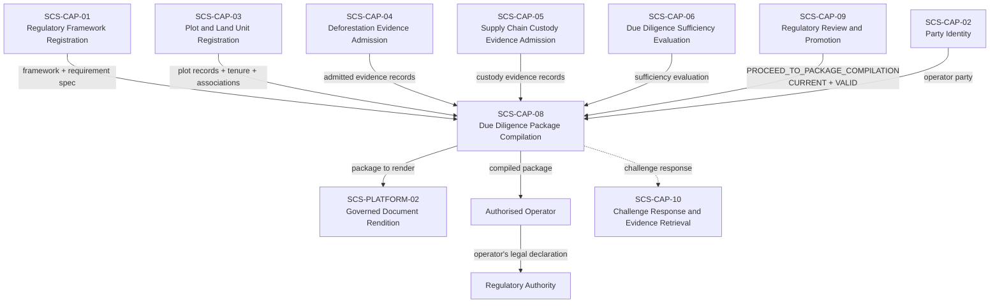
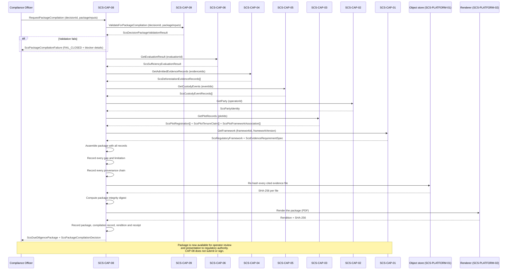

# SCS-CAP-08 — Due Diligence Package Compilation — Canonical Contract — 2026-09-22

**Status:** CANONICAL CONTRACT — NOT IMPLEMENTATION
**Domain:** Supply Chain Sovereignty (SCS)
**Authority:** DEFINES THE CONTRACT FOR SCS-CAP-08. Establishes no commissioning,
production, Gate D, WP05, scientific-validity or regulatory authority. This
capability is PROPOSED_NOT_ADMITTED. No implementation exists.

## Plain-English boundary statement

SCS-CAP-08 compiles a governed due diligence package — assembling all admitted
evidence records, provenance chains, plot registrations, tenure claims, framework
associations, sufficiency evaluation, and the human review decision into a
structured, traceable record that an authorised operator can present to a
regulatory authority. It does not submit the package. It does not sign on behalf
of the operator. It does not declare legal compliance. It does not assume the
operator's legal responsibility. It produces an honest record of what is known,
what its provenance is, what gaps remain, and what the compliance officer decided
— and it fails closed if the CAP-09 gate has not been properly cleared.

## The governing principle

> CAP-08 does not produce compliance. It produces a governed evidence package
> that honestly records what is known, what its provenance is, and what gaps
> remain. The operator presents that package and makes their legal declaration.
> CAP-08 is not the declaration. It is the record that supports it.

## The CAP-09 gate — non-negotiable

SCS-CAP-08 may begin compilation only when all of the following are confirmed:

- A CAP-09 decision exists for this subject and framework
- `decisionOutcome` is `PROCEED_TO_PACKAGE_COMPILATION`
- `recordValidity` is `VALID`
- `currencyStatus` is `CURRENT`
- The CAP-09 decision's `evaluationId` exactly matches the CAP-06 evaluation
  being packaged
- The CAP-09 decision's `frameworkVersion` exactly matches the package inputs
- The CAP-09 decision's `plotIds` exactly match the package inputs

If any condition fails, CAP-08 must fail closed. It does not produce a partial
package. It does not produce a draft. It does not proceed with warnings. It
stops and reports exactly which condition failed and what is required.

This gate does not erase prior decisions — it prevents continued reliance on
a stale or mismatched decision for a new package.

## What a due diligence package is — and is not

**A due diligence package is:**
- A structured, traceable, governed record of every piece of admitted evidence,
  its provenance, its limitations, and its relationship to the applicable
  framework requirements
- An honest disclosure of every gap that was identified and how it was addressed
  or left unresolved
- A permanent record of the sufficiency evaluation and the human review decision
  that authorised compilation
- A document an operator can present to a regulatory authority as evidence that
  due diligence was performed — with full traceability back to every source

**A due diligence package is not:**
- A compliance certificate
- A legal declaration of conformity
- A submission to any regulatory authority
- A guarantee that the commodity will be accepted by customs
- A replacement for the operator's own legal responsibility
- A statement that all evidence is sufficient — it honestly records what is
  sufficient and what gaps remain

## The three artefacts

A compilation produces up to three distributable artefacts: what an operator can hold, present
or hand to a regulatory authority. Only the first is the record.

1. **The package**: canonical JSON, the governed record (`ScsDueDiligencePackageEnvelope`). Its
   content is digested as "The package digest" describes. It is the only authoritative
   artefact.
2. **The PDF rendition**: a human-readable presentation of the package, rendered from the stored
   package only, under SCS-PLATFORM-02 (governed document rendition). It is never the record.
   Its SHA-256 is recorded, and every page shows the `packageDigest` it presents.
3. **The evidence export bundle**: the original evidence files the package cites, each verified
   against its recorded SHA-256, with a manifest bound to the `packageDigest`. Specified now
   (see "The evidence export bundle"); its implementation is deferred.

**The binding is one way.** The rendition and the bundle name the package's digest; the package
never names them. Either can be produced later without changing the package or its digest.

**Governance evidence, not a distributable artefact.** The compilation record and its receipt
(`ScsPackageCompilationDecision`, receipt `PACKAGE_COMPILATION`) bind the process: that the gate
was passed, from which decision, at whose request, when, and which rendition was made. They are
written in the same transaction as the package and kept by SCS; they are not handed out as part
of the package.

## Domain position



## Package compilation sequence



## Core interfaces

### Package compilation request

```typescript
interface ScsPackageCompilationRequest {
  requestId: string;
  requestedBy: ActorReference;
  requestedAt: string;

  // The CAP-09 decision that authorises this compilation
  // Must be CURRENT, VALID, PROCEED_TO_PACKAGE_COMPILATION
  reviewDecisionId: string;

  // Package scope — must exactly match the CAP-09 decision
  operatorId: string;
  frameworkId: string;
  frameworkVersion: string;
  commodityCode: string;
  plotIds: string[];

  // The CAP-06 evaluation being packaged
  // Must exactly match the CAP-09 decision's evaluationId
  evaluationId: string;

  // Evidence scope — must include all evidence in the evaluation
  deforestationEvidenceIds: string[];
  custodyEvidenceIds?: string[];

  // Package metadata
  packageTitle?: string;
  packageLanguage?: string;
  operatorDeclarationText?: string;
}
```

### Due diligence package — the compiled record

```typescript
// What is stored and distributed: the package content, its digest, and the
// compilation metadata, which is outside the digest
interface ScsDueDiligencePackageEnvelope {
  package: ScsDueDiligencePackage;
  // "sha256:" followed by the lowercase hex SHA-256 of the canonical JSON of
  // package (see "The package digest")
  packageDigest: string;
  compilationMetadata: {
    packageId: string;
    compiledAt: string;
    requestedByActorId: string;
    // The SCS service that compiled the package: its name and build version
    compiledByServiceIdentity: string;
  };
}

// The package content — everything digested. Identical content always has the
// same packageDigest
interface ScsDueDiligencePackage {
  schemaVersion: string;
  // From the request, when given
  packageTitle?: string;

  // What the package was compiled from
  compilationBasis: {
    reviewDecisionId: string;
    evaluationId: string;
    frameworkId: string;
    frameworkVersion: string;
    evidenceRequirementSpecId: string;
    compilationVersion: string;
  };

  // Section 1 — Regulatory framework
  regulatoryFramework: {
    frameworkId: string;
    frameworkVersion: string;
    regulationName: string;
    regulationVersion: string;
    regulatoryAuthority: string;
    commodityCode: string;
    commodityName: string;
    countryOfOrigin: string;
    destinationMarket: string;
    applicableNationalLaws: string[];
    evidenceRequirementSpecId: string;
    frameworkRegisteredAt: string;
  };

  // Section 2 — Operator identity
  operator: {
    operatorId: string;
    operatorName: string;
    operatorOrganizationType: string;
    countryOfRegistration: string;
    // As recorded by SCS-CAP-02, when recorded
    countryOfOperation?: string;
    // Not set in the pilot (see "Open gaps")
    authorisedRepresentativeId?: string;
  };

  // Section 3 — Plot and land unit records
  plots: Array<{
    plotId: string;
    plotVersion: number;
    plotName?: string;
    countryCode: string;
    administrativeAreas?: string[];
    geometryCaptureMethod: string;
    positionalAccuracyMetres?: number;
    registryVerificationStatus: string;
    overlapState: string;
    tenureClaims: Array<{
      tenureClaimId: string;
      claimantType: string;
      tenureBasis: string;
      verificationStatus: string;
      limitations: string[];
    }>;
    frameworkAssociationId: string;
    registrationStatus: string;
    // Gaps in plot registration — disclosed, not hidden
    plotGaps: Array<{
      gapType: string;
      explanation: string;
    }>;
  }>;

  // Section 4 — Admitted evidence records
  deforestationEvidence: Array<{
    evidenceId: string;
    evidenceVersion: number;
    evidenceType: string;
    plotId: string;
    source: {
      sourceOrganizationId: string;
      sourceTitle?: string;
      providerName?: string;
      sourceReference: string;
      issuingAuthority?: string;
    };
    provenance: {
      submittedBy: string;
      submittedAt: string;
      contentDigest: string;
      integrityStatus: string;
      chainOfCustodyComplete: boolean;
    };
    temporalCoverage: {
      acquisitionInstant?: string;
      acquisitionStart?: string;
      acquisitionEnd?: string;
      analysisPeriodStart?: string;
      analysisPeriodEnd?: string;
      attestedPeriodStart?: string;
      attestedPeriodEnd?: string;
      coverageMode: string;
      knownGapPeriods: Array<{
        start: string;
        end: string;
        reason: string;
      }>;
    };
    // intersectionWithPlot is as SCS-CAP-04 recorded it: NOT_VERIFIED in the
    // pilot (no spatial database). plotCoveragePercent, which SCS-CAP-04
    // records only as declared, is absent
    spatialCoverage: {
      intersectionWithPlot: string;
      plotCoveragePercent?: number;
      spatialResolutionMetres?: number;
      excludedAreaIds: string[];
    };
    evidenceClaim: {
      claimType: string;
      claimSummary: string;
      claimedPeriodStart?: string;
      claimedPeriodEnd?: string;
      confidence: string;
      limitations: string[];
    };
    admissionStatus: string;
    admissionLimitations: string[];
  }>;

  // Section 4b — Admitted custody events (SCS-CAP-05), every event in the
  // evaluation's manifest
  custodyEvidence: Array<{
    eventId: string;
    eventVersion: number;
    eventType: string;
    batchIdentifier: string;
    commodityCode: string;
    sourcePartyId: string;
    destinationPartyId: string;
    eventDate: string;
    timePrecision: string;
    quantity?: {
      amount: number;
      unit: string;
      measurementMethod: string;
    };
    supportingDocument: {
      documentType: string;
      documentReference: string;
      contentDigest: string;
    };
    provenance: {
      submittedBy: string;
      submittedAt: string;
      integrityStatus: string;
      chainOfCustodyComplete: boolean;
    };
    sourcePlotIds: string[];
    links: Array<{
      linkType: string;
      citedEventId: string;
      linkedEventId?: string;
    }>;
    uncertainties: string[];
    contradictions: string[];
    admissionStatus: string;
    admissionLimitations: string[];
  }>;

  // Section 5 — Sufficiency evaluation — the SCS-CAP-06 result exactly as
  // recorded, in full, so its digest can be recomputed and matched to the
  // review decision's evaluationSnapshotDigest
  sufficiencyEvaluation: {
    evaluationId: string;
    // SHA-256 of the canonical JSON of result: equals the decision's evaluationSnapshotDigest
    evaluationSnapshotDigest: string;
    // The digest of the evaluation's SUFFICIENCY_EVALUATION receipt
    evaluationReceiptDigest: string;
    result: ScsSufficiencyEvaluationResult;
  };

  // Section 6 — Human review decision — the SCS-CAP-09 decision in full, as
  // recorded: its structured reasoning, reviewer and decisionReasons. Its
  // derived currency fields (currencyStatus, currencyLastAssessedAt,
  // stalenessReasons, supersededByDecisionId, supersededAt) are left out: they
  // depend on when it is read. currencyStatusAtCompilation records that it was CURRENT
  reviewDecision: {
    decisionId: string;
    decision: ScsRegulatoryReviewDecision;
    // The digest of the decision's REGULATORY_REVIEW_DECISION receipt
    decisionReceiptDigest: string;
    currencyStatusAtCompilation: "CURRENT";
    recordValidityAtCompilation: "VALID";
  };

  // Section 7 — Gap disclosure — every gap, not just blocking ones
  gapDisclosure: {
    totalGapsIdentified: number;
    // Blocking: the SCS-CAP-06 gap has automaticFailure or humanDecisionRequired
    blockingGaps: Array<{
      gapId: string;
      requirementCode: string;
      gapType: string;
      explanation: string;
      humanDecisionMade: boolean;
      humanDecisionId?: string;
      // The reviewer's assessment of this gap, verbatim
      reviewerAssessment: string;
    }>;
    nonBlockingGaps: Array<{
      gapId: string;
      requirementCode: string;
      gapType: string;
      explanation: string;
      reviewerAssessment: string;
    }>;
    // A fixed system text (see "Gap disclosure"), never free text
    gapDisclosureStatement: string;
  };

  // Section 8 — Package limitations — system-set (see "Package limitations")
  packageLimitations: string[];

  // Section 9 — Authority boundary
  // Present on every compiled package — cannot be removed
  authorityBoundary: {
    compiledNotSubmitted: true;
    operatorMustMakeDeclaration: true;
    noComplianceDetermination: true;
    doesNotGuaranteeRegulatoryAcceptance: true;
    legalResponsibilityRemainsWithOperator: true;
    sufficientEvidenceDoesNotMeanLegallyCompliant: true;
    gapsDisclosedNotResolved: true;
  };

  // Section 10 — Challenge response support
  // Records what SCS-CAP-10 would need to retrieve this package. The digest and
  // the compilation time are in the envelope, outside the digested content
  challengeResponseMetadata: {
    allEvidenceIds: string[];
    // One per evidence item: its admission receipt and verified file digest
    allProvenanceChains: Array<{
      evidenceId: string;
      evidenceKind: "DEFORESTATION" | "CUSTODY";
      admissionReceiptId: string;
      contentDigest: string;
      fileSha256Verified: boolean;
    }>;
    retrievableViaCapability: "SCS-CAP-10";
  };
}
```

### Compilation decision record

```typescript
// Governance evidence: kept by SCS, not a distributable artefact
interface ScsPackageCompilationDecision {
  compilationId: string;
  packageId: string;
  requestId: string;

  // Only COMPILED is recorded: a failure records nothing, and its gate check
  // and blockers are reported in the failure (see "Failures record nothing")
  decision: "COMPILED";

  // Gate check results — all must pass
  gateChecks: {
    reviewDecisionFound: boolean;
    outcomePermitsCompilation: boolean;
    recordIsValid: boolean;
    currencyIsCurrent: boolean;
    evaluationIdMatches: boolean;
    frameworkVersionMatches: boolean;
    plotIdsMatch: boolean;
    operatorIdMatches: boolean;
    commodityCodeMatches: boolean;
  };

  compiledAt: string;
  compiledBy: ActorReference;
  // The envelope's compiledByServiceIdentity, bound here by the receipt
  compiledByServiceIdentity: string;
  packageDigest: string;

  // The rendition made at compilation (SCS-PLATFORM-02)
  rendition: {
    renditionId: string;
    mediaType: "application/pdf";
    sha256: string;
    rendererVersion: string;
  };
}
```

## What the package discloses honestly

A due diligence package compiled by CAP-08 explicitly states:

**For every plot:**
- The geometry capture method and its accuracy
- The registry verification status — `VERIFIED`, `UNVERIFIED`, `CONFLICTING`, or `REGISTRY_UNAVAILABLE`
- Every tenure claim and its verification status
- Every gap in plot registration

**For every evidence item:**
- All four temporal layers — acquisition, analysis, attested, and framework-required — recorded separately
- Spatial coverage including excluded areas
- The claim exactly as the source stated it — `NO_DEFORESTATION_DETECTED` not `NO_DEFORESTATION_OCCURRED`
- Every known gap period within the temporal coverage
- Every limitation stated by the source

**For every custody event:**
- The event, its parties and batch, and its date with its stated precision
- The supporting document's type, reference and verified digest
- Every link to another event, and every uncertainty and contradiction recorded
- Every limitation recorded at admission

**For the sufficiency evaluation:**
- The overall state — including `CONFLICTING_EVIDENCE` and `GAPS_REQUIRE_HUMAN_DECISION` if that was the result
- Every requirement evaluation result
- Every gap — blocking and non-blocking
- Every conflict — resolved and unresolved
- The traceable explanation of why the result was reached

**For the human review:**
- The exact outcome — `PROCEED_TO_PACKAGE_COMPILATION` not "approved"
- The substantive reasoning the reviewer recorded
- The reviewer's identity and authority basis
- The currency status and record validity at compilation time

**The gap disclosure section** states in plain language what gaps exist, which were addressed through human decision, and which remain unresolved. It does not paper over gaps. It does not aggregate them into a summary that obscures their nature.

## Compilation rules for the pilot

These rules define `requestCompilation`, `getPackage` and `verifyPackageIntegrity` for the
pilot. Every condition in the failure contract ends in `FAIL_CLOSED` and records nothing. A
compiled package is permanent: nothing about it is ever changed.

### Who compiles

- **Role.** Only a `COMPLIANCE_OFFICER` may request a compilation
  (`REQUESTOR_NOT_AUTHORISED`).
- **Independence.** The compiler is not the reviewer who made the SCS-CAP-09 decision
  (`REQUESTOR_NOT_AUTHORISED`): the reviewer authorises the step, and someone else takes it. The
  compiler may be the actor who requested the evaluation.

### The gate

The gate is SCS-CAP-09's `validateForPackageCompilation`, called in SCS-CAP-08's own
transaction, so it is defined once. It performs the seven checks of "The CAP-09 gate" and two
more (the operator and the commodity), deriving the decision's currency in the same snapshot.
Each failed check has its own code, and the failure names the check (`failedGateCheck`) and
every blocker the validation reported. When several fail, the code is the first in this order:

| Check | Code |
|---|---|
| the decision exists | `REVIEW_DECISION_NOT_FOUND` |
| its outcome is `PROCEED_TO_PACKAGE_COMPILATION` | `REVIEW_DECISION_OUTCOME_NOT_PROCEED` |
| its `recordValidity` is `VALID` | `REVIEW_DECISION_NOT_VALID` |
| its currency is `CURRENT` | `REVIEW_DECISION_NOT_CURRENT` |
| `evaluationId` equals the decision's | `EVALUATION_ID_MISMATCH` |
| `frameworkId` and `frameworkVersion` equal the decision's | `FRAMEWORK_VERSION_MISMATCH` |
| `plotIds` equal the decision's, as sets | `PLOT_IDS_MISMATCH` |
| `operatorId` equals the decision's | `OPERATOR_MISMATCH` |
| `commodityCode` equals the decision's | `COMMODITY_MISMATCH` |

### What the request must match

- The request's scope fields confirm what the compiler means to package, as the digest does in
  SCS-CAP-09. Each must equal the decision's (the gate).
- **Evidence.** `deforestationEvidenceIds` and `custodyEvidenceIds` must equal, as sets, the
  evaluation's `evaluatedEvidence.deforestationEvidenceIds` and `custodyEventIds`: nothing
  missing and nothing extra (`EVIDENCE_SCOPE_MISMATCH`).

### The evaluated snapshot

- `requestCompilation` runs in one REPEATABLE READ transaction. The gate, the currency and every
  record read see one snapshot, and `compilationMetadata.compiledAt` is the transaction's
  start.
- **Records as the evaluation froze them.** Each evidence item's version and content digest
  must equal its manifest entry (`EVIDENCE_RECORDS_NOT_RESOLVED`), and each plot must be at the
  version the evaluation recorded (`PLOT_RECORDS_NOT_FOUND`). A `CURRENT` decision already
  implies this in the pilot; the check makes it explicit.
- **The evaluation is intact.** The stored result must equal its receipt's result and hash to
  the decision's `evaluationSnapshotDigest` (`EVALUATION_INTEGRITY_FAILED`).
- **The decision is intact.** The stored decision must equal its receipt's decision, apart from
  its derived currency (`REVIEW_DECISION_INTEGRITY_FAILED`).

### Evidence integrity

- Every file cited by a packaged record (a SCS-CAP-04 evidence object, a SCS-CAP-05 supporting
  document) is read from the object store (SCS-PLATFORM-01) and re-hashed. Its SHA-256 must
  equal the recorded digest (`EVIDENCE_INTEGRITY_FAILED`). This read is internal to
  compilation; it is not a retrieval operation of the object store.
- SCS-CAP-06 relies on integrity as verified at admission. A package goes to a regulator, so
  its files are verified again when it is compiled.
- An unavailable object store is `DEPENDENCY_UNAVAILABLE`.

### The package digest

- `packageDigest` is `sha256:` followed by the lowercase hex SHA-256 of the canonical JSON of the
  envelope's `package`: the package content only. Canonical JSON is the platform's, as for
  receipts: keys sorted, no insignificant whitespace. Anyone holding the package can recompute
  the digest.
- **Content is digested; compilation metadata is not.** The evidence records, the evaluation,
  the decision, the gaps, the limitations and all other domain content are inside `package`.
  `packageId`, `compiledAt`, `requestedByActorId` and `compiledByServiceIdentity` are outside it,
  in `compilationMetadata`.
- **Nothing that depends on when or by whom a package is compiled is content.** The request's
  `requestId` is kept in the compilation record, not the package. The decision is packaged
  without its derived currency fields.
- So identical canonical content always produces the same `packageDigest`. The compilation
  metadata is bound instead by the compilation record and its receipt.

### Where each section comes from

Every section is set by the system from recorded data. Only `packageTitle` comes from the
request.

- **Section 1:** the SCS-CAP-01 framework and its specification. `frameworkVersion` is the
  framework's `regulationVersion`.
- **Section 2:** the SCS-CAP-02 operator party: its name, type, country of registration and,
  when recorded, country of operation.
- **Section 3:** the SCS-CAP-03 plots at the evaluated version, their tenure claims and their
  association with the framework. `plotGaps` lists:
  - overlap not evaluated, always (no spatial database);
  - the plot's recorded evidence limitations;
  - every evaluation gap whose subject is the plot.
- **Section 4:** the SCS-CAP-04 records in the manifest. `intersectionWithPlot` is as
  SCS-CAP-04 recorded it (`NOT_VERIFIED` in the pilot), the declared `plotCoveragePercent` is
  left out, and the claim is exactly as the source stated it.
- **Section 4b:** the SCS-CAP-05 events in the manifest, with their links and contradictions.
- **Section 5:** the evaluation result in full, with its snapshot digest and receipt digest.
- **Section 6:** the decision in full as recorded, without its derived currency fields,
  including its `decisionReasons`: the declared, unverified authority basis and, for every pilot
  `PROCEED`, the human decision on disclosed gaps.
- **Sections 7 and 8:** as below. **Section 9:** the fixed authority boundary.
- **Section 10:** `allEvidenceIds` is the manifest; `allProvenanceChains` has one entry per
  evidence item.

### Gap disclosure

- A gap is **blocking** when the SCS-CAP-06 gap has `automaticFailure` or
  `humanDecisionRequired`. Every other gap is non-blocking.
- SCS-CAP-09 requires the reviewer to address every gap, so `humanDecisionMade` is `true` and
  `humanDecisionId` is the decision. Each gap carries the reviewer's assessment verbatim.
- `totalGapsIdentified` is the number of gaps the evaluation reported.
- `gapDisclosureStatement` is a fixed text with the counts filled in: "N gaps were identified:
  B blocking and M non-blocking. Each was addressed by human review decision D, whose assessment
  is recorded with the gap. This package discloses the gaps; it does not resolve them."

### Package limitations

`packageLimitations` is system-set, and always states:
- spatial coverage and plot overlap are not evaluated in the pilot, so no evaluation can be
  `SUFFICIENT`;
- every pilot plot is `REGISTERED_WITH_GAPS`;
- the reviewer's authority basis is recorded as declared, not verified;
- the package is in English only;
- the original evidence files are not included in the package; each is identified by its
  verified SHA-256, and the evidence export bundle that carries them is not yet implemented.

### Repeat compilation

A decision may be compiled more than once. Each compilation is a new, immutable package with its
own `packageId`, compilation record and receipt. While the decision stays `CURRENT` the content
cannot change, so each compilation has the same `packageDigest`. A later package never replaces
an earlier one.

### Failures record nothing

Only `COMPILED` is recorded. A failed gate check or compilation records nothing: no package, no
compilation record, no rendition and no receipt. This is the same rule as `FAIL_CLOSED` in
SCS-CAP-06 and `REVIEW_ABORTED_FAIL_CLOSED` in SCS-CAP-09. The failure names `failedGateCheck`
and its `blockers`. `FAILED_GATE_CHECK` and `FAILED_COMPILATION` are therefore not recorded
outcomes.

### The rendition

- The package is rendered at compilation under SCS-PLATFORM-02, with the SCS-CAP-08 package
  template, from the package exactly as it is stored. The file is written to the object store
  first; the rendition record, the package, the compilation record and the receipt are then
  written in one transaction. A file whose transaction fails is an unreferenced object and is
  harmless.
- The template renders every section. Sections 7, 8 and 9 are never omitted, summarised or
  collapsed, and every gap appears individually.
- If rendering fails, nothing is compiled (`RENDITION_FAILED`).

### Reading and verifying

- **`getPackage`** returns the package envelope exactly as stored, to a `COMPLIANCE_OFFICER` or a
  `REGULATORY_REVIEWER`; any other actor is `REQUESTOR_NOT_AUTHORISED`. An unknown package is
  `PACKAGE_NOT_FOUND`.
- **`verifyPackageIntegrity`**, for the same readers, recomputes and compares, and records
  nothing. The status is the first that applies:
  1. `DIGEST_MISMATCH`: the stored package content no longer hashes to its `packageDigest`, or
     the envelope differs from its receipt;
  2. `EVIDENCE_RECORDS_CHANGED`: a packaged record's content digest, or its file's SHA-256, no
     longer matches;
  3. `REVIEW_DECISION_CHANGED`: the decision differs from the package's copy, apart from its
     derived currency;
  4. `UNVERIFIABLE`: a check could not be performed, for example because the object store is
     unavailable;
  5. `INTACT`.

  Records and decisions are append-only, so in the pilot only tampering can produce the first
  three.
- **Endpoints:** `POST /scs/v1/due-diligence-packages` (`requestCompilation`, `201` with
  `{ decision, package, receipt, receiptDigest }`: the compilation record, the package envelope,
  the receipt and its digest),
  `GET /scs/v1/due-diligence-packages/:packageId` and
  `GET /scs/v1/due-diligence-packages/:packageId/integrity`.

### Submission request

```typescript
interface ScsPackageCompilationSubmission {
  // The CAP-09 decision that authorises this compilation
  reviewDecisionId: string;

  // Scope — each must equal the decision's
  operatorId: string;
  frameworkId: string;
  frameworkVersion: string;
  commodityCode: string;
  plotIds: string[];
  evaluationId: string;

  // Evidence — each must equal the evaluation's manifest, as a set
  deforestationEvidenceIds: string[];
  custodyEvidenceIds: string[];

  packageTitle?: string;
}
```

The system sets `requestId`, `requestedBy` and `requestedAt`. `packageLanguage` and
`operatorDeclarationText` are not accepted in the pilot (see "Open gaps").

### The evidence export bundle

Specified now; its implementation is deferred until after the rendition.

- **Contents.** The original file of every evidence item in the package: each SCS-CAP-04
  evidence object and each SCS-CAP-05 supporting document, read from the object store
  (SCS-PLATFORM-01) and named by its SHA-256.
- **Manifest.** A `manifest.json` lists, for each file, the evidence id and kind, the SHA-256,
  the media type and the byte length, and names the `packageDigest` the bundle belongs to.
- **Verified when bundled.** Every file is re-hashed as it is added. A file that does not match
  its recorded SHA-256 fails the bundle, and no bundle is produced.
- **Deterministic.** A ZIP whose entries are sorted by name, every entry with the same fixed
  timestamp (1980-01-01T00:00:00, the earliest a ZIP can record) and fixed compression
  settings, so the same package content always gives the same bytes. The bundle's own SHA-256
  is recorded.
- **One way.** The bundle names the package's digest; the package never names the bundle. It is
  not the record, not signed, and never evidence in its own right.
- **Access.** The package's readers: a `COMPLIANCE_OFFICER` or a `REGULATORY_REVIEWER`.

### Deferred

- `listPackagesForOperator`, and `getPackageDigest`: `getPackage` returns the digest.
- The evidence export bundle's implementation.

### Open gaps

**Contract gap: the evidence bundle's size.** Each file is at most 50 MB (SCS-PLATFORM-01), but
no limit is set for a whole bundle, and how a bundle larger than one download should be split
is not decided.

**Contract gap: the operator's declaration.** `operatorDeclarationText` is not accepted: the
package is not the declaration, and holding the operator's text inside it would blur that.
Whether and how to record it is not decided.

**Contract gap: the authorised representative.** No request field names a representative, and
SCS-CAP-02 mandates are not consulted, so `authorisedRepresentativeId` is not set.

**Contract gap: failed attempts.** A failed compilation records nothing. Whether failed attempts
should be kept for audit, in a separate append-only log, is not decided.

**Contract gap: languages.** Packages and renditions are in English only.

**Contract gap: plot coverage.** `intersectionWithPlot` is `NOT_VERIFIED` until a spatial
database exists (SCS-CAP-03, SCS-CAP-04, SCS-CAP-06).

## Provider-neutral interface

```typescript
interface ScsDueDiligencePackageProvider {
  requestCompilation(
    request: ScsPackageCompilationRequest
  ): Promise<ScsPackageCompilationDecision>;

  getPackage(
    packageId: string
  ): Promise<ScsDueDiligencePackage>;

  getPackageDigest(
    packageId: string
  ): Promise<string>;

  listPackagesForOperator(
    operatorId: string,
    frameworkId?: string
  ): Promise<ScsDueDiligencePackage[]>;

  // Verify a package's integrity after the fact
  // Used by SCS-CAP-10 for challenge response
  verifyPackageIntegrity(
    packageId: string
  ): Promise<ScsPackageIntegrityVerificationResult>;
}

interface ScsPackageIntegrityVerificationResult {
  packageId: string;
  verifiedAt: string;
  integrityStatus:
    | "INTACT"
    | "DIGEST_MISMATCH"
    | "EVIDENCE_RECORDS_CHANGED"
    | "REVIEW_DECISION_CHANGED"
    | "UNVERIFIABLE";
  detail: string;
}
```

## Failure contract

```typescript
interface ScsPackageCompilationFailure {
  ok: false;
  capabilityId: "SCS-CAP-08";
  result: "FAIL_CLOSED";

  error:
    | "REQUESTOR_NOT_AUTHORISED"
    | "REVIEW_DECISION_NOT_FOUND"
    | "REVIEW_DECISION_NOT_CURRENT"
    | "REVIEW_DECISION_NOT_VALID"
    | "REVIEW_DECISION_OUTCOME_NOT_PROCEED"
    | "EVALUATION_ID_MISMATCH"
    | "FRAMEWORK_VERSION_MISMATCH"
    | "PLOT_IDS_MISMATCH"
    // operatorId or commodityCode is not the decision's
    | "OPERATOR_MISMATCH"
    | "COMMODITY_MISMATCH"
    // The request's evidence ids are not the evaluation's manifest
    | "EVIDENCE_SCOPE_MISMATCH"
    | "EVIDENCE_RECORDS_NOT_RESOLVED"
    | "EVIDENCE_INTEGRITY_FAILED"
    // The stored evaluation or decision no longer matches its receipt
    | "EVALUATION_INTEGRITY_FAILED"
    | "REVIEW_DECISION_INTEGRITY_FAILED"
    | "PLOT_RECORDS_NOT_FOUND"
    | "FRAMEWORK_NOT_FOUND"
    // getPackage or verifyPackageIntegrity: no package with that id
    | "PACKAGE_NOT_FOUND"
    // The rendition could not be produced; nothing is compiled
    | "RENDITION_FAILED"
    | "DEPENDENCY_UNAVAILABLE";

  // Exact gate check that failed
  failedGateCheck?: string;
  // What must happen before compilation, from the gate
  blockers?: Array<{
    blockerType: string;
    explanation: string;
    requiredAction: string;
  }>;
  reasons: string[];
  noPackageCompiled: true;
  noPartialPackage: true;
}
```

## What CAP-08 does not do

- Does not submit the package to any regulatory authority
- Does not sign on behalf of the operator
- Does not assume the operator's legal responsibility
- Does not produce a package that asserts compliance
- Does not resolve gaps — discloses them
- Does not resolve conflicts — discloses them
- Does not strengthen evidence claims beyond what sources declared
- Does not produce a partial package when the gate fails
- Does not produce a draft package that bypasses the CAP-09 gate
- Does not interpret the package's contents for the regulatory authority

## Relationship to SCS-CAP-10

Every compiled package records `challengeResponseMetadata` containing all
evidence IDs and all provenance chains; its envelope carries the package digest
and the compilation timestamp. When a due diligence statement is challenged, SCS-CAP-10 uses this 
metadata to retrieve the exact package that was compiled at the time of the 
statement, verify its integrity digest, and prove the provenance chain is 
intact. A package that passes `verifyPackageIntegrity` after a challenge 
demonstrates that the evidence record has not been altered since compilation.

## What this document does not establish

- It does not admit SCS-CAP-08 as a canonical capability — that requires
  the ten-point admission checklist
- It does not implement, deploy or migrate anything
- It does not declare any commodity, plot, or supply chain legally compliant
- A compiled package is not a due diligence statement — it is the governed
  evidence record that supports one
- It does not alter commissioning status, satisfy Gate D, close WP05, or
  grant any production or commissioning authority
- The legal responsibility for any due diligence statement remains at all
  times with the named human operator
