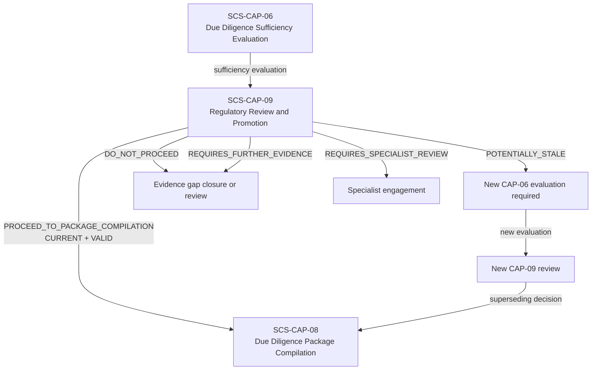
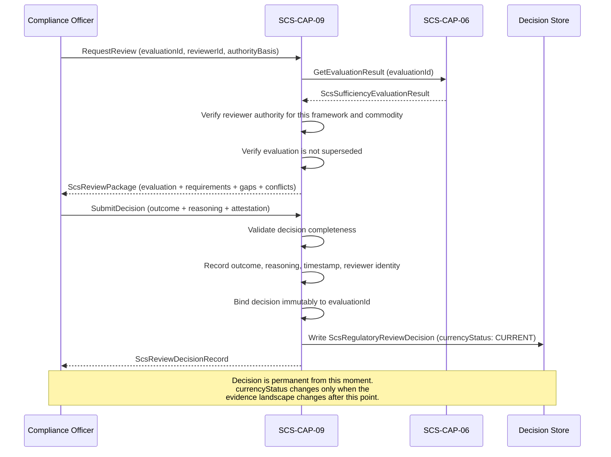

# SCS-CAP-09 — Regulatory Review and Promotion — Canonical Contract — 2026-09-22

**Status:** CANONICAL CONTRACT — NOT IMPLEMENTATION
**Domain:** Supply Chain Sovereignty (SCS)
**Authority:** DEFINES THE CONTRACT FOR SCS-CAP-09. Establishes no commissioning, 
production, Gate D, WP05, scientific-validity or regulatory authority. This 
capability is PROPOSED_NOT_ADMITTED. No implementation exists.

## Plain-English boundary statement

SCS-CAP-09 is the human gate before any due diligence package can be compiled. 
A qualified compliance officer with appropriate authority reviews a specific 
SCS-CAP-06 sufficiency evaluation and makes a recorded, attributable, permanent 
decision about whether to proceed toward package compilation. That decision is 
permanently and immutably bound to the exact CAP-06 evaluation it reviewed. It 
does not declare legal compliance. It does not substitute for submission to or 
acceptance by a regulatory authority. It authorises a workflow step under human 
responsibility — nothing more.

## The governing rule

> The decision remains a permanent record of what was decided from a specific 
> evidential state. Changes to that state affect whether the decision may still 
> be relied upon, not whether the historical decision occurred.

## Three distinct properties of every CAP-09 decision

Every CAP-09 decision carries three properties that must never be conflated:

| Property | Meaning |
|---|---|
| `decisionOutcome` | What the officer decided at that moment — permanent and immutable |
| `recordValidity` | Whether the decision record is authentic and procedurally valid |
| `currencyStatus` | Whether it still reflects the latest governed evidence landscape |

A decision that was valid when made remains a valid record of what the reviewer 
knew and decided at that moment. What changes when new evidence arrives is 
whether the decision is still current — not whether the historical decision 
occurred.

## Decision outcome vocabulary

CAP-09 does not say "approved" or "compliant." The outcome vocabulary is:

```typescript
type ScsReviewDecisionOutcome =
  | "PROCEED_TO_PACKAGE_COMPILATION"
  | "DO_NOT_PROCEED"
  | "REQUIRES_FURTHER_EVIDENCE"
  | "REQUIRES_SPECIALIST_REVIEW"
  | "REVIEW_ABORTED_FAIL_CLOSED";
```

This keeps the boundary honest. CAP-09 authorises a workflow step under human 
responsibility. It does not declare universal legal compliance. It does not 
substitute for submission to or acceptance by a regulator.

## Currency states

```typescript
type ScsDecisionCurrencyStatus =
  | "CURRENT"
  | "POTENTIALLY_STALE"
  | "SUPERSEDED"
  | "FAIL_CLOSED";
```

**`CURRENT`** — the decision reflects the latest governed evidence landscape 
and the referenced CAP-06 evaluation remains the most recent evaluation for 
this subject and framework.

**`POTENTIALLY_STALE`** — something material has changed after the referenced 
CAP-06 evaluation was made. The decision outcome and reasoning are preserved 
exactly. The flag is system-generated, deterministic, and advisory. CAP-09 
must not automatically revoke the original decision or manufacture a 
replacement.

**`SUPERSEDED`** — a new CAP-09 decision has been made referencing a newer 
CAP-06 evaluation for the same subject and framework. The earlier decision 
remains immutable with its original outcome and reasoning intact. It is not 
historically invalid — it is no longer the current decision.

**`FAIL_CLOSED`** — the currency of this decision cannot be determined. 
CAP-08 must refuse to use it.

## What triggers POTENTIALLY_STALE

The currency status becomes `POTENTIALLY_STALE` when any of the following 
occurs after the decision's referenced CAP-06 evaluation:

- New evidence is admitted for any plot in scope
- Existing evidence is withdrawn, quarantined, or materially reclassified
- Plot identity, boundary, tenure, or registry verification changes
- A contradiction or gap resolution is added or withdrawn
- The applicable CAP-01 framework association or version changes
- The CAP-06 evaluation is superseded by a newer evaluation
- Evidence provenance or integrity is challenged

This flag is deterministic and system-generated. It does not invalidate the 
decision. It signals that a new CAP-06 evaluation and a new human review may 
be warranted before the decision is relied upon for package compilation.

## The downstream gate — CAP-08 dependency

SCS-CAP-08 may compile a due diligence package only from a CAP-09 decision 
that satisfies all of the following:

- `recordValidity` is `VALID`
- `currencyStatus` is `CURRENT`
- The referenced CAP-06 evaluation ID exactly matches the package inputs
- The referenced CAP-01 framework version exactly matches the package inputs
- The decision outcome is `PROCEED_TO_PACKAGE_COMPILATION`

If the decision is `POTENTIALLY_STALE`, `SUPERSEDED`, missing, unverifiable, 
or mismatched on any parameter, CAP-08 must fail closed and require 
re-evaluation and new human review. This does not erase the decision — it 
prevents continued reliance on it for a new package.

## Domain position



## Review decision workflow



## Core interfaces

### Review request

```typescript
interface ScsRegulatoryReviewRequest {
  requestId: string;
  requestedBy: ActorReference;
  requestedAt: string;

  // The specific CAP-06 evaluation being reviewed
  // This binding is permanent once the decision is made
  evaluationId: string;

  // Reviewer authority
  reviewerAuthorityBasis: string;
  reviewerOrganizationId: string;
  reviewerRoleReference: string;

  // Context for the review
  commodityCode: string;
  frameworkId: string;
  frameworkVersion: string;
  operatorId: string;
}
```

### Review decision record — immutable once created

```typescript
interface ScsRegulatoryReviewDecision {
  decisionId: string;
  schemaVersion: string;

  // Permanent binding to the exact evaluation reviewed
  // This reference never changes after the decision is recorded
  evaluationId: string;
  evaluationSnapshotDigest: string;

  // Framework and commodity context — frozen at decision time
  frameworkId: string;
  frameworkVersion: string;
  evidenceRequirementSpecId: string;
  commodityCode: string;
  operatorId: string;
  plotIds: string[];

  // Property 1 — what was decided — permanent and immutable
  decisionOutcome: ScsReviewDecisionOutcome;

  // Reviewer must record substantive reasoning
  // Cannot be a generic statement
  reviewReasoning: {
    evaluationSummaryAssessed: string;
    gapsConsidered: string[];
    conflictsConsidered: string[];
    limitationsAcknowledged: string[];
    basisForOutcome: string;
    remainingConcerns?: string[];
    conditionsIfAny?: string[];
  };

  // Reviewer identity and authority — permanent
  reviewer: {
    reviewerId: string;
    reviewerName: string;
    reviewerOrganizationId: string;
    reviewerRoleReference: string;
    authorityBasis: string;
    authorityVerifiedAt: string;
  };

  // Decision timestamp — permanent
  decidedAt: string;

  // Property 2 — procedural validity
  recordValidity:
    | "VALID"
    | "PROCEDURALLY_INVALID"
    | "UNDER_CHALLENGE"
    | "SUPERSEDED_BY_CORRECTION";

  // Property 3 — currency — the only mutable property
  // Updated by the system when the landscape changes
  currencyStatus: ScsDecisionCurrencyStatus;
  currencyLastAssessedAt: string;

  // If POTENTIALLY_STALE — what changed
  stalenessReasons?: Array<{
    changeType: string;
    changedAt: string;
    changedEntityId: string;
    explanation: string;
  }>;

  // If SUPERSEDED — what supersedes this decision
  supersededByDecisionId?: string;
  supersededAt?: string;

  // This decision does not declare compliance
  authorityBoundary: {
    authorisesWorkflowStepOnly: true;
    noComplianceDetermination: true;
    noRegulatorySubmissionAuthority: true;
    doesNotSubstituteForRegulatoryAcceptance: true;
    legalResponsibilityRemainsWithOperator: true;
  };
}
```

### Superseding decision

When the landscape changes and a new review is required, the new decision 
references both the new CAP-06 evaluation and the earlier CAP-09 decision 
it supersedes.

```typescript
interface ScsSupersedingReviewDecision extends ScsRegulatoryReviewDecision {
  // The new CAP-06 evaluation this decision is based on
  evaluationId: string;

  // The earlier decision being superseded
  supersedes: {
    priorDecisionId: string;
    priorEvaluationId: string;
    priorDecisionOutcome: ScsReviewDecisionOutcome;
    priorDecidedAt: string;
    supersessionReason: string;
  };
}
```

The earlier decision's `currencyStatus` is updated to `SUPERSEDED`. Its 
`decisionOutcome` and `reviewReasoning` remain permanently unchanged.

### Currency assessment — system generated

```typescript
interface ScsDecisionCurrencyAssessment {
  decisionId: string;
  assessedAt: string;
  currencyStatus: ScsDecisionCurrencyStatus;

  // What was checked
  checksPerformed: Array<{
    checkType: string;
    checkResult: "UNCHANGED" | "CHANGED" | "UNAVAILABLE";
    detail?: string;
  }>;

  // What changed — if POTENTIALLY_STALE
  materialChanges: Array<{
    changeType:
      | "NEW_EVIDENCE_ADMITTED"
      | "EVIDENCE_WITHDRAWN_OR_QUARANTINED"
      | "EVIDENCE_RECLASSIFIED"
      | "PLOT_IDENTITY_CHANGED"
      | "PLOT_BOUNDARY_CHANGED"
      | "TENURE_RECORD_CHANGED"
      | "REGISTRY_VERIFICATION_CHANGED"
      | "CONFLICT_RESOLUTION_ADDED_OR_WITHDRAWN"
      | "FRAMEWORK_VERSION_CHANGED"
      | "CAP06_EVALUATION_SUPERSEDED"
      | "EVIDENCE_INTEGRITY_CHALLENGED"
      | "OTHER";
    changedAt: string;
    changedEntityId: string;
    explanation: string;
  }>;
}
```

## What a reviewer must record

The review reasoning cannot be a generic statement. The reviewer must address:

- Which sufficiency evaluation was reviewed and what it found
- Which gaps were considered and how they were weighed
- Which conflicts were considered and whether they were material
- Which limitations were acknowledged
- The specific basis for the outcome chosen
- Any remaining concerns that do not block the outcome
- Any conditions attached to the outcome

A reviewer must not be allowed to approve proceeding merely by selecting 
`PROCEED_TO_PACKAGE_COMPILATION` without substantive reasoning. The 
`reviewReasoning` fields are required. An empty or generic reasoning record 
produces `recordValidity: PROCEDURALLY_INVALID`.

## Provider-neutral interface

```typescript
interface ScsRegulatoryReviewProvider {
  requestReview(
    request: ScsRegulatoryReviewRequest
  ): Promise<ScsReviewPackage>;

  submitDecision(
    decisionId: string,
    decision: ScsRegulatoryReviewDecision
  ): Promise<ScsRegulatoryReviewDecision>;

  getDecision(
    decisionId: string
  ): Promise<ScsRegulatoryReviewDecision>;

  assessCurrency(
    decisionId: string
  ): Promise<ScsDecisionCurrencyAssessment>;

  listDecisionsForSubject(
    operatorId: string,
    frameworkId: string,
    plotIds?: string[]
  ): Promise<ScsRegulatoryReviewDecision[]>;

  // CAP-08 calls this before compiling any package
  validateForPackageCompilation(
    decisionId: string,
    packageInputs: ScsPackageCompilationInputs
  ): Promise<ScsDecisionPackageValidationResult>;
}

interface ScsDecisionPackageValidationResult {
  valid: boolean;
  decisionId: string;
  currencyStatus: ScsDecisionCurrencyStatus;
  recordValidity: string;
  evaluationIdMatches: boolean;
  frameworkVersionMatches: boolean;
  outcomePermitsCompilation: boolean;
  
  // If not valid — what must happen before compilation
  blockers: Array<{
    blockerType: string;
    explanation: string;
    requiredAction: string;
  }>;
}
```

## Failure contract

```typescript
interface ScsRegulatoryReviewFailure {
  ok: false;
  capabilityId: "SCS-CAP-09";
  result: "FAIL_CLOSED";

  error:
    | "REVIEWER_NOT_AUTHORISED"
    | "EVALUATION_NOT_FOUND"
    | "EVALUATION_ALREADY_SUPERSEDED"
    | "EVALUATION_INTEGRITY_FAILED"
    | "REASONING_INCOMPLETE"
    | "DECISION_ALREADY_RECORDED"
    | "FRAMEWORK_MISMATCH"
    | "DEPENDENCY_UNAVAILABLE";

  reasons: string[];
  noDecisionRecorded: true;
}
```

## What this document does not establish

- It does not admit SCS-CAP-09 as a canonical capability — that requires 
  the ten-point admission checklist
- It does not implement, deploy or migrate anything
- It does not declare any commodity, plot, or supply chain legally compliant
- `PROCEED_TO_PACKAGE_COMPILATION` means a qualified human reviewer has 
  authorised the next workflow step — it does not mean legally compliant, 
  approved for market, or accepted by a regulator
- It does not alter commissioning status, satisfy Gate D, close WP05, or 
  grant any production or commissioning authority
- The legal responsibility for any due diligence statement remains at all 
  times with the named human operator
