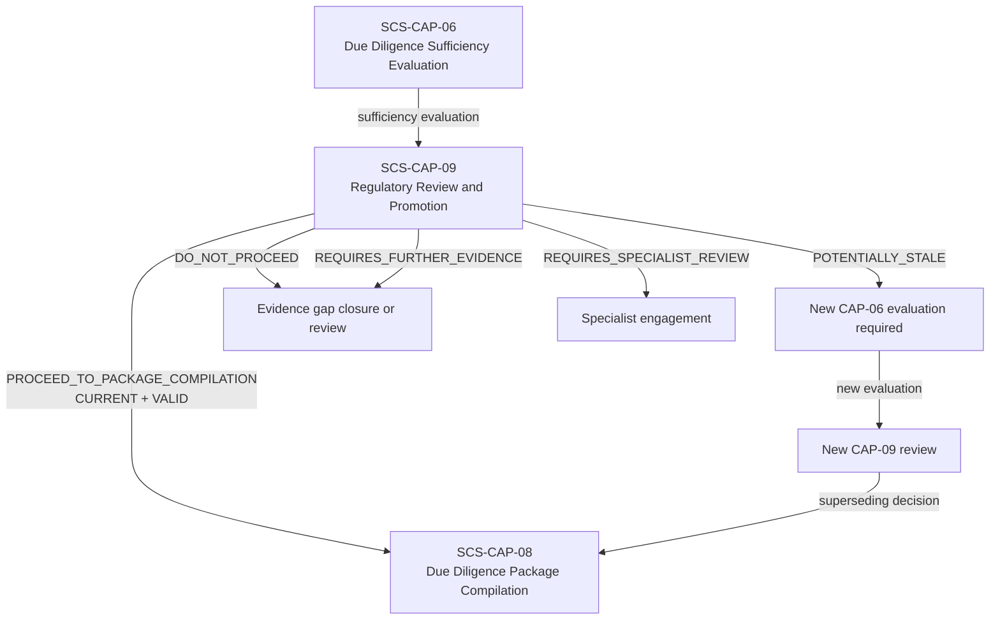
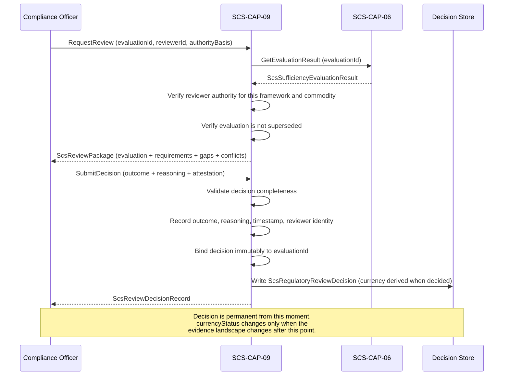

# SCS-CAP-09 — Regulatory Review and Promotion — Canonical Contract — 2026-09-22

**Status:** CANONICAL CONTRACT — NOT IMPLEMENTATION
**Domain:** Supply Chain Sovereignty (SCS)
**Authority:** DEFINES THE CONTRACT FOR SCS-CAP-09. Establishes no commissioning, 
production, Gate D, WP05, scientific-validity or regulatory authority. This 
capability is PROPOSED_NOT_ADMITTED. No implementation exists.

## Plain-English boundary statement

SCS-CAP-09 is the human gate before any due diligence package can be compiled. 
A qualified compliance officer with appropriate authority reviews a specific 
SCS-CAP-06 sufficiency evaluation and makes a recorded, attributable, permanent 
decision about whether to proceed toward package compilation. That decision is 
permanently and immutably bound to the exact CAP-06 evaluation it reviewed. It 
does not declare legal compliance. It does not substitute for submission to or 
acceptance by a regulatory authority. It authorises a workflow step under human 
responsibility — nothing more.

## The governing rule

> The decision remains a permanent record of what was decided from a specific 
> evidential state. Changes to that state affect whether the decision may still 
> be relied upon, not whether the historical decision occurred.

## Three distinct properties of every CAP-09 decision

Every CAP-09 decision carries three properties that must never be conflated:

| Property | Meaning |
|---|---|
| `decisionOutcome` | What the officer decided at that moment — permanent and immutable |
| `recordValidity` | Whether the decision record is authentic and procedurally valid |
| `currencyStatus` | Whether it still reflects the latest governed evidence landscape |

A decision that was valid when made remains a valid record of what the reviewer 
knew and decided at that moment. What changes when new evidence arrives is 
whether the decision is still current — not whether the historical decision 
occurred.

## Decision outcome vocabulary

CAP-09 does not say "approved" or "compliant." The outcome vocabulary is:

```typescript
type ScsReviewDecisionOutcome =
  | "PROCEED_TO_PACKAGE_COMPILATION"
  | "DO_NOT_PROCEED"
  | "REQUIRES_FURTHER_EVIDENCE"
  | "REQUIRES_SPECIALIST_REVIEW"
  | "REVIEW_ABORTED_FAIL_CLOSED";
```

This keeps the boundary honest. CAP-09 authorises a workflow step under human 
responsibility. It does not declare universal legal compliance. It does not 
substitute for submission to or acceptance by a regulator.

## Currency states

```typescript
type ScsDecisionCurrencyStatus =
  | "CURRENT"
  | "POTENTIALLY_STALE"
  | "SUPERSEDED"
  | "FAIL_CLOSED";
```

**`CURRENT`** — the decision reflects the latest governed evidence landscape 
and the referenced CAP-06 evaluation remains the most recent evaluation for 
this subject and framework.

**`POTENTIALLY_STALE`** — something material has changed after the referenced 
CAP-06 evaluation was made. The decision outcome and reasoning are preserved 
exactly. The flag is system-generated, deterministic, and advisory. CAP-09 
must not automatically revoke the original decision or manufacture a 
replacement.

**`SUPERSEDED`** — a new CAP-09 decision has been made referencing a newer 
CAP-06 evaluation for the same subject and framework. The earlier decision 
remains immutable with its original outcome and reasoning intact. It is not 
historically invalid — it is no longer the current decision.

**`FAIL_CLOSED`** — the currency of this decision cannot be determined. 
CAP-08 must refuse to use it.

## What triggers POTENTIALLY_STALE

The currency status becomes `POTENTIALLY_STALE` when any of the following 
occurs after the decision's referenced CAP-06 evaluation:

- New evidence is admitted for any plot in scope
- Existing evidence is withdrawn, quarantined, or materially reclassified
- Plot identity, boundary, tenure, or registry verification changes
- A contradiction or gap resolution is added or withdrawn
- The applicable CAP-01 framework association or version changes
- The CAP-06 evaluation is superseded by a newer evaluation
- Evidence provenance or integrity is challenged

This flag is deterministic and system-generated. It does not invalidate the 
decision. It signals that a new CAP-06 evaluation and a new human review may 
be warranted before the decision is relied upon for package compilation.

## The downstream gate — CAP-08 dependency

SCS-CAP-08 may compile a due diligence package only from a CAP-09 decision 
that satisfies all of the following:

- `recordValidity` is `VALID`
- `currencyStatus` is `CURRENT`
- The referenced CAP-06 evaluation ID exactly matches the package inputs
- The referenced CAP-01 framework version exactly matches the package inputs
- The decision outcome is `PROCEED_TO_PACKAGE_COMPILATION`

If the decision is `POTENTIALLY_STALE`, `SUPERSEDED`, missing, unverifiable, 
or mismatched on any parameter, CAP-08 must fail closed and require 
re-evaluation and new human review. This does not erase the decision — it 
prevents continued reliance on it for a new package.

## Domain position



## Review decision workflow



## Core interfaces

### Review request

```typescript
interface ScsRegulatoryReviewRequest {
  requestId: string;
  requestedBy: ActorReference;
  requestedAt: string;

  // The specific CAP-06 evaluation being reviewed
  // This binding is permanent once the decision is made
  evaluationId: string;

  // Reviewer authority
  reviewerAuthorityBasis: string;
  reviewerOrganizationId: string;
  reviewerRoleReference: string;

  // Context for the review
  commodityCode: string;
  frameworkId: string;
  frameworkVersion: string;
  operatorId: string;
}
```

### Review decision record — immutable once created

```typescript
interface ScsRegulatoryReviewDecision {
  decisionId: string;
  schemaVersion: string;

  // Permanent binding to the exact evaluation reviewed
  // This reference never changes after the decision is recorded
  evaluationId: string;
  evaluationSnapshotDigest: string;

  // Framework and commodity context — frozen at decision time
  frameworkId: string;
  frameworkVersion: string;
  evidenceRequirementSpecId: string;
  commodityCode: string;
  operatorId: string;
  plotIds: string[];

  // Property 1 — what was decided — permanent and immutable
  decisionOutcome: ScsReviewDecisionOutcome;

  // Reviewer must record substantive reasoning
  // Cannot be a generic statement
  reviewReasoning: {
    evaluationSummaryAssessed: string;
    // Every gap the evaluation reports, each with how it was weighed
    gapsConsidered: Array<{ gapId: string; assessment: string }>;
    // Every conflict the evaluation reports as unresolved, each with whether it was material
    conflictsConsidered: Array<{ conflictKey: string; assessment: string }>;
    limitationsAcknowledged: string[];
    basisForOutcome: string;
    remainingConcerns?: string[];
    conditionsIfAny?: string[];
  };

  // Reviewer identity and authority — permanent
  reviewer: {
    // The authenticated actor
    reviewerId: string;
    // Declared by the reviewer
    reviewerName: string;
    // A registered SCS-CAP-02 party
    reviewerOrganizationId: string;
    // Declared by the reviewer
    reviewerRoleReference: string;
    // Declared; not verified (no authority model exists)
    authorityBasis: string;
    // When the reviewer's role was checked — never a verification of authorityBasis
    authorityVerifiedAt: string;
  };

  // Decision timestamp — permanent
  decidedAt: string;

  // Property 2 — procedural validity
  recordValidity:
    | "VALID"
    | "PROCEDURALLY_INVALID"
    | "UNDER_CHALLENGE"
    | "SUPERSEDED_BY_CORRECTION";

  // Property 3 — currency — derived when the decision is read or assessed,
  // never stored: the decision record itself is never changed
  currencyStatus: ScsDecisionCurrencyStatus;
  currencyLastAssessedAt: string;

  // If POTENTIALLY_STALE — what changed
  stalenessReasons?: Array<{
    changeType: string;
    changedAt: string;
    changedEntityId: string;
    explanation: string;
  }>;

  // If SUPERSEDED — what supersedes this decision (derived)
  supersededByDecisionId?: string;
  supersededAt?: string;

  // System-generated disclosures: the authority basis is as declared, and a
  // PROCEED on a GAPS_REQUIRE_HUMAN_DECISION evaluation is a human decision on
  // disclosed gaps
  decisionReasons: string[];

  // This decision does not declare compliance
  authorityBoundary: {
    authorisesWorkflowStepOnly: true;
    noComplianceDetermination: true;
    noRegulatorySubmissionAuthority: true;
    doesNotSubstituteForRegulatoryAcceptance: true;
    legalResponsibilityRemainsWithOperator: true;
  };
}
```

### Superseding decision

When the landscape changes and a new review is required, the new decision 
references both the new CAP-06 evaluation and the earlier CAP-09 decision 
it supersedes.

```typescript
interface ScsSupersedingReviewDecision extends ScsRegulatoryReviewDecision {
  // The new CAP-06 evaluation this decision is based on
  evaluationId: string;

  // The earlier decision being superseded
  supersedes: {
    priorDecisionId: string;
    priorEvaluationId: string;
    priorDecisionOutcome: ScsReviewDecisionOutcome;
    priorDecidedAt: string;
    supersessionReason: string;
  };
}
```

The earlier decision's `currencyStatus` is updated to `SUPERSEDED`. Its 
`decisionOutcome` and `reviewReasoning` remain permanently unchanged.

### Currency assessment — system generated

```typescript
interface ScsDecisionCurrencyAssessment {
  decisionId: string;
  assessedAt: string;
  // Who requested the assessment: every recorded assessment is attributable
  assessedBy: ActorReference;
  currencyStatus: ScsDecisionCurrencyStatus;

  // What was checked
  checksPerformed: Array<{
    checkType: string;
    checkResult: "UNCHANGED" | "CHANGED" | "UNAVAILABLE";
    detail?: string;
  }>;

  // What changed — if POTENTIALLY_STALE
  materialChanges: Array<{
    changeType:
      | "NEW_EVIDENCE_ADMITTED"
      | "EVIDENCE_WITHDRAWN_OR_QUARANTINED"
      | "EVIDENCE_RECLASSIFIED"
      | "PLOT_IDENTITY_CHANGED"
      | "PLOT_BOUNDARY_CHANGED"
      | "TENURE_RECORD_CHANGED"
      | "REGISTRY_VERIFICATION_CHANGED"
      | "CONFLICT_RESOLUTION_ADDED_OR_WITHDRAWN"
      | "FRAMEWORK_VERSION_CHANGED"
      | "CAP06_EVALUATION_SUPERSEDED"
      | "EVIDENCE_INTEGRITY_CHALLENGED"
      | "OTHER";
    changedAt: string;
    changedEntityId: string;
    explanation: string;
  }>;
}
```

## What a reviewer must record

The review reasoning cannot be a generic statement. The reviewer must address:

- Which sufficiency evaluation was reviewed and what it found
- Which gaps were considered and how they were weighed
- Which conflicts were considered and whether they were material
- Which limitations were acknowledged
- The specific basis for the outcome chosen
- Any remaining concerns that do not block the outcome
- Any conditions attached to the outcome

A reviewer must not be allowed to approve proceeding merely by selecting 
`PROCEED_TO_PACKAGE_COMPILATION` without substantive reasoning. The 
`reviewReasoning` fields are required. An empty or generic reasoning record 
is refused (`REASONING_INCOMPLETE`) and nothing is recorded (see "Review rules for the pilot").

## Review rules for the pilot

These rules define `submitDecision`, `getDecision` and `assessCurrency` for the pilot. Every
condition in the failure contract ends in `FAIL_CLOSED` and records nothing. A recorded decision
is permanent: nothing about it is ever changed.

### One step, bound to what was reviewed

The pilot has no separate `requestReview` step. The reviewer reads the SCS-CAP-06 evaluation
through `getEvaluationResult` and submits the decision with the `evaluationSnapshotDigest` of
what they reviewed: the SHA-256 of the canonical JSON of that result. It must equal the digest
of the recorded result (`EVALUATION_DIGEST_MISMATCH`). This proves the reviewer decided on
exactly the evaluation that is recorded. `ScsReviewPackage` is not used.

### Authority and the reviewer's identity

- **Role.** Only an actor holding `REGULATORY_REVIEWER` may submit a decision
  (`REVIEWER_NOT_AUTHORISED`). It is separate from `COMPLIANCE_OFFICER`,
  `VERIFICATION_OFFICER` and `CONFLICT_RESOLVER`: requesting an evaluation never confers
  review authority.
- **Independence.** The reviewer is not the actor who requested the evaluation, and did not
  resolve any conflict resolution the evaluation applied (`REVIEWER_NOT_AUTHORISED`).
- **Identity.**
  - `reviewer.reviewerId` is the actor.
  - `reviewerName` and `reviewerRoleReference` are recorded as declared.
  - `reviewerOrganizationId` must be a registered SCS-CAP-02 party that is not `RETIRED`
    (`REVIEWER_ORGANIZATION_NOT_FOUND`).
- **Authority basis.** No model exists of which reviewer may decide for which framework and
  commodity, so `authorityBasis` is recorded as declared, and the decision says so.
  `authorityVerifiedAt` is the time the reviewer's role was checked: it never presents the
  declared authority as verified.

### The evaluation reviewed

- It must be recorded (`EVALUATION_NOT_FOUND`).
- **Integrity.** Its stored result must still be exactly the result its receipt records, and
  the receipt must still hash to its recorded digest (`EVALUATION_INTEGRITY_FAILED`). This
  catches tampering or corruption between evaluation and review. It is distinct from
  `EVALUATION_DIGEST_MISMATCH`, where the reviewer reviewed a different version.
- **Not superseded.** No later evaluation of the same subject (the SCS-CAP-06 subject: plots,
  commodity, framework and batches) exists (`EVALUATION_ALREADY_SUPERSEDED`).
- **Context.** `frameworkId`, `frameworkVersion` and `commodityCode` must equal the
  evaluation's (`FRAMEWORK_MISMATCH`).
- **Operator.** `operatorId` must be a registered SCS-CAP-02 party that is not `RETIRED`
  (`OPERATOR_PARTY_NOT_FOUND`). When the evaluation names an operator (a custody subject), it
  must be that one (`OPERATOR_MISMATCH`).

### Outcomes

- **Permitted outcomes follow the evaluation.** `PROCEED_TO_PACKAGE_COMPILATION` is permitted
  only when the evaluation is `GAPS_REQUIRE_HUMAN_DECISION` or `SUFFICIENT`. It is refused
  (`OUTCOME_NOT_PERMITTED`) on:
  - `INSUFFICIENT`: human review cannot cure missing evidence;
  - `CONFLICTING_EVIDENCE`: a conflict is resolved only through a recorded SCS-CAP-06 conflict
    resolution and a new evaluation.

  `DO_NOT_PROCEED`, `REQUIRES_FURTHER_EVIDENCE` and `REQUIRES_SPECIALIST_REVIEW` are always
  permitted.
- **`REVIEW_ABORTED_FAIL_CLOSED` is never recorded.** A review that cannot proceed fails
  closed and records nothing, the same rule as `FAIL_CLOSED` in SCS-CAP-06.
- **The honest pilot result.** No pilot evaluation can be `SUFFICIENT` (SCS-CAP-06:
  spatial coverage is not evaluated). So every pilot `PROCEED_TO_PACKAGE_COMPILATION` is a
  human deciding on disclosed gaps. The decision's `decisionReasons` state this every time;
  it is never optional.

### Reasoning

Generic reasoning is refused, and nothing is recorded (`REASONING_INCOMPLETE`, naming every
problem). A recorded decision is therefore always procedurally valid.

- `evaluationSummaryAssessed`, `basisForOutcome` and every assessment are non-blank.
- **Every gap is addressed.** `gapsConsidered` has one entry, with an assessment, for every
  gap the evaluation reports (by `gapId`).
- **Every unresolved conflict is addressed.** `conflictsConsidered` has one entry, with an
  assessment, for every conflict the evaluation reports as unresolved (by `conflictKey`).
  Resolved conflicts may also be addressed.
- No entry may name a gap or conflict the evaluation does not report.

### One decision per evaluation, and supersession

- An evaluation is decided at most once (`DECISION_ALREADY_RECORDED`).
- **The current decision of a subject** is its most recent decision that no later decision
  supersedes.
- **Superseding it.** A decision on a subject that already has a current decision must name
  that decision in `supersedes`, with a reason (`SUPERSEDES_NOT_CURRENT`). A decision naming
  another decision, or naming one where the subject has none, is refused the same way. The
  system fills in the rest of `supersedes` from the earlier decision.
- The earlier decision is never changed. Its `SUPERSEDED` status is derived when read, as is
  `supersededByDecisionId`.

### Fields the system sets

`decisionId`, `schemaVersion`, `decidedAt`, `evaluationSnapshotDigest` (as verified), the frozen
context (`evidenceRequirementSpecId` and `plotIds`, from the evaluation), `reviewer.reviewerId`,
`reviewer.authorityVerifiedAt`, `recordValidity` (`VALID` at creation), `decisionReasons` and
`authorityBoundary`.

### Record validity

A recorded decision is `VALID`. `UNDER_CHALLENGE` and `SUPERSEDED_BY_CORRECTION` require
challenge and correction operations that are not defined (see "Open gaps").

### Currency — derived, never stored

A decision is never updated. Its `currencyStatus`, `currencyLastAssessedAt`,
`stalenessReasons`, `supersededByDecisionId` and `supersededAt` are derived deterministically
whenever the decision is read (`getDecision`) or assessed (`assessCurrency`). Only
`assessCurrency` records its assessment, as an append-only `ScsDecisionCurrencyAssessment`.

**The checks** compare the decision's evaluation with the governed landscape now:

| Change | Checked how | Pilot |
|---|---|---|
| `NEW_EVIDENCE_ADMITTED` | an admitted record in the evaluation's scope that is not in its manifest (a set comparison, correct under concurrency) | checked |
| `CONFLICT_RESOLUTION_ADDED_OR_WITHDRAWN` | a conflict resolution for a conflict the evaluation reported that the evaluation did not apply (see "The conflict-resolution check") | checked for added; none can be withdrawn |
| `CAP06_EVALUATION_SUPERSEDED` | a later evaluation of the same subject | checked |
| `EVIDENCE_WITHDRAWN_OR_QUARANTINED`, `EVIDENCE_RECLASSIFIED`, `PLOT_IDENTITY_CHANGED`, `PLOT_BOUNDARY_CHANGED`, `TENURE_RECORD_CHANGED`, `REGISTRY_VERIFICATION_CHANGED`, `FRAMEWORK_VERSION_CHANGED`, `EVIDENCE_INTEGRITY_CHALLENGED` | no operation can cause them yet | `UNCHANGED`, with a note saying so |

**The status** is the first that applies:

1. `SUPERSEDED`: a later decision supersedes this one;
2. `POTENTIALLY_STALE`: a check found a change;
3. `FAIL_CLOSED`: a check could not be performed (`UNAVAILABLE`), so currency cannot be
   determined;
4. `CURRENT`.

Currency is advisory. It never revokes a decision. SCS-CAP-08 compiles only from a `CURRENT`
decision.

**A decision stale from the start.** Currency is derived when the decision is recorded, too. A
decision may therefore be recorded as `POTENTIALLY_STALE` when evidence was admitted after the
evaluation but before the decision. This is disclosed in the decision and its receipt
(`stalenessReasons`), never a refusal: the reviewer decided on what they reviewed, and the
staleness is a fact about the landscape now, not an invalidation of the review. Refusing it
would let any evidence admitted while a reviewer deliberates block the decision indefinitely.

**Reading and assessing.** A `REGULATORY_REVIEWER` or a `COMPLIANCE_OFFICER` may read a decision
(`getDecision`) or record a currency assessment (`assessCurrency`); any other actor is
`REVIEWER_NOT_AUTHORISED`. An unknown decision is `DECISION_NOT_FOUND`. Every recorded assessment
names the actor who requested it (`assessedBy`). An assessment is not a decision, so it has no
receipt.

### Submission request

```typescript
interface ScsReviewDecisionSubmission {
  evaluationId: string;
  // SHA-256 of the canonical JSON of the evaluation result that was reviewed
  evaluationSnapshotDigest: string;
  frameworkId: string;
  frameworkVersion: string;
  commodityCode: string;
  operatorId: string;

  decisionOutcome: Exclude<ScsReviewDecisionOutcome, "REVIEW_ABORTED_FAIL_CLOSED">;
  reviewReasoning: ScsRegulatoryReviewDecision["reviewReasoning"];

  reviewer: {
    reviewerName: string;
    reviewerOrganizationId: string;
    reviewerRoleReference: string;
    authorityBasis: string;
  };

  // Required when the subject already has a current decision
  supersedes?: {
    priorDecisionId: string;
    supersessionReason: string;
  };
}
```

### Deferred

`requestReview` (see "One step"), `listDecisionsForSubject` and
`validateForPackageCompilation` are built with SCS-CAP-08, which defines the package inputs.

### Open gaps

**Contract gap: reviewer authority.** Which reviewer may decide for which framework and
commodity is not modelled. The authority basis is recorded as declared.

**Contract gap: the reviewer's name.** An authenticated actor has no name. `reviewerName` is
recorded as declared.

**Contract gap: challenge and correction.** How a decision comes to be `UNDER_CHALLENGE` or
`SUPERSEDED_BY_CORRECTION` is not defined.

**Contract gap: staleness triggers with no operation.** Evidence withdrawal, quarantine and
reclassification, plot and tenure changes, framework version changes and integrity challenges
have no operation yet, so they cannot occur and are reported as unchanged.

**Contract gap: an unavailable check.** A check is `UNAVAILABLE` when it cannot be performed.
In the pilot every check reads the same database in one snapshot, and a failed read fails the
whole request (`DEPENDENCY_UNAVAILABLE`), so no check is reported as `UNAVAILABLE` and
`FAIL_CLOSED` currency is not produced. It is recorded, not produced.

**Decision: the conflict-resolution check.** `CONFLICT_RESOLUTION_ADDED_OR_WITHDRAWN` reports
a conflict resolution recorded for a conflict the evaluation reported, which the evaluation did
not apply. SCS-CAP-06 applies every resolution visible to it for a conflict it reports, so such
a resolution was recorded after the evaluation. A resolution for items in scope whose conflict
the evaluation did not report is not reported: it could not have changed the result, and
reporting it would be dishonest. This is a deliberate interpretation, not an open question. The
check is a set comparison, so it is correct under concurrency.

**Contract gap: package inputs.** `ScsPackageCompilationInputs` is not defined; SCS-CAP-08
defines it.

## Provider-neutral interface

```typescript
interface ScsRegulatoryReviewProvider {
  requestReview(
    request: ScsRegulatoryReviewRequest
  ): Promise<ScsReviewPackage>;

  submitDecision(
    decisionId: string,
    decision: ScsRegulatoryReviewDecision
  ): Promise<ScsRegulatoryReviewDecision>;

  getDecision(
    decisionId: string
  ): Promise<ScsRegulatoryReviewDecision>;

  assessCurrency(
    decisionId: string
  ): Promise<ScsDecisionCurrencyAssessment>;

  listDecisionsForSubject(
    operatorId: string,
    frameworkId: string,
    plotIds?: string[]
  ): Promise<ScsRegulatoryReviewDecision[]>;

  // CAP-08 calls this before compiling any package
  validateForPackageCompilation(
    decisionId: string,
    packageInputs: ScsPackageCompilationInputs
  ): Promise<ScsDecisionPackageValidationResult>;
}

interface ScsDecisionPackageValidationResult {
  valid: boolean;
  decisionId: string;
  currencyStatus: ScsDecisionCurrencyStatus;
  recordValidity: string;
  evaluationIdMatches: boolean;
  frameworkVersionMatches: boolean;
  outcomePermitsCompilation: boolean;
  
  // If not valid — what must happen before compilation
  blockers: Array<{
    blockerType: string;
    explanation: string;
    requiredAction: string;
  }>;
}
```

## Failure contract

```typescript
interface ScsRegulatoryReviewFailure {
  ok: false;
  capabilityId: "SCS-CAP-09";
  result: "FAIL_CLOSED";

  error:
    // Not REGULATORY_REVIEWER, or not independent of the evaluation
    | "REVIEWER_NOT_AUTHORISED"
    // reviewerOrganizationId is not a registered, non-retired party
    | "REVIEWER_ORGANIZATION_NOT_FOUND"
    | "EVALUATION_NOT_FOUND"
    // getDecision or assessCurrency: no decision is recorded with that id
    | "DECISION_NOT_FOUND"
    | "EVALUATION_ALREADY_SUPERSEDED"
    // The stored result no longer matches its receipt (tampering or corruption)
    | "EVALUATION_INTEGRITY_FAILED"
    // The digest the reviewer supplied is not the stored result's (they reviewed another version)
    | "EVALUATION_DIGEST_MISMATCH"
    | "REASONING_INCOMPLETE"
    | "DECISION_ALREADY_RECORDED"
    // The subject has a current decision that this decision does not name in supersedes
    | "SUPERSEDES_NOT_CURRENT"
    | "FRAMEWORK_MISMATCH"
    // operatorId is not a registered, non-retired party
    | "OPERATOR_PARTY_NOT_FOUND"
    // operatorId is not the evaluation's operator
    | "OPERATOR_MISMATCH"
    // PROCEED_TO_PACKAGE_COMPILATION on an INSUFFICIENT or CONFLICTING_EVIDENCE evaluation
    | "OUTCOME_NOT_PERMITTED"
    | "DEPENDENCY_UNAVAILABLE";

  reasons: string[];
  noDecisionRecorded: true;
}
```

## What this document does not establish

- It does not admit SCS-CAP-09 as a canonical capability — that requires 
  the ten-point admission checklist
- It does not implement, deploy or migrate anything
- It does not declare any commodity, plot, or supply chain legally compliant
- `PROCEED_TO_PACKAGE_COMPILATION` means a qualified human reviewer has 
  authorised the next workflow step — it does not mean legally compliant, 
  approved for market, or accepted by a regulator
- It does not alter commissioning status, satisfy Gate D, close WP05, or 
  grant any production or commissioning authority
- The legal responsibility for any due diligence statement remains at all 
  times with the named human operator
